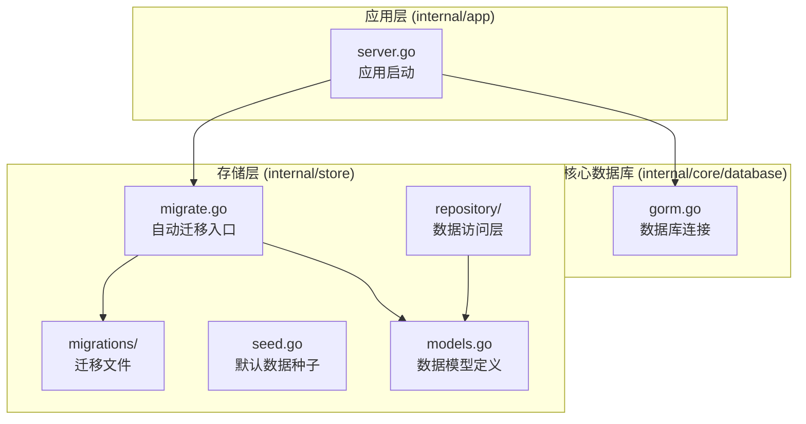
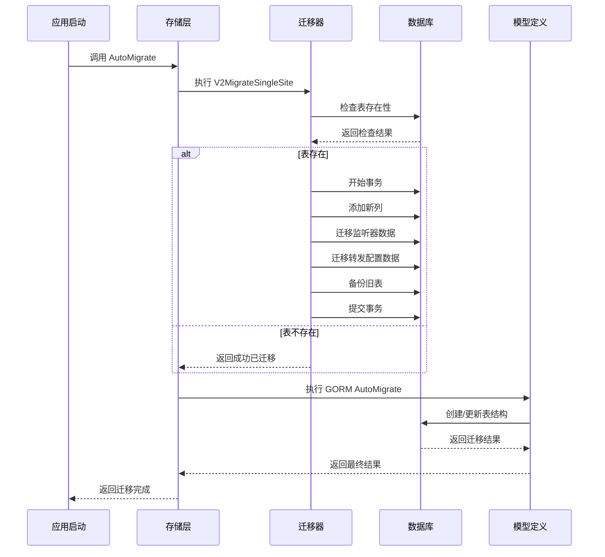
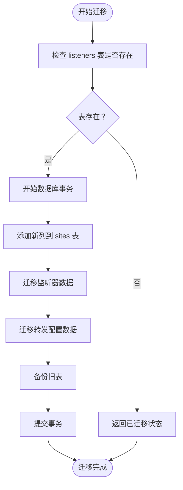
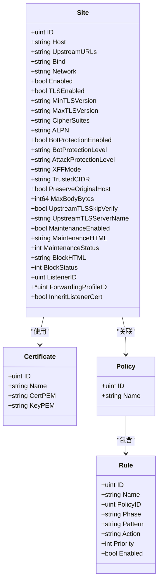
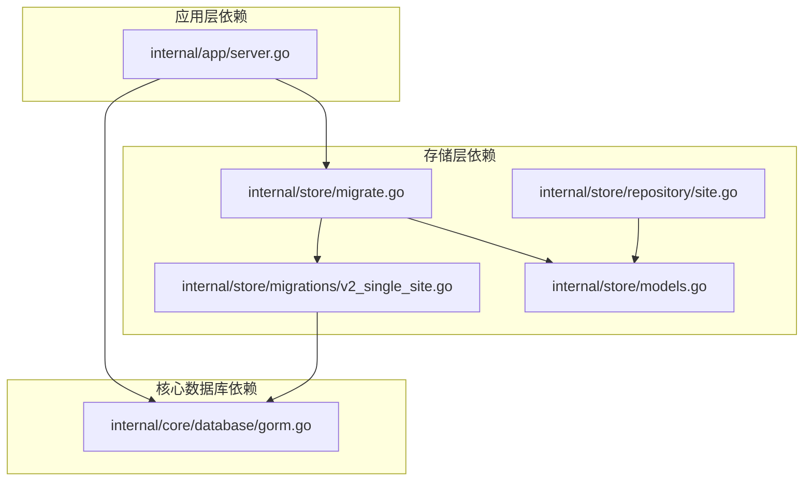
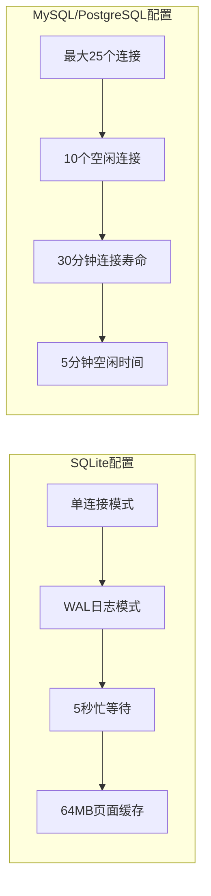
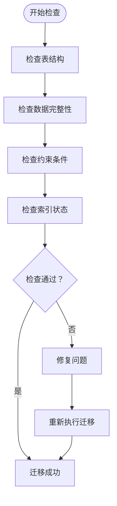

# 存储迁移机制

<cite>
**本文档引用的文件**
- [v2_single_site.go](file://internal/store/migrations/v2_single_site.go)
- [migrate.go](file://internal/store/migrate.go)
- [models.go](file://internal/store/models.go)
- [site.go](file://internal/store/repository/site.go)
- [server.go](file://internal/app/server.go)
- [gorm.go](file://internal/core/database/gorm.go)
- [seed.go](file://internal/store/seed.go)
- [doc.go](file://internal/store/doc.go)
</cite>

## 目录
1. [简介](#简介)
2. [项目结构](#项目结构)
3. [核心组件](#核心组件)
4. [架构概览](#架构概览)
5. [详细组件分析](#详细组件分析)
6. [依赖分析](#依赖分析)
7. [性能考虑](#性能考虑)
8. [故障排除指南](#故障排除指南)
9. [结论](#结论)
10. [附录](#附录)

## 简介

My-OpenWaf 的存储迁移机制是一个设计精良的数据库演进系统，专门用于管理从多站点架构向单站点架构的平滑过渡。该系统通过智能的数据迁移策略，将独立的监听器配置和转发配置合并到站点实体中，实现了更简洁、更高效的数据库结构。

本系统采用事务性迁移策略，确保数据迁移的原子性和一致性，同时提供了完整的回滚机制和错误处理策略。迁移过程被设计为幂等操作，允许在迁移过程中重复执行而不会产生副作用。

## 项目结构

存储迁移机制主要分布在以下关键目录中：



**图表来源**
- [migrate.go:1-56](file://internal/store/migrate.go#L1-L56)
- [models.go:1-456](file://internal/store/models.go#L1-L456)
- [server.go:35-490](file://internal/app/server.go#L35-L490)

**章节来源**
- [migrate.go:1-56](file://internal/store/migrate.go#L1-L56)
- [doc.go:1-4](file://internal/store/doc.go#L1-L4)

## 核心组件

### 迁移入口点

AutoMigrate 函数是整个迁移系统的入口点，负责协调数据迁移和模式迁移的执行顺序。

### 数据迁移与模式迁移分离

系统采用两阶段迁移策略：
1. **数据迁移阶段**：处理历史数据的转换和迁移
2. **模式迁移阶段**：应用新的数据库结构变更

这种分离确保了数据完整性的优先级，避免了模式变更对现有数据的影响。

### 幂等性设计

所有迁移操作都设计为幂等，通过检查表的存在状态来避免重复执行。

**章节来源**
- [migrate.go:9-37](file://internal/store/migrate.go#L9-L37)

## 架构概览

存储迁移机制的整体架构体现了清晰的关注点分离和职责划分：



**图表来源**
- [server.go:46-49](file://internal/app/server.go#L46-L49)
- [migrate.go:10-37](file://internal/store/migrate.go#L10-L37)
- [v2_single_site.go:16-50](file://internal/store/migrations/v2_single_site.go#L16-L50)

## 详细组件分析

### 单站点迁移实现 (V2MigrateSingleSite)

#### 迁移策略概述

V2MigrateSingleSite 函数实现了从独立监听器和转发配置到统一站点实体的迁移。这一过程涉及四个关键步骤：

1. **预检查阶段**：验证是否需要执行迁移
2. **列添加阶段**：为站点表添加必要的新列
3. **数据迁移阶段**：从旧表迁移配置数据
4. **清理阶段**：备份并删除旧表

#### 事务性执行

迁移过程完全在单个事务中执行，确保了操作的原子性：



**图表来源**
- [v2_single_site.go:16-50](file://internal/store/migrations/v2_single_site.go#L16-L50)

#### 新增列定义

迁移过程中为站点表添加了13个新的配置列，涵盖监听器配置、TLS设置、保护配置和转发规则：

| 列名 | 数据类型 | 默认值 | 功能描述 |
|------|----------|--------|----------|
| bind | VARCHAR(255) | ':80' | 监听地址和端口 |
| network | VARCHAR(16) | 'tcp' | 网络协议类型 |
| enabled | BOOLEAN | true | 是否启用站点 |
| tls_enabled | BOOLEAN | false | 是否启用TLS |
| min_tls_version | VARCHAR(32) | 'TLS12' | 最低TLS版本 |
| max_tls_version | VARCHAR(32) | 'TLS13' | 最高TLS版本 |
| cipher_suites | TEXT | - | 加密套件列表 |
| alpn | VARCHAR(255) | 'h2,http/1.1' | ALPN协议列表 |
| bot_protection_enabled | BOOLEAN | false | 机器人防护开关 |
| bot_protection_level | VARCHAR(16) | 'medium' | 机器人防护级别 |
| attack_protection_level | VARCHAR(16) | 'medium' | 攻击防护级别 |
| xff_mode | VARCHAR(64) | 'strip_all_and_set_remote' | X-Forwarded-For处理模式 |
| trusted_cidr | TEXT | - | 可信CIDR列表 |
| preserve_original_host | BOOLEAN | false | 是否保留原始Host头 |

#### 数据迁移逻辑

**监听器数据迁移**：
- 查询条件：仅迁移角色为'data'的监听器
- 迁移字段：bind、network、enabled、tls_enabled、min_tls_version、max_tls_version、alpn
- 迁移方式：基于listener_id关联的站点记录

**转发配置数据迁移**：
- 迁移字段：xff_mode、trusted_c_id_r、preserve_original_host
- 迁移方式：基于forwarding_profile_id关联的站点记录

#### 备份策略

迁移完成后，系统会将旧表重命名为带时间戳的备份名称，格式为 `表名_backup_YYYYMMDD_HHMMSS`。这种策略确保了数据恢复的可能性，同时避免了数据丢失。

**章节来源**
- [v2_single_site.go:10-189](file://internal/store/migrations/v2_single_site.go#L10-L189)

### 迁移接口定义

#### 函数签名规范

所有迁移函数遵循统一的签名规范：
```go
func MigrationName(db *gorm.DB) error
```

参数说明：
- `db *gorm.DB`：GORM数据库连接实例
- 返回值：标准Go错误类型，nil表示成功

#### 错误处理策略

迁移函数采用分层错误处理：
1. **预检查错误**：表存在性检查失败
2. **执行时错误**：SQL执行失败
3. **事务回滚**：任何阶段失败都会触发回滚

#### 回滚机制

由于使用了数据库事务，迁移具备天然的回滚能力：
- 事务开始后发生的任何错误都会导致自动回滚
- 已提交的操作无法撤销，但未提交的操作会被清理
- 事务边界确保了数据的一致性状态

**章节来源**
- [v2_single_site.go:16-50](file://internal/store/migrations/v2_single_site.go#L16-L50)

### 数据模型演进

#### 站点模型重构

迁移后的站点模型整合了所有配置信息，形成了统一的配置实体：



**图表来源**
- [models.go:94-148](file://internal/store/models.go#L94-L148)
- [models.go:14-23](file://internal/store/models.go#L14-L23)
- [models.go:35-92](file://internal/store/models.go#L35-L92)

#### 索引优化策略

迁移后的模型采用了合理的索引策略：

1. **主键索引**：所有实体的ID字段
2. **查询优化索引**：
   - Site.Host：站点主机名查询
   - Site.Bind：监听绑定地址查询
   - Rule.PolicyID：规则分类查询
   - SecurityEvent.CreatedAt：安全事件时间序列查询
3. **复合索引**：针对常用查询组合的优化

#### 约束调整

- **非空约束**：关键字段如Host、UpstreamURLs等设置为NOT NULL
- **默认值**：合理设置字段默认值，减少配置复杂度
- **长度限制**：根据实际需求设置VARCHAR长度限制

**章节来源**
- [models.go:94-148](file://internal/store/models.go#L94-L148)
- [models.go:14-23](file://internal/store/models.go#L14-L23)

### 迁移开发指南

#### 新迁移文件编写

1. **文件命名规范**：使用 `vN_description.go` 格式，如 `v3_add_user_roles.go`
2. **包声明**：使用 `package migrations`
3. **导入依赖**：确保导入 `gorm.io/gorm`
4. **函数签名**：遵循 `func MigrationName(db *gorm.DB) error` 规范

#### 测试验证流程

1. **单元测试**：为每个迁移函数编写独立的测试用例
2. **集成测试**：在测试数据库中执行完整的迁移流程
3. **数据完整性测试**：验证迁移前后数据的一致性
4. **回滚测试**：模拟迁移失败场景，验证回滚机制

#### 生产部署流程

1. **预检查**：确认数据库连接和权限
2. **备份**：执行数据库备份
3. **迁移执行**：在维护窗口内执行迁移
4. **验证**：检查迁移结果和数据完整性
5. **清理**：删除备份或标记为可清理

**章节来源**
- [migrate.go:9-37](file://internal/store/migrate.go#L9-L37)

## 依赖分析

存储迁移机制的依赖关系体现了清晰的层次结构：



**图表来源**
- [server.go:46-49](file://internal/app/server.go#L46-L49)
- [migrate.go:10-37](file://internal/store/migrate.go#L10-L37)
- [v2_single_site.go:16-50](file://internal/store/migrations/v2_single_site.go#L16-L50)

### 组件耦合度分析

- **低耦合**：迁移函数与具体数据库实现解耦
- **高内聚**：每个迁移函数专注于特定的迁移任务
- **接口稳定**：GORM抽象层提供了稳定的数据库访问接口

### 循环依赖检测

系统设计避免了循环依赖：
- 应用层不直接依赖存储层的内部实现
- 存储层保持纯数据访问职责
- 核心数据库层提供稳定的连接服务

**章节来源**
- [server.go:46-49](file://internal/app/server.go#L46-L49)
- [migrate.go:10-37](file://internal/store/migrate.go#L10-L37)

## 性能考虑

### 连接池优化

数据库连接池配置针对不同驱动进行了优化：



**图表来源**
- [gorm.go:25-61](file://internal/core/database/gorm.go#L25-L61)
- [gorm.go:63-94](file://internal/core/database/gorm.go#L63-L94)
- [gorm.go:96-110](file://internal/core/database/gorm.go#L96-L110)

### 查询性能优化

1. **批量操作**：使用事务包装多个操作
2. **索引利用**：合理使用WHERE子句和JOIN操作
3. **内存管理**：及时关闭数据库游标和连接
4. **预编译语句**：启用PrepareStmt缓存

### 迁移性能特性

- **原子性保证**：单事务执行确保操作完整性
- **并发安全**：避免与其他数据库操作冲突
- **资源控制**：限制同时进行的数据库连接数量

**章节来源**
- [gorm.go:25-61](file://internal/core/database/gorm.go#L25-L61)

## 故障排除指南

### 常见问题诊断

#### 迁移失败排查

1. **权限问题**：检查数据库用户权限
2. **连接问题**：验证数据库连接字符串
3. **语法错误**：检查SQL语句正确性
4. **约束冲突**：处理外键约束和唯一性约束

#### 数据完整性检查



#### 回滚策略

如果迁移失败，系统会自动回滚到迁移前的状态。对于部分成功的迁移，需要手动执行清理操作：

1. **删除新增列**：移除迁移过程中添加的新列
2. **恢复备份表**：将备份表重命名为原表名
3. **数据验证**：确认数据完整性和一致性

**章节来源**
- [v2_single_site.go:16-50](file://internal/store/migrations/v2_single_site.go#L16-L50)

### 监控和日志

系统提供了完善的监控和日志机制：
- **迁移进度日志**：记录迁移各阶段的执行情况
- **错误日志**：详细记录迁移失败的原因
- **性能指标**：监控迁移过程中的资源使用情况

## 结论

My-OpenWaf 的存储迁移机制展现了现代数据库演进的最佳实践。通过事务性、幂等性的设计，系统确保了数据迁移的安全性和可靠性。单站点迁移策略有效简化了数据库结构，提高了系统的可维护性。

该机制的关键优势包括：
- **安全性**：事务保证和回滚机制
- **可靠性**：幂等设计和错误处理
- **可维护性**：清晰的架构和模块化设计
- **性能**：优化的连接池和查询策略

未来可以考虑的改进方向：
- 增加迁移进度报告功能
- 实现增量迁移支持
- 添加迁移验证工具
- 优化大数据量迁移的性能

## 附录

### 迁移命令参考

```bash
# 启动应用并执行迁移
./my-openwaf

# 检查当前数据库状态
./my-openwaf --check-db

# 执行特定迁移
./my-openwaf --migrate=v2_single_site
```

### 配置选项

| 环境变量 | 默认值 | 描述 |
|----------|--------|------|
| MY_OPENWAF_DB_DRIVER | sqlite | 数据库驱动选择 |
| MY_OPENWAF_DSN | 自动 | 数据库连接字符串 |
| MY_OPENWAF_DATA_DIR | ./data | 数据文件存储目录 |

### 支持的数据库

- **SQLite**：文件型数据库，适合开发和小型部署
- **MySQL**：企业级关系型数据库
- **PostgreSQL**：功能强大的开源数据库