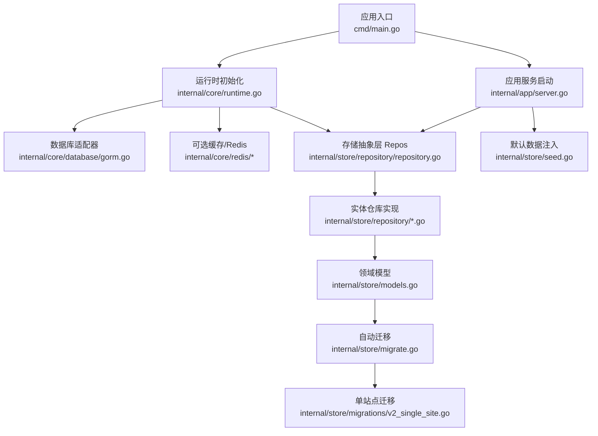
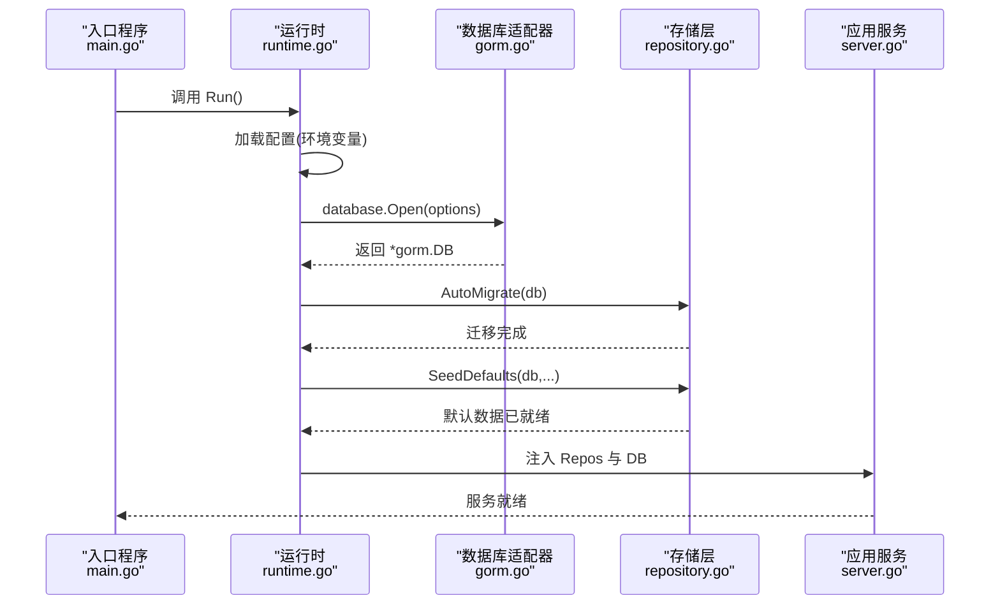
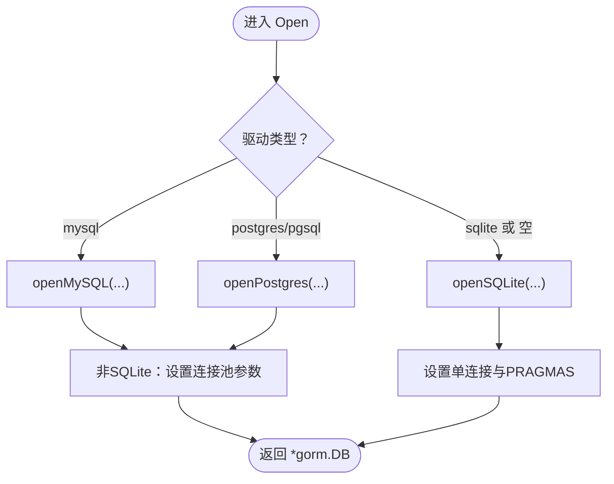
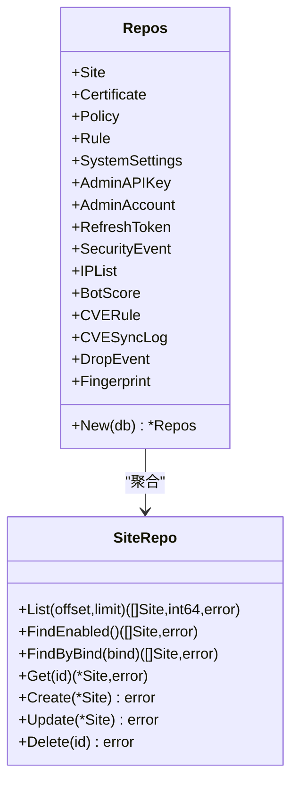
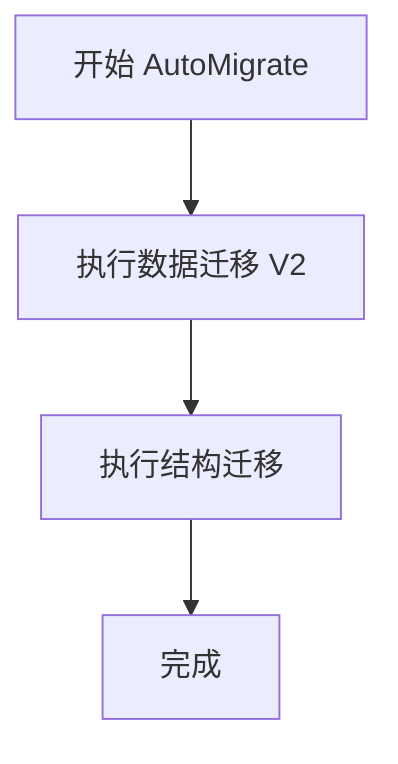
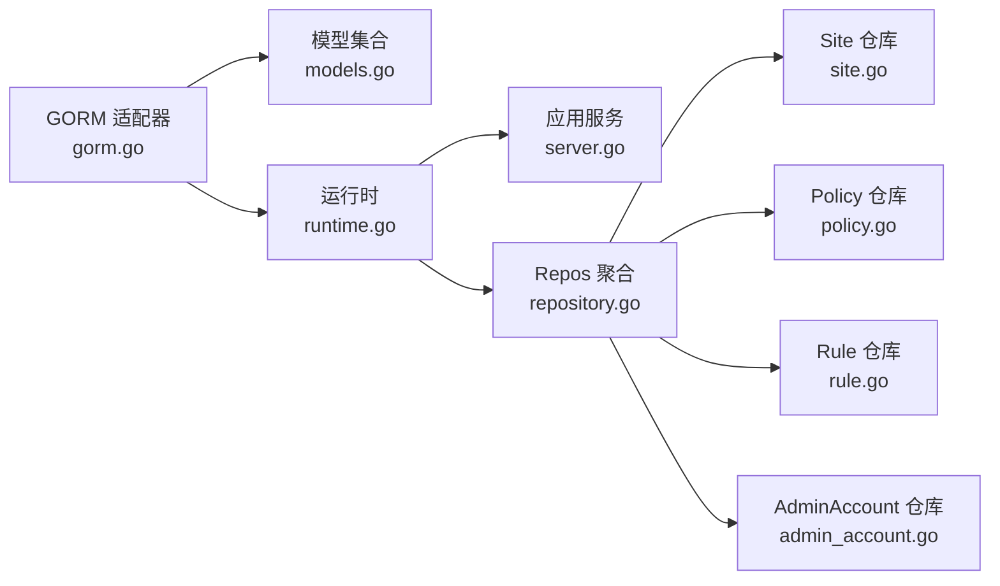

# 数据库适配器

<cite>
**本文引用的文件**
- [gorm.go](file://internal/core/database/gorm.go)
- [repository.go](file://internal/store/repository/repository.go)
- [models.go](file://internal/store/models.go)
- [migrate.go](file://internal/store/migrate.go)
- [config.go](file://internal/core/config.go)
- [runtime.go](file://internal/core/runtime.go)
- [server.go](file://internal/app/server.go)
- [seed.go](file://internal/store/seed.go)
- [admin_account.go](file://internal/store/repository/admin_account.go)
- [site.go](file://internal/store/repository/site.go)
- [policy.go](file://internal/store/repository/policy.go)
- [rule.go](file://internal/store/repository/rule.go)
- [v2_single_site.go](file://internal/store/migrations/v2_single_site.go)
- [main.go](file://cmd/main.go)
</cite>

## 目录
1. [简介](#简介)
2. [项目结构](#项目结构)
3. [核心组件](#核心组件)
4. [架构总览](#架构总览)
5. [详细组件分析](#详细组件分析)
6. [依赖分析](#依赖分析)
7. [性能考虑](#性能考虑)
8. [故障排查指南](#故障排查指南)
9. [结论](#结论)
10. [附录：数据库适配器开发指南](#附录数据库适配器开发指南)

## 简介
本文件系统化梳理 My-OpenWaf 的数据库适配器体系，重点覆盖以下方面：
- 存储抽象层设计：Repos 聚合模式与统一仓库接口
- GORM 集成机制：驱动选择、连接配置、模型定义与查询构建
- 关系型数据库适配器：MySQL 与 PostgreSQL 的具体适配流程
- 方言支持、连接池与事务管理
- 开发指南：新增数据库类型集成步骤与最佳实践
- 性能优化与故障排查

## 项目结构
数据库相关能力主要分布在以下模块：
- 核心配置与运行时：环境变量解析、数据库与 Redis 初始化、生命周期管理
- 数据访问层：统一的 Repos 聚合与各实体仓库实现
- 模型与迁移：领域模型定义与版本化迁移
- 应用入口：启动流程中完成数据库初始化、自动迁移与默认数据注入

图表来源
- [main.go:1-10](file://cmd/main.go#L1-L10)
- [runtime.go:27-80](file://internal/core/runtime.go#L27-L80)
- [gorm.go:24-61](file://internal/core/database/gorm.go#L24-L61)
- [repository.go:5-22](file://internal/store/repository/repository.go#L5-L22)
- [models.go:1-456](file://internal/store/models.go#L1-L456)
- [migrate.go:9-37](file://internal/store/migrate.go#L9-L37)
- [v2_single_site.go:10-50](file://internal/store/migrations/v2_single_site.go#L10-L50)
- [server.go:35-80](file://internal/app/server.go#L35-L80)
- [seed.go:13-61](file://internal/store/seed.go#L13-L61)

章节来源
- [main.go:1-10](file://cmd/main.go#L1-L10)
- [runtime.go:27-80](file://internal/core/runtime.go#L27-L80)
- [server.go:35-80](file://internal/app/server.go#L35-L80)

## 核心组件
- 数据库适配器（GORM）
  - 支持 sqlite、mysql、postgres 三种驱动
  - 自动连接池参数调优（非 SQLite 使用）
  - SQLite 特定优化（WAL、锁等待、单连接）
- 存储抽象层（Repos）
  - 聚合所有实体仓库，统一构造与注入
  - 提供一致的 CRUD 接口风格
- 领域模型与迁移
  - 完整的业务模型定义
  - 版本化迁移与单站点合并迁移
- 运行时与配置
  - 环境变量驱动的配置加载
  - 数据库与 Redis 初始化、健康检查
- 默认数据注入
  - 首次运行生成默认 API Key 与管理员账户

章节来源
- [gorm.go:17-61](file://internal/core/database/gorm.go#L17-L61)
- [repository.go:5-42](file://internal/store/repository/repository.go#L5-L42)
- [models.go:14-456](file://internal/store/models.go#L14-L456)
- [migrate.go:9-37](file://internal/store/migrate.go#L9-L37)
- [config.go:74-102](file://internal/core/config.go#L74-L102)
- [runtime.go:27-80](file://internal/core/runtime.go#L27-L80)
- [seed.go:13-61](file://internal/store/seed.go#L13-L61)

## 架构总览
数据库适配器在启动阶段完成初始化，并贯穿应用生命周期：
- 启动时从环境变量读取配置，打开对应数据库
- 执行数据迁移与默认数据注入
- 构造 Repos 并注入到各子系统使用

图表来源
- [main.go:7-9](file://cmd/main.go#L7-L9)
- [runtime.go:27-80](file://internal/core/runtime.go#L27-L80)
- [gorm.go:24-61](file://internal/core/database/gorm.go#L24-L61)
- [migrate.go:9-37](file://internal/store/migrate.go#L9-L37)
- [seed.go:13-61](file://internal/store/seed.go#L13-L61)
- [server.go:46-80](file://internal/app/server.go#L46-L80)

## 详细组件分析

### 组件一：数据库适配器（GORM）
- 驱动选择与 DSN 解析
  - 支持 sqlite、mysql、postgres 三类驱动
  - SQLite 可通过 DSN 或 DataDir 推导默认路径
  - MySQL/Postgres 必须提供 DSN
- 连接池与性能调优
  - 非 SQLite：最大并发连接、空闲连接、连接最大存活时间、空闲保留时间
  - SQLite：单连接避免锁竞争，启用 WAL、超时与缓存参数
- 日志与事务
  - 默认日志级别为 Warn
  - 关闭默认事务包裹，减少小事务开销
  - 启用 PrepareStmt 缓存预编译语句

图表来源
- [gorm.go:24-61](file://internal/core/database/gorm.go#L24-L61)
- [gorm.go:63-94](file://internal/core/database/gorm.go#L63-L94)
- [gorm.go:96-110](file://internal/core/database/gorm.go#L96-L110)

章节来源
- [gorm.go:17-61](file://internal/core/database/gorm.go#L17-L61)
- [gorm.go:63-94](file://internal/core/database/gorm.go#L63-L94)
- [gorm.go:96-110](file://internal/core/database/gorm.go#L96-L110)

### 组件二：存储抽象层（Repos 聚合）
- 聚合模式
  - Repos 将所有实体仓库聚合为一个对象
  - New(db) 统一构造，确保依赖注入一致性
- 仓库接口风格
  - 基本 CRUD：Get/Create/Update/Delete
  - 列表与分页：List(offset, limit)
  - 条件查询：按字段过滤（如 Enabled、Bind 等）

图表来源
- [repository.go:5-42](file://internal/store/repository/repository.go#L5-L42)
- [site.go:9-45](file://internal/store/repository/site.go#L9-L45)

章节来源
- [repository.go:5-42](file://internal/store/repository/repository.go#L5-L42)
- [site.go:13-44](file://internal/store/repository/site.go#L13-L44)

### 组件三：实体仓库实现示例
- 管理员账户仓库
  - 按用户名查询与密码校验（bcrypt）
  - 更新密码（哈希后写入）
- 站点仓库
  - 分页列表、启用状态筛选、绑定地址筛选
  - 基本 CRUD
- 策略与规则仓库
  - 策略：分页列表、CRUD
  - 规则：按策略分组列表、优先级排序

章节来源
- [admin_account.go:14-37](file://internal/store/repository/admin_account.go#L14-L37)
- [site.go:13-44](file://internal/store/repository/site.go#L13-L44)
- [policy.go:13-34](file://internal/store/repository/policy.go#L13-L34)
- [rule.go:13-39](file://internal/store/repository/rule.go#L13-L39)

### 组件四：模型与迁移
- 模型定义
  - 包含站点、证书、策略、规则、系统设置、安全事件、IP 黑白名单等
  - 使用 GORM 标签定义主键、索引、大小与默认值
- 自动迁移
  - 先执行数据迁移（如单站点合并），再进行表结构迁移
- 单站点迁移
  - 将旧的 Listener 与 ForwardingProfile 合并到 Site
  - 事务内执行列添加、数据迁移与表备份

图表来源
- [migrate.go:9-37](file://internal/store/migrate.go#L9-L37)
- [v2_single_site.go:16-49](file://internal/store/migrations/v2_single_site.go#L16-L49)

章节来源
- [models.go:14-456](file://internal/store/models.go#L14-L456)
- [migrate.go:9-37](file://internal/store/migrate.go#L9-L37)
- [v2_single_site.go:16-49](file://internal/store/migrations/v2_single_site.go#L16-L49)

### 组件五：运行时与配置
- 配置来源
  - 通过环境变量加载数据库驱动、DSN、数据目录、Redis 等
- 初始化流程
  - 校验配置
  - 打开数据库与可选 Redis
  - 自动迁移与默认数据注入
  - 构建快照与缓存层
- 关闭流程
  - 关闭 Redis
  - 关闭底层 sql.DB

章节来源
- [config.go:74-102](file://internal/core/config.go#L74-L102)
- [config.go:113-182](file://internal/core/config.go#L113-L182)
- [runtime.go:27-80](file://internal/core/runtime.go#L27-L80)
- [runtime.go:113-127](file://internal/core/runtime.go#L113-L127)

### 组件六：应用启动与 Repos 注入
- 启动顺序
  - 初始化运行时与数据库
  - 执行迁移与默认数据注入
  - 构造 Repos 并注入到控制面与数据面
- 依赖关系
  - Repos 作为共享依赖被路由处理器与引擎使用

章节来源
- [server.go:46-80](file://internal/app/server.go#L46-L80)
- [server.go:273-283](file://internal/app/server.go#L273-L283)

## 依赖分析
- 组件耦合
  - Repos 与各实体仓库强聚合，降低上层调用复杂度
  - 数据库适配器仅负责连接与方言，不直接参与业务逻辑
- 外部依赖
  - GORM 与各驱动（sqlite、mysql、postgres）
  - Redis（可选）用于分布式配置同步与缓存
- 循环依赖
  - 通过 Options 注入避免循环导入

图表来源
- [gorm.go:24-61](file://internal/core/database/gorm.go#L24-L61)
- [models.go:14-456](file://internal/store/models.go#L14-L456)
- [runtime.go:27-80](file://internal/core/runtime.go#L27-L80)
- [server.go:273-283](file://internal/app/server.go#L273-L283)
- [repository.go:5-42](file://internal/store/repository/repository.go#L5-L42)
- [site.go:9-45](file://internal/store/repository/site.go#L9-L45)
- [policy.go:9-35](file://internal/store/repository/policy.go#L9-L35)
- [rule.go:9-40](file://internal/store/repository/rule.go#L9-L40)
- [admin_account.go:10-38](file://internal/store/repository/admin_account.go#L10-L38)

## 性能考虑
- 连接池
  - 非 SQLite：合理设置最大连接数、空闲连接数与生命周期，避免连接争用
  - SQLite：单连接避免锁竞争，结合 WAL 提升并发读写
- 查询优化
  - 使用索引字段进行过滤（如 Enabled、Bind、CreatedAt 等）
  - 分页查询配合 Order 排序，避免全表扫描
- 预处理语句
  - 启用 PrepareStmt 缓存重复查询，降低解析开销
- 日志级别
  - 生产环境建议使用 Warn，避免过多调试日志影响吞吐

## 故障排查指南
- 无法打开数据库
  - 检查驱动与 DSN 是否正确（MySQL/Postgres 必须提供 DSN）
  - SQLite 路径是否存在且可写
- 连接池异常
  - 非 SQLite：确认连接数上限与空闲连接设置是否合理
  - 观察连接存活时间与空闲保留时间
- 迁移失败
  - 查看迁移日志，确认数据迁移（如单站点合并）是否成功
  - 检查权限与表名冲突
- 密码校验失败
  - 确认 bcrypt 哈希是否正确保存
  - 校验输入明文与哈希匹配逻辑

章节来源
- [gorm.go:42-47](file://internal/core/database/gorm.go#L42-L47)
- [gorm.go:96-110](file://internal/core/database/gorm.go#L96-L110)
- [migrate.go:9-37](file://internal/store/migrate.go#L9-L37)
- [v2_single_site.go:16-49](file://internal/store/migrations/v2_single_site.go#L16-L49)
- [admin_account.go:19-28](file://internal/store/repository/admin_account.go#L19-L28)

## 结论
该数据库适配器系统以 GORM 为核心，通过清晰的配置与运行时初始化流程，实现了对 SQLite、MySQL、PostgreSQL 的统一接入。存储抽象层采用 Repos 聚合模式，提供一致的仓库接口风格；迁移机制保障了模型演进与数据兼容。结合连接池与预处理语句优化，系统在保证易用性的同时具备良好的性能与可维护性。

## 附录：数据库适配器开发指南
- 新增数据库类型集成步骤
  - 在适配器中增加驱动分支与 DSN 校验
  - 参考现有 SQLite/MySQL/Postgres 的连接参数与性能调优策略
  - 在 AutoMigrate 前执行必要的数据迁移
- 最佳实践
  - 明确区分“结构迁移”与“数据迁移”，确保幂等与回滚
  - 为高频查询字段建立索引，避免全表扫描
  - 控制连接池规模，结合实际负载压测调整
  - 使用事务包裹批量写入，保证一致性
  - 生产环境降低日志级别，避免 I/O 抖动