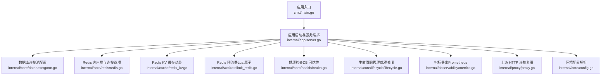
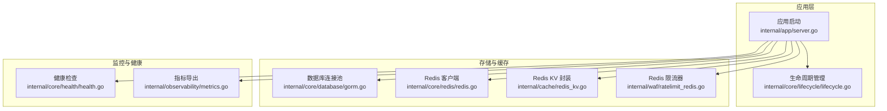
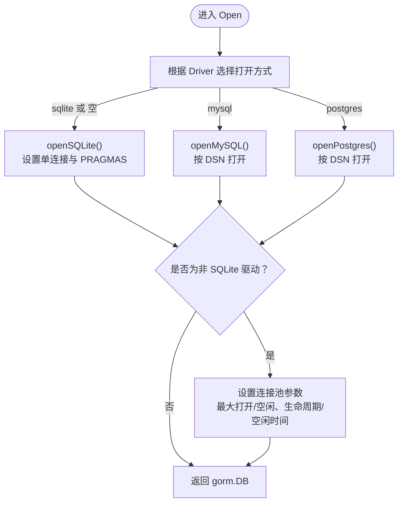
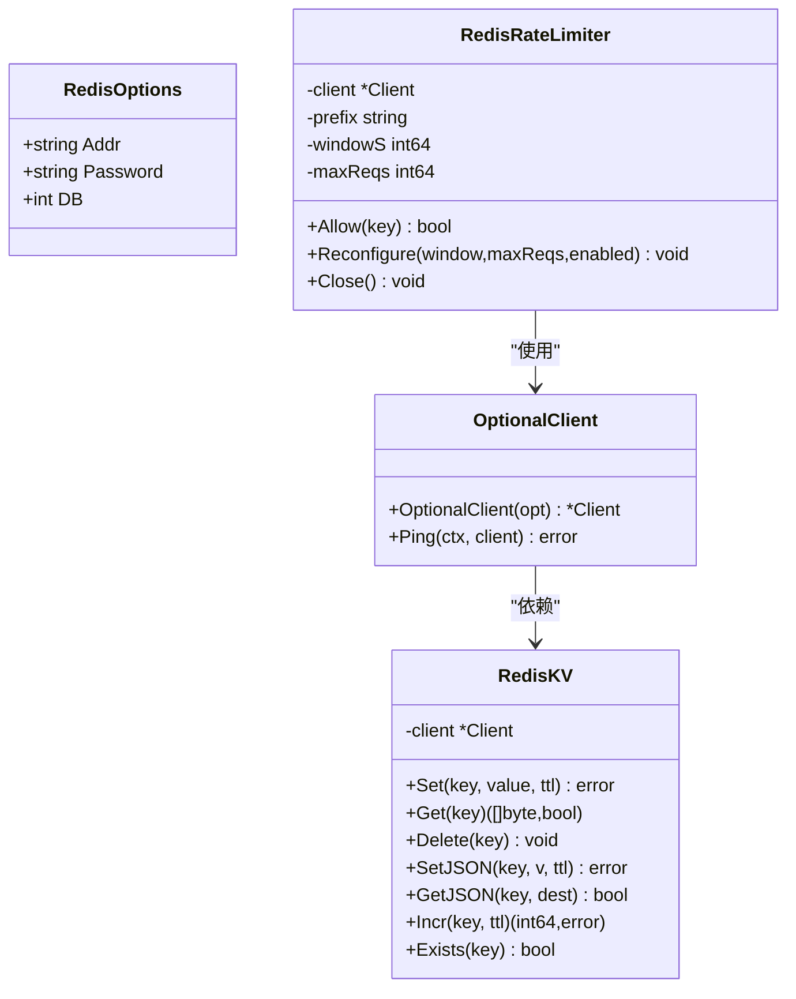
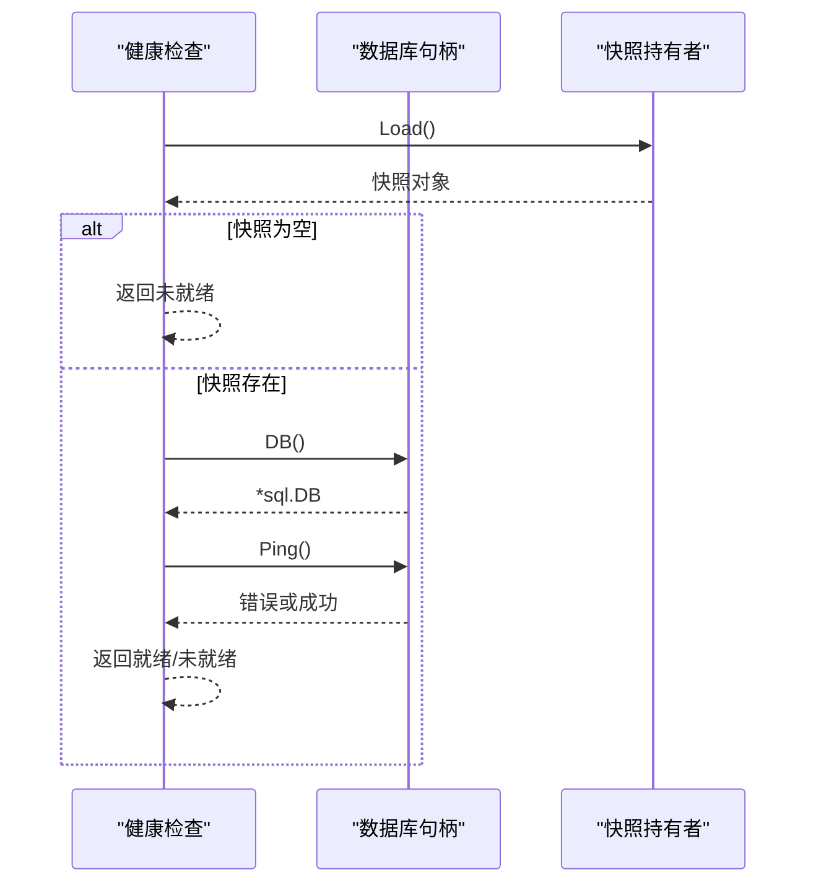
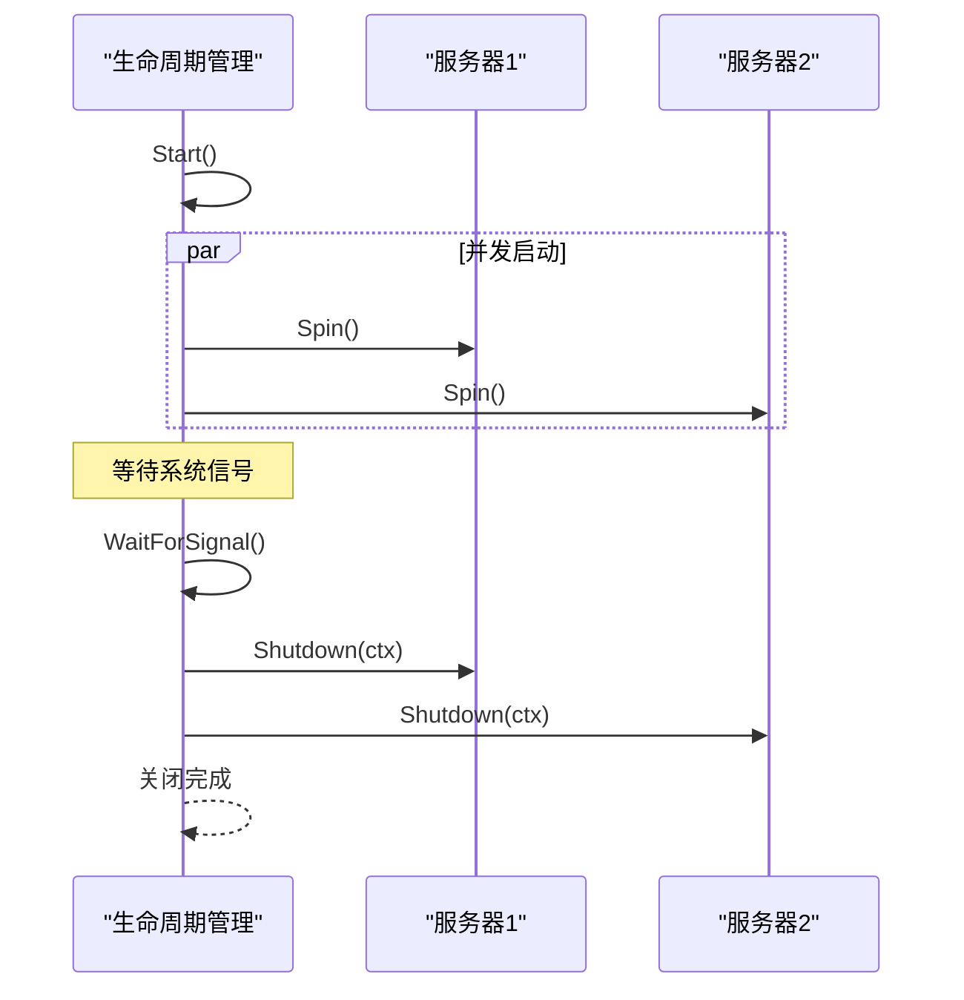
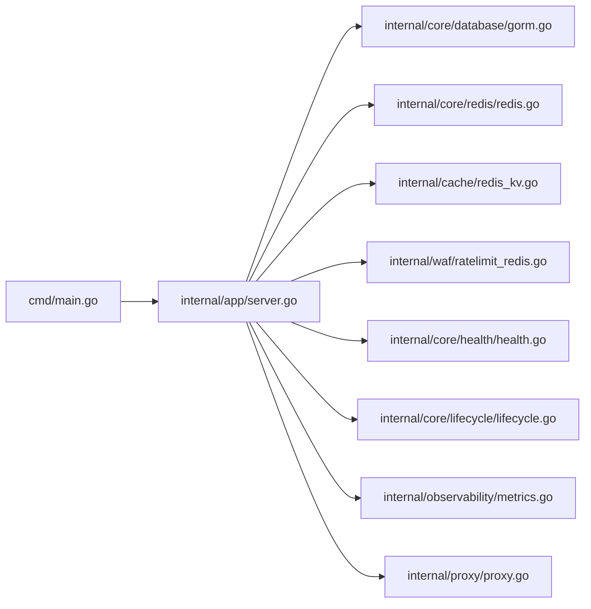

# 连接池管理

<cite>
**本文引用的文件**
- [cmd/main.go](file://cmd/main.go)
- [internal/app/server.go](file://internal/app/server.go)
- [internal/core/database/gorm.go](file://internal/core/database/gorm.go)
- [internal/core/redis/redis.go](file://internal/core/redis/redis.go)
- [internal/cache/redis_kv.go](file://internal/cache/redis_kv.go)
- [internal/waf/ratelimit_redis.go](file://internal/waf/ratelimit_redis.go)
- [internal/core/health/health.go](file://internal/core/health/health.go)
- [internal/core/lifecycle/lifecycle.go](file://internal/core/lifecycle/lifecycle.go)
- [internal/observability/metrics.go](file://internal/observability/metrics.go)
- [internal/proxy/proxy.go](file://internal/proxy/proxy.go)
- [internal/core/config.go](file://internal/core/config.go)
</cite>

## 目录
1. [简介](#简介)
2. [项目结构](#项目结构)
3. [核心组件](#核心组件)
4. [架构总览](#架构总览)
5. [详细组件分析](#详细组件分析)
6. [依赖分析](#依赖分析)
7. [性能考虑](#性能考虑)
8. [故障处理指南](#故障处理指南)
9. [结论](#结论)
10. [附录：配置与最佳实践](#附录配置与最佳实践)

## 简介
本文件聚焦于系统中的连接池管理，涵盖数据库连接池（GORM/SQLite/MySQL/Postgres）与 Redis 连接池（go-redis 客户端）的配置、健康检查、监控指标、性能优化与故障处理。文档以代码为依据，结合可视化图示帮助读者理解连接池在启动、运行与关闭阶段的行为。

## 项目结构
与连接池相关的关键模块分布如下：
- 应用入口与生命周期：cmd/main.go、internal/app/server.go、internal/core/lifecycle/lifecycle.go
- 数据库连接池：internal/core/database/gorm.go
- Redis 连接池与客户端：internal/core/redis/redis.go、internal/cache/redis_kv.go、internal/waf/ratelimit_redis.go
- 健康检查：internal/core/health/health.go
- 指标与可观测性：internal/observability/metrics.go
- 上游 HTTP 连接复用：internal/proxy/proxy.go
- 配置加载：internal/core/config.go

图表来源
- [cmd/main.go:1-10](file://cmd/main.go#L1-L10)
- [internal/app/server.go:35-305](file://internal/app/server.go#L35-L305)
- [internal/core/database/gorm.go:24-61](file://internal/core/database/gorm.go#L24-L61)
- [internal/core/redis/redis.go:17-38](file://internal/core/redis/redis.go#L17-L38)
- [internal/cache/redis_kv.go:13-113](file://internal/cache/redis_kv.go#L13-L113)
- [internal/waf/ratelimit_redis.go:12-89](file://internal/waf/ratelimit_redis.go#L12-L89)
- [internal/core/health/health.go:14-38](file://internal/core/health/health.go#L14-L38)
- [internal/core/lifecycle/lifecycle.go:30-178](file://internal/core/lifecycle/lifecycle.go#L30-L178)
- [internal/observability/metrics.go:13-126](file://internal/observability/metrics.go#L13-L126)
- [internal/proxy/proxy.go:27-54](file://internal/proxy/proxy.go#L27-L54)
- [internal/core/config.go:74-102](file://internal/core/config.go#L74-L102)

章节来源
- [cmd/main.go:1-10](file://cmd/main.go#L1-L10)
- [internal/app/server.go:35-305](file://internal/app/server.go#L35-L305)

## 核心组件
- 数据库连接池（GORM）
  - 支持 sqlite/mysql/postgres，非 SQLite 场景默认启用连接池参数调优。
  - 关键参数：最大打开连接数、最大空闲连接数、连接最大生命周期、连接最大空闲时间。
- Redis 连接池（go-redis）
  - 提供可选客户端构造函数，支持地址、密码、DB、拨号/读写超时等。
  - 提供 Ping 健康检查方法。
- Redis KV 缓存封装
  - 封装常用操作（Set/Get/Delete/SetJSON/GetJSON/Incr/Exists），统一前缀与上下文超时。
- Redis 限流器
  - 使用 Lua 脚本实现滑动窗口限流，原子增与过期控制；失败时“宽松”放行。
- 健康检查
  - 提供存活与就绪探针，就绪检查包含数据库 Ping。
- 生命周期管理
  - 统一管理服务器启停、信号处理与优雅关闭。
- 指标导出
  - Prometheus 文本格式指标端点，包含请求总量、阻断次数、缓存命中/未命中、上游错误、运行时内存与 goroutine 数等。
- 上游 HTTP 连接复用
  - 基于 TLS 配置的 http.Transport 复用，控制空闲连接上限与超时。

章节来源
- [internal/core/database/gorm.go:24-61](file://internal/core/database/gorm.go#L24-L61)
- [internal/core/redis/redis.go:17-38](file://internal/core/redis/redis.go#L17-L38)
- [internal/cache/redis_kv.go:13-113](file://internal/cache/redis_kv.go#L13-L113)
- [internal/waf/ratelimit_redis.go:12-89](file://internal/waf/ratelimit_redis.go#L12-L89)
- [internal/core/health/health.go:14-38](file://internal/core/health/health.go#L14-L38)
- [internal/core/lifecycle/lifecycle.go:30-178](file://internal/core/lifecycle/lifecycle.go#L30-L178)
- [internal/observability/metrics.go:13-126](file://internal/observability/metrics.go#L13-L126)
- [internal/proxy/proxy.go:27-54](file://internal/proxy/proxy.go#L27-L54)

## 架构总览
下图展示连接池在系统中的位置与交互关系：应用启动后构建数据库与 Redis 客户端，进行健康检查，随后对外提供数据平面监听与管理平面接口；生命周期管理负责优雅关闭；指标模块提供 Prometheus 导出。

图表来源
- [internal/app/server.go:35-305](file://internal/app/server.go#L35-L305)
- [internal/core/database/gorm.go:24-61](file://internal/core/database/gorm.go#L24-L61)
- [internal/core/redis/redis.go:17-38](file://internal/core/redis/redis.go#L17-L38)
- [internal/cache/redis_kv.go:13-113](file://internal/cache/redis_kv.go#L13-L113)
- [internal/waf/ratelimit_redis.go:12-89](file://internal/waf/ratelimit_redis.go#L12-L89)
- [internal/core/health/health.go:14-38](file://internal/core/health/health.go#L14-L38)
- [internal/core/lifecycle/lifecycle.go:30-178](file://internal/core/lifecycle/lifecycle.go#L30-L178)
- [internal/observability/metrics.go:13-126](file://internal/observability/metrics.go#L13-L126)

## 详细组件分析

### 数据库连接池（GORM）
- 驱动选择与 DSN 解析：根据驱动类型选择对应的数据库打开方式，并对 SQLite/MySQL/Postgres 分支处理。
- 连接池参数调优（非 SQLite）：
  - 最大打开连接数
  - 最大空闲连接数
  - 连接最大生命周期
  - 连接最大空闲时间
- SQLite 特例：
  - 强制使用单连接，避免锁竞争；禁用连接生命周期限制。

图表来源
- [internal/core/database/gorm.go:24-61](file://internal/core/database/gorm.go#L24-L61)
- [internal/core/database/gorm.go:63-94](file://internal/core/database/gorm.go#L63-L94)
- [internal/core/database/gorm.go:96-110](file://internal/core/database/gorm.go#L96-L110)

章节来源
- [internal/core/database/gorm.go:24-61](file://internal/core/database/gorm.go#L24-L61)
- [internal/core/database/gorm.go:63-94](file://internal/core/database/gorm.go#L63-L94)
- [internal/core/database/gorm.go:96-110](file://internal/core/database/gorm.go#L96-L110)

### Redis 连接池与客户端
- OptionalClient：当未配置地址时返回空客户端；否则创建 go-redis 客户端，设置拨号与读写超时。
- Ping：对非空客户端执行 PING 健康检查。
- RedisKV：封装常用键值操作，统一带前缀的键名与上下文超时；支持 JSON 序列化/反序列化；管道执行 Incr 与 Expire。
- RedisRateLimiter：基于 Lua 脚本的滑动窗口限流，原子更新计数与过期；发生错误时宽松放行。

图表来源
- [internal/core/redis/redis.go:10-38](file://internal/core/redis/redis.go#L10-L38)
- [internal/cache/redis_kv.go:13-113](file://internal/cache/redis_kv.go#L13-L113)
- [internal/waf/ratelimit_redis.go:12-89](file://internal/waf/ratelimit_redis.go#L12-L89)

章节来源
- [internal/core/redis/redis.go:17-38](file://internal/core/redis/redis.go#L17-L38)
- [internal/cache/redis_kv.go:13-113](file://internal/cache/redis_kv.go#L13-L113)
- [internal/waf/ratelimit_redis.go:12-89](file://internal/waf/ratelimit_redis.go#L12-L89)

### 健康检查与就绪探测
- 存活探针：进程可达即视为存活。
- 就绪探针：要求已加载快照且数据库 Ping 成功。

图表来源
- [internal/core/health/health.go:14-38](file://internal/core/health/health.go#L14-L38)

章节来源
- [internal/core/health/health.go:14-38](file://internal/core/health/health.go#L14-L38)

### 生命周期与优雅关闭
- 统一注册与启动多个服务器实例。
- 接收 SIGINT/SIGTERM 后，在超时内优雅关闭所有服务器。

图表来源
- [internal/core/lifecycle/lifecycle.go:30-178](file://internal/core/lifecycle/lifecycle.go#L30-L178)

章节来源
- [internal/core/lifecycle/lifecycle.go:30-178](file://internal/core/lifecycle/lifecycle.go#L30-L178)

### 指标与监控
- Prometheus 文本格式导出常见指标：请求总量、阻断总量、观察总量、内置规则命中、缓存命中/未命中、上游错误、运行时内存、goroutine 数、GC 暂停等。
- 指标采集在 /metrics 路由中实现。

章节来源
- [internal/observability/metrics.go:13-126](file://internal/observability/metrics.go#L13-L126)

### 上游 HTTP 连接复用
- 基于 TLS 配置键控的 http.Transport 复用，控制空闲连接总数与每主机空闲连接数、空闲超时、强制启用 HTTP/2。

章节来源
- [internal/proxy/proxy.go:27-54](file://internal/proxy/proxy.go#L27-L54)

## 依赖分析
- 应用入口通过 internal/app/server.go 组织数据库、Redis、引擎、事件写入器、归档器、指标、健康检查与生命周期管理。
- 数据库连接池依赖 gorm 的底层 sql.DB；Redis 客户端由 go-redis 提供连接池能力。
- RedisKV 与 RedisRateLimiter 共享同一 Redis 客户端实例，确保连接复用与一致性。

图表来源
- [cmd/main.go:1-10](file://cmd/main.go#L1-L10)
- [internal/app/server.go:35-305](file://internal/app/server.go#L35-L305)
- [internal/core/database/gorm.go:24-61](file://internal/core/database/gorm.go#L24-L61)
- [internal/core/redis/redis.go:17-38](file://internal/core/redis/redis.go#L17-L38)
- [internal/cache/redis_kv.go:13-113](file://internal/cache/redis_kv.go#L13-L113)
- [internal/waf/ratelimit_redis.go:12-89](file://internal/waf/ratelimit_redis.go#L12-L89)
- [internal/core/health/health.go:14-38](file://internal/core/health/health.go#L14-L38)
- [internal/core/lifecycle/lifecycle.go:30-178](file://internal/core/lifecycle/lifecycle.go#L30-L178)
- [internal/observability/metrics.go:13-126](file://internal/observability/metrics.go#L13-L126)
- [internal/proxy/proxy.go:27-54](file://internal/proxy/proxy.go#L27-L54)

章节来源
- [internal/app/server.go:35-305](file://internal/app/server.go#L35-L305)

## 性能考虑
- 数据库连接池
  - 非 SQLite 默认启用连接池参数调优，适合并发写入与查询场景。
  - SQLite 强制单连接，避免锁争用，适用于本地文件型数据库。
- Redis 连接池
  - go-redis 客户端自带连接池与命令管线（Pipeline），RedisKV 的 Incr 使用 Pipeline 保证原子性与低 RTT。
  - 通过上下文超时控制单次操作耗时，避免阻塞。
- 上游 HTTP 连接复用
  - 通过共享 http.Transport 实现连接复用，降低握手成本与资源消耗。
- 指标导出
  - 指标端点仅做聚合统计，避免在热路径上引入额外开销。

章节来源
- [internal/core/database/gorm.go:49-61](file://internal/core/database/gorm.go#L49-L61)
- [internal/cache/redis_kv.go:87-101](file://internal/cache/redis_kv.go#L87-L101)
- [internal/proxy/proxy.go:27-54](file://internal/proxy/proxy.go#L27-L54)
- [internal/observability/metrics.go:51-126](file://internal/observability/metrics.go#L51-L126)

## 故障处理指南
- 连接异常恢复
  - Redis：OptionalClient 在未配置地址时返回空客户端；Ping 用于健康检查；RedisKV/限流器均在失败时采用宽松策略（如限流器失败放行）。
  - 数据库：就绪检查依赖数据库 Ping；若失败，服务不会标记为就绪，避免流量接入。
- 优雅关闭
  - 生命周期管理在收到信号后，按超时优雅关闭各服务器，确保正在处理的请求得到妥善结束。
- 资源清理
  - 应用退出时关闭数据库、事件写入器、归档器、Redis 配置同步等资源。
  - RedisKV/限流器不直接管理连接生命周期，依赖 go-redis 客户端的内部清理。

章节来源
- [internal/core/redis/redis.go:17-38](file://internal/core/redis/redis.go#L17-L38)
- [internal/cache/redis_kv.go:13-113](file://internal/cache/redis_kv.go#L13-L113)
- [internal/waf/ratelimit_redis.go:67-85](file://internal/waf/ratelimit_redis.go#L67-L85)
- [internal/core/health/health.go:28-38](file://internal/core/health/health.go#L28-L38)
- [internal/core/lifecycle/lifecycle.go:112-121](file://internal/core/lifecycle/lifecycle.go#L112-L121)
- [internal/app/server.go:44-88](file://internal/app/server.go#L44-L88)

## 结论
本系统在数据库与 Redis 两方面均提供了稳健的连接池管理策略：数据库侧针对不同驱动进行差异化配置与调优，Redis 侧通过 go-redis 客户端实现高效连接复用与健康检查；配合生命周期管理与健康检查，确保系统在启动、运行与关闭阶段的稳定性与可观测性。

## 附录：配置与最佳实践
- 数据库连接池参数（非 SQLite）
  - 最大打开连接数：建议根据并发与数据库承载能力评估，避免过高导致数据库压力过大。
  - 最大空闲连接数：维持适度空闲连接以减少频繁建立连接的开销。
  - 连接最大生命周期：定期回收旧连接，降低长连接带来的状态漂移风险。
  - 连接最大空闲时间：及时释放长时间空闲连接，节省资源。
- Redis 客户端参数
  - 拨号/读写超时：根据网络状况与延迟目标设置，避免请求悬挂。
  - 连接池大小：结合并发与命令吞吐量调整，避免过多连接造成服务器压力。
- 健康检查
  - 就绪检查应包含数据库 Ping 与关键数据可用性验证，避免在未就绪状态下接入流量。
- 监控指标
  - 建议关注数据库连接池状态（活跃连接数、等待队列长度）、Redis 命令延迟与错误率、上游连接复用率与错误统计。
- 优雅关闭
  - 设置合理的关闭超时，确保在关闭前完成正在进行的请求处理与资源回收。

章节来源
- [internal/core/database/gorm.go:49-61](file://internal/core/database/gorm.go#L49-L61)
- [internal/core/redis/redis.go:17-38](file://internal/core/redis/redis.go#L17-L38)
- [internal/core/health/health.go:28-38](file://internal/core/health/health.go#L28-L38)
- [internal/observability/metrics.go:13-126](file://internal/observability/metrics.go#L13-L126)
- [internal/core/lifecycle/lifecycle.go:15-16](file://internal/core/lifecycle/lifecycle.go#L15-L16)