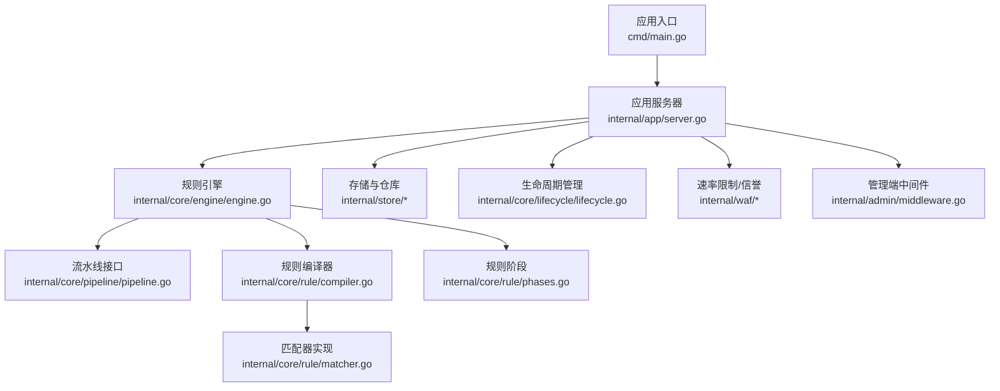
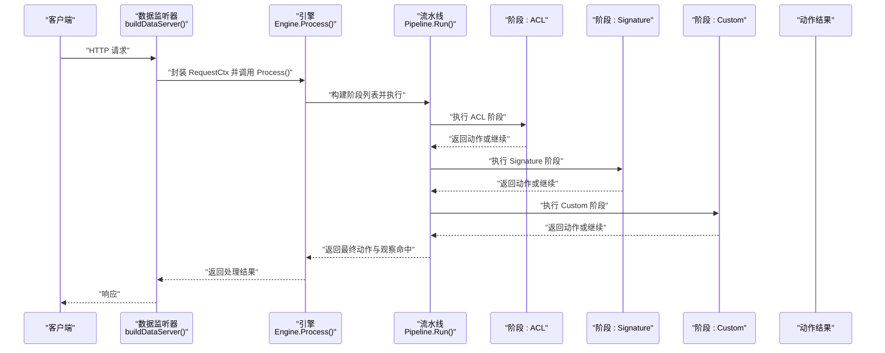
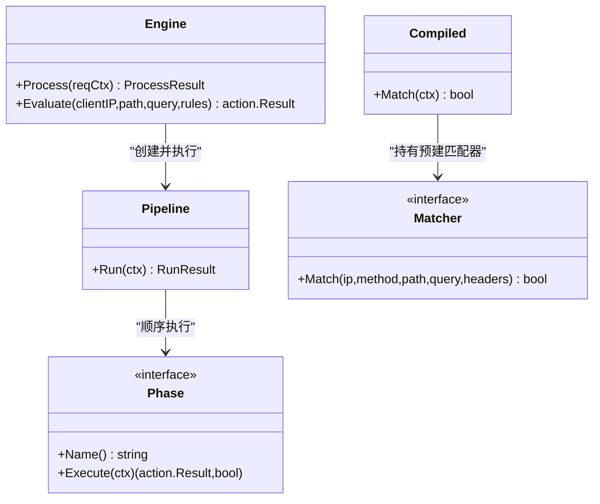
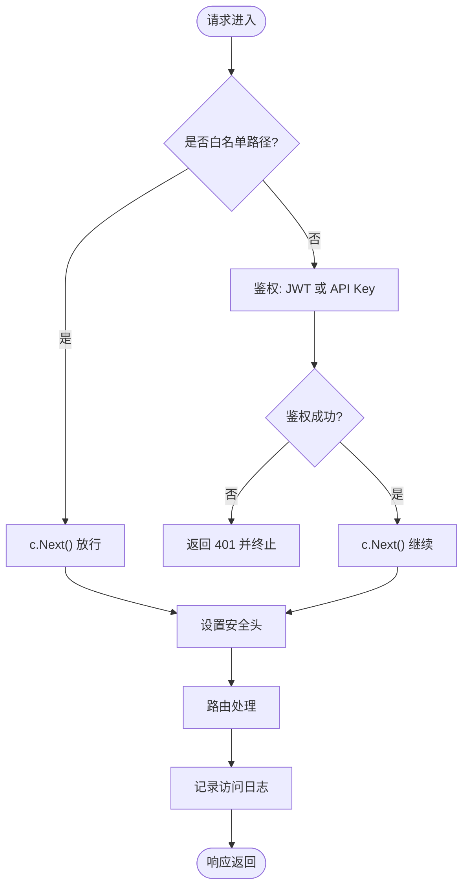
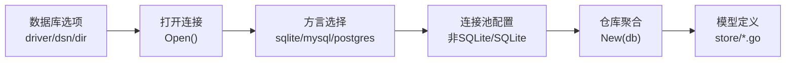
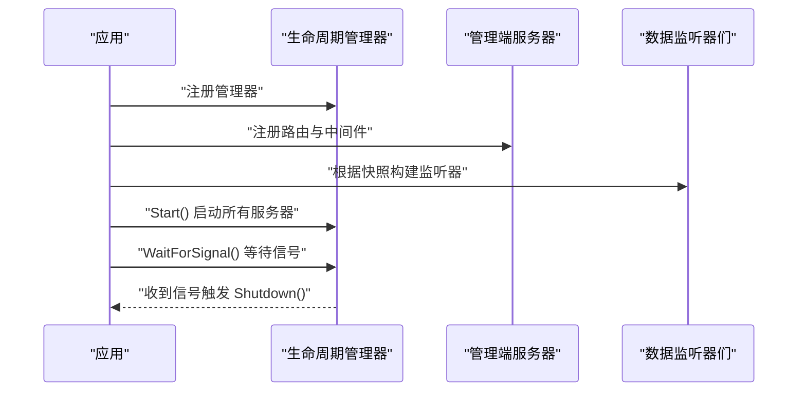
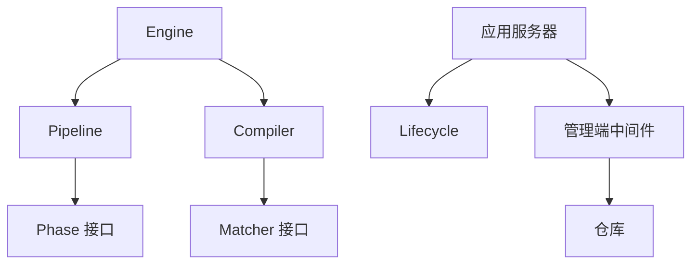

# 扩展与插件

<cite>
**本文引用的文件**
- [cmd/main.go](file://cmd/main.go)
- [internal/app/server.go](file://internal/app/server.go)
- [internal/core/engine/engine.go](file://internal/core/engine/engine.go)
- [internal/core/pipeline/pipeline.go](file://internal/core/pipeline/pipeline.go)
- [internal/core/rule/compiler.go](file://internal/core/rule/compiler.go)
- [internal/core/rule/matcher.go](file://internal/core/rule/matcher.go)
- [internal/core/rule/phases.go](file://internal/core/rule/phases.go)
- [internal/admin/middleware.go](file://internal/admin/middleware.go)
- [internal/core/database/gorm.go](file://internal/core/database/gorm.go)
- [internal/store/models.go](file://internal/store/models.go)
- [internal/store/repository/repository.go](file://internal/store/repository/repository.go)
- [internal/core/lifecycle/lifecycle.go](file://internal/core/lifecycle/lifecycle.go)
- [internal/waf/ratelimit.go](file://internal/waf/ratelimit.go)
- [internal/waf/iprep.go](file://internal/waf/iprep.go)
</cite>

## 目录
1. [引言](#引言)
2. [项目结构](#项目结构)
3. [核心组件](#核心组件)
4. [架构总览](#架构总览)
5. [详细组件分析](#详细组件分析)
6. [依赖分析](#依赖分析)
7. [性能考虑](#性能考虑)
8. [故障排查指南](#故障排查指南)
9. [结论](#结论)
10. [附录](#附录)

## 引言
本文件面向希望在 My-OpenWaf 基础上进行扩展与插件化开发的工程师，系统性阐述以下主题：
- 规则引擎扩展机制：自定义规则开发、编译器扩展与执行器集成
- 中间件开发指南：中间件接口、注册机制与执行顺序控制
- 存储后端扩展：数据库适配器、存储接口与迁移适配
- 第三方集成方法：API 扩展、外部服务集成与协议适配
- 插件架构设计：插件加载、生命周期管理与依赖注入
- 扩展开发工具与调试方法
- 扩展发布与版本管理指南

## 项目结构
My-OpenWaf 的核心由“应用入口”“数据平面引擎”“规则引擎”“存储层”“生命周期管理”等模块组成。应用启动后初始化运行时环境，构建规则引擎与数据监听器，并通过生命周期管理器统一启停。

图示来源
- [cmd/main.go:1-10](file://cmd/main.go#L1-L10)
- [internal/app/server.go:1-465](file://internal/app/server.go#L1-L465)
- [internal/core/engine/engine.go:1-146](file://internal/core/engine/engine.go#L1-L146)
- [internal/core/pipeline/pipeline.go:1-66](file://internal/core/pipeline/pipeline.go#L1-L66)
- [internal/core/rule/compiler.go:1-83](file://internal/core/rule/compiler.go#L1-L83)
- [internal/core/rule/matcher.go:1-343](file://internal/core/rule/matcher.go#L1-L343)
- [internal/core/rule/phases.go:1-483](file://internal/core/rule/phases.go#L1-L483)
- [internal/store/models.go:1-350](file://internal/store/models.go#L1-L350)
- [internal/core/lifecycle/lifecycle.go:1-178](file://internal/core/lifecycle/lifecycle.go#L1-L178)
- [internal/waf/ratelimit.go:1-117](file://internal/waf/ratelimit.go#L1-L117)
- [internal/waf/iprep.go:1-243](file://internal/waf/iprep.go#L1-L243)
- [internal/admin/middleware.go:1-97](file://internal/admin/middleware.go#L1-L97)

章节来源
- [cmd/main.go:1-10](file://cmd/main.go#L1-L10)
- [internal/app/server.go:33-280](file://internal/app/server.go#L33-L280)

## 核心组件
- 应用入口与启动流程：负责初始化运行时、自动迁移、种子数据、事件写入与归档、指标收集、健康检查、生命周期管理与监听器热重载。
- 规则引擎：将站点规则编译为可执行的匹配器集合，并按阶段顺序执行，支持短路与观察日志。
- 流水线接口：定义阶段接口与执行结果，保证阶段有序执行与短路控制。
- 编译器与匹配器：解析规则模式字符串，生成具体匹配器；支持复合条件与正则缓存。
- 存储与仓库：抽象实体与仓库聚合，支持多数据库方言与迁移。
- 生命周期管理：统一管理多个服务器实例的启动、停止与信号处理。
- 速率限制与信誉：固定窗口限流与黑名单/白名单/自动封禁策略。
- 管理端中间件：鉴权、访问日志与安全头设置。

章节来源
- [internal/app/server.go:33-280](file://internal/app/server.go#L33-L280)
- [internal/core/engine/engine.go:15-146](file://internal/core/engine/engine.go#L15-L146)
- [internal/core/pipeline/pipeline.go:9-66](file://internal/core/pipeline/pipeline.go#L9-L66)
- [internal/core/rule/compiler.go:11-83](file://internal/core/rule/compiler.go#L11-L83)
- [internal/core/rule/matcher.go:11-343](file://internal/core/rule/matcher.go#L11-L343)
- [internal/store/repository/repository.go:5-33](file://internal/store/repository/repository.go#L5-L33)
- [internal/core/lifecycle/lifecycle.go:15-178](file://internal/core/lifecycle/lifecycle.go#L15-L178)
- [internal/waf/ratelimit.go:9-117](file://internal/waf/ratelimit.go#L9-L117)
- [internal/waf/iprep.go:18-243](file://internal/waf/iprep.go#L18-L243)
- [internal/admin/middleware.go:16-97](file://internal/admin/middleware.go#L16-L97)

## 架构总览
下图展示从请求进入数据监听器到规则引擎执行再到动作决策的整体流程，以及各扩展点的位置。

图示来源
- [internal/app/server.go:327-351](file://internal/app/server.go#L327-L351)
- [internal/core/engine/engine.go:43-106](file://internal/core/engine/engine.go#L43-L106)
- [internal/core/pipeline/pipeline.go:46-66](file://internal/core/pipeline/pipeline.go#L46-L66)
- [internal/core/rule/phases.go:34-94](file://internal/core/rule/phases.go#L34-L94)

## 详细组件分析

### 规则引擎扩展机制
- 自定义规则开发
  - 规则模式解析：编译器将规则字符串解析为 kind 与 arg，并据此构造匹配器；支持复合条件（JSON）与多种内置匹配器。
  - 匹配器扩展：新增匹配器类型需在构建函数中添加分支，返回对应匹配器实例；注意对非法输入的兜底处理。
  - 规则阶段：可在现有阶段（ACL、Signature、Custom）中插入或替换逻辑，或新增阶段类型。
- 编译器扩展
  - 新增规则种类：在解析器与构建器中增加 kind 分支，确保错误输入返回“不匹配”的安全默认。
  - 复合条件：通过 JSON 条件树递归构建与/或/非组合，便于复杂业务场景。
- 执行器集成
  - 在引擎中按优先级与依赖关系组装阶段列表，确保 IP 信誉、ACL、Bot 检测、限流、OWASP、签名与自定义规则的正确顺序。
  - 动作短路：允许某些动作（如放行）直接短路后续阶段，提高吞吐。

图示来源
- [internal/core/engine/engine.go:15-146](file://internal/core/engine/engine.go#L15-L146)
- [internal/core/pipeline/pipeline.go:25-66](file://internal/core/pipeline/pipeline.go#L25-L66)
- [internal/core/rule/compiler.go:11-55](file://internal/core/rule/compiler.go#L11-L55)
- [internal/core/rule/matcher.go:11-14](file://internal/core/rule/matcher.go#L11-L14)

章节来源
- [internal/core/rule/compiler.go:27-83](file://internal/core/rule/compiler.go#L27-L83)
- [internal/core/rule/matcher.go:167-261](file://internal/core/rule/matcher.go#L167-L261)
- [internal/core/rule/phases.go:32-483](file://internal/core/rule/phases.go#L32-L483)
- [internal/core/engine/engine.go:69-106](file://internal/core/engine/engine.go#L69-L106)

### 中间件开发指南
- 接口与注册
  - 管理端使用 Hertz 框架中间件，以 HandlerFunc 形式接入路由链。
  - 可通过服务器注册函数集中注入中间件，形成统一的鉴权、日志与安全头策略。
- 执行顺序控制
  - 中间件在路由处理前执行，遵循注册顺序；鉴权通常置于较前位置，日志与安全头可置于末尾或靠近路由。
  - 白名单路径（如健康检查、认证接口）应尽早放行，避免影响其他中间件。

图示来源
- [internal/admin/middleware.go:16-97](file://internal/admin/middleware.go#L16-L97)
- [internal/app/server.go:245-258](file://internal/app/server.go#L245-L258)

章节来源
- [internal/admin/middleware.go:16-97](file://internal/admin/middleware.go#L16-L97)
- [internal/app/server.go:245-258](file://internal/app/server.go#L245-L258)

### 存储后端扩展
- 数据库适配器
  - 支持 SQLite、MySQL、PostgreSQL 三种方言；可通过驱动参数切换。
  - 非 SQLite 连接池参数可调优；SQLite 使用 WAL、超时与缓存参数优化并发与性能。
- 存储接口与仓库
  - 通过仓库聚合对象集中管理各实体的读写操作，便于扩展新实体或替换实现。
- 迁移适配
  - 通过自动迁移与系统设置表实现配置版本化与默认值注入；迁移流程在启动时执行。

图示来源
- [internal/core/database/gorm.go:17-111](file://internal/core/database/gorm.go#L17-L111)
- [internal/store/repository/repository.go:19-33](file://internal/store/repository/repository.go#L19-L33)
- [internal/store/models.go:35-91](file://internal/store/models.go#L35-L91)

章节来源
- [internal/core/database/gorm.go:17-111](file://internal/core/database/gorm.go#L17-L111)
- [internal/store/repository/repository.go:5-33](file://internal/store/repository/repository.go#L5-L33)
- [internal/store/models.go:237-350](file://internal/store/models.go#L237-L350)

### 第三方集成方法
- API 扩展
  - 通过管理端路由注册函数集中挂载新的 API 路由，结合仓库与运行时配置实现功能扩展。
- 外部服务集成
  - 速率限制与信誉模块可作为外部服务的集成点：例如将限流阈值与封禁策略对接到外部风控平台。
- 协议适配
  - 数据监听器支持 TLS 终止与 SNI 证书配置，可扩展为支持更多协议特性（如 ALPN、OCSP Stapling）。

章节来源
- [internal/app/server.go:245-258](file://internal/app/server.go#L245-L258)
- [internal/app/server.go:327-414](file://internal/app/server.go#L327-L414)
- [internal/waf/ratelimit.go:9-117](file://internal/waf/ratelimit.go#L9-L117)
- [internal/waf/iprep.go:18-243](file://internal/waf/iprep.go#L18-L243)

### 插件架构设计
- 插件加载
  - 应用启动时完成初始化与注册；监听器按站点维度热启/重启，支持配置漂移检测与通知。
- 生命周期管理
  - 生命周期管理器统一启动、停止与信号处理，支持优雅关闭与并发清理。
- 依赖注入
  - 通过运行时对象传递给引擎、监听器与中间件，确保各组件共享状态与资源。

图示来源
- [internal/app/server.go:245-280](file://internal/app/server.go#L245-L280)
- [internal/core/lifecycle/lifecycle.go:30-178](file://internal/core/lifecycle/lifecycle.go#L30-L178)

章节来源
- [internal/app/server.go:133-201](file://internal/app/server.go#L133-L201)
- [internal/core/lifecycle/lifecycle.go:30-178](file://internal/core/lifecycle/lifecycle.go#L30-L178)

### 扩展开发工具与调试方法
- 规则验证
  - 使用引擎的评估函数对已解析站点规则进行快速验证，定位匹配与动作问题。
- 日志与指标
  - 访问日志中间件输出统一格式；Prometheus 兼容指标收集器用于观测系统状态。
- 快照与热重载
  - 修改配置后通过重载流程更新速率限制、信誉策略与监听器，配合 Redis 分布式通知实现多节点同步。

章节来源
- [internal/core/engine/engine.go:108-122](file://internal/core/engine/engine.go#L108-L122)
- [internal/admin/middleware.go:65-86](file://internal/admin/middleware.go#L65-L86)
- [internal/app/server.go:203-243](file://internal/app/server.go#L203-L243)

### 扩展发布与版本管理指南
- 版本与迁移
  - 通过系统设置表保存关键配置与版本信息；自动迁移确保数据库结构演进。
- 配置漂移与热更新
  - 监听器指纹用于检测配置变化并触发重启；Redis 订阅实现跨节点同步。
- 安全与合规
  - 管理端中间件统一设置安全头与访问日志，便于审计与合规。

章节来源
- [internal/store/models.go:237-243](file://internal/store/models.go#L237-L243)
- [internal/app/server.go:432-457](file://internal/app/server.go#L432-L457)
- [internal/admin/middleware.go:88-97](file://internal/admin/middleware.go#L88-L97)

## 依赖分析
- 组件耦合
  - 引擎依赖流水线、规则编译器与站点解析器；流水线依赖阶段接口；编译器依赖匹配器接口。
  - 管理端中间件依赖鉴权与仓库；应用服务器依赖生命周期管理器与数据监听器。
- 外部依赖
  - Hertz 作为 HTTP 服务器框架；GORM 作为 ORM；SQLite/MySQL/PostgreSQL 驱动。
- 循环依赖
  - 当前结构采用接口与分层，未见循环导入迹象。

图示来源
- [internal/core/engine/engine.go:15-146](file://internal/core/engine/engine.go#L15-L146)
- [internal/core/pipeline/pipeline.go:25-66](file://internal/core/pipeline/pipeline.go#L25-L66)
- [internal/core/rule/compiler.go:11-55](file://internal/core/rule/compiler.go#L11-L55)
- [internal/core/rule/matcher.go:11-14](file://internal/core/rule/matcher.go#L11-L14)
- [internal/app/server.go:245-280](file://internal/app/server.go#L245-L280)
- [internal/admin/middleware.go:16-97](file://internal/admin/middleware.go#L16-L97)

章节来源
- [internal/core/engine/engine.go:15-146](file://internal/core/engine/engine.go#L15-L146)
- [internal/core/pipeline/pipeline.go:25-66](file://internal/core/pipeline/pipeline.go#L25-L66)
- [internal/core/rule/compiler.go:11-55](file://internal/core/rule/compiler.go#L11-L55)
- [internal/core/rule/matcher.go:11-14](file://internal/core/rule/matcher.go#L11-L14)
- [internal/app/server.go:245-280](file://internal/app/server.go#L245-L280)
- [internal/admin/middleware.go:16-97](file://internal/admin/middleware.go#L16-L97)

## 性能考虑
- 正则表达式缓存：编译器对正则表达式进行缓存，减少重复编译开销。
- 连接池优化：非 SQLite 数据库设置最大连接数、空闲连接与生命周期；SQLite 使用单连接与 WAL 提升并发。
- 固定窗口限流：原子计数与定期清理降低锁竞争与内存占用。
- 内容类型扫描：针对不同内容类型采用差异化扫描策略，限制扫描范围以避免长尾性能问题。

章节来源
- [internal/core/rule/matcher.go:271-296](file://internal/core/rule/matcher.go#L271-L296)
- [internal/core/database/gorm.go:49-58](file://internal/core/database/gorm.go#L49-L58)
- [internal/waf/ratelimit.go:98-116](file://internal/waf/ratelimit.go#L98-L116)
- [internal/core/rule/phases.go:274-319](file://internal/core/rule/phases.go#L274-L319)

## 故障排查指南
- 规则不生效
  - 检查规则是否启用、优先级与阶段是否正确；使用评估函数验证规则匹配。
- 速率限制异常
  - 核对窗口大小与阈值配置；确认启用状态与键空间（IP+Host）是否符合预期。
- 信誉策略无效
  - 检查黑白名单与自动封禁配置；确认 IP 解析与过期逻辑。
- 监听器未热重载
  - 检查配置指纹计算与 Redis 通知；确认生命周期管理器的标签与名称一致性。

章节来源
- [internal/core/engine/engine.go:108-122](file://internal/core/engine/engine.go#L108-L122)
- [internal/waf/ratelimit.go:40-92](file://internal/waf/ratelimit.go#L40-L92)
- [internal/waf/iprep.go:68-155](file://internal/waf/iprep.go#L68-L155)
- [internal/app/server.go:133-201](file://internal/app/server.go#L133-L201)

## 结论
My-OpenWaf 通过清晰的分层与接口设计，提供了规则引擎、中间件、存储与生命周期管理的扩展点。开发者可在不破坏核心稳定性的前提下，通过编译器与匹配器扩展规则能力，通过中间件扩展管理端能力，通过数据库适配器与仓库扩展存储能力，并借助生命周期管理与热重载机制实现平滑演进。

## 附录
- 关键流程图与类图已在相应章节中给出，便于对照源码理解扩展点与集成方式。