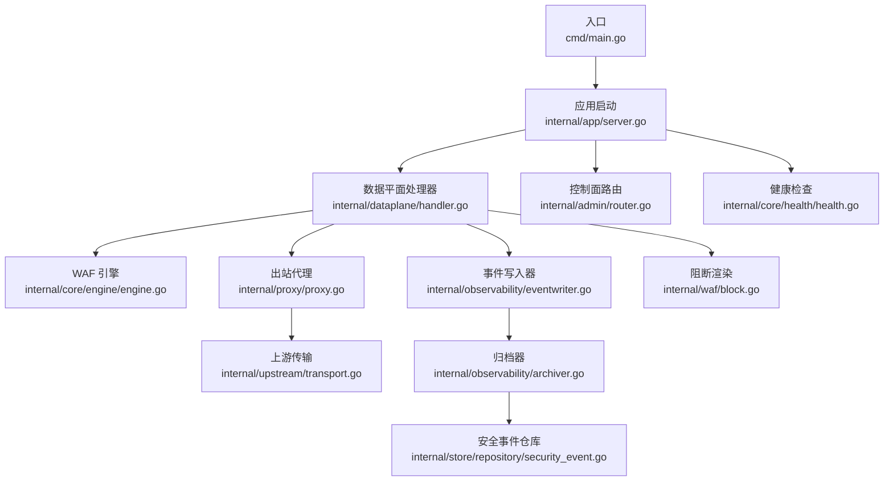
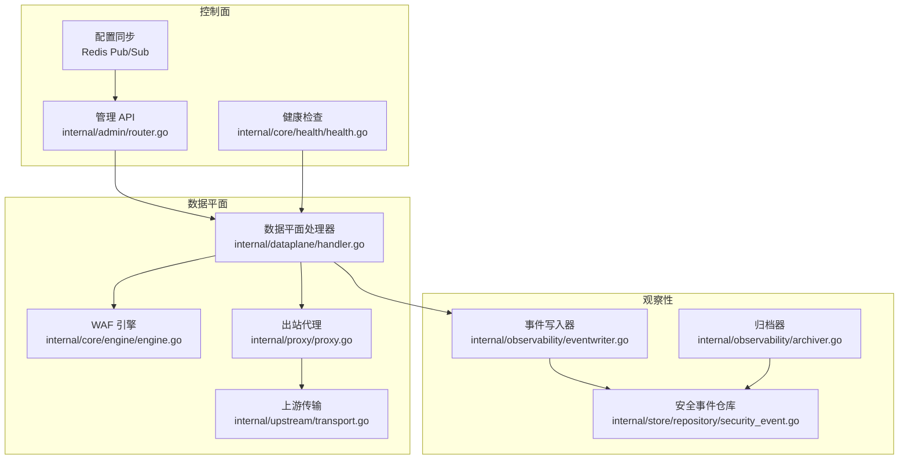
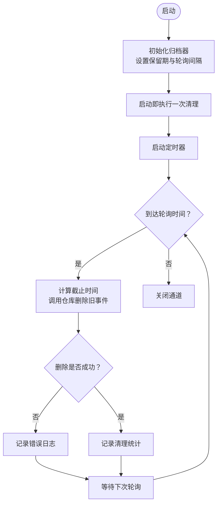
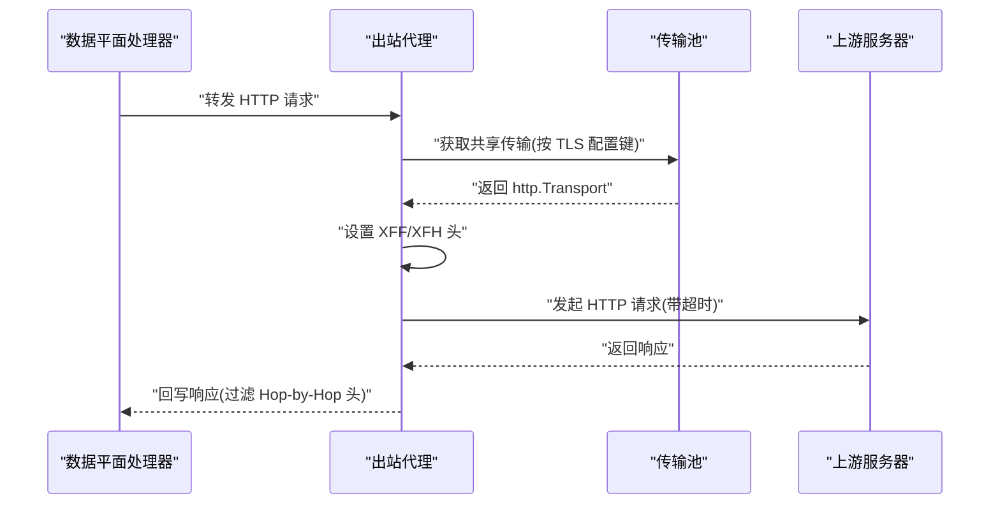
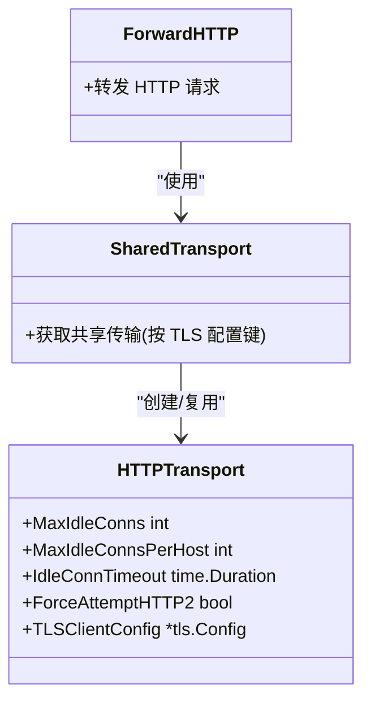
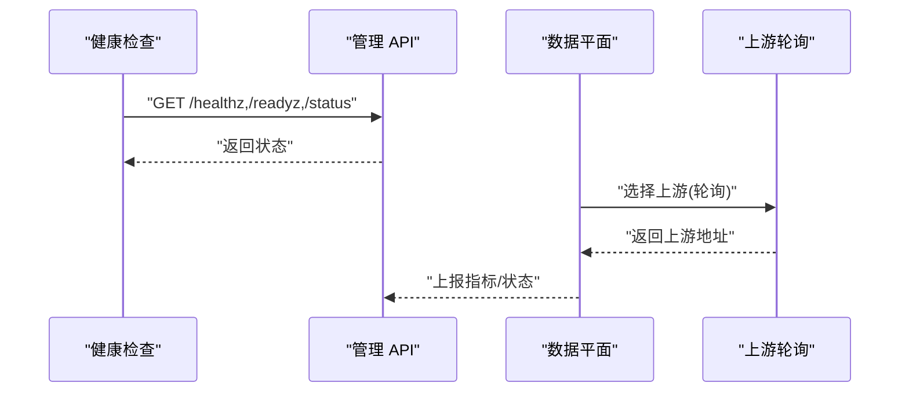
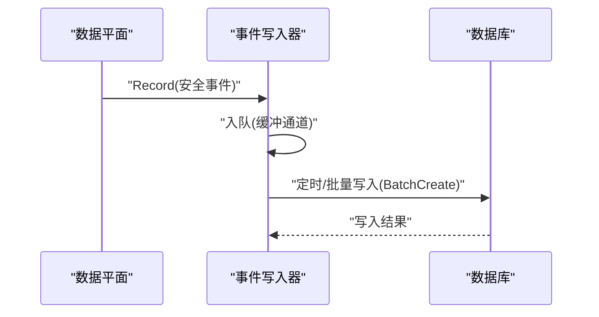
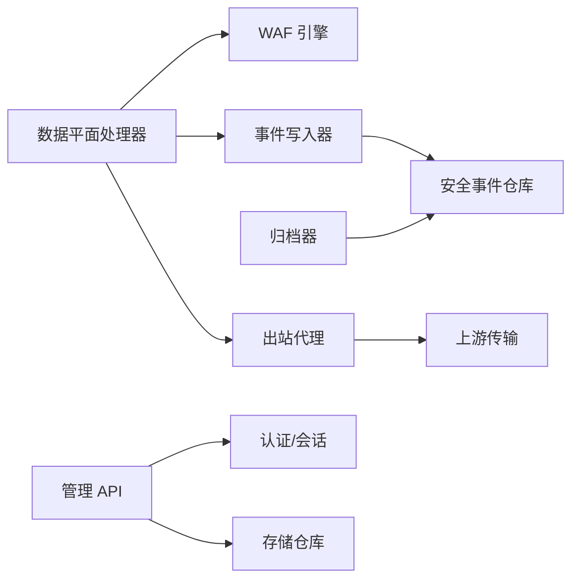

# 服务集成

<cite>
**本文引用的文件**
- [cmd/main.go](file://cmd/main.go)
- [internal/app/server.go](file://internal/app/server.go)
- [internal/core/config.go](file://internal/core/config.go)
- [internal/snapshot/snapshot.go](file://internal/snapshot/snapshot.go)
- [internal/observability/archiver.go](file://internal/observability/archiver.go)
- [internal/store/repository/security_event.go](file://internal/store/repository/security_event.go)
- [internal/observability/eventwriter.go](file://internal/observability/eventwriter.go)
- [internal/dataplane/handler.go](file://internal/dataplane/handler.go)
- [internal/proxy/proxy.go](file://internal/proxy/proxy.go)
- [internal/upstream/transport.go](file://internal/upstream/transport.go)
- [internal/security/outbound.go](file://internal/security/outbound.go)
- [internal/admin/router.go](file://internal/admin/router.go)
- [internal/core/engine/engine.go](file://internal/core/engine/engine.go)
- [internal/core/health/health.go](file://internal/core/health/health.go)
- [internal/waf/block.go](file://internal/waf/block.go)
</cite>

## 目录
1. [简介](#简介)
2. [项目结构](#项目结构)
3. [核心组件](#核心组件)
4. [架构总览](#架构总览)
5. [详细组件分析](#详细组件分析)
6. [依赖分析](#依赖分析)
7. [性能考量](#性能考量)
8. [故障排查指南](#故障排查指南)
9. [结论](#结论)
10. [附录](#附录)

## 简介
本文件面向“服务集成系统”的设计与实现，聚焦以下主题：
- 外部服务集成架构：以安全事件归档服务为核心，结合事件写入与定时清理策略，形成闭环。
- 出站连接管理：通过共享连接池、TLS 配置与超时控制，保障反向代理链路稳定与高效。
- 上游传输协议支持：统一支持 HTTP/HTTPS（含 ALPN、SNI、版本约束），并为未来 gRPC/自定义协议扩展预留接口。
- 服务发现与负载均衡：基于站点级监听器与轮询策略实现简单而可靠的上游选择；健康检查与就绪探针确保系统可观测性。
- 开发指南：接口定义、配置管理与错误处理策略，帮助开发者快速集成与扩展。

## 项目结构
系统采用分层与功能域划分：
- 入口与生命周期：cmd/main.go 启动 internal/app/server.go，完成运行时初始化、监听器热启停、配置同步与信号等待。
- 数据平面：internal/dataplane/handler.go 作为中间件，串联 WAF 引擎、事件写入、反向代理与响应输出。
- 观察性：internal/observability/eventwriter.go 负责异步批量写入安全事件；internal/observability/archiver.go 定时清理过期事件。
- 出站代理：internal/proxy/proxy.go 提供 HTTP 反向代理与 WebSocket/SSE 支持；internal/security/outbound.go 设置 XFF/XFH 等头。
- 连接传输：internal/upstream/transport.go 构建带连接池与 TLS 的 http.Transport；与 internal/snapshot/snapshot.go 的站点运行时配置联动。
- 控制面：internal/admin/router.go 暴露管理 API，支持站点、证书、规则、保护设置等的增删改查与热重载。
- 健康检查：internal/core/health/health.go 提供存活/就绪探针与状态查询。
- 引擎与规则：internal/core/engine/engine.go 组织 WAF 规则管线；internal/waf/block.go 渲染拦截与维护页面。

**图示来源**
- [cmd/main.go:1-10](file://cmd/main.go#L1-L10)
- [internal/app/server.go:35-305](file://internal/app/server.go#L35-L305)
- [internal/dataplane/handler.go:37-310](file://internal/dataplane/handler.go#L37-L310)
- [internal/core/engine/engine.go:15-176](file://internal/core/engine/engine.go#L15-L176)
- [internal/observability/eventwriter.go:12-105](file://internal/observability/eventwriter.go#L12-L105)
- [internal/proxy/proxy.go:73-136](file://internal/proxy/proxy.go#L73-L136)
- [internal/upstream/transport.go:12-29](file://internal/upstream/transport.go#L12-L29)
- [internal/observability/archiver.go:11-72](file://internal/observability/archiver.go#L11-L72)
- [internal/store/repository/security_event.go:62-66](file://internal/store/repository/security_event.go#L62-L66)
- [internal/admin/router.go:35-210](file://internal/admin/router.go#L35-L210)
- [internal/core/health/health.go:14-95](file://internal/core/health/health.go#L14-L95)
- [internal/waf/block.go:16-110](file://internal/waf/block.go#L16-L110)

**章节来源**
- [cmd/main.go:1-10](file://cmd/main.go#L1-L10)
- [internal/app/server.go:35-305](file://internal/app/server.go#L35-L305)

## 核心组件
- 应用启动与监听器编排：负责运行时构建、数据库迁移、默认凭据生成、快照加载、监听器热启停与配置同步。
- 数据平面处理器：在请求进入时进行站点匹配、客户端 IP 解析、WAF 规则执行、事件记录、拦截或转发到上游。
- 观察性子系统：异步事件写入与定时归档，保证数据平面非阻塞与历史数据可控。
- 出站代理与传输：共享连接池、TLS 配置、超时控制与头部处理，支持 HTTP/HTTPS、WebSocket、SSE。
- 控制面 API：提供站点、证书、规则、保护设置等管理接口，支持热重载与分布式通知。
- 健康检查与状态：提供存活/就绪探针与运行时状态查询，便于服务发现与运维监控。

**章节来源**
- [internal/app/server.go:35-305](file://internal/app/server.go#L35-L305)
- [internal/dataplane/handler.go:37-310](file://internal/dataplane/handler.go#L37-L310)
- [internal/observability/eventwriter.go:12-105](file://internal/observability/eventwriter.go#L12-L105)
- [internal/observability/archiver.go:11-72](file://internal/observability/archiver.go#L11-L72)
- [internal/proxy/proxy.go:73-136](file://internal/proxy/proxy.go#L73-L136)
- [internal/admin/router.go:35-210](file://internal/admin/router.go#L35-L210)
- [internal/core/health/health.go:14-95](file://internal/core/health/health.go#L14-L95)

## 架构总览
系统采用“控制面 + 数据平面 + 观察性”的三层架构：
- 控制面：管理 API、健康检查、配置同步与热重载。
- 数据平面：请求处理、WAF 执行、事件记录、反向代理与响应输出。
- 观察性：事件写入、归档清理、指标采集与导出。

**图示来源**
- [internal/admin/router.go:35-210](file://internal/admin/router.go#L35-L210)
- [internal/core/health/health.go:14-95](file://internal/core/health/health.go#L14-L95)
- [internal/dataplane/handler.go:37-310](file://internal/dataplane/handler.go#L37-L310)
- [internal/core/engine/engine.go:15-176](file://internal/core/engine/engine.go#L15-L176)
- [internal/proxy/proxy.go:73-136](file://internal/proxy/proxy.go#L73-L136)
- [internal/upstream/transport.go:12-29](file://internal/upstream/transport.go#L12-L29)
- [internal/observability/eventwriter.go:12-105](file://internal/observability/eventwriter.go#L12-L105)
- [internal/observability/archiver.go:11-72](file://internal/observability/archiver.go#L11-L72)
- [internal/store/repository/security_event.go:62-66](file://internal/store/repository/security_event.go#L62-L66)

## 详细组件分析

### 安全事件归档服务
- 实现机制
  - 归档器周期性扫描并删除早于保留期的数据，保留期内的事件不被删除。
  - 使用时间切片与批量删除，避免单次大事务带来的锁竞争。
- 定时清理策略
  - 启动即执行一次清理；随后按固定间隔（小时级）轮询。
  - 清理阈值由保留天数计算，保留天数可配置。
- 数据保留期配置
  - 默认保留 30 天；可通过构造函数参数调整。
- 批量删除操作
  - 通过仓库层提供的 DeleteOlderThan 接口执行批量删除，返回受影响行数。
- 错误处理
  - 删除失败时记录错误日志；成功时记录清理统计信息。

**图示来源**
- [internal/observability/archiver.go:42-72](file://internal/observability/archiver.go#L42-L72)
- [internal/store/repository/security_event.go:62-66](file://internal/store/repository/security_event.go#L62-L66)

**章节来源**
- [internal/observability/archiver.go:11-72](file://internal/observability/archiver.go#L11-L72)
- [internal/store/repository/security_event.go:62-66](file://internal/store/repository/security_event.go#L62-L66)

### 出站连接管理
- 连接池管理
  - 通过共享传输缓存（按 TLS 配置键）复用 http.Transport，降低连接建立开销。
  - 默认最大空闲连接与每主机空闲连接数、空闲超时与强制启用 HTTP/2。
- 超时控制
  - 出站 HTTP 客户端设置统一超时，避免上游阻塞影响数据平面。
- 错误重试机制
  - 当前实现未内置自动重试；上游错误统一返回 502，交由上层策略处理。
- TLS 与头部处理
  - HTTPS 场景下根据站点配置设置 SNI、跳过校验与最小 TLS 版本。
  - 出站请求设置 X-Forwarded-For 与 X-Forwarded-Host（可选）。

**图示来源**
- [internal/proxy/proxy.go:32-136](file://internal/proxy/proxy.go#L32-L136)
- [internal/security/outbound.go:8-17](file://internal/security/outbound.go#L8-L17)
- [internal/upstream/transport.go:12-29](file://internal/upstream/transport.go#L12-L29)

**章节来源**
- [internal/proxy/proxy.go:32-136](file://internal/proxy/proxy.go#L32-L136)
- [internal/security/outbound.go:8-17](file://internal/security/outbound.go#L8-L17)
- [internal/upstream/transport.go:12-29](file://internal/upstream/transport.go#L12-L29)

### 上游传输协议支持
- HTTP/HTTPS 协议
  - 默认启用 HTTP/2，支持 ALPN 与 SNI；HTTPS 时可配置跳过校验与最小版本。
- gRPC 传输
  - 当前未实现专用 gRPC 传输；可通过扩展在上游传输层新增协议分支。
- 自定义协议适配
  - 通过在数据平面处理器中增加协议判断与对应转发逻辑，即可扩展至自定义协议。

**图示来源**
- [internal/upstream/transport.go:12-29](file://internal/upstream/transport.go#L12-L29)
- [internal/proxy/proxy.go:32-136](file://internal/proxy/proxy.go#L32-L136)

**章节来源**
- [internal/upstream/transport.go:12-29](file://internal/upstream/transport.go#L12-L29)
- [internal/proxy/proxy.go:32-136](file://internal/proxy/proxy.go#L32-L136)

### 服务发现与负载均衡集成
- 服务发现
  - 通过站点级监听器与快照中的站点映射实现“站点级发现”；每个站点独立监听与路由。
- 负载均衡
  - 数据平面在多上游地址时采用轮询策略选择下一个上游，实现简单均衡。
- 健康检查与就绪
  - 控制面提供 /healthz、/readyz 与 /status 探针，便于外部健康检查系统接入。
- 故障转移
  - 当前未实现自动故障转移；建议在上游传输层或外部反向代理层实现重试与熔断。

**图示来源**
- [internal/core/health/health.go:40-95](file://internal/core/health/health.go#L40-L95)
- [internal/admin/router.go:53-67](file://internal/admin/router.go#L53-L67)
- [internal/dataplane/handler.go:254-277](file://internal/dataplane/handler.go#L254-L277)

**章节来源**
- [internal/core/health/health.go:14-95](file://internal/core/health/health.go#L14-L95)
- [internal/admin/router.go:35-210](file://internal/admin/router.go#L35-L210)
- [internal/dataplane/handler.go:254-277](file://internal/dataplane/handler.go#L254-L277)

### 观察性与事件写入
- 异步事件写入
  - 事件写入器使用有界缓冲通道与定时刷新，批量写入数据库，避免阻塞数据平面。
- 安全事件归档
  - 归档器按保留期定期清理过期事件，减少存储压力。
- 指标与导出
  - 数据平面收集访问、拦截、攻击 IP 等指标；控制面提供 Prometheus 导出端点。

**图示来源**
- [internal/observability/eventwriter.go:27-105](file://internal/observability/eventwriter.go#L27-L105)
- [internal/store/repository/security_event.go:55-60](file://internal/store/repository/security_event.go#L55-L60)
- [internal/observability/archiver.go:59-72](file://internal/observability/archiver.go#L59-L72)

**章节来源**
- [internal/observability/eventwriter.go:12-105](file://internal/observability/eventwriter.go#L12-L105)
- [internal/store/repository/security_event.go:55-60](file://internal/store/repository/security_event.go#L55-L60)
- [internal/observability/archiver.go:11-72](file://internal/observability/archiver.go#L11-L72)

### 阻断与维护页面
- 阻断页面
  - 根据站点或全局模板渲染阻断页，支持自定义状态码与模板变量。
- 维护页面
  - 支持站点级或全局维护页，可自定义状态码。
- TCP Drop
  - 在特定动作下直接关闭连接，不发送 HTTP 响应。

**章节来源**
- [internal/waf/block.go:16-110](file://internal/waf/block.go#L16-L110)
- [internal/dataplane/handler.go:145-251](file://internal/dataplane/handler.go#L145-L251)

## 依赖分析
- 组件耦合
  - 数据平面处理器依赖引擎、事件写入器、出站代理与快照持有者。
  - 出站代理依赖共享传输与安全头设置。
  - 归档器依赖安全事件仓库与日志。
  - 控制面路由依赖认证、会话与存储仓库。
- 外部依赖
  - HTTP 服务器框架、数据库 ORM、Redis（可选）、TLS 配置。
- 循环依赖
  - 未见循环导入；模块边界清晰。

**图示来源**
- [internal/dataplane/handler.go:37-310](file://internal/dataplane/handler.go#L37-L310)
- [internal/core/engine/engine.go:15-176](file://internal/core/engine/engine.go#L15-L176)
- [internal/proxy/proxy.go:32-136](file://internal/proxy/proxy.go#L32-L136)
- [internal/upstream/transport.go:12-29](file://internal/upstream/transport.go#L12-L29)
- [internal/observability/eventwriter.go:12-105](file://internal/observability/eventwriter.go#L12-L105)
- [internal/store/repository/security_event.go:11-192](file://internal/store/repository/security_event.go#L11-L192)
- [internal/observability/archiver.go:11-72](file://internal/observability/archiver.go#L11-L72)
- [internal/admin/router.go:35-210](file://internal/admin/router.go#L35-L210)

**章节来源**
- [internal/dataplane/handler.go:37-310](file://internal/dataplane/handler.go#L37-L310)
- [internal/proxy/proxy.go:32-136](file://internal/proxy/proxy.go#L32-L136)
- [internal/observability/archiver.go:11-72](file://internal/observability/archiver.go#L11-L72)
- [internal/admin/router.go:35-210](file://internal/admin/router.go#L35-L210)

## 性能考量
- 连接池与 HTTP/2
  - 合理设置最大空闲连接与每主机空闲连接数，启用 HTTP/2 降低延迟。
- 事件写入批量化
  - 通过批量大小与刷新间隔平衡吞吐与延迟。
- 归档策略
  - 保留期与轮询间隔需权衡存储成本与查询性能。
- 负载均衡
  - 简单轮询适合同质化上游；若需更细粒度控制，可在上游层引入权重或健康探测。
- 超时与背压
  - 出站超时与错误率限流共同构成对外部系统的保护。

[本节为通用指导，无需具体文件来源]

## 故障排查指南
- 常见问题定位
  - 502 上游错误：检查上游地址、TLS 配置与网络连通性。
  - 403 拦截：查看 WAF 规则命中与阻断页面模板。
  - 维护模式：确认站点或全局维护开关与模板。
  - 归档异常：检查数据库写入权限与磁盘空间。
- 健康检查
  - 使用 /healthz（存活）、/readyz（就绪）、/status（状态）快速判断系统健康状况。
- 日志与指标
  - 数据平面记录访问日志与 WAF 观测命中；控制面暴露指标端点用于监控。

**章节来源**
- [internal/core/health/health.go:40-95](file://internal/core/health/health.go#L40-L95)
- [internal/dataplane/handler.go:337-350](file://internal/dataplane/handler.go#L337-L350)
- [internal/observability/archiver.go:59-72](file://internal/observability/archiver.go#L59-L72)

## 结论
该服务集成系统以清晰的分层与模块化设计实现了从控制面到数据平面再到观察性的完整闭环。通过异步事件写入与定时归档，既保证了数据平面的高性能，又满足了合规的留存要求；通过共享连接池与 TLS 配置，提供了稳定高效的出站代理能力。未来可在 gRPC/自定义协议扩展、自动重试与熔断、以及更精细的负载均衡策略方面进一步增强。

[本节为总结性内容，无需具体文件来源]

## 附录

### 配置管理与环境变量
- 数据库与存储
  - MY_OPENWAF_DB_DRIVER、MY_OPENWAF_DSN/MY_OPENWAF_DB、MY_OPENWAF_DATA
- Redis（可选）
  - MY_OPENWAF_REDIS_ADDR、MY_OPENWAF_REDIS_PASSWORD、MY_OPENWAF_REDIS_DB
- 管理端口
  - MY_OPENWAF_ADMIN_BIND
- Bot/CVE/Drop 等保护配置
  - 通过环境变量与系统设置项控制，详见配置加载逻辑。

**章节来源**
- [internal/core/config.go:113-182](file://internal/core/config.go#L113-L182)

### 快照与站点运行时
- 快照持有者提供原子切换，站点运行时包含监听绑定、证书、转发策略与上游地址列表。
- 数据平面通过快照匹配站点并执行相应策略。

**章节来源**
- [internal/snapshot/snapshot.go:52-105](file://internal/snapshot/snapshot.go#L52-L105)
- [internal/dataplane/handler.go:62-72](file://internal/dataplane/handler.go#L62-L72)

### 管理 API 与热重载
- 控制面提供站点、证书、规则、保护设置等管理接口，支持 POST 更新与删除约定。
- 通过快照重载与 Redis 分布式通知实现热更新。

**章节来源**
- [internal/admin/router.go:35-210](file://internal/admin/router.go#L35-L210)
- [internal/app/server.go:220-260](file://internal/app/server.go#L220-L260)