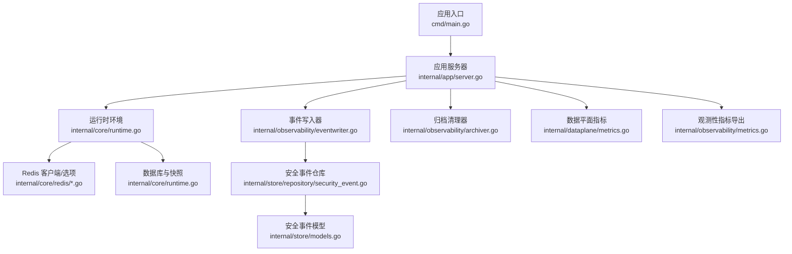
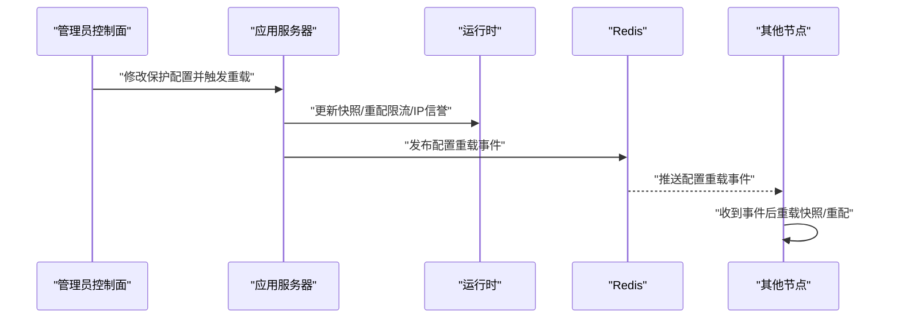
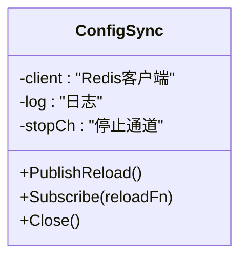
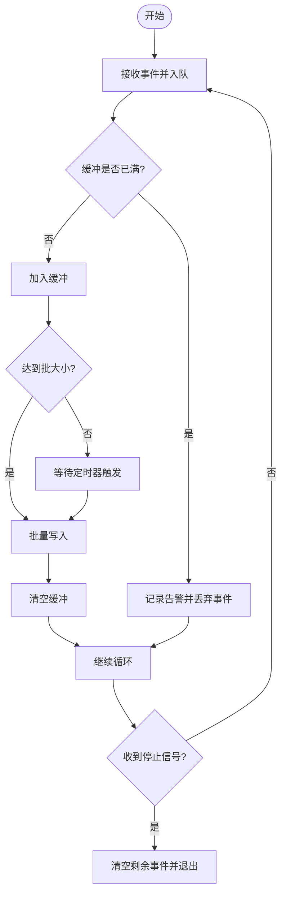
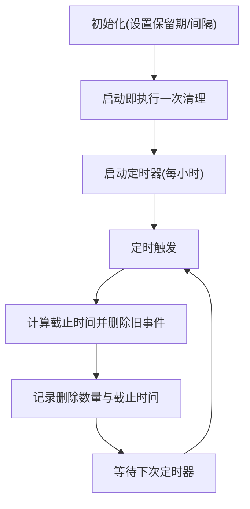
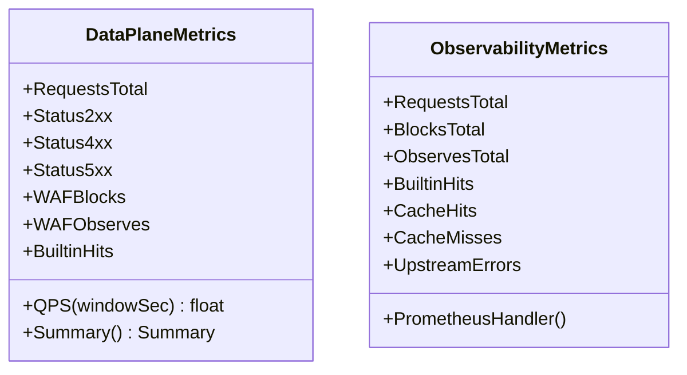
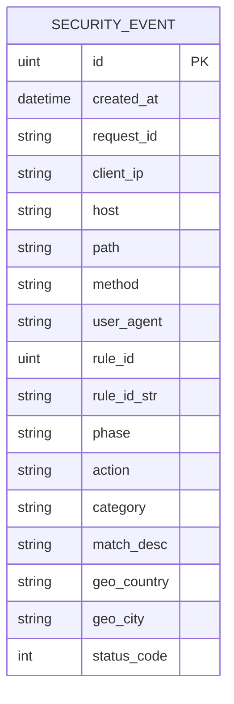
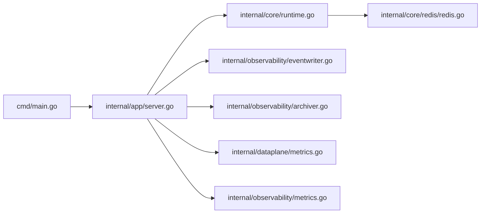

# 消息队列集成

<cite>
**本文档引用的文件**
- [cmd/main.go](file://cmd/main.go)
- [internal/app/server.go](file://internal/app/server.go)
- [internal/core/redis/pubsub.go](file://internal/core/redis/pubsub.go)
- [internal/core/redis/redis.go](file://internal/core/redis/redis.go)
- [internal/core/runtime.go](file://internal/core/runtime.go)
- [internal/core/config.go](file://internal/core/config.go)
- [internal/observability/eventwriter.go](file://internal/observability/eventwriter.go)
- [internal/observability/archiver.go](file://internal/observability/archiver.go)
- [internal/observability/metrics.go](file://internal/observability/metrics.go)
- [internal/store/models.go](file://internal/store/models.go)
- [internal/store/repository/security_event.go](file://internal/store/repository/security_event.go)
- [internal/dataplane/metrics.go](file://internal/dataplane/metrics.go)
</cite>

## 目录
1. [简介](#简介)
2. [项目结构](#项目结构)
3. [核心组件](#核心组件)
4. [架构总览](#架构总览)
5. [详细组件分析](#详细组件分析)
6. [依赖分析](#依赖分析)
7. [性能考虑](#性能考虑)
8. [故障排查指南](#故障排查指南)
9. [结论](#结论)
10. [附录](#附录)

## 简介
本文件面向消息队列集成系统，围绕以下目标展开：  
- Redis Pub/Sub 事件订阅机制：频道管理、消息发布与订阅、事件路由。  
- 分布式事件写入系统：事件序列化、批量处理与持久化策略。  
- 消息队列配置选项：连接参数、缓冲区大小、重连策略等。  
- 事件类型与消息格式：安全事件、性能指标、系统状态消息。  
- 可靠性保障：确认机制、重试策略、死信队列处理。  
- 开发指南：客户端实现、性能优化、故障恢复机制。

## 项目结构
消息队列集成涉及的核心模块如下：
- 应用入口与生命周期：启动、初始化、监听信号、优雅关闭。  
- Redis 集成：可选的 Redis 客户端、Pub/Sub 订阅器、连接健康检查。  
- 观测性与事件写入：异步事件写入器、归档清理器、Prometheus 指标导出。  
- 数据模型与仓库：安全事件数据模型、批量写入与统计查询。  
- 数据平面指标：请求总量、状态码分布、QPS、唯一IP与攻击IP计数。

**图表来源**
- [cmd/main.go:1-10](file://cmd/main.go#L1-L10)
- [internal/app/server.go:35-305](file://internal/app/server.go#L35-L305)
- [internal/core/runtime.go:27-80](file://internal/core/runtime.go#L27-L80)
- [internal/core/redis/redis.go:17-39](file://internal/core/redis/redis.go#L17-L39)
- [internal/observability/eventwriter.go:27-105](file://internal/observability/eventwriter.go#L27-L105)
- [internal/observability/archiver.go:21-72](file://internal/observability/archiver.go#L21-L72)
- [internal/store/repository/security_event.go:13-66](file://internal/store/repository/security_event.go#L13-L66)
- [internal/store/models.go:212-236](file://internal/store/models.go#L212-L236)
- [internal/dataplane/metrics.go:37-136](file://internal/dataplane/metrics.go#L37-L136)
- [internal/observability/metrics.go:25-126](file://internal/observability/metrics.go#L25-L126)

**章节来源**
- [cmd/main.go:1-10](file://cmd/main.go#L1-L10)
- [internal/app/server.go:35-305](file://internal/app/server.go#L35-L305)
- [internal/core/runtime.go:27-80](file://internal/core/runtime.go#L27-L80)

## 核心组件
- Redis Pub/Sub 配置同步：在配置变更时通过通道广播“reload”指令，其他节点收到后触发本地快照重载与资源热更新。  
- 异步事件写入器：将安全事件写入缓冲通道，按批次与定时器批量落库，避免阻塞数据面热路径。  
- 归档清理器：周期性删除超过保留期的安全事件，控制存储增长。  
- 指标收集：数据平面与观测性两套指标，分别用于前端展示与Prometheus导出。  
- 数据模型与仓库：统一的安全事件结构、过滤查询、聚合统计与批量插入。

**章节来源**
- [internal/core/redis/pubsub.go:13-77](file://internal/core/redis/pubsub.go#L13-L77)
- [internal/observability/eventwriter.go:12-105](file://internal/observability/eventwriter.go#L12-L105)
- [internal/observability/archiver.go:11-72](file://internal/observability/archiver.go#L11-L72)
- [internal/store/models.go:212-236](file://internal/store/models.go#L212-L236)
- [internal/store/repository/security_event.go:17-66](file://internal/store/repository/security_event.go#L17-L66)
- [internal/dataplane/metrics.go:9-136](file://internal/dataplane/metrics.go#L9-L136)
- [internal/observability/metrics.go:13-126](file://internal/observability/metrics.go#L13-L126)

## 架构总览
消息队列集成在本项目中主要体现为：
- Redis Pub/Sub：用于跨节点的配置同步通知（非消息队列模式）。  
- 内部事件写入：基于 Go 通道的异步事件写入，非外部消息队列中间件。  
- 指标导出：Prometheus 文本格式导出，供监控系统抓取。  

**图表来源**
- [internal/app/server.go:220-260](file://internal/app/server.go#L220-L260)
- [internal/core/redis/pubsub.go:33-68](file://internal/core/redis/pubsub.go#L33-L68)

## 详细组件分析

### Redis Pub/Sub 配置同步
- 频道管理：使用固定频道名进行配置重载广播。  
- 发布流程：在配置变更时以带超时的上下文发布“reload”。  
- 订阅流程：后台协程订阅频道，收到消息后执行重载逻辑并处理错误。  
- 关闭流程：通过停止通道关闭订阅连接，确保资源释放。

**图表来源**
- [internal/core/redis/pubsub.go:15-77](file://internal/core/redis/pubsub.go#L15-L77)

**章节来源**
- [internal/core/redis/pubsub.go:13-77](file://internal/core/redis/pubsub.go#L13-L77)
- [internal/app/server.go:220-260](file://internal/app/server.go#L220-L260)

### 异步事件写入器
- 缓冲与批处理：内部通道容量、批大小与刷新间隔可调；定时器与事件到达双重触发批量写入。  
- 非阻塞入队：缓冲满时丢弃事件并记录告警，避免阻塞数据面。  
- 关闭与收尾：关闭时清空剩余事件并等待工作协程退出。  
- 批量持久化：使用仓库层的分批插入接口，降低单次事务开销。

**图表来源**
- [internal/observability/eventwriter.go:41-105](file://internal/observability/eventwriter.go#L41-L105)

**章节来源**
- [internal/observability/eventwriter.go:12-105](file://internal/observability/eventwriter.go#L12-L105)
- [internal/store/repository/security_event.go:55-60](file://internal/store/repository/security_event.go#L55-L60)

### 归档清理器
- 周期性清理：按小时间隔扫描并删除超过保留期的事件。  
- 保留期配置：默认30天，可通过构造函数传入天数。  
- 清理统计：记录删除数量并在日志中输出清理摘要。

**图表来源**
- [internal/observability/archiver.go:21-72](file://internal/observability/archiver.go#L21-L72)

**章节来源**
- [internal/observability/archiver.go:11-72](file://internal/observability/archiver.go#L11-L72)

### 指标与监控
- 数据平面指标：原子计数器与环形窗口计算QPS，支持唯一IP与攻击IP去重计数。  
- 观测性指标：Prometheus 文本格式导出，包含请求总数、拦截数、缓存命中/未命中、上游错误、进程运行时信息等。  
- 指标汇总：提供结构化摘要，便于API或前端展示。

**图表来源**
- [internal/dataplane/metrics.go:10-136](file://internal/dataplane/metrics.go#L10-L136)
- [internal/observability/metrics.go:14-126](file://internal/observability/metrics.go#L14-L126)

**章节来源**
- [internal/dataplane/metrics.go:9-136](file://internal/dataplane/metrics.go#L9-L136)
- [internal/observability/metrics.go:13-126](file://internal/observability/metrics.go#L13-L126)

### 数据模型与仓库
- 安全事件模型：包含请求标识、客户端IP、主机、路径、方法、UA、规则ID、阶段、动作、类别、匹配描述、地理信息、状态码等字段。  
- 仓库接口：列表查询、详情获取、单条与批量创建、按时间删除、分类统计、Top IP/路径/规则、时间线聚合、计数等。

**图表来源**
- [internal/store/models.go:214-236](file://internal/store/models.go#L214-L236)

**章节来源**
- [internal/store/models.go:212-236](file://internal/store/models.go#L212-L236)
- [internal/store/repository/security_event.go:17-192](file://internal/store/repository/security_event.go#L17-L192)

## 依赖分析
- 启动与运行时：应用入口调用应用服务器启动流程，运行时负责数据库与Redis初始化、Ping校验、快照构建与缓存。  
- Redis 集成：运行时根据环境变量创建可选Redis客户端，提供Ping健康检查；应用服务器在需要时创建配置同步实例。  
- 事件写入：运行时创建事件写入器与归档器，并注入到数据平面处理器中。  
- 指标导出：观测性指标导出挂载到控制面路由，Prometheus抓取。

**图表来源**
- [cmd/main.go:7-9](file://cmd/main.go#L7-L9)
- [internal/app/server.go:35-305](file://internal/app/server.go#L35-L305)
- [internal/core/runtime.go:27-80](file://internal/core/runtime.go#L27-L80)
- [internal/core/redis/redis.go:17-39](file://internal/core/redis/redis.go#L17-L39)
- [internal/observability/eventwriter.go:27-39](file://internal/observability/eventwriter.go#L27-L39)
- [internal/observability/archiver.go:21-35](file://internal/observability/archiver.go#L21-L35)
- [internal/dataplane/metrics.go:37-136](file://internal/dataplane/metrics.go#L37-L136)
- [internal/observability/metrics.go:52-126](file://internal/observability/metrics.go#L52-L126)

**章节来源**
- [cmd/main.go:1-10](file://cmd/main.go#L1-L10)
- [internal/app/server.go:35-305](file://internal/app/server.go#L35-L305)
- [internal/core/runtime.go:27-80](file://internal/core/runtime.go#L27-L80)

## 性能考虑
- 事件写入器
  - 缓冲区容量：默认4096，可根据峰值吞吐调整。  
  - 批大小：默认64，兼顾延迟与吞吐。  
  - 刷新间隔：默认2秒，避免长时间积压。  
  - 非阻塞入队：缓冲满时丢弃，防止阻塞数据面。  
- 归档清理
  - 默认每小时清理一次，保留期30天，可按业务需求调整。  
- 指标采集
  - 使用原子计数器与环形窗口，避免锁竞争；Prometheus导出为纯文本，解析简单高效。  
- Redis 连接
  - 可选启用，Ping校验确保可用性；超时参数已设定，避免阻塞启动。

[本节为通用性能建议，不直接分析具体文件]

## 故障排查指南
- Redis Pub/Sub
  - 发布失败：检查Redis连接与权限，查看告警日志。  
  - 订阅异常：确认频道名称一致，检查订阅协程是否被关闭。  
- 事件写入器
  - 告警“缓冲已满，丢弃事件”：增大缓冲容量或提升写入器性能。  
  - 批量写入失败：检查数据库连接与事务状态，关注错误日志中的条数统计。  
- 归档清理
  - 删除数量为0：确认保留期设置与当前时间范围。  
  - 错误日志：关注清理过程中的异常并修复数据库问题。  
- 指标导出
  - Prometheus 抓取失败：检查导出路由与网络连通性。  
  - 指标缺失：确认指标收集器是否正确注册与更新。

**章节来源**
- [internal/core/redis/pubsub.go:33-43](file://internal/core/redis/pubsub.go#L33-L43)
- [internal/observability/eventwriter.go:41-49](file://internal/observability/eventwriter.go#L41-L49)
- [internal/observability/eventwriter.go:95-104](file://internal/observability/eventwriter.go#L95-L104)
- [internal/observability/archiver.go:59-71](file://internal/observability/archiver.go#L59-L71)
- [internal/observability/metrics.go:52-126](file://internal/observability/metrics.go#L52-L126)

## 结论
本项目的消息队列集成以Redis Pub/Sub实现跨节点配置同步，以内部异步事件写入器实现高吞吐、低延迟的安全事件持久化，辅以归档清理与多维度指标导出，形成完整的可观测与可靠性保障体系。对于需要更高可靠性的场景，可在现有基础上扩展为外部消息队列中间件（如Kafka/RabbitMQ），并引入确认与重试、死信队列等机制。

[本节为总结性内容，不直接分析具体文件]

## 附录

### 消息队列配置选项
- Redis 连接参数
  - 地址：RedisAddr  
  - 密码：RedisPassword  
  - 数据库：RedisDB  
  - 超时：连接/读/写超时已在客户端创建时设置  
- 事件写入器参数
  - 缓冲区容量：默认4096  
  - 批大小：默认64  
  - 刷新间隔：默认2秒  
- 归档清理参数
  - 保留期：默认30天（可配置）  
  - 清理间隔：默认1小时  

**章节来源**
- [internal/core/redis/redis.go:17-39](file://internal/core/redis/redis.go#L17-L39)
- [internal/observability/eventwriter.go:27-39](file://internal/observability/eventwriter.go#L27-L39)
- [internal/observability/archiver.go:21-35](file://internal/observability/archiver.go#L21-L35)
- [internal/core/config.go:74-102](file://internal/core/config.go#L74-L102)

### 事件类型与消息格式
- 安全事件
  - 字段：请求ID、客户端IP、主机、路径、方法、用户代理、规则ID/字符串、阶段、动作、类别、匹配描述、地理国家/城市、状态码  
  - 用途：审计、统计、可视化  
- 性能指标
  - 数据平面：请求总量、状态码分布、WAF拦截/观察、内置命中、QPS、唯一IP、攻击IP  
  - 观测性：请求总数、拦截/观察、内置命中、缓存命中/未命中、上游错误、进程运行时信息  
- 系统状态消息
  - 配置重载：通过Redis Pub/Sub广播“reload”，触发节点间同步

**章节来源**
- [internal/store/models.go:214-236](file://internal/store/models.go#L214-L236)
- [internal/dataplane/metrics.go:105-136](file://internal/dataplane/metrics.go#L105-L136)
- [internal/observability/metrics.go:105-126](file://internal/observability/metrics.go#L105-L126)
- [internal/core/redis/pubsub.go:11-11](file://internal/core/redis/pubsub.go#L11-L11)

### 消息可靠性保证
- 当前实现
  - Redis Pub/Sub：至少一次传递，无显式确认与重试；通过节点内重载流程保证最终一致性。  
  - 事件写入：异步批写，缓冲满丢弃；无重试与死信队列。  
- 建议增强
  - 引入外部消息队列中间件，实现确认、重试与死信队列。  
  - 对关键事件（如配置变更）增加幂等处理与去重。  

**章节来源**
- [internal/core/redis/pubsub.go:33-68](file://internal/core/redis/pubsub.go#L33-L68)
- [internal/observability/eventwriter.go:41-49](file://internal/observability/eventwriter.go#L41-L49)

### 消息队列集成开发指南
- 客户端实现
  - Redis：使用可选客户端创建与Ping校验，确保可用后再启用订阅/发布。  
  - 事件写入：复用现有事件写入器，按需调整缓冲与批参数。  
- 性能优化
  - 提升批大小与刷新间隔以降低写入次数；扩大缓冲容量以应对突发流量。  
  - 使用原子计数器与环形窗口计算QPS，减少锁竞争。  
- 故障恢复
  - 订阅异常：捕获错误并记录，必要时重启订阅协程。  
  - 写入失败：记录错误与批量大小，必要时降级为同步写入或启用死信队列。  

**章节来源**
- [internal/core/runtime.go:49-59](file://internal/core/runtime.go#L49-L59)
- [internal/observability/eventwriter.go:27-39](file://internal/observability/eventwriter.go#L27-L39)
- [internal/dataplane/metrics.go:37-99](file://internal/dataplane/metrics.go#L37-L99)