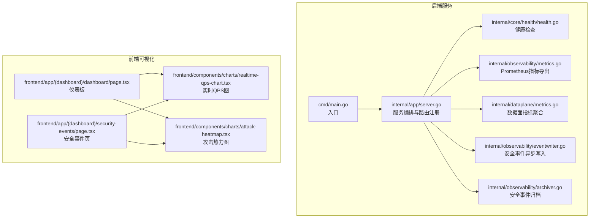
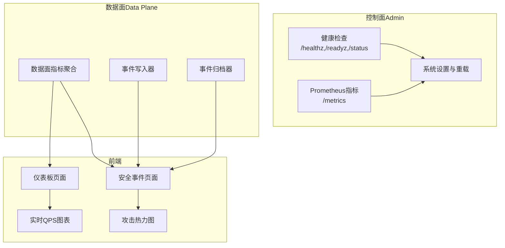
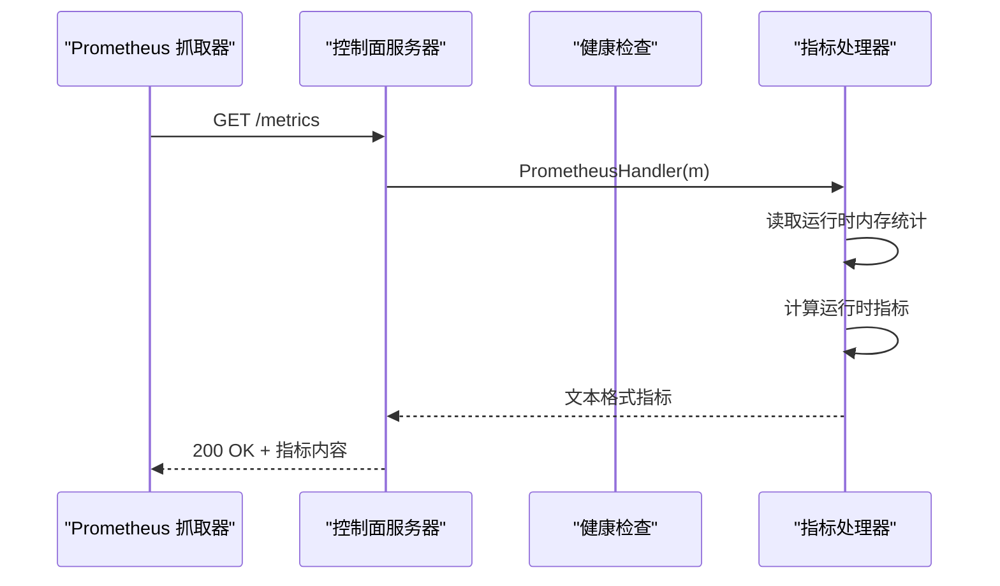
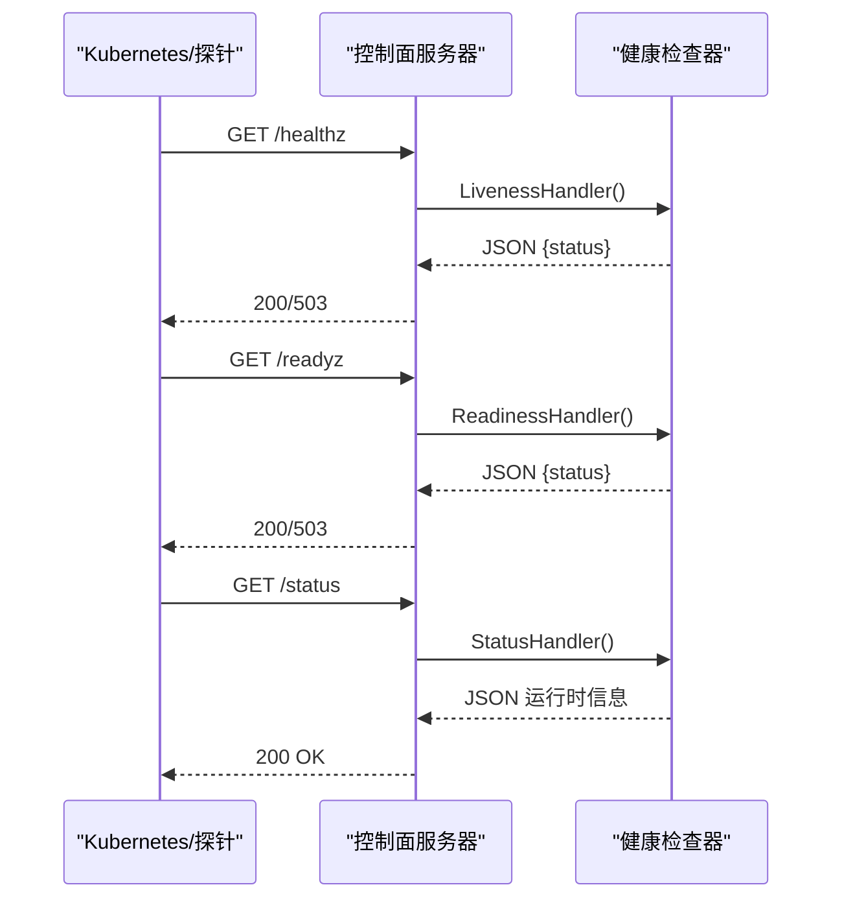
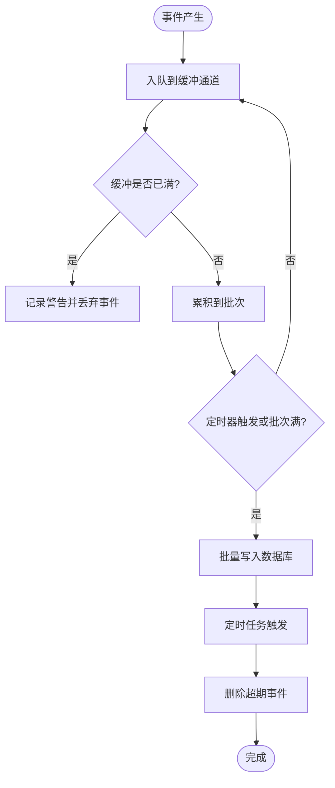
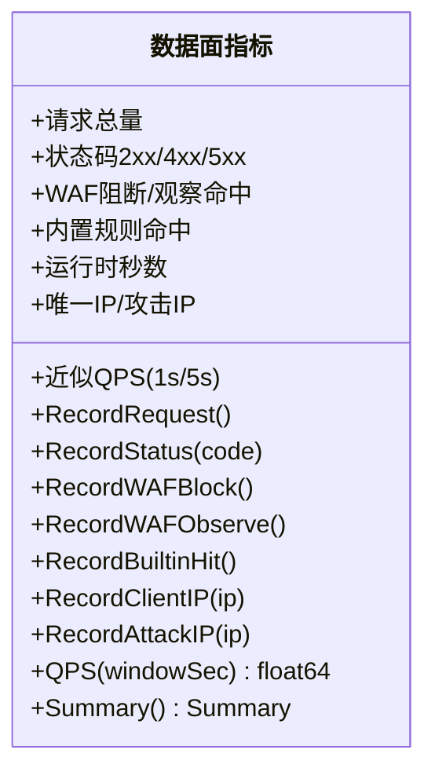
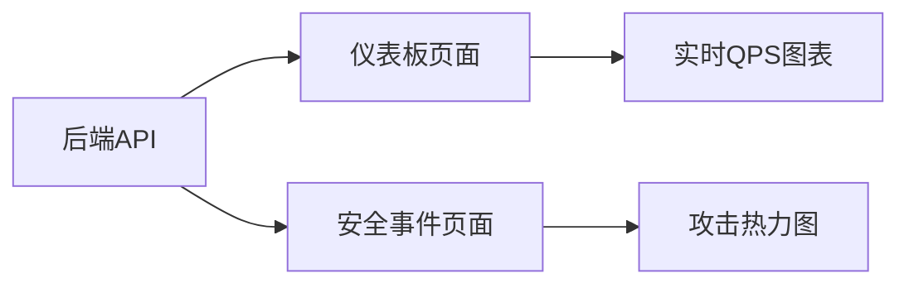
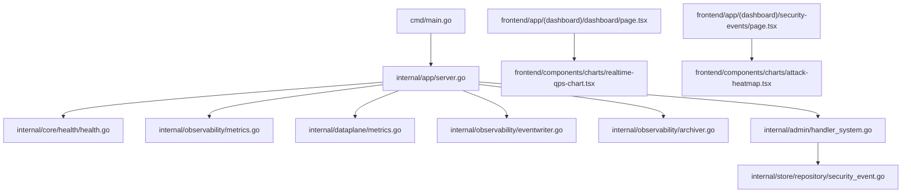

# 监控系统集成

<cite>
**本文档引用的文件**
- [cmd/main.go](file://cmd/main.go)
- [internal/app/server.go](file://internal/app/server.go)
- [internal/observability/metrics.go](file://internal/observability/metrics.go)
- [internal/observability/eventwriter.go](file://internal/observability/eventwriter.go)
- [internal/observability/archiver.go](file://internal/observability/archiver.go)
- [internal/dataplane/metrics.go](file://internal/dataplane/metrics.go)
- [internal/core/health/health.go](file://internal/core/health/health.go)
- [internal/admin/handler_system.go](file://internal/admin/handler_system.go)
- [internal/admin/handler_security_event.go](file://internal/admin/handler_security_event.go)
- [internal/store/repository/security_event.go](file://internal/store/repository/security_event.go)
- [frontend/components/charts/realtime-qps-chart.tsx](file://frontend/components/charts/realtime-qps-chart.tsx)
- [frontend/components/charts/attack-heatmap.tsx](file://frontend/components/charts/attack-heatmap.tsx)
- [frontend/app/(dashboard)/dashboard/page.tsx](file://frontend/app/(dashboard)/dashboard/page.tsx)
- [frontend/app/(dashboard)/security-events/page.tsx](file://frontend/app/(dashboard)/security-events/page.tsx)
</cite>

## 目录
1. [简介](#简介)
2. [项目结构](#项目结构)
3. [核心组件](#核心组件)
4. [架构总览](#架构总览)
5. [详细组件分析](#详细组件分析)
6. [依赖关系分析](#依赖关系分析)
7. [性能考虑](#性能考虑)
8. [故障排查指南](#故障排查指南)
9. [结论](#结论)
10. [附录](#附录)

## 简介
本文件面向运维与开发人员，系统性阐述 My-OpenWaf 的监控系统集成方案，涵盖以下方面：
- Prometheus 指标导出机制：指标定义、标签管理与数据采集策略
- 健康检查系统集成：存活探针、就绪探针与健康状态报告
- 监控指标分类：安全事件统计、性能指标与资源使用情况
- 告警集成配置：阈值设置、告警规则与通知渠道
- 监控数据可视化：仪表板配置、图表定制与实时监控
- 监控系统部署指南：监控服务配置、数据保留策略与性能调优建议

## 项目结构
监控相关能力分布在后端 Go 服务与前端 React 可视化两部分：
- 后端（Go）：运行时健康检查、Prometheus 兼容指标导出、安全事件异步写入与归档、数据面指标聚合
- 前端（React）：仪表板页面、实时 QPS 图表、攻击热力图等可视化组件

**图表来源**
- [cmd/main.go:1-10](file://cmd/main.go#L1-L10)
- [internal/app/server.go:268-304](file://internal/app/server.go#L268-L304)
- [internal/core/health/health.go:14-94](file://internal/core/health/health.go#L14-L94)
- [internal/observability/metrics.go:13-125](file://internal/observability/metrics.go#L13-L125)
- [internal/observability/eventwriter.go:12-104](file://internal/observability/eventwriter.go#L12-L104)
- [internal/observability/archiver.go:11-71](file://internal/observability/archiver.go#L11-L71)
- [internal/dataplane/metrics.go:9-135](file://internal/dataplane/metrics.go#L9-L135)
- [frontend/app/(dashboard)/dashboard/page.tsx:1-126](file://frontend/app/(dashboard)/dashboard/page.tsx#L1-L126)
- [frontend/app/(dashboard)/security-events/page.tsx:60-119](file://frontend/app/(dashboard)/security-events/page.tsx#L60-L119)
- [frontend/components/charts/realtime-qps-chart.tsx:1-81](file://frontend/components/charts/realtime-qps-chart.tsx#L1-L81)
- [frontend/components/charts/attack-heatmap.tsx:1-79](file://frontend/components/charts/attack-heatmap.tsx#L1-L79)

**章节来源**
- [cmd/main.go:1-10](file://cmd/main.go#L1-L10)
- [internal/app/server.go:35-305](file://internal/app/server.go#L35-L305)

## 核心组件
- 运行时健康检查：提供存活探针、就绪探针与运行状态接口，用于容器编排与外部监控系统探测
- Prometheus 兼容指标导出：暴露标准 HTTP 接口，输出文本格式指标，便于 Prometheus 抓取
- 数据面指标聚合：在数据平面收集请求总量、状态码分布、WAF 阻断/观察命中、QPS、唯一 IP/攻击 IP 等
- 安全事件异步写入与归档：通过缓冲通道批量写入数据库，避免阻塞热路径；定期清理过期事件
- 前端可视化：仪表板与安全事件页面，结合图表组件展示实时与历史趋势

**章节来源**
- [internal/core/health/health.go:14-94](file://internal/core/health/health.go#L14-L94)
- [internal/observability/metrics.go:13-125](file://internal/observability/metrics.go#L13-L125)
- [internal/dataplane/metrics.go:9-135](file://internal/dataplane/metrics.go#L9-L135)
- [internal/observability/eventwriter.go:12-104](file://internal/observability/eventwriter.go#L12-L104)
- [internal/observability/archiver.go:11-71](file://internal/observability/archiver.go#L11-L71)

## 架构总览
下图展示了监控相关模块的交互关系与数据流向。

**图表来源**
- [internal/app/server.go:268-304](file://internal/app/server.go#L268-L304)
- [internal/core/health/health.go:40-94](file://internal/core/health/health.go#L40-L94)
- [internal/observability/metrics.go:51-125](file://internal/observability/metrics.go#L51-L125)
- [internal/dataplane/metrics.go:37-135](file://internal/dataplane/metrics.go#L37-L135)
- [internal/observability/eventwriter.go:27-104](file://internal/observability/eventwriter.go#L27-L104)
- [internal/observability/archiver.go:21-71](file://internal/observability/archiver.go#L21-L71)
- [frontend/app/(dashboard)/dashboard/page.tsx:59-126](file://frontend/app/(dashboard)/dashboard/page.tsx#L59-L126)
- [frontend/app/(dashboard)/security-events/page.tsx:60-119](file://frontend/app/(dashboard)/security-events/page.tsx#L60-L119)
- [frontend/components/charts/realtime-qps-chart.tsx:24-80](file://frontend/components/charts/realtime-qps-chart.tsx#L24-L80)
- [frontend/components/charts/attack-heatmap.tsx:25-78](file://frontend/components/charts/attack-heatmap.tsx#L25-L78)

## 详细组件分析

### Prometheus 指标导出机制
- 指标定义
  - 请求总量、阻断总量、观察总量、内置规则命中数、响应缓存命中/未命中、上游错误计数
  - 进程运行时长、当前 goroutine 数、内存分配字节、系统内存字节、GC 暂停累计纳秒
- 标签管理
  - 当前实现以指标名区分维度，未使用标签（Prometheus text exposition format）
- 数据采集策略
  - 每次 /metrics 请求读取运行时内存统计与启动时间，动态计算运行时指标
  - 计数器类指标为单调递增，gauge 类指标为瞬时值
- 路由注册
  - 控制面服务器在启动时注册 /metrics 路由，交由指标处理器生成文本格式响应

**图表来源**
- [internal/app/server.go:272](file://internal/app/server.go#L272)
- [internal/observability/metrics.go:51-125](file://internal/observability/metrics.go#L51-L125)

**章节来源**
- [internal/observability/metrics.go:13-125](file://internal/observability/metrics.go#L13-L125)
- [internal/app/server.go:272](file://internal/app/server.go#L272)

### 健康检查系统集成
- 存活探针（/healthz）
  - 返回进程“运行中”状态，通常恒为健康
- 就绪探针（/readyz）
  - 依赖数据库连接可用性与快照加载状态，确保服务具备处理请求的能力
- 健康状态报告（/status）
  - 返回运行时信息：存活/就绪、配置修订号、站点数量、监听器数量、goroutine 数、堆内存、Go 版本、CPU 数量
- 路由注册
  - 控制面服务器在启动时注册上述三个健康检查端点

**图表来源**
- [internal/app/server.go:269-272](file://internal/app/server.go#L269-L272)
- [internal/core/health/health.go:40-94](file://internal/core/health/health.go#L40-L94)

**章节来源**
- [internal/core/health/health.go:14-94](file://internal/core/health/health.go#L14-L94)
- [internal/app/server.go:269-272](file://internal/app/server.go#L269-L272)

### 监控指标分类与采集

#### 安全事件统计
- 异步事件写入
  - 使用带缓冲通道的事件写入器，批量写入数据库，避免阻塞数据面热路径
  - 支持丢弃保护：缓冲满时记录警告并丢弃新事件
- 事件归档
  - 定时清理超过保留期的历史事件，默认保留 30 天
- 统计查询
  - 提供分类统计、Top IP、Top 路径、Top 规则、时间线（按小时）等聚合查询
- 前端可视化
  - 仪表板与安全事件页面通过 API 获取统计数据，并渲染图表

**图表来源**
- [internal/observability/eventwriter.go:27-104](file://internal/observability/eventwriter.go#L27-L104)
- [internal/observability/archiver.go:21-71](file://internal/observability/archiver.go#L21-L71)
- [internal/store/repository/security_event.go:62-160](file://internal/store/repository/security_event.go#L62-L160)

**章节来源**
- [internal/observability/eventwriter.go:12-104](file://internal/observability/eventwriter.go#L12-L104)
- [internal/observability/archiver.go:11-71](file://internal/observability/archiver.go#L11-L71)
- [internal/store/repository/security_event.go:62-160](file://internal/store/repository/security_event.go#L62-L160)
- [internal/admin/handler_security_event.go:77-126](file://internal/admin/handler_security_event.go#L77-L126)

#### 性能指标
- 数据面指标
  - 请求总量、状态码分布（2xx/4xx/5xx）、WAF 阻断/观察命中、内置规则命中
  - 近似 QPS（1 秒与 5 秒窗口）、运行时秒数、唯一客户端 IP 数、攻击来源 IP 数
- 指标聚合
  - 使用环形桶记录每秒请求数，支持滑动窗口 QPS 计算
  - 使用原子计数器保证并发安全
- 前端展示
  - 仪表板页面定时轮询汇总数据，驱动实时图表更新

**图表来源**
- [internal/dataplane/metrics.go:9-135](file://internal/dataplane/metrics.go#L9-L135)

**章节来源**
- [internal/dataplane/metrics.go:9-135](file://internal/dataplane/metrics.go#L9-L135)
- [frontend/app/(dashboard)/dashboard/page.tsx:59-126](file://frontend/app/(dashboard)/dashboard/page.tsx#L59-L126)

#### 资源使用情况
- Prometheus 指标
  - 进程运行时长、goroutine 数、内存分配字节、系统内存字节、GC 暂停累计纳秒
- 健康状态报告
  - 返回 goroutine 数、堆内存、Go 版本、CPU 数量等运行时信息

**章节来源**
- [internal/observability/metrics.go:51-125](file://internal/observability/metrics.go#L51-L125)
- [internal/core/health/health.go:62-94](file://internal/core/health/health.go#L62-L94)

### 告警集成配置
- 阈值设置
  - 可通过系统设置接口调整防护相关阈值（如限流窗口、最大请求数、自动封禁阈值等），变更后触发热重载
- 告警规则
  - 基于 Prometheus 指标编写规则，例如：
    - QPS 超过阈值持续 N 分钟
    - 上游 5xx 错误率超过阈值
    - WAF 阻断数异常增长
    - 进程 goroutine 数过高或内存占用异常
- 通知渠道
  - 将告警规则与 Alertmanager 集成，配置 Slack、邮件、Webhook 等通知方式

**章节来源**
- [internal/admin/handler_system.go:28-91](file://internal/admin/handler_system.go#L28-L91)
- [internal/admin/handler_system.go:142-150](file://internal/admin/handler_system.go#L142-L150)
- [internal/app/server.go:220-242](file://internal/app/server.go#L220-L242)

### 监控数据可视化
- 仪表板
  - 展示实时 QPS、请求总量、状态码分布、WAF 阻断/观察命中、运行时信息等
  - 支持时间范围切换（近24小时/近7天/近30天），联动攻击时间线热力图
- 安全事件页面
  - 支持按动作、类别、客户端 IP 等条件筛选，展示事件列表与统计
  - 提供攻击热力图，按小时显示攻击次数强度
- 图表定制
  - 实时 QPS 图采用面积图，支持自适应高度与工具提示
  - 攻击热力图根据强度映射不同颜色，突出高风险时段

**图表来源**
- [frontend/app/(dashboard)/dashboard/page.tsx:59-126](file://frontend/app/(dashboard)/dashboard/page.tsx#L59-L126)
- [frontend/app/(dashboard)/security-events/page.tsx:60-119](file://frontend/app/(dashboard)/security-events/page.tsx#L60-L119)
- [frontend/components/charts/realtime-qps-chart.tsx:24-80](file://frontend/components/charts/realtime-qps-chart.tsx#L24-L80)
- [frontend/components/charts/attack-heatmap.tsx:25-78](file://frontend/components/charts/attack-heatmap.tsx#L25-L78)

**章节来源**
- [frontend/app/(dashboard)/dashboard/page.tsx:1-126](file://frontend/app/(dashboard)/dashboard/page.tsx#L1-L126)
- [frontend/app/(dashboard)/security-events/page.tsx:60-119](file://frontend/app/(dashboard)/security-events/page.tsx#L60-L119)
- [frontend/components/charts/realtime-qps-chart.tsx:1-81](file://frontend/components/charts/realtime-qps-chart.tsx#L1-L81)
- [frontend/components/charts/attack-heatmap.tsx:1-79](file://frontend/components/charts/attack-heatmap.tsx#L1-L79)

### 监控系统部署指南
- 监控服务配置
  - 在控制面服务器上启用 /metrics、/healthz、/readyz、/status 端点
  - 将 /metrics 暴露给 Prometheus，配置抓取间隔与超时
- 数据保留策略
  - 默认保留安全事件 30 天；可通过归档器参数调整
- 性能调优建议
  - 指标处理器仅读取必要运行时信息，避免昂贵操作
  - 事件写入器使用批量与定时刷新，合理设置缓冲大小与刷新周期
  - 归档任务按固定频率执行，避免对数据库造成峰值压力

**章节来源**
- [internal/app/server.go:268-304](file://internal/app/server.go#L268-L304)
- [internal/observability/archiver.go:21-35](file://internal/observability/archiver.go#L21-L35)
- [internal/observability/eventwriter.go:27-39](file://internal/observability/eventwriter.go#L27-L39)

## 依赖关系分析

**图表来源**
- [cmd/main.go:1-10](file://cmd/main.go#L1-L10)
- [internal/app/server.go:35-305](file://internal/app/server.go#L35-L305)
- [internal/core/health/health.go:14-94](file://internal/core/health/health.go#L14-L94)
- [internal/observability/metrics.go:13-125](file://internal/observability/metrics.go#L13-L125)
- [internal/dataplane/metrics.go:9-135](file://internal/dataplane/metrics.go#L9-L135)
- [internal/observability/eventwriter.go:12-104](file://internal/observability/eventwriter.go#L12-L104)
- [internal/observability/archiver.go:11-71](file://internal/observability/archiver.go#L11-L71)
- [internal/admin/handler_system.go:12-162](file://internal/admin/handler_system.go#L12-L162)
- [internal/store/repository/security_event.go:62-160](file://internal/store/repository/security_event.go#L62-L160)
- [frontend/app/(dashboard)/dashboard/page.tsx:1-126](file://frontend/app/(dashboard)/dashboard/page.tsx#L1-L126)
- [frontend/app/(dashboard)/security-events/page.tsx:60-119](file://frontend/app/(dashboard)/security-events/page.tsx#L60-L119)
- [frontend/components/charts/realtime-qps-chart.tsx:1-81](file://frontend/components/charts/realtime-qps-chart.tsx#L1-L81)
- [frontend/components/charts/attack-heatmap.tsx:1-79](file://frontend/components/charts/attack-heatmap.tsx#L1-L79)

**章节来源**
- [internal/app/server.go:35-305](file://internal/app/server.go#L35-L305)

## 性能考虑
- 指标导出
  - 仅在请求到达时读取运行时统计，避免高频昂贵操作
- 事件写入
  - 批量写入与定时刷新降低数据库写放大；缓冲区满时丢弃保护避免阻塞
- 归档清理
  - 固定频率清理过期事件，避免历史数据无限增长
- 前端轮询
  - 仪表板与安全事件页面采用定时轮询，建议根据业务量调整轮询间隔

[本节为通用指导，无需特定文件来源]

## 故障排查指南
- /metrics 无法抓取
  - 检查控制面服务器是否正确注册 /metrics 路由
  - 确认 Prometheus 抓取目标与网络连通性
- /healthz /readyz 返回非 200
  - 检查数据库连接与快照加载状态
  - 查看 /status 返回的运行时信息定位问题
- 安全事件缺失或延迟
  - 检查事件写入器缓冲是否频繁溢出
  - 确认归档任务未删除过早的数据
- 前端图表无数据
  - 检查仪表板与安全事件页面的轮询逻辑与 API 响应

**章节来源**
- [internal/app/server.go:268-304](file://internal/app/server.go#L268-L304)
- [internal/core/health/health.go:40-94](file://internal/core/health/health.go#L40-L94)
- [internal/observability/eventwriter.go:41-49](file://internal/observability/eventwriter.go#L41-L49)
- [internal/observability/archiver.go:59-71](file://internal/observability/archiver.go#L59-L71)
- [frontend/app/(dashboard)/dashboard/page.tsx:105-109](file://frontend/app/(dashboard)/dashboard/page.tsx#L105-L109)
- [frontend/app/(dashboard)/security-events/page.tsx:113-117](file://frontend/app/(dashboard)/security-events/page.tsx#L113-L117)

## 结论
本监控体系通过健康检查、Prometheus 指标导出、数据面指标聚合、安全事件异步写入与归档，以及前端可视化，实现了从基础设施到业务层面的全链路可观测性。配合可配置的阈值与告警规则，能够满足生产环境的运维与安全需求。建议在部署时结合实际流量规模调优缓冲与轮询参数，并制定合理的数据保留策略。

[本节为总结性内容，无需特定文件来源]

## 附录
- 关键端点
  - /healthz：存活探针
  - /readyz：就绪探针
  - /status：健康状态报告
  - /metrics：Prometheus 指标导出
- 相关配置项
  - 系统设置接口支持动态调整防护阈值与功能开关，变更后触发热重载

**章节来源**
- [internal/app/server.go:268-304](file://internal/app/server.go#L268-L304)
- [internal/admin/handler_system.go:28-91](file://internal/admin/handler_system.go#L28-L91)
- [internal/admin/handler_system.go:142-150](file://internal/admin/handler_system.go#L142-L150)