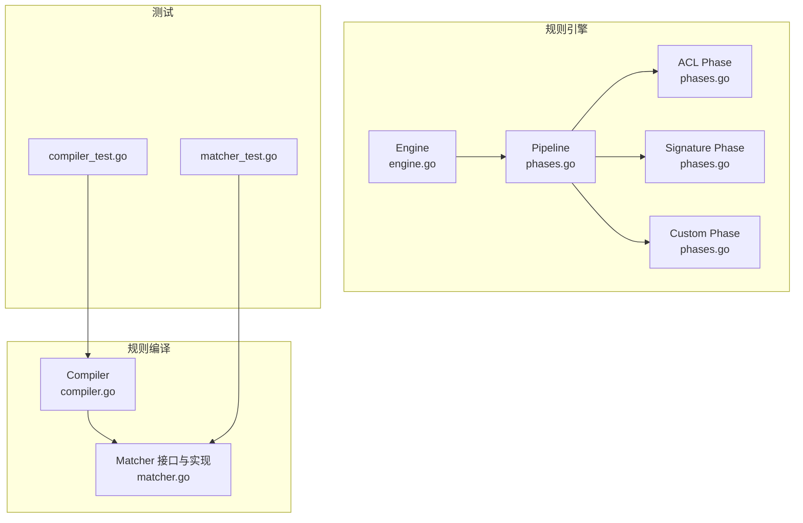
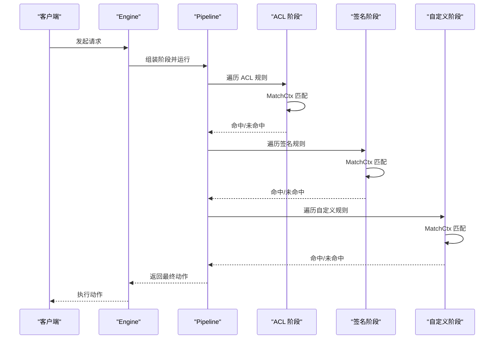
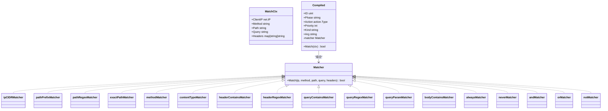
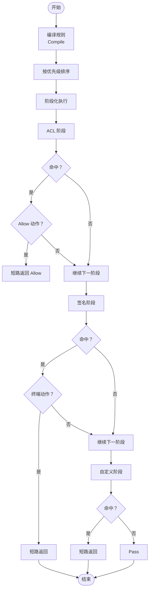
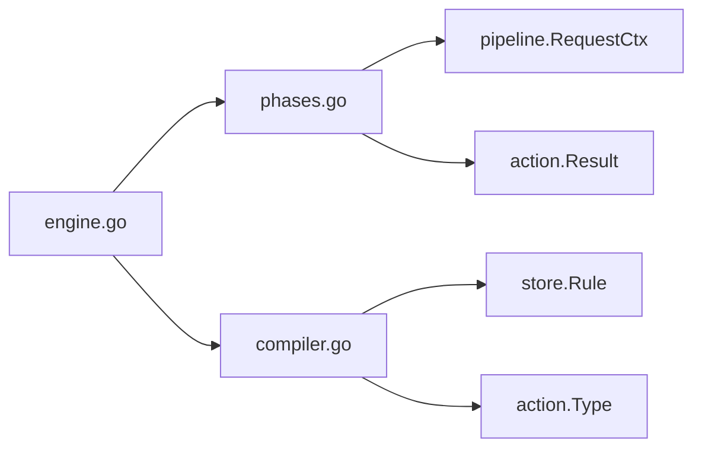

# 匹配器开发

<cite>
**本文引用的文件列表**
- [matcher.go](file://internal/core/rules/matcher.go)
- [matcher_test.go](file://internal/core/rules/matcher_test.go)
- [compiler.go](file://internal/core/rules/compiler.go)
- [compiler_test.go](file://internal/core/rules/compiler_test.go)
- [phases.go](file://internal/core/rules/phases.go)
- [engine.go](file://internal/core/engine/engine.go)
- [eval.go](file://internal/waf/eval.go)
</cite>

## 目录
1. [简介](#简介)
2. [项目结构](#项目结构)
3. [核心组件](#核心组件)
4. [架构总览](#架构总览)
5. [详细组件分析](#详细组件分析)
6. [依赖分析](#依赖分析)
7. [性能考虑](#性能考虑)
8. [故障排查指南](#故障排查指南)
9. [结论](#结论)
10. [附录](#附录)

## 简介
本文件面向匹配器开发与维护人员，系统性阐述匹配器接口设计、实现模式与运行时行为，覆盖以下主题：
- MatchCtx 上下文结构与匹配数据来源
- 内置匹配器的实现原理（IP 地址、路径、正则、HTTP 头部、方法、内容类型、查询参数等）
- 自定义匹配器的开发流程（接口实现、参数解析、匹配算法）
- 性能优化策略（缓存机制、索引使用、预编译正则）
- 测试方法与调试技巧（单元测试、基准测试）

## 项目结构
匹配器子系统位于 internal/core/rules 目录，核心文件包括：
- matcher.go：匹配器接口与内置实现、复合匹配器、正则缓存与 JSON 条件解析
- compiler.go：规则编译为可执行 Compiled 结构体，负责优先级排序与构建 Matcher
- compiler_test.go：规则编译与匹配的单元测试
- matcher_test.go：各类匹配器的行为测试
- phases.go：规则阶段化执行（ACL、签名、自定义等），以及 MatchCtx 定义
- engine.go：引擎入口，组织各阶段并驱动规则匹配
- eval.go：简化评估接口，用于快速评估 ACL 与路径/查询匹配

图表来源
- [engine.go:15-129](file://internal/core/engine/engine.go#L15-L129)
- [phases.go:34-94](file://internal/core/rules/phases.go#L34-L94)
- [compiler.go:27-55](file://internal/core/rules/compiler.go#L27-L55)
- [matcher.go:11-141](file://internal/core/rules/matcher.go#L11-L141)

章节来源
- [engine.go:15-129](file://internal/core/engine/engine.go#L15-L129)
- [phases.go:34-94](file://internal/core/rules/phases.go#L34-L94)
- [compiler.go:27-55](file://internal/core/rules/compiler.go#L27-L55)
- [matcher.go:11-141](file://internal/core/rules/matcher.go#L11-L141)

## 核心组件
- Matcher 接口：统一的匹配抽象，接收 MatchCtx 并返回布尔值
- MatchCtx：请求上下文，包含客户端 IP、HTTP 方法、路径、原始查询字符串、请求头映射
- Compiled：编译后的规则，持有已构建的 Matcher，并按优先级排序
- 内置匹配器：IP CIDR、路径前缀/精确/正则、查询字符串包含/正则、头部包含/正则、方法、内容类型、User-Agent、body_contains、query_param、always/never
- 复合匹配器：and/or/not 组合，支持 JSON 表达式
- 正则缓存：全局 RWMutex 保护的正则表达式缓存，避免重复编译

章节来源
- [matcher.go:11-141](file://internal/core/rules/matcher.go#L11-L141)
- [phases.go:19-26](file://internal/core/rules/phases.go#L19-L26)
- [compiler.go:11-25](file://internal/core/rules/compiler.go#L11-L25)
- [matcher.go:271-296](file://internal/core/rules/matcher.go#L271-L296)

## 架构总览
匹配器在引擎中通过多阶段执行，每个阶段遍历对应规则集合，命中即根据动作类型决定是否短路或继续。MatchCtx 由 pipeline.RequestCtx 转换而来，确保规则只访问所需字段。

图表来源
- [engine.go:57-129](file://internal/core/engine/engine.go#L57-L129)
- [phases.go:40-94](file://internal/core/rules/phases.go#L40-L94)

## 详细组件分析

### 匹配器接口与上下文
- Matcher 接口：统一的 Match 方法，入参为 MatchCtx 的各个字段，便于规则按需选择字段
- MatchCtx：包含 ClientIP、Method、Path、Query、Headers，是所有内置匹配器的数据来源
- 编译流程：ParsePattern 解析 DSL 或 JSON；buildMatcher 构建具体匹配器；Compile 按优先级排序

图表来源
- [matcher.go:11-141](file://internal/core/rules/matcher.go#L11-L141)
- [phases.go:19-26](file://internal/core/rules/phases.go#L19-L26)
- [compiler.go:11-25](file://internal/core/rules/compiler.go#L11-L25)

章节来源
- [matcher.go:11-141](file://internal/core/rules/matcher.go#L11-L141)
- [phases.go:19-26](file://internal/core/rules/phases.go#L19-L26)
- [compiler.go:11-25](file://internal/core/rules/compiler.go#L11-L25)

### 内置匹配器实现原理
- IP 地址匹配：支持 CIDR 与单个 IP，自动推导 IPv4/IPv6 的掩码长度
- 路径匹配：前缀匹配、精确匹配、正则匹配
- 查询串匹配：包含匹配与正则匹配
- 头部匹配：包含匹配与正则匹配（区分大小写敏感度）
- 方法匹配：大小写不敏感比较
- 内容类型匹配：检查 Content-Type 是否包含指定子串
- User-Agent 匹配：便捷别名，等价于 block_header:User-Agent:<value> 或其正则版本
- body_contains：占位符，实际体匹配在请求上下文中处理
- query_param：解析查询串，支持仅检查参数存在或包含子串
- always/never：固定返回真/假

章节来源
- [matcher.go:48-164](file://internal/core/rules/matcher.go#L48-L164)
- [matcher.go:263-269](file://internal/core/rules/matcher.go#L263-L269)

### 复合匹配器与 JSON 条件
- 支持 JSON 形式的 and/or/not 组合，递归构建复合树
- 当 kind 存在且 op 为空时回退到简单匹配器
- 错误输入返回 neverMatcher，保证安全

章节来源
- [matcher.go:298-342](file://internal/core/rules/matcher.go#L298-L342)

### 参数解析与构建
- ParsePattern：识别 DSL 前缀或 JSON 开头，提取 kind 与 arg
- buildMatcher：根据 kind 分派到具体匹配器构造函数，必要时进行参数校验与转换
- splitHeaderArg：从 "Header-Name:value" 中拆分头部名与值

章节来源
- [compiler.go:57-82](file://internal/core/rules/compiler.go#L57-L82)
- [matcher.go:166-261](file://internal/core/rules/matcher.go#L166-L261)
- [matcher.go:263-269](file://internal/core/rules/matcher.go#L263-L269)

### 性能优化策略
- 正则缓存：cachedCompile 使用 RWMutex 保护全局 map，避免重复编译
- 优先级排序：Compile 对规则按 Priority 与 ID 排序，确保短路与可控执行顺序
- 字符串操作优化：路径前缀匹配使用内置前缀判断，避免正则开销
- 头部匹配：大小写不敏感比较与逐项扫描，注意头部数量控制

章节来源
- [matcher.go:271-296](file://internal/core/rules/matcher.go#L271-L296)
- [compiler.go:48-54](file://internal/core/rules/compiler.go#L48-L54)

### 匹配流程与阶段化执行
- ACL 阶段：优先执行，允许/拦截立即短路
- 签名/自定义阶段：按顺序遍历，命中后根据动作类型决定是否终止
- MatchCtx 转换：从 pipeline.RequestCtx 提取所需字段

图表来源
- [compiler.go:27-55](file://internal/core/rules/compiler.go#L27-L55)
- [phases.go:40-94](file://internal/core/rules/phases.go#L40-L94)

## 依赖分析
- 编译期依赖：compiler.go 依赖 store.Rule 与 action.Type，用于规则模型与动作类型
- 运行期依赖：phases.go 依赖 pipeline.RequestCtx 与 action.Result，用于阶段执行与结果生成
- 引擎依赖：engine.go 组织各阶段并驱动执行，convertAndCompile 将 snapshot.CompiledRule 转换为 store.Rule 后再编译

图表来源
- [compiler.go:3-9](file://internal/core/rules/compiler.go#L3-L9)
- [phases.go:3-17](file://internal/core/rules/phases.go#L3-L17)
- [engine.go:3-13](file://internal/core/engine/engine.go#L3-L13)

章节来源
- [compiler.go:3-9](file://internal/core/rules/compiler.go#L3-L9)
- [phases.go:3-17](file://internal/core/rules/phases.go#L3-L17)
- [engine.go:3-13](file://internal/core/engine/engine.go#L3-L13)

## 性能考虑
- 正则缓存：避免重复编译，建议复用相同模式的规则
- 优先级与短路：Allow 动作应置于高优先级以尽早短路
- 字符串匹配：优先使用前缀/包含等 O(n) 操作，避免复杂正则
- 头部扫描：限制头部数量，避免 O(n*m) 的线性扫描放大
- 体匹配：body_contains 占位，实际在请求上下文中处理，避免在 Matcher 层做昂贵扫描

章节来源
- [matcher.go:271-296](file://internal/core/rules/matcher.go#L271-L296)
- [phases.go:40-94](file://internal/core/rules/phases.go#L40-L94)

## 故障排查指南
- 规则不生效
  - 检查 ParsePattern 是否正确识别 kind/arg
  - 确认规则 enabled=true 且 priority 设置合理
  - 参考测试用例验证预期行为
- 正则规则异常
  - 检查正则是否有效，无效时返回 neverMatcher
  - 利用正则缓存一致性测试验证缓存命中
- 复合规则不匹配
  - 确认 JSON 结构合法，children 数组非空
  - 使用单元测试验证 and/or/not 的组合逻辑
- 头部匹配不准确
  - 注意大小写不敏感比较，确认头部键名一致
- 调试技巧
  - 使用 MatchCtx 构造最小化场景进行断言
  - 在编译前后打印 kind/arg 与 matcher 类型，定位问题

章节来源
- [matcher_test.go:10-28](file://internal/core/rules/matcher_test.go#L10-L28)
- [matcher_test.go:30-66](file://internal/core/rules/matcher_test.go#L30-L66)
- [matcher_test.go:90-110](file://internal/core/rules/matcher_test.go#L90-L110)
- [compiler_test.go:11-27](file://internal/core/rules/compiler_test.go#L11-L27)
- [compiler_test.go:48-62](file://internal/core/rules/compiler_test.go#L48-L62)

## 结论
该匹配器系统采用清晰的接口抽象与阶段化执行，内置多种高效匹配器并提供复合条件能力。通过正则缓存、优先级排序与短路机制，系统在保证灵活性的同时兼顾性能。开发者可基于 Matcher 接口扩展自定义匹配器，并遵循现有参数解析与测试规范，确保规则稳定与可维护。

## 附录

### 自定义匹配器开发流程
- 实现 Matcher 接口：定义 Match 方法，按需读取 MatchCtx 字段
- 注册到 buildMatcher：在 switch 中新增分支，返回新匹配器实例
- 参数解析：如需复杂参数，可在 buildMatcher 中进行校验与转换
- 编写测试：参考现有测试用例，覆盖边界与错误场景
- 性能考量：避免昂贵操作，必要时引入缓存或索引

章节来源
- [matcher.go:11-141](file://internal/core/rules/matcher.go#L11-L141)
- [matcher.go:166-261](file://internal/core/rules/matcher.go#L166-L261)

### 测试方法与基准测试
- 单元测试
  - 规则编译与匹配：参考 compiler_test.go
  - 各类匹配器行为：参考 matcher_test.go
- 基准测试
  - 可基于 matcher_test.go 中的模式，使用 testing.B 构建大规模规则集，测量 Match 性能
  - 关注正则缓存命中率与不同匹配器的耗时对比

章节来源
- [compiler_test.go:11-87](file://internal/core/rules/compiler_test.go#L11-L87)
- [matcher_test.go:10-221](file://internal/core/rules/matcher_test.go#L10-L221)