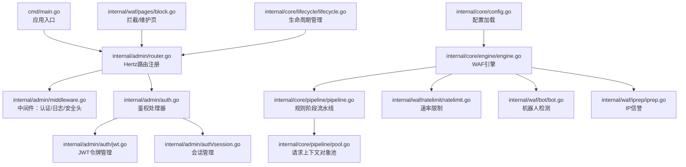
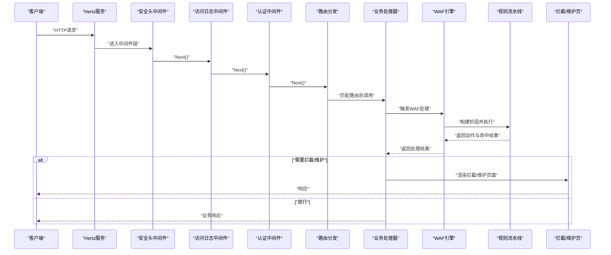
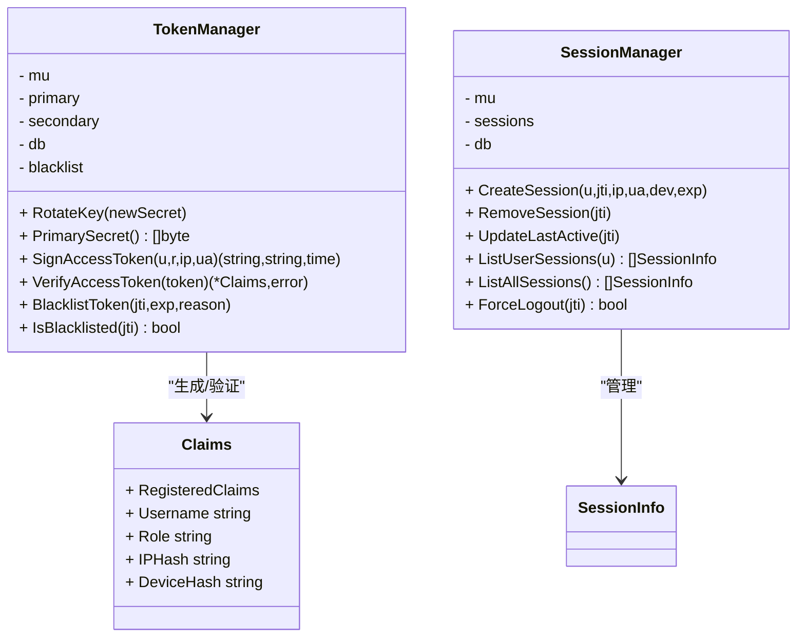
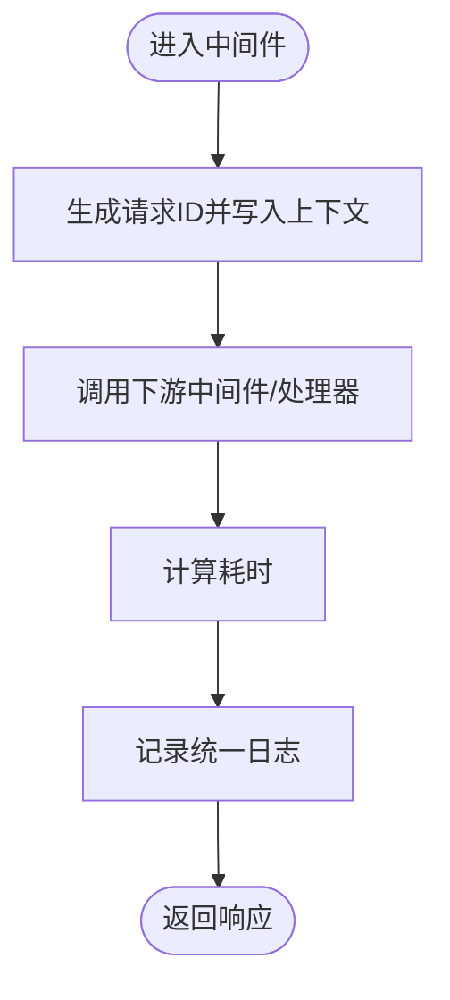
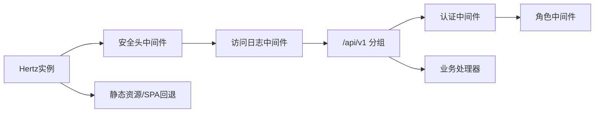
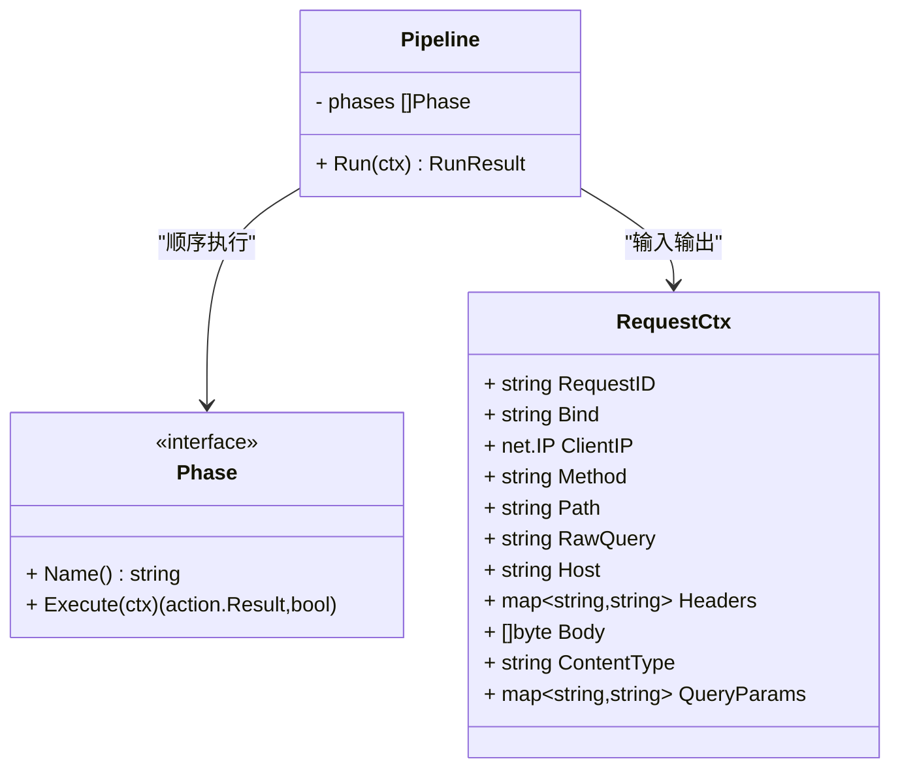
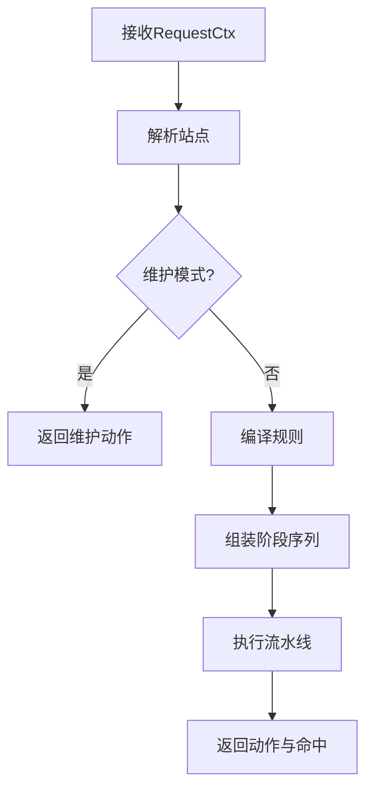
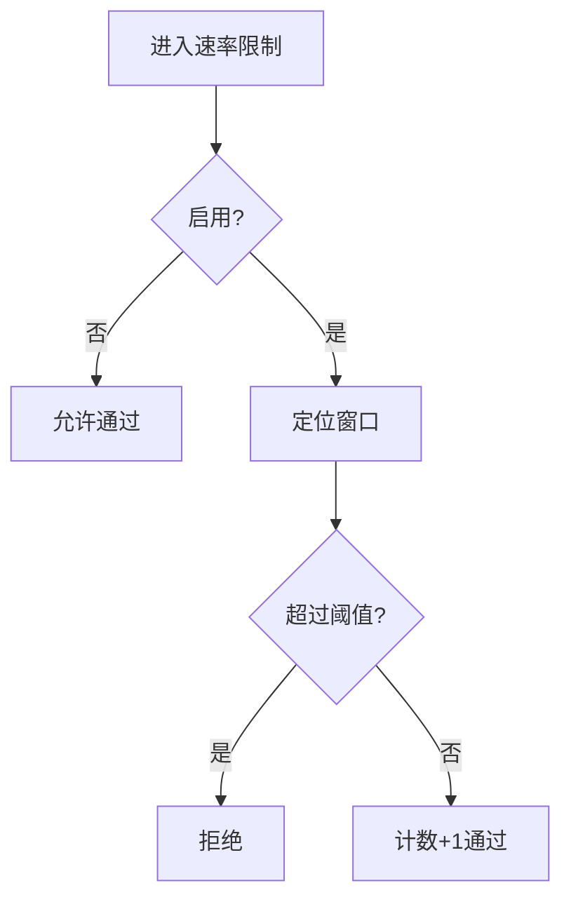
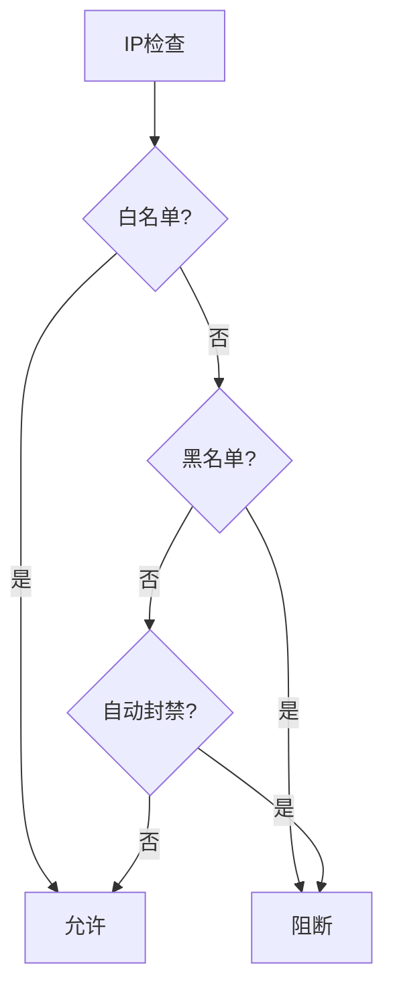
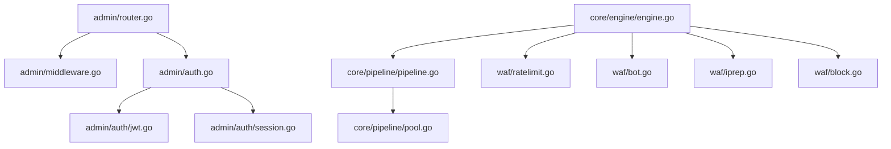

# 中间件开发

<cite>
**本文引用的文件**
- [cmd/main.go](file://cmd/main.go)
- [internal/admin/middleware.go](file://internal/admin/middleware.go)
- [internal/admin/router.go](file://internal/admin/router.go)
- [internal/admin/auth.go](file://internal/admin/auth.go)
- [internal/admin/auth_helpers.go](file://internal/admin/auth_helpers.go)
- [internal/admin/auth_session.go](file://internal/admin/auth_session.go)
- [internal/admin/auth/jwt.go](file://internal/admin/auth/jwt.go)
- [internal/admin/auth/session.go](file://internal/admin/auth/session.go)
- [docs/扩展与插件系统/中间件开发.md](file://docs/扩展与插件系统/中间件开发.md)
</cite>

## 目录
1. [引言](#引言)
2. [项目结构](#项目结构)
3. [核心组件](#核心组件)
4. [架构总览](#架构总览)
5. [详细组件分析](#详细组件分析)
6. [依赖分析](#依赖分析)
7. [性能考量](#性能考量)
8. [故障排查指南](#故障排查指南)
9. [结论](#结论)
10. [附录](#附录)

## 引言
本文件面向中间件开发与运维工程师，系统性阐述管理端中间件体系：包括中间件接口与执行顺序、上下文传递、注册与优先级、依赖管理；以及内置中间件类型（认证、日志、安全头）；自定义中间件开发规范；以及配套的测试、性能分析与故障排查方法。目标是帮助读者快速理解并扩展中间件能力，构建稳定高效的管理控制面。

## 项目结构
本项目采用分层与功能域结合的组织方式：
- cmd 应用入口
- internal/admin 管理控制面（Hertz 路由、鉴权、会话、静态资源）
- internal/core 核心引擎与流水线（规则编译、阶段执行、对象池）
- internal/waf 防御规则与检测（速率限制、机器人检测、IP信誉、拦截页）
- internal/core/lifecycle 生命周期管理（优雅启停、信号处理）
- internal/core/config 配置加载（环境变量解析）

**图表来源**
- [cmd/main.go:1-10](file://cmd/main.go#L1-L10)
- [internal/admin/router.go:46-179](file://internal/admin/router.go#L46-L179)
- [internal/admin/middleware.go:16-129](file://internal/admin/middleware.go#L16-L129)
- [internal/admin/auth.go:32-122](file://internal/admin/auth.go#L32-L122)
- [internal/admin/auth/jwt.go:44-135](file://internal/admin/auth/jwt.go#L44-L135)
- [internal/admin/auth/session.go:26-149](file://internal/admin/auth/session.go#L26-L149)
- [internal/core/engine/engine.go:56-128](file://internal/core/engine/engine.go#L56-L128)
- [internal/core/pipeline/pipeline.go:25-65](file://internal/core/pipeline/pipeline.go#L25-L65)
- [internal/core/pipeline/pool.go:5-36](file://internal/core/pipeline/pool.go#L5-L36)
- [internal/waf/ratelimit/ratelimit.go](file://internal/waf/ratelimit/ratelimit.go)
- [internal/waf/bot/bot.go](file://internal/waf/bot/bot.go)
- [internal/waf/iprep/iprep.go](file://internal/waf/iprep/iprep.go)
- [internal/waf/pages/block.go](file://internal/waf/pages/block.go)
- [internal/core/lifecycle/lifecycle.go:30-178](file://internal/core/lifecycle/lifecycle.go#L30-L178)
- [internal/core/config.go:92-150](file://internal/core/config.go#L92-L150)

**章节来源**
- [cmd/main.go:1-10](file://cmd/main.go#L1-L10)
- [internal/admin/router.go:46-179](file://internal/admin/router.go#L46-L179)

## 核心组件
- 中间件接口与执行顺序
  - 控制面使用 Hertz 的中间件链式调用模型，通过在路由注册前或分组上挂载中间件实现统一处理。
  - 执行顺序遵循挂载顺序：先挂载的先执行，Next() 后按相反顺序返回。
- 上下文传递
  - Hertz 的 RequestContext 提供跨中间件的键值存储，用于传递认证信息、请求ID、角色等。
  - 管理端中间件通过 Set/Get 在请求上下文中写入/读取认证上下文。
- 注册与优先级
  - 路由注册时，先全局挂载安全头中间件，再挂载访问日志中间件，最后挂载认证中间件。
  - 分组路由可叠加中间件，形成“内层更严格”的权限控制。
- 依赖管理
  - 通过依赖注入结构体将仓库、令牌管理器、会话管理器、数据库等传入中间件与处理器。
- 对象池化
  - 请求上下文 RequestCtx 使用 sync.Pool 复用，减少 GC 压力，提升热路径性能。

**章节来源**
- [internal/admin/middleware.go:16-129](file://internal/admin/middleware.go#L16-L129)
- [internal/admin/router.go:46-179](file://internal/admin/router.go#L46-L179)
- [internal/core/pipeline/pool.go:5-36](file://internal/core/pipeline/pool.go#L5-L36)

## 架构总览
下图展示从请求进入控制面到规则引擎执行的整体流程，以及中间件在其中的位置与职责。

**图表来源**
- [internal/admin/router.go:46-179](file://internal/admin/router.go#L46-L179)
- [internal/admin/middleware.go:16-129](file://internal/admin/middleware.go#L16-L129)
- [internal/core/engine/engine.go:56-128](file://internal/core/engine/engine.go#L56-L128)
- [internal/waf/pages/block.go](file://internal/waf/pages/block.go)

## 详细组件分析

### 认证中间件与会话管理
- 功能要点
  - 支持 Bearer JWT 与 API Key 两种认证方式；白名单路径跳过认证。
  - JWT 验证支持主/备密钥轮换与黑名单撤销；会话管理记录登录设备、IP、过期时间。
  - 角色中间件基于上下文中的角色进行 RBAC 校验。
- 关键流程
  - 认证中间件优先尝试 JWT，失败回退到 API Key；成功后在上下文中写入用户、角色、JTI 等。
  - 登录/刷新/登出处理器配合 TokenManager 与 SessionManager 完成令牌签发、轮换、撤销与会话清理。
- 数据结构
  - Claims：JWT 载荷结构，包含用户名、角色、IP/设备指纹等。
  - SessionInfo：会话信息结构，含登录/活跃时间、过期时间等。

**图表来源**
- [internal/admin/auth/jwt.go:44-135](file://internal/admin/auth/jwt.go#L44-L135)
- [internal/admin/auth/session.go:26-149](file://internal/admin/auth/session.go#L26-L149)

**章节来源**
- [internal/admin/middleware.go:16-96](file://internal/admin/middleware.go#L16-L96)
- [internal/admin/auth.go:32-122](file://internal/admin/auth.go#L32-L122)
- [internal/admin/auth/jwt.go:44-135](file://internal/admin/auth/jwt.go#L44-L135)
- [internal/admin/auth/session.go:26-149](file://internal/admin/auth/session.go#L26-L149)

### 日志与安全头中间件
- 访问日志中间件
  - 生成请求ID并写入响应头与上下文；在 Next() 后统计耗时并统一记录。
- 安全头中间件
  - 设置 X-Content-Type-Options、X-Frame-Options、Referrer-Policy、Content-Security-Policy 等标准安全头。

**图表来源**
- [internal/admin/middleware.go:98-129](file://internal/admin/middleware.go#L98-L129)

**章节来源**
- [internal/admin/middleware.go:98-129](file://internal/admin/middleware.go#L98-L129)

### 路由注册与中间件挂载
- 全局中间件
  - 安全头中间件与访问日志中间件在根 Hertz 实例上挂载，影响所有路由。
- 分组与权限
  - /api/v1 下的路由分组分别挂载认证与角色中间件，形成“只读/操作员/管理员”三层权限。
- 静态资源与 SPA 回退
  - 静态文件系统挂载于 Hertz；未匹配 API 的路径回退到前端静态资源。

**图表来源**
- [internal/admin/router.go:46-179](file://internal/admin/router.go#L46-L179)

**章节来源**
- [internal/admin/router.go:46-179](file://internal/admin/router.go#L46-L179)

### 规则引擎与中间件池化
- 规则流水线
  - RequestCtx 携带解码后的请求数据；Phase 接口定义阶段名称与执行逻辑。
  - Pipeline 顺序执行各阶段，遇到终止型命中立即短路，观察型命中收集用于日志。
- 对象池化
  - RequestCtx 使用 sync.Pool 复用，释放时清空字段并归还池中，降低 GC 压力。

**图表来源**
- [internal/core/pipeline/pipeline.go:9-65](file://internal/core/pipeline/pipeline.go#L9-L65)
- [internal/core/pipeline/pool.go:5-36](file://internal/core/pipeline/pool.go#L5-L36)

**章节来源**
- [internal/core/pipeline/pipeline.go:9-65](file://internal/core/pipeline/pipeline.go#L9-L65)
- [internal/core/pipeline/pool.go:5-36](file://internal/core/pipeline/pool.go#L5-L36)

### WAF 引擎与内置规则阶段
- 引擎职责
  - 解析站点、维护模式检查、规则编译、阶段组装与执行。
- 阶段顺序
  - IP信誉（白名单短路、黑名单阻断）、AntiReplay（站点启用时）、ACL、OWASP、CVE、机器人检测（可选）、请求速率限制（可选）、签名与自定义规则。
- 结果封装
  - 返回动作、站点运行时、观察命中列表与是否维护模式标志。

**图表来源**
- [internal/core/engine/engine.go:56-128](file://internal/core/engine/engine.go#L56-L128)

**章节来源**
- [internal/core/engine/engine.go:56-128](file://internal/core/engine/engine.go#L56-L128)

### 速率限制与机器人检测
- 速率限制
  - 固定窗口计数，支持启用/禁用、重配窗口与阈值、清理过期窗口。
- 机器人检测
  - 两阶段：快速预筛选（已知恶意UA、IP信誉、高风险GeoIP）与深度评分（GeoIP权重、指纹、IP信誉），支持阈值控制。

**图表来源**
- [internal/waf/ratelimit/ratelimit.go](file://internal/waf/ratelimit/ratelimit.go)

**章节来源**
- [internal/waf/ratelimit/ratelimit.go](file://internal/waf/ratelimit/ratelimit.go)
- [internal/waf/bot/bot.go](file://internal/waf/bot/bot.go)

### IP信誉与拦截/维护页
- IP信誉
  - 白名单优先、黑名单直接阻断；支持自动封禁（窗口内违规次数阈值）。
- 拦截/维护页
  - 根据站点或全局模板渲染，或回退到嵌入式页面；设置请求ID与动作头。

**图表来源**
- [internal/waf/iprep/iprep.go](file://internal/waf/iprep/iprep.go)
- [internal/waf/pages/block.go](file://internal/waf/pages/block.go)

**章节来源**
- [internal/waf/iprep/iprep.go](file://internal/waf/iprep/iprep.go)
- [internal/waf/pages/block.go](file://internal/waf/pages/block.go)

## 依赖分析
- 组件耦合
  - 管理端中间件依赖认证模块（JWT、会话）与仓库；路由注册集中管理中间件挂载顺序。
  - 引擎依赖规则编译、站点解析、对象池与各类检测模块。
- 外部依赖
  - Hertz 作为 HTTP 服务器与中间件框架；GORM 用于持久化；slog 用于日志。
- 循环依赖
  - 当前结构以接口与依赖注入避免循环依赖；中间件与处理器通过函数闭包与结构体注入解耦。

**图表来源**
- [internal/admin/router.go:46-179](file://internal/admin/router.go#L46-L179)
- [internal/admin/middleware.go:16-129](file://internal/admin/middleware.go#L16-L129)
- [internal/admin/auth.go:32-122](file://internal/admin/auth.go#L32-L122)
- [internal/admin/auth/jwt.go:44-135](file://internal/admin/auth/jwt.go#L44-L135)
- [internal/admin/auth/session.go:26-149](file://internal/admin/auth/session.go#L26-L149)
- [internal/core/engine/engine.go:56-128](file://internal/core/engine/engine.go#L56-L128)
- [internal/core/pipeline/pipeline.go:25-65](file://internal/core/pipeline/pipeline.go#L25-L65)
- [internal/core/pipeline/pool.go:5-36](file://internal/core/pipeline/pool.go#L5-L36)
- [internal/waf/ratelimit/ratelimit.go](file://internal/waf/ratelimit/ratelimit.go)
- [internal/waf/bot/bot.go](file://internal/waf/bot/bot.go)
- [internal/waf/iprep/iprep.go](file://internal/waf/iprep/iprep.go)
- [internal/waf/pages/block.go](file://internal/waf/pages/block.go)

**章节来源**
- [internal/admin/router.go:46-179](file://internal/admin/router.go#L46-L179)
- [internal/core/engine/engine.go:56-128](file://internal/core/engine/engine.go#L56-L128)

## 性能考量
- 中间件链开销
  - 尽量保持中间件数量与复杂度可控；将昂贵操作（如数据库查询）置于必要位置。
- 对象池化
  - RequestCtx 使用池化显著降低 GC 压力；注意在 ReleaseCtx 中正确清空字段，避免内存泄漏。
- 速率限制与机器人检测
  - 合理设置窗口与阈值；两阶段机器人检测通过快速预筛选减少深度评分开销。
- 日志与安全头
  - 访问日志仅在必要时记录详细字段；安全头为常量设置，开销极低。

## 故障排查指南
- 认证问题
  - 缺少或格式错误的 Authorization 头；JWT 无效或已加入黑名单；API Key 过期或不存在。
  - 参考路径：[internal/admin/middleware.go:29-71](file://internal/admin/middleware.go#L29-L71)，[internal/admin/auth.go:125-221](file://internal/admin/auth.go#L125-L221)
- 会话与权限
  - 角色中间件返回 403 表示权限不足；检查上下文中的 auth_role 是否正确设置。
  - 参考路径：[internal/admin/middleware.go:74-96](file://internal/admin/middleware.go#L74-L96)
- 速率限制
  - 检查窗口是否过期、阈值是否合理；确认启用状态。
  - 参考路径：[internal/waf/ratelimit/ratelimit.go](file://internal/waf/ratelimit/ratelimit.go)
- 机器人检测
  - 预筛选命中导致进入深度评分；检查 UA、GeoIP 与 IP信誉配置。
  - 参考路径：[internal/waf/bot/bot.go](file://internal/waf/bot/bot.go)
- 拦截/维护页
  - 检查站点模板与状态码配置；若模板为空则回退到嵌入式页面。
  - 参考路径：[internal/waf/pages/block.go](file://internal/waf/pages/block.go)

**章节来源**
- [internal/admin/middleware.go:29-71](file://internal/admin/middleware.go#L29-L71)
- [internal/admin/middleware.go:74-96](file://internal/admin/middleware.go#L74-L96)
- [internal/admin/auth.go:125-221](file://internal/admin/auth.go#L125-L221)
- [internal/waf/ratelimit/ratelimit.go](file://internal/waf/ratelimit/ratelimit.go)
- [internal/waf/bot/bot.go](file://internal/waf/bot/bot.go)
- [internal/waf/pages/block.go](file://internal/waf/pages/block.go)

## 结论
本项目通过清晰的中间件链、严格的依赖注入与对象池化机制，实现了高性能、可扩展的控制面与防护引擎。内置中间件覆盖认证、日志与安全头等关键领域；规则引擎以阶段化流水线组织，便于扩展与维护。建议在新增中间件时遵循现有模式：最小化副作用、明确执行顺序、正确传递上下文、及时释放资源。

## 附录
- 自定义中间件开发步骤
  - 定义中间件函数类型：接收上下文与请求上下文，返回下一个处理函数。
  - 在路由注册处挂载中间件，确保顺序满足需求。
  - 使用上下文 Set/Get 传递数据，避免全局状态。
  - 注意释放资源与错误处理，必要时记录日志。
- 调试与测试
  - 使用访问日志中间件辅助定位请求路径与耗时。
  - 通过路由分组与角色中间件验证权限链路。
  - 对关键中间件编写单元测试，覆盖正常与异常分支。
- 配置与环境变量
  - 通过环境变量加载数据库、Redis、AdminBind、Bot/CVE 等配置项。
  - 参考路径：[internal/core/config.go:92-150](file://internal/core/config.go#L92-L150)

**章节来源**
- [internal/core/config.go:92-150](file://internal/core/config.go#L92-L150)
