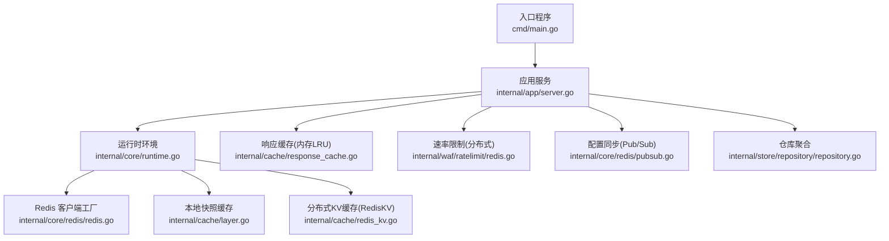
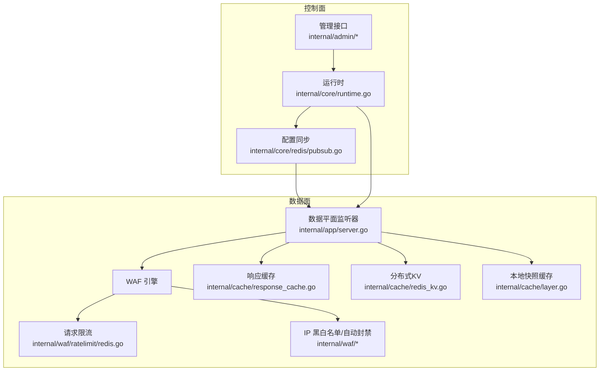
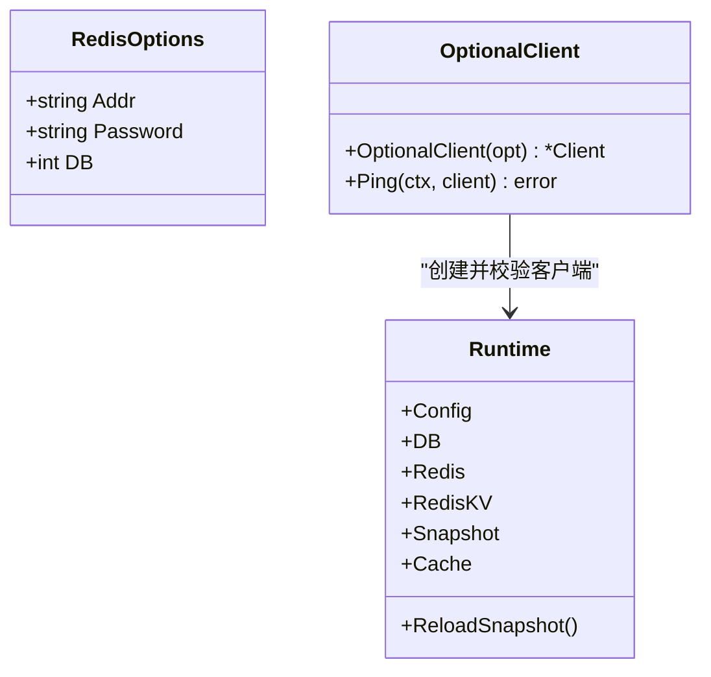
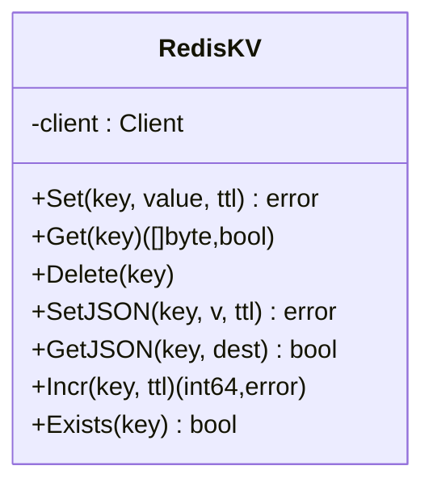
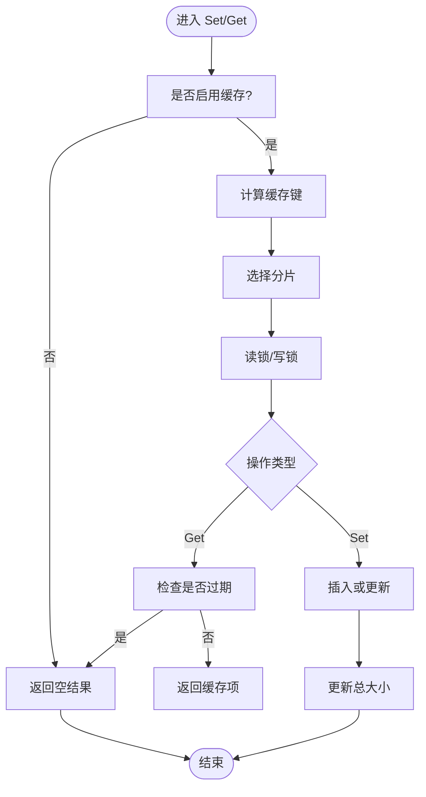
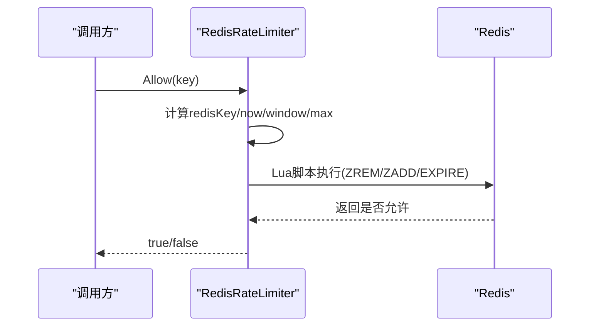
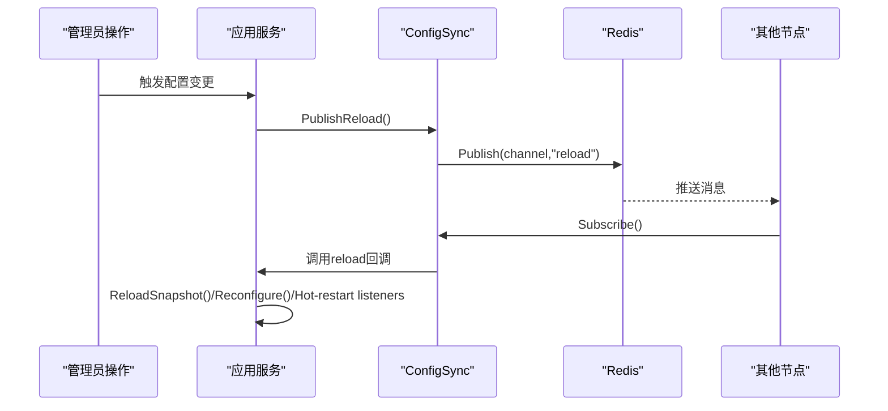
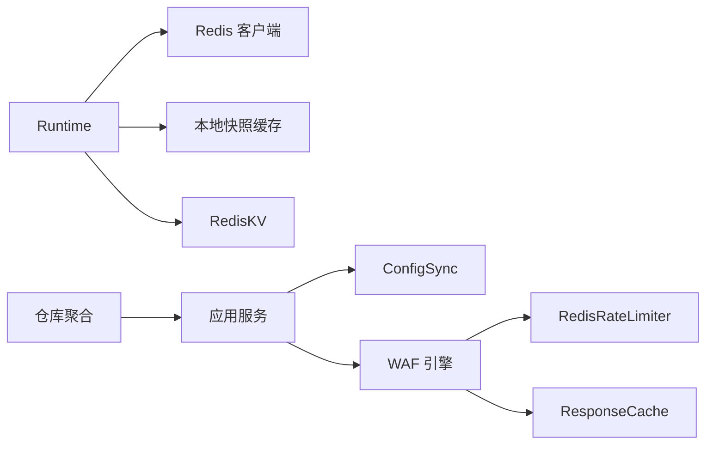

# NoSQL 存储适配

<cite>
**本文引用的文件**
- [internal/core/redis/redis.go](file://internal/core/redis/redis.go)
- [internal/cache/redis_kv.go](file://internal/cache/redis_kv.go)
- [internal/cache/response_cache.go](file://internal/cache/response_cache.go)
- [internal/waf/ratelimit/redis.go](file://internal/waf/ratelimit/redis.go)
- [internal/core/redis/pubsub.go](file://internal/core/redis/pubsub.go)
- [internal/core/runtime.go](file://internal/core/runtime.go)
- [internal/core/config.go](file://internal/core/config.go)
- [internal/waf/antireplay/antireplay.go](file://internal/waf/antireplay/antireplay.go)
- [docs/扩展与插件/存储后端扩展/NoSQL 存储适配.md](file://docs/扩展与插件/存储后端扩展/NoSQL 存储适配.md)
- [docs/数据存储层/Redis 集成.md](file://docs/数据存储层/Redis 集成.md)
- [docs/缓存与性能优化/Redis 集成与分布式缓存.md](file://docs/缓存与性能优化/Redis 集成与分布式缓存.md)
- [docs/配置管理系统/分布式同步机制.md](file://docs/配置管理系统/分布式同步机制.md)
- [docs/扩展与插件/存储后端扩展/连接池管理.md](file://docs/扩展与插件/存储后端扩展/连接池管理.md)
</cite>

## 目录
1. [简介](#简介)
2. [项目结构](#项目结构)
3. [核心组件](#核心组件)
4. [架构总览](#架构总览)
5. [组件详解](#组件详解)
6. [依赖关系分析](#依赖关系分析)
7. [性能考量](#性能考量)
8. [故障排查指南](#故障排查指南)
9. [结论](#结论)
10. [附录：扩展与部署指南](#附录扩展与部署指南)

## 简介
本文件面向 NoSQL 存储适配系统，聚焦于 Redis 适配器的设计与实现，涵盖连接管理、命令封装、数据序列化；缓存层集成（RedisKV 分布式键值缓存、响应缓存）、缓存失效策略；以及 Redis Pub/Sub 在分布式配置同步中的应用。同时给出 NoSQL 数据模型设计思路（键值映射、集合操作、过期管理），并提供扩展到其他 NoSQL 数据库的适配方法与性能优化建议，最后给出 Redis 集群与高可用部署要点。

## 项目结构
该系统围绕“运行时环境”组织，核心由数据库（GORM）与可选的 Redis 组成，并通过缓存层与 WAF 功能模块协同工作。入口程序启动应用后，初始化运行时、加载快照、构建引擎、启动监听器，并在需要时启用 Redis 连接与 Pub/Sub 同步。

图表来源
- [internal/app/server.go:1-490](file://internal/app/server.go#L1-L490)
- [internal/core/runtime.go:1-127](file://internal/core/runtime.go#L1-L127)
- [internal/core/redis/redis.go:1-39](file://internal/core/redis/redis.go#L1-L39)
- [internal/cache/layer.go:1-65](file://internal/cache/layer.go#L1-L65)
- [internal/cache/redis_kv.go:1-113](file://internal/cache/redis_kv.go#L1-L113)
- [internal/cache/response_cache.go:1-163](file://internal/cache/response_cache.go#L1-L163)
- [internal/waf/ratelimit/redis.go:1-89](file://internal/waf/ratelimit/redis.go#L1-L89)
- [internal/core/redis/pubsub.go:1-77](file://internal/core/redis/pubsub.go#L1-L77)
- [internal/store/repository/repository.go:1-43](file://internal/store/repository/repository.go#L1-L43)

章节来源
- [internal/app/server.go:35-305](file://internal/app/server.go#L35-L305)
- [internal/core/runtime.go:27-80](file://internal/core/runtime.go#L27-L80)

## 核心组件
- 运行时环境（Runtime）：负责打开数据库与可选 Redis，建立本地快照缓存与分布式 KV 缓存实例，并提供快照重载能力。
- Redis 客户端工厂：提供可选客户端创建与连通性探测。
- 本地快照缓存（Layer）：基于 Ristretto 的进程内缓存，用于存放不可变的配置快照。
- 分布式 KV 缓存（RedisKV）：基于 Redis 的跨节点共享状态存储，支持字节与 JSON 序列化、自增计数、存在性检查等。
- 响应缓存（ResponseCache）：内存级 LRU-like 缓存，按分片互斥降低竞争，支持默认 TTL 与后台清理。
- 速率限制（RedisRateLimiter）：基于 Redis Lua 脚本的分布式滑动窗口限流器。
- 配置同步（Pub/Sub）：通过 Redis 发布/订阅实现多节点配置变更通知与热重载。

章节来源
- [internal/core/runtime.go:17-80](file://internal/core/runtime.go#L17-L80)
- [internal/core/redis/redis.go:10-39](file://internal/core/redis/redis.go#L10-L39)
- [internal/cache/layer.go:19-65](file://internal/cache/layer.go#L19-L65)
- [internal/cache/redis_kv.go:13-113](file://internal/cache/redis_kv.go#L13-L113)
- [internal/cache/response_cache.go:25-163](file://internal/cache/response_cache.go#L25-L163)
- [internal/waf/ratelimit/redis.go:12-89](file://internal/waf/ratelimit/redis.go#L12-L89)
- [internal/core/redis/pubsub.go:13-77](file://internal/core/redis/pubsub.go#L13-L77)

## 架构总览
系统采用“本地缓存 + 分布式 KV + Redis Pub/Sub”的分层缓存与同步架构。本地快照缓存仅存放不可变配置，分布式 KV 用于跨节点共享状态（如响应缓存元数据、限流计数、封禁同步等）。配置变更通过 Pub/Sub 广播，触发各节点重新加载快照并热更新监听器。

图表来源
- [internal/app/server.go:127-260](file://internal/app/server.go#L127-L260)
- [internal/core/runtime.go:66-79](file://internal/core/runtime.go#L66-L79)
- [internal/core/redis/pubsub.go:13-77](file://internal/core/redis/pubsub.go#L13-L77)
- [internal/waf/ratelimit/redis.go:12-89](file://internal/waf/ratelimit/redis.go#L12-L89)
- [internal/cache/response_cache.go:25-163](file://internal/cache/response_cache.go#L25-L163)
- [internal/cache/redis_kv.go:13-113](file://internal/cache/redis_kv.go#L13-L113)
- [internal/cache/layer.go:19-65](file://internal/cache/layer.go#L19-L65)

## 组件详解

### Redis 适配器与连接管理
- 可选客户端创建：根据环境配置决定是否启用 Redis，避免未配置时的空依赖。
- 连接超时与读写超时：统一设置拨号、读、写超时，保证调用路径可控。
- 连通性探测：启动阶段进行 Ping 检查，失败则关闭并报错。
- 运行时注入：在运行时中创建 Redis 客户端与分布式 KV 实例，并记录启用日志。

图表来源
- [internal/core/redis/redis.go:10-39](file://internal/core/redis/redis.go#L10-L39)
- [internal/core/runtime.go:27-80](file://internal/core/runtime.go#L27-L80)

章节来源
- [internal/core/redis/redis.go:17-39](file://internal/core/redis/redis.go#L17-L39)
- [internal/core/runtime.go:49-79](file://internal/core/runtime.go#L49-L79)

### RedisKV：分布式键值缓存
- 键前缀与命名空间：统一使用固定前缀隔离键空间。
- 基础操作：Set/Get/Delete/Exists；支持字节与 JSON 序列化。
- 计数器：Incr 原子自增并设置 TTL，结合流水线减少往返。
- 错误处理：对空实例返回安全行为（如返回 false/0），避免 panic。

图表来源
- [internal/cache/redis_kv.go:19-113](file://internal/cache/redis_kv.go#L19-L113)

章节来源
- [internal/cache/redis_kv.go:31-113](file://internal/cache/redis_kv.go#L31-L113)

### 响应缓存：内存级 LRU-like
- 结构设计：64 个分片，每个分片独立读写锁，降低热点竞争。
- 元数据：包含状态码、内容类型、体内容、缓存时间与 TTL。
- 过期判定：以当前时间与 CachedAt+TTL 判断是否过期。
- 写入策略：若单条目过大则拒绝缓存；更新时原子替换并维护当前总大小。
- 清理机制：后台定时器周期扫描并删除过期项，释放内存。

图表来源
- [internal/cache/response_cache.go:25-163](file://internal/cache/response_cache.go#L25-L163)

章节来源
- [internal/cache/response_cache.go:25-163](file://internal/cache/response_cache.go#L25-L163)
- [internal/cache/response_cache_test.go:5-79](file://internal/cache/response_cache_test.go#L5-L79)

### 速率限制：分布式滑动窗口
- 滑动窗口：使用有序集合记录时间戳，Lua 脚本原子清理过期与计数判断。
- 参数：窗口秒数与最大请求数可动态重配置，支持启用/禁用。
- 失败开路：Redis 调用异常时允许请求通过，确保系统韧性。
- 使用场景：跨节点共享的请求/错误速率限制。

图表来源
- [internal/waf/ratelimit/redis.go:47-85](file://internal/waf/ratelimit/redis.go#L47-L85)

章节来源
- [internal/waf/ratelimit/redis.go:12-89](file://internal/waf/ratelimit/redis.go#L12-L89)

### 配置同步：Redis Pub/Sub
- 通道命名：统一通道名用于配置重载事件。
- 发布者：当配置变更发生时，向通道发布“reload”消息。
- 订阅者：后台协程订阅通道，收到消息后触发快照重载、参数重配置与监听器热重启。
- 关闭流程：通过停止通道优雅关闭订阅者。

图表来源
- [internal/app/server.go:220-260](file://internal/app/server.go#L220-L260)
- [internal/core/redis/pubsub.go:13-77](file://internal/core/redis/pubsub.go#L13-L77)

章节来源
- [internal/app/server.go:127-260](file://internal/app/server.go#L127-L260)
- [internal/core/redis/pubsub.go:13-77](file://internal/core/redis/pubsub.go#L13-L77)

### 数据模型设计与键空间
- 键空间隔离：RedisKV 统一使用固定前缀，避免键冲突。
- 键语义：
  - 响应缓存元数据键：用于标识请求指纹（方法+主机+路径+查询）。
  - 限流键：带前缀的有序集合，记录时间戳。
  - 共享状态键：如封禁列表、API 密钥等跨节点共享数据。
- 序列化：
  - 字节存储：适合二进制数据或已编码数据。
  - JSON 存储：适合结构化对象，便于跨语言读取。
- 过期管理：
  - TTL 设置：在写入时指定；Incr 场景通过 Expire 延长生命周期。
  - 自动清理：响应缓存内置后台清理；RedisKV 不自动过期，需上层显式设置。

章节来源
- [internal/cache/redis_kv.go:11-113](file://internal/cache/redis_kv.go#L11-L113)
- [internal/cache/response_cache.go:11-23](file://internal/cache/response_cache.go#L11-L23)
- [internal/waf/ratelimit/redis.go:74-84](file://internal/waf/ratelimit/redis.go#L74-L84)

## 依赖关系分析
- 运行时依赖 Redis 客户端工厂与本地缓存层；在启用 Redis 时创建分布式 KV。
- 应用服务在启动时注册配置同步订阅者，配置变更时通过 Pub/Sub 广播。
- 速率限制器直接依赖 Redis 客户端；响应缓存为纯内存实现。
- 仓库聚合提供数据源，驱动快照构建与配置变更。

图表来源
- [internal/core/runtime.go:66-79](file://internal/core/runtime.go#L66-L79)
- [internal/app/server.go:127-260](file://internal/app/server.go#L127-L260)
- [internal/waf/ratelimit/redis.go:12-89](file://internal/waf/ratelimit/redis.go#L12-L89)
- [internal/cache/response_cache.go:25-163](file://internal/cache/response_cache.go#L25-L163)
- [internal/store/repository/repository.go:24-43](file://internal/store/repository/repository.go#L24-L43)

章节来源
- [internal/core/runtime.go:66-79](file://internal/core/runtime.go#L66-L79)
- [internal/app/server.go:127-260](file://internal/app/server.go#L127-L260)
- [internal/store/repository/repository.go:24-43](file://internal/store/repository/repository.go#L24-L43)

## 性能考量
- 连接与超时：合理设置 Dial/Read/Write 超时，避免阻塞影响请求处理。
- 流水线与脚本：RedisKV 的 Incr 使用流水线；速率限制使用 Lua 脚本原子化，减少网络往返。
- 内存缓存分片：响应缓存采用 64 分片与读写锁，降低热点竞争。
- 后台清理：响应缓存定期清理过期项，避免内存膨胀。
- 失败开路：速率限制在 Redis 异常时允许请求，保障系统韧性。
- 建议：
  - 对高频键使用短 TTL 并结合本地缓存命中率优化。
  - 控制单条缓存体大小，避免占用过多内存。
  - 在高并发场景下评估 Redis 命令队列长度与网络延迟。

章节来源
- [internal/core/redis/redis.go:32-38](file://internal/core/redis/redis.go#L32-L38)
- [internal/core/runtime.go:54-59](file://internal/core/runtime.go#L54-L59)
- [internal/core/redis/pubsub.go:21-76](file://internal/core/redis/pubsub.go#L21-L76)
- [internal/app/server.go:244-260](file://internal/app/server.go#L244-L260)
- [internal/waf/ratelimit/redis.go:47-84](file://internal/waf/ratelimit/redis.go#L47-L84)
- [internal/cache/response_cache.go:94-122](file://internal/cache/response_cache.go#L94-L122)
- [internal/cache/response_cache.go:142-162](file://internal/cache/response_cache.go#L142-L162)

## 故障排查指南
- Redis 连接失败：检查地址、密码、DB 索引；确认 Ping 成功后再继续启动。
- Pub/Sub 不生效：确认通道名称一致；检查订阅协程是否被关闭；查看发布/订阅日志。
- 速率限制异常：关注 Redis 调用错误；注意脚本执行耗时与窗口设置。
- 响应缓存命中异常：确认缓存键生成逻辑一致；检查默认 TTL 与过期判定。
- 快照未更新：确认配置同步广播是否成功；检查 reload 回调链路。

章节来源
- [internal/core/redis/redis.go:32-39](file://internal/core/redis/redis.go#L32-L39)
- [internal/core/redis/pubsub.go:33-43](file://internal/core/redis/pubsub.go#L33-L43)
- [internal/waf/ratelimit/redis.go:79-84](file://internal/waf/ratelimit/redis.go#L79-L84)
- [internal/cache/response_cache.go:20-23](file://internal/cache/response_cache.go#L20-L23)
- [internal/app/server.go:220-260](file://internal/app/server.go#L220-L260)

## 结论
该系统通过“本地快照缓存 + 分布式 KV + Redis Pub/Sub”的组合，实现了高效、可扩展且具备韧性的一致性与缓存体系。RedisKV 提供了简洁而强大的跨节点共享状态能力；响应缓存与速率限制分别覆盖了热点响应与流量治理两大关键场景；配置同步确保多节点在变更后保持一致。整体设计兼顾易用性与性能，适合在分布式环境中稳定运行。

## 附录：扩展与部署指南

### 扩展到其他 NoSQL 数据库的适配方法
- 抽象接口：定义统一的 KV 接口（如 Set/Get/Delete/Exists/Incr），并在不同后端实现。
- 命令封装：针对目标数据库的特性（如 TTL、事务、脚本）进行封装。
- 序列化策略：提供字节与 JSON 两种序列化方式，满足不同数据形态。
- 过期管理：在适配层实现 TTL 设置与清理策略，必要时引入后台任务。
- 集成点：将新适配器注入运行时，替换 RedisKV 实例，保持上层调用不变。

### 性能优化策略
- 连接池与超时：合理配置连接池大小与超时参数，避免阻塞。
- 命令批量化：批量写入与流水线执行，减少网络往返。
- 缓存分层：热点数据优先命中本地缓存，再回退到分布式缓存。
- 限流与熔断：在上游增加限流与熔断，保护下游存储。
- 监控与告警：对慢查询、错误率、内存使用等指标进行监控。

### Redis 集群与高可用部署方案
- 集群模式：使用 Redis Cluster 或云托管集群，提升吞吐与可用性。
- 主从复制：配置主从复制与哨兵/集群自动故障转移，确保高可用。
- 网络与安全：启用 TLS 与认证，限制访问来源，优化网络延迟。
- 分片策略：对键空间进行哈希分片，避免热点集中在单一节点。
- 运维工具：结合持久化、备份与监控工具，保障生产环境稳定。