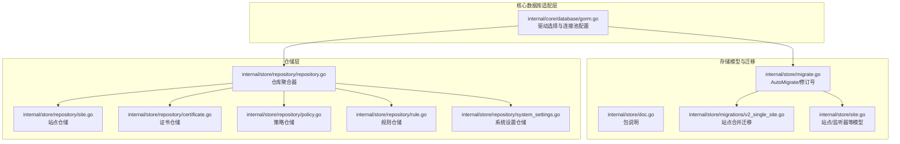
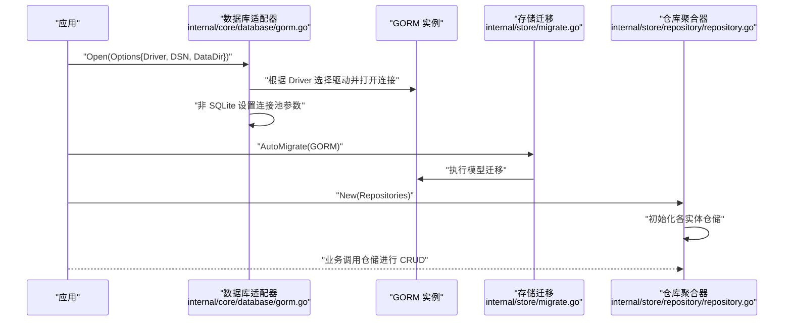
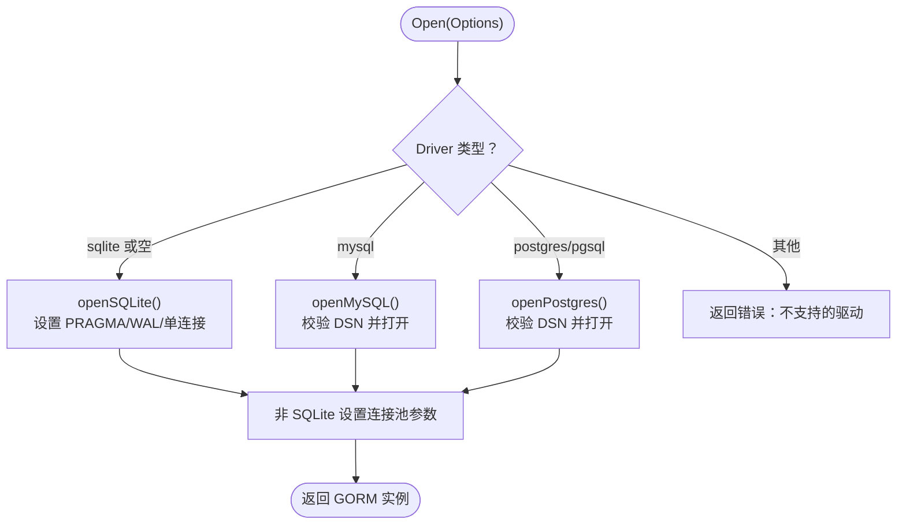
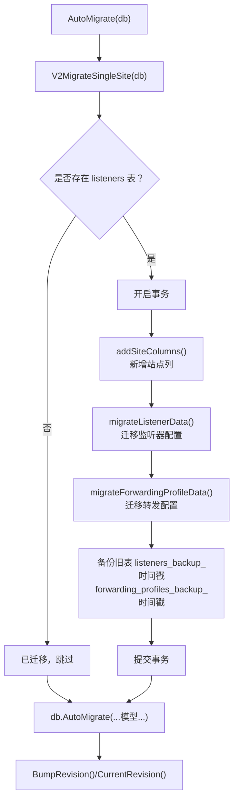
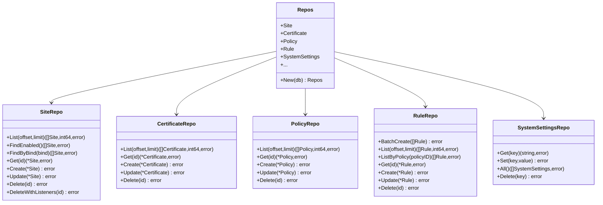
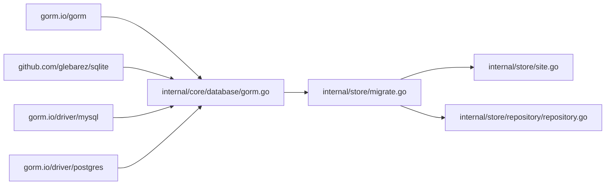

# 存储后端扩展

> [返回 扩展与插件系统](../扩展与插件系统.md)

<cite>

<cite>
**本文引用的文件**
- [internal/core/database/gorm.go](file://internal/core/database/gorm.go)
- [internal/store/doc.go](file://internal/store/doc.go)
- [internal/store/migrate.go](file://internal/store/migrate.go)
- [internal/store/migrations/v2_single_site.go](file://internal/store/migrations/v2_single_site.go)
- [internal/store/site.go](file://internal/store/site.go)
- [internal/store/repository/repository.go](file://internal/store/repository/repository.go)
- [internal/store/repository/site.go](file://internal/store/repository/site.go)
- [internal/store/repository/certificate.go](file://internal/store/repository/certificate.go)
- [internal/store/repository/policy.go](file://internal/store/repository/policy.go)
- [internal/store/repository/rule.go](file://internal/store/repository/rule.go)
- [internal/store/repository/system_settings.go](file://internal/store/repository/system_settings.go)
</cite>

## 目录
1. [引言](#引言)
2. [项目结构](#项目结构)
3. [核心组件](#核心组件)
4. [架构总览](#架构总览)
5. [详细组件分析](#详细组件分析)
6. [依赖分析](#依赖分析)
7. [性能考虑](#性能考虑)
8. [故障排查指南](#故障排查指南)
9. [结论](#结论)
10. [附录](#附录)

## 引言
本文件面向存储后端扩展开发者，系统化阐述数据库适配器的设计与实现、存储接口与仓库聚合模式、存储迁移机制、连接池管理最佳实践，并提供 NoSQL 存储适配指南与可复用的开发范式。目标是帮助你在不破坏现有架构的前提下，快速、安全地接入新的存储后端（如 MySQL、PostgreSQL、SQLite 或 NoSQL）。

## 项目结构
围绕存储后端扩展的关键模块分布如下：
- 数据库适配器与连接池：位于 internal/core/database/gorm.go，统一支持 sqlite、mysql、postgres 三类方言。
- 存储模型与迁移：位于 internal/store 下，包含 GORM 模型、AutoMigrate 与版本迁移逻辑。
- 仓库聚合与实体仓储：位于 internal/store/repository 下，以“仓库聚合器”集中管理各实体的 CRUD 与查询。

图表来源
- [internal/core/database/gorm.go:1-112](file://internal/core/database/gorm.go#L1-L112)
- [internal/store/doc.go:1-4](file://internal/store/doc.go#L1-L4)
- [internal/store/migrate.go:1-60](file://internal/store/migrate.go#L1-L60)
- [internal/store/migrations/v2_single_site.go:1-189](file://internal/store/migrations/v2_single_site.go#L1-L189)
- [internal/store/site.go:1-156](file://internal/store/site.go#L1-L156)
- [internal/store/repository/repository.go:1-49](file://internal/store/repository/repository.go#L1-L49)
- [internal/store/repository/site.go:1-54](file://internal/store/repository/site.go#L1-L54)
- [internal/store/repository/certificate.go:1-37](file://internal/store/repository/certificate.go#L1-L37)
- [internal/store/repository/policy.go:1-35](file://internal/store/repository/policy.go#L1-L35)
- [internal/store/repository/rule.go:1-51](file://internal/store/repository/rule.go#L1-L51)
- [internal/store/repository/system_settings.go:1-44](file://internal/store/repository/system_settings.go#L1-L44)

章节来源
- [internal/core/database/gorm.go:1-112](file://internal/core/database/gorm.go#L1-L112)
- [internal/store/doc.go:1-4](file://internal/store/doc.go#L1-L4)
- [internal/store/migrate.go:1-60](file://internal/store/migrate.go#L1-L60)
- [internal/store/migrations/v2_single_site.go:1-189](file://internal/store/migrations/v2_single_site.go#L1-L189)
- [internal/store/site.go:1-156](file://internal/store/site.go#L1-L156)
- [internal/store/repository/repository.go:1-49](file://internal/store/repository/repository.go#L1-L49)

## 核心组件
- 数据库适配器与连接池
  - 支持 sqlite、mysql、postgres 三种方言，通过 Driver 与 DSN 参数动态选择。
  - 非 SQLite 数据库默认启用连接池参数调优；SQLite 使用单连接避免锁竞争。
  - 提供 SQLite 特定的 PRAGMA 优化（WAL、busy_timeout、cache_size 等）。
- 存储模型与迁移
  - 通过 AutoMigrate 应用所有领域模型的表结构。
  - 提供修订号管理（BumpRevision/CurrentRevision），用于配置变更追踪。
  - v2 单站点迁移将旧的监听器与转发配置合并到站点表，保留备份并清理旧表。
- 仓库聚合与实体仓储
  - 仓库聚合器集中持有各实体仓储实例，统一初始化与注入。
  - 各实体仓储封装 CRUD 与常用查询，支持分页、排序、条件过滤与事务。

章节来源
- [internal/core/database/gorm.go:17-61](file://internal/core/database/gorm.go#L17-L61)
- [internal/store/migrate.go:9-60](file://internal/store/migrate.go#L9-L60)
- [internal/store/migrations/v2_single_site.go:10-50](file://internal/store/migrations/v2_single_site.go#L10-L50)
- [internal/store/repository/repository.go:5-49](file://internal/store/repository/repository.go#L5-L49)

## 架构总览
下图展示从应用启动到数据持久化的关键路径：驱动选择 → 连接池配置 → AutoMigrate → 仓储调用。

图表来源
- [internal/core/database/gorm.go:24-61](file://internal/core/database/gorm.go#L24-L61)
- [internal/store/migrate.go:10-41](file://internal/store/migrate.go#L10-L41)
- [internal/store/repository/repository.go:27-48](file://internal/store/repository/repository.go#L27-L48)

## 详细组件分析

### 数据库适配器与方言支持
- 设计要点
  - 通过 Options 结构体集中传递驱动类型与连接信息，避免循环依赖。
  - 在 sqlite 路径中显式设置 WAL、busy_timeout、cache_size 等 PRAGMA，提升并发与稳定性。
  - 非 SQLite 数据库设置 MaxOpenConns、MaxIdleConns、ConnMaxLifetime、ConnMaxIdleTime，平衡吞吐与资源占用。
- 关键行为
  - 支持空 Driver（默认 sqlite）与明确的 sqlite/mysql/postgres/postgresql。
  - SQLite 单连接策略，避免多连接导致的锁问题。
  - MySQL/Postgres 需要 DSN 参数，否则直接报错提示。

图表来源
- [internal/core/database/gorm.go:25-61](file://internal/core/database/gorm.go#L25-L61)
- [internal/core/database/gorm.go:63-95](file://internal/core/database/gorm.go#L63-L95)
- [internal/core/database/gorm.go:97-111](file://internal/core/database/gorm.go#L97-L111)

章节来源
- [internal/core/database/gorm.go:17-61](file://internal/core/database/gorm.go#L17-L61)

### 存储迁移机制与流程
- AutoMigrate
  - 先执行数据迁移（如 v2 合并站点配置），再执行表结构迁移。
  - 列举所有领域模型并调用 GORM 的 AutoMigrate。
- 修订号管理
  - 通过 ConfigRevision 表维护当前配置修订号，支持递增与查询。
- v2 单站点迁移
  - 检查是否已迁移（若不存在旧表则跳过）。
  - 事务内执行：添加新列、从 listeners/forwarding_profiles 迁移数据、备份旧表、删除旧表。
  - 新列覆盖站点绑定、网络协议、TLS、保护等级、XFF 等配置。

图表来源
- [internal/store/migrate.go:10-41](file://internal/store/migrate.go#L10-L41)
- [internal/store/migrations/v2_single_site.go:16-50](file://internal/store/migrations/v2_single_site.go#L16-L50)
- [internal/store/migrations/v2_single_site.go:52-82](file://internal/store/migrations/v2_single_site.go#L52-L82)
- [internal/store/migrations/v2_single_site.go:84-166](file://internal/store/migrations/v2_single_site.go#L84-L166)

章节来源
- [internal/store/migrate.go:9-60](file://internal/store/migrate.go#L9-L60)
- [internal/store/migrations/v2_single_site.go:10-189](file://internal/store/migrations/v2_single_site.go#L10-L189)

### 仓库聚合模式与实体仓储
- 仓库聚合器 Repos
  - 聚合所有实体仓储，统一在 New(db) 中初始化。
  - 便于上层按需注入与复用，降低耦合。
- 典型仓储接口
  - 列表/总数、按条件查询、分页排序、创建、更新、删除。
  - 高级场景使用事务（如站点删除时先删关联监听器，再删站点）。
- 示例：站点仓储
  - 支持启用状态筛选、按绑定地址查询、带事务的级联删除。
- 示例：规则仓储
  - 批量创建（事务包裹）、按优先级与 ID 排序、按策略 ID 查询。
- 示例：系统设置仓储
  - 键值读取/写入/删除，支持不存在时创建。

图表来源
- [internal/store/repository/repository.go:5-49](file://internal/store/repository/repository.go#L5-L49)
- [internal/store/repository/site.go:9-54](file://internal/store/repository/site.go#L9-L54)
- [internal/store/repository/certificate.go:9-37](file://internal/store/repository/certificate.go#L9-L37)
- [internal/store/repository/policy.go:9-35](file://internal/store/repository/policy.go#L9-L35)
- [internal/store/repository/rule.go:9-51](file://internal/store/repository/rule.go#L9-L51)
- [internal/store/repository/system_settings.go:9-44](file://internal/store/repository/system_settings.go#L9-L44)

章节来源
- [internal/store/repository/repository.go:5-49](file://internal/store/repository/repository.go#L5-L49)
- [internal/store/repository/site.go:13-54](file://internal/store/repository/site.go#L13-L54)
- [internal/store/repository/certificate.go:13-37](file://internal/store/repository/certificate.go#L13-L37)
- [internal/store/repository/policy.go:13-35](file://internal/store/repository/policy.go#L13-L35)
- [internal/store/repository/rule.go:13-51](file://internal/store/repository/rule.go#L13-L51)
- [internal/store/repository/system_settings.go:15-44](file://internal/store/repository/system_settings.go#L15-L44)

### 存储模型与数据契约
- 模型定位
  - internal/store/doc.go 明确该包负责 GORM 模型、AutoMigrate 与修订辅助。
- 典型模型
  - 站点模型包含监听绑定、网络协议、TLS、保护等级、XFF、上游配置、缓存与维护页面等字段。
  - 监听器模型拆分出站点维度，便于后续演进。
- 字段设计要点
  - JSON 标签用于序列化输出；GORM 标签用于约束与索引。
  - 保留历史字段用于兼容迁移（如 listener_id、forwarding_profile_id）。

章节来源
- [internal/store/doc.go:1-4](file://internal/store/doc.go#L1-L4)
- [internal/store/site.go:16-81](file://internal/store/site.go#L16-L81)

## 依赖分析
- 组件耦合
  - 仓储层依赖 GORM，通过注入的 *gorm.DB 运行查询与事务。
  - 仓库聚合器对各实体仓储解耦，便于替换与扩展。
- 外部依赖
  - GORM 作为 ORM 框架，提供跨方言能力与迁移工具。
  - SQLite/MySQL/Postgres 驱动分别由第三方库提供。
- 循环依赖规避
  - Options 结构体放置于 core 层，避免与 store 层互相导入。

图表来源
- [internal/core/database/gorm.go:10-15](file://internal/core/database/gorm.go#L10-L15)
- [internal/store/migrate.go:3-7](file://internal/store/migrate.go#L3-L7)

章节来源
- [internal/core/database/gorm.go:10-15](file://internal/core/database/gorm.go#L10-L15)
- [internal/store/migrate.go:3-7](file://internal/store/migrate.go#L3-L7)

## 性能考虑
- 连接池最佳实践
  - 非 SQLite：设置合理的 MaxOpenConns、MaxIdleConns、ConnMaxLifetime、ConnMaxIdleTime，避免连接泄漏与抖动。
  - SQLite：保持单连接，避免并发写入锁争用；利用 WAL 提升读写并发。
- 查询与缓存
  - 启用 PrepareStmt 缓存重复语句，减少解析开销。
  - 对热点查询使用索引字段（如站点的 host、bind、enabled 等）。
- 迁移与事务
  - 大批量写入使用事务包裹（如规则批量创建），减少往返与回滚成本。
  - 迁移在事务内执行，失败可回滚，保障一致性。
- SQLite PRAGMA 调优
  - WAL、busy_timeout、cache_size、foreign_keys、wal_autocheckpoint 等参数直接影响并发与稳定性。

章节来源
- [internal/core/database/gorm.go:26-30](file://internal/core/database/gorm.go#L26-L30)
- [internal/core/database/gorm.go:49-58](file://internal/core/database/gorm.go#L49-L58)
- [internal/core/database/gorm.go:63-95](file://internal/core/database/gorm.go#L63-L95)
- [internal/store/repository/rule.go:13-22](file://internal/store/repository/rule.go#L13-L22)

## 故障排查指南
- 驱动与 DSN 错误
  - 不支持的驱动：检查环境变量或配置项，确保 Driver 为 sqlite/mysql/postgres。
  - MySQL/Postgres 无 DSN：确认 DSN 已正确设置，遵循相应连接串格式。
- 迁移失败
  - v2 迁移：若 listeners 表不存在，视为已迁移；若迁移过程中失败，检查事务日志与备份表。
  - AutoMigrate：逐个模型排查约束冲突或字段类型不兼容。
- 事务与并发
  - SQLite 多连接写入冲突：确认仅使用单连接。
  - 非 SQLite 连接池耗尽：调整 MaxOpenConns 与超时参数。
- 仓储异常
  - 条件查询返回空：确认 where 条件与索引命中情况。
  - 级联删除失败：检查外键约束与关联数量。

章节来源
- [internal/core/database/gorm.go:42-44](file://internal/core/database/gorm.go#L42-L44)
- [internal/core/database/gorm.go:97-111](file://internal/core/database/gorm.go#L97-L111)
- [internal/store/migrations/v2_single_site.go:16-50](file://internal/store/migrations/v2_single_site.go#L16-L50)
- [internal/store/migrate.go:10-41](file://internal/store/migrate.go#L10-L41)

## 结论
通过统一的数据库适配器、严谨的迁移机制与清晰的仓库聚合模式，系统实现了对 SQLite、MySQL、PostgreSQL 的无缝支持。遵循本文的连接池配置、事务与索引策略，可在保证一致性的前提下获得稳定性能。对于 NoSQL 存储适配，可参考仓库聚合与迁移模式，在保持接口稳定的同时，按需引入外部存储的连接与事务抽象。

## 附录

### 开发新存储适配器（以 MySQL/Postgres 为例）
- 步骤概览
  - 在 core 层新增驱动打开函数（参考 openMySQL/openPostgres），校验 DSN 并返回 *gorm.DB。
  - 在 store 层保持现有 AutoMigrate 与迁移逻辑不变，GORM 将自动适配新方言。
  - 若需方言特定优化（如连接池参数），在 core 层按需调整。
- 注意事项
  - 确保 DSN 格式符合目标数据库要求。
  - 如需事务隔离级别或方言特性，可在应用层通过 gorm.Config 或原生 SQL 控制。

章节来源
- [internal/core/database/gorm.go:97-111](file://internal/core/database/gorm.go#L97-L111)

### NoSQL 存储适配指南
- 适用场景
  - 日志/事件流、缓存、全文检索、时序数据等。
- 设计建议
  - 保持仓储接口稳定：List/Get/Create/Update/Delete/BatchCreate 等方法签名不变。
  - 事务与一致性：若 NoSQL 不支持 ACID，采用补偿机制或幂等写入。
  - 连接与池化：按 NoSQL 官方建议配置连接数、超时与重试策略。
  - 迁移策略：将结构化变更映射为文档版本或集合别名切换，避免在线大表重建。
- 与现有架构对接
  - 仓储聚合器可按需引入 NoSQL 仓储，不影响 SQL 方言的使用。
  - 对于需要跨存储的一致性场景，采用最终一致性或分布式事务方案。

[本节为概念性指导，无需源码引用]