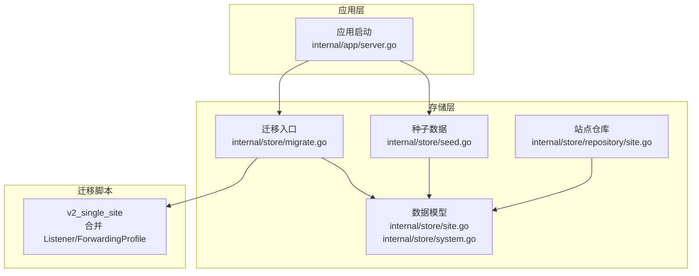
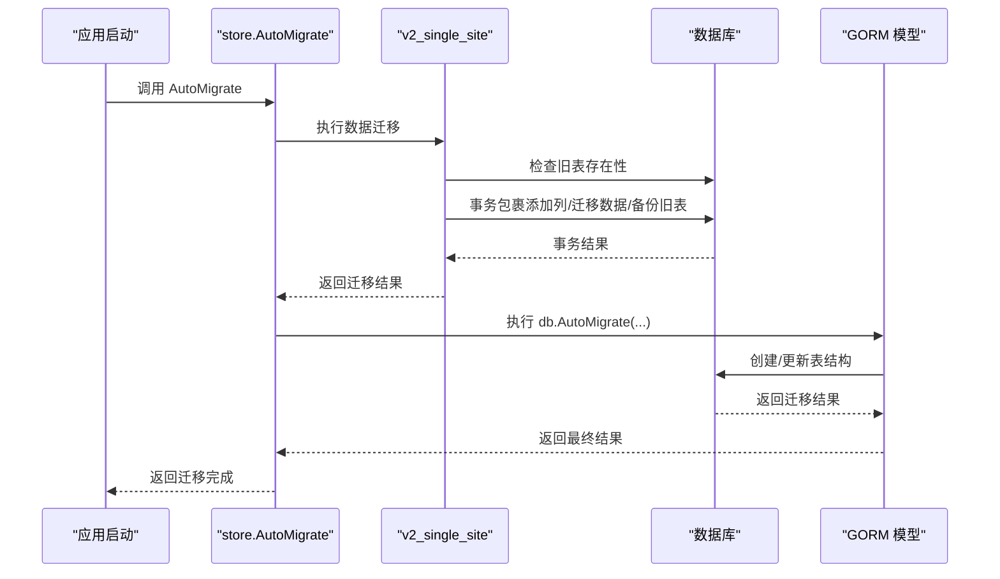
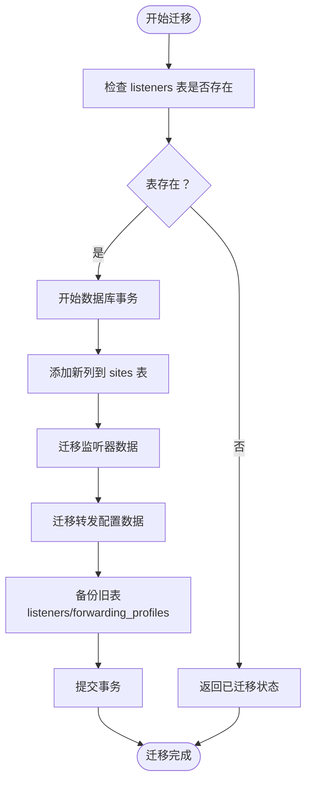
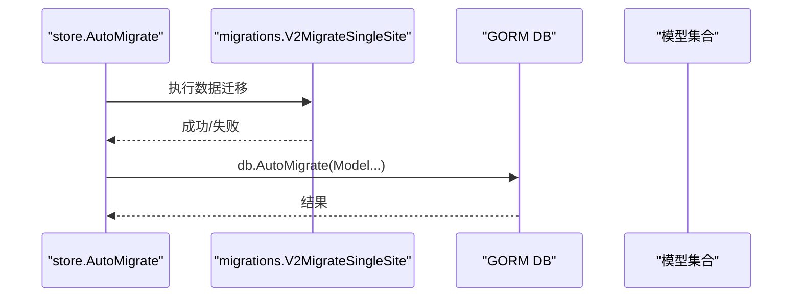
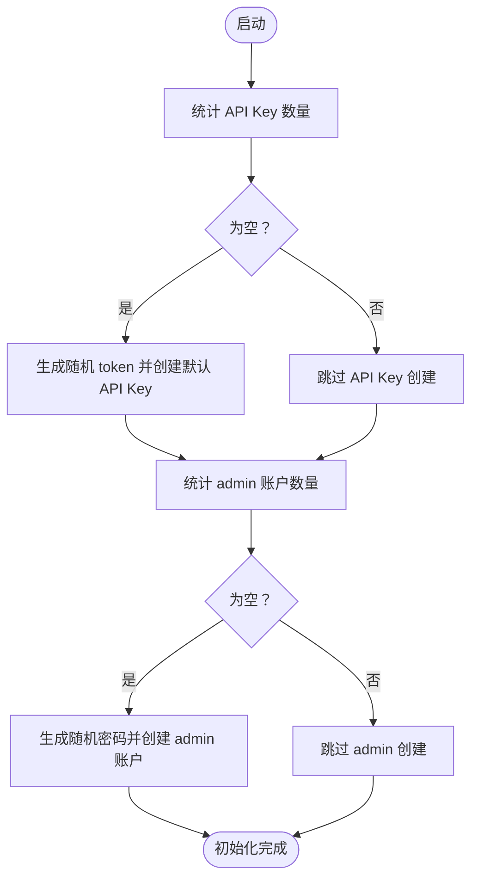
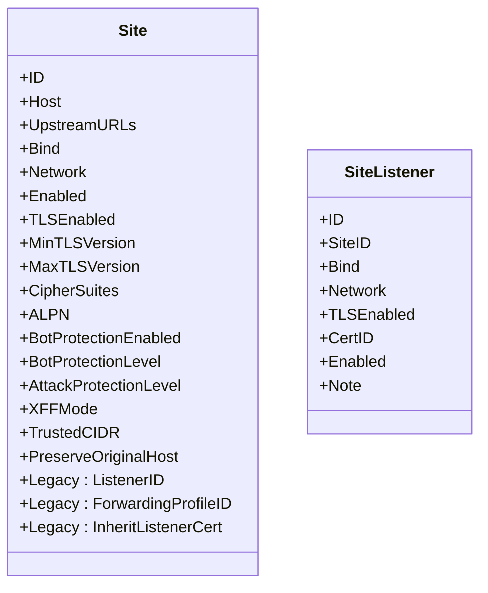
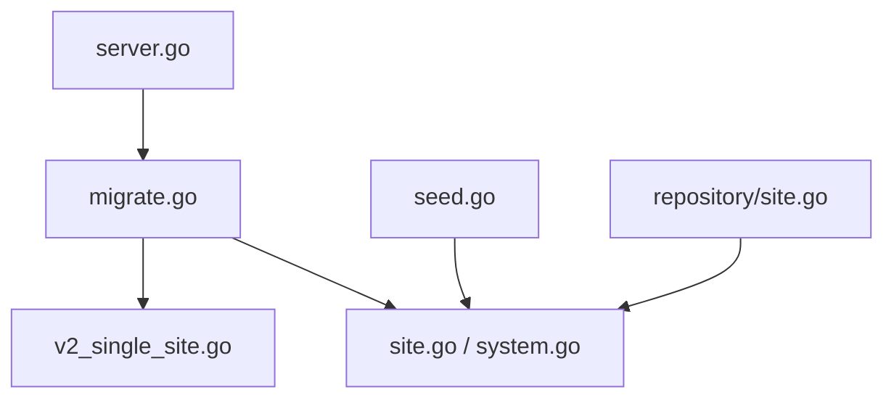

# 存储迁移机制

<cite>
**本文引用的文件**
- [v2_single_site.go](file://internal/store/migrations/v2_single_site.go)
- [migrate.go](file://internal/store/migrate.go)
- [seed.go](file://internal/store/seed.go)
- [server.go](file://internal/app/server.go)
- [site.go](file://internal/store/site.go)
- [system.go](file://internal/store/system.go)
- [site.go](file://internal/store/repository/site.go)
- [迁移管理机制.md](file://docs/扩展与插件/存储后端扩展/存储迁移机制.md)
- [数据迁移管理.md](file://docs/数据存储层/数据迁移管理.md)
- [迁移管理机制.md](file://docs/配置管理系统/迁移管理机制.md)
</cite>

## 目录
1. [简介](#简介)
2. [项目结构](#项目结构)
3. [核心组件](#核心组件)
4. [架构总览](#架构总览)
5. [详细组件分析](#详细组件分析)
6. [依赖分析](#依赖分析)
7. [性能考量](#性能考量)
8. [故障排除指南](#故障排除指南)
9. [结论](#结论)
10. [附录](#附录)

## 简介
本文件系统化阐述本项目的存储迁移机制，重点覆盖：
- 双重迁移机制：历史数据迁移（v2_single_site）与 Schema 自动迁移（GORM）的协作
- v2_single_site 的实现原理：将旧的 Listener 与 ForwardingProfile 合并到新的 Site 表结构
- 迁移版本管理、回滚策略与幂等性保证
- 完整迁移流程示例（事务、备份、错误恢复）
- 种子数据生成与初始化流程
- 迁移测试方法与常见问题排查

## 项目结构
迁移与种子数据相关的关键位置分布如下：
- 存储层与模型：internal/store
  - 迁移入口与版本管理：internal/store/migrate.go
  - 种子数据：internal/store/seed.go
  - 历史迁移脚本：internal/store/migrations/v2_single_site.go
  - 数据模型定义：internal/store/site.go、internal/store/system.go
  - 仓库聚合器：internal/store/repository/site.go
- 应用启动与迁移触发：internal/app/server.go
- 文档支撑：docs/扩展与插件/存储后端扩展/存储迁移机制.md、docs/数据存储层/数据迁移管理.md、docs/配置管理系统/迁移管理机制.md

**图表来源**
- [server.go:63-73](file://internal/app/server.go#L63-L73)
- [migrate.go:10-41](file://internal/store/migrate.go#L10-L41)
- [seed.go:15-61](file://internal/store/seed.go#L15-L61)
- [v2_single_site.go:16-50](file://internal/store/migrations/v2_single_site.go#L16-L50)

**章节来源**
- [server.go:63-73](file://internal/app/server.go#L63-L73)
- [migrate.go:10-41](file://internal/store/migrate.go#L10-L41)
- [seed.go:15-61](file://internal/store/seed.go#L15-L61)
- [v2_single_site.go:16-50](file://internal/store/migrations/v2_single_site.go#L16-L50)

## 核心组件
- 迁移入口与顺序控制：store.AutoMigrate 先执行数据迁移，再执行 GORM 模式迁移，确保数据层先就绪
- 历史数据迁移：v2_single_site 将旧表的配置数据迁移到新的 Site 表字段，并备份旧表
- 种子数据：首次运行时生成默认 API Key 与管理员账户，返回一次性凭证
- 版本管理：通过 ConfigRevision 维护配置修订号，配合快照与热重载实现受控变更

**章节来源**
- [migrate.go:10-41](file://internal/store/migrate.go#L10-L41)
- [seed.go:15-61](file://internal/store/seed.go#L15-L61)
- [system.go:10-14](file://internal/store/system.go#L10-L14)

## 架构总览
迁移体系以“历史数据迁移优先、GORM 结构迁移兜底、版本表与快照协同”为核心，结合事务保障、备份策略与运行时修订号，实现可重复、可回退、可观测的数据库演进路径。

**图表来源**
- [server.go:63-66](file://internal/app/server.go#L63-L66)
- [migrate.go:10-41](file://internal/store/migrate.go#L10-L41)
- [v2_single_site.go:16-50](file://internal/store/migrations/v2_single_site.go#L16-L50)

## 详细组件分析

### v2_single_site 迁移脚本实现原理
- 幂等性与预检查：若旧表不存在则直接返回，避免重复执行
- 事务性执行：将“添加列 → 迁移监听器数据 → 迁移转发配置 → 备份旧表”打包在一个事务中，失败自动回滚
- 数据迁移策略：
  - 监听器数据：按角色筛选有效监听器，将绑定、网络、TLS、ALPN 等配置写入对应 Site 字段
  - 转发配置：将 XFF 模式、可信 CIDR、保留原始 Host 等配置写入对应 Site 字段
- 备份策略：旧表重命名为带时间戳的备份名，保留回滚可能
- 新增字段：为 Site 表添加 bind、network、enabled、tls_*、cipher_suites、alpn、bot_*、attack_*、xff_mode、trusted_cidr、preserve_original_host 等字段

**图表来源**
- [v2_single_site.go:16-50](file://internal/store/migrations/v2_single_site.go#L16-L50)
- [v2_single_site.go:52-82](file://internal/store/migrations/v2_single_site.go#L52-L82)
- [v2_single_site.go:84-166](file://internal/store/migrations/v2_single_site.go#L84-L166)
- [v2_single_site.go:40-46](file://internal/store/migrations/v2_single_site.go#L40-L46)

**章节来源**
- [v2_single_site.go:16-50](file://internal/store/migrations/v2_single_site.go#L16-L50)
- [v2_single_site.go:52-82](file://internal/store/migrations/v2_single_site.go#L52-L82)
- [v2_single_site.go:84-166](file://internal/store/migrations/v2_single_site.go#L84-L166)
- [v2_single_site.go:40-46](file://internal/store/migrations/v2_single_site.go#L40-L46)

### 迁移入口与顺序：store.AutoMigrate
- 先执行数据迁移（v2_single_site），再对所有模型执行 db.AutoMigrate，确保数据层先就绪
- 配置修订：提供 BumpRevision 与 CurrentRevision，用于版本号管理与快照构建

**图表来源**
- [migrate.go:10-41](file://internal/store/migrate.go#L10-L41)

**章节来源**
- [migrate.go:10-41](file://internal/store/migrate.go#L10-L41)

### 种子数据生成与初始化流程
- 首次运行时生成默认 API Key（名称 default，哈希存储）
- 首次运行时生成管理员账户（用户名 admin，密码随机生成并哈希存储）
- 返回首次运行的 token 与密码（仅显示一次）
- 初始化完成后，应用继续加载快照并进入运行态

**图表来源**
- [seed.go:15-61](file://internal/store/seed.go#L15-L61)

**章节来源**
- [seed.go:15-61](file://internal/store/seed.go#L15-L61)
- [server.go:68-87](file://internal/app/server.go#L68-L87)

### Site 模型与字段映射
- 新增字段来自 v2_single_site 的迁移：bind、network、enabled、tls_*、cipher_suites、alpn、bot_*、attack_*、xff_mode、trusted_cidr、preserve_original_host
- 保留兼容字段：listener_id、forwarding_profile_id、inherit_listener_cert，用于迁移兼容
- SiteListener 独立表用于多监听器场景，Site 仍保留部分监听器相关字段

**图表来源**
- [site.go:16-81](file://internal/store/site.go#L16-L81)
- [site.go:109-123](file://internal/store/site.go#L109-L123)

**章节来源**
- [site.go:16-81](file://internal/store/site.go#L16-L81)
- [site.go:109-123](file://internal/store/site.go#L109-L123)

### 配置修订与版本管理
- ConfigRevision 作为单调递增的修订号，用于标识配置版本
- BumpRevision 增加修订号；CurrentRevision 获取当前修订号
- 与快照协同，确保每次变更都有唯一版本并在重载时读取最新修订号

**章节来源**
- [system.go:10-14](file://internal/store/system.go#L10-L14)
- [migrate.go:43-59](file://internal/store/migrate.go#L43-L59)

## 依赖分析
- 应用启动依赖存储层迁移入口，迁移入口依赖迁移脚本与 GORM 模型
- v2_single_site 依赖数据库事务与 SQL 操作，依赖 Site 模型字段定义
- 种子数据依赖模型与日志输出，初始化后继续应用启动流程

**图表来源**
- [server.go:63-73](file://internal/app/server.go#L63-L73)
- [migrate.go:10-41](file://internal/store/migrate.go#L10-L41)
- [seed.go:15-61](file://internal/store/seed.go#L15-L61)
- [site.go:16-81](file://internal/store/site.go#L16-L81)
- [system.go:10-14](file://internal/store/system.go#L10-L14)
- [site.go:1-54](file://internal/store/repository/site.go#L1-L54)

**章节来源**
- [server.go:63-73](file://internal/app/server.go#L63-L73)
- [migrate.go:10-41](file://internal/store/migrate.go#L10-L41)
- [seed.go:15-61](file://internal/store/seed.go#L15-L61)
- [site.go:16-81](file://internal/store/site.go#L16-L81)
- [system.go:10-14](file://internal/store/system.go#L10-L14)
- [site.go:1-54](file://internal/store/repository/site.go#L1-L54)

## 性能考量
- 事务包裹：将多个 DDL/DML 步骤放入单事务，减少锁竞争与中间态暴露
- 批量更新：使用 JOIN 查询与批量更新，避免逐行扫描带来的开销
- 索引与约束：迁移后建议验证/重建索引，确保查询性能
- 备份命名：带时间戳的备份避免命名冲突，便于审计与回滚

[本节为通用指导，无需具体文件引用]

## 故障排除指南
- 权限问题：检查数据库用户权限，确保具备 ALTER/UPDATE/RENAME 权限
- 连接问题：验证数据库连接字符串与可达性
- 语法错误：核对 SQL 语句，尤其是列名与表名大小写
- 约束冲突：处理外键约束与唯一性约束，必要时先清理或调整
- 数据完整性检查：迁移后对比新旧字段映射，确认数据一致
- 回滚策略：依赖事务回滚与备份表重命名，必要时基于备份表恢复

**章节来源**
- [v2_single_site.go:16-50](file://internal/store/migrations/v2_single_site.go#L16-L50)
- [迁移管理机制.md:444-468](file://docs/扩展与插件/存储后端扩展/存储迁移机制.md#L444-L468)

## 结论
本项目的迁移体系以“历史数据迁移优先、GORM 结构迁移兜底、版本表与快照协同”为核心，结合事务保障、备份策略与运行时修订号，实现了可重复、可回退、可观测的数据库演进路径。配合种子数据与热重载机制，能够在不中断服务的情况下完成版本升级与配置变更。建议在生产环境中遵循受控变更窗口、充分备份与灰度发布策略，确保迁移安全与稳定性。

[本节为总结性内容，无需具体文件引用]

## 附录

### 迁移流程完整示例（含事务、备份、错误恢复）
- 步骤
  - 预检查：若旧表不存在则直接返回
  - 事务开始：将后续步骤置于单事务中
  - 添加列：为 sites 表添加 v2 所需的新列
  - 迁移监听器数据：按角色筛选并写入相应 Site 字段
  - 迁移转发配置：写入 XFF、CIDR、保留原始 Host 等字段
  - 备份旧表：重命名为带时间戳的备份表
  - 提交事务：成功则持久化，失败自动回滚
- 错误恢复：任一阶段失败均触发回滚，保留原表不变；若需人工干预，可基于备份表进行恢复

**章节来源**
- [v2_single_site.go:16-50](file://internal/store/migrations/v2_single_site.go#L16-L50)
- [v2_single_site.go:40-46](file://internal/store/migrations/v2_single_site.go#L40-L46)

### 迁移测试方法
- 单元测试：针对迁移函数断言列添加、数据迁移与备份命名
- 集成测试：在临时数据库实例上执行完整迁移流程，验证结构与数据一致性
- 回滚演练：基于备份表进行回滚验证，确保数据可恢复
- 性能压测：在大体量数据场景下验证迁移耗时与资源占用

**章节来源**
- [迁移管理机制.md:385-394](file://docs/扩展与插件/存储后端扩展/存储迁移机制.md#L385-L394)

### 最佳实践与操作步骤
- 命名规范：数据迁移脚本按版本命名（如 v2_single_site），便于识别与排序
- 执行顺序：启动时先执行数据迁移，再执行 GORM schema 自动迁移
- 事务与回滚：将关键步骤放入单个事务中，失败即回滚，确保原子性
- 备份先行：对旧表进行备份，便于回滚
- 默认值与兼容：新增字段提供合理默认值，保留兼容字段

**章节来源**
- [迁移管理机制.md:369-380](file://docs/扩展与插件/存储后端扩展/存储迁移机制.md#L369-L380)
- [数据迁移管理.md:361-383](file://docs/数据存储层/数据迁移管理.md#L361-L383)