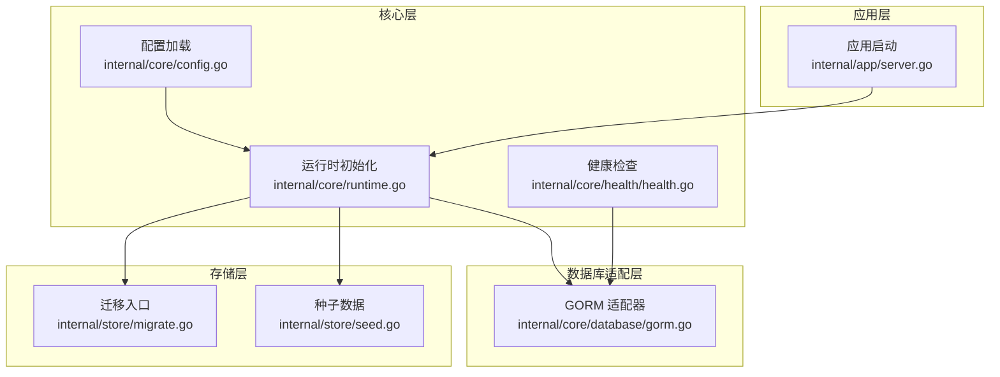
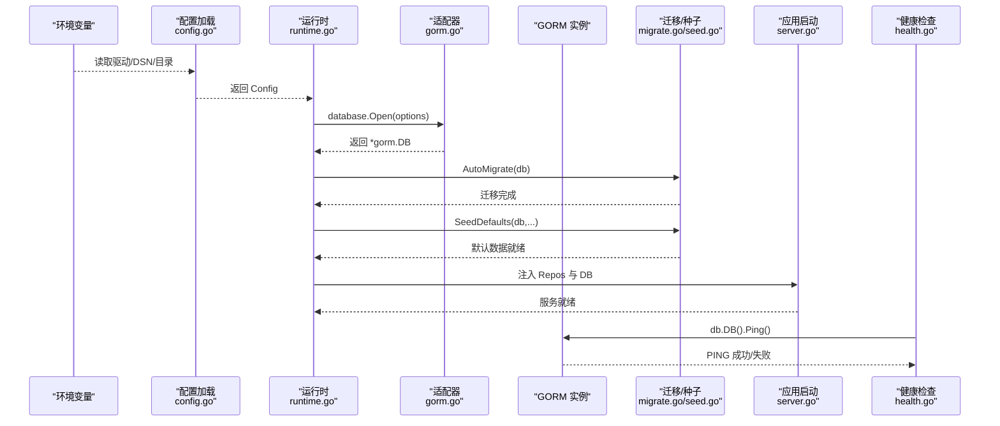
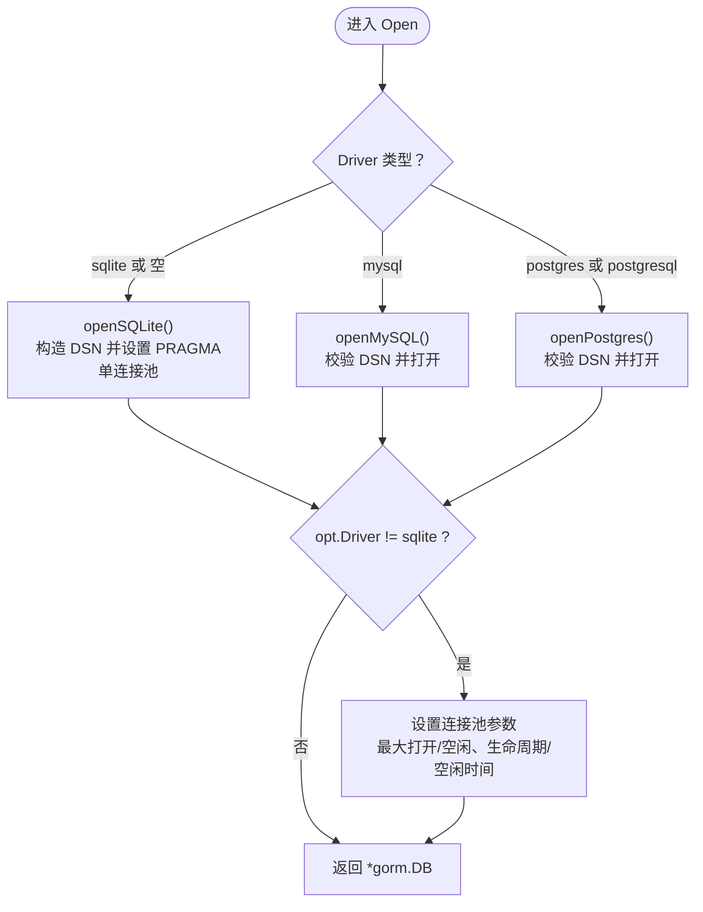
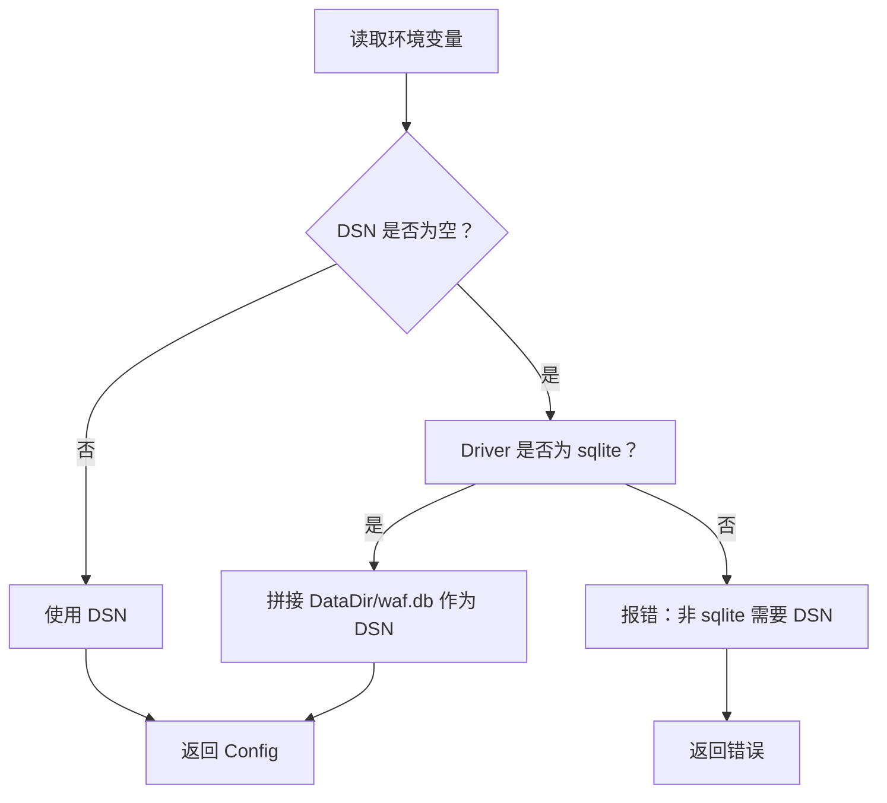
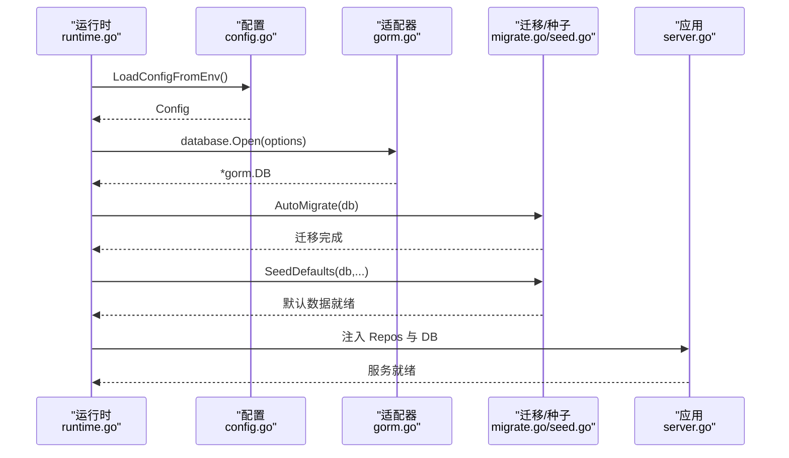
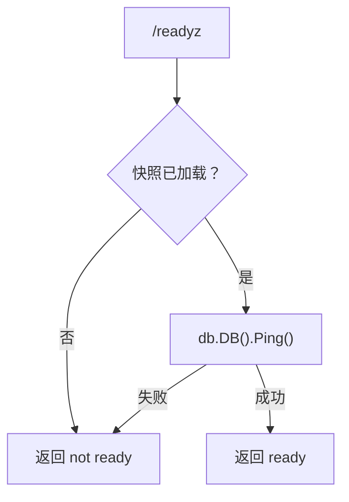
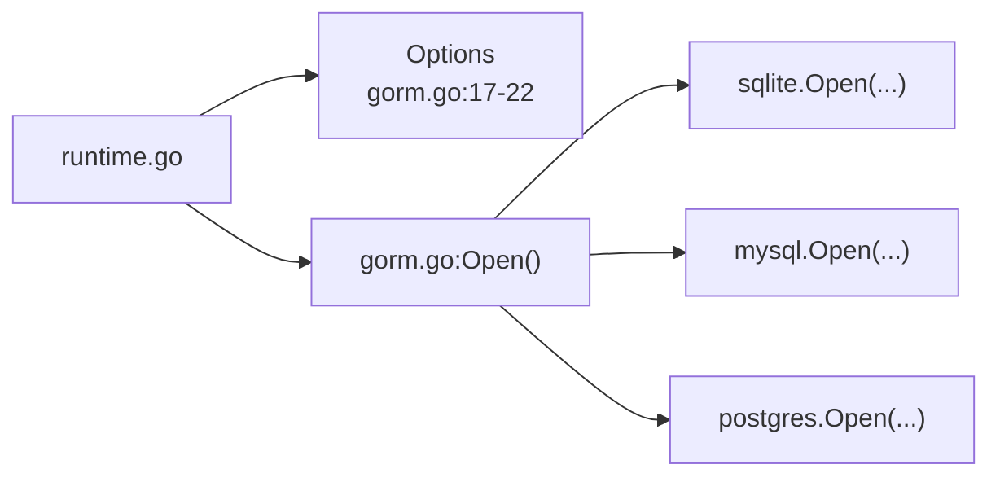

# 数据库适配器

> [返回 扩展与插件系统](../扩展与插件系统.md)

<cite>

<cite>
**本文引用的文件**
- [internal/core/database/gorm.go](file://internal/core/database/gorm.go)
- [internal/core/config.go](file://internal/core/config.go)
- [internal/core/runtime.go](file://internal/core/runtime.go)
- [internal/core/health/health.go](file://internal/core/health/health.go)
- [docs/扩展与插件系统/存储后端扩展/存储后端扩展.md](file://docs/扩展与插件系统/存储后端扩展/存储后端扩展.md)
- [docs/扩展与插件系统/存储后端扩展/连接池管理.md](file://docs/扩展与插件系统/存储后端扩展/连接池管理.md)
- [docs/扩展与插件系统/存储后端扩展/数据库适配器.md](file://docs/扩展与插件系统/存储后端扩展/数据库适配器.md)
- [docs/扩展与插件系统/存储后端扩展/连接池管理.md](file://docs/扩展与插件系统/存储后端扩展/连接池管理.md)
- [docs/扩展与插件系统/存储后端扩展/数据库适配器.md](file://docs/扩展与插件系统/存储后端扩展/数据库适配器.md)
- [docs/数据存储层/多数据库支持.md](file://docs/数据存储层/多数据库支持.md)
- [docs/数据存储层/GORM 配置与使用.md](file://docs/数据存储层/GORM 配置与使用.md)
- [docs/扩展与插件系统/存储后端扩展/存储迁移机制.md](file://docs/扩展与插件系统/存储后端扩展/存储迁移机制.md)
- [internal/store/migrate.go](file://internal/store/migrate.go)
- [internal/store/seed.go](file://internal/store/seed.go)
- [internal/app/server.go](file://internal/app/server.go)
</cite>

## 目录
1. [简介](#简介)
2. [项目结构](#项目结构)
3. [核心组件](#核心组件)
4. [架构总览](#架构总览)
5. [详细组件分析](#详细组件分析)
6. [依赖分析](#依赖分析)
7. [性能考虑](#性能考虑)
8. [故障排查指南](#故障排查指南)
9. [结论](#结论)
10. [附录](#附录)

## 简介
本文件面向数据库适配器的开发者与运维人员，系统性阐述基于 GORM 的数据库适配器设计与实现，覆盖 SQLite、MySQL、PostgreSQL 三种方言的驱动选择、连接参数、连接池调优与特定优化（如 SQLite 的 PRAGMA）。文档同时给出扩展新数据库支持的实践方法、连接字符串格式、性能调优最佳实践，以及错误处理、连接健康检查与故障恢复机制。

## 项目结构
数据库适配器位于核心层，围绕 GORM 抽象实现统一的数据库接入；运行时从环境变量加载配置并调用适配器；健康检查模块通过 Ping 验证数据库连通性；迁移与种子在应用启动阶段执行，确保数据库结构与初始数据就绪。

**图表来源**
- [internal/core/config.go:113-182](file://internal/core/config.go#L113-L182)
- [internal/core/runtime.go:27-80](file://internal/core/runtime.go#L27-L80)
- [internal/core/database/gorm.go:24-61](file://internal/core/database/gorm.go#L24-L61)
- [internal/store/migrate.go:9-37](file://internal/store/migrate.go#L9-L37)
- [internal/store/seed.go:13-61](file://internal/store/seed.go#L13-L61)
- [internal/app/server.go:46-80](file://internal/app/server.go#L46-L80)
- [internal/core/health/health.go:28-38](file://internal/core/health/health.go#L28-L38)

**章节来源**
- [internal/core/config.go:74-102](file://internal/core/config.go#L74-L102)
- [internal/core/runtime.go:27-80](file://internal/core/runtime.go#L27-L80)
- [internal/core/database/gorm.go:24-61](file://internal/core/database/gorm.go#L24-L61)
- [internal/store/migrate.go:9-37](file://internal/store/migrate.go#L9-L37)
- [internal/store/seed.go:13-61](file://internal/store/seed.go#L13-L61)
- [internal/app/server.go:46-80](file://internal/app/server.go#L46-L80)
- [internal/core/health/health.go:28-38](file://internal/core/health/health.go#L28-L38)

## 核心组件
- 适配器选项与工厂
  - Options：封装驱动类型、DSN、数据目录等参数，避免跨包循环依赖。
  - Open：根据驱动类型分派到具体方言打开函数，并对非 SQLite 的连接池进行统一调优。
- 方言实现
  - SQLite：自动推导文件路径、创建目录、拼接 PRAGMA 参数、强制单连接池。
  - MySQL：校验 DSN 非空后打开。
  - PostgreSQL：校验 DSN 非空后打开。
- 运行时与健康检查
  - 运行时从环境变量加载配置并调用 Open 获取 *gorm.DB；健康检查通过 Ping 验证数据库可达性。

**章节来源**
- [internal/core/database/gorm.go:17-22](file://internal/core/database/gorm.go#L17-L22)
- [internal/core/database/gorm.go:24-61](file://internal/core/database/gorm.go#L24-L61)
- [internal/core/database/gorm.go:63-94](file://internal/core/database/gorm.go#L63-L94)
- [internal/core/database/gorm.go:96-111](file://internal/core/database/gorm.go#L96-L111)
- [internal/core/runtime.go:41-48](file://internal/core/runtime.go#L41-L48)
- [internal/core/health/health.go:28-38](file://internal/core/health/health.go#L28-L38)

## 架构总览
下图展示从环境变量到数据库连接、迁移与健康检查的整体流程。

**图表来源**
- [internal/core/config.go:113-182](file://internal/core/config.go#L113-L182)
- [internal/core/runtime.go:27-80](file://internal/core/runtime.go#L27-L80)
- [internal/core/database/gorm.go:24-61](file://internal/core/database/gorm.go#L24-L61)
- [internal/store/migrate.go:9-37](file://internal/store/migrate.go#L9-L37)
- [internal/store/seed.go:13-61](file://internal/store/seed.go#L13-L61)
- [internal/app/server.go:46-80](file://internal/app/server.go#L46-L80)
- [internal/core/health/health.go:28-38](file://internal/core/health/health.go#L28-L38)

## 详细组件分析

### 组件一：GORM 适配器（驱动选择与连接参数）
- 驱动选择
  - 支持 sqlite、mysql、postgres（postgresql 亦受支持）；默认 sqlite。
  - 不支持的驱动将返回错误。
- 连接参数
  - SQLite：DSN 为空时自动落盘至 DataDir/waf.db；可直接传入文件路径。
  - MySQL/PostgreSQL：必须提供完整 DSN。
- 连接池调优
  - 非 SQLite：最大打开连接 25、最大空闲 10、连接最大生命周期 30 分钟、最大空闲 5 分钟。
  - SQLite：强制单连接，禁用连接寿命限制，避免锁竞争。
- SQLite 特定优化
  - 通过 PRAGMA 组合优化：WAL 日志模式、忙等待超时、同步级别、页缓存大小、外键约束、自动 checkpoint。
- 全局配置
  - 日志级别：Warn（生产环境减少噪音）。
  - 跳过默认事务包装，避免单条写入被隐式包裹事务。
  - 启用 PrepareStmt 缓存预编译语句，提升重复查询性能。

**图表来源**
- [internal/core/database/gorm.go:24-61](file://internal/core/database/gorm.go#L24-L61)
- [internal/core/database/gorm.go:63-94](file://internal/core/database/gorm.go#L63-L94)
- [internal/core/database/gorm.go:96-111](file://internal/core/database/gorm.go#L96-L111)

**章节来源**
- [internal/core/database/gorm.go:17-22](file://internal/core/database/gorm.go#L17-L22)
- [internal/core/database/gorm.go:24-61](file://internal/core/database/gorm.go#L24-L61)
- [internal/core/database/gorm.go:63-94](file://internal/core/database/gorm.go#L63-L94)
- [internal/core/database/gorm.go:96-111](file://internal/core/database/gorm.go#L96-L111)
- [docs/数据存储层/多数据库支持.md:134-145](file://docs/数据存储层/多数据库支持.md#L134-L145)
- [docs/扩展与插件系统/存储后端扩展/连接池管理.md:144-152](file://docs/扩展与插件系统/存储后端扩展/连接池管理.md#L144-L152)

### 组件二：配置加载与环境变量映射
- 环境变量
  - MY_OPENWAF_DB_DRIVER：驱动类型（默认 sqlite）。
  - MY_OPENWAF_DSN / MY_OPENWAF_DB：DSN；二者任一存在即使用。
  - MY_OPENWAF_DATA：数据目录，默认 ./data；用于 SQLite 默认文件路径推导。
- 配置生成
  - 若 DSN 为空且驱动为 sqlite，则自动拼接 DataDir/waf.db。
  - 其他配置项（如 Redis、管理绑定地址等）与数据库无关，但作为运行时整体配置的一部分。

**图表来源**
- [internal/core/config.go:113-182](file://internal/core/config.go#L113-L182)

**章节来源**
- [internal/core/config.go:74-102](file://internal/core/config.go#L74-L102)
- [internal/core/config.go:113-182](file://internal/core/config.go#L113-L182)

### 组件三：运行时初始化与迁移
- 运行时
  - 从环境变量加载配置，调用 database.Open 获取数据库实例。
  - 可选初始化 Redis 客户端并进行健康检查。
  - 构建缓存层与分布式 Redis KV。
- 迁移与种子
  - 在获取数据库实例后执行 AutoMigrate 与 SeedDefaults，保证结构与初始数据就绪。
- 应用启动
  - 将仓库与数据库注入应用服务，完成启动流程。

**图表来源**
- [internal/core/runtime.go:27-80](file://internal/core/runtime.go#L27-L80)
- [internal/store/migrate.go:9-37](file://internal/store/migrate.go#L9-L37)
- [internal/store/seed.go:13-61](file://internal/store/seed.go#L13-L61)
- [internal/app/server.go:46-80](file://internal/app/server.go#L46-L80)

**章节来源**
- [internal/core/runtime.go:27-80](file://internal/core/runtime.go#L27-L80)
- [internal/store/migrate.go:9-37](file://internal/store/migrate.go#L9-L37)
- [internal/store/seed.go:13-61](file://internal/store/seed.go#L13-L61)
- [internal/app/server.go:46-80](file://internal/app/server.go#L46-L80)

### 组件四：健康检查与故障恢复
- 健康检查
  - Liveness：进程可达即健康。
  - Readiness：要求快照已加载且数据库 Ping 成功。
- 故障恢复
  - 运行时在初始化阶段对 Redis 进行 Ping，失败则关闭客户端并返回错误。
  - 应用关闭时主动关闭 Redis 与底层 sql.DB，确保资源回收。

**图表来源**
- [internal/core/health/health.go:28-38](file://internal/core/health/health.go#L28-L38)

**章节来源**
- [internal/core/health/health.go:14-96](file://internal/core/health/health.go#L14-L96)
- [internal/core/runtime.go:113-127](file://internal/core/runtime.go#L113-L127)

## 依赖分析
- 组件耦合
  - 适配器仅依赖 GORM 与各方言驱动，保持与上层业务解耦。
  - 运行时通过 Options 将配置传递给适配器，避免直接依赖配置模块。
- 外部依赖
  - SQLite：github.com/glebarez/sqlite
  - MySQL：gorm.io/driver/mysql
  - PostgreSQL：gorm.io/driver/postgres
- 循环依赖
  - 通过 Options 与运行时注入避免循环依赖。

**图表来源**
- [internal/core/runtime.go:41-48](file://internal/core/runtime.go#L41-L48)
- [internal/core/database/gorm.go:17-22](file://internal/core/database/gorm.go#L17-L22)
- [internal/core/database/gorm.go:24-61](file://internal/core/database/gorm.go#L24-L61)

**章节来源**
- [internal/core/database/gorm.go:3-15](file://internal/core/database/gorm.go#L3-L15)
- [internal/core/runtime.go:41-48](file://internal/core/runtime.go#L41-L48)

## 性能考虑
- 连接池
  - 非 SQLite：最大打开连接 25、最大空闲 10、连接最大生命周期 30 分钟、最大空闲 5 分钟。
  - SQLite：单连接避免锁竞争，禁用连接寿命限制，结合 WAL 提升并发读写。
- 查询优化
  - 使用索引字段过滤（如 Enabled、Bind、CreatedAt 等）。
  - 分页查询配合排序，避免全表扫描。
- 预处理语句
  - 启用 PrepareStmt 缓存重复查询，降低解析开销。
- 日志级别
  - 生产环境建议使用 Warn，减少调试日志对吞吐的影响。

**章节来源**
- [docs/扩展与插件系统/存储后端扩展/连接池管理.md:368-383](file://docs/扩展与插件系统/存储后端扩展/连接池管理.md#L368-L383)
- [docs/数据存储层/GORM 配置与使用.md:115-122](file://docs/数据存储层/GORM 配置与使用.md#L115-L122)
- [docs/扩展与插件系统/存储后端扩展/数据库适配器.md:332-342](file://docs/扩展与插件系统/存储后端扩展/数据库适配器.md#L332-L342)

## 故障排查指南
- 常见错误与定位
  - 驱动不支持：检查 MY_OPENWAF_DB_DRIVER 是否为 sqlite、mysql、postgres。
  - DSN 缺失：MySQL/PostgreSQL 必须提供完整 DSN；SQLite 可使用文件路径或 DataDir。
  - 迁移失败：关注数据迁移（站点合并）与结构迁移的先后顺序与事务回滚。
  - 连接池问题：确认非 SQLite 场景的连接池参数是否合理。
- 排查步骤
  - 校验环境变量（驱动、DSN、数据目录）。
  - 查看应用启动日志中的数据库与 Redis 初始化信息。
  - 检查迁移日志与错误码，必要时回滚并重试。
  - 验证连接池状态与慢查询日志（如启用）。

**章节来源**
- [docs/数据存储层/多数据库支持.md:314-331](file://docs/数据存储层/多数据库支持.md#L314-L331)
- [internal/core/database/gorm.go:42-47](file://internal/core/database/gorm.go#L42-L47)
- [internal/core/database/gorm.go:96-111](file://internal/core/database/gorm.go#L96-L111)

## 结论
本项目通过 GORM 抽象实现了对 SQLite、MySQL、PostgreSQL 的统一接入，结合版本化迁移与仓储聚合，提供了稳定、可扩展的数据层能力。非 SQLite 场景的连接池优化与 SQLite 的 PRAGMA 调优，兼顾了性能与可靠性。建议在生产中根据部署规模与特性需求选择合适驱动，并结合连接池与日志策略进行持续优化。

## 附录

### A. 适配器开发示例：扩展新数据库方言
- 步骤
  - 新增方言打开函数，校验 DSN 并调用 gorm.Open。
  - 在 Open 分支中添加新驱动分支。
  - 如需连接池调优，在非 SQLite 分支设置连接池参数。
  - 如有特定优化（如 PRAGMA），在对应方言函数中设置。
- 注意事项
  - 保持 Options 不变，避免跨包循环依赖。
  - 为新驱动补充健康检查与错误处理。
  - 在文档中更新支持列表与 DSN 规范。

**章节来源**
- [internal/core/database/gorm.go:24-61](file://internal/core/database/gorm.go#L24-L61)
- [internal/core/database/gorm.go:96-111](file://internal/core/database/gorm.go#L96-L111)

### B. 连接字符串格式与示例
- SQLite
  - 文件路径或空（自动落盘至 DataDir/waf.db）。
- MySQL
  - 完整 DSN（包含字符集、时区等参数）。
- PostgreSQL
  - 完整 DSN（包含 sslmode 等参数）。

**章节来源**
- [docs/数据存储层/多数据库支持.md:137-140](file://docs/数据存储层/多数据库支持.md#L137-L140)
- [internal/core/database/gorm.go:96-111](file://internal/core/database/gorm.go#L96-L111)

### C. 迁移与种子流程
- 迁移入口负责协调数据迁移与模式迁移的执行顺序，确保幂等性与一致性。
- 种子数据在迁移完成后写入，保证系统初始状态。

**章节来源**
- [docs/扩展与插件系统/存储后端扩展/存储迁移机制.md:33-421](file://docs/扩展与插件系统/存储后端扩展/存储迁移机制.md#L33-L421)
- [internal/store/migrate.go:9-37](file://internal/store/migrate.go#L9-L37)
- [internal/store/seed.go:13-61](file://internal/store/seed.go#L13-L61)