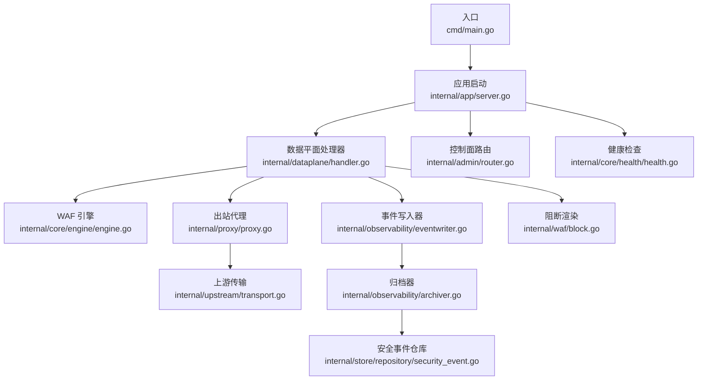
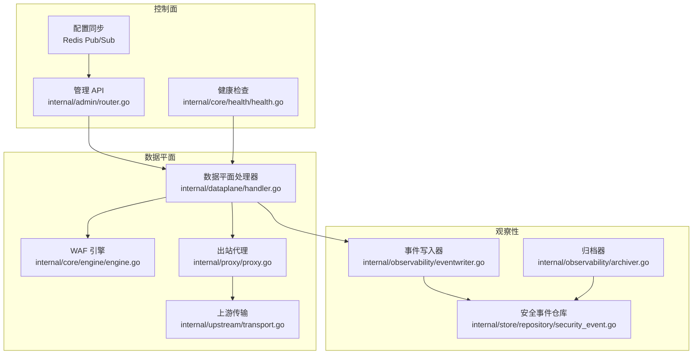
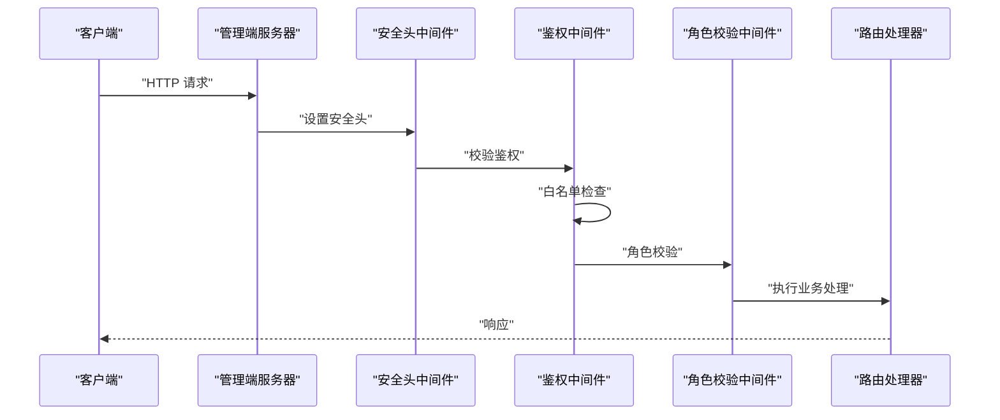
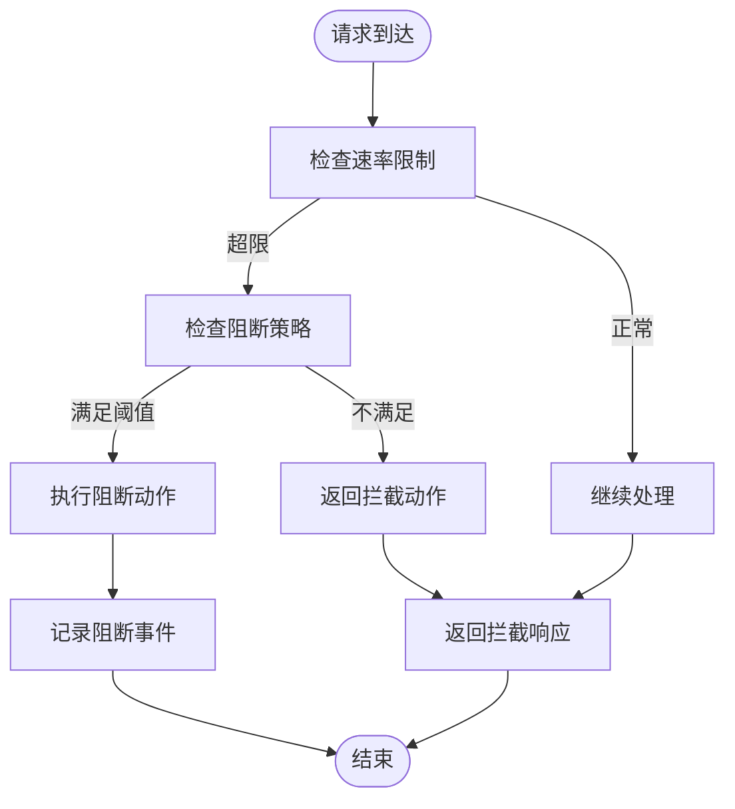
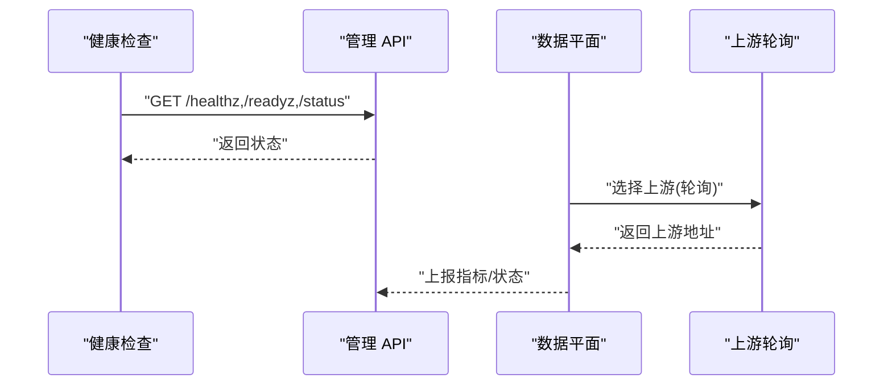
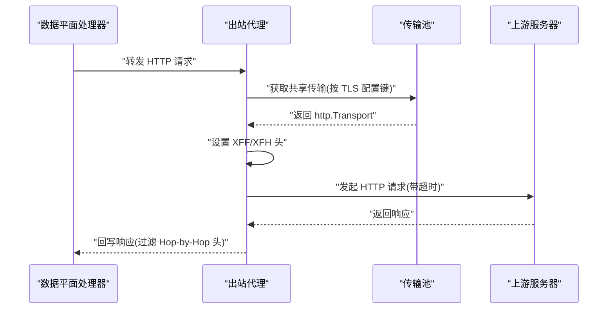
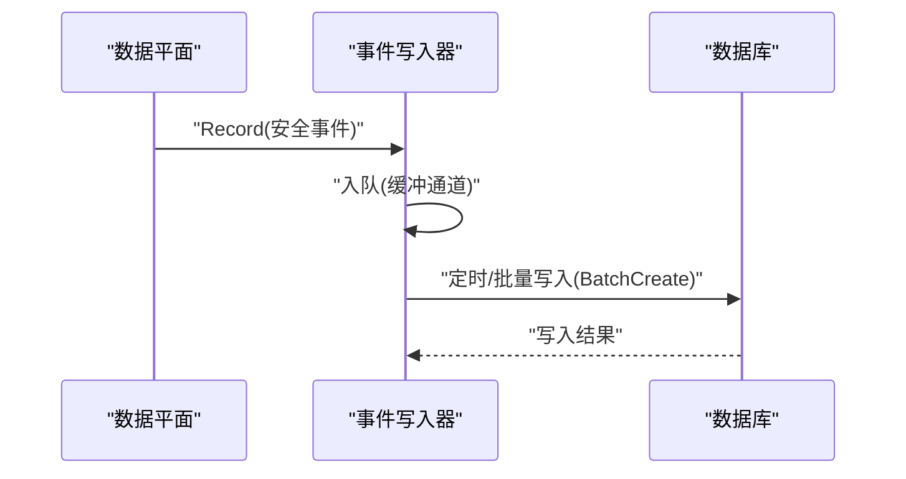
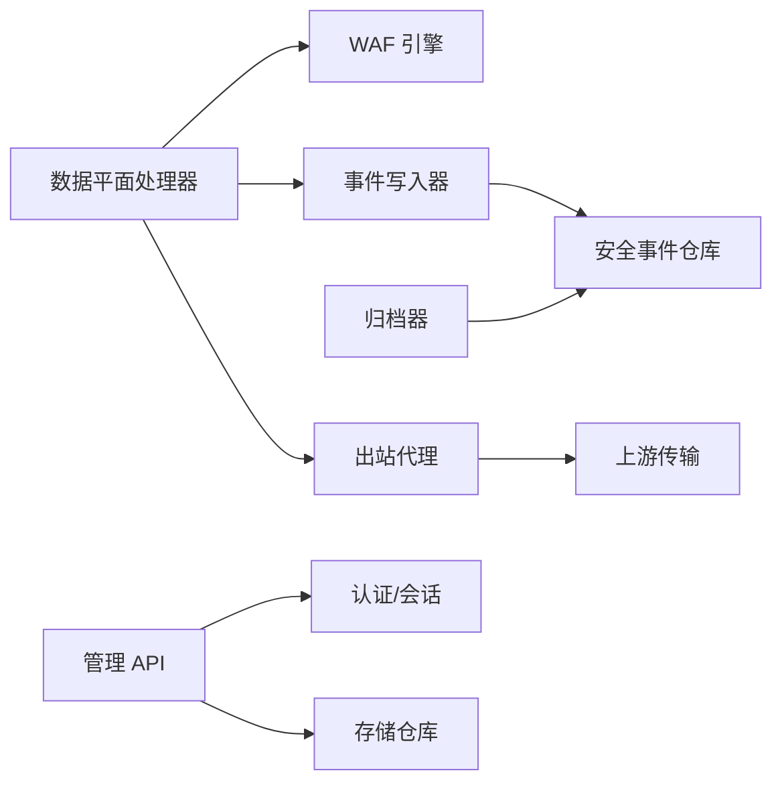

# 服务集成

> [返回 扩展与插件系统](../扩展与插件系统.md)

<cite>

<cite>
**本文引用的文件**
- [cmd/main.go](file://cmd/main.go)
- [internal/app/server.go](file://internal/app/server.go)
- [internal/admin/router.go](file://internal/admin/router.go)
- [internal/admin/middleware.go](file://internal/admin/middleware.go)
- [internal/core/health/health.go](file://internal/core/health/health.go)
- [internal/observability/metrics.go](file://internal/observability/metrics.go)
- [internal/upstream/transport.go](file://internal/upstream/transport.go)
- [internal/proxy/proxy.go](file://internal/proxy/proxy.go)
- [internal/waf/ratelimit/ratelimit.go](file://internal/waf/ratelimit/ratelimit.go)
- [internal/waf/iprep/iprep.go](file://internal/waf/iprep/iprep.go)
- [docs/扩展与插件系统/第三方集成/服务集成.md](file://docs/扩展与插件系统/第三方集成/服务集成.md)
- [docs/安全防护功能/速率限制机制/速率限制机制.md](file://docs/安全防护功能/速率限制机制/速率限制机制.md)
- [docs/安全防护功能/IP 信誉系统.md](file://docs/安全防护功能/IP 信誉系统.md)
- [docs/监控与可观测性/健康检查机制.md](file://docs/监控与可观测性/健康检查机制.md)
</cite>

## 目录
1. [简介](#简介)
2. [项目结构](#项目结构)
3. [核心组件](#核心组件)
4. [架构总览](#架构总览)
5. [详细组件分析](#详细组件分析)
6. [依赖分析](#依赖分析)
7. [性能考量](#性能考量)
8. [故障排查指南](#故障排查指南)
9. [结论](#结论)
10. [附录](#附录)

## 简介
本指南面向服务集成场景，围绕管理端路由函数挂载新的 API 路由、路由注册机制与中间件配置展开；同时系统性阐述外部服务集成方法，包括将限流阈值与封禁策略对接到外部风控平台；说明服务发现与负载均衡的实现原理，以及如何配置上游服务连接池与健康检查。文档提供 REST API 调用、配置同步与状态监控的最佳实践，帮助开发者快速完成集成与扩展。

## 项目结构
系统采用“控制面 + 数据平面 + 观察性”的三层架构：
- 控制面：管理 API、健康检查、配置同步与热重载
- 数据平面：请求处理、WAF 执行、事件记录、反向代理与响应输出
- 观察性：事件写入、归档清理、指标采集与导出

**图表来源**
- [cmd/main.go:1-10](file://cmd/main.go#L1-L10)
- [internal/app/server.go:35-305](file://internal/app/server.go#L35-L305)
- [internal/admin/router.go:35-210](file://internal/admin/router.go#L35-L210)
- [internal/core/health/health.go:14-95](file://internal/core/health/health.go#L14-L95)

**章节来源**
- [cmd/main.go:1-10](file://cmd/main.go#L1-L10)
- [internal/app/server.go:35-305](file://internal/app/server.go#L35-L305)
- [docs/扩展与插件系统/第三方集成/服务集成.md:42-81](file://docs/扩展与插件系统/第三方集成/服务集成.md#L42-L81)

## 核心组件
- 应用启动与监听器编排：负责运行时构建、数据库迁移、默认凭据生成、快照加载、监听器热启停与配置同步
- 数据平面处理器：在请求进入时进行站点匹配、客户端 IP 解析、WAF 规则执行、事件记录、拦截或转发到上游
- 观察性子系统：异步事件写入与定时归档，保证数据平面非阻塞与历史数据可控
- 出站代理与传输：共享连接池、TLS 配置、超时控制与头部处理，支持 HTTP/HTTPS、WebSocket、SSE
- 控制面 API：提供站点、证书、规则、保护设置等管理接口，支持热重载与分布式通知
- 健康检查与状态：提供存活/就绪探针与运行时状态查询，便于服务发现与运维监控

**章节来源**
- [internal/app/server.go:35-305](file://internal/app/server.go#L35-L305)
- [docs/扩展与插件系统/第三方集成/服务集成.md:86-102](file://docs/扩展与插件系统/第三方集成/服务集成.md#L86-L102)

## 架构总览
系统采用“控制面 + 数据平面 + 观察性”的三层架构：
- 控制面：管理 API、健康检查、配置同步与热重载
- 数据平面：请求处理、WAF 执行、事件记录、反向代理与响应输出
- 观察性：事件写入、归档清理、指标采集与导出

**图表来源**
- [internal/admin/router.go:35-210](file://internal/admin/router.go#L35-L210)
- [internal/core/health/health.go:14-95](file://internal/core/health/health.go#L14-L95)
- [internal/proxy/proxy.go:32-136](file://internal/proxy/proxy.go#L32-L136)
- [internal/upstream/transport.go:12-29](file://internal/upstream/transport.go#L12-L29)
- [internal/observability/eventwriter.go:12-105](file://internal/observability/eventwriter.go#L12-L105)
- [internal/observability/archiver.go:11-72](file://internal/observability/archiver.go#L11-L72)

**章节来源**
- [docs/扩展与插件系统/第三方集成/服务集成.md:103-148](file://docs/扩展与插件系统/第三方集成/服务集成.md#L103-L148)

## 详细组件分析

### 管理端路由注册与中间件配置
- 路由注册机制
  - 控制面服务器在启动时注册健康检查与管理 API 路由
  - 路由按角色分组（只读、运维、管理员），并按需应用鉴权与权限中间件
  - 未匹配到管理 API 的静态路径将回退到前端静态资源
- 中间件配置
  - 安全头中间件：统一设置安全响应头
  - 访问日志中间件：记录请求 ID、方法、路径、状态码与耗时
  - 鉴权中间件：支持 JWT 与 API Key，白名单跳过登录/刷新/注销等端点
  - 角色校验中间件：按角色限制访问

**图表来源**
- [internal/admin/router.go:46-244](file://internal/admin/router.go#L46-L244)
- [internal/admin/middleware.go:16-129](file://internal/admin/middleware.go#L16-L129)

**章节来源**
- [internal/admin/router.go:46-244](file://internal/admin/router.go#L46-L244)
- [internal/admin/middleware.go:16-129](file://internal/admin/middleware.go#L16-L129)

### 外部服务集成：限流阈值与封禁策略对接风控平台
- 速率限制与封禁策略
  - 本地固定窗口与 Redis 滑动窗口两种实现，支持多维度限流（IP+Host）
  - 自动封禁阈值、窗口与持续时间可配置，支持拦截或 TCP Drop 动作
  - 阻断策略可与速率限制联动，满足风控平台的阈值与动作要求
- 对接风控平台的建议
  - 将风控平台的阈值与动作映射到保护配置项（窗口、配额、动作类型）
  - 通过管理 API 的热重载能力，实现跨节点同步
  - 使用 Prometheus 指标导出与状态查询接口，对接外部监控系统

**图表来源**
- [internal/waf/ratelimit/ratelimit.go:48-102](file://internal/waf/ratelimit/ratelimit.go#L48-L102)
- [internal/waf/iprep/iprep.go:126-155](file://internal/waf/iprep/iprep.go#L126-L155)
- [docs/安全防护功能/速率限制机制/速率限制机制.md:328-340](file://docs/安全防护功能/速率限制机制/速率限制机制.md#L328-L340)

**章节来源**
- [docs/安全防护功能/速率限制机制/速率限制机制.md:178-284](file://docs/安全防护功能/速率限制机制/速率限制机制.md#L178-L284)
- [docs/安全防护功能/IP 信誉系统.md:215-284](file://docs/安全防护功能/IP 信誉系统.md#L215-L284)

### 服务发现与负载均衡
- 服务发现
  - 通过站点级监听器与快照中的站点映射实现“站点级发现”
  - 每个站点独立监听与路由，支持多站点并行
- 负载均衡
  - 数据平面在多上游地址时采用轮询策略选择下一个上游，实现简单均衡
  - 支持 HTTP/HTTPS、WebSocket、SSE 等协议
- 健康检查与就绪
  - 控制面提供 /healthz、/readyz 与 /status 探针，便于外部健康检查系统接入
- 故障转移
  - 当前未实现自动故障转移；建议在上游传输层或外部反向代理层实现重试与熔断

**图表来源**
- [internal/core/health/health.go:40-95](file://internal/core/health/health.go#L40-L95)
- [internal/admin/router.go:53-67](file://internal/admin/router.go#L53-L67)
- [internal/proxy/proxy.go:32-136](file://internal/proxy/proxy.go#L32-L136)

**章节来源**
- [docs/扩展与插件系统/第三方集成/服务集成.md:261-292](file://docs/扩展与插件系统/第三方集成/服务集成.md#L261-L292)
- [internal/proxy/proxy.go:32-136](file://internal/proxy/proxy.go#L32-L136)

### 上游传输协议支持与连接池
- HTTP/HTTPS 协议
  - 默认启用 HTTP/2，支持 ALPN 与 SNI；HTTPS 时可配置跳过校验与最小版本
- 连接池管理
  - 通过共享传输缓存（按 TLS 配置键）复用 http.Transport，降低连接建立开销
  - 默认最大空闲连接与每主机空闲连接数、空闲超时与强制启用 HTTP/2
- 超时控制
  - 出站 HTTP 客户端设置统一超时，避免上游阻塞影响数据平面
- TLS 与头部处理
  - HTTPS 场景下根据站点配置设置 SNI、跳过校验与最小 TLS 版本
  - 出站请求设置 X-Forwarded-For 与 X-Forwarded-Host（可选）

**图表来源**
- [internal/proxy/proxy.go:32-136](file://internal/proxy/proxy.go#L32-L136)
- [internal/upstream/transport.go:12-29](file://internal/upstream/transport.go#L12-L29)

**章节来源**
- [docs/扩展与插件系统/第三方集成/服务集成.md:189-224](file://docs/扩展与插件系统/第三方集成/服务集成.md#L189-L224)
- [internal/upstream/transport.go:12-29](file://internal/upstream/transport.go#L12-L29)
- [internal/proxy/proxy.go:32-136](file://internal/proxy/proxy.go#L32-L136)

### 观察性与事件写入
- 异步事件写入
  - 事件写入器使用有界缓冲通道与定时刷新，批量写入数据库，避免阻塞数据平面
- 安全事件归档
  - 归档器按保留期定期清理过期事件，减少存储压力
- 指标与导出
  - 数据平面收集访问、拦截、攻击 IP 等指标；控制面提供 Prometheus 导出端点

**图表来源**
- [internal/observability/eventwriter.go:27-105](file://internal/observability/eventwriter.go#L27-L105)
- [internal/observability/archiver.go:59-72](file://internal/observability/archiver.go#L59-L72)

**章节来源**
- [docs/扩展与插件系统/第三方集成/服务集成.md:294-321](file://docs/扩展与插件系统/第三方集成/服务集成.md#L294-L321)

### 阻断与维护页面
- 阻断页面
  - 根据站点或全局模板渲染阻断页，支持自定义状态码与模板变量
- 维护页面
  - 支持站点级或全局维护页，可自定义状态码
- TCP Drop
  - 在特定动作下直接关闭连接，不发送 HTTP 响应

**章节来源**
- [docs/扩展与插件系统/第三方集成/服务集成.md:323-333](file://docs/扩展与插件系统/第三方集成/服务集成.md#L323-L333)

## 依赖分析
- 组件耦合
  - 数据平面处理器依赖引擎、事件写入器、出站代理与快照持有者
  - 出站代理依赖共享传输与安全头设置
  - 归档器依赖安全事件仓库与日志
  - 控制面路由依赖认证、会话与存储仓库
- 外部依赖
  - HTTP 服务器框架、数据库 ORM、Redis（可选）、TLS 配置
- 循环依赖
  - 未见循环导入；模块边界清晰

**图表来源**
- [internal/dataplane/handler.go:37-310](file://internal/dataplane/handler.go#L37-L310)
- [internal/proxy/proxy.go:32-136](file://internal/proxy/proxy.go#L32-L136)
- [internal/observability/archiver.go:11-72](file://internal/observability/archiver.go#L11-L72)
- [internal/admin/router.go:35-210](file://internal/admin/router.go#L35-L210)

**章节来源**
- [docs/扩展与插件系统/第三方集成/服务集成.md:335-372](file://docs/扩展与插件系统/第三方集成/服务集成.md#L335-L372)

## 性能考量
- 连接池与 HTTP/2
  - 合理设置最大空闲连接与每主机空闲连接数，启用 HTTP/2 降低延迟
- 事件写入批量化
  - 通过批量大小与刷新间隔平衡吞吐与延迟
- 归档策略
  - 保留期与轮询间隔需权衡存储成本与查询性能
- 负载均衡
  - 简单轮询适合同质化上游；若需更细粒度控制，可在上游层引入权重或健康探测
- 超时与背压
  - 出站超时与错误率限流共同构成对外部系统的保护

## 故障排查指南
- 常见问题定位
  - 502 上游错误：检查上游地址、TLS 配置与网络连通性
  - 403 拦截：查看 WAF 规则命中与阻断页面模板
  - 维护模式：确认站点或全局维护开关与模板
  - 归档异常：检查数据库写入权限与磁盘空间
- 健康检查
  - 使用 /healthz（存活）、/readyz（就绪）、/status（状态）快速判断系统健康状况
- 日志与指标
  - 数据平面记录访问日志与 WAF 观测命中；控制面暴露指标端点用于监控

**章节来源**
- [docs/监控与可观测性/健康检查机制.md:368-405](file://docs/监控与可观测性/健康检查机制.md#L368-L405)

## 结论
该服务集成系统以清晰的分层与模块化设计实现了从控制面到数据平面再到观察性的完整闭环。通过异步事件写入与定时归档，既保证了数据平面的高性能，又满足了合规的留存要求；通过共享连接池与 TLS 配置，提供了稳定高效的出站代理能力。未来可在 gRPC/自定义协议扩展、自动重试与熔断、以及更精细的负载均衡策略方面进一步增强。

## 附录

### REST API 调用与配置同步最佳实践
- 管理 API 路由挂载
  - 在控制面服务器上注册新的管理 API 路由，按需应用鉴权与权限中间件
  - 使用分组与角色中间件实现细粒度权限控制
- 配置同步
  - 通过 Redis Pub/Sub 实现跨节点配置热重载
  - 在应用启动时订阅配置变更并动态更新运行时参数
- 状态监控
  - 对外暴露 /metrics（Prometheus 文本格式）与 /status（运行时状态）
  - 结合 /healthz 与 /readyz 实现健康检查

**章节来源**
- [internal/admin/router.go:46-244](file://internal/admin/router.go#L46-L244)
- [internal/app/server.go:220-242](file://internal/app/server.go#L220-L242)
- [internal/observability/metrics.go:51-125](file://internal/observability/metrics.go#L51-L125)
- [internal/core/health/health.go:40-95](file://internal/core/health/health.go#L40-L95)

### 上游服务连接池与健康检查配置
- 连接池配置
  - 通过共享传输缓存（按 TLS 配置键）复用 http.Transport
  - 设置最大空闲连接、每主机空闲连接数、空闲超时与强制启用 HTTP/2
- 健康检查
  - 使用 /healthz、/readyz、/status 探针，结合外部监控系统实现健康检查
  - 在上游传输层或外部反向代理层实现重试与熔断策略

**章节来源**
- [internal/upstream/transport.go:12-29](file://internal/upstream/transport.go#L12-L29)
- [internal/proxy/proxy.go:32-136](file://internal/proxy/proxy.go#L32-L136)
- [docs/扩展与插件系统/第三方集成/服务集成.md:261-292](file://docs/扩展与插件系统/第三方集成/服务集成.md#L261-L292)