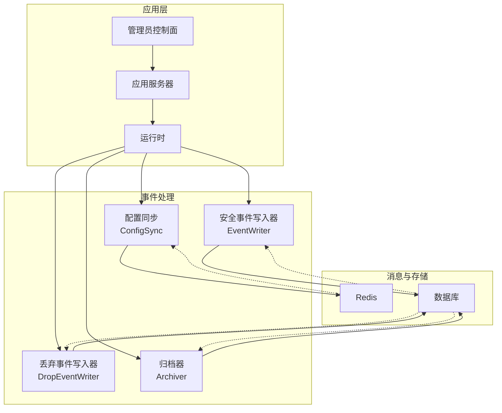
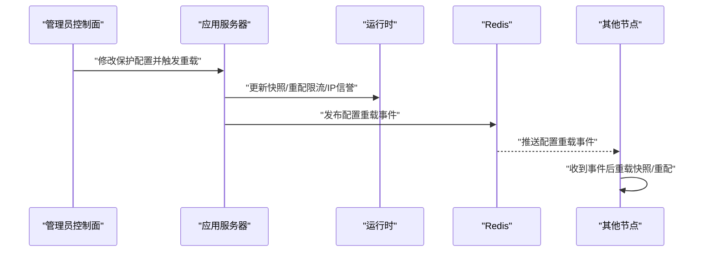
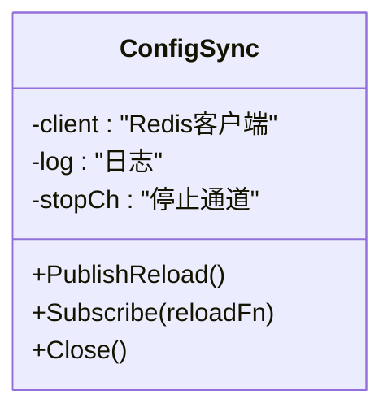
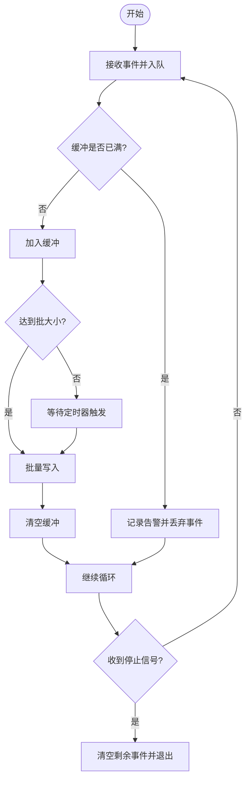
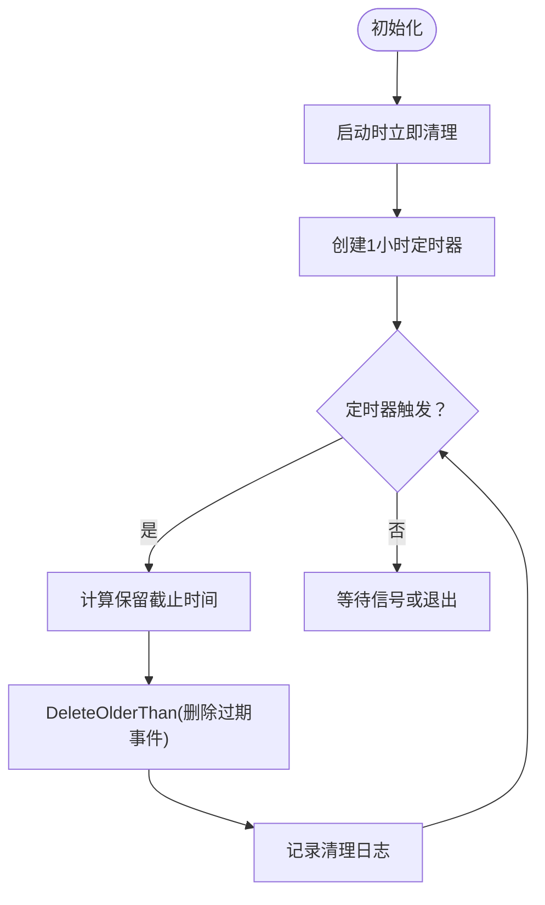
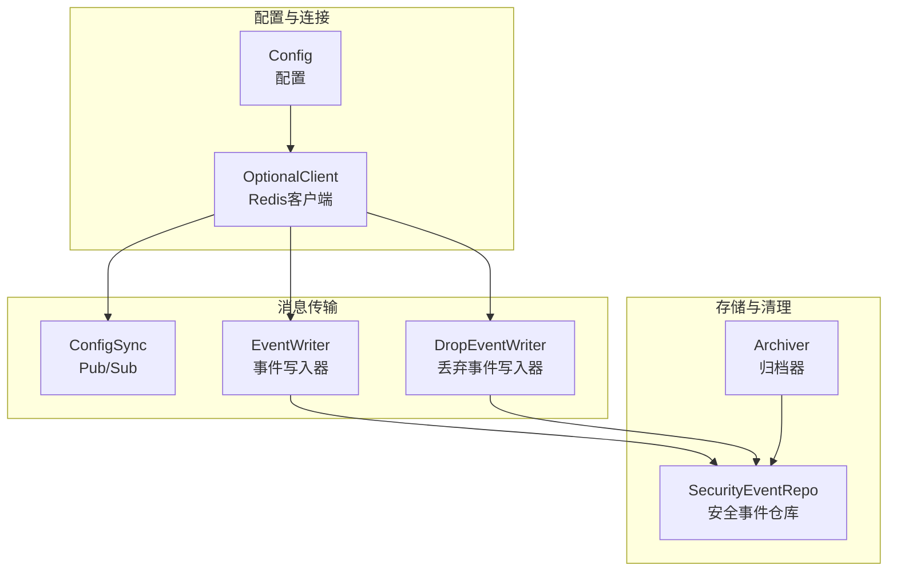

# 消息队列集成
> [返回 扩展与插件系统](../扩展与插件系统.md)

<cite>
**本文档引用的文件**
- [消息队列集成.md](file://docs/扩展与插件系统/第三方集成/消息队列集成.md)
- [pubsub.go](file://internal/core/redis/pubsub.go)
- [redis.go](file://internal/core/redis/redis.go)
- [server.go](file://internal/app/server.go)
- [eventwriter.go](file://internal/observability/eventwriter.go)
- [dropevent_writer.go](file://internal/observability/dropevent_writer.go)
- [archiver.go](file://internal/observability/archiver.go)
- [security_event.go](file://internal/store/repository/security_event.go)
- [events.go](file://internal/store/events.go)
- [config.go](file://internal/core/config.go)
</cite>

## 目录
1. [简介](#简介)
2. [项目结构](#项目结构)
3. [核心组件](#核心组件)
4. [架构总览](#架构总览)
5. [详细组件分析](#详细组件分析)
6. [依赖分析](#依赖分析)
7. [性能考虑](#性能考虑)
8. [故障排查指南](#故障排查指南)
9. [结论](#结论)
10. [附录](#附录)

## 简介
本文件面向消息队列集成系统，围绕以下目标展开：
- Redis Pub/Sub 事件订阅机制：频道管理、消息发布与订阅、事件路由。
- 分布式事件写入系统：事件序列化、批量处理与持久化策略。
- 消息队列配置选项：连接参数、缓冲区大小、重连策略等。
- 事件类型与消息格式：安全事件、性能指标、系统状态消息。
- 可靠性保障：确认机制、重试策略、死信队列处理。
- 开发指南：客户端实现、性能优化、故障恢复机制。

## 项目结构
消息队列集成在本项目中主要体现为：
- Redis Pub/Sub：用于跨节点的配置同步通知（非消息队列模式）。
- 内部事件写入：基于 Go 通道的异步事件写入，非外部消息队列中间件。
- 指标导出：Prometheus 文本格式导出，供监控系统抓取。

**图表来源**
- [server.go:178-349](file://internal/app/server.go#L178-L349)
- [pubsub.go:13-77](file://internal/core/redis/pubsub.go#L13-L77)
- [eventwriter.go:19-164](file://internal/observability/eventwriter.go#L19-L164)
- [dropevent_writer.go:19-155](file://internal/observability/dropevent_writer.go#L19-L155)
- [archiver.go:31-154](file://internal/observability/archiver.go#L31-L154)

**章节来源**
- [server.go:178-349](file://internal/app/server.go#L178-L349)
- [pubsub.go:13-77](file://internal/core/redis/pubsub.go#L13-L77)
- [eventwriter.go:19-164](file://internal/observability/eventwriter.go#L19-L164)
- [dropevent_writer.go:19-155](file://internal/observability/dropevent_writer.go#L19-L155)
- [archiver.go:31-154](file://internal/observability/archiver.go#L31-L154)

## 核心组件
- Redis Pub/Sub 配置同步：在配置变更时通过通道广播"reload"指令，其他节点收到后触发本地快照重载与资源热更新。
- 异步事件写入器：将安全事件写入缓冲通道，按批次与定时器批量落库，避免阻塞数据面热路径。
- 丢弃事件写入器：与安全事件写入器类似，但专门处理 TCP 连接丢弃事件。
- 归档清理器：周期性删除超过保留期的安全事件，控制存储增长。
- 数据模型与仓库：统一的安全事件结构、过滤查询、聚合统计与批量插入。

**章节来源**
- [pubsub.go:13-77](file://internal/core/redis/pubsub.go#L13-L77)
- [eventwriter.go:19-164](file://internal/observability/eventwriter.go#L19-L164)
- [dropevent_writer.go:19-155](file://internal/observability/dropevent_writer.go#L19-L155)
- [archiver.go:31-154](file://internal/observability/archiver.go#L31-L154)
- [security_event.go:17-293](file://internal/store/repository/security_event.go#L17-L293)
- [events.go:5-81](file://internal/store/events.go#L5-L81)

## 架构总览
消息队列集成在本项目中主要体现为：
- Redis Pub/Sub：用于跨节点的配置同步通知（非消息队列模式）。
- 内部事件写入：基于 Go 通道的异步事件写入，非外部消息队列中间件。
- 指标导出：Prometheus 文本格式导出，供监控系统抓取。

**图表来源**
- [server.go:313-349](file://internal/app/server.go#L313-L349)
- [pubsub.go:33-68](file://internal/core/redis/pubsub.go#L33-L68)

## 详细组件分析

### Redis Pub/Sub 配置同步
- 频道管理：使用固定频道名进行配置重载广播。
- 发布流程：在配置变更时以带超时的上下文发布"reload"。
- 订阅流程：后台协程订阅频道，收到消息后执行重载逻辑并处理错误。
- 关闭流程：通过停止通道关闭订阅连接，确保资源释放。

**图表来源**
- [pubsub.go:13-77](file://internal/core/redis/pubsub.go#L13-L77)

**章节来源**
- [pubsub.go:13-77](file://internal/core/redis/pubsub.go#L13-L77)
- [server.go:313-349](file://internal/app/server.go#L313-L349)

### 异步事件写入器
- 缓冲与批处理：内部通道容量、批大小与刷新间隔可调；定时器与事件到达双重触发批量写入。
- 非阻塞入队：缓冲满时丢弃事件并记录告警，避免阻塞数据面。
- 关闭与收尾：关闭时清空剩余事件并等待工作协程退出。
- 批量持久化：使用仓库层的分批插入接口，降低单次事务开销。

**图表来源**
- [eventwriter.go:80-116](file://internal/observability/eventwriter.go#L80-L116)

**章节来源**
- [eventwriter.go:19-164](file://internal/observability/eventwriter.go#L19-L164)
- [dropevent_writer.go:19-155](file://internal/observability/dropevent_writer.go#L19-L155)

### 丢弃事件写入器
- 专用写入器：针对 TCP 连接丢弃事件的专用写入器，与安全事件写入器类似。
- Redis 双写：当配置 Redis 时，事件同时写入数据库和 Redis 列表。
- 批量处理：采用相同的缓冲、批大小和定时器触发机制。

**章节来源**
- [dropevent_writer.go:19-155](file://internal/observability/dropevent_writer.go#L19-L155)

### 归档清理器
- 定期清理：启动即执行一次清理，随后按固定间隔扫描并删除超过保留期的事件。
- 保留期：默认30天，可通过构造函数配置。
- 日志记录：清理成功时输出删除数量与截止时间。

**图表来源**
- [archiver.go:83-99](file://internal/observability/archiver.go#L83-L99)

**章节来源**
- [archiver.go:31-154](file://internal/observability/archiver.go#L31-L154)

### 数据模型与仓库
- 安全事件模型：包含请求ID、客户端IP、主机、路径、方法、用户代理、规则ID/字符串、阶段、动作、类别、匹配描述、地理国家/城市、状态码等字段。
- 仓库接口：提供列表查询、创建、批量创建、删除过期记录、统计聚合等功能。
- 过滤器：支持按站点ID、动作、阶段、类别、客户端IP、主机、路径、规则ID/字符串、时间范围等条件过滤。

**章节来源**
- [events.go:5-81](file://internal/store/events.go#L5-L81)
- [security_event.go:17-293](file://internal/store/repository/security_event.go#L17-L293)

## 依赖分析
消息队列集成涉及的核心依赖关系如下：

**图表来源**
- [config.go:74-102](file://internal/core/config.go#L74-L102)
- [redis.go:17-39](file://internal/core/redis/redis.go#L17-L39)
- [pubsub.go:13-77](file://internal/core/redis/pubsub.go#L13-L77)
- [eventwriter.go:19-164](file://internal/observability/eventwriter.go#L19-L164)
- [dropevent_writer.go:19-155](file://internal/observability/dropevent_writer.go#L19-L155)
- [archiver.go:31-154](file://internal/observability/archiver.go#L31-L154)

**章节来源**
- [config.go:74-102](file://internal/core/config.go#L74-L102)
- [redis.go:17-39](file://internal/core/redis/redis.go#L17-L39)
- [pubsub.go:13-77](file://internal/core/redis/pubsub.go#L13-L77)
- [eventwriter.go:19-164](file://internal/observability/eventwriter.go#L19-L164)
- [dropevent_writer.go:19-155](file://internal/observability/dropevent_writer.go#L19-L155)
- [archiver.go:31-154](file://internal/observability/archiver.go#L31-L154)

## 性能考虑
- 缓冲区容量：安全事件写入器默认缓冲容量为16384，丢弃事件写入器为8192，可根据流量峰值调整。
- 批大小与刷新间隔：默认批大小为256，刷新间隔为5秒；可通过参数调整以平衡延迟与吞吐。
- Redis 双写：事件同时写入数据库和 Redis 列表，Redis 写入使用管道批量操作，限制列表长度防止内存无限增长。
- 归档清理：定期清理过期事件，控制存储空间；支持动态配置保留期。
- 并发模型：使用 goroutine 和通道实现异步处理，避免阻塞数据面热路径。

## 故障排查指南
- Redis 连接问题：检查 Redis 地址、密码、数据库配置；使用 Ping 方法验证连接。
- Pub/Sub 订阅异常：捕获错误并记录，必要时重启订阅协程；检查频道名称一致性。
- 事件写入失败：记录错误与批量大小，检查数据库连接与权限；考虑降级为同步写入。
- 缓冲区溢出：监控告警日志，适当增大缓冲容量或调整批处理参数。
- 归档清理异常：检查数据库连接与权限，确认保留期配置正确。

**章节来源**
- [redis.go:32-39](file://internal/core/redis/redis.go#L32-L39)
- [pubsub.go:33-68](file://internal/core/redis/pubsub.go#L33-L68)
- [eventwriter.go:118-139](file://internal/observability/eventwriter.go#L118-L139)
- [archiver.go:115-153](file://internal/observability/archiver.go#L115-L153)

## 结论
本项目的消息队列集成以Redis Pub/Sub实现跨节点配置同步，以内部异步事件写入器实现高吞吐、低延迟的安全事件持久化，辅以归档清理与多维度指标导出，形成完整的可观测与可靠性保障体系。对于需要更高可靠性的场景，可在现有基础上扩展为外部消息队列中间件（如Kafka/RabbitMQ），并引入确认与重试、死信队列等机制。

## 附录

### 消息队列配置选项
- Redis 连接参数
  - 地址：RedisAddr
  - 密码：RedisPassword
  - 数据库：RedisDB
  - 超时：连接/读/写超时已在客户端创建时设置
- 事件写入器参数
  - 缓冲区容量：默认16384（安全事件），8192（丢弃事件）
  - 批大小：默认256
  - 刷新间隔：默认5秒
- 归档清理参数
  - 保留期：默认30天（可配置）
  - 清理间隔：默认1小时

**章节来源**
- [redis.go:17-39](file://internal/core/redis/redis.go#L17-L39)
- [eventwriter.go:38-51](file://internal/observability/eventwriter.go#L38-L51)
- [dropevent_writer.go:36-50](file://internal/observability/dropevent_writer.go#L36-L50)
- [archiver.go:44-66](file://internal/observability/archiver.go#L44-L66)

### 事件类型与消息格式
- 安全事件
  - 字段：请求ID、客户端IP、主机、路径、方法、用户代理、规则ID/字符串、阶段、动作、类别、匹配描述、地理国家/城市、状态码
  - 用途：审计、统计、可视化
- 丢弃事件
  - 字段：ID、站点ID、客户端IP、来源、规则ID、详情、主机、路径、创建时间
  - 用途：监控连接丢弃情况
- 性能指标
  - 数据平面：请求总量、状态码分布、WAF拦截/观察、内置命中、QPS、唯一IP、攻击IP
  - 观测性：请求总数、拦截/观察、内置命中、缓存命中/未命中、上游错误、进程运行时信息
- 系统状态消息
  - 配置重载：通过Redis Pub/Sub广播"reload"，触发节点间同步

**章节来源**
- [events.go:5-81](file://internal/store/events.go#L5-L81)
- [security_event.go:17-293](file://internal/store/repository/security_event.go#L17-L293)

### 消息可靠性保证
- 当前实现
  - Redis Pub/Sub：至少一次传递，无显式确认与重试；通过节点内重载流程保证最终一致性。
  - 事件写入：异步批写，缓冲满丢弃；无重试与死信队列。
- 建议增强
  - 引入外部消息队列中间件，实现确认、重试与死信队列。
  - 对关键事件（如配置变更）增加幂等处理与去重。

**章节来源**
- [pubsub.go:33-68](file://internal/core/redis/pubsub.go#L33-L68)
- [eventwriter.go:118-139](file://internal/observability/eventwriter.go#L118-L139)

### 消息队列集成开发指南
- 客户端实现
  - Redis：使用可选客户端创建与Ping校验，确保可用后再启用订阅/发布。
  - 事件写入：复用现有事件写入器，按需调整缓冲与批参数。
- 性能优化
  - 提升批大小与刷新间隔以降低写入次数；扩大缓冲容量以应对突发流量。
  - 使用原子计数器与环形窗口计算QPS，减少锁竞争。
- 故障恢复
  - 订阅异常：捕获错误并记录，必要时重启订阅协程。
  - 写入失败：记录错误与批量大小，必要时降级为同步写入或启用死信队列。

**章节来源**
- [redis.go:17-39](file://internal/core/redis/redis.go#L17-L39)
- [eventwriter.go:38-51](file://internal/observability/eventwriter.go#L38-L51)
- [archiver.go:83-99](file://internal/observability/archiver.go#L83-L99)