# 监控系统集成

> [返回 扩展与插件系统](../扩展与插件系统.md)

<cite>

<cite>
**本文档引用的文件**
- [监控与可观测性/监控与可观测性.md](file://docs/监控与可观测性/监控与可观测性.md)
- [监控与可观测性/性能指标收集.md](file://docs/监控与可观测性/性能指标收集.md)
- [扩展与插件/第三方集成/监控系统集成.md](file://docs/扩展与插件系统/第三方集成/监控系统集成.md)
- [internal/observability/metrics.go](file://internal/observability/metrics.go)
- [internal/dataplane/metrics.go](file://internal/dataplane/metrics.go)
- [internal/observability/accesslog_writer.go](file://internal/observability/accesslog_writer.go)
- [internal/observability/botscore_writer.go](file://internal/observability/botscore_writer.go)
- [internal/observability/dropevent_writer.go](file://internal/observability/dropevent_writer.go)
- [internal/observability/unified_writer.go](file://internal/observability/unified_writer.go)
- [internal/store/repository/security_event.go](file://internal/store/repository/security_event.go)
- [internal/admin/site/observability.go](file://internal/admin/site/observability.go)
- [frontend/app/(dashboard)/dashboard/page.tsx](file://frontend/app/(dashboard)/dashboard/page.tsx)
- [frontend/components/charts/realtime-qps-chart.tsx](file://frontend/components/charts/realtime-qps-chart.tsx)
- [frontend/components/charts/attack-heatmap.tsx](file://frontend/components/charts/attack-heatmap.tsx)
- [internal/core/health/health.go](file://internal/core/health/health.go)
- [internal/pkg/logger/logger.go](file://internal/pkg/logger/logger.go)
</cite>

## 目录
1. [简介](#简介)
2. [项目结构](#项目结构)
3. [核心组件](#核心组件)
4. [架构总览](#架构总览)
5. [详细组件分析](#详细组件分析)
6. [依赖关系分析](#依赖关系分析)
7. [性能考量](#性能考量)
8. [故障排查指南](#故障排查指南)
9. [结论](#结论)
10. [附录](#附录)

## 简介
本文件面向监控系统集成，围绕 Prometheus 指标导出、数据面指标实现、事件写入与归档、健康检查、日志管理、前端可视化与告警配置进行系统化说明。重点覆盖：
- Prometheus 指标导出机制与自定义指标注册
- 数据面指标的实现原理（原子计数器、环形窗口、性能优化）
- 阻断事件、CVE 检测、机器人评分等新增监控维度
- 与其他监控系统（OpenTelemetry、DataDog、NewRelic）的集成思路
- 告警规则配置、仪表板定制与日志聚合实践

## 项目结构
监控与可观测性相关代码主要分布在以下模块：
- 控制面（Admin 服务器）：注册健康检查、Prometheus 指标端点、安全事件 API、阻断策略 API、CVE 规则 API、机器人防护 API 与前端静态资源
- 观测性子系统：包含 Prometheus 兼容指标导出、安全事件异步写入与归档
- 数据平面指标：提供实时 QPS、状态码分布、WAF 命中等指标
- 存储模型与仓库：定义安全事件、阻断事件、机器人评分日志、CVE 规则等数据模型及聚合查询接口
- 日志系统：基于标准库 slog 的结构化日志与彩色输出
- 前端仪表板：提供实时 QPS 曲线、攻击热力图、阻断策略管理、CVE 规则管理、机器人防护等页面

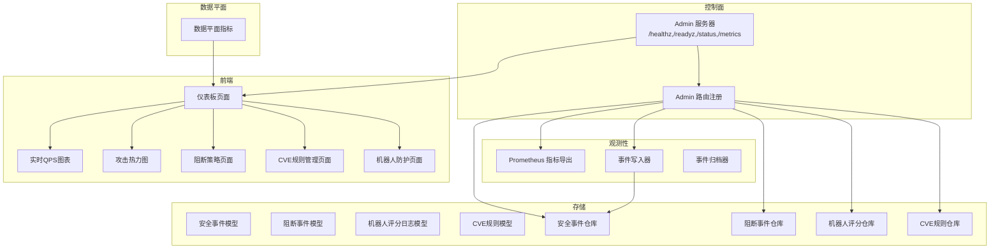

**图表来源**
- [监控与可观测性/监控与可观测性.md:113-126](file://docs/监控与可观测性/监控与可观测性.md#L113-L126)
- [监控与可观测性/监控与可观测性.md:114-125](file://docs/监控与可观测性/监控与可观测性.md#L114-L125)

**章节来源**
- [监控与可观测性/监控与可观测性.md:55-126](file://docs/监控与可观测性/监控与可观测性.md#L55-L126)

## 核心组件
- Prometheus 指标导出：提供 /metrics 接口，暴露请求总量、拦截次数、观察次数、内置规则命中、缓存命中/未命中、上游错误、运行时内存与协程数等指标
- 安全事件记录：通过事件写入器异步批量入库，避免阻塞数据面；支持缓冲区满丢弃保护
- 事件归档：按保留期定期清理过期事件，降低存储压力
- 数据平面指标：统计请求总量、状态码分布、WAF 命中、内置命中、唯一 IP 与攻击 IP 数等，并提供近实时 QPS 计算
- 健康检查：/healthz（存活）、/readyz（就绪）、/status（运行时信息）
- 日志系统：结构化日志，支持环境变量控制级别与颜色输出
- 前端仪表板：聚合指标并以图表展示，支持时间范围切换与实时刷新
- **新增** 阻断事件监控：记录 TCP 连接阻断事件，支持按来源分类统计和事件追踪
- **新增** CVE 检测统计：管理 CVE 漏洞检测规则，提供自动同步和检测统计功能
- **新增** 机器人评分日志：记录机器人评分评估结果，支持评分统计和风险分析

**章节来源**
- [监控与可观测性/监控与可观测性.md:131-142](file://docs/监控与可观测性/监控与可观测性.md#L131-L142)

## 架构总览
下图展示了从应用启动到指标导出、事件写入与前端可视化的整体流程，包括新增的阻断事件监控、CVE 检测统计和机器人评分日志功能。

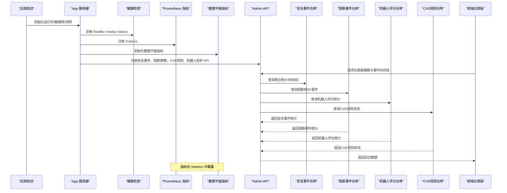

**图表来源**
- [监控与可观测性/监控与可观测性.md:155-184](file://docs/监控与可观测性/监控与可观测性.md#L155-L184)

**章节来源**
- [监控与可观测性/监控与可观测性.md:152-184](file://docs/监控与可观测性/监控与可观测性.md#L152-L184)

## 详细组件分析

### Prometheus 指标导出机制
- 指标定义与用途
  - 请求总量、阻断总量、观察总量、内置规则命中数、响应缓存命中/未命中、上游错误计数
  - 进程运行时长、当前 goroutine 数、内存分配字节、系统内存字节、GC 暂停累计纳秒
- 标签管理
  - 当前实现以指标名区分维度，未使用标签（Prometheus text exposition format）
- 数据采集策略
  - 每次 /metrics 请求读取运行时内存统计与启动时间，动态计算运行时指标
  - 计数器类指标为单调递增，gauge 类指标为瞬时值
- 路由注册
  - 控制面服务器在启动时注册 /metrics 路由，交由指标处理器生成文本格式响应

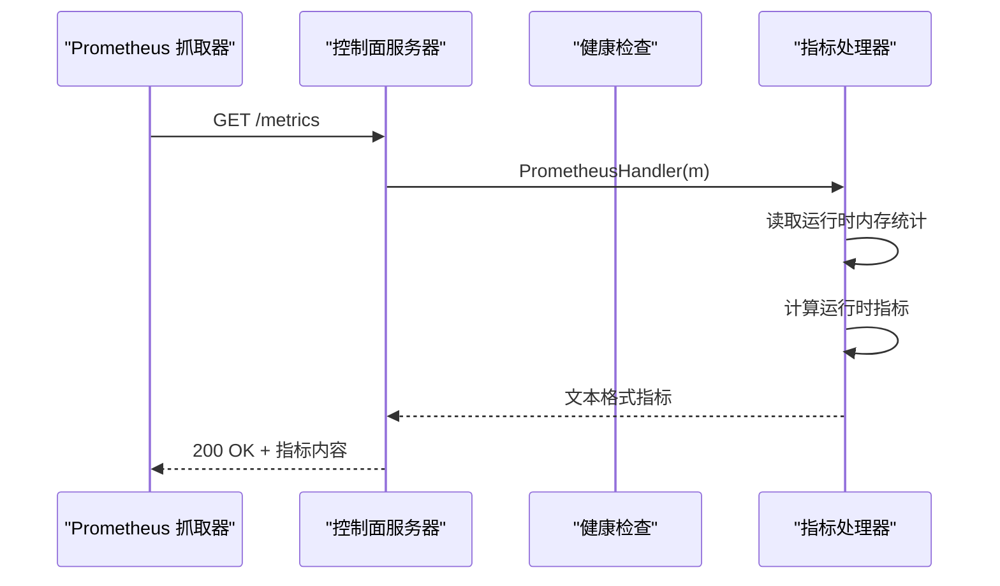

**图表来源**
- [扩展与插件/第三方集成/监控系统集成.md:164-177](file://docs/扩展与插件系统/第三方集成/监控系统集成.md#L164-L177)

**章节来源**
- [扩展与插件/第三方集成/监控系统集成.md:152-185](file://docs/扩展与插件系统/第三方集成/监控系统集成.md#L152-L185)

### 数据平面指标（实时统计）
- 指标定义与用途
  - RequestsTotal：累计请求数
  - Status2xx/Status4xx/Status5xx：上游响应状态码分布
  - WAFBlocks/WAFObserves/BuiltinHits：WAF 阻断/观察/内置规则命中
  - UniqueIPs/AttackIPs：唯一访问 IP 与攻击源 IP 数
  - QPS1s/QPS5s：近 1/5 秒平均 QPS（基于 10×1s 环形桶）
- 统计逻辑
  - QPS：遍历最近 N 秒桶内计数求和并除以窗口长度
  - 唯一 IP/攻击 IP：使用并发安全 map，首次出现时计数加一
- 暴露方式
  - 提供 Summary 结构体用于 API 返回，前端可直接消费

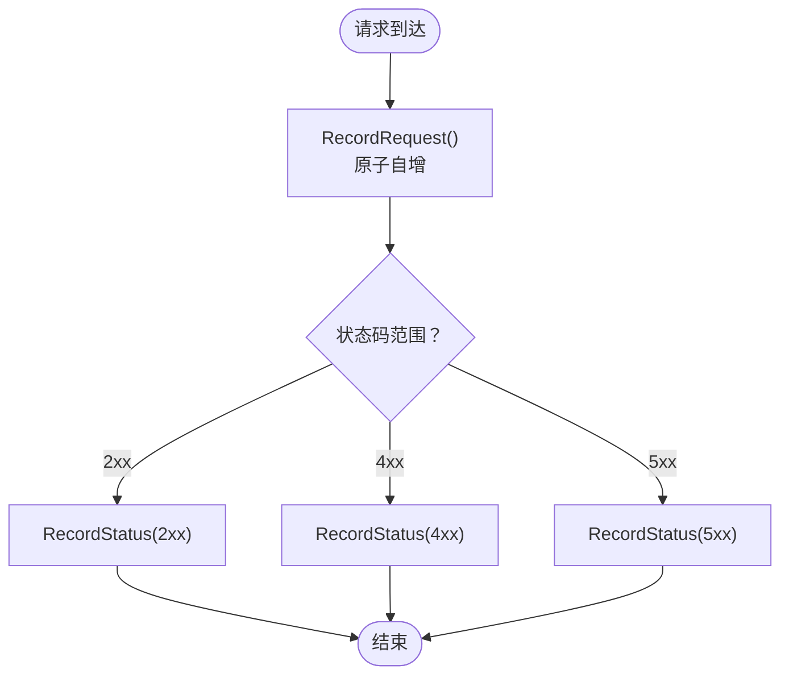

**图表来源**
- [监控与可观测性/性能指标收集.md:195-206](file://docs/监控与可观测性/性能指标收集.md#L195-L206)

**章节来源**
- [监控与可观测性/性能指标收集.md:182-213](file://docs/监控与可观测性/性能指标收集.md#L182-L213)

### 事件写入与归档系统
- 事件类型与数据模型
  - 安全事件包含请求标识、客户端 IP、主机、路径、方法、用户代理、规则 ID/字符串、阶段、动作、类别、匹配描述、地理信息与状态码等字段
- 写入策略
  - 使用带缓冲通道的事件写入器，支持批量写入与定时刷新，缓冲满时丢弃新事件并记录警告日志
  - 批量大小与刷新间隔为可调参数，当前实现默认批量大小与刷新周期已内建
- 存储策略
  - 采用 GORM 批量插入，分批写入数据库，减少单次事务开销
  - 提供删除早于指定时间的事件接口，用于归档清理
- 归档清理
  - 默认保留 30 天，可配置；启动后立即执行一次清理
  - 每小时执行一次清理任务

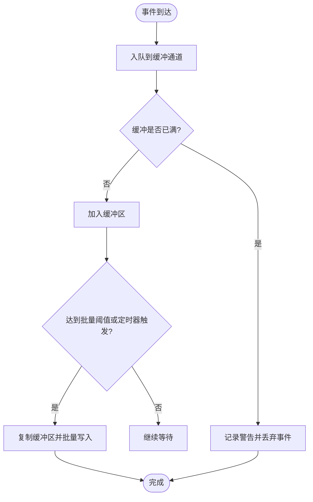

**图表来源**
- [监控与可观测性/监控与可观测性.md:204-216](file://docs/监控与可观测性/监控与可观测性.md#L204-L216)

**章节来源**
- [监控与可观测性/监控与可观测性.md:194-224](file://docs/监控与可观测性/监控与可观测性.md#L194-L224)

### 健康检查系统集成
- 端点
  - /healthz：存活探针，进程运行即视为健康
  - /readyz：就绪探针，需满足数据库可达且快照已加载
  - /status：返回运行时信息（版本、CPU、协程数、堆内存、站点与监听器数量等）
- 自动恢复
  - 通过外部编排系统（如 Kubernetes）结合探针失败重启容器或重新调度实例

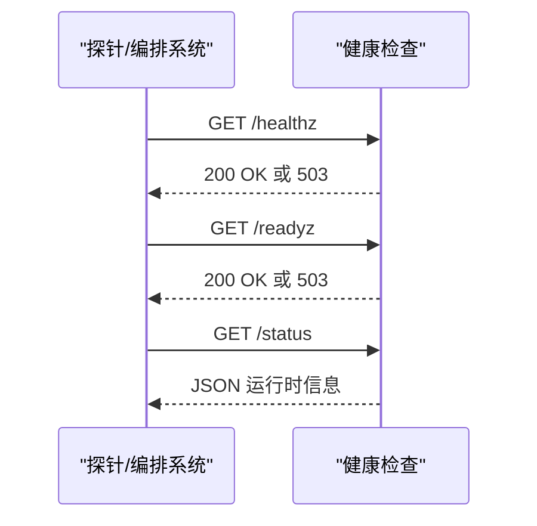

**图表来源**
- [监控与可观测性/监控与可观测性.md:456-467](file://docs/监控与可观测性/监控与可观测性.md#L456-L467)

**章节来源**
- [监控与可观测性/监控与可观测性.md:448-475](file://docs/监控与可观测性/监控与可观测性.md#L448-L475)

### 日志管理系统
- 日志级别
  - 支持 DEBUG/INFO/WARN/ERROR 四级，可通过环境变量设置
- 格式标准化
  - 统一时间戳、级别徽章、分段信息与键值对属性，支持彩色输出（终端自动检测）
- 存储策略
  - 默认输出到标准输出；生产环境建议重定向至文件或对接集中式日志系统

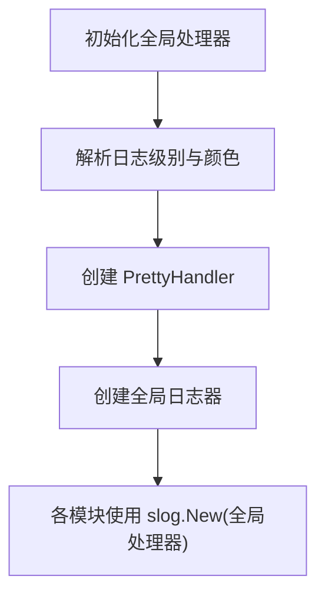

**图表来源**
- [监控与可观测性/监控与可观测性.md:433-440](file://docs/监控与可观测性/监控与可观测性.md#L433-L440)

**章节来源**
- [监控与可观测性/监控与可观测性.md:425-447](file://docs/监控与可观测性/监控与可观测性.md#L425-L447)

### 监控仪表板与前端集成
- 指标来源
  - 仪表板摘要来自数据平面指标汇总；事件时间线来自安全事件仓库的聚合查询
  - **新增** 阻断策略页面：显示阻断统计卡片、阻断事件列表和策略配置
  - **新增** CVE 规则管理页面：展示 CVE 规则列表、同步状态和规则管理功能
  - **新增** 机器人防护页面：配置机器人检测参数，查看评分日志和评分说明
- 刷新策略
  - 前端定时轮询 /api/v1/dashboard/summary 与 /api/v1/security-events/timeline，实时更新图表
  - **新增** 阻断策略页面定时刷新阻断统计和事件列表
  - **新增** CVE 规则页面定时刷新同步状态和规则列表
- 图表组件
  - 实时 QPS 曲线与攻击热力图分别渲染近实时数据与时间序列热力图
  - **新增** 阻断事件统计图表，展示按来源分类的阻断数量
  - **新增** CVE 检测趋势图表，展示 CVE 攻击类型分布

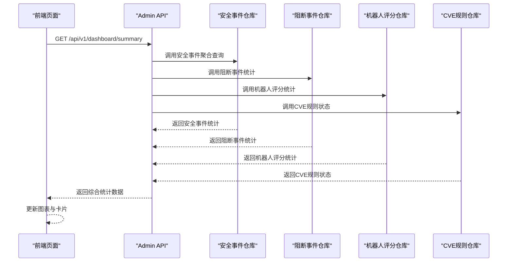

**图表来源**
- [监控与可观测性/监控与可观测性.md:514-534](file://docs/监控与可观测性/监控与可观测性.md#L514-L534)

**章节来源**
- [监控与可观测性/监控与可观测性.md:499-549](file://docs/监控与可观测性/监控与可观测性.md#L499-L549)

### 阻断事件监控系统
- 事件类型与数据模型
  - 阻断事件记录 TCP 连接阻断，包含客户端 IP、阻断来源（bot、cve、rule、ip_reputation）、规则 ID、详细描述、主机、路径和创建时间等字段
  - 支持按来源分类统计，包括机器人阻断、CVE 规则阻断、自定义规则阻断和 IP 信誉阻断
- 统计分析
  - 提供 24 小时阻断事件统计，支持按来源细分的阻断数量分析
  - 支持阻断事件列表查询，包含 IP 筛选、来源筛选、时间范围筛选等功能
- 事件追踪
  - 提供阻断事件详情展示，支持按规则 ID、来源、时间段等条件查询
  - 集成阻断策略配置，支持全局阻断开关、机器人分数阈值、CVE 自动阻断等策略设置

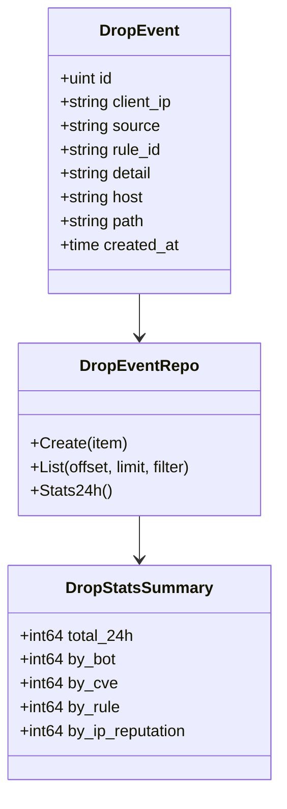

**图表来源**
- [监控与可观测性/监控与可观测性.md:236-263](file://docs/监控与可观测性/监控与可观测性.md#L236-L263)

**章节来源**
- [监控与可观测性/监控与可观测性.md:225-273](file://docs/监控与可观测性/监控与可观测性.md#L225-L273)

### CVE 检测统计系统
- CVE 规则管理
  - 支持 CVE 漏洞检测规则的创建、更新、删除、启用/禁用操作
  - 规则类型包括 PHP、Java、Node.js、General 等，严重程度分为 Critical、High、Medium、Low
  - 支持正则表达式模式匹配，目标可以是 URL、Body、Header、Cookie 等
- 同步状态管理
  - 提供 CVE 漏洞数据源同步功能，支持 NVD 和 GitHub Advisory 数据源
  - 记录同步状态、最后同步时间、错误信息和待审核规则数量
- 检测统计
  - 统计 24 小时 CVE 攻击事件数量，按 CVE 类型分类统计
  - 提供 CVE 规则状态概览，支持规则启用状态和来源分类

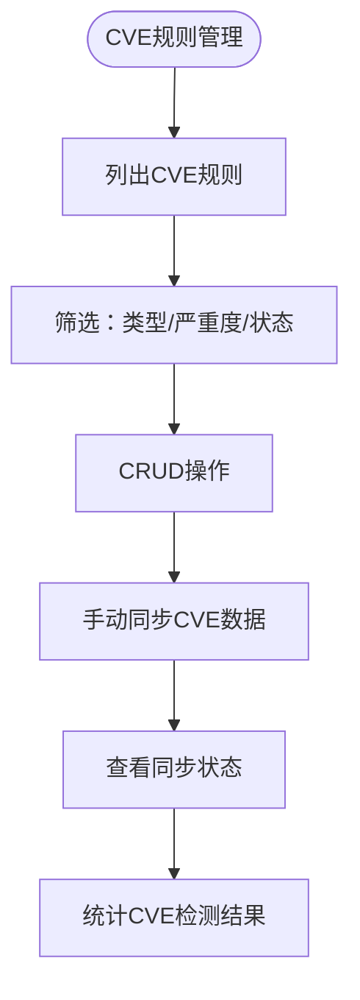

**图表来源**
- [监控与可观测性/监控与可观测性.md:286-295](file://docs/监控与可观测性/监控与可观测性.md#L286-L295)

**章节来源**
- [监控与可观测性/监控与可观测性.md:274-305](file://docs/监控与可观测性/监控与可观测性.md#L274-L305)

### 机器人评分日志系统
- 评分算法与数据模型
  - 机器人评分日志记录机器人检测评估结果，包含客户端 IP、主机、路径、总分、各项评分（GeoIP、指纹、行为、IP 信誉）和是否高风险等字段
  - 支持评分阈值配置，根据总分判断机器人风险等级
- 统计分析
  - 提供 24 小时机器人检测统计，包括总检测数、阻断数、高风险数等指标
  - 支持按动作类型（阻断、丢弃）和高风险状态的统计分析
- 可视化展示
  - 提供机器人评分日志列表，支持 IP 筛选、分数范围筛选、时间范围筛选
  - 展示评分计算说明，包括各项评分的构成和总分计算方式

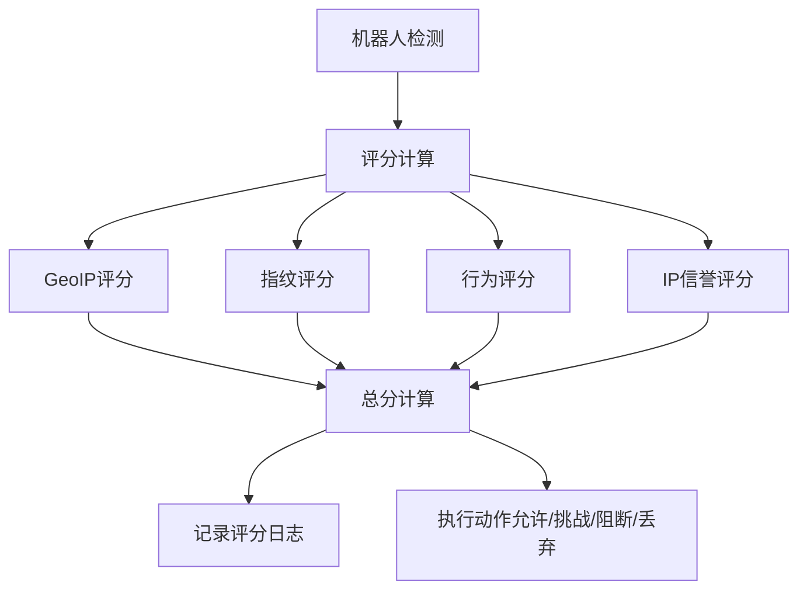

**图表来源**
- [监控与可观测性/监控与可观测性.md:317-331](file://docs/监控与可观测性/监控与可观测性.md#L317-L331)

**章节来源**
- [监控与可观测性/监控与可观测性.md:306-342](file://docs/监控与可观测性/监控与可观测性.md#L306-L342)

## 依赖关系分析
- 控制面路由依赖健康检查与 Prometheus 指标导出；安全事件 API、阻断策略 API、CVE 规则 API、机器人防护 API 依赖对应的仓库层聚合查询
- 数据平面指标被前端仪表板消费；事件写入器与归档器均依赖仓库层
- 日志系统为全局单例，所有模块共享同一处理器
- **新增** 阻断事件监控依赖阻断事件仓库和系统设置仓库
- **新增** CVE 检测统计依赖 CVE 规则仓库和 CVE 数据源管理器
- **新增** 机器人评分日志依赖机器人评分仓库和系统设置仓库

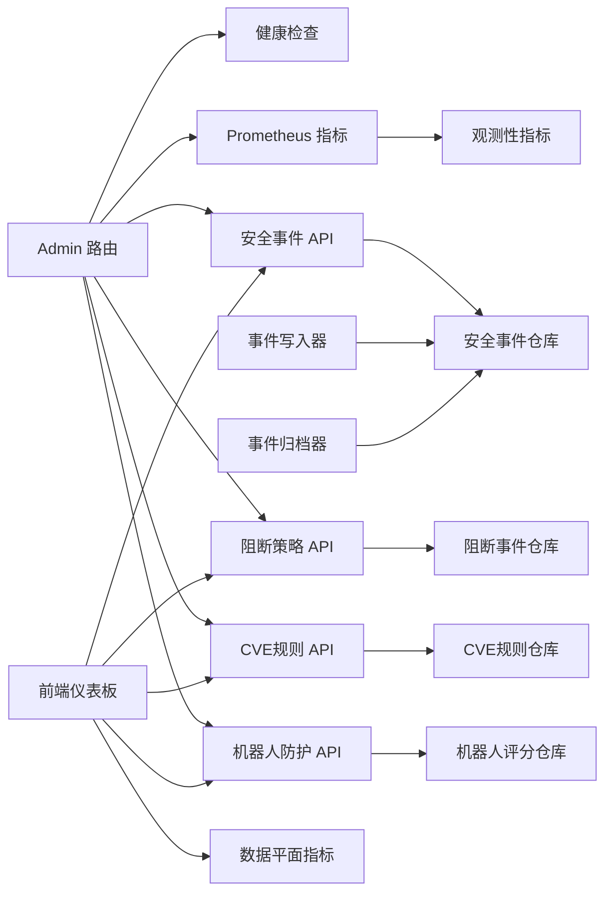

**图表来源**
- [监控与可观测性/监控与可观测性.md:558-578](file://docs/监控与可观测性/监控与可观测性.md#L558-L578)

**章节来源**
- [监控与可观测性/监控与可观测性.md:550-587](file://docs/监控与可观测性/监控与可观测性.md#L550-L587)

## 性能考量
- 指标导出
  - /metrics 为纯文本格式，读取内存计数器与运行时信息，开销极低
- 事件写入
  - 异步批量写入与定时刷新，避免阻塞数据面；缓冲满丢弃策略保证稳定性
- 归档清理
  - 每小时一次的定时清理，避免大量历史数据影响查询性能
- 前端轮询
  - 仪表板每 5 秒轮询一次摘要，建议在高并发场景下考虑 SSE 或 WebSocket 降低轮询开销
- **新增** 阻断事件查询
  - 阻断事件统计查询使用数据库聚合函数，支持 24 小时时间窗口的高效统计
- **新增** CVE 规则管理
  - CVE 规则列表查询支持分页和多条件筛选，数据库层面使用索引优化查询性能

**章节来源**
- [监控与可观测性/监控与可观测性.md:591-604](file://docs/监控与可观测性/监控与可观测性.md#L591-L604)

## 故障排查指南
- 健康检查失败
  - /readyz 失败通常表示数据库不可达或快照未加载；检查数据库连接与配置加载日志
- 指标缺失
  - 确认 /metrics 能正常访问；若 Prometheus 抓取失败，检查网络与防火墙策略
- 事件丢失
  - 若缓冲区频繁满，事件写入器会丢弃新事件；适当增大缓冲或调整批量大小与刷新间隔
- 日志级别
  - 通过环境变量调整日志级别以便定位问题；生产环境建议至少 INFO
- **新增** 阻断事件异常
  - 检查阻断策略配置是否正确，确认阻断来源分类统计是否正常
- **新增** CVE 规则同步失败
  - 查看 CVE 数据源同步状态，检查网络连接和数据源可用性
- **新增** 机器人评分异常
  - 检查机器人检测配置，确认评分阈值设置合理，查看评分日志分析异常情况

**章节来源**
- [监控与可观测性/监控与可观测性.md:605-620](file://docs/监控与可观测性/监控与可观测性.md#L605-L620)

## 结论
该系统通过异步事件写入、定时归档、Prometheus 指标导出与健康检查端点，构建了完整的可观测性闭环。本次更新新增的阻断事件监控、CVE 检测统计、机器人评分日志等功能，进一步增强了系统的安全防护能力和监控深度。前端仪表板与图表组件提供了直观的可视化能力，支持多种监控维度的实时展示。建议在生产环境中结合告警规则与日志集中化，进一步完善监控体系。

## 附录

### 关键指标清单与含义
- openwaf_requests_total：处理的总请求数（counter）
- openwaf_blocks_total：拦截的总请求数（counter）
- openwaf_observes_total：仅观察的检测次数（counter）
- openwaf_builtin_hits_total：内置 OWASP 规则命中次数（counter）
- openwaf_cache_hits_total：响应缓存命中次数（counter）
- openwaf_cache_misses_total：响应缓存未命中次数（counter）
- openwaf_upstream_errors_total：上游代理错误次数（counter）
- openwaf_uptime_seconds：进程运行时长（gauge）
- openwaf_goroutines：当前协程数（gauge）
- openwaf_memory_alloc_bytes：当前堆内存分配字节数（gauge）
- openwaf_memory_sys_bytes：从系统获取的总内存（gauge）
- openwaf_gc_pause_total_ns：GC 暂停累计纳秒数（counter）
- **新增** openwaf_drop_total：24 小时阻断事件总数（counter）
- **新增** openwaf_drop_by_bot：24 小时机器人阻断数（counter）
- **新增** openwaf_drop_by_cve：24 小时 CVE 规则阻断数（counter）
- **新增** openwaf_drop_by_rule：24 小时自定义规则阻断数（counter）
- **新增** openwaf_drop_by_ip_rep：24 小时 IP 信誉阻断数（counter）
- **新增** openwaf_cve_total：24 小时 CVE 攻击总数（counter）
- **新增** openwaf_cve_by_type：CVE 攻击按类型分布统计
- **新增** openwaf_bot_total：24 小时机器人检测总数（counter）
- **新增** openwaf_bot_blocked：24 小时机器人阻断数（counter）
- **新增** openwaf_bot_high_risk：24 小时高风险机器人数（counter）

**章节来源**
- [监控与可观测性/监控与可观测性.md:631-654](file://docs/监控与可观测性/监控与可观测性.md#L631-L654)

### 告警规则配置示例（概念性）
- 高拦截率：rate(openwaf_blocks_total[5m]) / rate(openwaf_requests_total[5m]) > 阈值
- 上游错误激增：increase(openwaf_upstream_errors_total[5m]) > 阈值
- 资源紧张：openwaf_goroutines > 阈值 或 openwaf_memory_alloc_bytes > 阈值
- **新增** 阻断事件激增：increase(openwaf_drop_total[5m]) > 阈值 或 rate(openwaf_drop_total[5m]) > 阈值
- **新增** CVE 攻击异常：increase(openwaf_cve_total[5m]) > 阈值 或 rate(openwaf_cve_total[5m]) > 阈值
- **新增** 机器人威胁升级：increase(openwaf_bot_blocked[5m]) > 阈值 或 rate(openwaf_bot_high_risk[5m]) > 阈值

**章节来源**
- [监控与可观测性/监控与可观测性.md:658-665](file://docs/监控与可观测性/监控与可观测性.md#L658-L665)

### 新增 API 端点与功能
- **阻断策略 API**
  - GET /api/v1/drop-policy：获取阻断策略配置
  - PUT /api/v1/drop-policy/update：更新阻断策略配置
  - GET /api/v1/drop-stats：获取阻断统计（24 小时）
  - GET /api/v1/drop-events：获取阻断事件列表
- **CVE 规则 API**
  - GET /api/v1/cve-rules：获取 CVE 规则列表
  - POST /api/v1/cve-rules：创建 CVE 规则
  - PUT /api/v1/cve-rules/:id：更新 CVE 规则
  - DELETE /api/v1/cve-rules/:id：删除 CVE 规则
  - PUT /api/v1/cve-rules/:id/toggle：启用/禁用 CVE 规则
  - POST /api/v1/cve-rules/sync：手动同步 CVE 数据
  - GET /api/v1/cve-feed/status：获取 CVE 数据源同步状态
- **机器人防护 API**
  - GET /api/v1/bot-settings：获取机器人检测配置
  - PUT /api/v1/bot-settings/update：更新机器人检测配置
  - GET /api/v1/bot-scores：获取机器人评分日志
  - GET /api/v1/fingerprints：获取指纹统计信息

**章节来源**
- [监控与可观测性/监控与可观测性.md:666-691](file://docs/监控与可观测性/监控与可观测性.md#L666-L691)

### 第三方监控系统集成指南
- OpenTelemetry
  - 使用 Prometheus Exporter 作为 OpenTelemetry Collector 的 scrape 目标，采集现有指标
  - 在 OpenTelemetry Collector 中配置适当的指标转换与重命名规则，确保与现有指标名称一致
  - 通过 OpenTelemetry SDK 将业务自定义指标上报至 Jaeger/Zipkin 进行分布式追踪
- DataDog
  - 将 Prometheus 指标通过 DogStatsD 或 Datadog Agent 配置为 Prometheus 源
  - 在 DataDog 中创建自定义仪表板，映射 openwaf_* 指标到相应图表
  - 配置告警规则，基于 increase()/rate() 函数设置阈值触发
- NewRelic
  - 使用 NewRelic Infrastructure 插件或 Prometheus 插件采集指标
  - 在 NewRelic 中创建自定义仪表板，使用 NRQL 查询 openwaf_* 指标
  - 配置 NRQL 告警，监控关键指标的异常波动

**章节来源**
- [扩展与插件/第三方集成/监控系统集成.md:33-41](file://docs/扩展与插件系统/第三方集成/监控系统集成.md#L33-L41)

### 数据面指标实现原理详解
- 原子计数器
  - 使用 atomic.Int64 实现线程安全的计数器，避免锁竞争
  - 支持 RecordRequest/RecordStatus/RecordWAFBlock 等方法的原子自增
- 环形窗口
  - 固定大小（10）的环形桶数组，每个桶记录 1 秒内的请求数
  - 通过 ringIdx 原子变量实现无锁的环形索引推进
  - QPS 计算遍历最近 N 秒桶内计数求和并除以窗口长度
- 性能优化策略
  - O(1) 的环形索引推进，O(N) 的窗口扫描（N=10）
  - 原子操作替代互斥锁，避免上下文切换开销
  - 简化的唯一 IP/攻击 IP 计数，使用原子计数器而非存储具体 IP

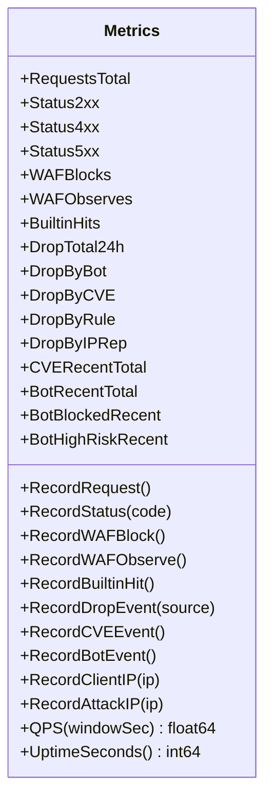

**图表来源**
- [监控与可观测性/性能指标收集.md:355-387](file://docs/监控与可观测性/性能指标收集.md#L355-L387)

**章节来源**
- [internal/dataplane/metrics.go:8-133](file://internal/dataplane/metrics.go#L8-L133)

### 自定义指标定义与注册机制
- 指标类型
  - 计数器（counter）：openwaf_requests_total、openwaf_blocks_total 等
  - 仪表（gauge）：openwaf_goroutines、openwaf_memory_alloc_bytes 等
- 注册机制
  - 在 PrometheusHandler 中动态生成 HELP/TYPE 注释与指标值
  - 每次 /metrics 请求读取运行时统计，确保指标时效性
- 标签管理
  - 当前实现未使用标签，通过指标名区分不同维度
  - 如需扩展，可在指标名中添加维度后缀或引入标签参数

**章节来源**
- [internal/observability/metrics.go:13-126](file://internal/observability/metrics.go#L13-L126)

### 日志聚合与事件追踪
- Redis 双写机制
  - 事件写入器同时写入数据库和 Redis 列表，支持实时消费
  - 使用 LPush/LTrim/Expire 实现有限长度的环形缓冲
- 统一写入协调器
  - UnifiedWriter 将多种事件类型合并到单一事务中，减少数据库锁竞争
  - 支持 Redis 优先写入，确保实时消费者获得最新数据
- 事件过滤与聚合
  - 提供按站点、IP、时间范围等条件的过滤查询
  - 支持 Top IP/Top 路径/Top 规则等聚合统计

**章节来源**
- [internal/observability/accesslog_writer.go:19-138](file://internal/observability/accesslog_writer.go#L19-L138)
- [internal/observability/botscore_writer.go:22-155](file://internal/observability/botscore_writer.go#L22-L155)
- [internal/observability/dropevent_writer.go:22-155](file://internal/observability/dropevent_writer.go#L22-L155)
- [internal/observability/unified_writer.go:21-232](file://internal/observability/unified_writer.go#L21-L232)
- [internal/store/repository/security_event.go:32-229](file://internal/store/repository/security_event.go#L32-L229)

### 前端可视化与交互
- 实时 QPS 图表
  - 使用 Recharts AreaChart 绘制面积图，支持渐变填充与动画效果
  - 自适应高度与工具提示，实时显示 QPS 数值
- 攻击热力图
  - 基于颜色强度映射攻击强度，突出高风险时段
  - 支持时间轴与数值双轴显示
- 仪表板布局
  - 响应式网格布局，支持多维度指标卡片
  - 支持标签页切换与手动刷新按钮

**章节来源**
- [frontend/app/(dashboard)/dashboard/page.tsx:55-254](file://frontend/app/(dashboard)/dashboard/page.tsx#L55-L254)
- [frontend/components/charts/realtime-qps-chart.tsx:24-81](file://frontend/components/charts/realtime-qps-chart.tsx#L24-L81)
- [frontend/components/charts/attack-heatmap.tsx:25-79](file://frontend/components/charts/attack-heatmap.tsx#L25-L79)