# 第三方集成

<cite>
**本文引用的文件**
- [cmd/main.go](file://cmd/main.go)
- [internal/app/server.go](file://internal/app/server.go)
- [internal/admin/router.go](file://internal/admin/router.go)
- [internal/admin/site/listener.go](file://internal/admin/site/listener.go)
- [internal/admin/rule/route.go](file://internal/admin/rule/route.go)
- [internal/core/engine/engine.go](file://internal/core/engine/engine.go)
- [internal/waf/ratelimit/ratelimit.go](file://internal/waf/ratelimit/ratelimit.go)
- [internal/dataplane/handler.go](file://internal/dataplane/handler.go)
- [internal/proxy/proxy.go](file://internal/proxy/proxy.go)
- [internal/upstream/transport.go](file://internal/upstream/transport.go)
- [internal/core/adminweb/static.go](file://internal/core/adminweb/static.go)
- [internal/observability/metrics.go](file://internal/observability/metrics.go)
- [internal/observability/eventwriter.go](file://internal/observability/eventwriter.go)
- [docs/扩展与插件/第三方集成/第三方集成.md](file://docs/扩展与插件/第三方集成/第三方集成.md)
- [docs/扩展与插件/第三方集成/服务集成.md](file://docs/扩展与插件/第三方集成/服务集成.md)
- [docs/扩展与插件/第三方集成/消息队列集成.md](file://docs/扩展与插件/第三方集成/消息队列集成.md)
- [docs/扩展与插件/第三方集成/监控系统集成.md](file://docs/扩展与插件/第三方集成/监控系统集成.md)
</cite>

## 目录
1. [简介](#简介)
2. [项目结构](#项目结构)
3. [核心组件](#核心组件)
4. [架构总览](#架构总览)
5. [详细组件分析](#详细组件分析)
6. [依赖分析](#依赖分析)
7. [性能考虑](#性能考虑)
8. [故障排查指南](#故障排查指南)
9. [结论](#结论)
10. [附录](#附录)

## 简介
本文件面向第三方集成场景，系统化梳理 My-OpenWaf 的外部服务集成架构与实现要点，覆盖以下主题：
- 控制面与数据面分离：控制面通过 Hertz 提供 REST API 与前端静态资源；数据面按站点维度热启监听器，统一接入代理与 WAF 引擎。
- 认证与授权：基于 JWT 的短期访问令牌与刷新令牌、会话管理与 API Key 双重鉴权，支持黑名单与密钥轮换。
- Redis 集成：分布式缓存（键值）、速率限制、配置同步（Pub/Sub）与共享状态。
- 监控体系：Prometheus 文本指标导出、数据面 QPS/状态码统计、异步安全事件写入与归档。
- 上游传输协议：HTTP/HTTPS 透明代理，支持 H2 连接复用、TLS 终止与 SNI 配置。
- 外部认证服务：当前实现为内置 JWT 与会话，未见 OAuth/LDAP 内置适配器，可作为扩展点进行二次开发。

## 项目结构
应用入口通过命令行启动，随后在运行时构建控制面与数据面服务，加载数据库与可选 Redis，初始化 WAF 引擎、指标与事件写入器，并根据快照动态增删站点级监听器。

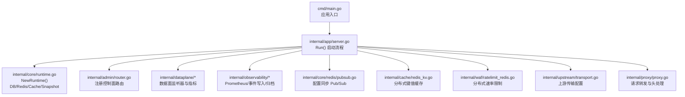

图示来源
- [cmd/main.go:1-10](file://cmd/main.go#L1-L10)
- [internal/app/server.go:35-305](file://internal/app/server.go#L35-L305)
- [internal/core/runtime.go:27-80](file://internal/core/runtime.go#L27-L80)

章节来源
- [cmd/main.go:1-10](file://cmd/main.go#L1-L10)
- [internal/app/server.go:35-305](file://internal/app/server.go#L35-L305)

## 核心组件
- 运行时与配置
  - 运行时负责打开数据库、可选 Redis、缓存层与快照持有者，提供统一上下文。
  - 配置从环境变量加载，支持数据库驱动、Redis 地址、管理员绑定地址、Bot/CVE/Drop 等策略参数。
- 控制面（Admin API）
  - 基于 Hertz 提供 REST API，含认证、RBAC 角色、站点/规则/策略/证书/IP 列表等管理端点。
  - 支持静态资源回退与 SPA 路由处理。
- 数据面（Data Plane）
  - 按站点维度热启监听器，支持 TLS 终止与 SNI 证书，统一接入代理与 WAF 引擎。
  - 提供数据面指标（QPS、状态码、WAF 命中、唯一 IP 等）。
- Redis 集成
  - 分布式键值缓存（RedisKV），用于响应缓存、限流元数据、IP 黑名单同步等。
  - 分布式速率限制（Redis Lua 滑动窗口）。
  - 配置同步（Pub/Sub）：节点间热重载与保护策略变更。
- 监控与可观测性
  - Prometheus 兼容指标导出（请求数、阻断数、缓存命中、上游错误、内存/GC 等）。
  - 异步安全事件写入与归档，避免阻塞数据面热路径。
- 上游传输
  - HTTP/HTTPS 透明代理，连接池复用、H2 启用、TLS 客户端配置与 SNI。
  - 出站头处理（X-Forwarded-*）以保留客户端信息与原始 Host。

章节来源
- [internal/core/runtime.go:17-80](file://internal/core/runtime.go#L17-L80)
- [internal/core/config.go:74-182](file://internal/core/config.go#L74-L182)
- [internal/admin/router.go:35-210](file://internal/admin/router.go#L35-L210)
- [internal/dataplane/metrics.go:9-136](file://internal/dataplane/metrics.go#L9-L136)
- [internal/cache/redis_kv.go:13-113](file://internal/cache/redis_kv.go#L13-L113)
- [internal/waf/ratelimit_redis.go:12-89](file://internal/waf/ratelimit_redis.go#L12-L89)
- [internal/core/redis/pubsub.go:13-77](file://internal/core/redis/pubsub.go#L13-L77)
- [internal/observability/metrics.go:13-126](file://internal/observability/metrics.go#L13-L126)
- [internal/observability/eventwriter.go:12-105](file://internal/observability/eventwriter.go#L12-L105)
- [internal/upstream/transport.go:12-29](file://internal/upstream/transport.go#L12-L29)
- [internal/proxy/proxy.go:73-136](file://internal/proxy/proxy.go#L73-L136)
- [internal/security/outbound.go:8-17](file://internal/security/outbound.go#L8-L17)

## 架构总览
下图展示控制面与数据面交互、Redis 协调、监控与上游传输的关键路径。

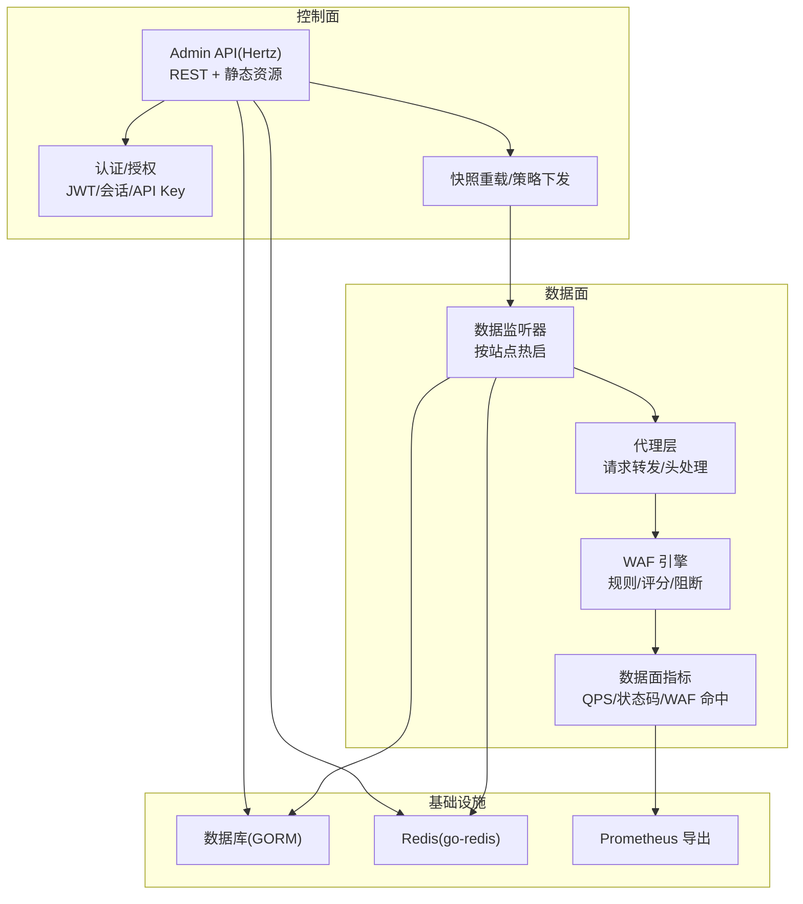

图示来源
- [internal/app/server.go:267-305](file://internal/app/server.go#L267-L305)
- [internal/admin/router.go:35-210](file://internal/admin/router.go#L35-L210)
- [internal/observability/metrics.go:51-126](file://internal/observability/metrics.go#L51-L126)
- [internal/dataplane/metrics.go:37-136](file://internal/dataplane/metrics.go#L37-L136)

## 详细组件分析

### 控制面与认证授权
- 路由与中间件
  - 控制面路由按角色分组（只读/操作员/管理员），使用鉴权中间件要求有效 JWT 或 API Key。
  - 提供登录、刷新、登出、会话强制注销等端点。
- JWT 与密钥管理
  - 短期访问令牌与长期刷新令牌，支持密钥轮换与黑名单持久化与内存缓存清理。
  - 令牌签发包含用户、角色、设备指纹与 IP 哈希，验证时优先主密钥，失败则回退次密钥。
- 会话与 API Key
  - 会话管理器与刷新令牌存储配合，支持暴力破解检测与强制登出。

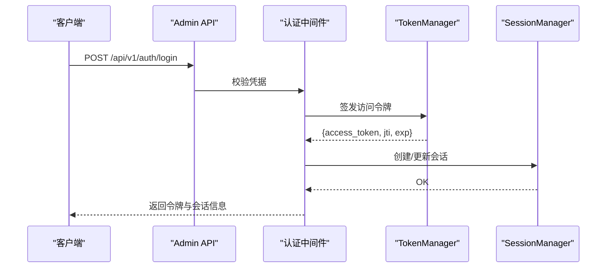

图示来源
- [internal/admin/router.go:55-81](file://internal/admin/router.go#L55-L81)
- [internal/admin/auth/jwt.go:84-135](file://internal/admin/auth/jwt.go#L84-L135)

章节来源
- [internal/admin/router.go:35-210](file://internal/admin/router.go#L35-L210)
- [internal/admin/auth/jwt.go:17-295](file://internal/admin/auth/jwt.go#L17-L295)

### Redis 集成与分布式协调
- 分布式键值缓存（RedisKV）
  - 提供 Set/Get/Delete/Incr/Exists 与 JSON 序列化封装，带超时上下文。
- 分布式速率限制（RedisRateLimiter）
  - 使用 Lua 脚本原子计数，滑动窗口实现，失败开策略（Redis 错误时放行）。
- 配置同步（Pub/Sub）
  - 发布“reload”事件通知其他节点；订阅循环在收到后触发本地重载与监听器重建。

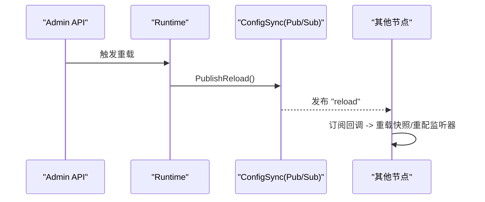

图示来源
- [internal/app/server.go:244-260](file://internal/app/server.go#L244-L260)
- [internal/core/redis/pubsub.go:33-68](file://internal/core/redis/pubsub.go#L33-L68)

章节来源
- [internal/cache/redis_kv.go:13-113](file://internal/cache/redis_kv.go#L13-L113)
- [internal/waf/ratelimit_redis.go:12-89](file://internal/waf/ratelimit_redis.go#L12-L89)
- [internal/core/redis/pubsub.go:13-77](file://internal/core/redis/pubsub.go#L13-L77)
- [internal/app/server.go:127-132](file://internal/app/server.go#L127-L132)

### 监控系统集成（Prometheus/日志/告警）
- Prometheus 指标导出
  - 提供 /metrics 文本格式输出，包含请求总量、阻断数、观察命中、缓存命中/未命中、上游错误、进程运行时长、goroutine 数、内存与 GC 等。
- 数据面指标
  - 实时统计 2xx/4xx/5xx、WAF 命中、近似 QPS（1s/5s 窗口）、唯一 IP 与攻击 IP 数。
- 异步事件写入与归档
  - 安全事件通过缓冲通道批量写入数据库，避免阻塞数据面；支持定时归档清理旧事件。

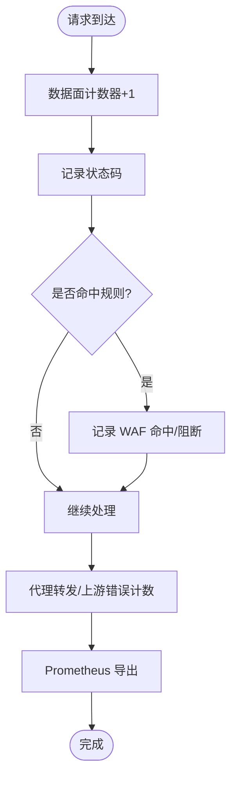

图示来源
- [internal/dataplane/metrics.go:41-104](file://internal/dataplane/metrics.go#L41-L104)
- [internal/observability/metrics.go:51-126](file://internal/observability/metrics.go#L51-L126)
- [internal/observability/eventwriter.go:57-105](file://internal/observability/eventwriter.go#L57-L105)

章节来源
- [internal/observability/metrics.go:13-126](file://internal/observability/metrics.go#L13-L126)
- [internal/dataplane/metrics.go:9-136](file://internal/dataplane/metrics.go#L9-L136)
- [internal/observability/eventwriter.go:12-105](file://internal/observability/eventwriter.go#L12-L105)

### 上游传输协议扩展（HTTP/HTTPS）
- 传输层配置
  - 基于站点运行时配置生成共享连接池，启用 HTTP/2，HTTPS 时设置 TLS 客户端配置（SNI、跳过校验、最小版本）。
- 请求转发
  - 复制入站请求头（过滤掉 hop-by-hop），设置出站 XFF/Host，发送至上游并回写响应头与状态码。

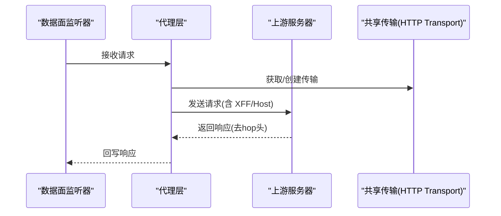

图示来源
- [internal/proxy/proxy.go:73-136](file://internal/proxy/proxy.go#L73-L136)
- [internal/upstream/transport.go:12-29](file://internal/upstream/transport.go#L12-L29)
- [internal/security/outbound.go:8-17](file://internal/security/outbound.go#L8-L17)

章节来源
- [internal/proxy/proxy.go:20-71](file://internal/proxy/proxy.go#L20-L71)
- [internal/upstream/transport.go:12-29](file://internal/upstream/transport.go#L12-L29)
- [internal/security/outbound.go:8-17](file://internal/security/outbound.go#L8-L17)

### 外部认证服务集成（OAuth/LDAP）
- 当前实现
  - 控制面采用内置 JWT 与会话管理，支持 API Key 与暴力破解防护。
- 扩展建议
  - 在认证中间件处引入外部 OIDC/OAuth2/LDAP 适配器，返回标准化用户声明与角色映射，再交由现有 TokenManager/SessionManager 管理生命周期。
  - 注意：仓库中未发现 OAuth/LDAP 的直接实现或依赖。

章节来源
- [internal/admin/auth/jwt.go:17-295](file://internal/admin/auth/jwt.go#L17-L295)
- [internal/admin/router.go:69-71](file://internal/admin/router.go#L69-L71)

### 集成开发工具与测试方法
- 集成测试
  - 使用 Admin API 对站点、规则、策略进行增删改查与重载，结合 Prometheus 指标与事件写入验证行为一致性。
  - 通过 RedisKV/RedisRateLimiter 编写跨节点一致性测试，验证 Pub/Sub 重载与限流效果。
- 性能评估
  - 利用数据面 QPS 指标与 Prometheus 指标评估吞吐与延迟；对比 H1/H2、TLS 开关对性能的影响。
- 故障诊断
  - 关注上游错误计数、阻断/观察命中趋势、事件写入缓冲溢出日志与 Redis 连接异常。

章节来源
- [internal/observability/metrics.go:51-126](file://internal/observability/metrics.go#L51-L126)
- [internal/dataplane/metrics.go:83-104](file://internal/dataplane/metrics.go#L83-L104)
- [internal/observability/eventwriter.go:42-49](file://internal/observability/eventwriter.go#L42-L49)
- [internal/core/redis/pubsub.go:33-43](file://internal/core/redis/pubsub.go#L33-L43)

## 依赖分析
- 组件耦合
  - 运行时（Runtime）集中注入 DB、Redis、缓存与快照，被控制面与数据面共享。
  - 控制面通过依赖结构体向路由注入仓储、重载函数、指标与认证组件。
  - 数据面通过选项对象注入引擎、指标、事件写入器与日志。
- 外部依赖
  - Redis 客户端、GORM、Hertz、JWT、Prometheus 导出等。

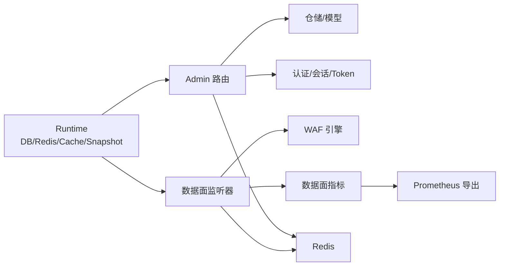

图示来源
- [internal/core/runtime.go:17-80](file://internal/core/runtime.go#L17-L80)
- [internal/admin/router.go:21-33](file://internal/admin/router.go#L21-L33)
- [internal/app/server.go:141-149](file://internal/app/server.go#L141-L149)

章节来源
- [internal/core/runtime.go:17-80](file://internal/core/runtime.go#L17-L80)
- [internal/admin/router.go:21-33](file://internal/admin/router.go#L21-L33)
- [internal/app/server.go:141-149](file://internal/app/server.go#L141-L149)

## 性能考虑
- 连接池与 HTTP/2
  - 通过共享传输与 H2 启用降低连接建立开销，提升上游并发能力。
- 事件写入批量化
  - 事件写入器采用缓冲与定时刷新，减少数据库写放大。
- 指标原子计数
  - 使用原子计数器与环形窗口计算 QPS，避免锁竞争。
- Redis 原子脚本
  - 限流使用 Lua 脚本保证滑窗计数原子性，失败开策略确保可用性。

章节来源
- [internal/proxy/proxy.go:32-71](file://internal/proxy/proxy.go#L32-L71)
- [internal/observability/eventwriter.go:27-39](file://internal/observability/eventwriter.go#L27-L39)
- [internal/dataplane/metrics.go:41-54](file://internal/dataplane/metrics.go#L41-L54)
- [internal/waf/ratelimit_redis.go:47-85](file://internal/waf/ratelimit_redis.go#L47-L85)

## 故障排查指南
- Redis 连接问题
  - 若 Redis 不可用，运行时会报错并退出；检查地址、密码与网络连通性。
- 重载失败
  - 控制面重载失败会记录错误；确认数据库迁移、快照构建与监听器重建流程。
- 事件写入溢出
  - 当事件缓冲满时会丢弃新事件并记录警告；增大缓冲或优化写入频率。
- 上游错误激增
  - 检查上游可达性、TLS 配置与 SNI 设置；关注数据面指标中的上游错误计数。

章节来源
- [internal/core/runtime.go:54-59](file://internal/core/runtime.go#L54-L59)
- [internal/app/server.go:220-242](file://internal/app/server.go#L220-L242)
- [internal/observability/eventwriter.go:42-49](file://internal/observability/eventwriter.go#L42-L49)
- [internal/observability/metrics.go:48-49](file://internal/observability/metrics.go#L48-L49)

## 结论
本系统通过清晰的控制面/数据面分层、完善的 Redis 分布式能力与可观测性设计，提供了可扩展的第三方集成基础。对于外部认证服务，可在现有认证中间件与 Token 管理框架上进行适配扩展；对于上游协议与监控，已具备良好的 HTTP/HTTPS 与 Prometheus 集成能力。建议在生产环境中结合 Redis 集群、数据库高可用与完善的告警策略，持续优化性能与可靠性。

## 附录
- 部署与运维建议
  - 将 Redis 与数据库置于高可用拓扑；启用 TLS 与最小版本约束；配置 Prometheus 抓取与告警规则。
  - 使用站点级监听器热启能力实现零停机变更；结合 Redis Pub/Sub 实现多节点一致重载。
- 配置项参考
  - 数据库驱动与 DSN、数据目录、Redis 地址/密码/DB、管理员绑定地址、Bot/CVE/Drop 等策略参数均可通过环境变量配置。

章节来源
- [internal/core/config.go:113-182](file://internal/core/config.go#L113-L182)
- [internal/app/server.go:286-305](file://internal/app/server.go#L286-L305)

## API 扩展与路由注册机制

### 管理端路由函数挂载新 API 路由
- 路由注册入口
  - 控制面路由通过依赖注入结构体向 Hertz 服务器注册，支持分组与中间件链。
  - 路由按角色分组（只读/操作员/管理员），使用鉴权中间件要求有效 JWT 或 API Key。
- 新增路由步骤
  - 在路由注册函数中添加新的路由组与处理器。
  - 为新路由添加必要的鉴权中间件与参数校验。
  - 在依赖结构体中注入所需的仓储、服务与配置。

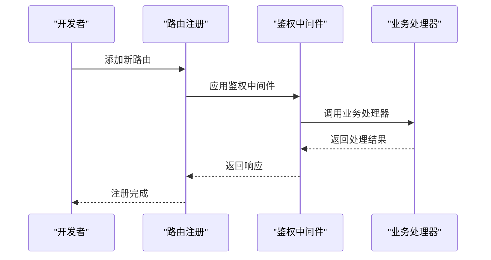

图示来源
- [internal/admin/router.go:46-244](file://internal/admin/router.go#L46-L244)

章节来源
- [internal/admin/router.go:46-244](file://internal/admin/router.go#L46-L244)

### 外部服务集成方法

#### 限流阈值与封禁策略对接到外部风控平台
- 速率限制接口
  - RateLimiterBackend 接口提供统一的限流能力抽象，支持本地与 Redis 后端。
  - 支持动态重新配置窗口大小、最大请求数与启用状态。
- 封禁策略集成
  - 通过 IP 信誉系统与阻断执行器实现 TCP RST 与 HTTP 403 封禁。
  - 支持分级动作升级（challenge → intercept → drop）。

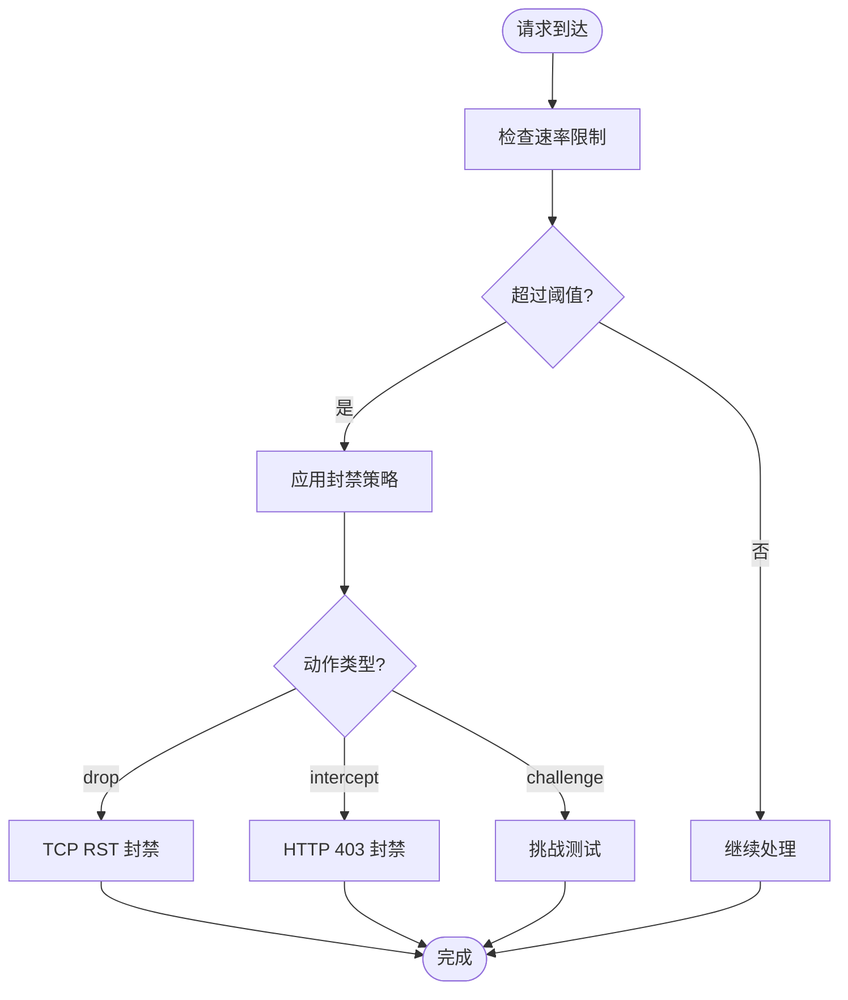

图示来源
- [internal/waf/ratelimit/ratelimit.go:10-127](file://internal/waf/ratelimit/ratelimit.go#L10-L127)
- [internal/core/engine/engine.go:38-60](file://internal/core/engine/engine.go#L38-L60)

章节来源
- [internal/waf/ratelimit/ratelimit.go:10-127](file://internal/waf/ratelimit/ratelimit.go#L10-L127)
- [internal/core/engine/engine.go:38-60](file://internal/core/engine/engine.go#L38-L60)

#### 协议适配的实现原理
- 数据监听器支持 TLS 终止与 SNI 证书配置
  - 监听器配置支持 TLS 启用与证书绑定，兼容传统单绑配置迁移。
  - 证书验证通过仓储层进行有效性校验。
- 上游传输协议支持
  - HTTP/HTTPS 透明代理，支持 H2 连接复用与 TLS 客户端配置。
  - SNI 配置通过传输层 TLS 客户端配置实现。

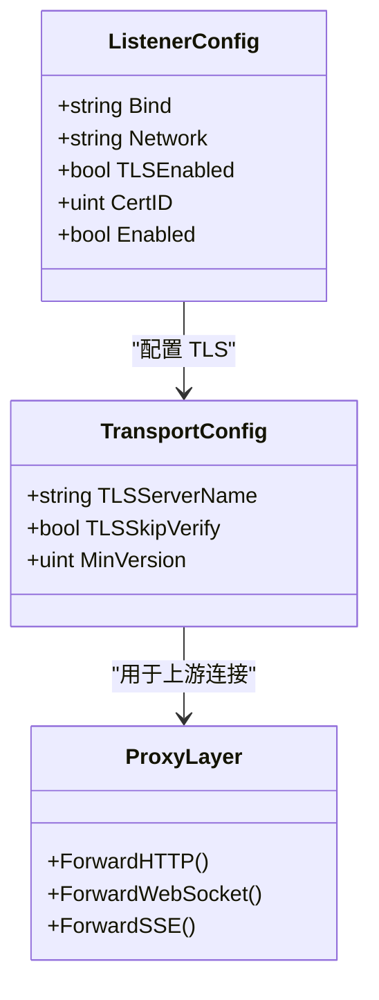

图示来源
- [internal/admin/site/listener.go:14-186](file://internal/admin/site/listener.go#L14-L186)
- [internal/proxy/proxy.go:35-83](file://internal/proxy/proxy.go#L35-L83)
- [internal/upstream/transport.go:12-29](file://internal/upstream/transport.go#L12-L29)

章节来源
- [internal/admin/site/listener.go:14-186](file://internal/admin/site/listener.go#L14-L186)
- [internal/proxy/proxy.go:35-83](file://internal/proxy/proxy.go#L35-L83)
- [internal/upstream/transport.go:12-29](file://internal/upstream/transport.go#L12-L29)

### 服务集成、消息队列集成、监控系统集成

#### 服务集成实现示例
- 安全事件归档服务
  - 归档器周期性扫描并删除早于保留期的数据，保留期内的事件不被删除。
  - 使用时间切片与批量删除，避免单次大事务带来的锁竞争。
- 出站连接管理
  - 通过共享传输缓存（按 TLS 配置键）复用 http.Transport，降低连接建立开销。
  - 默认最大空闲连接与每主机空闲连接数、空闲超时与强制启用 HTTP/2。
- 上游传输协议支持
  - HTTP/HTTPS 协议默认启用 HTTP/2，支持 ALPN 与 SNI；HTTPS 时可配置跳过校验与最小版本。
  - 通过在数据平面处理器中增加协议判断与对应转发逻辑，即可扩展至自定义协议。

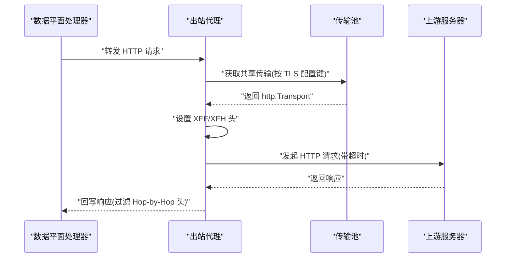

图示来源
- [internal/proxy/proxy.go:32-136](file://internal/proxy/proxy.go#L32-L136)
- [internal/security/outbound.go:8-17](file://internal/security/outbound.go#L8-L17)
- [internal/upstream/transport.go:12-29](file://internal/upstream/transport.go#L12-L29)

章节来源
- [internal/proxy/proxy.go:32-136](file://internal/proxy/proxy.go#L32-L136)
- [internal/security/outbound.go:8-17](file://internal/security/outbound.go#L8-L17)
- [internal/upstream/transport.go:12-29](file://internal/upstream/transport.go#L12-L29)

#### 消息队列集成实现示例
- Redis Pub/Sub 配置同步
  - 使用固定频道名进行配置重载广播。
  - 发布流程：在配置变更时以带超时的上下文发布"reload"。
  - 订阅流程：后台协程订阅频道，收到消息后执行重载逻辑并处理错误。
- 异步事件写入器
  - 将安全事件写入缓冲通道，按批次与定时器批量落库，避免阻塞数据面热路径。
  - 缓冲满时丢弃事件并记录告警，避免阻塞数据面。
- 归档清理器
  - 周期性删除超过保留期的安全事件，控制存储增长。
  - 默认30天保留期，可通过构造函数传入天数。

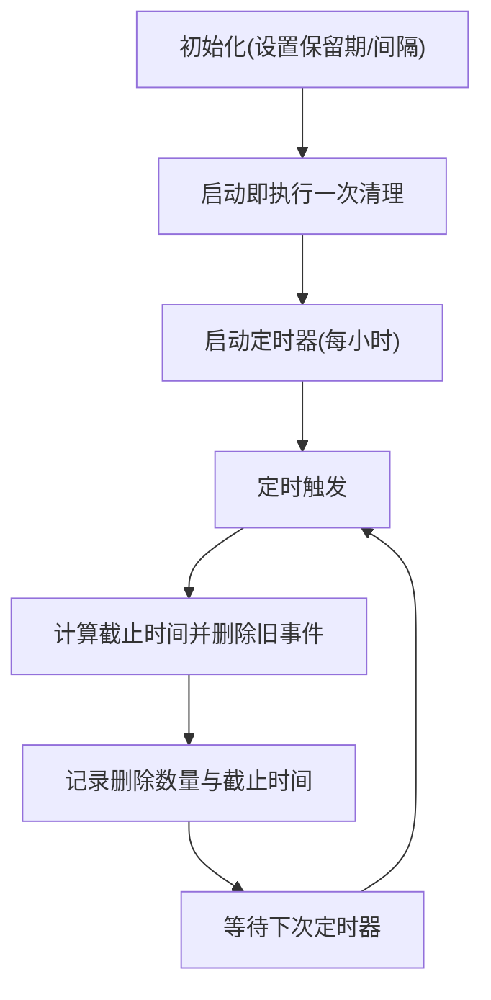

图示来源
- [internal/observability/archiver.go:21-72](file://internal/observability/archiver.go#L21-L72)
- [internal/store/repository/security_event.go:62-66](file://internal/store/repository/security_event.go#L62-L66)

章节来源
- [internal/observability/archiver.go:11-72](file://internal/observability/archiver.go#L11-L72)
- [internal/store/repository/security_event.go:62-66](file://internal/store/repository/security_event.go#L62-L66)

#### 监控系统集成实现示例
- Prometheus 指标导出机制
  - 指标定义：请求总量、阻断总量、观察总量、内置规则命中数、响应缓存命中/未命中、上游错误计数。
  - 数据采集策略：每次 /metrics 请求读取运行时内存统计与启动时间，动态计算运行时指标。
  - 路由注册：控制面服务器在启动时注册 /metrics 路由。
- 健康检查系统集成
  - 存活探针（/healthz）：返回进程"运行中"状态。
  - 就绪探针（/readyz）：依赖数据库连接可用性与快照加载状态。
  - 健康状态报告（/status）：返回运行时信息。
- 监控指标分类与采集
  - 安全事件统计：异步事件写入与定时归档，支持丢弃保护。
  - 性能指标：数据面指标与观测性指标双轨制。
  - 资源使用情况：进程运行时长、goroutine 数、内存分配字节等。

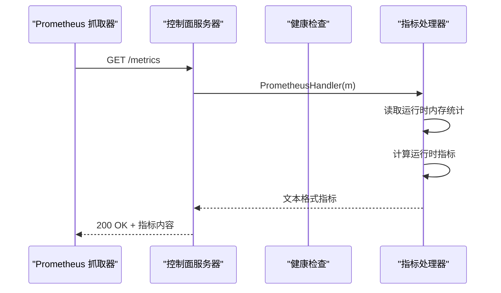

图示来源
- [internal/app/server.go:272](file://internal/app/server.go#L272)
- [internal/observability/metrics.go:51-125](file://internal/observability/metrics.go#L51-L125)

章节来源
- [internal/observability/metrics.go:13-125](file://internal/observability/metrics.go#L13-L125)
- [internal/app/server.go:272](file://internal/app/server.go#L272)

#### 最佳实践
- 配置管理
  - 使用环境变量管理数据库、Redis、管理员绑定地址等配置。
  - 通过系统设置接口动态调整防护阈值与功能开关，变更后触发热重载。
- 性能优化
  - 合理设置最大空闲连接与每主机空闲连接数，启用 HTTP/2 降低延迟。
  - 通过批量大小与刷新间隔平衡吞吐与延迟。
  - 使用原子计数器与环形窗口计算 QPS，减少锁竞争。
- 故障恢复
  - 订阅异常：捕获错误并记录，必要时重启订阅协程。
  - 写入失败：记录错误与批量大小，必要时降级为同步写入或启用死信队列。
- 安全考虑
  - 启用 TLS 与最小版本约束，配置 SNI 与证书验证。
  - 使用 Redis Pub/Sub 广播配置重载，确保节点间最终一致性。
  - 通过事件写入器的缓冲与批处理机制，避免阻塞数据面热路径。

章节来源
- [internal/core/config.go:113-182](file://internal/core/config.go#L113-L182)
- [internal/observability/eventwriter.go:27-39](file://internal/observability/eventwriter.go#L27-L39)
- [internal/dataplane/metrics.go:37-99](file://internal/dataplane/metrics.go#L37-L99)