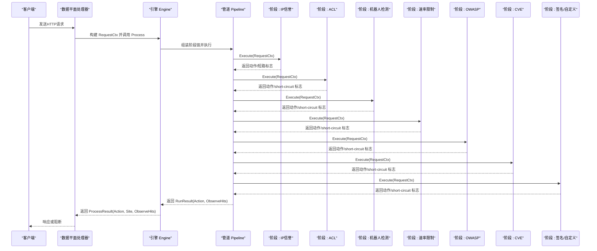
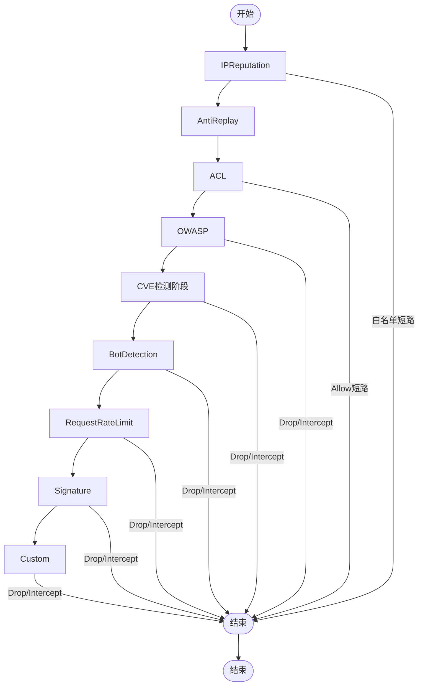
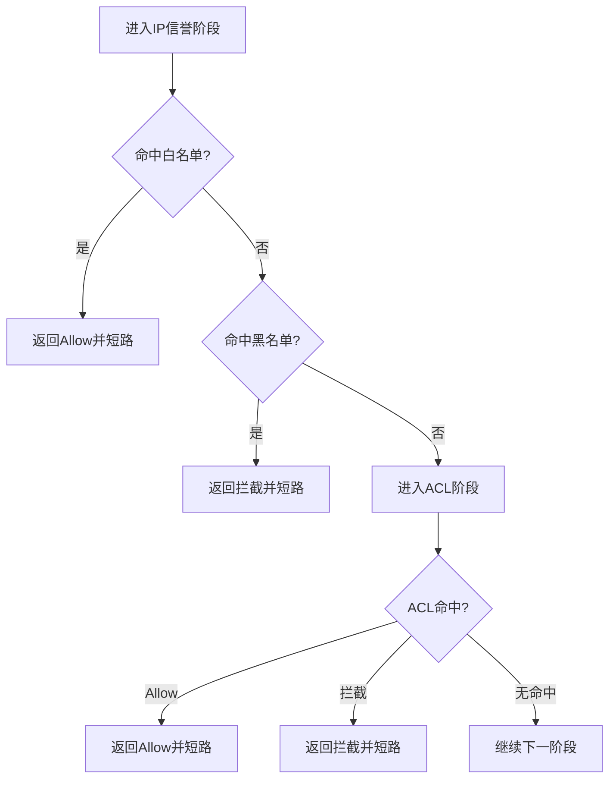
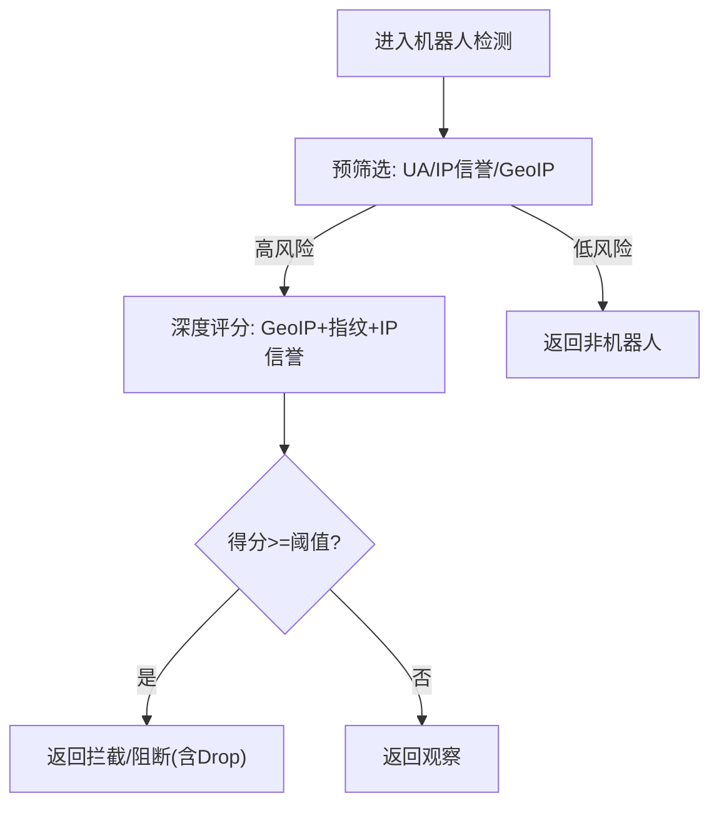
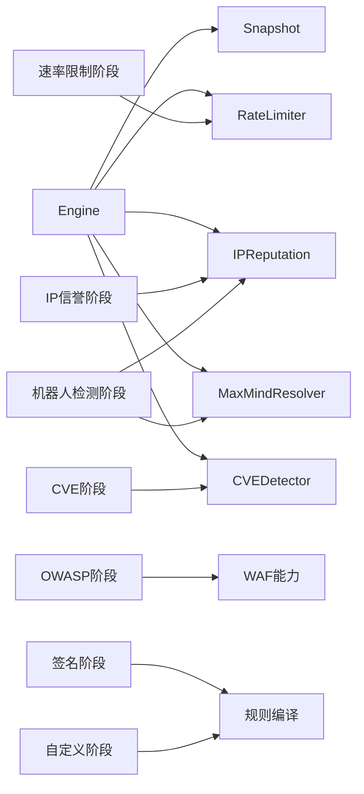

# 执行阶段系统

> [返回 扩展与插件系统](../扩展与插件系统.md)

<cite>

<cite>
**本文档引用的文件**
- [internal/core/pipeline/pipeline.go](file://internal/core/pipeline/pipeline.go)
- [internal/core/pipeline/pool.go](file://internal/core/pipeline/pool.go)
- [internal/core/rules/phases.go](file://internal/core/rules/phases.go)
- [internal/core/engine/engine.go](file://internal/core/engine/engine.go)
- [internal/core/action/action.go](file://internal/core/action/action.go)
- [internal/core/rules/compiler.go](file://internal/core/rules/compiler.go)
- [internal/waf/bot/bot.go](file://internal/waf/bot/bot.go)
- [internal/waf/ratelimit/ratelimit.go](file://internal/waf/ratelimit/ratelimit.go)
- [docs/扩展与插件系统/规则引擎扩展/执行阶段系统.md](file://docs/扩展与插件系统/规则引擎扩展/执行阶段系统.md)
- [docs/WAF 引擎系统/规则编译器.md](file://docs/WAF 引擎系统/规则编译器.md)
- [docs/WAF 引擎系统/处理阶段详解/ACL 访问控制阶段.md](file://docs/WAF 引擎系统/处理阶段详解/ACL 访问控制阶段.md)
- [docs/配置管理系统/配置管理系统.md](file://docs/配置管理系统/配置管理系统.md)
</cite>

## 目录
1. [简介](#简介)
2. [项目结构](#项目结构)
3. [核心组件](#核心组件)
4. [架构总览](#架构总览)
5. [详细组件分析](#详细组件分析)
6. [依赖分析](#依赖分析)
7. [性能考虑](#性能考虑)
8. [故障排查指南](#故障排查指南)
9. [结论](#结论)
10. [附录](#附录)

## 简介
本文件系统化阐述 My-OpenWaf 的“执行阶段系统”，围绕规则执行阶段的设计理念与实现细节展开，重点覆盖以下方面：
- 阶段划分：当前请求处理链按 IPReputation、AntiReplay、ACL、OWASP、CVE、BotDetection、RequestRateLimit、Signature、Custom 组织；缺少对应管理器或关闭配置时跳过相关阶段。
- 上下文传递：RequestCtx 在各阶段间的共享与复用，以及阶段间的状态管理策略。
- 配置与调度：阶段选择器（按站点/全局保护配置动态组装）、执行条件（启用开关、阈值）、优先级控制（Drop最高、Intercept次之、Observe日志）。
- 扩展开发：新增阶段类型、阶段间通信与错误处理的最佳实践。
- 性能监控与调试：执行时间统计、内存使用分析、瓶颈识别与可观测性集成。

## 项目结构
执行阶段系统主要由以下模块构成：
- 核心管道与上下文：pipeline 包定义 RequestCtx 和 Phase 接口，以及 Pipeline 的顺序执行逻辑。
- 规则阶段实现：rules 包中的具体阶段（ACL、签名、自定义、速率限制、IP信誉、机器人检测、OWASP、CVE）。
- 引擎编排：engine 包根据快照配置动态组装阶段链，并驱动 Pipeline 执行。
- WAF 能力：waf 包提供机器人检测、速率限制、指纹评分等能力。
- 应用入口与生命周期：app 包负责服务启动、监听器热重载、配置同步与生命周期管理。
- 可观测性：observability 包提供事件写入与指标导出；dataplane 提供数据面指标聚合。

```mermaid
graph TB
subgraph "应用层"
MAIN["cmd/main.go<br/>程序入口"]
APP["internal/app/server.go<br/>服务启动/监听器管理"]
end
subgraph "核心引擎"
ENGINE["internal/core/engine/engine.go<br/>引擎编排"]
PIPE["internal/core/pipeline/pipeline.go<br/>管道接口与执行"]
POOL["internal/core/pipeline/pool.go<br/>RequestCtx对象池"]
ACTION["internal/core/action/action.go<br/>动作类型与结果"]
END
subgraph "规则阶段"
PHASES["internal/core/rules/phases.go<br/>各阶段实现"]
BOT["internal/waf/bot/bot.go<br/>机器人检测"]
RL["internal/waf/ratelimit/ratelimit.go<br/>速率限制"]
end
subgraph "可观测性"
OM["internal/observability/metrics.go<br/>指标导出"]
OEW["internal/observability/eventwriter.go<br/>安全事件异步写入"]
DPM["internal/dataplane/metrics.go<br/>数据面指标"]
end
MAIN --> APP
APP --> ENGINE
ENGINE --> PIPE
PIPE --> PHASES
PHASES --> ACTION
PHASES --> BOT
PHASES --> RL
ENGINE --> OM
ENGINE --> OEW
ENGINE --> DPM
PIPE --> POOL
```

**图表来源**
- [docs/扩展与插件系统/规则引擎扩展/执行阶段系统.md:49-99](file://docs/扩展与插件系统/规则引擎扩展/执行阶段系统.md#L49-L99)

**章节来源**
- [docs/扩展与插件系统/规则引擎扩展/执行阶段系统.md:40-48](file://docs/扩展与插件系统/规则引擎扩展/执行阶段系统.md#L40-L48)

## 核心组件
- RequestCtx：承载一次请求的全部解码后数据（如客户端IP、方法、路径、查询串、头、主体、内容类型、解析后的查询参数），作为阶段间唯一上下文载体。
- Phase 接口：每个阶段实现统一的 Name() 与 Execute(ctx) 方法，返回动作结果与是否短路标志。
- Pipeline：按顺序执行各阶段，支持 Drop 最高优先级短路、Intercept 短路、以及收集 Observe 命中用于日志。
- Action：定义 Allow/Intercept/Observe/Drop 等动作类型，提供 IsTerminal/IsDrop/ShouldLog 等判定方法。
- 阶段实现：包含 ACL、签名、自定义、速率限制、IP信誉、机器人检测、OWASP、CVE 等。
- 引擎 Engine：依据快照配置动态组装阶段链，调用 Pipeline 执行并返回最终动作与观察命中列表。
- 对象池：pipeline/pool.go 使用 sync.Pool 复用 RequestCtx，降低 GC 压力。

**章节来源**
- [internal/core/pipeline/pipeline.go:9-71](file://internal/core/pipeline/pipeline.go#L9-L71)
- [internal/core/action/action.go:29-61](file://internal/core/action/action.go#L29-L61)
- [internal/core/rules/phases.go:32-358](file://internal/core/rules/phases.go#L32-L358)
- [internal/core/engine/engine.go:57-129](file://internal/core/engine/engine.go#L57-L129)
- [internal/core/pipeline/pool.go:5-37](file://internal/core/pipeline/pool.go#L5-L37)

## 架构总览
执行阶段系统采用“阶段链”模式，引擎根据站点与全局保护配置动态构建阶段序列，Pipeline 依次执行并遵循严格的优先级短路策略。阶段间通过 RequestCtx 共享数据，同时通过动作结果携带阶段信息与分类，便于审计与可视化。



**图表来源**
- [docs/扩展与插件系统/规则引擎扩展/执行阶段系统.md:125-158](file://docs/扩展与插件系统/规则引擎扩展/执行阶段系统.md#L125-L158)

## 详细组件分析

### 阶段接口与执行顺序
- 阶段接口：Phase 定义 Name() 与 Execute(ctx) 两个方法，返回 (action.Result, bool)，其中 bool 表示是否短路。
- 执行顺序：引擎严格按以下顺序组装并执行阶段链（以快照配置为准）：
  1) IPReputation（白名单可直接短路）
  2) AntiReplay
  3) ACL（允许规则可跳过 ACL 之后的后续阶段）
  4) OWASP 默认规则
  5) CVE 检测
  6) BotDetection
  7) RequestRateLimit
  8) Signature
  9) Custom
- 优先级短路：Drop 最高优先级（立即 TCP 关闭，不发送响应）；Intercept 次之（立即阻断）；Observe 仅记录日志，不阻断。



**图表来源**
- [docs/扩展与插件系统/规则引擎扩展/执行阶段系统.md:180-199](file://docs/扩展与插件系统/规则引擎扩展/执行阶段系统.md#L180-L199)

**章节来源**
- [docs/扩展与插件系统/规则引擎扩展/执行阶段系统.md:167-179](file://docs/扩展与插件系统/规则引擎扩展/执行阶段系统.md#L167-L179)

### 预过滤：IP信誉与ACL
- IP信誉阶段：若命中白名单，直接短路并返回 Allow；若命中黑名单，直接短路并拦截。
- ACL阶段：匹配客户端IP（支持CIDR）决定 Allow/Intercept/Observe；Allow 将跳过后续所有阶段（含 OWASP、签名、自定义）。



**图表来源**
- [docs/WAF 引擎系统/处理阶段详解/ACL 访问控制阶段.md:171-187](file://docs/WAF 引擎系统/处理阶段详解/ACL 访问控制阶段.md#L171-L187)

**章节来源**
- [docs/WAF 引擎系统/处理阶段详解/ACL 访问控制阶段.md:160-195](file://docs/WAF 引擎系统/处理阶段详解/ACL 访问控制阶段.md#L160-L195)

### 请求处理：机器人检测（两阶段）
- 预筛选（PreScreen）：基于 UA、IP信誉、GeoIP 快速判断是否为高风险，避免深度评分开销。
- 深度评分（DeepScore）：结合 GeoIP、指纹（UA/HTTP头/加密指纹）与 IP信誉综合打分，输出 BotScore 与 BotVerdict。
- 阈值控制：可通过配置调整阈值，超过阈值按严重程度返回 Drop 或 Intercept，否则返回 Observe。



**图表来源**
- [internal/waf/bot/bot.go:175-194](file://internal/waf/bot/bot.go#L175-L194)

**章节来源**
- [internal/waf/bot/bot.go:175-200](file://internal/waf/bot/bot.go#L175-L200)

### 请求处理：速率限制
- 键值策略：以“客户端IP + Host”为键，固定窗口计数，超限则返回配置的动作（通常为拦截）。
- 动态开关：可按站点/全局保护配置启用或禁用，支持运行时重配。

**章节来源**
- [internal/core/rules/phases.go:157-198](file://internal/core/rules/phases.go#L157-L198)
- [internal/waf/ratelimit/ratelimit.go:9-127](file://internal/waf/ratelimit/ratelimit.go#L9-L127)

### 请求处理：OWASP 与 CVE
- OWASP：解析请求体（表单/JSON/Multipart/文本），提取扫描目标，按敏感度与动作返回拦截或观察。
- CVE：构建请求特征，调用 CVE 检测器，按严重级别自动提升到 Drop（Critical/High）。

**章节来源**
- [internal/core/rules/phases.go:374-470](file://internal/core/rules/phases.go#L374-L470)
- [internal/core/rules/phases.go:472-552](file://internal/core/rules/phases.go#L472-L552)

### 响应处理：签名与自定义
- 签名/自定义阶段：对匹配的内置/复合规则返回对应动作，支持短路与日志收集。

**章节来源**
- [internal/core/rules/phases.go:105-155](file://internal/core/rules/phases.go#L105-L155)

### 上下文传递与状态管理
- RequestCtx：作为阶段间唯一上下文，包含请求标识、绑定地址、客户端IP、方法、路径、原始查询串、主机、头、主体、内容类型、解析后的查询参数等。
- 对象池：通过 sync.Pool 复用 RequestCtx，减少分配与GC压力；ReleaseCtx 在归还前清理字段。
- 观察命中：Pipeline 收集所有 ShouldLog 的命中（含 Drop/Intercept/Observe），用于审计与可视化。

**章节来源**
- [internal/core/pipeline/pipeline.go:9-35](file://internal/core/pipeline/pipeline.go#L9-L35)
- [internal/core/pipeline/pool.go:5-37](file://internal/core/pipeline/pool.go#L5-L37)
- [internal/core/action/action.go:53-57](file://internal/core/action/action.go#L53-L57)

### 阶段配置与调度机制
- 配置来源：快照（Snapshot）持有站点与全局保护设置，引擎据此动态组装阶段链。
- 调度策略：
  - 条件启用：各阶段受保护配置控制（如机器人检测、速率限制、OWASP、CVE）。
  - 优先级：Drop/Intercept 立即短路；ACL Allow 跳过 ACL 之后的后续阶段。
  - 顺序：IPReputation → AntiReplay → ACL → OWASP → CVE → BotDetection → RequestRateLimit → Signature → Custom。
- 执行条件：阶段内部根据自身能力（如速率限制器开关、GeoIP可用性、规则集合）决定是否执行。

**章节来源**
- [internal/core/engine/engine.go:139-198](file://internal/core/engine/engine.go#L139-L198)
- [docs/扩展与插件系统/规则引擎扩展/执行阶段系统.md:293-299](file://docs/扩展与插件系统/规则引擎扩展/执行阶段系统.md#L293-L299)

### 阶段扩展开发指南
- 新增阶段类型：
  - 实现 Phase 接口（Name/Execute），在 Execute 中读取 RequestCtx 并返回 action.Result 与短路标志。
  - 在引擎组装处将新阶段加入 Pipeline（参考 engine.Process 的阶段拼接逻辑）。
- 阶段间通信：
  - 通过 RequestCtx 共享数据；如需跨阶段状态，可在阶段内维护外部状态（如速率限制器、IP信誉库）。
- 错误处理：
  - 阶段内部捕获异常并返回 Pass 或显式动作；确保不会因异常导致请求挂起。
  - 对于可选能力（如 GeoIP），应在阶段入口进行可用性检查，不可用时返回 Pass。

**章节来源**
- [docs/扩展与插件系统/规则引擎扩展/执行阶段系统.md:305-314](file://docs/扩展与插件系统/规则引擎扩展/执行阶段系统.md#L305-L314)

## 依赖分析
- 组件耦合：
  - Engine 依赖 Snapshot、RateLimiter、IPReputation、GeoResolver、CVEDetector 等外部能力。
  - 各阶段实现依赖 waf 能力（机器人检测、速率限制、指纹评分等）。
  - Pipeline 与 Action 解耦，仅依赖接口契约。
- 外部依赖：
  - Hertz 服务器、Redis（配置同步）、数据库（存储与迁移）。
- 循环依赖：
  - 未发现循环导入；各包职责清晰，接口边界明确。



**图表来源**
- [docs/扩展与插件系统/规则引擎扩展/执行阶段系统.md:329-344](file://docs/扩展与插件系统/规则引擎扩展/执行阶段系统.md#L329-L344)

**章节来源**
- [docs/扩展与插件系统/规则引擎扩展/执行阶段系统.md:319-328](file://docs/扩展与插件系统/规则引擎扩展/执行阶段系统.md#L319-L328)

## 性能考虑
- 对象池：RequestCtx 使用 sync.Pool 复用，显著降低 GC 压力，建议在高频路径保持复用。
- 短路策略：Drop/Intercept 立即短路，避免无效计算；ACL Allow 跳过 ACL 之后的后续阶段，减少规则匹配成本。
- 正则与扫描：Body 解析与正则扫描存在复杂度风险，已通过采样大小限制与字段数量上限控制（例如 JSON/表单解析的深度与数量限制）。
- 速率限制：固定窗口计数，配合后台清理 goroutine 清理过期窗口，避免内存无限增长。
- 指纹评分：两阶段设计（预筛选→深度评分）在保证准确率的同时降低深度评分的触发频率。

**章节来源**
- [internal/core/pipeline/pool.go:5-37](file://internal/core/pipeline/pool.go#L5-L37)
- [internal/core/pipeline/pipeline.go:74-78](file://internal/core/pipeline/pipeline.go#L74-L78)
- [internal/core/rules/phases.go:586-667](file://internal/core/rules/phases.go#L586-L667)
- [internal/waf/ratelimit/ratelimit.go:108-126](file://internal/waf/ratelimit/ratelimit.go#L108-L126)
- [internal/waf/bot/bot.go:175-194](file://internal/waf/bot/bot.go#L175-L194)

## 故障排查指南
- 指标与日志：
  - Prometheus 指标：RequestsTotal、BlocksTotal、ObservesTotal、BuiltinHits、CacheHits/Misses、UpstreamErrors、Uptime、Goroutines、MemoryAlloc/Sys、GC Pause。
  - 安全事件：EventWriter 异步批量写入，缓冲满时会丢弃并告警。
- 数据面指标：汇总 QPS、状态码分布、WAF 命中、唯一IP与攻击IP等。
- 常见问题定位：
  - 高 Drop/Intercept：检查 ACL 白名单/黑名单、机器人检测阈值、OWASP/CVE 规则。
  - 高 Observe：确认日志策略与阈值设置，关注指纹评分与 GeoIP 风险标记。
  - 内存上升：检查 RequestCtx 泄漏（未释放）、EventWriter 缓冲积压、GC Pause 增长。
  - 性能瓶颈：CPU 高占用多出现在指纹评分与正则扫描，建议优化规则复杂度与采样范围。

**章节来源**
- [docs/扩展与插件系统/规则引擎扩展/执行阶段系统.md:370-380](file://docs/扩展与插件系统/规则引擎扩展/执行阶段系统.md#L370-L380)

## 结论
执行阶段系统通过清晰的阶段划分、严格的优先级短路与可插拔的阶段实现，实现了高性能、可观测且易于扩展的 WAF 处理流水线。借助对象池、两阶段机器人检测、固定窗口速率限制与完善的指标体系，系统在保障安全性的前提下兼顾了吞吐与稳定性。建议在生产环境中持续监控关键指标，结合规则与阈值调优，以获得最佳的防护效果与性能表现。

## 附录
- 快速参考：阶段顺序与短路优先级
  - 顺序：IPReputation → AntiReplay → ACL → OWASP → CVE → BotDetection → RequestRateLimit → Signature → Custom
  - 优先级：Drop > Intercept > Observe > Allow（Allow 仅短路 ACL 之后的后续阶段）
