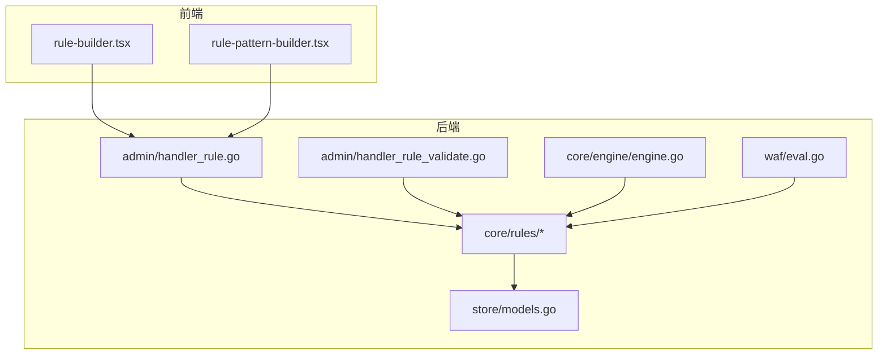
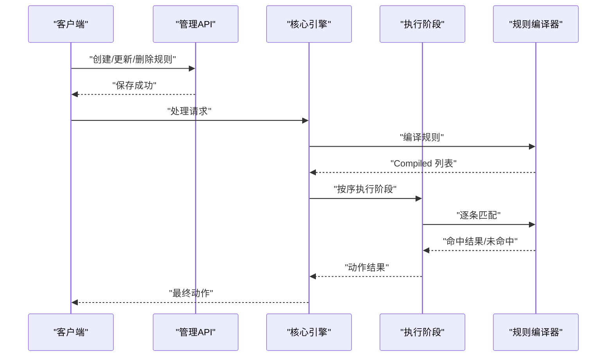
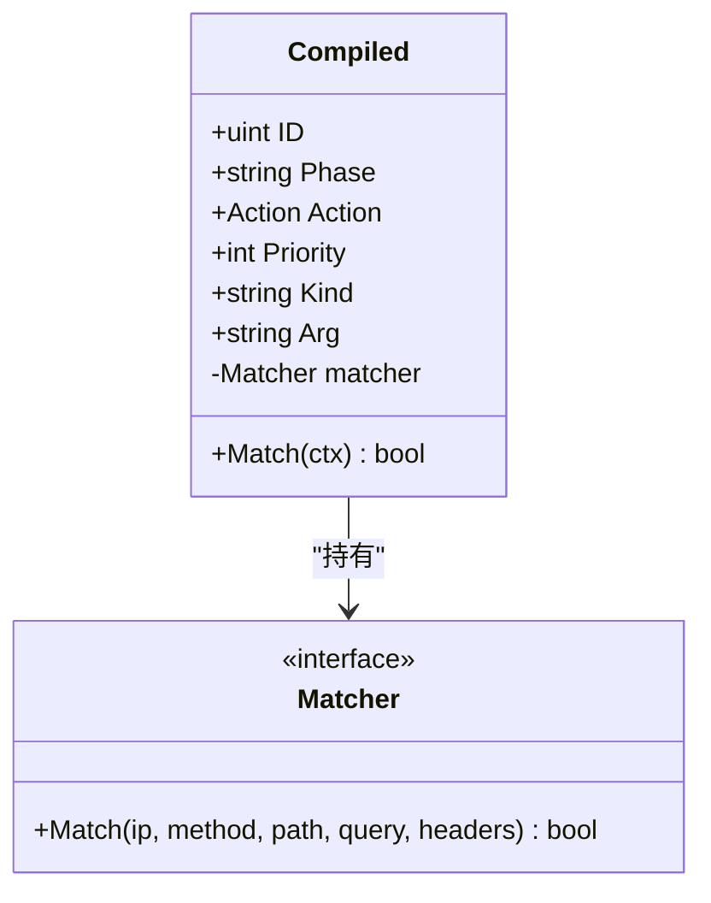
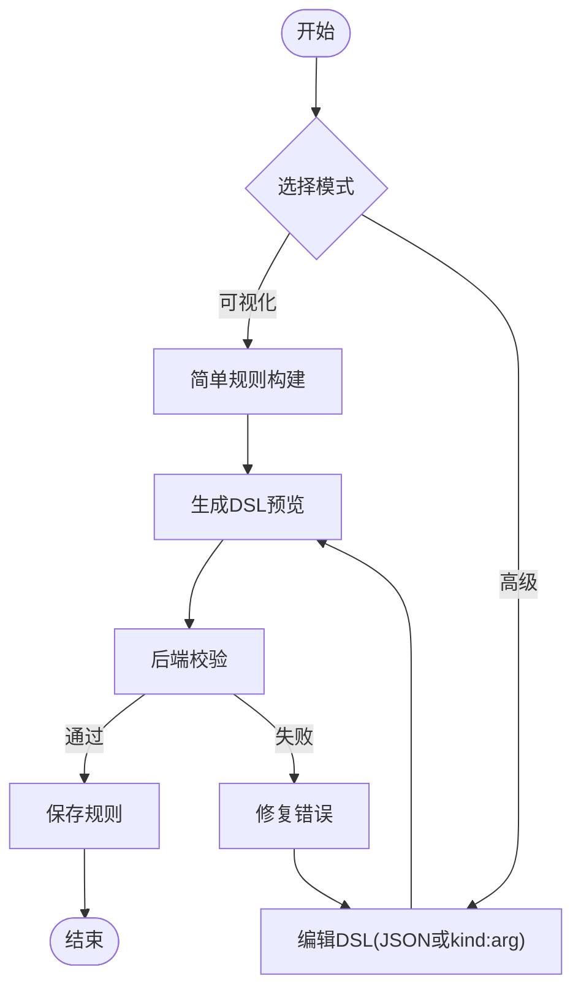
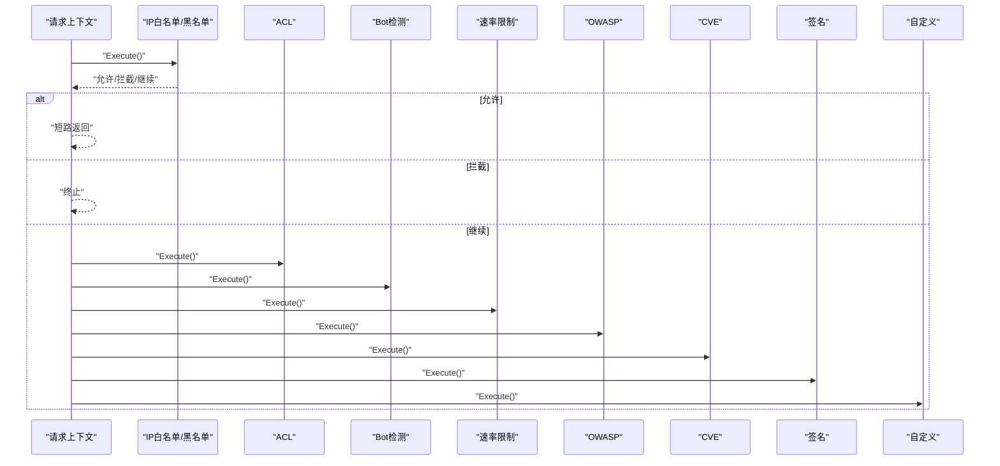
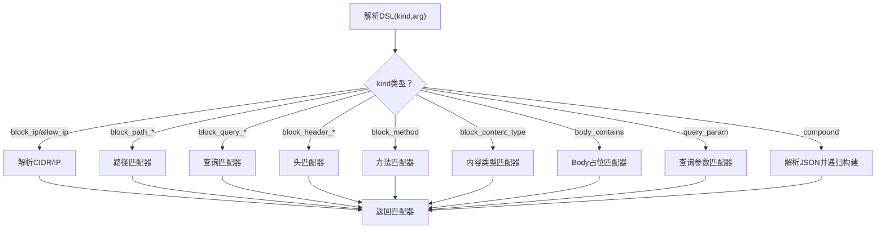
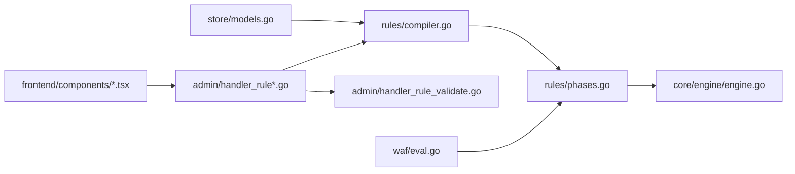

# 规则引擎扩展

> [返回 扩展与插件系统](../扩展与插件系统.md)

<cite>

<cite>
**本文档引用的文件**
- [internal/core/rules/compiler.go](file://internal/core/rules/compiler.go)
- [internal/core/rules/matcher.go](file://internal/core/rules/matcher.go)
- [internal/core/rules/phases.go](file://internal/core/rules/phases.go)
- [internal/core/action/action.go](file://internal/core/action/action.go)
- [internal/core/engine/engine.go](file://internal/core/engine/engine.go)
- [internal/core/pipeline/pipeline.go](file://internal/core/pipeline/pipeline.go)
- [internal/core/pipeline/pool.go](file://internal/core/pipeline/pool.go)
- [internal/store/models.go](file://internal/store/models.go)
- [frontend/components/rule-builder.tsx](file://frontend/components/rule-builder.tsx)
- [frontend/components/rule-pattern-builder.tsx](file://frontend/components/rule-pattern-builder.tsx)
- [internal/admin/handler_rule.go](file://internal/admin/handler_rule.go)
- [internal/admin/handler_rule_validate.go](file://internal/admin/handler_rule_validate.go)
- [internal/waf/eval.go](file://internal/waf/eval.go)
- [internal/waf/drop.go](file://internal/waf/drop.go)
- [internal/waf/block.go](file://internal/waf/block.go)
- [internal/waf/bot.go](file://internal/waf/bot.go)
- [internal/waf/ratelimit.go](file://internal/waf/ratelimit.go)
- [internal/observability/metrics.go](file://internal/observability/metrics.go)
- [internal/observability/eventwriter.go](file://internal/observability/eventwriter.go)
- [internal/dataplane/metrics.go](file://internal/dataplane/metrics.go)
- [cmd/main.go](file://cmd/main.go)
</cite>

## 目录
1. [简介](#简介)
2. [项目结构](#项目结构)
3. [核心组件](#核心组件)
4. [架构总览](#架构总览)
5. [详细组件分析](#详细组件分析)
6. [依赖关系分析](#依赖关系分析)
7. [性能考虑](#性能考虑)
8. [故障排查指南](#故障排查指南)
9. [结论](#结论)
10. [附录](#附录)

## 简介
本文件面向规则引擎扩展系统，系统性阐述规则编译器架构、DSL 语法扩展、规则匹配器接口设计与执行阶段机制，并提供自定义规则开发指南、开发工具与测试方法。目标是帮助开发者快速理解从规则 DSL 解析、编译到运行时匹配的全链路流程，安全高效地扩展规则能力。

## 项目结构
规则引擎扩展位于 Go 后端的 internal/core/rules 子模块，配合前端可视化构建器、管理 API 与核心引擎协同工作。核心目录与职责概览：
- internal/core/rules：规则编译、匹配器与执行阶段
- internal/admin：规则管理 API（增删改查、规则测试、模板）
- internal/core/engine：请求处理流水线组装与调度
- internal/store：规则模型与阶段/动作枚举
- frontend/components：规则 DSL 可视化构建器与模板
- internal/waf：评估入口与通用检测辅助（OWASP、CVE、Bot 等）

**图表来源**
- [internal/admin/handler_rule.go:115-156](file://internal/admin/handler_rule.go#L115-L156)
- [internal/admin/handler_rule_validate.go:32-98](file://internal/admin/handler_rule_validate.go#L32-L98)
- [internal/core/engine/engine.go:56-128](file://internal/core/engine/engine.go#L56-L128)
- [internal/core/rules/compiler.go:27-55](file://internal/core/rules/compiler.go#L27-L55)
- [internal/store/models.go:44-91](file://internal/store/models.go#L44-L91)
- [internal/waf/eval.go:12-20](file://internal/waf/eval.go#L12-L20)

**章节来源**
- [internal/core/rules/compiler.go:11-55](file://internal/core/rules/compiler.go#L11-L55)
- [internal/core/rules/matcher.go:11-261](file://internal/core/rules/matcher.go#L11-L261)
- [internal/core/rules/phases.go:19-555](file://internal/core/rules/phases.go#L19-L555)
- [internal/admin/handler_rule.go:16-197](file://internal/admin/handler_rule.go#L16-L197)
- [internal/admin/handler_rule_validate.go:13-201](file://internal/admin/handler_rule_validate.go#L13-L201)
- [internal/core/engine/engine.go:15-169](file://internal/core/engine/engine.go#L15-L169)
- [internal/store/models.go:44-91](file://internal/store/models.go#L44-L91)
- [frontend/components/rule-builder.tsx:16-556](file://frontend/components/rule-builder.tsx#L16-L556)
- [frontend/components/rule-pattern-builder.tsx:11-288](file://frontend/components/rule-pattern-builder.tsx#L11-L288)
- [internal/waf/eval.go:12-154](file://internal/waf/eval.go#L12-L154)

## 核心组件
- 规则编译器：将持久化的 Rule 模型转换为运行时可直接匹配的 Compiled 结构，内置排序与优先级控制。
- 匹配器体系：统一 Matcher 接口，覆盖 IP/CIDR、路径前缀/精确/正则、查询参数、请求头、HTTP 方法、内容类型、用户代理、Body 等多种条件。
- 执行阶段：按阶段顺序执行，包括 IPReputation、AntiReplay、ACL、OWASP、CVE、BotDetection、RequestRateLimit、Signature 与 Custom；缺少对应管理器或关闭配置时跳过相关阶段。
- 规则 DSL：支持简单规则与复合 JSON 条件；前端提供可视化构建器与模板。
- 管理 API：规则 CRUD、规则测试、模板获取、规则校验。

**章节来源**
- [internal/core/rules/compiler.go:11-55](file://internal/core/rules/compiler.go#L11-L55)
- [internal/core/rules/matcher.go:11-261](file://internal/core/rules/matcher.go#L11-L261)
- [internal/core/rules/phases.go:32-555](file://internal/core/rules/phases.go#L32-L555)
- [internal/admin/handler_rule.go:104-156](file://internal/admin/handler_rule.go#L104-L156)
- [internal/admin/handler_rule_validate.go:13-98](file://internal/admin/handler_rule_validate.go#L13-L98)

## 架构总览
规则引擎以"编译-执行"为主线：启动时将规则模型编译为已构建的匹配器集合，运行时按阶段顺序遍历匹配，遇到允许/终止动作即短路返回。

**图表来源**
- [internal/core/engine/engine.go:56-128](file://internal/core/engine/engine.go#L56-L128)
- [internal/core/rules/compiler.go:27-55](file://internal/core/rules/compiler.go#L27-L55)
- [internal/core/rules/phases.go:32-120](file://internal/core/rules/phases.go#L32-L120)

## 详细组件分析

### 规则编译器架构
- 编译输出：Compiled 结构体包含 ID、阶段 Phase、动作 Action、优先级 Priority、种类 Kind、参数 Arg 以及预构建的 Matcher。
- 编译流程：遍历 Rule 列表，过滤禁用项，解析 DSL 获取 kind/arg，构建对应 Matcher 并排序（优先级升序，ID 升序）。
- DSL 解析：支持简单规则（kind:arg）与复合 JSON（{"op":"and|or|not","children":[...]}）两种形式。

**图表来源**
- [internal/core/rules/compiler.go:11-25](file://internal/core/rules/compiler.go#L11-L25)
- [internal/core/rules/matcher.go:11-14](file://internal/core/rules/matcher.go#L11-L14)

**章节来源**
- [internal/core/rules/compiler.go:27-55](file://internal/core/rules/compiler.go#L27-L55)
- [internal/core/rules/compiler.go:57-82](file://internal/core/rules/compiler.go#L57-L82)

### 规则匹配器接口设计
- 统一接口：Match(ip, method, path, query, headers) bool。
- 内置匹配器：
  - IP/CIDR：支持单 IP 与网段，非法参数返回永不匹配。
  - 路径：前缀匹配、精确匹配、正则匹配。
  - 查询：包含匹配、正则匹配。
  - 请求头：包含匹配、正则匹配（大小写不敏感）。
  - HTTP 方法：大小写不敏感匹配。
  - 内容类型：匹配 Content-Type 字段子串。
  - 用户代理：便捷匹配 User-Agent。
  - Body：占位匹配（实际在请求上下文中处理）。
  - 复合条件：AND/OR/NOT，支持递归嵌套。
- 正则缓存：全局正则编译缓存，避免重复编译开销。

```mermaid
classDiagram
class Matcher {
<<interface>>
+Match(ip, method, path, query, headers) bool
}
class ipCIDRMatcher
class pathPrefixMatcher
class pathRegexMatcher
class exactPathMatcher
class queryContainsMatcher
class queryRegexMatcher
class headerContainsMatcher
class headerRegexMatcher
class methodMatcher
class contentTypeMatcher
class bodyContainsMatcher
class queryParamMatcher
class alwaysMatcher
class neverMatcher
class andMatcher
class orMatcher
class notMatcher
Matcher <|.. ipCIDRMatcher
Matcher <|.. pathPrefixMatcher
Matcher <|.. pathRegexMatcher
Matcher <|.. exactPathMatcher
Matcher <|.. queryContainsMatcher
Matcher <|.. queryRegexMatcher
Matcher <|.. headerContainsMatcher
Matcher <|.. headerRegexMatcher
Matcher <|.. methodMatcher
Matcher <|.. contentTypeMatcher
Matcher <|.. bodyContainsMatcher
Matcher <|.. queryParamMatcher
Matcher <|.. andMatcher
Matcher <|.. orMatcher
Matcher <|.. notMatcher
Matcher <|.. alwaysMatcher
Matcher <|.. neverMatcher
```

**图表来源**
- [internal/core/rules/matcher.go:11-261](file://internal/core/rules/matcher.go#L11-L261)

**章节来源**
- [internal/core/rules/matcher.go:167-261](file://internal/core/rules/matcher.go#L167-L261)
- [internal/core/rules/matcher.go:271-296](file://internal/core/rules/matcher.go#L271-L296)

### 规则 DSL 语法扩展
- 简单规则：kind:arg，如 "block_ip:192.168.1.0/24"。
- 复合规则：JSON 格式，{"op":"and|or|not","children":[{...},{...}]}}，支持递归嵌套。
- 前端构建器：
  - 可视化模式：下拉选择匹配类型与参数。
  - 高级模式：直接编辑 DSL，支持简单与复合两种格式。
  - 模板：提供常用规则模板，便于快速生成。

**图表来源**
- [frontend/components/rule-builder.tsx:59-112](file://frontend/components/rule-builder.tsx#L59-L112)
- [frontend/components/rule-pattern-builder.tsx:54-107](file://frontend/components/rule-pattern-builder.tsx#L54-L107)
- [internal/admin/handler_rule_validate.go:32-98](file://internal/admin/handler_rule_validate.go#L32-L98)

**章节来源**
- [frontend/components/rule-builder.tsx:16-556](file://frontend/components/rule-builder.tsx#L16-L556)
- [frontend/components/rule-pattern-builder.tsx:11-288](file://frontend/components/rule-pattern-builder.tsx#L11-L288)
- [internal/admin/handler_rule_validate.go:100-201](file://internal/admin/handler_rule_validate.go#L100-L201)

### 规则执行阶段机制
- 阶段顺序：IPReputation → AntiReplay → ACL → OWASP → CVE → BotDetection → RequestRateLimit → Signature → Custom。
- 每个阶段封装为 pipeline.Phase，包含名称与 Execute(ctx) 返回动作与是否终止标志。
- ACL 阶段命中 Allow 动作会短路跳过后续阶段；其他阶段命中终止动作也会立即返回。

**图表来源**
- [internal/core/engine/engine.go:84-120](file://internal/core/engine/engine.go#L84-L120)
- [internal/core/rules/phases.go:32-120](file://internal/core/rules/phases.go#L32-L120)

**章节来源**
- [internal/core/engine/engine.go:56-128](file://internal/core/engine/engine.go#L56-L128)
- [internal/core/rules/phases.go:32-120](file://internal/core/rules/phases.go#L32-L120)

### 规则匹配器接口设计详解
- 客户端 IP：支持 block_ip/allow_ip，支持 CIDR 与单 IP，非法参数永不匹配。
- HTTP 方法：block_method，大小写不敏感。
- 路径：block_path（前缀）、block_path_exact（精确）、block_path_regex（正则）。
- 查询参数：block_query_contains、block_query_regex；query_param 支持键存在与值包含。
- 请求头：block_header（包含）、block_header_regex（正则）、block_user_agent/_regex（User-Agent 快捷）。
- 内容类型：block_content_type。
- Body：body_contains（占位，实际在请求上下文中处理）。
- 复合条件：and/or/not，支持递归嵌套。

**图表来源**
- [internal/core/rules/matcher.go:167-261](file://internal/core/rules/matcher.go#L167-L261)
- [internal/core/rules/compiler.go:57-82](file://internal/core/rules/compiler.go#L57-L82)

**章节来源**
- [internal/core/rules/matcher.go:167-261](file://internal/core/rules/matcher.go#L167-L261)
- [internal/core/rules/compiler.go:57-82](file://internal/core/rules/compiler.go#L57-L82)

### 规则开发指南
- 规则模式定义：使用 kind:arg 或复合 JSON；确保参数格式正确（如 CIDR、正则表达式）。
- 匹配器实现：优先复用内置匹配器；若需新增，实现 Matcher 接口并在 buildMatcher 中注册。
- 优先级控制：通过 Priority 控制编译后排序；ACL 允许动作具有短路效果。
- 动作与阶段：根据业务需求选择阶段（acl/signature/custom/owasp/cve），动作可为 allow/intercept/observe。

**章节来源**
- [internal/core/rules/compiler.go:48-55](file://internal/core/rules/compiler.go#L48-L55)
- [internal/store/models.go:44-76](file://internal/store/models.go#L44-L76)

### 规则开发工具与测试方法
- 规则验证：后端提供 /api/v1/rules/validate 接口，校验 DSL 格式与复合规则结构。
- 规则测试：后端提供 /api/v1/rules/test 接口，支持对合成请求进行干跑测试。
- 前端构建器：提供可视化与高级模式，支持模板导入导出与实时预览。
- 性能测试：集成 blazehttp 测试集，统计误报与漏报，辅助优化规则与阈值。
- 调试技巧：利用 MatchCtx 字段（ClientIP、Method、Path、Query、Headers）构造最小化测试用例；对正则规则启用缓存以减少编译开销。

**章节来源**
- [internal/admin/handler_rule_validate.go:32-98](file://internal/admin/handler_rule_validate.go#L32-L98)
- [internal/admin/handler_rule.go:113-156](file://internal/admin/handler_rule.go#L113-L156)
- [frontend/components/rule-builder.tsx:208-294](file://frontend/components/rule-builder.tsx#L208-L294)
- [internal/waf/blazetest_test.go:18-156](file://internal/waf/blazetest_test.go#L18-L156)

## 依赖关系分析
- 规则编译器依赖存储层的 Rule 模型与动作类型。
- 执行阶段依赖规则编译器输出的 Compiled 列表。
- 核心引擎负责组装阶段顺序并驱动流水线。
- 管理 API 提供规则生命周期与测试能力。
- 前端构建器与模板提升规则编写效率与一致性。

**图表来源**
- [internal/store/models.go:44-91](file://internal/store/models.go#L44-L91)
- [internal/core/rules/compiler.go:27-55](file://internal/core/rules/compiler.go#L27-L55)
- [internal/core/rules/phases.go:32-120](file://internal/core/rules/phases.go#L32-L120)
- [internal/core/engine/engine.go:84-120](file://internal/core/engine/engine.go#L84-L120)
- [internal/admin/handler_rule.go:16-197](file://internal/admin/handler_rule.go#L16-L197)
- [internal/admin/handler_rule_validate.go:32-98](file://internal/admin/handler_rule_validate.go#L32-L98)
- [frontend/components/rule-builder.tsx:16-556](file://frontend/components/rule-builder.tsx#L16-L556)
- [internal/waf/eval.go:12-20](file://internal/waf/eval.go#L12-L20)

**章节来源**
- [internal/store/models.go:44-91](file://internal/store/models.go#L44-L91)
- [internal/core/rules/compiler.go:27-55](file://internal/core/rules/compiler.go#L27-L55)
- [internal/core/rules/phases.go:32-120](file://internal/core/rules/phases.go#L32-L120)
- [internal/core/engine/engine.go:84-120](file://internal/core/engine/engine.go#L84-L120)
- [internal/admin/handler_rule.go:16-197](file://internal/admin/handler_rule.go#L16-L197)
- [internal/admin/handler_rule_validate.go:32-98](file://internal/admin/handler_rule_validate.go#L32-L98)
- [frontend/components/rule-builder.tsx:16-556](file://frontend/components/rule-builder.tsx#L16-L556)
- [internal/waf/eval.go:12-20](file://internal/waf/eval.go#L12-L20)

## 性能考虑
- 正则缓存：全局缓存已编译正则，避免重复编译开销。
- 匹配短路：ACL 允许动作短路，减少后续阶段开销。
- 优先级排序：编译期按优先级与 ID 排序，运行时按序匹配，命中即止。
- 内容扫描边界：对 Body 与 JSON 的扫描设置深度与长度上限，防止正则风暴。
- 速率限制与 IP 黑名单：前置检查可显著降低后续阶段压力。

**章节来源**
- [internal/core/rules/matcher.go:271-296](file://internal/core/rules/matcher.go#L271-L296)
- [internal/core/rules/phases.go:40-52](file://internal/core/rules/phases.go#L40-L52)
- [internal/core/rules/phases.go:346-391](file://internal/core/rules/phases.go#L346-L391)

## 故障排查指南
- 规则无法匹配：
  - 检查 DSL 格式与参数合法性（CIDR、正则）。
  - 使用 /api/v1/rules/validate 校验规则结构。
  - 使用 /api/v1/rules/test 对合成请求进行干跑测试。
- 复合规则异常：
  - 确认 JSON 结构包含 op 与 children，op 仅限 and/or/not。
  - 逐步简化 children，定位具体子条件问题。
- 性能问题：
  - 检查正则复杂度与数量，避免回溯灾难。
  - 适当放宽 Body 扫描范围或关闭不必要的扫描。
- 前端构建器：
  - 切换高级模式查看生成的原始 DSL，核对参数与逻辑。

**章节来源**
- [internal/admin/handler_rule_validate.go:32-98](file://internal/admin/handler_rule_validate.go#L32-L98)
- [internal/admin/handler_rule.go:113-156](file://internal/admin/handler_rule.go#L113-L156)
- [frontend/components/rule-builder.tsx:208-294](file://frontend/components/rule-builder.tsx#L208-L294)

## 结论
该规则引擎扩展系统以清晰的编译-执行架构为核心，结合丰富的匹配器与灵活的 DSL，提供了高可扩展性与易用性的规则体系。通过前端可视化构建器、完善的管理 API 与性能优化策略，开发者可以高效地设计、验证与部署规则，满足多样化的防护需求。

## 附录
- 常用规则模板可在 /api/v1/rules/templates 获取，便于快速上手。
- 评估入口函数 Evaluate/EvaluateWithBot 支持对已解析站点的规则链进行独立评估，便于离线测试与调试。

**章节来源**
- [internal/admin/handler_rule_validate.go:100-201](file://internal/admin/handler_rule_validate.go#L100-L201)
- [internal/waf/eval.go:12-80](file://internal/waf/eval.go#L12-L80)

### 规则编译器扩展指南
- 注册新规则类型：
  - 在 ParsePattern 中添加新的前缀或识别逻辑，返回新的 kind 与 arg
  - 在 buildMatcher 中为新 kind 实现匹配器构造逻辑
  - 如需复合条件支持，在 parseCompoundJSON/buildCompound 中处理新 kind
- 匹配器实现：
  - 实现 Matcher 接口的 Match 方法，按需读取上下文字段
  - 如涉及正则，请使用 cachedCompile 缓存编译结果
  - 注意边界情况（如空输入、非法格式）并返回永不匹配的匹配器
- 前端支持：
  - 在前端 RULE_KINDS 中添加新规则类型元数据（标签、占位符、分组）
  - 更新解析与构建逻辑，确保 DSL 生成与解析一致
- 验证与测试：
  - 使用后端 ValidateRule API 验证规则格式
  - 编写单元测试覆盖关键场景（匹配/不匹配、边界值、异常输入）

**章节来源**
- [internal/core/rules/compiler.go:57-82](file://internal/core/rules/compiler.go#L57-L82)
- [internal/core/rules/matcher.go:167-261](file://internal/core/rules/matcher.go#L167-L261)
- [internal/core/rules/matcher.go:271-296](file://internal/core/rules/matcher.go#L271-L296)
- [frontend/components/rule-builder.tsx:16-34](file://frontend/components/rule-builder.tsx#L16-L34)
- [internal/admin/handler_rule_validate.go:32-98](file://internal/admin/handler_rule_validate.go#L32-L98)

### 匹配器开发指南
- 实现 Matcher 接口：定义 Match 方法，按需读取 MatchCtx 字段
- 注册到 buildMatcher：在 switch 中新增分支，返回新匹配器实例
- 参数解析：如需复杂参数，可在 buildMatcher 中进行校验与转换
- 编写测试：参考现有测试用例，覆盖边界与错误场景
- 性能考量：避免昂贵操作，必要时引入缓存或索引

**章节来源**
- [internal/core/rules/matcher.go:11-141](file://internal/core/rules/matcher.go#L11-L141)
- [internal/core/rules/matcher.go:166-261](file://internal/core/rules/matcher.go#L166-L261)

### 动作集成扩展指南
- 动作接口与阶段
  - 实现 Phase 接口（Name/Execute），在 Execute 中对 RequestCtx 进行匹配并返回 action.Result。
  - 将新阶段通过 Engine 注入 Pipeline，参与统一短路与日志收集。
- 参数校验
  - 对 DSL 或 JSON 形式的复合条件进行解析与校验，确保 kind/arg 合法。
  - 前端规则构建器提供 DSL 预览与简单校验，后端接口提供规则测试能力。
- 执行逻辑
  - 匹配成功后构造动作结果，设置类型、阶段、描述、分类等。
  - 若为终端动作（拦截/丢弃），Pipeline 将短路后续阶段。

**章节来源**
- [internal/admin/handler_rule.go:104-156](file://internal/admin/handler_rule.go#L104-L156)
- [internal/core/rules/phases.go:544-568](file://internal/core/rules/phases.go#L544-L568)

### 执行阶段系统扩展指南
- 新增阶段类型：
  - 实现 Phase 接口（Name/Execute），在 Execute 中读取 RequestCtx 并返回 action.Result 与短路标志。
  - 在引擎组装处将新阶段加入 Pipeline（参考 engine.Process 的阶段拼接逻辑）。
- 阶段间通信：
  - 通过 RequestCtx 共享数据；如需跨阶段状态，可在阶段内维护外部状态（如速率限制器、IP信誉库）。
- 错误处理：
  - 阶段内部捕获异常并返回 Pass 或显式动作；确保不会因异常导致请求挂起。
  - 对于可选能力（如 GeoIP），应在阶段入口进行可用性检查，不可用时返回 Pass。

**章节来源**
- [internal/core/pipeline/pipeline.go:25-29](file://internal/core/pipeline/pipeline.go#L25-L29)
- [internal/core/engine/engine.go:85-120](file://internal/core/engine/engine.go#L85-L120)
