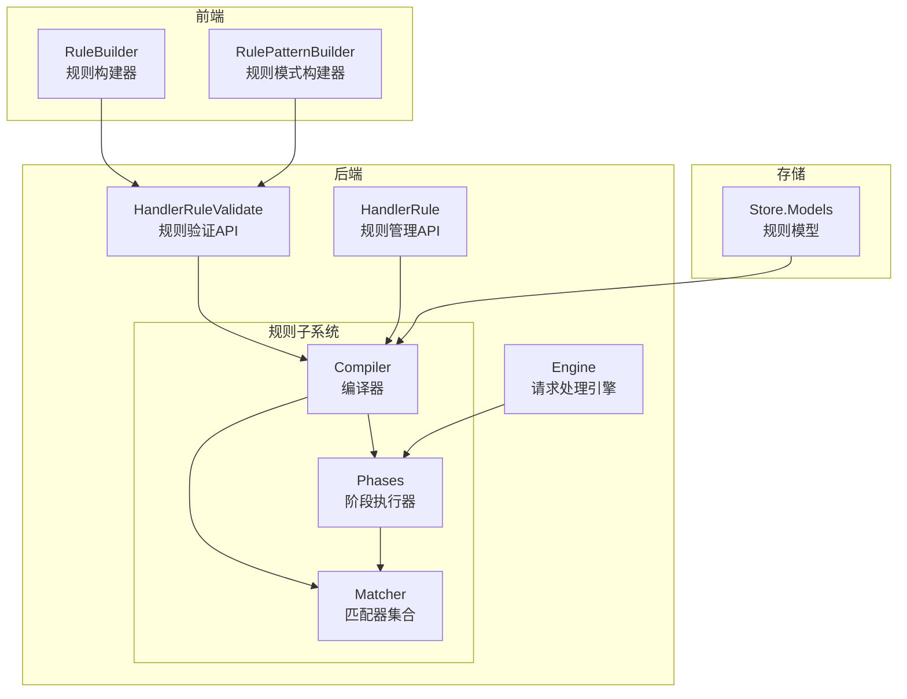
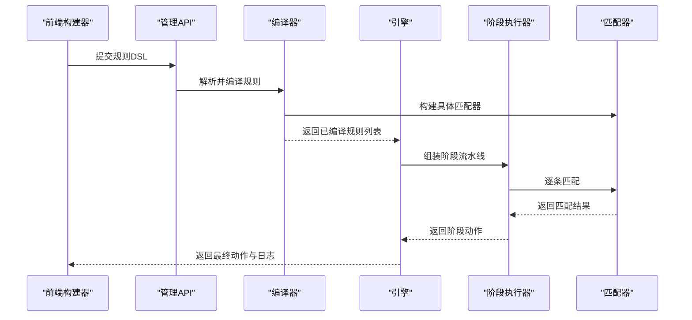
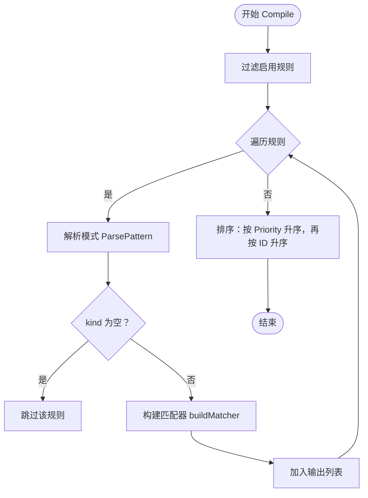
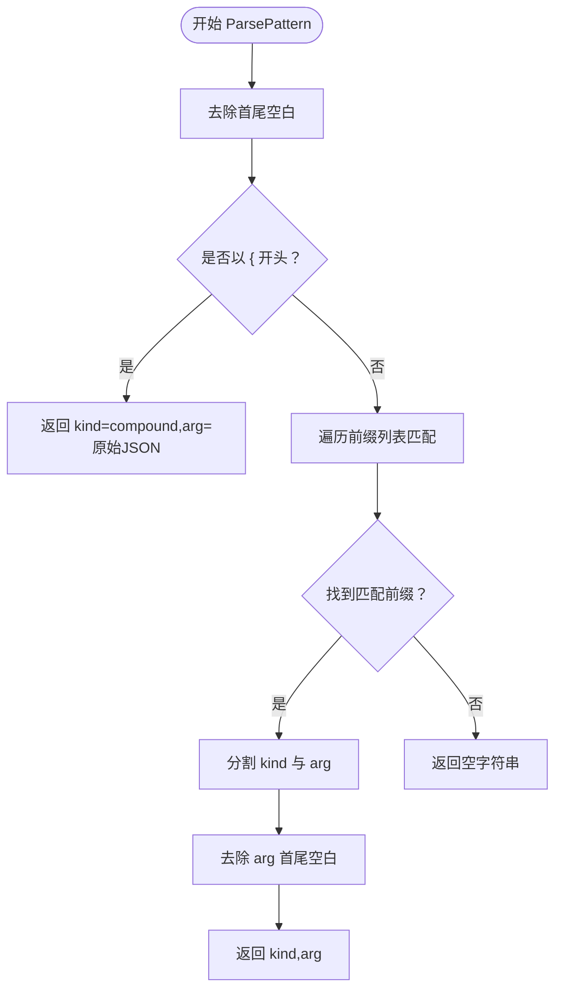
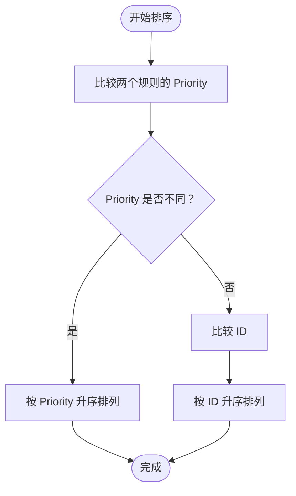
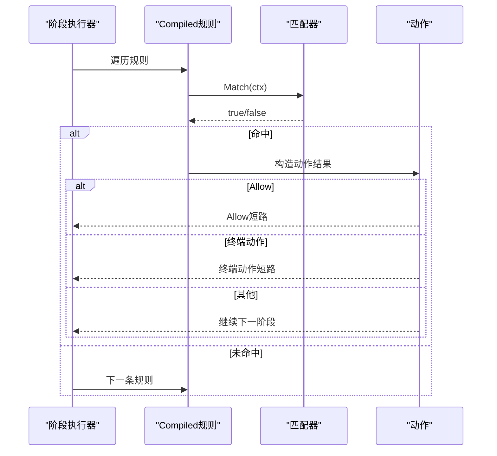
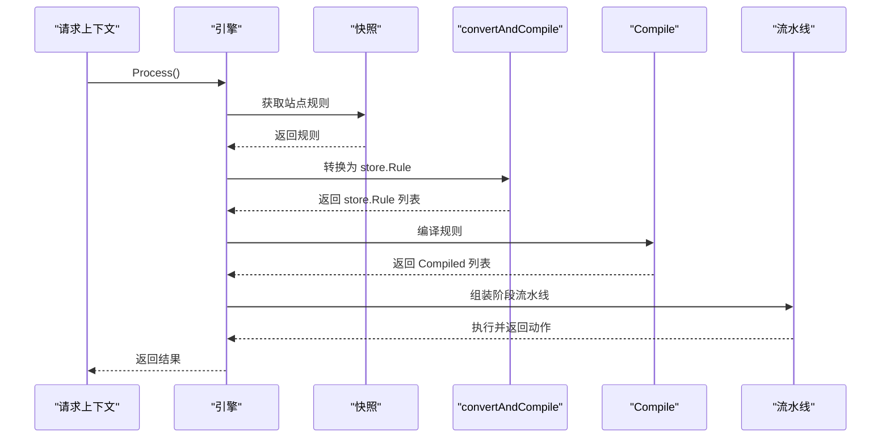
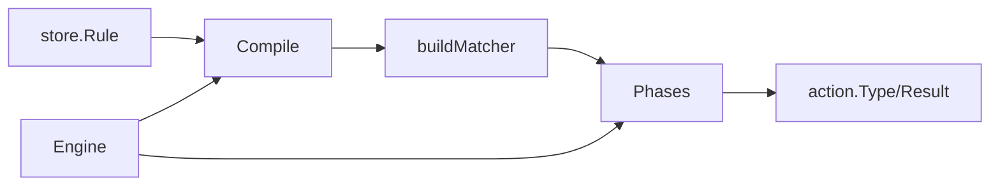
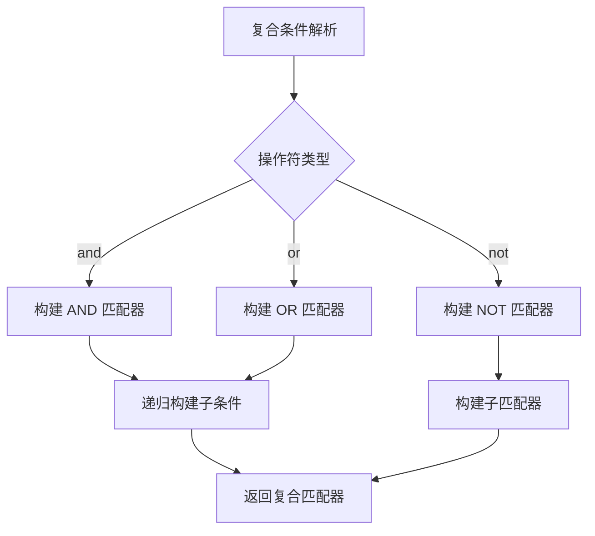

# 规则编译器扩展

> [返回 扩展与插件系统](../扩展与插件系统.md)

<cite>

<cite>
**本文引用的文件列表**
- [compiler.go](file://internal/core/rules/compiler.go)
- [matcher.go](file://internal/core/rules/matcher.go)
- [phases.go](file://internal/core/rules/phases.go)
- [compile.go](file://internal/appresource/compile.go)
- [match.go](file://internal/appresource/match.go)
- [rule.go](file://internal/store/repository/rule.go)
- [engine.go](file://internal/core/engine/engine.go)
- [handler_rule.go](file://internal/admin/rule/rule.go)
- [build.go](file://internal/snapshot/build.go)
- [snapshot.go](file://internal/snapshot/snapshot.go)
- [action.go](file://internal/core/action/action.go)
- [pipeline.go](file://internal/core/pipeline/pipeline.go)
- [compiler_test.go](file://internal/core/rules/compiler_test.go)
- [matcher_test.go](file://internal/core/rules/matcher_test.go)
- [rule-builder.tsx](file://frontend/components/rule-builder.tsx)
- [rule-pattern-builder.tsx](file://frontend/components/rule-pattern-builder.tsx)
- [handler_rule_validate.go](file://internal/admin/handler_rule_validate.go)
- [models.go](file://internal/store/models.go)
</cite>

## 目录
1. [简介](#简介)
2. [项目结构](#项目结构)
3. [核心组件](#核心组件)
4. [架构总览](#架构总览)
5. [详细组件分析](#详细组件分析)
6. [依赖关系分析](#依赖关系分析)
7. [性能考虑](#性能考虑)
8. [故障排除指南](#故障排除指南)
9. [结论](#结论)
10. [附录：扩展与自定义开发指南](#附录扩展与自定义开发指南)

## 简介
本文件系统性阐述规则编译器的设计与实现，覆盖从规则 DSL 解析、抽象语法树（AST）风格的"条件组合"、到运行时可直接匹配的 Compiled 结构体；并说明从持久化 Rule 到运行时 Compiled 的转换流程、规则排序与优先级处理、以及编译期与运行期的性能优化策略。同时提供错误处理与调试方法，并给出扩展点与自定义规则开发指南，帮助开发者在不破坏现有架构的前提下扩展规则类型与匹配器。

## 项目结构
规则编译器位于后端 Go 模块的 internal/core/rules 目录下，配合前端可视化构建器与管理端 API 共同构成完整的规则生命周期：从用户在前端界面构建规则，到后端解析与编译，再到引擎在请求处理过程中按阶段执行。



**图表来源**
- [rule-builder.tsx:1-200](file://frontend/components/rule-builder.tsx#L1-L200)
- [rule-pattern-builder.tsx:1-200](file://frontend/components/rule-pattern-builder.tsx#L1-L200)
- [handler_rule.go:140-192](file://internal/admin/rule/rule.go#L140-L192)
- [engine.go:1-176](file://internal/core/engine/engine.go#L1-L176)
- [compiler.go:1-83](file://internal/core/rules/compiler.go#L1-L83)
- [matcher.go:1-343](file://internal/core/rules/matcher.go#L1-L343)
- [phases.go:1-569](file://internal/core/rules/phases.go#L1-L569)

**章节来源**
- [compiler.go:1-83](file://internal/core/rules/compiler.go#L1-L83)
- [matcher.go:1-343](file://internal/core/rules/matcher.go#L1-L343)
- [phases.go:1-569](file://internal/core/rules/phases.go#L1-L569)
- [models.go:79-92](file://internal/store/models.go#L79-L92)
- [engine.go:1-176](file://internal/core/engine/engine.go#L1-L176)
- [rule-builder.tsx:1-200](file://frontend/components/rule-builder.tsx#L1-L200)
- [rule-pattern-builder.tsx:1-200](file://frontend/components/rule-pattern-builder.tsx#L1-L200)
- [handler_rule.go:140-192](file://internal/admin/rule/rule.go#L140-L192)

## 核心组件
- 编译器 Compiler：负责将持久化的规则模型转换为运行时可直接匹配的 Compiled 结构，并构建对应的 Matcher 执行器；随后对规则进行排序。
- 匹配器 Matcher：定义统一的匹配接口，内置多种具体匹配器（如 IP、路径、查询、头部、方法、内容类型等），并支持复合条件（AND/OR/NOT）。
- 阶段执行器 Phases：将规则按阶段（ACL、Signature、Custom、OWASP、CVE等）分发执行，支持短路与终端动作。
- 引擎 Engine：协调站点解析、规则编译、阶段组装与流水线执行，输出最终动作结果。
- 存储模型 Store：定义规则的 Phase、Action、Priority、Enabled 等字段，支撑编译与执行。
- 前端构建器：提供可视化与高级模式的规则构建体验，支持规则验证与测试。

**章节来源**
- [compiler.go:11-55](file://internal/core/rules/compiler.go#L11-L55)
- [matcher.go:11-141](file://internal/core/rules/matcher.go#L11-L141)
- [phases.go:19-128](file://internal/core/rules/phases.go#L19-L128)
- [engine.go:15-176](file://internal/core/engine/engine.go#L15-L176)
- [models.go:44-92](file://internal/store/models.go#L44-L92)

## 架构总览
规则编译器的执行链路如下：
- 用户在前端构建规则（简单或复合），提交到后端。
- 后端解析规则 DSL，生成 kind:arg 或 JSON 复合条件。
- 编译器将规则转换为 Compiled 并构建 Matcher 执行器。
- 引擎按阶段组织规则执行，遇到允许（Allow）或终端动作（Intercept/Drop）时短路后续阶段。
- 最终返回动作结果与日志信息。



**图表来源**
- [rule-builder.tsx:56-112](file://frontend/components/rule-builder.tsx#L56-L112)
- [handler_rule_validate.go:32-98](file://internal/admin/handler_rule_validate.go#L32-L98)
- [compiler.go:27-55](file://internal/core/rules/compiler.go#L27-L55)
- [engine.go:57-129](file://internal/core/engine/engine.go#L57-L129)
- [phases.go:34-128](file://internal/core/rules/phases.go#L34-L128)
- [matcher.go:167-261](file://internal/core/rules/matcher.go#L167-L261)

## 详细组件分析

### 编译器 Compile 函数工作原理
- 输入：持久化规则数组（store.Rule）
- 过程：
  - 过滤启用的规则
  - 使用 ParsePattern 提取 kind 与 arg
  - 调用 buildMatcher 构建具体匹配器
  - 对规则进行排序：优先级升序，优先级相同时按 ID 升序
- 输出：Compiled 规则切片，可直接用于匹配



**图表来源**
- [compiler.go:27-55](file://internal/core/rules/compiler.go#L27-L55)
- [compiler.go:57-82](file://internal/core/rules/compiler.go#L57-L82)
- [matcher.go:167-261](file://internal/core/rules/matcher.go#L167-L261)

**章节来源**
- [compiler.go:27-55](file://internal/core/rules/compiler.go#L27-L55)

### ParsePattern 函数的模式解析机制
- 支持两种模式：
  - 简单模式：kind:arg（如 block_ip:1.2.3.0/24）
  - JSON 复合条件：{"op":"and|or|not","children":[...]}
- 解析策略：
  - 首先判断是否为 JSON（以 { 开头）
  - 否则尝试匹配预定义前缀列表，提取 kind 与 arg
  - 返回空字符串表示无效模式



**图表来源**
- [compiler.go:57-82](file://internal/core/rules/compiler.go#L57-L82)

**章节来源**
- [compiler.go:57-82](file://internal/core/rules/compiler.go#L57-L82)

### 规则优先级排序算法
- 排序键：
  - 主键：Priority（数值越小优先级越高）
  - 次键：ID（数值越小越靠前）
- 作用：确保规则按预期顺序执行，避免高优先级规则被低优先级规则覆盖



**图表来源**
- [compiler.go:48-53](file://internal/core/rules/compiler.go#L48-L53)

**章节来源**
- [compiler.go:48-53](file://internal/core/rules/compiler.go#L48-L53)

### 匹配器构建与执行机制
- Matcher 接口：统一的 Match 方法，接收客户端 IP、方法、路径、查询、头部等上下文。
- 内置匹配器：
  - IP 匹配：支持 CIDR 或单个 IP
  - 路径匹配：前缀、精确、正则
  - 查询匹配：包含、正则
  - 请求头匹配：包含、正则
  - 方法匹配、内容类型匹配、User-Agent 匹配
  - Body 包含（占位，实际在请求上下文中处理）
  - 查询参数匹配
- 复合匹配器：
  - AND：所有子条件都满足
  - OR：任一子条件满足
  - NOT：取反
- 正则缓存：cachedCompile 使用全局互斥锁保护的缓存表，避免重复编译正则表达式

```mermaid
classDiagram
class Matcher {
+Match(ip, method, path, query, headers) bool
}
class ipCIDRMatcher {
+Match(...)
}
class pathPrefixMatcher {
+Match(...)
}
class pathRegexMatcher {
+Match(...)
}
class queryContainsMatcher {
+Match(...)
}
class queryRegexMatcher {
+Match(...)
}
class headerContainsMatcher {
+Match(...)
}
class headerRegexMatcher {
+Match(...)
}
class exactPathMatcher {
+Match(...)
}
class methodMatcher {
+Match(...)
}
class contentTypeMatcher {
+Match(...)
}
class bodyContainsMatcher {
+Match(...)
}
class queryParamMatcher {
+Match(...)
}
class andMatcher {
+Match(...)
}
class orMatcher {
+Match(...)
}
class notMatcher {
+Match(...)
}
Matcher <|.. ipCIDRMatcher
Matcher <|.. pathPrefixMatcher
Matcher <|.. pathRegexMatcher
Matcher <|.. queryContainsMatcher
Matcher <|.. queryRegexMatcher
Matcher <|.. headerContainsMatcher
Matcher <|.. headerRegexMatcher
Matcher <|.. exactPathMatcher
Matcher <|.. methodMatcher
Matcher <|.. contentTypeMatcher
Matcher <|.. bodyContainsMatcher
Matcher <|.. queryParamMatcher
Matcher <|.. andMatcher
Matcher <|.. orMatcher
Matcher <|.. notMatcher
```



**图表来源**
- [matcher.go:11-141](file://internal/core/rules/matcher.go#L11-L141)
- [matcher.go:167-261](file://internal/core/rules/matcher.go#L167-L261)
- [matcher.go:271-296](file://internal/core/rules/matcher.go#L271-L296)
- [matcher.go:298-342](file://internal/core/rules/matcher.go#L298-L342)

**章节来源**
- [matcher.go:11-141](file://internal/core/rules/matcher.go#L11-L141)
- [matcher.go:167-261](file://internal/core/rules/matcher.go#L167-L261)
- [matcher.go:271-296](file://internal/core/rules/matcher.go#L271-L296)
- [matcher.go:298-342](file://internal/core/rules/matcher.go#L298-L342)

### 阶段执行器与短路逻辑
- 阶段类型：
  - ACL：访问控制列表，支持 Allow 短路
  - Signature：签名检测
  - Custom：自定义规则
  - OWASP、CVE：内置安全模块
- 执行流程：
  - 将规则按阶段过滤
  - 依次执行，一旦命中 Allow 或终端动作（Intercept/Drop），立即返回
- 动作归一化：Allow/Block/LogOnly 等别名映射为标准动作类型



**图表来源**
- [phases.go:34-128](file://internal/core/rules/phases.go#L34-L128)
- [action.go:6-27](file://internal/core/action/action.go#L6-L27)

**章节来源**
- [phases.go:34-128](file://internal/core/rules/phases.go#L34-L128)
- [action.go:6-27](file://internal/core/action/action.go#L6-L27)

### 引擎集成与规则编译入口
- 引擎在每次请求处理时，从快照中获取站点规则，调用 convertAndCompile 将规则转换为 store.Rule 后再交给规则编译器 Compile。
- 组装阶段流水线：IP信誉、ACL、Bot、限流、OWASP、CVE、Signature、Custom。
- Evaluate 辅助测试：仅运行规则链，便于离线验证。



**图表来源**
- [engine.go:57-129](file://internal/core/engine/engine.go#L57-L129)
- [engine.go:157-175](file://internal/core/engine/engine.go#L157-L175)

**章节来源**
- [engine.go:57-129](file://internal/core/engine/engine.go#L57-L129)
- [engine.go:157-175](file://internal/core/engine/engine.go#L157-L175)

## 依赖关系分析
- 编译器依赖：
  - 存储模型：Phase、Action、Priority、Enabled 等字段
  - 匹配器：buildMatcher 根据 kind 分派到具体匹配器
  - 动作：action.Type 与 action.Result
- 阶段执行器依赖：
  - 匹配器：统一的 Match 接口
  - 动作：短路与终端判定
- 引擎依赖：
  - 阶段执行器：按阶段组织规则
  - 快照：提供站点规则与保护配置



**图表来源**
- [models.go:79-92](file://internal/store/models.go#L79-L92)
- [compiler.go:27-55](file://internal/core/rules/compiler.go#L27-L55)
- [matcher.go:167-261](file://internal/core/rules/matcher.go#L167-L261)
- [phases.go:34-128](file://internal/core/rules/phases.go#L34-L128)
- [engine.go:57-129](file://internal/core/engine/engine.go#L57-L129)

**章节来源**
- [models.go:79-92](file://internal/store/models.go#L79-L92)
- [compiler.go:27-55](file://internal/core/rules/compiler.go#L27-L55)
- [matcher.go:167-261](file://internal/core/rules/matcher.go#L167-L261)
- [phases.go:34-128](file://internal/core/rules/phases.go#L34-L128)
- [engine.go:57-129](file://internal/core/engine/engine.go#L57-L129)

## 性能考虑
- 正则表达式缓存：cachedCompile 使用全局互斥锁保护缓存表，避免重复编译，提升正则匹配性能。
- 规则排序：按 Priority 和 ID 排序，减少不必要的匹配尝试。
- 短路执行：Allow 与终端动作（Intercept/Drop）立即终止后续阶段，降低整体延迟。
- 复合规则：AND/OR/NOT 的短路特性在匹配失败时提前退出，减少子条件检查次数。
- 建议：
  - 合理设置 Priority，将高频命中规则置于前面
  - 使用前缀匹配替代复杂正则，必要时利用缓存
  - 复合规则尽量合并，减少规则数量
  - 避免过于宽泛的正则，防止回溯开销过大

**章节来源**
- [matcher.go:271-296](file://internal/core/rules/matcher.go#L271-L296)
- [phases.go:34-128](file://internal/core/rules/phases.go#L34-L128)

## 故障排除指南
- 规则验证失败：
  - 简单模式必须以有效前缀开头（如 block_ip:、allow_ip:、block_path: 等）
  - 复合规则必须为合法 JSON，包含 op（and/or/not）与 children 数组
- 常见问题：
  - 无效的 IP/CIDR：buildMatcher 对于非法输入返回永不匹配的匹配器，避免误判
  - 无效正则：cachedCompile 编译失败时返回永不匹配的匹配器
  - User-Agent 正则：大小写敏感需在模式中显式使用 (?i) 等标志
- 前端测试：
  - 可使用前端规则构建器的"规则测试"功能进行本地验证
  - 复杂复合规则建议通过后端 TestRule API 进行端到端验证

**章节来源**
- [handler_rule_validate.go:32-98](file://internal/admin/handler_rule_validate.go#L32-L98)
- [matcher.go:167-261](file://internal/core/rules/matcher.go#L167-L261)
- [rule-builder.tsx:208-293](file://frontend/components/rule-builder.tsx#L208-L293)

## 结论
规则编译器通过清晰的 DSL 解析、可扩展的匹配器体系与高效的阶段执行机制，实现了灵活而高性能的规则匹配能力。结合前端可视化构建器与后端验证 API，用户可以高效地设计、验证与部署规则。遵循本文档的扩展指南与最佳实践，可在保证性能的前提下持续增强规则系统的表达力与可维护性。

## 附录：扩展与自定义开发指南

### 自定义规则类型的扩展指南
- 注册新规则类型：
  - 在 ParsePattern 中添加新的前缀或识别逻辑，返回新的 kind 与 arg
  - 在 buildMatcher 中为新 kind 实现匹配器构造逻辑
  - 如需复合条件支持，在 parseCompoundJSON/buildCompound 中处理新 kind
- 匹配器实现：
  - 实现 Matcher 接口的 Match 方法，按需读取上下文字段
  - 如涉及正则，请使用 cachedCompile 缓存编译结果
  - 注意边界情况（如空输入、非法格式）并返回永不匹配的匹配器
- 前端支持：
  - 在前端 RULE_KINDS 中添加新规则类型元数据（标签、占位符、分组）
  - 更新解析与构建逻辑，确保 DSL 生成与解析一致
- 验证与测试：
  - 使用后端 ValidateRule API 验证规则格式
  - 编写单元测试覆盖关键场景（匹配/不匹配、边界值、异常输入）

**章节来源**
- [compiler.go:57-82](file://internal/core/rules/compiler.go#L57-L82)
- [matcher.go:167-261](file://internal/core/rules/matcher.go#L167-L261)
- [matcher.go:271-296](file://internal/core/rules/matcher.go#L271-L296)
- [rule-builder.tsx:16-34](file://frontend/components/rule-builder.tsx#L16-L34)
- [handler_rule_validate.go:32-98](file://internal/admin/handler_rule_validate.go#L32-L98)

### 规则编译最佳实践
- 优先级设计：将高命中率规则置于较低 Priority 值，缩短匹配路径
- 正则优化：使用缓存，避免回溯陷阱；必要时拆分为多条规则
- 复合规则：合理使用 AND/OR/NOT，减少规则数量但保持可读性
- 动作选择：Allow 用于白名单短路，Intercept/Drop 用于阻断与紧急处置
- 日志与可观测性：充分利用 MatchDesc 与 Category 字段，便于审计与排障

**章节来源**
- [phases.go:544-568](file://internal/core/rules/phases.go#L544-L568)
- [action.go:29-61](file://internal/core/action/action.go#L29-L61)

### 编译器扩展示例

#### 复合条件编译示例
复合条件支持 AND、OR、NOT 三种操作符，通过 JSON 结构实现：



**图表来源**
- [matcher.go:271-296](file://internal/core/rules/matcher.go#L271-L296)
- [matcher.go:298-342](file://internal/core/rules/matcher.go#L298-L342)

#### 自定义规则类型扩展示例
以添加一个新的文件上传类型为例：

1. **在 ParsePattern 中注册新规则类型**：
   ```go
   prefixes := []string{
       "block_upload_ext:", // 新增文件扩展名规则
       // ... 其他前缀
   }
   ```

2. **在 buildMatcher 中实现匹配器**：
   ```go
   case "block_upload_ext":
       return &uploadExtMatcher{extensions: strings.Split(arg, ",")}
   ```

3. **实现自定义匹配器**：
   ```go
   type uploadExtMatcher struct {
       extensions []string
   }
   
   func (m *uploadExtMatcher) Match(ip net.IP, method, path, query string, headers map[string]string, body []byte) bool {
       // 实现文件扩展名匹配逻辑
       return matched
   }
   ```

4. **在前端添加规则类型支持**：
   ```typescript
   const RULE_KINDS = [
     { value: "block_upload_ext", label: "封禁文件扩展名", placeholder: "php,jsp,exe", group: "请求Body" },
     // ... 其他规则类型
   ];
   ```

**章节来源**
- [compiler.go:57-82](file://internal/core/rules/compiler.go#L57-L82)
- [matcher.go:167-261](file://internal/core/rules/matcher.go#L167-L261)
- [rule-builder.tsx:14-50](file://frontend/components/rule-builder.tsx#L14-L50)

### 编译器配置管理
- 规则优先级配置：通过 Priority 字段控制规则执行顺序
- 动作配置：支持 Allow、Block、Intercept、Drop、Observe、Challenge 等动作类型
- 阶段配置：规则按 ACL、Signature、Custom 等阶段分类执行
- 缓存配置：正则表达式缓存自动管理，无需手动配置

**章节来源**
- [compiler.go:48-53](file://internal/core/rules/compiler.go#L48-L53)
- [action.go:29-61](file://internal/core/action/action.go#L29-L61)

### 编译错误处理
- 无效正则：编译失败时返回永不匹配的匹配器
- 无效 IP/CIDR：解析失败时返回永不匹配的匹配器
- 未知规则类型：返回永不匹配的匹配器，避免误判
- 复合规则解析错误：JSON 解析失败时返回永不匹配的匹配器

**章节来源**
- [matcher.go:167-261](file://internal/core/rules/matcher.go#L167-L261)
- [matcher.go:271-296](file://internal/core/rules/matcher.go#L271-L296)

### 编译性能优化策略
- 正则表达式复用：使用 cachedCompile 缓存编译结果
- 规则预编译：在快照构建时预编译规则，减少运行时开销
- 匹配器选择优化：优先使用 O(1) 匹配器（如 CIDR）而非 O(n) 正则
- 短路执行：利用 Allow 和终端动作的短路特性
- 内存优化：复用匹配器实例，避免频繁分配

**章节来源**
- [matcher.go:271-296](file://internal/core/rules/matcher.go#L271-L296)
- [build.go:40-47](file://internal/snapshot/build.go#L40-L47)

### 编译器与存储层、验证层的协作关系
- 存储层协作：
  - RuleRepo 提供规则的 CRUD 操作和排序查询
  - Snapshot 机制在构建时预编译规则，提高运行时性能
  - 快照构建时使用 snapshot.compileRules 进行规则预处理

- 验证层协作：
  - HandlerRuleValidate 提供规则格式验证
  - TestRule API 支持规则的即时测试
  - 前端规则构建器提供可视化验证

```mermaid
graph TB
subgraph "存储层"
RR["RuleRepo<br/>规则仓库"]
SS["Snapshot<br/>快照系统"]
end
subgraph "验证层"
HRV["HandlerRuleValidate<br/>规则验证"]
TR["TestRule<br/>规则测试"]
FB["前端构建器<br/>可视化验证"]
end
subgraph "编译器层"
COMP["Compiler<br/>编译器"]
END
RR --> SS
SS --> COMP
HRV --> COMP
TR --> COMP
FB --> HRV
```

**图表来源**
- [rule.go:13-28](file://internal/store/repository/rule.go#L13-L28)
- [build.go:14-47](file://internal/snapshot/build.go#L14-L47)
- [handler_rule_validate.go:32-98](file://internal/admin/handler_rule_validate.go#L32-L98)
- [handler_rule.go:140-192](file://internal/admin/rule/rule.go#L140-L192)

**章节来源**
- [rule.go:13-28](file://internal/store/repository/rule.go#L13-L28)
- [build.go:14-47](file://internal/snapshot/build.go#L14-L47)
- [handler_rule_validate.go:32-98](file://internal/admin/handler_rule_validate.go#L32-L98)
- [handler_rule.go:140-192](file://internal/admin/rule/rule.go#L140-L192)