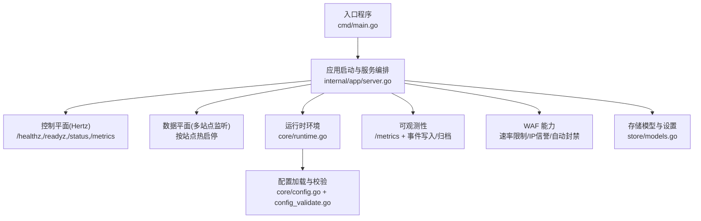
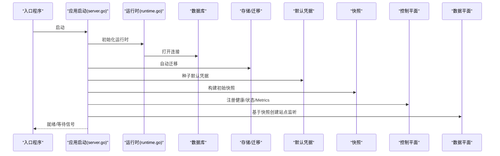
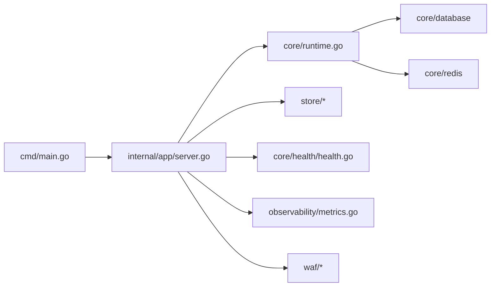

# 故障排除

<cite>
**本文引用的文件**
- [cmd/main.go](file://cmd/main.go)
- [internal/app/server.go](file://internal/app/server.go)
- [internal/core/config.go](file://internal/core/config.go)
- [internal/core/runtime.go](file://internal/core/runtime.go)
- [internal/core/config_validate.go](file://internal/core/config_validate.go)
- [internal/pkg/logger/logger.go](file://internal/pkg/logger/logger.go)
- [internal/core/health/health.go](file://internal/core/health/health.go)
- [internal/core/errors/errors.go](file://internal/core/errors/errors.go)
- [internal/observability/metrics.go](file://internal/observability/metrics.go)
- [internal/admin/handler_system.go](file://internal/admin/handler_system.go)
- [internal/store/models.go](file://internal/store/models.go)
- [internal/waf/ratelimit.go](file://internal/waf/ratelimit.go)
- [internal/waf/iprep.go](file://internal/waf/iprep.go)
- [frontend/README.md](file://frontend/README.md)
</cite>

## 目录
1. [简介](#简介)
2. [项目结构](#项目结构)
3. [核心组件](#核心组件)
4. [架构总览](#架构总览)
5. [详细组件分析](#详细组件分析)
6. [依赖分析](#依赖分析)
7. [性能考虑](#性能考虑)
8. [故障排除指南](#故障排除指南)
9. [结论](#结论)
10. [附录](#附录)

## 简介
本文件面向运维与开发人员，提供 My-OpenWaf 的系统化故障排除指南。内容涵盖安装与配置问题、运行时异常定位、日志分析技巧、性能调优策略、紧急处理流程、调试工具使用、问题报告模板与社区支持渠道，以及预防性维护与健康检查清单。文档基于仓库中的实际实现进行分析，并通过图示帮助快速定位问题根因。

## 项目结构
My-OpenWaf 采用分层与模块化设计：入口程序负责启动应用；控制平面（Admin）提供健康检查、状态查询与配置热重载；数据平面（Data）按站点维度监听并执行 WAF 规则；可观测性模块提供指标与事件归档；核心模块负责运行时环境、配置加载与数据库迁移；WAF 模块提供速率限制、IP 黑白名单与自动封禁等能力。

图表来源
- [cmd/main.go:1-10](file://cmd/main.go#L1-L10)
- [internal/app/server.go:33-280](file://internal/app/server.go#L33-L280)
- [internal/core/runtime.go:27-80](file://internal/core/runtime.go#L27-L80)
- [internal/core/config.go:31-66](file://internal/core/config.go#L31-L66)
- [internal/core/config_validate.go:11-47](file://internal/core/config_validate.go#L11-L47)
- [internal/observability/metrics.go:51-125](file://internal/observability/metrics.go#L51-L125)
- [internal/store/models.go:95-147](file://internal/store/models.go#L95-L147)
- [internal/waf/ratelimit.go:24-34](file://internal/waf/ratelimit.go#L24-L34)
- [internal/waf/iprep.go:44-54](file://internal/waf/iprep.go#L44-L54)

章节来源
- [cmd/main.go:1-10](file://cmd/main.go#L1-L10)
- [internal/app/server.go:33-280](file://internal/app/server.go#L33-L280)

## 核心组件
- 运行时环境（Runtime）：负责打开数据库与可选 Redis、初始化缓存层、构建快照持有者，并在启动后持续热重载配置。
- 配置系统（Config/Validate）：从环境变量加载配置，进行驱动类型、地址格式与端口等校验，并输出警告提示。
- 控制平面（Admin）：提供健康检查、就绪检查、状态查询与 Prometheus 指标端点；支持系统设置与 API Key 管理，以及触发快照热重载。
- 数据平面（Data）：根据快照为每个站点创建独立监听实例，支持 TLS 终止、SNI 证书、配置漂移检测与热启停。
- 可观测性（Metrics/EventWriter/Archiver）：提供 Prometheus 兼容指标、异步事件写入与事件归档清理。
- WAF 能力：速率限制（请求/错误）、IP 黑白名单与自动封禁，支持动态配置更新。

章节来源
- [internal/core/runtime.go:17-80](file://internal/core/runtime.go#L17-L80)
- [internal/core/config.go:10-66](file://internal/core/config.go#L10-L66)
- [internal/core/config_validate.go:9-47](file://internal/core/config_validate.go#L9-L47)
- [internal/admin/handler_system.go:12-150](file://internal/admin/handler_system.go#L12-L150)
- [internal/app/server.go:119-279](file://internal/app/server.go#L119-L279)
- [internal/observability/metrics.go:13-125](file://internal/observability/metrics.go#L13-L125)
- [internal/waf/ratelimit.go:9-117](file://internal/waf/ratelimit.go#L9-L117)
- [internal/waf/iprep.go:18-243](file://internal/waf/iprep.go#L18-L243)

## 架构总览
下图展示启动流程、关键依赖与交互路径，便于定位启动失败、监听异常与配置漂移等问题。

图表来源
- [cmd/main.go:7-9](file://cmd/main.go#L7-L9)
- [internal/app/server.go:33-120](file://internal/app/server.go#L33-L120)
- [internal/core/runtime.go:27-80](file://internal/core/runtime.go#L27-L80)
- [internal/store/models.go:95-147](file://internal/store/models.go#L95-L147)

## 详细组件分析

### 启动与运行时（Runtime/Config）
- 启动失败排查要点
  - 配置校验失败：检查数据库驱动、DSN、管理端绑定地址与 Redis 地址格式。
  - 数据库连接失败：确认 DSN 正确、网络可达、权限正确。
  - Redis 连接失败：确认地址、密码、DB 序号与网络连通。
  - 快照构建失败：检查配置修订表与迁移是否成功。
- 关键日志与告警
  - 配置阶段输出警告（如 SQLite 驱动与 MySQL DSN 匹配不一致）。
  - 首次运行打印管理员凭据与 API Token（仅一次）。

章节来源
- [internal/core/config_validate.go:11-47](file://internal/core/config_validate.go#L11-L47)
- [internal/core/config.go:31-66](file://internal/core/config.go#L31-L66)
- [internal/core/runtime.go:27-80](file://internal/core/runtime.go#L27-L80)
- [internal/app/server.go:37-73](file://internal/app/server.go#L37-L73)

### 控制平面（Admin）
- 健康检查与状态
  - /healthz：存活探针，进程可达即健康。
  - /readyz：就绪探针，需数据库可用且已加载快照。
  - /status：返回进程存活、就绪、配置修订、站点数、监听数、协程数、内存与 CPU 等信息。
- 指标端点
  - /metrics：Prometheus 文本格式，包含请求数、拦截数、观察数、内置规则命中、缓存命中/未命中、上游错误、运行时指标等。
- 系统设置与热重载
  - 支持列出/创建/修改/删除系统设置，并在变更后触发快照热重载与监听热启停。

章节来源
- [internal/core/health/health.go:14-94](file://internal/core/health/health.go#L14-L94)
- [internal/observability/metrics.go:13-125](file://internal/observability/metrics.go#L13-L125)
- [internal/admin/handler_system.go:12-150](file://internal/admin/handler_system.go#L12-L150)
- [internal/app/server.go:245-279](file://internal/app/server.go#L245-L279)

### 数据平面（站点监听）
- 热启停与配置漂移
  - reconcileListeners 对比期望监听集合与当前运行集合，移除陈旧或变更监听，新增或重启受影响监听。
  - siteListenerFingerprint 基于绑定地址、TLS 开关、版本与证书指纹生成短哈希，用于检测配置漂移。
- TLS 终止
  - 支持站点证书与 SNI 多证书，解析最小/最大 TLS 版本与 ALPN 协议列表。
- 错误处理
  - 未匹配站点、快照为空、上游未配置、证书无效、API Token 无效等错误类型。

章节来源
- [internal/app/server.go:133-201](file://internal/app/server.go#L133-L201)
- [internal/app/server.go:432-457](file://internal/app/server.go#L432-L457)
- [internal/app/server.go:327-414](file://internal/app/server.go#L327-L414)
- [internal/core/errors/errors.go:38-45](file://internal/core/errors/errors.go#L38-L45)

### WAF 能力（速率限制/IP信誉）
- 速率限制
  - 固定窗口计数，支持请求/错误两类限流，动态重配置与清理过期窗口。
- IP 信誉
  - 黑/白名单匹配，自动封禁（基于违规次数与时间窗口），周期清理过期封禁。

章节来源
- [internal/waf/ratelimit.go:9-117](file://internal/waf/ratelimit.go#L9-L117)
- [internal/waf/iprep.go:18-243](file://internal/waf/iprep.go#L18-L243)

### 存储与模型
- 站点模型（Site）包含监听绑定、TLS 配置、保护策略、转发模式、上游参数、维护模式与阻断页等字段。
- 系统设置（SystemSettings）用于持久化运行时配置项。
- 安全事件（SecurityEvent）记录命中规则、阶段、动作、地理信息与状态码等。

章节来源
- [internal/store/models.go:95-147](file://internal/store/models.go#L95-L147)
- [internal/store/models.go:149-155](file://internal/store/models.go#L149-L155)
- [internal/store/models.go:213-235](file://internal/store/models.go#L213-L235)

## 依赖分析
- 启动链路依赖
  - cmd/main.go -> internal/app/server.go -> core/runtime.go -> database/redis -> store/migrations -> snapshot -> admin/data plane。
- 控制平面依赖
  - health.go 依赖 snapshot.Holder 与 gorm.DB；metrics.go 提供 Prometheus 端点；admin handler 依赖 repository 与 reload 回调。
- 数据平面依赖
  - engine、rate limiter、IP reputation、event writer、metrics、snapshot。

图表来源
- [cmd/main.go:7-9](file://cmd/main.go#L7-L9)
- [internal/app/server.go:33-120](file://internal/app/server.go#L33-L120)
- [internal/core/runtime.go:27-80](file://internal/core/runtime.go#L27-L80)
- [internal/core/health/health.go:14-23](file://internal/core/health/health.go#L14-L23)
- [internal/observability/metrics.go:13-28](file://internal/observability/metrics.go#L13-L28)
- [internal/waf/ratelimit.go:9-17](file://internal/waf/ratelimit.go#L9-L17)
- [internal/waf/iprep.go:18-35](file://internal/waf/iprep.go#L18-L35)

## 性能考虑
- 指标采集与解读
  - openwaf_requests_total、openwaf_blocks_total、openwaf_observes_total：请求总量与拦截/观察命中趋势。
  - openwaf_builtin_hits_total：内置 OWASP 规则命中量，可用于评估规则敏感度与误报。
  - openwaf_cache_hits_total/openwaf_cache_misses_total：响应缓存命中/未命中，指导缓存策略与上游优化。
  - openwaf_upstream_errors_total：上游代理错误计数，指示上游健康与配置问题。
  - openwaf_goroutines/openwaf_memory_alloc_bytes：并发与内存占用，辅助容量规划与 GC 调优。
  - openwaf_uptime_seconds：进程运行时长，结合其他指标计算速率。
- 瓶颈识别
  - 高错误率且高拦截：检查上游健康、规则敏感度与速率限制阈值。
  - 高缓存未命中：检查上游响应可缓存性、缓存键策略与响应头。
  - 内存增长与 GC 暂停：检查对象分配热点、并发与 GC 参数。
- 优化策略
  - 调整速率限制窗口与阈值，降低误判与拒绝。
  - 优化上游连接池、超时与 TLS 配置。
  - 使用 Redis 分布式缓存与配置同步，减少单点压力。
  - 合理设置监听数量与站点隔离，避免资源争用。

章节来源
- [internal/observability/metrics.go:51-125](file://internal/observability/metrics.go#L51-L125)
- [internal/waf/ratelimit.go:40-46](file://internal/waf/ratelimit.go#L40-L46)
- [internal/app/server.go:97-106](file://internal/app/server.go#L97-L106)

## 故障排除指南

### 一、安装与环境问题
- 症状：启动即退出或无法访问管理界面
  - 排查步骤
    - 检查配置加载：确认 MY_OPENWAF_DB_DRIVER、MY_OPENWAF_DSN、MY_OPENWAF_ADMIN_BIND 等环境变量是否正确。
    - 校验配置：查看启动日志中关于驱动类型、DSN、端口与 Redis 地址的校验结果与警告。
    - 数据库连接：确认 DSN 正确、数据库服务可达、权限正确。
    - Redis 连通：若启用，确认地址、密码与 DB 序号。
  - 相关实现参考
    - [internal/core/config.go:31-66](file://internal/core/config.go#L31-L66)
    - [internal/core/config_validate.go:11-47](file://internal/core/config_validate.go#L11-L47)
    - [internal/core/runtime.go:41-59](file://internal/core/runtime.go#L41-L59)

- 症状：首次运行未显示凭据
  - 排查步骤
    - 确认 SeedDefaults 是否成功创建管理员账户与 API Token。
    - 检查日志中“FIRST RUN”横幅是否出现。
  - 相关实现参考
    - [internal/app/server.go:49-68](file://internal/app/server.go#L49-L68)

### 二、配置错误
- 症状：/readyz 返回 not ready 或 /status 字段缺失
  - 排查步骤
    - 确认数据库 Ping 成功且快照已加载。
    - 检查系统设置与站点配置是否完整。
  - 相关实现参考
    - [internal/core/health/health.go:28-38](file://internal/core/health/health.go#L28-L38)
    - [internal/core/runtime.go:82-99](file://internal/core/runtime.go#L82-L99)

- 症状：系统设置变更后未生效
  - 排查步骤
    - 确认通过管理接口设置后触发了 reload 回调。
    - 检查快照热重载与监听热启停流程。
  - 相关实现参考
    - [internal/admin/handler_system.go:28-46](file://internal/admin/handler_system.go#L28-L46)
    - [internal/app/server.go:203-225](file://internal/app/server.go#L203-L225)

### 三、运行时异常
- 症状：站点监听异常或无法热启停
  - 排查步骤
    - 查看 reconcileListeners 日志，确认是否存在“移除陈旧/重启 due to config change”等信息。
    - 检查 siteListenerFingerprint 是否变化导致监听被重启。
  - 相关实现参考
    - [internal/app/server.go:133-201](file://internal/app/server.go#L133-L201)
    - [internal/app/server.go:432-457](file://internal/app/server.go#L432-L457)

- 症状：TLS 终止失败
  - 排查步骤
    - 检查站点证书与密钥 PEM 是否有效，SNI 证书是否匹配绑定地址前缀。
    - 校验最小/最大 TLS 版本与 ALPN 列表。
  - 相关实现参考
    - [internal/app/server.go:353-414](file://internal/app/server.go#L353-L414)

- 症状：速率限制或 IP 封禁异常
  - 排查步骤
    - 检查速率限制窗口与阈值配置，确认是否启用。
    - 检查 IP 黑/白名单与自动封禁阈值、窗口与封禁时长。
  - 相关实现参考
    - [internal/waf/ratelimit.go:24-46](file://internal/waf/ratelimit.go#L24-L46)
    - [internal/waf/iprep.go:68-79](file://internal/waf/iprep.go#L68-L79)

### 四、日志分析技巧
- 日志级别与输出
  - 支持 DEBUG/INFO/WARN/ERROR，可通过环境变量设置级别与颜色开关。
  - Banner 用于首次运行的关键信息提示，不受日志级别影响。
- 关键信息提取
  - section 标签：区分 app、seed、events、archiver、dataplane 等模块。
  - 错误上下文：err 字段、站点 ID、绑定地址、TLS 开关、指纹等。
- 问题定位方法
  - 以“section=app”为起点，逐步定位到具体模块（如 dataplane、events）。
  - 结合 /status 中的 revision、sites、listeners 字段判断配置是否已生效。
  - 结合 /metrics 中的错误与拦截趋势，缩小问题范围。

章节来源
- [internal/pkg/logger/logger.go:53-76](file://internal/pkg/logger/logger.go#L53-L76)
- [internal/pkg/logger/logger.go:251-285](file://internal/pkg/logger/logger.go#L251-L285)
- [internal/app/server.go:272-276](file://internal/app/server.go#L272-L276)
- [internal/observability/metrics.go:51-125](file://internal/observability/metrics.go#L51-L125)

### 五、性能调优指南
- 指标分析
  - 通过 /metrics 获取实时指标，结合 /status 的运行时信息进行综合分析。
- 策略建议
  - 调整速率限制窗口与阈值，平衡安全与性能。
  - 优化上游连接与超时，减少上游错误。
  - 合理设置监听数量与站点隔离，避免资源争用。
- 监控指标
  - 请求速率、拦截率、缓存命中率、上游错误、协程数与内存占用。

章节来源
- [internal/observability/metrics.go:51-125](file://internal/observability/metrics.go#L51-L125)
- [internal/app/server.go:97-106](file://internal/app/server.go#L97-L106)

### 六、紧急处理流程
- 快速恢复
  - 通过管理接口触发快照热重载，恢复最新配置。
  - 检查并修复站点监听配置漂移，确保监听正常运行。
- 数据修复
  - 检查系统设置与站点配置，必要时回滚至已知稳定版本。
  - 清理过期安全事件与缓存，释放资源。
- 系统重建
  - 在备份数据基础上重建数据库与快照，重新初始化运行时。

章节来源
- [internal/admin/handler_system.go:142-150](file://internal/admin/handler_system.go#L142-L150)
- [internal/app/server.go:203-225](file://internal/app/server.go#L203-L225)
- [internal/observability/metrics.go:13-28](file://internal/observability/metrics.go#L13-L28)

### 七、调试工具使用
- 内置调试器
  - 使用 /healthz、/readyz、/status 与 /metrics 快速验证运行状态与性能。
- 外部工具
  - 使用 curl 或浏览器访问上述端点，结合浏览器开发者工具分析响应。
- 日志分析
  - 使用日志级别过滤与 section 标签定位问题模块，结合错误上下文字段进行根因分析。

章节来源
- [internal/core/health/health.go:40-94](file://internal/core/health/health.go#L40-L94)
- [internal/observability/metrics.go:51-125](file://internal/observability/metrics.go#L51-L125)
- [internal/pkg/logger/logger.go:53-76](file://internal/pkg/logger/logger.go#L53-L76)

### 八、问题报告模板
- 环境信息
  - 操作系统、Go 版本、数据库驱动与版本、Redis 版本（如有）。
- 复现步骤
  - 详细描述操作步骤与预期/实际结果。
- 日志与指标
  - 提供关键日志片段（含 section 与 err 字段）、/status 与 /metrics 输出。
- 配置摘要
  - 关键配置项（数据库 DSN、管理端绑定、TLS 配置、速率限制与封禁参数）。
- 附加信息
  - 相关截图、抓包文件或复现脚本。

### 九、社区支持渠道
- 仓库与文档
  - 项目 README 与前端模板说明可作为基础参考。
- 反馈方式
  - 通过 Issues 描述问题并附带上述模板信息。

章节来源
- [frontend/README.md:1-22](file://frontend/README.md#L1-L22)

### 十、预防性维护与健康检查清单
- 预防性维护
  - 定期备份数据库与配置，验证快照构建与热重载流程。
  - 监控 /metrics 关键指标，设置告警阈值。
  - 定期审查系统设置与站点配置，清理过期条目。
- 健康检查清单
  - /healthz 返回 ok
  - /readyz 返回 ready
  - /status 显示 revision、sites、listeners 数量合理
  - /metrics 指标稳定，无异常尖峰
  - 无关键错误日志（ERROR/WARN）

章节来源
- [internal/core/health/health.go:40-94](file://internal/core/health/health.go#L40-L94)
- [internal/observability/metrics.go:51-125](file://internal/observability/metrics.go#L51-L125)
- [internal/pkg/logger/logger.go:53-76](file://internal/pkg/logger/logger.go#L53-L76)

## 结论
本指南基于代码实现总结了 My-OpenWaf 的故障排除方法与最佳实践。通过理解启动流程、控制平面与数据平面的职责边界，结合日志与指标分析，能够快速定位并解决问题。建议在生产环境中建立完善的监控与告警体系，并定期进行健康检查与演练，以提升系统的稳定性与可维护性。