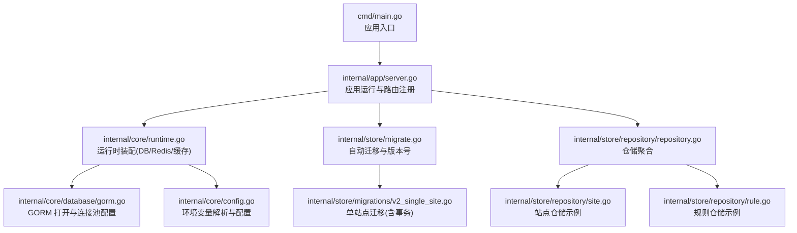
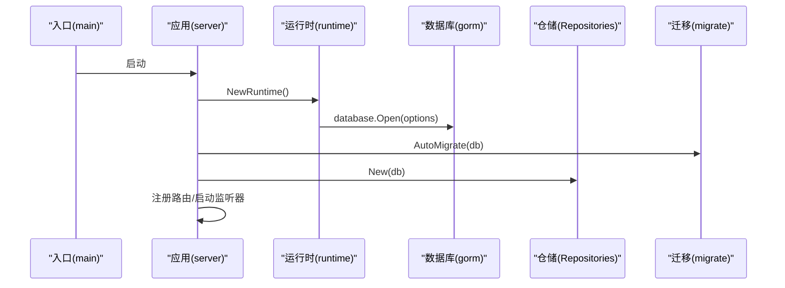
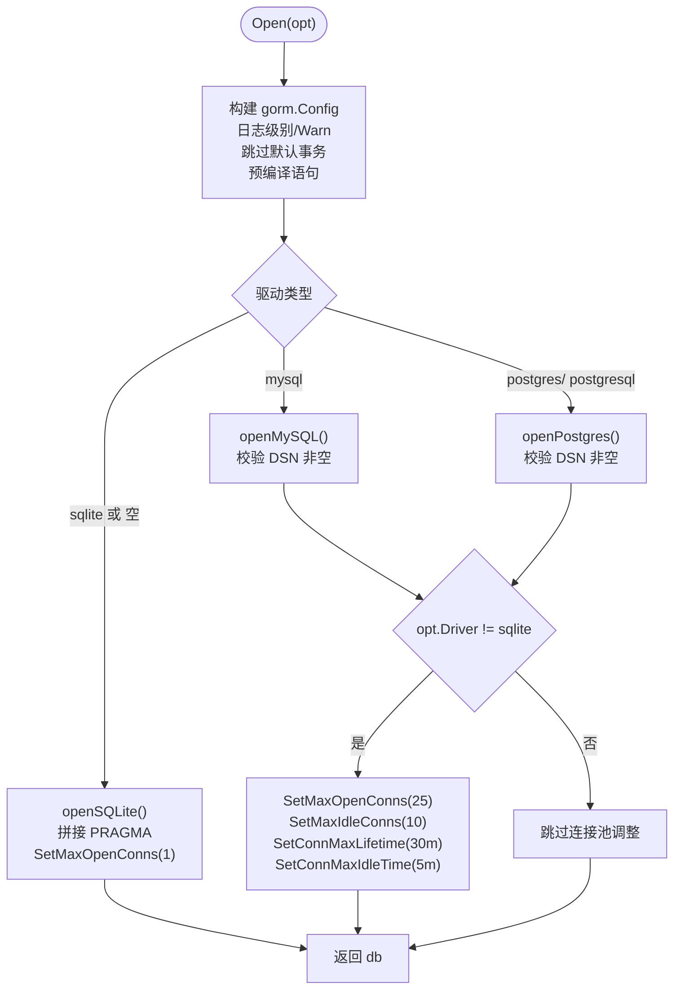
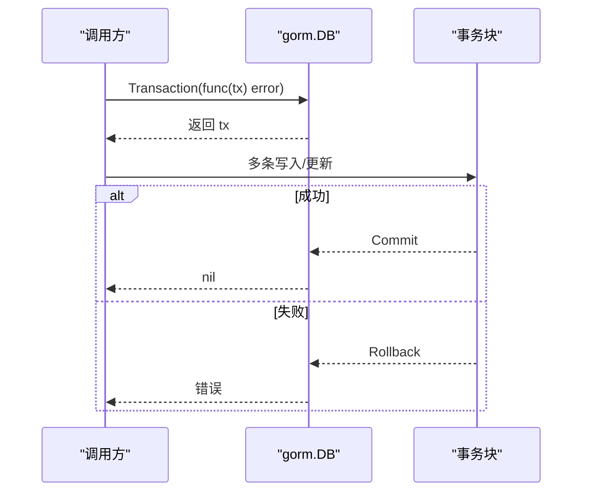
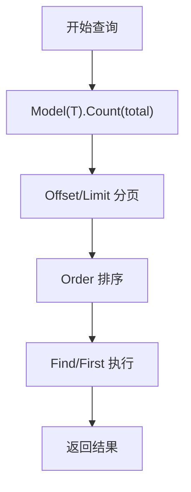
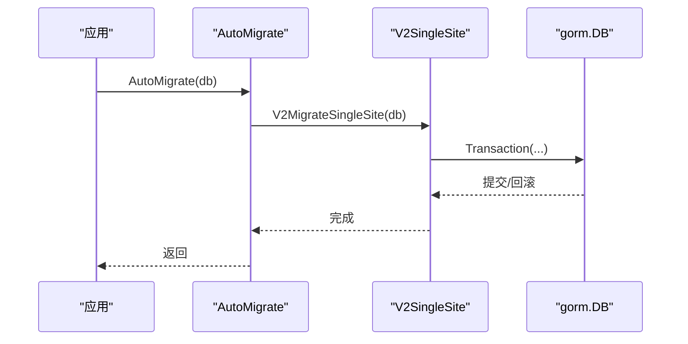
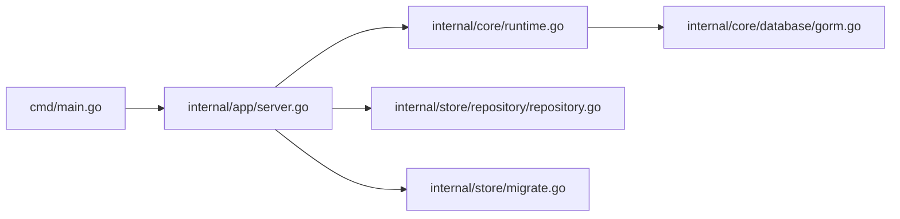
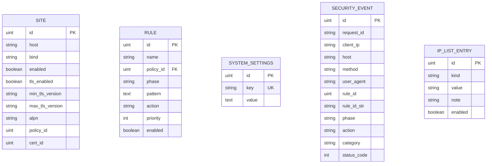

# GORM 配置与使用

<cite>
**本文引用的文件**
- [cmd/main.go](file://cmd/main.go)
- [internal/core/database/gorm.go](file://internal/core/database/gorm.go)
- [internal/core/config.go](file://internal/core/config.go)
- [internal/core/runtime.go](file://internal/core/runtime.go)
- [internal/app/server.go](file://internal/app/server.go)
- [internal/store/migrate.go](file://internal/store/migrate.go)
- [internal/store/migrations/v2_single_site.go](file://internal/store/migrations/v2_single_site.go)
- [internal/store/repository/repository.go](file://internal/store/repository/repository.go)
- [internal/store/repository/site.go](file://internal/store/repository/site.go)
- [internal/store/repository/rule.go](file://internal/store/repository/rule.go)
</cite>

## 目录
1. [简介](#简介)
2. [项目结构](#项目结构)
3. [核心组件](#核心组件)
4. [架构总览](#架构总览)
5. [详细组件分析](#详细组件分析)
6. [依赖分析](#依赖分析)
7. [性能考虑](#性能考虑)
8. [故障排查指南](#故障排查指南)
9. [结论](#结论)
10. [附录](#附录)

## 简介
本文件系统性梳理项目中 GORM 的初始化、配置、连接池、日志、事务、迁移、查询与性能优化等实践，帮助开发者在不同数据库（SQLite、MySQL、Postgres）下正确配置与高效使用 GORM，并提供常见操作与排错建议。

## 项目结构
围绕数据库与 GORM 的关键文件组织如下：
- 初始化与配置：环境变量解析、运行时装配、数据库打开
- 数据模型与仓储：实体定义、仓储聚合与具体仓库
- 迁移与版本控制：自动迁移、版本号维护、单站点合并迁移
- 应用启动流程：启动时执行迁移、构建快照、注册路由与监听器

图表来源
- [cmd/main.go:1-10](file://cmd/main.go#L1-L10)
- [internal/app/server.go:1-485](file://internal/app/server.go#L1-L485)
- [internal/core/runtime.go:1-127](file://internal/core/runtime.go#L1-L127)
- [internal/core/database/gorm.go:1-111](file://internal/core/database/gorm.go#L1-L111)
- [internal/core/config.go:1-183](file://internal/core/config.go#L1-L183)
- [internal/store/migrate.go:1-60](file://internal/store/migrate.go#L1-L60)
- [internal/store/migrations/v2_single_site.go:1-189](file://internal/store/migrations/v2_single_site.go#L1-L189)
- [internal/store/repository/repository.go:1-49](file://internal/store/repository/repository.go#L1-L49)
- [internal/store/repository/site.go:1-54](file://internal/store/repository/site.go#L1-L54)
- [internal/store/repository/rule.go:1-51](file://internal/store/repository/rule.go#L1-L51)

章节来源
- [cmd/main.go:1-10](file://cmd/main.go#L1-L10)
- [internal/app/server.go:35-80](file://internal/app/server.go#L35-L80)
- [internal/core/runtime.go:27-80](file://internal/core/runtime.go#L27-L80)
- [internal/core/database/gorm.go:24-61](file://internal/core/database/gorm.go#L24-L61)

## 核心组件
- 数据库打开与驱动选择：根据驱动类型选择 SQLite/MySQL/Postgres，统一返回 GORM 句柄
- 连接池调优：非 SQLite 默认连接池参数；SQLite 单连接以避免锁竞争
- 日志与事务：默认日志级别、跳过默认事务包装、启用预编译语句
- 迁移与版本控制：自动迁移所有模型，维护配置修订版本，支持回滚前备份
- 仓储层：按实体拆分仓库，统一通过 Repos 注入到业务层

章节来源
- [internal/core/database/gorm.go:17-61](file://internal/core/database/gorm.go#L17-L61)
- [internal/store/migrate.go:9-33](file://internal/store/migrate.go#L9-L33)
- [internal/store/migrations/v2_single_site.go:16-50](file://internal/store/migrations/v2_single_site.go#L16-L50)
- [internal/store/repository/repository.go:5-32](file://internal/store/repository/repository.go#L5-L32)

## 架构总览
应用启动时，从环境变量读取数据库配置，打开对应驱动的 GORM 实例，执行迁移与种子数据，随后构建快照并启动监听器。仓储层通过统一的 Repos 注入到各子系统。

图表来源
- [cmd/main.go:7-9](file://cmd/main.go#L7-L9)
- [internal/app/server.go:35-80](file://internal/app/server.go#L35-L80)
- [internal/core/runtime.go:27-80](file://internal/core/runtime.go#L27-L80)
- [internal/core/database/gorm.go:24-61](file://internal/core/database/gorm.go#L24-L61)
- [internal/store/migrate.go:9-33](file://internal/store/migrate.go#L9-L33)
- [internal/store/repository/repository.go:19-32](file://internal/store/repository/repository.go#L19-L32)

## 详细组件分析

### 数据库初始化与连接池
- 驱动选择与 DSN 解析：支持 sqlite、mysql、postgres；SQLite 支持空 DSN 自动定位到 DataDir/waf.db
- 日志配置：默认日志级别为 Warn，便于生产环境减少噪音
- 事务策略：关闭默认事务包装，避免单条写入被隐式包裹事务，降低开销
- 预编译语句：开启 PrepareStmt，提升重复查询性能
- 连接池：
  - 非 SQLite：最大并发连接 25，最大空闲 10，连接最长存活 30 分钟，空闲 5 分钟
  - SQLite：最大并发/空闲均为 1，无连接寿命限制，避免锁竞争

图表来源
- [internal/core/database/gorm.go:24-61](file://internal/core/database/gorm.go#L24-L61)
- [internal/core/database/gorm.go:63-94](file://internal/core/database/gorm.go#L63-L94)
- [internal/core/database/gorm.go:96-110](file://internal/core/database/gorm.go#L96-L110)

章节来源
- [internal/core/database/gorm.go:17-61](file://internal/core/database/gorm.go#L17-L61)
- [internal/core/database/gorm.go:63-94](file://internal/core/database/gorm.go#L63-L94)
- [internal/core/database/gorm.go:96-110](file://internal/core/database/gorm.go#L96-L110)

### 连接字符串格式与环境变量
- 环境变量优先级：MY_OPENWAF_DSN > MY_OPENWAF_DB；为空时 SQLite 回退到 DataDir/waf.db
- 驱动选择：MY_OPENWAF_DB_DRIVER，默认 sqlite
- Redis 可选：MY_OPENWAF_REDIS_ADDR/PASSWORD/DB；用于分布式缓存与配置同步
- 管理端口：MY_OPENWAF_ADMIN_BIND，默认 :9443

章节来源
- [internal/core/config.go:92-150](file://internal/core/config.go#L92-L150)
- [internal/core/runtime.go:27-80](file://internal/core/runtime.go#L27-L80)

### 事务处理机制
- 自动提交：SkipDefaultTransaction=true，单次写入不包裹事务，降低开销
- 手动事务：使用 db.Transaction 包裹多步写入，确保一致性
- 嵌套事务：GORM 不支持原生嵌套事务，应在外层事务中完成所有步骤或使用保存点（需底层驱动支持）

图表来源
- [internal/core/database/gorm.go:26-30](file://internal/core/database/gorm.go#L26-L30)
- [internal/store/migrations/v2_single_site.go:23-49](file://internal/store/migrations/v2_single_site.go#L23-L49)

章节来源
- [internal/core/database/gorm.go:26-30](file://internal/core/database/gorm.go#L26-L30)
- [internal/store/migrations/v2_single_site.go:23-49](file://internal/store/migrations/v2_single_site.go#L23-L49)

### 查询优化技巧
- 预加载与联表：通过 Where/Joins/Select 控制查询范围与字段，避免 N+1
- 索引利用：模型注解中已为常用过滤字段添加索引（如 DeletedAt、Host、Bind、PolicyID 等）
- 排序与分页：使用 Order/Offset/Limit 控制结果集大小与顺序
- 计数与分页：先 Count 再查询，避免一次性加载大结果集

图表来源
- [internal/store/repository/site.go:13-23](file://internal/store/repository/site.go#L13-L23)
- [internal/store/repository/rule.go:13-28](file://internal/store/repository/rule.go#L13-L28)

章节来源
- [internal/store/repository/site.go:13-23](file://internal/store/repository/site.go#L13-L23)
- [internal/store/repository/rule.go:13-28](file://internal/store/repository/rule.go#L13-L28)

### 数据迁移集成
- 自动迁移：启动时对所有模型执行 AutoMigrate
- 版本控制：维护 ConfigRevision 表，每次变更递增 Revision
- 回滚策略：单站点迁移采用事务包裹，并对旧表进行带时间戳的备份，便于回滚

图表来源
- [internal/store/migrate.go:9-33](file://internal/store/migrate.go#L9-L33)
- [internal/store/migrations/v2_single_site.go:16-50](file://internal/store/migrations/v2_single_site.go#L16-L50)

章节来源
- [internal/store/migrate.go:9-33](file://internal/store/migrate.go#L9-L33)
- [internal/store/migrations/v2_single_site.go:16-50](file://internal/store/migrations/v2_single_site.go#L16-L50)

### 常见操作示例（路径指引）
- CRUD 操作
  - 创建：[internal/store/repository/site.go:40](file://internal/store/repository/site.go#L40)
  - 更新：[internal/store/repository/site.go:42](file://internal/store/repository/site.go#L42)
  - 删除：[internal/store/repository/site.go:44](file://internal/store/repository/site.go#L44)
  - 获取单个：[internal/store/repository/site.go:35-38](file://internal/store/repository/site.go#L35-L38)
- 列表与分页
  - 分页列表：[internal/store/repository/site.go:13-23](file://internal/store/repository/site.go#L13-L23)
  - 按策略列出规则：[internal/store/repository/rule.go:25-28](file://internal/store/repository/rule.go#L25-L28)
- 复杂查询
  - 条件查询（启用站点）：[internal/store/repository/site.go:25-28](file://internal/store/repository/site.go#L25-L28)
  - 绑定地址查询：[internal/store/repository/site.go:30-33](file://internal/store/repository/site.go#L30-L33)
- 批量操作
  - 使用事务包裹多条写入：[internal/store/migrations/v2_single_site.go:23-49](file://internal/store/migrations/v2_single_site.go#L23-L49)

章节来源
- [internal/store/repository/site.go:13-44](file://internal/store/repository/site.go#L13-L44)
- [internal/store/repository/rule.go:13-40](file://internal/store/repository/rule.go#L13-L40)
- [internal/store/migrations/v2_single_site.go:23-49](file://internal/store/migrations/v2_single_site.go#L23-L49)

## 依赖分析
- 入口与运行时：main 调用 app.Run，app.Run 中创建 runtime，runtime 打开数据库与 Redis
- 数据访问：app.Run 构建 Repos 并注入到各子系统
- 迁移：app.Run 在 runtime 初始化后立即执行 AutoMigrate

图表来源
- [cmd/main.go:7-9](file://cmd/main.go#L7-L9)
- [internal/app/server.go:35-80](file://internal/app/server.go#L35-L80)
- [internal/core/runtime.go:27-80](file://internal/core/runtime.go#L27-L80)
- [internal/core/database/gorm.go:24-61](file://internal/core/database/gorm.go#L24-L61)
- [internal/store/repository/repository.go:19-32](file://internal/store/repository/repository.go#L19-L32)
- [internal/store/migrate.go:9-33](file://internal/store/migrate.go#L9-L33)

章节来源
- [cmd/main.go:7-9](file://cmd/main.go#L7-L9)
- [internal/app/server.go:35-80](file://internal/app/server.go#L35-L80)
- [internal/core/runtime.go:27-80](file://internal/core/runtime.go#L27-L80)

## 性能考虑
- 连接池参数：非 SQLite 默认 25 并发、10 空闲、30 分钟存活、5 分钟空闲，适合多数 Web 场景
- SQLite 单连接：避免 WAL 之外的锁竞争，适用于开发与小规模部署
- 预编译语句：PrepareStmt=true，减少解析与计划开销
- 日志级别：默认 Warn，生产环境建议保持或更严格
- 查询优化：合理使用索引、分页、排序与投影字段，避免全表扫描
- 事务粒度：批量写入尽量使用单事务，减少往返与锁持有时间

章节来源
- [internal/core/database/gorm.go:49-61](file://internal/core/database/gorm.go#L49-L61)
- [internal/core/database/gorm.go:26-30](file://internal/core/database/gorm.go#L26-L30)

## 故障排查指南
- 连接失败
  - 检查驱动与 DSN：MySQL/Postgres 必须提供 DSN；SQLite 若为空会落到 DataDir/waf.db
  - 查看连接池：确认并发与生命周期参数是否合理
- 迁移异常
  - 检查 AutoMigrate 是否覆盖了自定义列；单站点迁移会备份旧表，可回滚
  - 关注事务中的错误并重试
- 日志与调试
  - 生产环境保持默认日志级别；问题定位时可临时提高日志级别
  - 使用仓储层方法逐步缩小问题范围（分页/条件/排序）
- 事务回滚
  - 使用 db.Transaction 包裹多步写入；出现错误自动回滚
  - 避免在事务内长时间持有锁或执行阻塞操作

章节来源
- [internal/core/database/gorm.go:96-110](file://internal/core/database/gorm.go#L96-L110)
- [internal/store/migrations/v2_single_site.go:16-50](file://internal/store/migrations/v2_single_site.go#L16-L50)
- [internal/store/migrate.go:9-33](file://internal/store/migrate.go#L9-L33)

## 结论
本项目在 GORM 使用上遵循“轻事务、强索引、预编译、适配驱动”的原则：非 SQLite 默认连接池参数兼顾吞吐与资源占用；SQLite 单连接避免锁竞争；迁移采用事务与备份策略保障安全演进；仓储层清晰分离职责，便于扩展与测试。结合索引与分页等查询优化手段，可在不同数据库与负载场景下获得稳定性能。

## 附录
- 数据模型概览（部分关键实体）
  - 站点：包含监听绑定、TLS、防护与转发配置
  - 规则：按阶段与优先级组织
  - 系统设置：键值型配置项
  - 安全事件：攻击事件记录
  - IP 黑白名单：基于 CIDR 的访问控制
  - 会话与令牌：鉴权相关实体

图表来源
- [internal/store/models.go:95-147](file://internal/store/models.go#L95-L147)
- [internal/store/models.go:78-91](file://internal/store/models.go#L78-L91)
- [internal/store/models.go:149-155](file://internal/store/models.go#L149-L155)
- [internal/store/models.go:213-235](file://internal/store/models.go#L213-L235)
- [internal/store/models.go:199-209](file://internal/store/models.go#L199-L209)