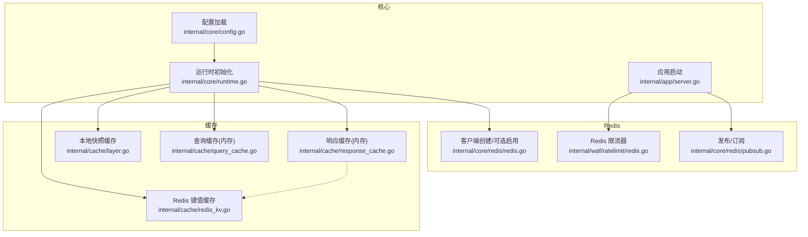
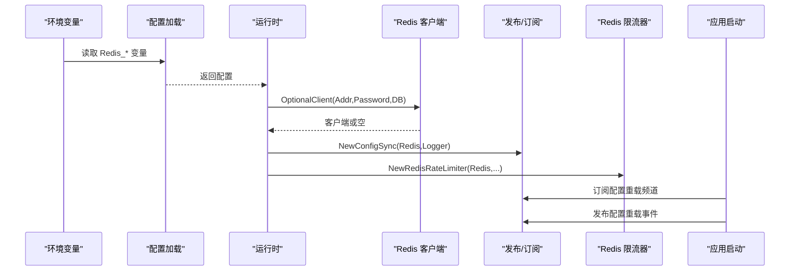
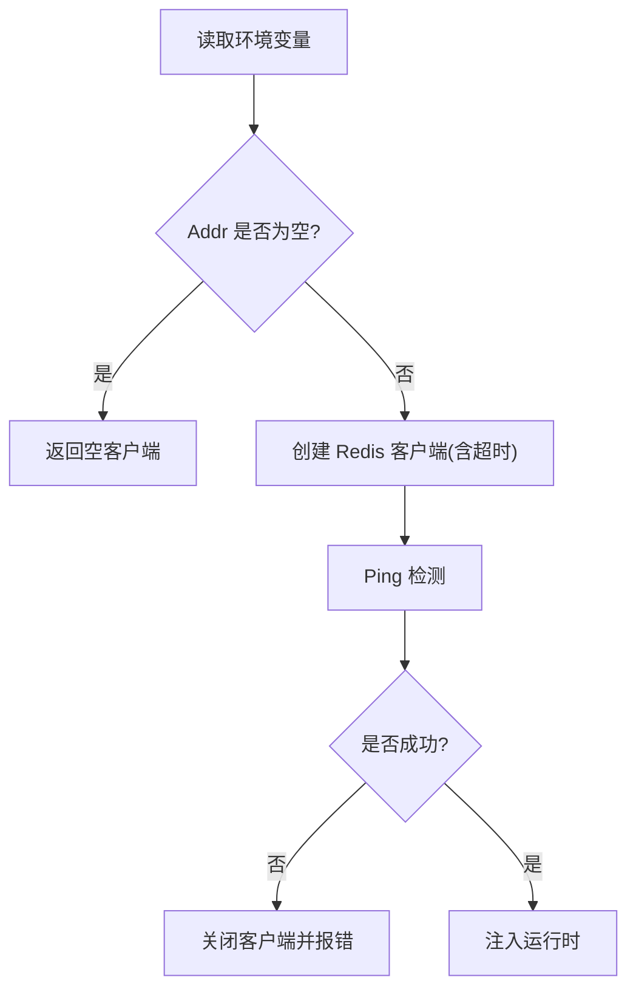
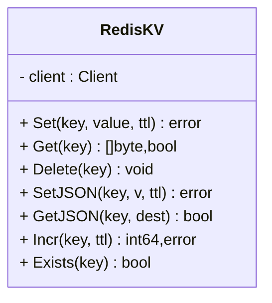
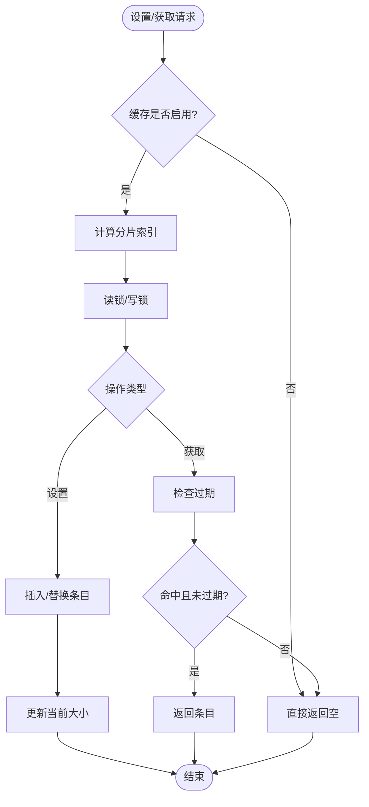
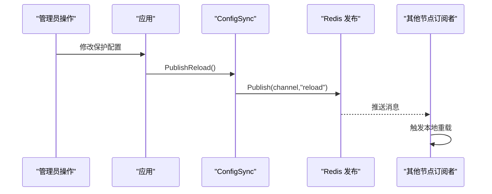
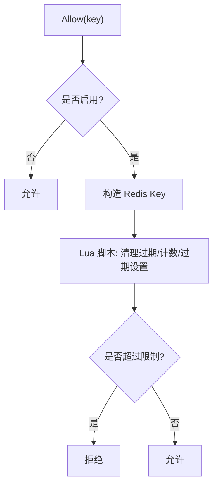
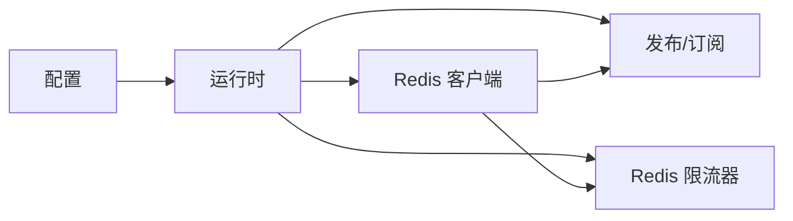

# Redis 集成

<cite>
**本文引用的文件**
- [internal/cache/redis_kv.go](file://internal/cache/redis_kv.go)
- [internal/core/redis/redis.go](file://internal/core/redis/redis.go)
- [internal/core/redis/pubsub.go](file://internal/core/redis/pubsub.go)
- [internal/waf/ratelimit/redis.go](file://internal/waf/ratelimit/redis.go)
- [internal/cache/response_cache.go](file://internal/cache/response_cache.go)
- [internal/cache/query_cache.go](file://internal/cache/query_cache.go)
- [internal/cache/layer.go](file://internal/cache/layer.go)
- [internal/core/config.go](file://internal/core/config.go)
- [internal/core/runtime.go](file://internal/core/runtime.go)
- [internal/app/server.go](file://internal/app/server.go)
- [docs/数据存储层/Redis 集成.md](file://docs/数据存储层/Redis 集成.md)
</cite>

## 目录
1. [简介](#简介)
2. [项目结构](#项目结构)
3. [核心组件](#核心组件)
4. [架构总览](#架构总览)
5. [详细组件分析](#详细组件分析)
6. [依赖分析](#依赖分析)
7. [性能考虑](#性能考虑)
8. [故障排查指南](#故障排查指南)
9. [结论](#结论)
10. [附录](#附录)

## 简介
本文件系统性梳理本项目中的 Redis 集成与使用，覆盖以下主题：
- 连接配置：客户端创建、可选启用、连通性探测
- 分布式键值缓存：键前缀、TTL 设置、JSON 序列化、原子计数器
- 响应缓存：本地内存分片 LRU 式缓存、过期清理、命中统计
- 发布/订阅：节点间配置热重载广播与订阅
- 分布式限流：基于 Redis 的滑动窗口限流（Lua 脚本）
- 缓存策略：键命名、TTL、过期与清理
- 性能监控：命中率、内存、连接数等指标建议
- 高并发优化与故障处理

## 项目结构
Redis 相关能力分布在如下模块：
- 核心配置与运行时：环境变量解析、Redis 客户端创建与校验、应用启动流程中对 Redis 的集成
- 缓存层：本地响应缓存（内存）与分布式键值缓存（Redis）
- 发布/订阅：配置热重载通道的发布与订阅
- 分布式限流：基于 Redis 的滑动窗口限流器

图表来源
- [internal/core/config.go:74-102](file://internal/core/config.go#L74-L102)
- [internal/core/runtime.go:45-80](file://internal/core/runtime.go#L45-L80)
- [internal/app/server.go:120-146](file://internal/app/server.go#L120-L146)
- [internal/cache/response_cache.go:29-208](file://internal/cache/response_cache.go#L29-L208)
- [internal/cache/query_cache.go:8-103](file://internal/cache/query_cache.go#L8-L103)
- [internal/cache/layer.go:19-65](file://internal/cache/layer.go#L19-L65)
- [internal/cache/redis_kv.go:13-112](file://internal/cache/redis_kv.go#L13-L112)
- [internal/core/redis/redis.go:17-39](file://internal/core/redis/redis.go#L17-L39)
- [internal/core/redis/pubsub.go:13-76](file://internal/core/redis/pubsub.go#L13-L76)
- [internal/waf/ratelimit/redis.go:12-148](file://internal/waf/ratelimit/redis.go#L12-L148)

章节来源
- [internal/core/config.go:74-102](file://internal/core/config.go#L74-L102)
- [internal/core/runtime.go:45-80](file://internal/core/runtime.go#L45-L80)
- [internal/app/server.go:120-146](file://internal/app/server.go#L120-L146)

## 核心组件
- Redis 客户端创建与可选启用：通过环境变量驱动，若未配置地址则返回空客户端，避免强制依赖
- Redis 键值缓存：提供字节级读写、JSON 序列化/反序列化、原子自增与 TTL 绑定
- 响应缓存：内存分片 LRU 式缓存，支持默认 TTL、过期清理、命中统计
- 查询缓存：轻量级内存 TTL 缓存，适用于数据库查询结果
- 本地快照缓存：基于 ristretto 的进程内快照缓存，避免序列化到 Redis
- 发布/订阅：统一频道用于配置热重载广播，节点间保持一致
- Redis 限流器：滑动窗口（有序集合 + Lua），多节点共享状态

章节来源
- [internal/core/redis/redis.go:17-39](file://internal/core/redis/redis.go#L17-L39)
- [internal/cache/redis_kv.go:13-112](file://internal/cache/redis_kv.go#L13-L112)
- [internal/cache/response_cache.go:29-208](file://internal/cache/response_cache.go#L29-L208)
- [internal/cache/query_cache.go:8-103](file://internal/cache/query_cache.go#L8-L103)
- [internal/cache/layer.go:19-65](file://internal/cache/layer.go#L19-L65)
- [internal/core/redis/pubsub.go:13-76](file://internal/core/redis/pubsub.go#L13-L76)
- [internal/waf/ratelimit/redis.go:12-148](file://internal/waf/ratelimit/redis.go#L12-L148)

## 架构总览
下图展示 Redis 在系统中的角色与交互路径。

图表来源
- [internal/core/config.go:113-182](file://internal/core/config.go#L113-L182)
- [internal/core/runtime.go:49-69](file://internal/core/runtime.go#L49-L69)
- [internal/core/redis/redis.go:17-39](file://internal/core/redis/redis.go#L17-L39)
- [internal/core/redis/pubsub.go:21-76](file://internal/core/redis/pubsub.go#L21-L76)
- [internal/waf/ratelimit/redis.go:22-36](file://internal/waf/ratelimit/redis.go#L22-L36)
- [internal/app/server.go:127-260](file://internal/app/server.go#L127-L260)

## 详细组件分析

### Redis 连接配置与可选启用
- 配置来源：环境变量驱动，支持地址、密码、数据库索引
- 客户端创建：OptionalClient 当地址为空时返回空客户端；否则创建带超时参数的客户端
- 连通性探测：Ping 在非空客户端上执行，失败时关闭并报错
- 运行时注入：NewRuntime 将 Redis 客户端与 RedisKV 实例注入到运行时对象

图表来源
- [internal/core/config.go:169-175](file://internal/core/config.go#L169-L175)
- [internal/core/redis/redis.go:17-39](file://internal/core/redis/redis.go#L17-L39)
- [internal/core/runtime.go:49-59](file://internal/core/runtime.go#L49-L59)

章节来源
- [internal/core/config.go:74-102](file://internal/core/config.go#L74-L102)
- [internal/core/redis/redis.go:17-39](file://internal/core/redis/redis.go#L17-L39)
- [internal/core/runtime.go:45-80](file://internal/core/runtime.go#L45-L80)

### 分布式键值缓存（RedisKV）
- 键前缀：统一前缀避免键冲突
- 基础操作：Set/Get/Delete/Exists
- JSON 支持：SetJSON/GetJSON 提供序列化/反序列化
- 原子计数：Incr 结合 Expire，确保 TTL 与计数原子性
- 超时控制：所有操作均带上下文超时

图表来源
- [internal/cache/redis_kv.go:13-112](file://internal/cache/redis_kv.go#L13-L112)

章节来源
- [internal/cache/redis_kv.go:13-112](file://internal/cache/redis_kv.go#L13-L112)

### 响应缓存（内存分片 LRU 式）
- 分片设计：64 个分片，哈希选择分片以降低锁竞争
- 数据结构：每个分片维护 RWMutex 与 map
- 过期判定：基于 CachedAt + TTL
- 清理策略：后台定时器周期扫描并删除过期项
- 统计接口：返回条目数量与当前字节数

图表来源
- [internal/cache/response_cache.go:29-208](file://internal/cache/response_cache.go#L29-L208)

章节来源
- [internal/cache/response_cache.go:29-208](file://internal/cache/response_cache.go#L29-L208)
- [internal/cache/response_cache_test.go:9-132](file://internal/cache/response_cache_test.go#L9-L132)

### 查询缓存（轻量级内存 TTL）
- 并发访问：使用 sync.Map 支持高并发
- 清理机制：定期清理 goroutine 扫描过期条目
- 灵活 TTL：支持默认 TTL 和自定义 TTL

章节来源
- [internal/cache/query_cache.go:8-103](file://internal/cache/query_cache.go#L8-L103)

### 本地快照缓存（Ristretto）
- 设计目标：纯进程内缓存，避免序列化到 Redis
- 缓存策略：基于 ristretto 的 LRU 缓存
- 键空间：按修订号组织的快照键

章节来源
- [internal/cache/layer.go:19-65](file://internal/cache/layer.go#L19-L65)

### 发布/订阅（配置热重载）
- 频道：统一频道用于通知配置变更
- 发布：在配置变更后向频道发送"reload"消息
- 订阅：后台 goroutine 监听频道，收到消息后触发本地重载
- 关闭：通过停止通道优雅关闭订阅者

图表来源
- [internal/core/redis/pubsub.go:33-67](file://internal/core/redis/pubsub.go#L33-L67)
- [internal/app/server.go:220-260](file://internal/app/server.go#L220-L260)

章节来源
- [internal/core/redis/pubsub.go:13-76](file://internal/core/redis/pubsub.go#L13-L76)
- [internal/app/server.go:127-260](file://internal/app/server.go#L127-L260)

### 分布式限流（滑动窗口）
- 窗口模型：基于有序集合记录时间戳，Lua 脚本原子清理与计数
- 参数：窗口时长、最大请求数、启用开关
- 失败降级：Redis 错误时采用"放行"策略（fail-open）
- 多节点一致性：共享同一前缀的键空间，确保跨节点状态一致

图表来源
- [internal/waf/ratelimit/redis.go:47-84](file://internal/waf/ratelimit/redis.go#L47-L84)

章节来源
- [internal/waf/ratelimit/redis.go:12-148](file://internal/waf/ratelimit/redis.go#L12-L148)

## 依赖分析
- 运行时依赖 Redis 客户端：当 RedisAddr 为空时，运行时仍可正常启动，但 Redis 功能不可用
- 应用启动依赖发布/订阅：仅在 Redis 客户端可用时才创建与启动订阅
- 限流器依赖 Redis：当 Redis 客户端为空时，限流器返回空（回退到本地限流）

图表来源
- [internal/core/config.go:169-175](file://internal/core/config.go#L169-L175)
- [internal/core/runtime.go:49-69](file://internal/core/runtime.go#L49-L69)
- [internal/app/server.go:127-131](file://internal/app/server.go#L127-L131)
- [internal/waf/ratelimit/redis.go:22-27](file://internal/waf/ratelimit/redis.go#L22-L27)

章节来源
- [internal/core/runtime.go:45-80](file://internal/core/runtime.go#L45-L80)
- [internal/app/server.go:127-131](file://internal/app/server.go#L127-L131)
- [internal/waf/ratelimit/redis.go:22-27](file://internal/waf/ratelimit/redis.go#L22-L27)

## 性能考虑
- 连接与超时
  - 客户端创建时设置了拨号、读、写超时，建议结合实际网络环境调整
  - 所有 Redis 操作均带上下文超时，避免阻塞
- 命令批处理
  - RedisKV 的 Incr 使用管道（Pipeline）将自增与过期设置合并，减少往返
- 内存缓存
  - 响应缓存采用分片与后台清理，适合高并发 GET 请求的热点命中
  - 单条目过大将被丢弃，防止内存膨胀
- 限流脚本
  - 使用 Lua 原子脚本，避免竞态；错误时 fail-open，保障可用性
- 监控建议
  - 建议采集指标：命中率（内存缓存）、Redis 命中率、内存使用、连接数、命令耗时、错误率
  - 可通过 Prometheus 导出器与日志审计实现

## 故障排查指南
- Redis 不可用
  - 现象：启动时报 Redis 连接错误
  - 排查：确认环境变量配置、网络连通性、认证信息
  - 参考
    - [internal/core/redis/redis.go:32-38](file://internal/core/redis/redis.go#L32-L38)
    - [internal/core/runtime.go:54-59](file://internal/core/runtime.go#L54-L59)
- 发布/订阅无效
  - 现象：配置变更后其他节点未热重载
  - 排查：确认 Redis 客户端可用、频道名称一致、订阅 goroutine 正常
  - 参考
    - [internal/core/redis/pubsub.go:21-76](file://internal/core/redis/pubsub.go#L21-L76)
    - [internal/app/server.go:244-260](file://internal/app/server.go#L244-L260)
- 限流异常
  - 现象：限流频繁放行或拒绝
  - 排查：检查窗口与阈值配置、Redis 可用性、Lua 脚本执行结果
  - 参考
    - [internal/waf/ratelimit/redis.go:47-84](file://internal/waf/ratelimit/redis.go#L47-L84)
- 内存缓存命中低
  - 现象：CPU 与内存占用偏高
  - 排查：检查默认 TTL、清理周期、单条目大小限制
  - 参考
    - [internal/cache/response_cache.go:94-122](file://internal/cache/response_cache.go#L94-L122)
    - [internal/cache/response_cache.go:142-162](file://internal/cache/response_cache.go#L142-L162)

章节来源
- [internal/core/redis/redis.go:32-38](file://internal/core/redis/redis.go#L32-L38)
- [internal/core/runtime.go:54-59](file://internal/core/runtime.go#L54-L59)
- [internal/core/redis/pubsub.go:21-76](file://internal/core/redis/pubsub.go#L21-L76)
- [internal/app/server.go:244-260](file://internal/app/server.go#L244-L260)
- [internal/waf/ratelimit/redis.go:47-84](file://internal/waf/ratelimit/redis.go#L47-L84)
- [internal/cache/response_cache.go:94-122](file://internal/cache/response_cache.go#L94-L122)
- [internal/cache/response_cache.go:142-162](file://internal/cache/response_cache.go#L142-L162)

## 结论
本项目对 Redis 的集成采用"可选启用 + 分层缓存"的设计：
- 通过环境变量灵活启用 Redis，未配置时不影响核心功能
- 本地内存缓存优先，热点响应快速命中；RedisKV 提供跨节点共享状态
- 发布/订阅实现配置热重载的一致性传播
- Redis 限流器提供跨节点的滑动窗口限流能力
建议在生产环境中配合监控体系持续评估命中率、延迟与资源消耗，并根据业务特征调优 TTL、清理策略与限流参数。

## 附录

### 缓存策略设计要点
- 键命名规范
  - RedisKV 使用统一前缀，避免键冲突
  - 响应缓存键由方法、主机、路径、查询拼接并哈希生成
- 过期时间设置
  - RedisKV 显式传入 TTL
  - 响应缓存支持默认 TTL 与按需覆盖
- 内存淘汰策略
  - 本地缓存未见显式淘汰策略，采用后台清理与单条目大小上限控制
  - RedisKV 依赖 Redis 自身的内存淘汰策略（由部署决定）

章节来源
- [internal/cache/redis_kv.go:11-112](file://internal/cache/redis_kv.go#L11-L112)
- [internal/cache/response_cache.go:56-122](file://internal/cache/response_cache.go#L56-L122)

### 数据序列化与版本兼容
- JSON 编码：RedisKV 提供 SetJSON/GetJSON
- 压缩算法：未发现内置压缩逻辑
- 版本兼容：未见版本字段或迁移策略，建议在键名或数据结构中引入版本标识以支持平滑演进

章节来源
- [internal/cache/redis_kv.go:65-84](file://internal/cache/redis_kv.go#L65-L84)

### 分布式锁实现
- 未发现基于 Redis 的分布式锁实现
- 若需要，可基于 SET key value NX EX ttl 或 Redlock 算法扩展

### 发布订阅机制
- 频道管理：统一频道用于配置热重载
- 消息格式：简单字符串"reload"
- 事件处理：订阅者收到消息后执行本地重载流程

章节来源
- [internal/core/redis/pubsub.go:11-67](file://internal/core/redis/pubsub.go#L11-L67)
- [internal/app/server.go:220-260](file://internal/app/server.go#L220-L260)

### 缓存失效策略
- 主动更新：通过发布/订阅触发各节点热重载
- 被动失效：响应缓存后台清理；RedisKV 依赖 TTL
- 一致性保证：发布/订阅确保节点状态尽快一致

章节来源
- [internal/core/redis/pubsub.go:33-67](file://internal/core/redis/pubsub.go#L33-L67)
- [internal/cache/response_cache.go:142-162](file://internal/cache/response_cache.go#L142-L162)
- [internal/cache/redis_kv.go:31-39](file://internal/cache/redis_kv.go#L31-L39)

### Redis 性能监控建议
- 指标采集：命中率、内存使用、连接数、命令耗时、错误率
- 导出方式：Prometheus 导出器或日志审计
- 优化方向：合理设置 TTL、分片与清理周期、命令批处理、Lua 原子化