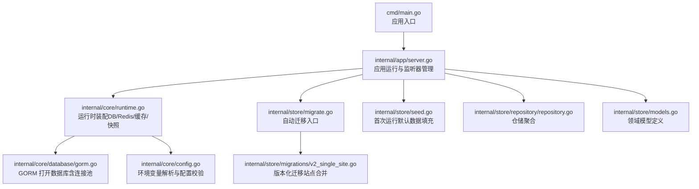
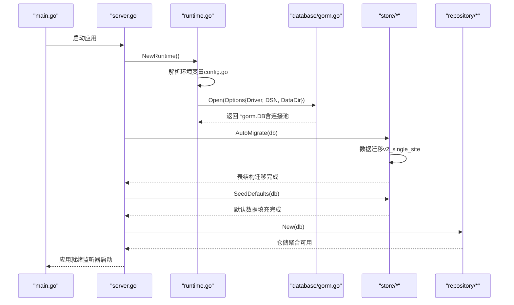
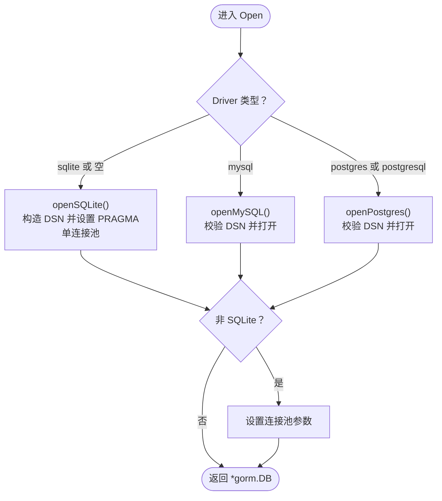
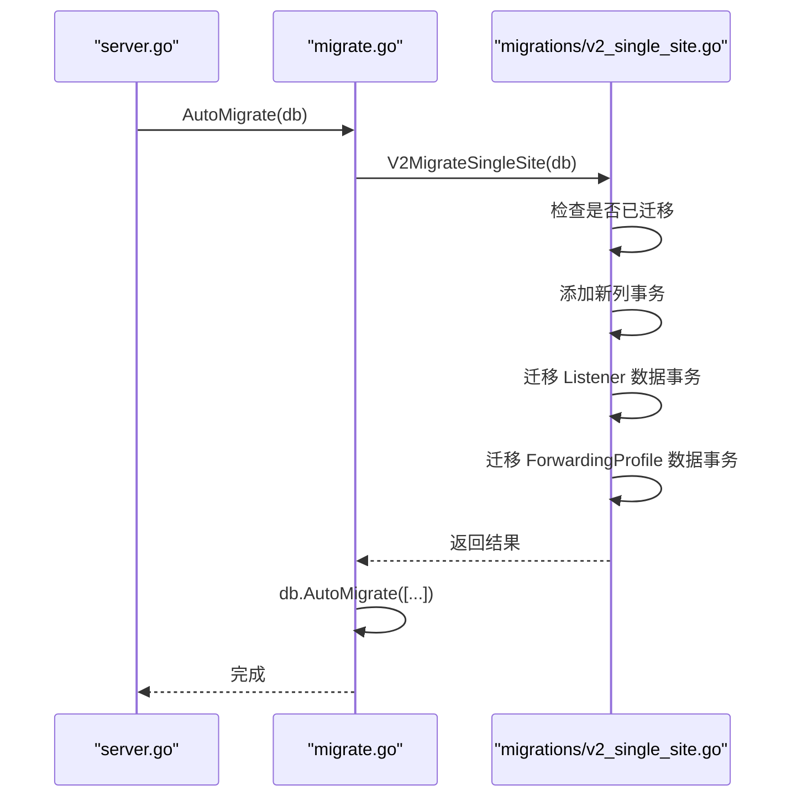
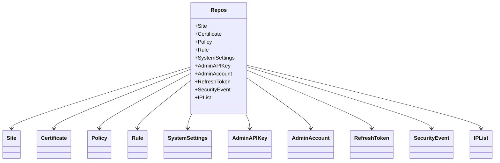
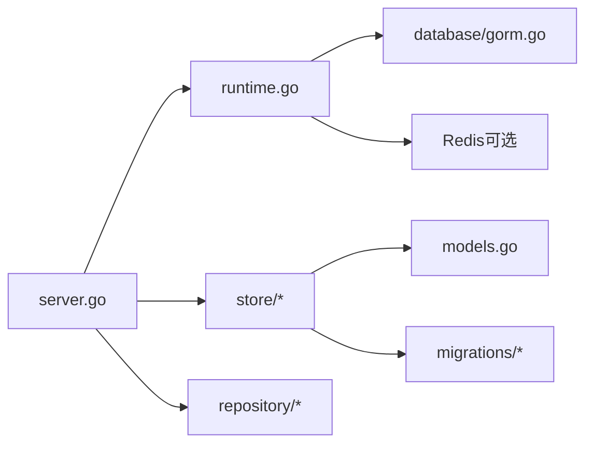

# 多数据库支持

<cite>
**本文引用的文件**
- [gorm.go](file://internal/core/database/gorm.go)
- [config.go](file://internal/core/config.go)
- [runtime.go](file://internal/core/runtime.go)
- [server.go](file://internal/app/server.go)
- [migrate.go](file://internal/store/migrate.go)
- [v2_single_site.go](file://internal/store/migrations/v2_single_site.go)
- [repository.go](file://internal/store/repository/repository.go)
- [seed.go](file://internal/store/seed.go)
- [main.go](file://cmd/main.go)
- [models.go](file://internal/store/models.go)
- [多数据库支持.md](file://docs/数据存储层/多数据库支持.md)
- [存储后端扩展.md](file://docs/扩展与插件/存储后端扩展/存储后端扩展.md)
</cite>

## 目录
1. [简介](#简介)
2. [项目结构](#项目结构)
3. [核心组件](#核心组件)
4. [架构总览](#架构总览)
5. [详细组件分析](#详细组件分析)
6. [依赖分析](#依赖分析)
7. [性能考量](#性能考量)
8. [故障排查指南](#故障排查指南)
9. [结论](#结论)
10. [附录：配置与最佳实践](#附录配置与最佳实践)

## 简介
本文件系统化阐述 My-OpenWaf 在多数据库场景下的支持能力与实现细节，覆盖以下方面：
- 驱动选择与连接配置（SQLite、MySQL、PostgreSQL）
- 方言差异与兼容性处理（SQL 语法、数据类型映射、函数差异）
- 连接池配置差异（最大连接数、空闲连接数、连接生命周期）
- 数据库选择策略（性能、特性、部署）
- 迁移脚本与数据类型转换、约束处理
- 不同数据库环境的配置示例与最佳实践

## 项目结构
围绕数据库相关的关键模块如下：
- 核心配置与运行时：负责从环境变量加载数据库参数，打开连接，并在应用启动时执行自动迁移与默认数据初始化
- 数据访问层：定义领域模型、自动迁移入口、版本化迁移脚本、仓储聚合
- 应用入口：程序启动流程，串联配置加载、数据库连接、迁移、种子数据、监听器热管理等

**图示来源**
- [main.go:1-10](file://cmd/main.go#L1-L10)
- [server.go:35-305](file://internal/app/server.go#L35-L305)
- [runtime.go:27-80](file://internal/core/runtime.go#L27-L80)
- [gorm.go:24-61](file://internal/core/database/gorm.go#L24-L61)
- [config.go:113-182](file://internal/core/config.go#L113-L182)
- [migrate.go:9-34](file://internal/store/migrate.go#L9-L34)
- [v2_single_site.go:10-188](file://internal/store/migrations/v2_single_site.go#L10-L188)
- [seed.go:13-61](file://internal/store/seed.go#L13-L61)
- [repository.go:5-32](file://internal/store/repository/repository.go#L5-L32)
- [models.go:14-412](file://internal/store/models.go#L14-L412)

**章节来源**
- [main.go:1-10](file://cmd/main.go#L1-L10)
- [server.go:35-305](file://internal/app/server.go#L35-L305)
- [runtime.go:27-80](file://internal/core/runtime.go#L27-L80)
- [config.go:113-182](file://internal/core/config.go#L113-L182)

## 核心组件
- 数据库驱动与连接
  - 支持 sqlite、mysql、postgres 三种驱动，通过统一的 Options 结构传入 Driver 与 DSN
  - 非 SQLite 场景启用连接池优化参数；SQLite 使用单连接并设置 WAL、超时、缓存、外键等 PRAGMA
- 自动迁移与版本化迁移
  - 先执行数据迁移（站点合并），再执行表结构迁移
  - 提供修订号管理，确保迁移幂等与顺序
- 领域模型与仓储
  - 定义完整的业务模型（站点、证书、规则、事件、会话等）
  - 以仓储聚合形式暴露统一的数据访问接口
- 首次运行种子数据
  - 自动生成默认 API Key 与管理员账户（仅首次）

**章节来源**
- [gorm.go:17-61](file://internal/core/database/gorm.go#L17-L61)
- [migrate.go:9-34](file://internal/store/migrate.go#L9-L34)
- [v2_single_site.go:10-188](file://internal/store/migrations/v2_single_site.go#L10-L188)
- [models.go:14-412](file://internal/store/models.go#L14-L412)
- [repository.go:5-32](file://internal/store/repository/repository.go#L5-L32)
- [seed.go:13-61](file://internal/store/seed.go#L13-L61)

## 架构总览
下图展示从应用启动到数据库连接、迁移与服务就绪的整体流程。

**图示来源**
- [main.go:7-9](file://cmd/main.go#L7-L9)
- [server.go:35-305](file://internal/app/server.go#L35-L305)
- [runtime.go:27-80](file://internal/core/runtime.go#L27-L80)
- [gorm.go:24-61](file://internal/core/database/gorm.go#L24-L61)
- [migrate.go:9-34](file://internal/store/migrate.go#L9-L34)
- [v2_single_site.go:16-166](file://internal/store/migrations/v2_single_site.go#L16-L166)
- [seed.go:13-61](file://internal/store/seed.go#L13-L61)
- [repository.go:19-32](file://internal/store/repository/repository.go#L19-L32)

## 详细组件分析

### 组件一：数据库驱动与连接配置
- 驱动选择
  - 通过环境变量驱动选择（默认 sqlite），支持 sqlite、mysql、postgres
  - DSN 规范
    - SQLite：可直接使用文件路径；若为空则落盘至 DataDir/waf.db
    - MySQL：需提供完整 DSN（包含字符集、时区等参数）
    - PostgreSQL：需提供完整 DSN（包含 sslmode 等参数）
- 连接池配置差异
  - 非 SQLite：最大连接数、空闲连接数、连接最大存活时间、空闲最大存活时间
  - SQLite：强制单连接，避免锁竞争，禁用连接最大存活限制
- SQLite 特定优化
  - WAL 日志模式、忙等待超时、同步级别、页缓存大小、外键约束等 PRAGMA

**图示来源**
- [gorm.go:24-61](file://internal/core/database/gorm.go#L24-L61)
- [gorm.go:63-94](file://internal/core/database/gorm.go#L63-L94)
- [gorm.go:96-110](file://internal/core/database/gorm.go#L96-L110)

**章节来源**
- [config.go:75-129](file://internal/core/config.go#L75-L129)
- [gorm.go:24-61](file://internal/core/database/gorm.go#L24-L61)
- [gorm.go:63-94](file://internal/core/database/gorm.go#L63-L94)
- [gorm.go:96-110](file://internal/core/database/gorm.go#L96-L110)

### 组件二：自动迁移与版本化迁移
- 自动迁移流程
  - 先执行数据迁移（站点合并），再执行表结构迁移
  - 对所有领域模型进行 AutoMigrate
- 版本化迁移（v2）
  - 将旧的 Listener 与 ForwardingProfile 合并到 Site 表
  - 通过事务保证一致性，失败回滚
  - 保留原表为备份，逐步弃用

**图示来源**
- [server.go:46-49](file://internal/app/server.go#L46-L49)
- [migrate.go:9-34](file://internal/store/migrate.go#L9-L34)
- [v2_single_site.go:16-166](file://internal/store/migrations/v2_single_site.go#L16-L166)

**章节来源**
- [migrate.go:9-34](file://internal/store/migrate.go#L9-L34)
- [v2_single_site.go:10-188](file://internal/store/migrations/v2_single_site.go#L10-L188)

### 组件三：领域模型与仓储
- 领域模型
  - 包含站点、证书、策略、规则、安全事件、会话、黑名单/白名单等
  - 使用 GORM 标签定义字段长度、索引、默认值等
- 仓储聚合
  - 以 Repos 聚合各实体仓储，便于统一注入与使用

**图示来源**
- [repository.go:5-32](file://internal/store/repository/repository.go#L5-L32)
- [models.go:14-412](file://internal/store/models.go#L14-L412)

**章节来源**
- [models.go:14-412](file://internal/store/models.go#L14-L412)
- [repository.go:5-32](file://internal/store/repository/repository.go#L5-L32)

### 组件四：首次运行种子数据
- 功能
  - 若不存在 API Key，则生成随机令牌并入库
  - 若不存在管理员账户，则生成随机密码并入库
- 适用场景
  - 初次部署或全新实例

**章节来源**
- [seed.go:13-61](file://internal/store/seed.go#L13-L61)

## 依赖分析
- 组件耦合
  - app/server.go 依赖 runtime 以获取 DB 实例
  - runtime 依赖 database/gorm.go 打开数据库
  - store 层负责迁移与模型定义，被 app/server.go 调用
- 外部依赖
  - GORM 及对应驱动（sqlite、mysql、postgres）
  - Redis（可选，用于分布式缓存与配置同步）

**图示来源**
- [server.go:35-305](file://internal/app/server.go#L35-L305)
- [runtime.go:27-80](file://internal/core/runtime.go#L27-L80)
- [gorm.go:24-61](file://internal/core/database/gorm.go#L24-L61)
- [models.go:14-412](file://internal/store/models.go#L14-L412)
- [v2_single_site.go:10-188](file://internal/store/migrations/v2_single_site.go#L10-L188)
- [repository.go:5-32](file://internal/store/repository/repository.go#L5-L32)

**章节来源**
- [server.go:35-305](file://internal/app/server.go#L35-L305)
- [runtime.go:27-80](file://internal/core/runtime.go#L27-L80)

## 性能考量
- 连接池
  - 非 SQLite：最大连接数、空闲连接数、连接最大生命周期、空闲最大生命周期均有明确设置
  - SQLite：单连接，避免并发写导致的锁争用，提升读写并发下的稳定性
- 预编译语句
  - 开启 PrepareStmt 缓存，减少重复查询的编译开销
- 日志与事务
  - 关闭默认事务包装，避免单条插入被隐式包裹事务带来的额外开销
  - 设置较低日志级别，降低调试开销

**章节来源**
- [gorm.go:26-30](file://internal/core/database/gorm.go#L26-L30)
- [gorm.go:49-58](file://internal/core/database/gorm.go#L49-L58)
- [gorm.go:85-91](file://internal/core/database/gorm.go#L85-L91)

## 故障排查指南
- 常见错误与定位
  - 驱动不支持：检查环境变量驱动值是否为 sqlite、mysql、postgres
  - DSN 缺失：MySQL/PostgreSQL 必须提供完整 DSN；SQLite 可使用文件路径或 DataDir
  - 迁移失败：关注数据迁移（站点合并）与结构迁移的先后顺序与事务回滚
  - 连接池问题：确认非 SQLite 场景的连接池参数是否合理
- 排查步骤
  - 校验环境变量（驱动、DSN、数据目录）
  - 查看应用启动日志中的数据库与 Redis 初始化信息
  - 检查迁移日志与错误码，必要时回滚并重试
  - 验证连接池状态与慢查询日志（如启用）

**章节来源**
- [config.go:113-182](file://internal/core/config.go#L113-L182)
- [server.go:46-49](file://internal/app/server.go#L46-L49)
- [migrate.go:9-34](file://internal/store/migrate.go#L9-L34)
- [v2_single_site.go:16-166](file://internal/store/migrations/v2_single_site.go#L16-L166)

## 结论
本项目通过 GORM 抽象实现了对 SQLite、MySQL、PostgreSQL 的统一接入，结合版本化迁移与仓储聚合，提供了稳定、可扩展的数据层能力。非 SQLite 场景的连接池优化与 SQLite 的 PRAGMA 调优，兼顾了性能与可靠性。建议在生产中根据部署规模与特性需求选择合适驱动，并结合连接池与日志策略进行持续优化。

## 附录：配置与最佳实践

### 环境变量与配置项
- 数据库相关
  - MY_OPENWAF_DB_DRIVER：数据库驱动（sqlite、mysql、postgres）
  - MY_OPENWAF_DSN：数据库连接字符串（MySQL/PostgreSQL 必填；SQLite 可选）
  - MY_OPENWAF_DATA：数据目录（SQLite DSN 为空时使用）
- 控制面与缓存
  - MY_OPENWAF_ADMIN_BIND：管理端绑定地址
  - MY_OPENWAF_REDIS_ADDR/PASSWORD/DB：Redis 可选配置
- 其他
  - MY_OPENWAF_JWT_SECRET：JWT 密钥（可选，未设置时自动落库）

**章节来源**
- [config.go:75-182](file://internal/core/config.go#L75-L182)

### 驱动与 DSN 示例（概念性说明）
- SQLite
  - 文件路径：直接指定绝对或相对路径
  - 未指定 DSN 时：默认在 DataDir 下创建 waf.db
- MySQL
  - 示例格式：包含用户名、密码、主机、端口、数据库名、字符集、时区等参数
- PostgreSQL
  - 示例格式：包含协议、用户名、密码、主机、端口、数据库名、SSL 模式等参数

### 方言差异与兼容性处理
- SQL 语法
  - 采用 GORM 原生 SQL 与 Raw 查询相结合的方式；对于复杂跨库操作，优先使用 Raw 并在迁移脚本中显式处理
- 数据类型映射
  - 字段长度与索引通过 GORM 标签声明；如需特殊类型（如枚举、JSON），可在模型层通过自定义类型或标签表达
- 函数调用
  - 时间与时区处理遵循 DSN 参数；日期比较与范围查询尽量使用 GORM 的时间类型与方法

### 连接池配置差异
- 非 SQLite
  - 最大连接数、空闲连接数、连接最大生命周期、空闲最大生命周期按默认值设置
- SQLite
  - 单连接，禁用连接最大生命周期，避免 WAL 模式下的锁竞争

**章节来源**
- [gorm.go:49-58](file://internal/core/database/gorm.go#L49-L58)
- [gorm.go:85-91](file://internal/core/database/gorm.go#L85-L91)

### 数据库选择策略
- SQLite
  - 适合开发测试、轻量级部署、单机场景
  - 优势：零运维、低资源占用；劣势：并发写入受限、无复制与高可用
- MySQL
  - 适合中大型部署、需要复制与高可用的场景
  - 建议：启用 utf8mb4 字符集、合理设置 innodb 参数、开启慢查询日志
- PostgreSQL
  - 适合对数据一致性与扩展性要求更高的场景
  - 建议：合理设置共享内存、连接数、WAL 参数，开启逻辑复制

### 迁移脚本与数据类型转换
- 数据迁移（站点合并）
  - 通过事务添加新列、迁移 Listener 与 ForwardingProfile 数据、更新 Sites 表
  - 保留原表为备份，后续可清理
- 结构迁移
  - 对所有领域模型执行 AutoMigrate，确保表结构与模型一致
- 约束处理
  - 使用 GORM 标签声明主键、唯一索引、普通索引与默认值
  - 复杂约束（如跨表检查）可通过 Raw SQL 在迁移脚本中实现

**章节来源**
- [v2_single_site.go:16-166](file://internal/store/migrations/v2_single_site.go#L16-L166)
- [migrate.go:9-34](file://internal/store/migrate.go#L9-L34)

### 配置示例与最佳实践
- 示例（概念性）
  - SQLite：Driver=sqlite，DSN=空或文件路径，DataDir=./data
  - MySQL：Driver=mysql，DSN=含字符集与时区参数的完整 DSN
  - PostgreSQL：Driver=postgres，DSN=含 SSL 模式的完整 DSN
- 最佳实践
  - 生产环境优先使用 MySQL/PostgreSQL，并配置连接池与监控
  - 严格区分开发/测试/生产环境的 DSN 与日志级别
  - 定期备份数据库，验证迁移脚本的幂等性与回滚路径
  - 对敏感字段（如密码哈希、令牌）进行最小化可见性与加密存储