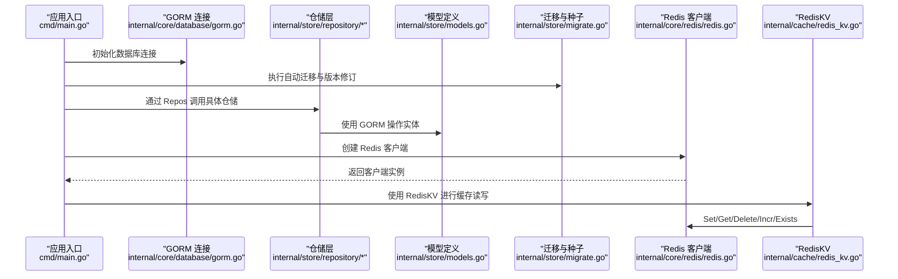
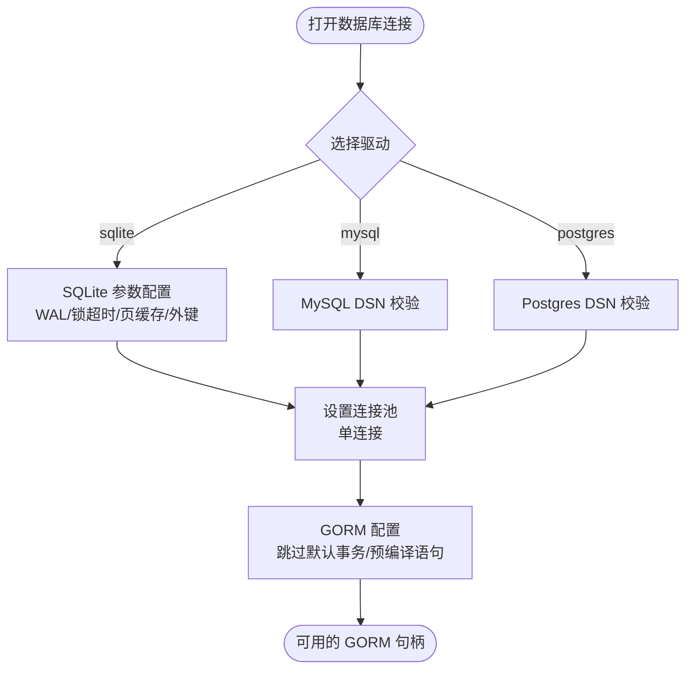
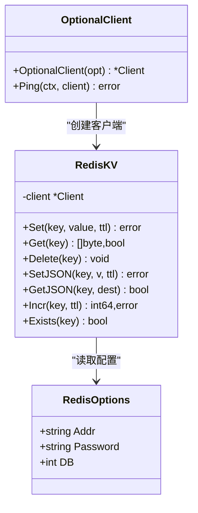
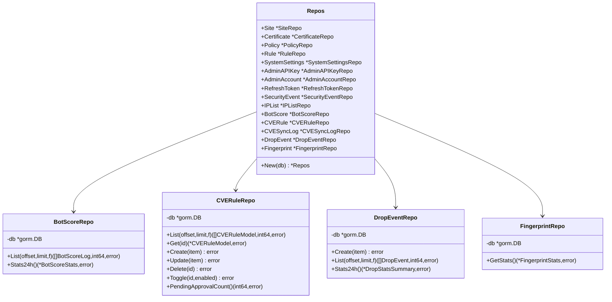
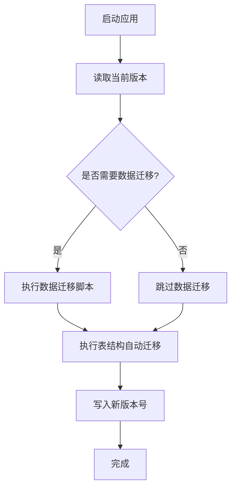
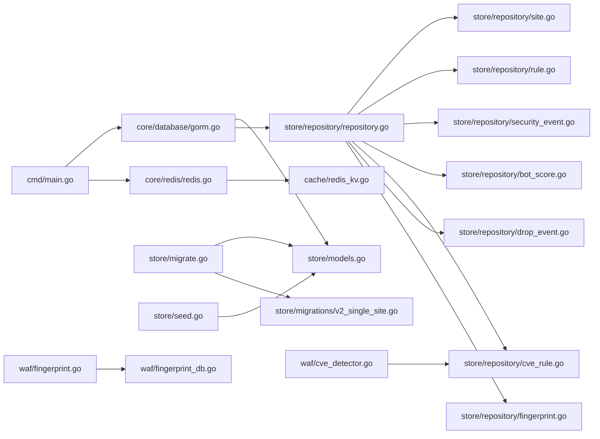

# 数据存储层

<cite>
**本文引用的文件**
- [models.go](file://internal/store/models.go)
- [gorm.go](file://internal/core/database/gorm.go)
- [repository.go](file://internal/store/repository/repository.go)
- [site.go](file://internal/store/repository/site.go)
- [policy.go](file://internal/store/repository/policy.go)
- [rule.go](file://internal/store/repository/rule.go)
- [admin_account.go](file://internal/store/repository/admin_account.go)
- [security_event.go](file://internal/store/repository/security_event.go)
- [bot_score.go](file://internal/store/repository/bot_score.go)
- [cve_rule.go](file://internal/store/repository/cve_rule.go)
- [drop_event.go](file://internal/store/repository/drop_event.go)
- [fingerprint.go](file://internal/store/repository/fingerprint.go)
- [fingerprint.go](file://internal/waf/fingerprint.go)
- [fingerprint_db.go](file://internal/waf/fingerprint_db.go)
- [cve_detector.go](file://internal/waf/cve_detector.go)
- [redis_kv.go](file://internal/cache/redis_kv.go)
- [redis.go](file://internal/core/redis/redis.go)
- [migrate.go](file://internal/store/migrate.go)
- [v2_single_site.go](file://internal/store/migrations/v2_single_site.go)
- [seed.go](file://internal/store/seed.go)
- [doc.go](file://internal/store/doc.go)
- [main.go](file://cmd/main.go)
</cite>

## 更新摘要
**所做更改**
- 新增 DropEvent、BotScoreLog、FingerprintRecord、CVESyncLog 四个数据模型的详细说明
- 更新数据库模型设计章节，包含新增模型的实体关系图
- 增强安全功能章节，详细描述新增模型的使用场景和查询接口
- 补充新增仓储模式的实现细节和索引策略
- 更新性能优化建议，针对新增模型提供专门的优化指导

## 目录
1. [简介](#简介)
2. [项目结构](#项目结构)
3. [核心组件](#核心组件)
4. [架构总览](#架构总览)
5. [详细组件分析](#详细组件分析)
6. [依赖分析](#依赖分析)
7. [性能考虑](#性能考虑)
8. [故障排查指南](#故障排查指南)
9. [结论](#结论)
10. [附录](#附录)

## 简介
本文件系统性梳理数据存储层的设计与实现，覆盖以下主题：
- 数据库模型设计：实体关系、字段定义、索引策略
- GORM 配置与使用：连接池、事务、查询优化
- 多数据库支持：SQLite、MySQL、PostgreSQL 的适配与差异
- Redis 集成：缓存策略、序列化与失效机制
- 数据访问层：仓储模式、抽象接口与依赖注入
- 数据迁移管理：版本控制、回滚策略与完整性保障
- 新增数据模型：CVE 同步日志、指纹记录、阻断事件、机器人评分日志
- 性能优化与监控指标建议

## 项目结构
数据存储层主要由以下模块构成：
- 模型定义：位于 internal/store，定义所有领域模型与字段约束
- 数据库配置：位于 internal/core/database，封装 GORM 连接与方言
- 仓储层：位于 internal/store/repository，面向实体的 CRUD 与聚合查询
- 缓存层：位于 internal/cache 与 internal/core/redis，提供 Redis 客户端与键值缓存
- 迁移与初始化：位于 internal/store，包含自动迁移、版本修订与种子数据
- 安全与防护：位于 internal/waf，包含指纹识别、CVE 检测、阻断策略等

```mermaid
graph TB
subgraph "应用入口"
MAIN["cmd/main.go"]
end
subgraph "核心配置"
CORE_DB["internal/core/database/gorm.go"]
CORE_REDIS["internal/core/redis/redis.go"]
end
subgraph "数据访问层"
REPOS["internal/store/repository/repository.go"]
SITE_REPO["internal/store/repository/site.go"]
POLICY_REPO["internal/store/repository/policy.go"]
RULE_REPO["internal/store/repository/rule.go"]
ADMIN_REPO["internal/store/repository/admin_account.go"]
EVENT_REPO["internal/store/repository/security_event.go"]
BOT_REPO["internal/store/repository/bot_score.go"]
CVE_REPO["internal/store/repository/cve_rule.go"]
DROP_REPO["internal/store/repository/drop_event.go"]
FP_REPO["internal/store/repository/fingerprint.go"]
end
subgraph "模型与迁移"
MODELS["internal/store/models.go"]
MIGRATE["internal/store/migrate.go"]
MIG_V2["internal/store/migrations/v2_single_site.go"]
SEED["internal/store/seed.go"]
end
subgraph "缓存集成"
REDIS_KV["internal/cache/redis_kv.go"]
end
subgraph "安全与防护"
FINGERPRINT["internal/waf/fingerprint.go"]
FINGERPRINT_DB["internal/waf/fingerprint_db.go"]
CVE_DETECTOR["internal/waf/cve_detector.go"]
end
MAIN --> CORE_DB
MAIN --> CORE_REDIS
CORE_DB --> MODELS
CORE_DB --> REPOS
REPOS --> SITE_REPO
REPOS --> POLICY_REPO
REPOS --> RULE_REPO
REPOS --> ADMIN_REPO
REPOS --> EVENT_REPO
REPOS --> BOT_REPO
REPOS --> CVE_REPO
REPOS --> DROP_REPO
REPOS --> FP_REPO
MIGRATE --> MODELS
MIGRATE --> MIG_V2
SEED --> MODELS
CORE_REDIS --> REDIS_KV
FINGERPRINT --> FINGERPRINT_DB
CVE_DETECTOR --> CVE_REPO
```



**图表来源**
- [main.go](file://cmd/main.go)
- [gorm.go](file://internal/core/database/gorm.go)
- [repository.go](file://internal/store/repository/repository.go)
- [models.go](file://internal/store/models.go)
- [migrate.go](file://internal/store/migrate.go)
- [v2_single_site.go](file://internal/store/migrations/v2_single_site.go)
- [seed.go](file://internal/store/seed.go)
- [redis_kv.go](file://internal/cache/redis_kv.go)
- [redis.go](file://internal/core/redis/redis.go)
- [fingerprint.go](file://internal/waf/fingerprint.go)
- [fingerprint_db.go](file://internal/waf/fingerprint_db.go)
- [cve_detector.go](file://internal/waf/cve_detector.go)

**章节来源**
- [doc.go](file://internal/store/doc.go)
- [main.go](file://cmd/main.go)

## 核心组件
- 数据库连接与方言选择：根据驱动类型（sqlite/mysql/postgres）选择对应驱动，并对非 SQLite 设置连接池参数；启用预编译语句与跳过默认事务以提升性能
- 模型与索引：为高频查询字段建立索引（如 DeletedAt、Host、Bind、RuleID、ClientIP、CreatedAt 等），并为枚举字段设置长度限制
- 仓储层：统一的 Repos 聚合对象，按实体拆分仓库，提供 CRUD 与常用聚合查询
- 缓存层：RedisKV 提供键值缓存、JSON 序列化、原子计数与 TTL 控制
- 迁移与种子：先执行数据迁移，再进行表结构迁移；提供默认管理员账户与 API Key 的种子数据
- 新增模型：CVE 同步日志、指纹记录、阻断事件、机器人评分日志，支持安全事件追踪与分析

**章节来源**
- [gorm.go](file://internal/core/database/gorm.go)
- [models.go](file://internal/store/models.go)
- [repository.go](file://internal/store/repository/repository.go)
- [redis_kv.go](file://internal/cache/redis_kv.go)
- [migrate.go](file://internal/store/migrate.go)
- [seed.go](file://internal/store/seed.go)

## 架构总览
下图展示从应用入口到数据库与缓存的整体交互流程。



**图表来源**
- [main.go](file://cmd/main.go)
- [gorm.go](file://internal/core/database/gorm.go)
- [repository.go](file://internal/store/repository/repository.go)
- [models.go](file://internal/store/models.go)
- [migrate.go](file://internal/store/migrate.go)
- [redis.go](file://internal/core/redis/redis.go)
- [redis_kv.go](file://internal/cache/redis_kv.go)

## 详细组件分析

### 数据库模型设计与索引策略
- 实体关系
  - Site 合并了 Listener 与 ForwardingProfile 的配置，减少跨表关联复杂度
  - Rule 属于 Policy，形成一对多关系
  - SecurityEvent 记录攻击事件，包含请求上下文与命中规则信息
  - BotScoreLog 记录机器人评分结果，包含各维度得分与处置动作
  - DropEvent 记录 TCP 连接阻断事件，支持按来源分类统计
  - FingerprintRecord 存储指纹统计信息，支持 JA3/JA4 等指纹分析
  - CVESyncLog 记录 CVE 供应链同步结果，包含源、状态、错误信息
  - AdminAPIKey、AdminAccount、RefreshToken 支持鉴权与会话管理
  - SystemSettings 用于全局配置键值存储
- 字段定义与约束
  - 主键统一使用自增整型 ID，并在 GORM 中声明主键
  - 删除采用软删除（DeletedAt），并在模型上添加索引以支持快速过滤
  - 枚举字段（如 RuleAction、RulePhase、IPListKind、DropEvent.Source）限定长度，避免冗余存储
  - 时间戳字段统一使用 time.Time，并在部分表上为 CreatedAt 建立索引
- 索引策略
  - 高频过滤字段：Host、Bind、RuleID、ClientIP、CreatedAt 等
  - 枚举与分类字段：Action、Phase、Category、Kind、Source 等
  - 唯一索引：Username、JTI、SystemSettings.Key 等确保唯一性
- 兼容性与迁移
  - 通过迁移脚本将旧表结构合并到新表，保留备份表以便回溯

```mermaid
erDiagram
SITE {
uint id PK
string host
string bind
string network
bool enabled
bool tls_enabled
string min_tls_version
string max_tls_version
string cipher_suites
string alpn
uint cert_id
uint policy_id
string xff_mode
string trusted_cidr
bool preserve_original_host
int64 max_body_bytes
bool upstream_tls_skip_verify
string upstream_tls_server_name
bool maintenance_enabled
string maintenance_html
int maintenance_status
string block_html
int block_status
}
CERTIFICATE {
uint id PK
string name
text cert_pem
text key_pem
time created_at
time updated_at
time deleted_at
}
POLICY {
uint id PK
string name
time created_at
time updated_at
time deleted_at
}
RULE {
uint id PK
uint policy_id FK
string name
string phase
text pattern
string action
int priority
bool enabled
time created_at
time updated_at
time deleted_at
}
ADMIN_ACCOUNT {
uint id PK
string username UK
string password_hash
time updated_at
}
ADMIN_API_KEY {
uint id PK
string name
string token_hash
time last_used_at
time created_at
time updated_at
time deleted_at
}
REFRESH_TOKEN {
uint id PK
string jti UK
string token_hash
time expires_at
bool revoked
string replaced_by
time created_at
}
SYSTEM_SETTINGS {
uint id PK
string key UK
text value
}
IP_LIST_ENTRY {
uint id PK
string kind
string value
string note
bool enabled
time created_at
time updated_at
time deleted_at
}
SECURITY_EVENT {
uint id PK
time created_at
string request_id
string client_ip
string host
string path
string method
string user_agent
uint rule_id
string rule_id_str
string phase
string action
string category
string match_desc
string geo_country
string geo_city
int status_code
}
BOT_SCORE_LOG {
uint id PK
string client_ip IDX
string host
string path
int total_score IDX
int geoip_score
int fingerprint_score
int behavior_score
int ip_rep_score
bool is_high_risk
string action
text details
time created_at IDX
}
DROP_EVENT {
uint id PK
string client_ip IDX
string source
string rule_id
string detail
string host
string path
time created_at IDX
}
FINGERPRINT_RECORD {
uint id PK
string ja3_hash IDX
string browser
int64 count
time last_seen
bool is_known_good
}
CVE_SYNC_LOG {
uint id PK
string source
string status
int rules_added
string error
time started_at
time finished_at
}
POLICY ||--o{ RULE : "rules"
SITE }o--|| CERTIFICATE : "cert_id"
SITE }o--|| POLICY : "policy_id"
```

**图表来源**
- [models.go](file://internal/store/models.go)

**章节来源**
- [models.go](file://internal/store/models.go)

### GORM 配置与使用
- 方言与连接
  - 支持 sqlite、mysql、postgres 三种驱动，通过环境变量选择
  - SQLite 默认使用 WAL 模式、锁超时、页缓存与外键约束
  - 非 SQLite 设置最大连接数、空闲连接、连接生命周期与空闲时间
- 事务与预编译
  - 关闭默认事务以避免单条插入被包裹事务带来的开销
  - 启用 PrepareStmt 缓存预编译语句，降低重复解析成本
- 查询优化
  - 仓储层使用索引字段作为过滤条件（如 Host、Bind、RuleID、ClientIP、CreatedAt）
  - 聚合查询使用分组与排序，避免一次性加载全量数据
  - 批量写入使用 CreateInBatches 提升吞吐



**图表来源**
- [gorm.go](file://internal/core/database/gorm.go)

**章节来源**
- [gorm.go](file://internal/core/database/gorm.go)

### 多数据库支持与差异处理
- SQLite
  - 适用于开发与轻量部署；自动创建数据库文件，WAL 模式提升并发读取能力
  - 单连接策略避免锁竞争
- MySQL
  - 通过 DSN 连接，需确保字符集与时区配置正确
- PostgreSQL
  - 通过 DSN 连接，注意 SSL 模式与时区设置
- 差异点
  - SQLite 不支持连接池参数，采用单连接
  - 聚合函数与日期格式在不同方言间存在差异，迁移脚本中使用兼容语法

**章节来源**
- [gorm.go](file://internal/core/database/gorm.go)
- [v2_single_site.go](file://internal/store/migrations/v2_single_site.go)

### Redis 集成与缓存策略
- 客户端与连接
  - OptionalClient 根据配置创建 Redis 客户端，Ping 检测连通性
- 键空间与序列化
  - RedisKV 统一键前缀，提供字节与 JSON 两种存储方式
  - JSON 存储使用标准库序列化，便于跨语言读取
- 失效与原子操作
  - Set/Get/Delete/Exists 提供基础操作
  - Incr 结合管道实现原子递增与 TTL 更新
- 使用场景
  - API 响应缓存、限流元数据、IP 黑名单同步等分布式共享状态



**图表来源**
- [redis.go](file://internal/core/redis/redis.go)
- [redis_kv.go](file://internal/cache/redis_kv.go)

**章节来源**
- [redis.go](file://internal/core/redis/redis.go)
- [redis_kv.go](file://internal/cache/redis_kv.go)

### 数据访问层设计：仓储模式、抽象接口与依赖注入
- Repos 聚合
  - 将所有实体仓库聚合在一个结构体内，便于集中初始化与注入
  - 新增 BotScoreRepo、CVERuleRepo、CVESyncLogRepo、DropEventRepo、FingerprintRepo
- 仓储接口
  - 每个实体拥有独立仓库，提供列表、分页、过滤、聚合统计等方法
  - 通过 GORM 的 Where/Order/Limit/Offset 实现灵活查询
- 依赖注入
  - 通过 New*Repo 构造函数注入 *gorm.DB，实现松耦合
- 新增仓储功能
  - BotScoreRepo：支持按分数范围、时间范围、IP 过滤的机器人评分日志查询
  - CVERuleRepo：支持按类别、严重性、启用状态、来源过滤的 CVE 规则查询
  - DropEventRepo：支持按来源、时间范围过滤的阻断事件查询与 24 小时统计
  - FingerprintRepo：提供指纹统计、浏览器分布、Top JA3 排行等聚合查询



**图表来源**
- [repository.go](file://internal/store/repository/repository.go)
- [bot_score.go](file://internal/store/repository/bot_score.go)
- [cve_rule.go](file://internal/store/repository/cve_rule.go)
- [drop_event.go](file://internal/store/repository/drop_event.go)
- [fingerprint.go](file://internal/store/repository/fingerprint.go)

**章节来源**
- [repository.go](file://internal/store/repository/repository.go)
- [bot_score.go](file://internal/store/repository/bot_score.go)
- [cve_rule.go](file://internal/store/repository/cve_rule.go)
- [drop_event.go](file://internal/store/repository/drop_event.go)
- [fingerprint.go](file://internal/store/repository/fingerprint.go)

### 数据迁移管理：版本控制、回滚策略与完整性保障
- 自动迁移
  - 先执行数据迁移（如 v2_single_site），再进行表结构迁移
  - 使用 ConfigRevision 记录当前版本，提供递增与查询
- 数据迁移脚本
  - v2_single_site 将 Listener 与 ForwardingProfile 的配置迁移到 Site，并保留备份表
  - 通过事务包裹迁移步骤，失败时整体回滚
- 种子数据
  - 首次运行生成默认 API Key 与管理员账户，密码使用 bcrypt 哈希存储
- 完整性保障
  - 软删除（DeletedAt）与唯一索引（Username/JTI/SystemSettings.Key）
  - 枚举字段长度限制与默认值，减少脏数据



**图表来源**
- [migrate.go](file://internal/store/migrate.go)
- [v2_single_site.go](file://internal/store/migrations/v2_single_site.go)
- [seed.go](file://internal/store/seed.go)

**章节来源**
- [migrate.go](file://internal/store/migrate.go)
- [v2_single_site.go](file://internal/store/migrations/v2_single_site.go)
- [seed.go](file://internal/store/seed.go)

### 新增数据模型与安全功能

#### CVE 同步日志模型
- CVESyncLog 记录 CVE 供应链同步结果
- 字段：源（nvd/github）、状态（success/failed/running）、新增规则数、错误信息、开始/结束时间
- 索引：CreatedAt 用于时间范围查询
- 用途：监控 CVE 规则同步状态，记录同步历史

#### 指纹记录模型
- FingerprintRecord 存储指纹统计信息
- 字段：JA3/JA4 哈希、浏览器类型、计数、最后出现时间、是否已知良好
- 索引：JA3Hash 用于快速查找特定指纹
- 用途：指纹统计分析，识别恶意或正常指纹模式

#### 阻断事件模型
- DropEvent 记录 TCP 连接阻断事件
- 字段：客户端 IP、来源（bot/cve/rule/ip_reputation）、规则 ID、详情、主机、路径、时间戳
- 索引：ClientIP、CreatedAt 用于快速检索
- 用途：阻断事件追踪，按来源统计阻断趋势

#### 机器人评分日志模型
- BotScoreLog 记录机器人评分评估结果
- 字段：客户端 IP、主机、路径、总分、各维度得分、是否高风险、处置动作、详情、时间戳
- 索引：ClientIP、TotalScore、CreatedAt 用于评分筛选
- 用途：机器人检测效果评估，处置策略优化

#### 指纹识别与数据库
- FingerprintInfo：提取请求中的指纹信息（JA3/JA4、TLS 版本、HTTP/2 设置等）
- FingerprintScorer：基于已知指纹数据库进行评分
- FingerprintDB：内置浏览器指纹、恶意工具指纹、HTTP/2 设置配置
- DefaultFingerprintDB：提供默认指纹数据库，包含主流浏览器和常见工具的指纹特征

#### CVE 检测器
- CVEDetector：协调多技术栈 CVE 检测（PHP、Java、Node.js、通用规则）
- CustomCVERule：用户自定义 CVE 规则，支持正则表达式匹配
- 多线程检测：并行执行各类检测器，提升检测效率
- 热重载：支持动态加载和更新自定义规则

**章节来源**
- [models.go](file://internal/store/models.go)
- [fingerprint.go](file://internal/waf/fingerprint.go)
- [fingerprint_db.go](file://internal/waf/fingerprint_db.go)
- [cve_detector.go](file://internal/waf/cve_detector.go)

## 依赖分析
- 组件耦合
  - 仓储层仅依赖 GORM 与模型定义，保持低耦合
  - Repos 作为依赖注入中心，避免循环导入
  - 新增仓储与安全模块解耦，通过接口进行通信
- 外部依赖
  - GORM：ORM 框架与方言驱动
  - Redis：go-redis 客户端
  - bcrypt：密码哈希
  - 正则表达式：CVE 规则匹配
- 潜在风险
  - SQLite 单连接限制可能影响高并发写入
  - 聚合查询在大数据量下需配合分页与索引优化
  - 指纹数据库需要定期更新以保持有效性



**图表来源**
- [main.go](file://cmd/main.go)
- [gorm.go](file://internal/core/database/gorm.go)
- [repository.go](file://internal/store/repository/repository.go)
- [models.go](file://internal/store/models.go)
- [migrate.go](file://internal/store/migrate.go)
- [v2_single_site.go](file://internal/store/migrations/v2_single_site.go)
- [seed.go](file://internal/store/seed.go)
- [redis_kv.go](file://internal/cache/redis_kv.go)
- [redis.go](file://internal/core/redis/redis.go)
- [fingerprint.go](file://internal/waf/fingerprint.go)
- [fingerprint_db.go](file://internal/waf/fingerprint_db.go)
- [cve_detector.go](file://internal/waf/cve_detector.go)

**章节来源**
- [main.go](file://cmd/main.go)
- [repository.go](file://internal/store/repository/repository.go)

## 性能考虑
- 连接池
  - 非 SQLite 设置 MaxOpenConns/MaxIdleConns，合理配置连接生命周期
- 查询优化
  - 为高频过滤字段建立索引；使用 Limit/Offset 分页
  - 聚合查询使用 Group/Order 并限制结果集大小
  - 新增模型的索引策略：BotScoreLog(ClientIP, TotalScore, CreatedAt)、DropEvent(ClientIP, CreatedAt)、FingerprintRecord(JA3Hash)
- 写入优化
  - 使用 CreateInBatches 批量写入安全事件
  - 避免默认事务包裹单条写入
  - 指纹统计使用原子操作更新计数
- 缓存策略
  - 对热点数据使用 RedisKV 缓存，结合 TTL 与原子递增
  - JSON 序列化适合跨语言场景，注意序列化开销
- 新增模型优化
  - CVE 同步日志使用 Latest 查询最近记录
  - 指纹统计使用聚合查询减少往返次数
  - 阻断事件按来源分类统计，支持快速趋势分析

## 故障排查指南
- 数据库连接失败
  - 检查驱动类型与 DSN 是否正确；SQLite 路径是否存在可写权限
- 迁移异常
  - 查看迁移脚本输出，确认事务包裹内的每一步是否成功
  - 若出现备份表冲突，检查时间戳后缀是否唯一
- 密码验证失败
  - 确认 bcrypt 哈希是否正确生成与存储
- Redis 不可用
  - 使用 Ping 检测连通性；检查地址、密码与数据库编号
- 新增模型问题
  - 指纹数据库加载失败：检查指纹数据库文件完整性
  - CVE 规则同步失败：查看 CVESyncLog 错误信息
  - 阻断事件统计异常：确认 DropEvent 索引是否正确创建

**章节来源**
- [gorm.go](file://internal/core/database/gorm.go)
- [migrate.go](file://internal/store/migrate.go)
- [admin_account.go](file://internal/store/repository/admin_account.go)
- [redis.go](file://internal/core/redis/redis.go)
- [models.go](file://internal/store/models.go)

## 结论
该数据存储层以 GORM 为核心，结合仓储模式与 Redis 缓存，提供了清晰的分层与良好的扩展性。通过迁移脚本与种子数据保障了部署一致性与初始可用性。新增的 CVE 同步日志、指纹记录、阻断事件、机器人评分日志等模型，增强了系统的安全监控与分析能力。建议在生产环境中进一步完善监控指标（连接池利用率、慢查询、缓存命中率、安全事件统计）与容量规划（索引维护、批量写入窗口、指纹数据库更新）。

## 附录
- 监控指标建议
  - 数据库：活跃连接数、等待队列长度、慢查询数量、DDL/DML 次数
  - Redis：命令耗时分布、内存使用、键空间大小、过期键比例
  - 应用：仓储调用延迟分位、错误率、重试次数
  - 安全：CVE 同步成功率、指纹识别准确率、阻断事件数量、机器人评分分布
- 新增模型使用建议
  - 定期清理过期的阻断事件和机器人评分日志
  - 监控 CVE 同步状态，及时发现同步失败
  - 定期更新指纹数据库，保持指纹识别准确性
  - 建立安全事件告警机制，对异常模式及时响应