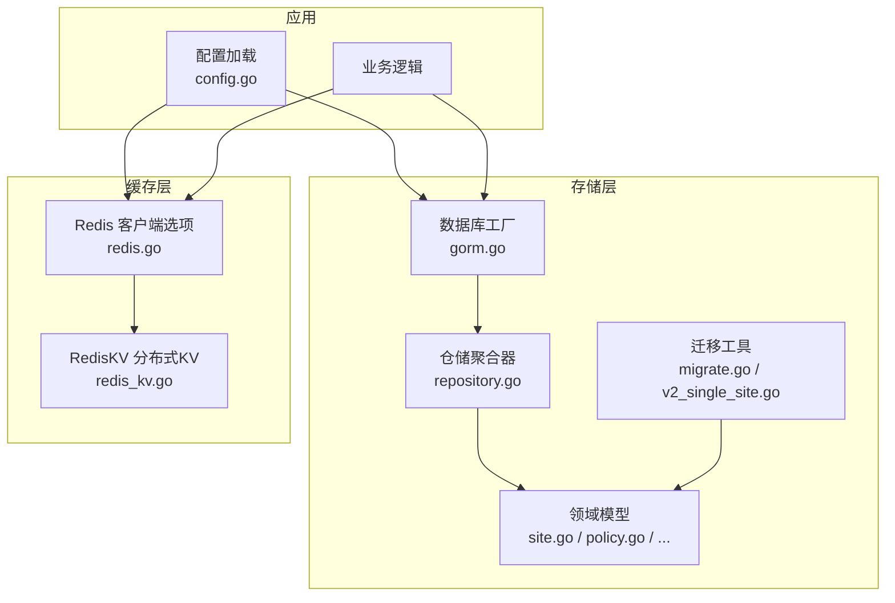
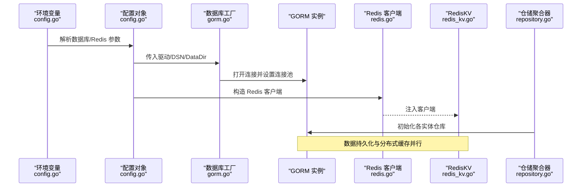
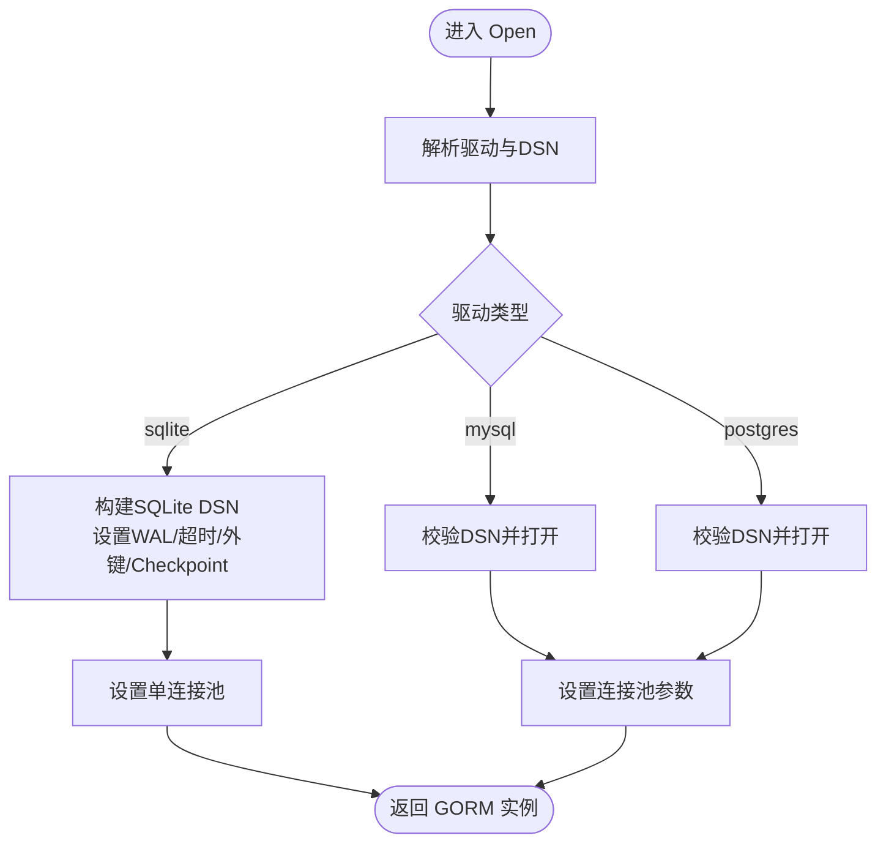
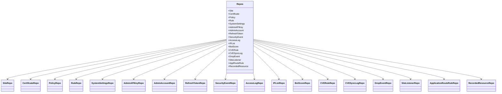
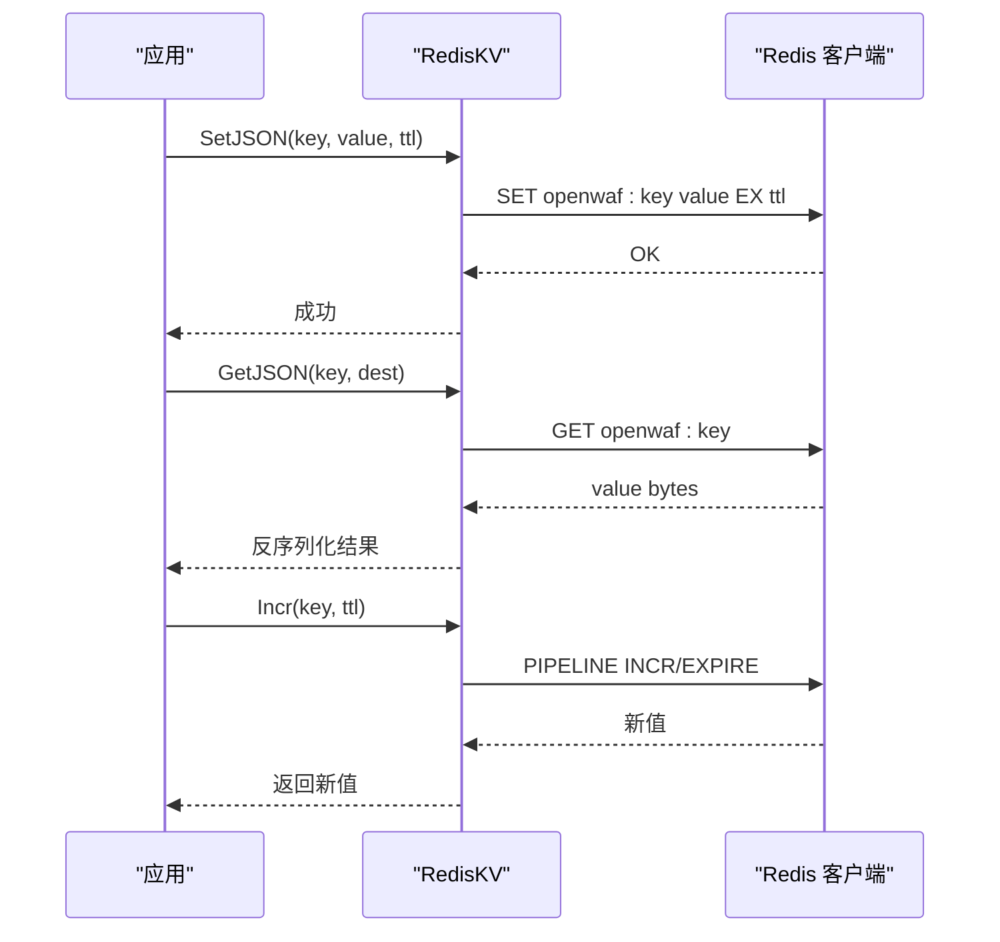
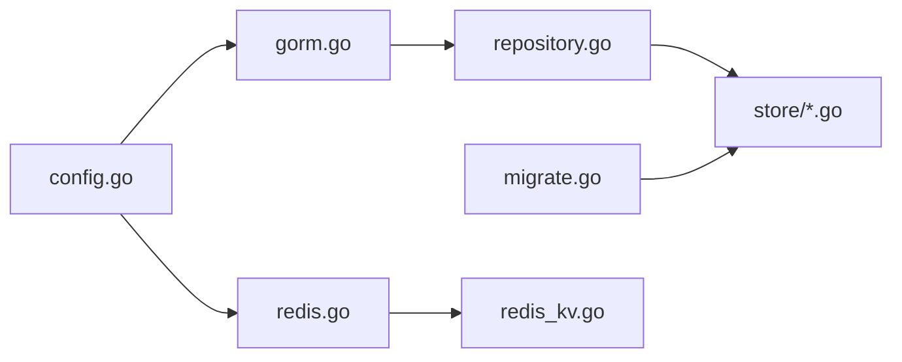

# 数据存储层

<cite>
**本文引用的文件**
- [gorm.go](file://internal/core/database/gorm.go)
- [redis.go](file://internal/core/redis/redis.go)
- [redis_kv.go](file://internal/cache/redis_kv.go)
- [repository.go](file://internal/store/repository/repository.go)
- [site.go](file://internal/store/site.go)
- [policy.go](file://internal/store/policy.go)
- [certificate.go](file://internal/store/certificate.go)
- [auth.go](file://internal/store/auth.go)
- [events.go](file://internal/store/events.go)
- [ip_list.go](file://internal/store/ip_list.go)
- [system.go](file://internal/store/system.go)
- [migrate.go](file://internal/store/migrate.go)
- [v2_single_site.go](file://internal/store/migrations/v2_single_site.go)
- [config.go](file://internal/core/config.go)
</cite>

## 目录
1. [引言](#引言)
2. [项目结构](#项目结构)
3. [核心组件](#核心组件)
4. [架构总览](#架构总览)
5. [组件详细分析](#组件详细分析)
6. [依赖关系分析](#依赖关系分析)
7. [性能考量](#性能考量)
8. [故障排查指南](#故障排查指南)
9. [结论](#结论)
10. [附录](#附录)

## 引言
本章节面向数据存储层，系统化阐述 GORM ORM 的配置与使用、Redis 缓存集成与分布式缓存策略、多数据库支持与切换机制、数据库模型设计原则与实体关系、数据访问层设计模式与最佳实践，并提供可落地的配置示例与性能优化建议。目标是帮助开发者在不深入源码细节的前提下，快速理解并正确使用该存储层。

## 项目结构
数据存储层主要由以下模块构成：
- 数据库连接与方言：通过统一工厂函数按驱动类型打开连接，内置 SQLite/WAL、MySQL、Postgres 的参数与连接池调优。
- 数据访问层（Repository）：以聚合器集中管理所有实体仓库，提供一致的 CRUD 与复杂查询接口。
- 模型与迁移：基于 GORM 的结构体定义与 AutoMigrate，配合版本化迁移脚本保证演进兼容。
- 缓存层：Redis 客户端封装与键空间前缀，提供键值缓存、JSON 序列化、原子计数等能力；另有独立的 RedisKV 用于跨节点共享状态。
- 配置加载：从环境变量解析数据库与 Redis 参数，支持运行时切换。

图表来源
- [config.go:113-182](file://internal/core/config.go#L113-L182)
- [gorm.go:24-61](file://internal/core/database/gorm.go#L24-L61)
- [repository.go:27-48](file://internal/store/repository/repository.go#L27-L48)
- [migrate.go:9-41](file://internal/store/migrate.go#L9-L41)
- [redis.go:17-38](file://internal/core/redis/redis.go#L17-L38)
- [redis_kv.go:13-29](file://internal/cache/redis_kv.go#L13-L29)

章节来源
- [config.go:74-102](file://internal/core/config.go#L74-L102)
- [gorm.go:17-61](file://internal/core/database/gorm.go#L17-L61)
- [repository.go:5-25](file://internal/store/repository/repository.go#L5-L25)
- [migrate.go:9-41](file://internal/store/migrate.go#L9-L41)
- [redis.go:10-38](file://internal/core/redis/redis.go#L10-L38)
- [redis_kv.go:11-29](file://internal/cache/redis_kv.go#L11-L29)

## 核心组件
- 数据库工厂与连接池
  - 支持 sqlite/mysql/postgres 三种驱动，自动设置日志级别、跳过默认事务、预编译语句缓存。
  - 非 SQLite 使用固定连接池上限与空闲时间，避免资源争用。
  - SQLite 使用 WAL、超时等待、外键约束与自动 checkpoint 等参数提升并发与稳定性。
- 仓储聚合器
  - 将站点、证书、策略、规则、系统设置、管理员账户、登录事件、访问日志、IP 黑白名单、CVE 规则等实体的仓库集中管理，便于注入与复用。
- 模型与索引
  - 模型字段包含主键、软删除索引、常用查询索引，确保常见查询具备良好性能。
  - JSON 字段用于灵活配置（如站点自定义错误页、转发规则），并提供序列化/反序列化辅助方法。
- 迁移与版本控制
  - 先执行数据迁移（如 v2 合并监听器与转发配置），再执行结构迁移，确保历史数据与新表结构兼容。
  - 提供修订号（ConfigRevision）递增与查询，便于快照与一致性校验。
- Redis 客户端与分布式缓存
  - OptionalClient 根据配置决定是否启用 Redis；Ping 用于健康检查。
  - RedisKV 提供键空间前缀、TTL、JSON 序列化、原子计数、存在性判断等能力，适合跨节点共享状态（如速率限制元数据、IP 封禁同步）。

章节来源
- [gorm.go:24-112](file://internal/core/database/gorm.go#L24-L112)
- [repository.go:27-48](file://internal/store/repository/repository.go#L27-L48)
- [site.go:16-81](file://internal/store/site.go#L16-L81)
- [policy.go:9-77](file://internal/store/policy.go#L9-L77)
- [migrate.go:9-60](file://internal/store/migrate.go#L9-L60)
- [v2_single_site.go:10-50](file://internal/store/migrations/v2_single_site.go#L10-L50)
- [redis.go:17-38](file://internal/core/redis/redis.go#L17-L38)
- [redis_kv.go:13-113](file://internal/cache/redis_kv.go#L13-L113)

## 架构总览
下图展示从配置到数据库与缓存的整体调用链路，以及仓储层对模型的封装关系。

图表来源
- [config.go:113-182](file://internal/core/config.go#L113-L182)
- [gorm.go:24-61](file://internal/core/database/gorm.go#L24-L61)
- [redis.go:17-38](file://internal/core/redis/redis.go#L17-L38)
- [redis_kv.go:24-29](file://internal/cache/redis_kv.go#L24-L29)
- [repository.go:27-48](file://internal/store/repository/repository.go#L27-L48)

## 组件详细分析

### 数据库工厂与多数据库支持
- 驱动选择与 DSN 解析
  - 通过驱动名称选择对应驱动，支持空驱动回退为 sqlite。
  - MySQL/Postgres 要求显式 DSN；SQLite 支持 DSN 或 DataDir 下默认路径。
- 连接池与性能调优
  - 非 SQLite 设置最大连接数、空闲连接数、连接最长存活时间与空闲时间。
  - SQLite 单连接策略避免锁竞争，同时启用 WAL、超时等待、外键与自动 checkpoint。
- 日志与预编译
  - 调整 GORM 日志级别，关闭默认事务包裹，开启 PrepareStmt 缓存提升重复查询性能。

图表来源
- [gorm.go:24-112](file://internal/core/database/gorm.go#L24-L112)

章节来源
- [gorm.go:17-112](file://internal/core/database/gorm.go#L17-L112)

### 仓储聚合器与数据访问层设计
- 仓储聚合器 Repos 将所有实体仓库集中初始化，便于统一注入 GORM 实例。
- 每个实体仓库提供标准 CRUD 与组合查询（如分页、条件过滤、关联删除事务）。
- 设计模式
  - 仓储模式：将数据访问逻辑封装在仓库中，隔离业务与持久化细节。
  - 工厂模式：通过 NewXxxRepo 统一创建仓库实例。
  - 事务边界：对需要一致性的复合操作使用事务包裹（如删除站点及其监听器）。

图表来源
- [repository.go:5-48](file://internal/store/repository/repository.go#L5-L48)

章节来源
- [repository.go:5-48](file://internal/store/repository/repository.go#L5-L48)

### 数据模型设计与实体关系
- 主键与软删除
  - 所有模型均包含主键、CreatedAt、UpdatedAt、DeletedAt（带索引），便于审计与级联删除。
- 查询索引
  - 在高频查询字段上建立索引（如站点绑定地址、规则所属策略、事件创建时间与动作分类等）。
- JSON 字段与序列化
  - 站点自定义错误页、转发规则、缓存规则等采用 JSON 字段存储，配套提供序列化/反序列化方法。
- 关系与约束
  - 规则属于策略（PolicyID 外键），站点包含多个监听器（SiteListener），证书与站点/监听器可选关联。
  - IP 黑白名单区分类型与启用状态，支持按值与类型索引快速匹配。

```mermaid
erDiagram
SITE {
uint id PK
string host
string bind
bool enabled
uint cert_id
uint policy_id
}
SITE_LISTENER {
uint id PK
uint site_id FK
string bind
bool enabled
uint cert_id
}
CERTIFICATE {
uint id PK
string name
text cert_pem
text key_pem
}
POLICY {
uint id PK
string name
}
RULE {
uint id PK
uint policy_id FK
string phase
string pattern
string action
int priority
bool enabled
}
ADMIN_ACCOUNT {
uint id PK
string username UK
string password_hash
}
ADMIN_API_KEY {
uint id PK
string name
string token_hash
}
REFRESH_TOKEN {
uint id PK
string jti UK
string token_hash
string username
string role
datetime expires_at
bool revoked
}
SECURITY_EVENT {
uint id PK
datetime created_at
uint site_id
string request_id
string client_ip
string action
string category
}
ACCESS_LOG {
uint id PK
datetime created_at
uint site_id
string request_id
string client_ip
int status_code
string waf_action
}
IP_LIST_ENTRY {
uint id PK
string kind
string value
bool enabled
}
BOT_SCORE_LOG {
uint id PK
string client_ip
int total_score
datetime created_at
}
DROP_EVENT {
uint id PK
uint site_id
string client_ip
string source
datetime created_at
}
CVERULE_RECORD {
uint id PK
string name
string severity
}
CVESYNC_LOG {
uint id PK
string feed
datetime started_at
datetime finished_at
}
APPLICATION_ROUTE_RULE {
uint id PK
string path_prefix
text upstreams
bool enabled
}
RECORDED_RESOURCE {
uint id PK
string name
text metadata
}
SITE }o--|| CERTIFICATE : "可能关联"
SITE }o--o{ SITE_LISTENER : "包含多个"
POLICY ||--o{ RULE : "包含多个"
SITE ||--o{ SECURITY_EVENT : "产生事件"
SITE ||--o{ ACCESS_LOG : "产生日志"
SITE ||--o{ DROP_EVENT : "产生丢弃事件"
SITE ||--o{ IP_LIST_ENTRY : "受黑白名单影响"
SITE ||--o{ APPLICATION_ROUTE_RULE : "路由规则"
SITE ||--o{ RECORDED_RESOURCE : "记录资源"
```

图表来源
- [site.go:16-156](file://internal/store/site.go#L16-L156)
- [policy.go:9-77](file://internal/store/policy.go#L9-L77)
- [certificate.go:9-19](file://internal/store/certificate.go#L9-L19)
- [auth.go:9-79](file://internal/store/auth.go#L9-L79)
- [events.go:5-81](file://internal/store/events.go#L5-L81)
- [ip_list.go:16-28](file://internal/store/ip_list.go#L16-L28)
- [system.go:3-14](file://internal/store/system.go#L3-L14)

章节来源
- [site.go:16-156](file://internal/store/site.go#L16-L156)
- [policy.go:9-77](file://internal/store/policy.go#L9-L77)
- [certificate.go:9-19](file://internal/store/certificate.go#L9-L19)
- [auth.go:9-79](file://internal/store/auth.go#L9-L79)
- [events.go:5-81](file://internal/store/events.go#L5-L81)
- [ip_list.go:16-28](file://internal/store/ip_list.go#L16-L28)
- [system.go:3-14](file://internal/store/system.go#L3-L14)

### Redis 缓存系统与分布式缓存策略
- 客户端与健康检查
  - OptionalClient 根据地址是否为空决定是否启用 Redis；Ping 用于连通性检查。
- RedisKV 能力
  - 键空间前缀统一命名，避免冲突。
  - 支持字节值与 JSON 值读写、TTL、原子计数、存在性判断。
  - 使用 Pipeline 执行 Incr 与 Expire，保证原子性与一致性。
- 分布式缓存策略
  - 适用于跨节点共享的状态：API 响应缓存、速率限制元数据、IP 封禁同步等。
  - 建议为热点键设置合理 TTL，结合业务场景选择合适序列化方式（JSON 适合结构化数据，字节适合二进制或压缩数据）。

图表来源
- [redis_kv.go:31-101](file://internal/cache/redis_kv.go#L31-L101)

章节来源
- [redis.go:17-38](file://internal/core/redis/redis.go#L17-L38)
- [redis_kv.go:13-113](file://internal/cache/redis_kv.go#L13-L113)

### 多数据库支持与切换机制
- 驱动与 DSN
  - 通过环境变量选择驱动与 DSN；未指定时回退到 SQLite 并在 DataDir 下生成默认文件路径。
- 切换步骤
  - 更新环境变量（驱动、DSN、DataDir）后重启进程；工厂函数根据新配置重新打开连接。
  - 非 SQLite 的连接池参数需与目标数据库特性匹配（如连接数、超时）。
- 迁移兼容
  - 运行 AutoMigrate 前先执行数据迁移脚本，确保历史数据与新结构兼容。

章节来源
- [config.go:113-182](file://internal/core/config.go#L113-L182)
- [gorm.go:35-44](file://internal/core/database/gorm.go#L35-L44)
- [migrate.go:9-41](file://internal/store/migrate.go#L9-L41)
- [v2_single_site.go:16-50](file://internal/store/migrations/v2_single_site.go#L16-L50)

### 数据库模型设计原则与约束定义
- 命名与可读性
  - 字段名遵循驼峰，JSON 暴露名清晰表达含义；注释说明默认值与约束。
- 约束与索引
  - 主键唯一、软删除索引、常用查询字段索引（如站点绑定地址、规则相位/动作、事件分类/动作等）。
- JSON 结构化
  - 对于动态配置（如站点自定义错误页、转发规则、缓存规则），采用 JSON 字段并提供序列化/反序列化方法。
- 外键与级联
  - 明确实体间的外键关系，结合仓储层事务保证一致性（如删除站点时级联删除其监听器）。

章节来源
- [site.go:83-107](file://internal/store/site.go#L83-L107)
- [events.go:8-29](file://internal/store/events.go#L8-L29)
- [policy.go:68-77](file://internal/store/policy.go#L68-L77)
- [ip_list.go:23-28](file://internal/store/ip_list.go#L23-L28)

### 数据访问层设计模式与最佳实践
- 仓储模式
  - 将 CRUD 与复杂查询封装在仓库中，业务层仅依赖接口，降低耦合。
- 工厂与聚合
  - Repos 聚合所有仓库，统一初始化与注入，减少重复代码。
- 事务与一致性
  - 对涉及多表或多步骤的操作使用事务，确保原子性（如删除站点与其监听器）。
- 查询优化
  - 使用索引字段进行过滤与排序；分页查询使用 Offset/Limit；避免 N+1 查询。
- 错误处理
  - 仓储方法返回底层错误，便于上层统一处理；避免吞掉错误。

章节来源
- [repository.go:27-48](file://internal/store/repository/repository.go#L27-L48)
- [site.go:46-53](file://internal/store/site.go#L46-L53)

## 依赖关系分析
- 组件内聚与解耦
  - 数据库工厂与仓储层通过 GORM 实例解耦；Redis 客户端与 KV 层通过接口解耦。
- 外部依赖
  - GORM 作为 ORM 框架；go-redis 作为 Redis 客户端；不同驱动分别来自第三方库。
- 循环依赖规避
  - 数据库工厂定义 Options 避免与核心包循环导入；仓储聚合器集中初始化，避免交叉依赖。

图表来源
- [config.go:113-182](file://internal/core/config.go#L113-L182)
- [gorm.go:24-61](file://internal/core/database/gorm.go#L24-L61)
- [repository.go:27-48](file://internal/store/repository/repository.go#L27-L48)
- [migrate.go:9-41](file://internal/store/migrate.go#L9-L41)
- [redis.go:17-38](file://internal/core/redis/redis.go#L17-L38)
- [redis_kv.go:24-29](file://internal/cache/redis_kv.go#L24-L29)

章节来源
- [config.go:74-102](file://internal/core/config.go#L74-L102)
- [gorm.go:17-61](file://internal/core/database/gorm.go#L17-L61)
- [repository.go:5-25](file://internal/store/repository/repository.go#L5-L25)
- [migrate.go:9-41](file://internal/store/migrate.go#L9-L41)
- [redis.go:10-38](file://internal/core/redis/redis.go#L10-L38)
- [redis_kv.go:13-29](file://internal/cache/redis_kv.go#L13-L29)

## 性能考量
- 连接池与并发
  - 非 SQLite 设置合理的最大连接数与空闲连接数，避免高并发下的连接争用。
  - SQLite 使用单连接并启用 WAL，提高并发读写能力。
- 预编译与日志
  - 开启 PrepareStmt 缓存与合适的日志级别，平衡可观测性与性能。
- 查询优化
  - 为高频查询字段添加索引；使用分页与范围查询；避免 SELECT *。
- 缓存策略
  - RedisKV 适合跨节点共享状态；为热点键设置 TTL；使用 Pipeline 提升原子操作吞吐。
- 迁移与版本
  - 先数据迁移再结构迁移，减少停机窗口；通过修订号管理快照一致性。

章节来源
- [gorm.go:49-61](file://internal/core/database/gorm.go#L49-L61)
- [gorm.go:63-95](file://internal/core/database/gorm.go#L63-L95)
- [redis_kv.go:93-101](file://internal/cache/redis_kv.go#L93-L101)
- [migrate.go:9-41](file://internal/store/migrate.go#L9-L41)

## 故障排查指南
- 数据库连接失败
  - 检查驱动与 DSN 是否正确；非 SQLite 需确认网络可达与凭据正确。
  - 查看连接池参数是否与数据库特性匹配。
- SQLite 锁与性能问题
  - 确认使用 WAL 模式与单连接；检查 busy_timeout 与 foreign_keys 设置。
- Redis 不可用
  - 使用 Ping 检查连通性；确认地址、密码、DB 索引正确。
  - 检查键空间前缀与 TTL 设置是否符合预期。
- 迁移异常
  - 先执行数据迁移脚本，再执行结构迁移；查看修订号是否递增成功。
- 事务一致性
  - 对涉及多表或多步骤的操作使用事务；捕获错误并回滚。

章节来源
- [gorm.go:97-111](file://internal/core/database/gorm.go#L97-L111)
- [redis.go:32-38](file://internal/core/redis/redis.go#L32-L38)
- [migrate.go:43-60](file://internal/store/migrate.go#L43-L60)
- [site.go:46-53](file://internal/store/site.go#L46-L53)

## 结论
该数据存储层以 GORM 为核心，结合仓储聚合器与结构化模型，提供了清晰的数据访问抽象；通过多数据库支持与连接池调优满足不同部署需求；RedisKV 为跨节点共享状态提供可靠基础。配合完善的迁移与索引策略，整体具备良好的可维护性与性能表现。建议在生产环境中严格遵循索引与事务边界、合理设置缓存 TTL，并持续监控数据库与缓存健康状况。

## 附录
- 配置项参考（环境变量）
  - 数据库：驱动、DSN、数据目录
  - Redis：地址、密码、DB 索引
  - 管理面板：监听地址、静态资源目录
  - 安全与防护：CVE、Bot、Drop 等配置项
- 常用操作指引
  - 初始化数据库：加载配置 -> 打开数据库 -> 执行迁移
  - 写入缓存：构造 RedisKV -> SetJSON/Incr -> 设置 TTL
  - 读取缓存：GetJSON/Exists -> 反序列化/布尔判断
  - 删除站点：使用事务删除监听器与站点

章节来源
- [config.go:113-182](file://internal/core/config.go#L113-L182)
- [migrate.go:9-41](file://internal/store/migrate.go#L9-L41)
- [redis_kv.go:31-113](file://internal/cache/redis_kv.go#L31-L113)
- [site.go:46-53](file://internal/store/site.go#L46-L53)