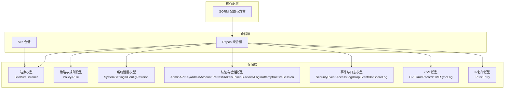
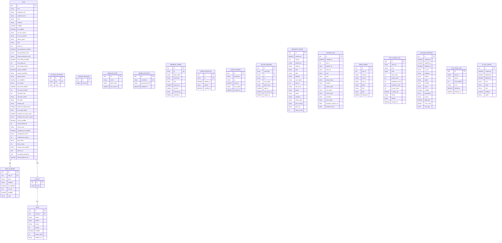
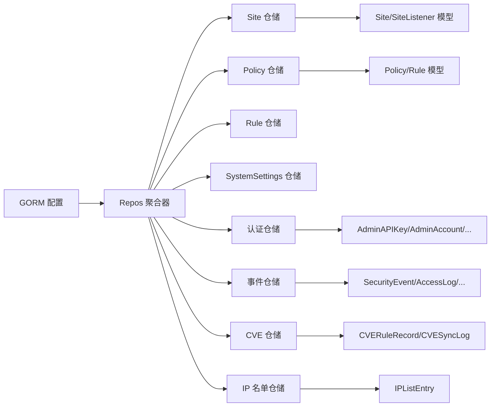

# 数据库模型设计

<cite>
**本文引用的文件**
- [internal/store/repository/repository.go](file://internal/store/repository/repository.go)
- [internal/store/site.go](file://internal/store/site.go)
- [internal/store/policy.go](file://internal/store/policy.go)
- [internal/store/system.go](file://internal/store/system.go)
- [internal/store/auth.go](file://internal/store/auth.go)
- [internal/store/events.go](file://internal/store/events.go)
- [internal/store/cve.go](file://internal/store/cve.go)
- [internal/store/ip_list.go](file://internal/store/ip_list.go)
- [internal/core/database/gorm.go](file://internal/core/database/gorm.go)
- [internal/store/migrations/v2_single_site.go](file://internal/store/migrations/v2_single_site.go)
- [internal/store/repository/site.go](file://internal/store/repository/site.go)
</cite>

## 目录
1. [简介](#简介)
2. [项目结构](#项目结构)
3. [核心组件](#核心组件)
4. [架构总览](#架构总览)
5. [详细组件分析](#详细组件分析)
6. [依赖分析](#依赖分析)
7. [性能考虑](#性能考虑)
8. [故障排查指南](#故障排查指南)
9. [结论](#结论)
10. [附录](#附录)

## 简介
本文件面向数据库模型设计，系统化阐述实体关系设计原则、字段定义规范、索引策略规划，并深入解释软删除机制、枚举字段约束、时间戳管理等设计模式。文档同时覆盖各实体模型的字段语义、数据类型选择、约束条件设置，提供 ER 关系说明（一对多、多对多建模方法），并解释模型演进策略、版本兼容性处理与数据完整性保障措施。

## 项目结构
数据库模型与仓储层位于 internal/store 目录，采用“按领域分层 + GORM 实体”的组织方式；核心连接与方言配置在 internal/core/database/gorm.go；迁移逻辑在 internal/store/migrations 下；仓储聚合器在 internal/store/repository/repository.go 中统一注入。

图表来源
- [internal/store/repository/repository.go:1-49](file://internal/store/repository/repository.go#L1-L49)
- [internal/core/database/gorm.go:1-112](file://internal/core/database/gorm.go#L1-L112)

章节来源
- [internal/store/repository/repository.go:1-49](file://internal/store/repository/repository.go#L1-L49)
- [internal/core/database/gorm.go:1-112](file://internal/core/database/gorm.go#L1-L112)

## 核心组件
- Repos 聚合器：集中持有所有实体仓储实例，便于统一初始化与依赖注入。
- GORM 配置：支持 sqlite、mysql、postgres 三类驱动，针对不同驱动进行连接池与性能参数调优。
- 仓储接口：以 List/Get/Create/Update/Delete 等通用方法抽象数据访问，部分实体提供事务化删除（如站点及其监听器）。

章节来源
- [internal/store/repository/repository.go:1-49](file://internal/store/repository/repository.go#L1-L49)
- [internal/core/database/gorm.go:1-112](file://internal/core/database/gorm.go#L1-L112)
- [internal/store/repository/site.go:1-54](file://internal/store/repository/site.go#L1-L54)

## 架构总览
下图展示数据库模型与仓储层的整体关系，以及软删除、索引与枚举字段的分布。

其中，`upstream_urls` 负责上游连接目标，`upstream_host` 负责发往上游的 `Host` 头。`upstream_host` 可填写域名、域名:端口或 Go template；为空时，运行时默认回退到上游地址主机，若站点启用 `preserve_original_host`，则在未配置 `upstream_host` 时继续沿用原始请求 Host。

图表来源
- [internal/store/site.go:16-156](file://internal/store/site.go#L16-L156)
- [internal/store/policy.go:9-78](file://internal/store/policy.go#L9-L78)
- [internal/store/system.go:3-15](file://internal/store/system.go#L3-L15)
- [internal/store/auth.go:9-79](file://internal/store/auth.go#L9-L79)
- [internal/store/events.go:5-81](file://internal/store/events.go#L5-L81)
- [internal/store/cve.go:9-41](file://internal/store/cve.go#L9-L41)
- [internal/store/ip_list.go:16-29](file://internal/store/ip_list.go#L16-L29)

## 详细组件分析

### 站点模型（Site 与 SiteListener）
- 设计要点
  - 软删除：DeletedAt 字段启用逻辑删除，配合 gorm 的 DeletedAt 索引。
  - 索引策略：Host、Bind、PolicyID、CertID 等常用查询字段建立索引；SiteListener 的 SiteID、Bind 等字段建立索引。
  - 字段规范：字符串长度通过 size 约束；布尔默认值通过 default 设置；JSON 文本通过 type:text 存储。
  - 时间戳：CreatedAt/UpdatedAt 自动维护。
  - 兼容字段：保留 listener_id、forwarding_profile_id 等历史字段用于迁移兼容。
- 关系建模
  - 一对多：Site 与 SiteListener（一个站点可有多个监听端点）。
  - 多对一：SiteListener 指向 Site。
- 事务删除
  - 提供 DeleteWithListeners 事务删除站点及其监听器，避免悬挂数据。

章节来源
- [internal/store/site.go:16-156](file://internal/store/site.go#L16-L156)
- [internal/store/repository/site.go:46-54](file://internal/store/repository/site.go#L46-L54)

### 策略与规则模型（Policy 与 Rule）
- 设计要点
  - 枚举字段：RulePhase 与 RuleAction 使用字符串枚举，提供规范化函数 NormalizeAction 处理历史值。
  - 索引策略：Policy.Name 唯一索引；Rule.PolicyID、Phase、Action、Priority 等建立复合或单列索引以支撑过滤与排序。
  - 字段规范：Pattern 采用 TEXT 类型存储复杂规则；RedirectTo 支持重定向目标；Priority 控制执行顺序。
- 关系建模
  - 一对多：Policy 与 Rule（一个策略包含多条规则）。
  - 多对一：Rule 指向 Policy。

章节来源
- [internal/store/policy.go:9-78](file://internal/store/policy.go#L9-L78)

### 系统设置模型（SystemSettings 与 ConfigRevision）
- 设计要点
  - SystemSettings 作为键值表，Key 建立唯一索引，Value 采用 TEXT 存储任意配置。
  - ConfigRevision 保存快照修订号，保证配置变更的原子性与可追溯性。
- 应用场景
  - 运行时配置读写、版本控制与回滚。

章节来源
- [internal/store/system.go:3-15](file://internal/store/system.go#L3-L15)

### 认证与会话模型（AdminAPIKey、AdminAccount、RefreshToken、TokenBlacklist、LoginAttempt、ActiveSession）
- 设计要点
  - AdminAPIKey：TokenHash 存储哈希值，不暴露明文；LastUsedAt 记录使用时间。
  - AdminAccount：Username 唯一索引；PasswordHash 存储哈希值。
  - RefreshToken：JTI 唯一索引；Expiry/Revoked 管理生命周期与撤销；ReplacedBy 支持轮换。
  - TokenBlacklist：JTI 唯一索引；ExpiresAt 索引；Reason 记录撤销原因。
  - LoginAttempt/ActiveSession：Username/IP/UA 等维度建立索引，便于审计与风控。
- 关系建模
  - 多对一：RefreshToken/ActiveSession/TokenBlacklist/LoginAttempt 指向 AdminAccount 或基于 JTI。

章节来源
- [internal/store/auth.go:9-79](file://internal/store/auth.go#L9-L79)

### 事件与日志模型（SecurityEvent、AccessLog、DropEvent、BotScoreLog）
- 设计要点
  - 索引策略：大量高频查询字段（Created、SiteID、ClientIP、Action、Category、Status 等）建立索引，提升审计与报表性能。
  - 字段规范：UserAgent、Path、QueryString 等采用合适长度；UpstreamLatencyMs、ResponseSize 等数值字段默认 0。
  - 时间戳：CreatedAt 自动维护，便于时间序列分析。
- 关系建模
  - 多对一：事件/日志均指向 Site。

章节来源
- [internal/store/events.go:5-81](file://internal/store/events.go#L5-L81)

### CVE 模型（CVERuleRecord、CVESyncLog）
- 设计要点
  - CVERuleRecord：CVEID 建立索引；Action 默认 drop；Enabled 控制开关；CVSSScore/CWEType 便于风险分级。
  - CVESyncLog：Source/Status 记录同步状态；StartedAt/FinishedAt 记录耗时。
- 关系建模
  - 无外键依赖，独立表管理。

章节来源
- [internal/store/cve.go:9-41](file://internal/store/cve.go#L9-L41)

### IP 名单模型（IPListEntry）
- 设计要点
  - Kind 使用枚举（blacklist/whitelist）；Value 建立索引，支持 IP/CIDR 快速匹配；Action 默认 intercept。
- 关系建模
  - 无外键依赖，独立表管理。

章节来源
- [internal/store/ip_list.go:16-29](file://internal/store/ip_list.go#L16-L29)

### GORM 配置与方言
- 设计要点
  - 支持 sqlite、mysql、postgres 三种驱动；SQLite 默认 WAL、foreign_keys、busy_timeout 等参数优化；非 SQLite 设置连接池上限与生命周期。
  - PrepareStmt 启用预编译缓存；SkipDefaultTransaction 避免单条写入包裹事务，降低开销。
- 性能建议
  - 生产环境优先使用 MySQL/Postgres；SQLite 仅用于开发或轻量场景。

章节来源
- [internal/core/database/gorm.go:17-112](file://internal/core/database/gorm.go#L17-L112)

### 模型演进与迁移（以 v2_single_site 为例）
- 设计要点
  - 单体迁移：将 Listener 与 ForwardingProfile 合并到 Site，避免跨表查询。
  - 兼容性：先添加新列，再迁移数据，最后备份旧表，确保回滚路径。
  - 事务化：整步迁移在单个事务中执行，失败即回滚。
- 版本策略
  - 通过 ConfigRevision 与迁移脚本编号管理版本；迁移前检查是否已存在目标结构。

章节来源
- [internal/store/migrations/v2_single_site.go:10-189](file://internal/store/migrations/v2_single_site.go#L10-L189)

## 依赖分析
- 仓储聚合器 Repos 将所有实体仓储注入到应用层，形成清晰的依赖边界。
- Site 仓储提供事务化删除（站点与其监听器），体现业务一致性要求。
- GORM 配置对不同驱动进行差异化优化，避免耦合具体数据库实现。

图表来源
- [internal/store/repository/repository.go:1-49](file://internal/store/repository/repository.go#L1-L49)
- [internal/store/repository/site.go:1-54](file://internal/store/repository/site.go#L1-L54)
- [internal/core/database/gorm.go:1-112](file://internal/core/database/gorm.go#L1-L112)

章节来源
- [internal/store/repository/repository.go:1-49](file://internal/store/repository/repository.go#L1-L49)
- [internal/store/repository/site.go:1-54](file://internal/store/repository/site.go#L1-L54)
- [internal/core/database/gorm.go:1-112](file://internal/core/database/gorm.go#L1-L112)

## 性能考虑
- 索引策略
  - 高频过滤字段（Created、SiteID、ClientIP、Action、Category、Status 等）建立索引，平衡查询与写入成本。
  - 复合索引用于常见排序与过滤组合（如 SiteID+Created）。
- 写入优化
  - 非 SQLite 使用连接池上限与生命周期参数，避免资源泄露。
  - 启用 PrepareStmt 缓存重复查询的执行计划。
- 读取优化
  - 分页查询使用 Offset/Limit 并结合索引排序（如按 ID 升序）。
  - 针对热点表（如 AccessLog/SecurityEvent）考虑分区或归档策略（建议在上层实现）。
- 软删除与统计
  - DeletedAt 索引支持快速过滤未删除记录；统计时注意区分软删除与硬删除场景。

## 故障排查指南
- 连接问题
  - 检查驱动与 DSN 配置；MySQL/Postgres 必须提供 DSN；SQLite 在 DSN 为空时自动定位 DataDir。
- 迁移失败
  - 查看迁移日志与错误信息；确认事务内步骤是否全部成功；必要时回滚并修复数据。
- 索引缺失
  - 若查询变慢，检查是否缺少必要的单列或复合索引；优先为过滤/排序字段加索引。
- 软删除误删
  - 确认 DeletedAt 字段是否被正确设置；查询时注意区分软删除记录。
- 会话与令牌
  - 刷新令牌过期或撤销需检查 ExpiresAt/Revoked/ReplacedBy 字段；TokenBlacklist 的 JTI 是否被正确写入。

章节来源
- [internal/core/database/gorm.go:17-112](file://internal/core/database/gorm.go#L17-L112)
- [internal/store/migrations/v2_single_site.go:16-50](file://internal/store/migrations/v2_single_site.go#L16-L50)
- [internal/store/auth.go:28-79](file://internal/store/auth.go#L28-L79)

## 结论
该数据库模型以 GORM 为核心，围绕站点、策略、事件与认证等核心域构建，采用软删除、枚举规范化、索引策略与事务化仓储等手段，兼顾易用性与可演进性。通过迁移脚本与版本控制，确保模型演进过程中的数据完整性与兼容性。生产部署建议优先选用 MySQL/Postgres，并结合索引与连接池参数进行性能调优。

## 附录
- 字段命名规范
  - 使用小写下划线命名（如 upstream_urls、min_tls_version）。
  - 时间戳统一使用 CreatedAt/UpdatedAt/DeletedAt。
- 约束与默认值
  - 非空字段使用 not null；布尔默认值使用 default；字符串长度使用 size；大文本使用 type:text。
- 索引建议
  - 高频查询字段（Host、Bind、SiteID、ClientIP、Action、Category、Status、JTI、Username 等）建立索引。
- 软删除最佳实践
  - 查询默认过滤 DeletedAt IS NULL；统计时明确区分软删除与硬删除。
- 枚举与规范化
  - 使用字符串枚举并提供规范化函数（如 NormalizeAction），兼容历史数据。
