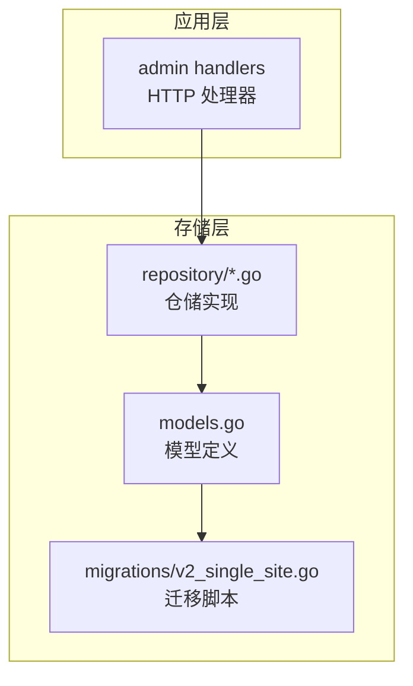
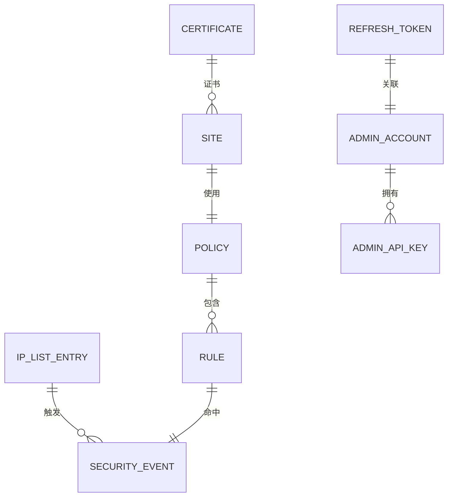
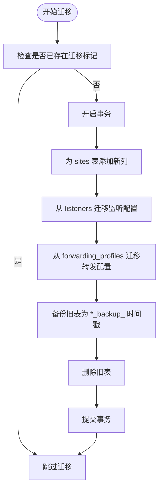
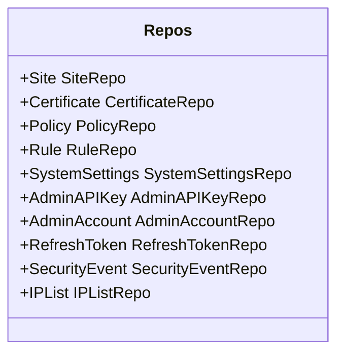

# 数据库模型设计

<cite>
**本文档引用的文件**
- [models.go](file://internal/store/models.go)
- [v2_single_site.go](file://internal/store/migrations/v2_single_site.go)
- [repository.go](file://internal/store/repository/repository.go)
- [site.go](file://internal/store/repository/site.go)
- [certificate.go](file://internal/store/repository/certificate.go)
- [policy.go](file://internal/store/repository/policy.go)
- [rule.go](file://internal/store/repository/rule.go)
- [admin_account.go](file://internal/store/repository/admin_account.go)
- [admin_api_key.go](file://internal/store/repository/admin_api_key.go)
- [system_settings.go](file://internal/store/repository/system_settings.go)
- [security_event.go](file://internal/store/repository/security_event.go)
- [ip_list.go](file://internal/store/repository/ip_list.go)
- [refresh_token.go](file://internal/store/repository/refresh_token.go)
</cite>

## 目录
1. [简介](#简介)
2. [项目结构](#项目结构)
3. [核心组件](#核心组件)
4. [架构概览](#架构概览)
5. [详细组件分析](#详细组件分析)
6. [依赖分析](#依赖分析)
7. [性能考虑](#性能考虑)
8. [故障排除指南](#故障排除指南)
9. [结论](#结论)
10. [附录](#附录)

## 简介
本文件系统性地梳理了 OpenWAF 的数据库模型设计，覆盖实体关系、字段定义与约束、枚举类型、模型演进历史以及查询优化策略。重点解释 Certificate、Policy、Rule、Site、SystemSettings、AdminAPIKey、AdminAccount、RefreshToken、IPListEntry、SecurityEvent 等核心模型的业务含义与使用场景，并通过图示展示它们之间的关联关系。

## 项目结构
后端采用分层架构：应用层负责路由与业务编排；核心层包含规则引擎、管道、缓存等；存储层通过 GORM 定义模型与迁移脚本，并提供仓储模式的访问接口。

**图表来源**
- [models.go:1-393](file://internal/store/models.go#L1-L393)
- [repository.go:1-33](file://internal/store/repository/repository.go#L1-L33)
- [v2_single_site.go:1-189](file://internal/store/migrations/v2_single_site.go#L1-L189)

**章节来源**
- [models.go:1-393](file://internal/store/models.go#L1-L393)
- [repository.go:1-33](file://internal/store/repository/repository.go#L1-L33)
- [v2_single_site.go:1-189](file://internal/store/migrations/v2_single_site.go#L1-L189)

## 核心组件
本节概述所有数据模型及其职责边界：

- Certificate：站点证书信息，包含证书与私钥的 PEM 文本。
- Policy：策略容器，用于组织一组规则。
- Rule：具体规则，绑定到某个 Policy，定义匹配模式与处置动作。
- Site：站点配置，整合了原 Listener 与 ForwardingProfile 的能力，支持监听、TLS、转发、防护等配置。
- SystemSettings：全局系统设置项，以键值对形式存储。
- AdminAPIKey：管理员 API 密钥，存储哈希值以便一次性令牌校验。
- AdminAccount：管理员账户，存储用户名与密码哈希。
- RefreshToken：刷新令牌，支持撤销与替换。
- IPListEntry：黑白名单条目，支持 IP/CIDR 与启用状态。
- SecurityEvent：安全事件记录，用于审计与可视化。

**章节来源**
- [models.go:12-23](file://internal/store/models.go#L12-L23)
- [models.go:35-42](file://internal/store/models.go#L35-L42)
- [models.go:78-91](file://internal/store/models.go#L78-L91)
- [models.go:95-147](file://internal/store/models.go#L95-L147)
- [models.go:151-155](file://internal/store/models.go#L151-L155)
- [models.go:159-167](file://internal/store/models.go#L159-L167)
- [models.go:171-176](file://internal/store/models.go#L171-L176)
- [models.go:180-188](file://internal/store/models.go#L180-L188)
- [models.go:199-209](file://internal/store/models.go#L199-L209)
- [models.go:213-235](file://internal/store/models.go#L213-L235)

## 架构概览
下图展示了模型间的关联关系与外键约束，帮助理解数据流向与业务耦合度。

**图表来源**
- [models.go:14-23](file://internal/store/models.go#L14-L23)
- [models.go:35-42](file://internal/store/models.go#L35-L42)
- [models.go:78-91](file://internal/store/models.go#L78-L91)
- [models.go:95-147](file://internal/store/models.go#L95-L147)
- [models.go:159-167](file://internal/store/models.go#L159-L167)
- [models.go:171-176](file://internal/store/models.go#L171-L176)
- [models.go:180-188](file://internal/store/models.go#L180-L188)
- [models.go:199-209](file://internal/store/models.go#L199-L209)
- [models.go:213-235](file://internal/store/models.go#L213-L235)

## 详细组件分析

### 模型关系与字段定义
- Certificate
  - 字段：名称、证书PEM、密钥PEM
  - 约束：名称长度限制、PEM文本非空
  - 关联：Site 可通过 CertID 关联到 Certificate
- Policy
  - 字段：名称
  - 约束：名称长度限制
  - 关联：Rule 属于 Policy
- Rule
  - 字段：名称、所属策略ID、阶段、模式、动作、优先级、启用状态
  - 约束：阶段与动作为枚举字符串、优先级默认值、启用默认值
  - 关联：SecurityEvent 记录命中该规则的事件
- Site
  - 字段：主机名、上游地址、监听绑定、网络协议、启用状态、TLS开关与版本、密码套件、ALPN、Bot防护级别、攻击防护级别、XFF模式、受信任CIDR、保留原始Host、请求体大小限制、上游TLS校验、上游SNI、维护模式、拦截页面与状态码、策略ID、证书ID
  - 约束：多处字段带默认值与长度限制
  - 关联：Certificate 提供TLS证书；Policy 提供防护策略
- SystemSettings
  - 字段：键、值
  - 约束：键唯一且非空
- AdminAPIKey
  - 字段：名称、令牌哈希、最后使用时间
  - 约束：令牌哈希非空
- AdminAccount
  - 字段：用户名、密码哈希
  - 约束：用户名唯一且非空
- RefreshToken
  - 字段：JTI、令牌哈希、过期时间、撤销状态、替代令牌、创建时间
  - 约束：JTI 唯一且非空
- IPListEntry
  - 字段：类型（黑/白）、值（IP/CIDR）、备注、启用状态
  - 约束：类型为枚举字符串、值非空、启用默认值
- SecurityEvent
  - 字段：请求ID、客户端IP、主机、路径、方法、UA、规则ID/字符串、阶段、动作、类别、匹配描述、地理国家/城市、状态码
  - 约束：状态码默认值、多字段建立索引

**章节来源**
- [models.go:14-23](file://internal/store/models.go#L14-L23)
- [models.go:35-42](file://internal/store/models.go#L35-L42)
- [models.go:78-91](file://internal/store/models.go#L78-L91)
- [models.go:95-147](file://internal/store/models.go#L95-L147)
- [models.go:151-155](file://internal/store/models.go#L151-L155)
- [models.go:159-167](file://internal/store/models.go#L159-L167)
- [models.go:171-176](file://internal/store/models.go#L171-L176)
- [models.go:180-188](file://internal/store/models.go#L180-L188)
- [models.go:199-209](file://internal/store/models.go#L199-L209)
- [models.go:213-235](file://internal/store/models.go#L213-L235)

### 枚举类型与规范化
- RulePhase：acl、rate_limit、owasp_default、signature、custom
- RuleAction：allow、intercept、observe，以及兼容旧值 block、log_only（通过规范化映射）
- IPListKind：blacklist、whitelist
- XFFMode：strip_all_and_set_remote、trust_outer_waf_cidr_then_take_leftmost（用于迁移）

此外，Site 中还包含字符串枚举字段如网络协议、TLS 版本、Bot/攻击防护级别等。

**章节来源**
- [models.go:44-64](file://internal/store/models.go#L44-L64)
- [models.go:192-197](file://internal/store/models.go#L192-L197)
- [models.go:28-31](file://internal/store/models.go#L28-L31)

### 模型演进历史
- Listener 与 ForwardingProfile 已弃用，合并至 Site：
  - 迁移脚本在 sites 表新增监听与转发相关列，从 listeners 与 forwarding_profiles 迁移数据，备份旧表并删除原表。
  - Site 保留 listener_id 与 forwarding_profile_id 字段用于兼容，但不再作为外键使用。
- 规则动作规范化：
  - 旧值 block、log_only 在写入前会被规范化为新的 canonical 值 intercept、observe，确保数据一致性。

**图表来源**
- [v2_single_site.go:16-49](file://internal/store/migrations/v2_single_site.go#L16-L49)
- [v2_single_site.go:52-82](file://internal/store/migrations/v2_single_site.go#L52-L82)
- [v2_single_site.go:84-127](file://internal/store/migrations/v2_single_site.go#L84-L127)
- [v2_single_site.go:129-166](file://internal/store/migrations/v2_single_site.go#L129-L166)

**章节来源**
- [models.go:9-31](file://internal/store/models.go#L9-L31)
- [v2_single_site.go:10-50](file://internal/store/migrations/v2_single_site.go#L10-L50)

### 查询与索引策略
- 全局索引与复合索引：
  - SecurityEvent：按创建时间、客户端IP、主机、路径、规则ID、规则ID字符串、阶段、动作、类别建立索引，便于审计与统计。
  - Site：主机名、绑定地址、启用状态、证书ID、策略ID等建立索引，支持快速查找与过滤。
  - Rule：策略ID、阶段、启用状态、优先级排序，支持按策略检索规则。
  - IPListEntry：类型、值、启用状态建立索引，支持快速匹配。
  - AdminAPIKey：JTI 唯一键，便于令牌识别与校验。
- 分页与排序：
  - 仓储实现普遍采用 Offset/Limit 分页与按主键或优先级排序，保证结果稳定可预期。
- 聚合与统计：
  - SecurityEvent 仓储提供分类统计、Top IP/路径/规则、时间线聚合等查询，支撑仪表盘展示。

**章节来源**
- [models.go:85-91](file://internal/store/models.go#L85-L91)
- [models.go:215-235](file://internal/store/models.go#L215-L235)
- [models.go:102-147](file://internal/store/models.go#L102-L147)
- [models.go:205-209](file://internal/store/models.go#L205-L209)
- [models.go:182-188](file://internal/store/models.go#L182-L188)
- [security_event.go:30-44](file://internal/store/repository/security_event.go#L30-L44)
- [security_event.go:75-153](file://internal/store/repository/security_event.go#L75-L153)

### 数据验证与业务约束
- 非空与长度约束：多数字符串字段设置长度上限与非空约束，防止异常输入。
- 默认值策略：大量字段设置合理默认值（如启用状态、TLS版本、防护级别、请求体大小等），降低配置复杂度。
- 动作规范化：RuleAction 写入前进行规范化，确保历史数据与新数据一致。
- 令牌安全：AdminAPIKey 仅在创建时返回明文令牌一次，后续仅存储哈希；RefreshToken 支持撤销与清理过期记录。
- 维护模式：Site 支持全局维护模式，可自定义HTML与状态码，便于紧急降级。

**章节来源**
- [models.go:20-23](file://internal/store/models.go#L20-L23)
- [models.go:41](file://internal/store/models.go#L41)
- [models.go:67-76](file://internal/store/models.go#L67-L76)
- [models.go:113-141](file://internal/store/models.go#L113-L141)
- [models.go:159-167](file://internal/store/models.go#L159-L167)
- [models.go:180-188](file://internal/store/models.go#L180-L188)

### 实际使用示例（基于仓储接口）
以下示例展示如何通过仓储接口完成常见操作，避免直接操作底层模型，遵循仓储模式的最佳实践。

- 获取站点列表与总数
  - 使用 SiteRepo.List(offset, limit)，返回站点切片与总数
  - 参考路径：[site.go:13-23](file://internal/store/repository/site.go#L13-L23)
- 查找启用的站点
  - 使用 SiteRepo.FindEnabled()，返回启用状态的站点切片
  - 参考路径：[site.go:25-28](file://internal/store/repository/site.go#L25-L28)
- 创建规则并按优先级排序
  - 使用 RuleRepo.Create(item) 后，通过 RuleRepo.List(offset, limit) 获取并按优先级排序
  - 参考路径：[rule.go:30-33](file://internal/store/repository/rule.go#L30-L33)、[rule.go:19](file://internal/store/repository/rule.go#L19)
- 记录安全事件并批量插入
  - 使用 SecurityEventRepo.Create(item) 或 BatchCreate(items) 批量写入
  - 参考路径：[security_event.go:51-60](file://internal/store/repository/security_event.go#L51-L60)
- 管理员 API 密钥创建与校验
  - 使用 AdminAPIKeyRepo.Create(name) 返回明文令牌与持久化对象
  - 使用 AdminAPIKeyRepo.Verify(token) 校验并更新最后使用时间
  - 参考路径：[admin_api_key.go:31-46](file://internal/store/repository/admin_api_key.go#L31-L46)、[admin_api_key.go:48-63](file://internal/store/repository/admin_api_key.go#L48-L63)

**章节来源**
- [site.go:13-28](file://internal/store/repository/site.go#L13-L28)
- [rule.go:19-22](file://internal/store/repository/rule.go#L19-L22)
- [security_event.go:51-60](file://internal/store/repository/security_event.go#L51-L60)
- [admin_api_key.go:31-46](file://internal/store/repository/admin_api_key.go#L31-L46)
- [admin_api_key.go:48-63](file://internal/store/repository/admin_api_key.go#L48-L63)

## 依赖分析
仓储聚合器 Repos 将所有实体仓储统一注入，便于应用层集中管理与依赖注入。

**图表来源**
- [repository.go:5-17](file://internal/store/repository/repository.go#L5-L17)

**章节来源**
- [repository.go:1-33](file://internal/store/repository/repository.go#L1-L33)

## 性能考虑
- 索引设计：针对高频查询字段建立索引（如 SecurityEvent 的多字段索引、Site 的主机/绑定/启用组合），提升查询效率。
- 批量写入：SecurityEvent 支持批量插入，减少事务开销。
- 分页与排序：统一使用偏移/限制与稳定排序键，避免全表扫描。
- 缓存策略：结合应用层缓存与响应缓存，降低数据库压力（由核心模块提供支持）。
- 迁移兼容：Site 合并监听与转发配置后，减少跨表连接，简化查询路径。

[本节为通用性能建议，无需特定文件引用]

## 故障排除指南
- 规则动作不生效
  - 检查是否使用了旧的动作值（block、log_only），应通过规范化映射为新值（intercept、observe）
  - 参考路径：[models.go:67-76](file://internal/store/models.go#L67-L76)
- 令牌校验失败
  - 确认 AdminAPIKey 是否正确创建（仅明文令牌显示一次），核对哈希存储与比对流程
  - 参考路径：[admin_api_key.go:31-46](file://internal/store/repository/admin_api_key.go#L31-L46)、[admin_api_key.go:48-63](file://internal/store/repository/admin_api_key.go#L48-L63)
- 刷新令牌无法使用
  - 检查是否被撤销或过期，必要时调用 Revoke 或 CleanExpired 清理
  - 参考路径：[refresh_token.go:24-32](file://internal/store/repository/refresh_token.go#L24-L32)、[refresh_token.go:39-42](file://internal/store/repository/refresh_token.go#L39-L42)
- 安全事件统计异常
  - 确认过滤参数与时间范围，检查索引是否生效
  - 参考路径：[security_event.go:162-191](file://internal/store/repository/security_event.go#L162-L191)

**章节来源**
- [models.go:67-76](file://internal/store/models.go#L67-L76)
- [admin_api_key.go:31-46](file://internal/store/repository/admin_api_key.go#L31-L46)
- [admin_api_key.go:48-63](file://internal/store/repository/admin_api_key.go#L48-L63)
- [refresh_token.go:24-32](file://internal/store/repository/refresh_token.go#L24-L32)
- [refresh_token.go:39-42](file://internal/store/repository/refresh_token.go#L39-L42)
- [security_event.go:162-191](file://internal/store/repository/security_event.go#L162-L191)

## 结论
本设计以 Site 为核心枢纽，整合监听与转发配置，简化了站点维度的配置与运维；通过明确的枚举与规范化机制保障数据一致性；借助仓储模式与索引策略提升查询性能与可维护性。迁移脚本确保历史数据平滑过渡，兼顾向前兼容与未来扩展空间。

[本节为总结性内容，无需特定文件引用]

## 附录
- 仓储接口一览（部分）
  - SiteRepo：List、FindEnabled、FindByBind、Get、Create、Update、Delete
    - 参考路径：[site.go:13-45](file://internal/store/repository/site.go#L13-L45)
  - PolicyRepo：List、Get、Create、Update、Delete
    - 参考路径：[policy.go:13-35](file://internal/store/repository/policy.go#L13-L35)
  - RuleRepo：List、ListByPolicy、Get、Create、Update、Delete
    - 参考路径：[rule.go:13-40](file://internal/store/repository/rule.go#L13-L40)
  - AdminAccountRepo：GetByUsername、VerifyPassword、UpdatePassword
    - 参考路径：[admin_account.go:14-37](file://internal/store/repository/admin_account.go#L14-L37)
  - AdminAPIKeyRepo：List、Get、Create、Verify、Delete
    - 参考路径：[admin_api_key.go:20-68](file://internal/store/repository/admin_api_key.go#L20-L68)
  - SystemSettingsRepo：Get、Set、All、Delete
    - 参考路径：[system_settings.go:15-44](file://internal/store/repository/system_settings.go#L15-L44)
  - SecurityEventRepo：List、Get、Create、BatchCreate、DeleteOlderThan、各类统计聚合
    - 参考路径：[security_event.go:30-192](file://internal/store/repository/security_event.go#L30-L192)
  - IPListRepo：List、AllEnabled、Get、Create、Update、Delete
    - 参考路径：[ip_list.go:13-42](file://internal/store/repository/ip_list.go#L13-L42)
  - RefreshTokenRepo：Create、FindByJTI、Revoke、RevokeAll、CleanExpired
    - 参考路径：[refresh_token.go:15-43](file://internal/store/repository/refresh_token.go#L15-L43)

**章节来源**
- [site.go:13-45](file://internal/store/repository/site.go#L13-L45)
- [policy.go:13-35](file://internal/store/repository/policy.go#L13-L35)
- [rule.go:13-40](file://internal/store/repository/rule.go#L13-L40)
- [admin_account.go:14-37](file://internal/store/repository/admin_account.go#L14-L37)
- [admin_api_key.go:20-68](file://internal/store/repository/admin_api_key.go#L20-L68)
- [system_settings.go:15-44](file://internal/store/repository/system_settings.go#L15-L44)
- [security_event.go:30-192](file://internal/store/repository/security_event.go#L30-L192)
- [ip_list.go:13-42](file://internal/store/repository/ip_list.go#L13-L42)
- [refresh_token.go:15-43](file://internal/store/repository/refresh_token.go#L15-L43)