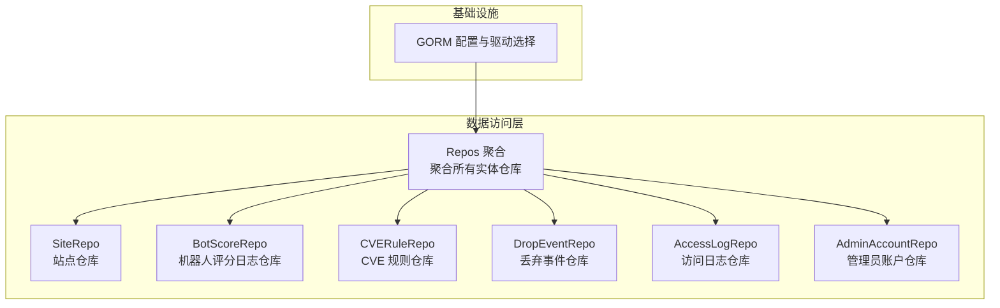
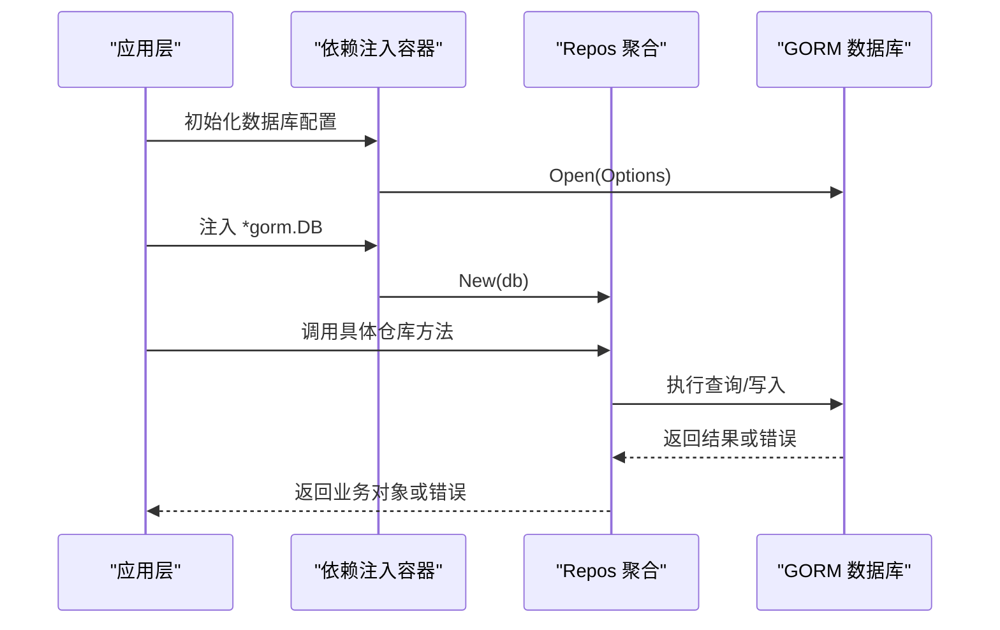
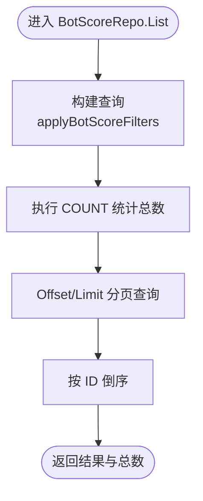
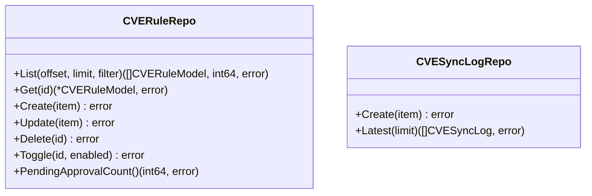
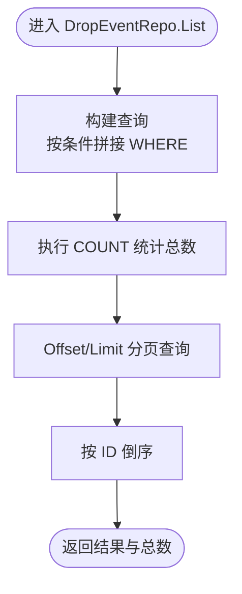
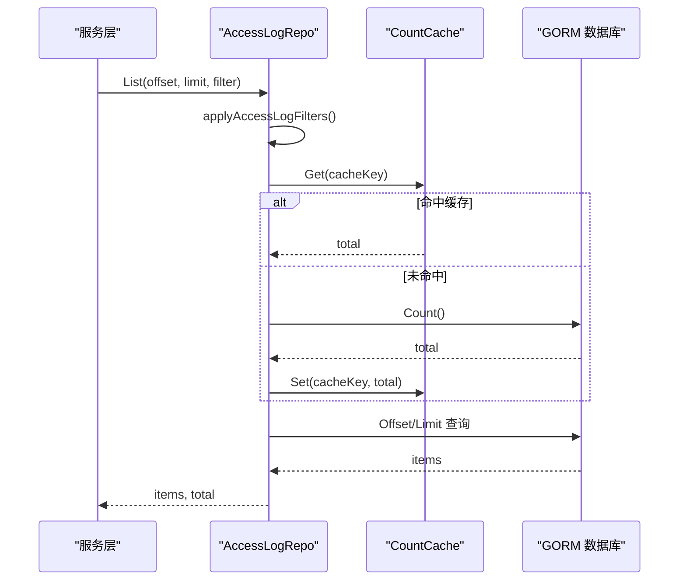
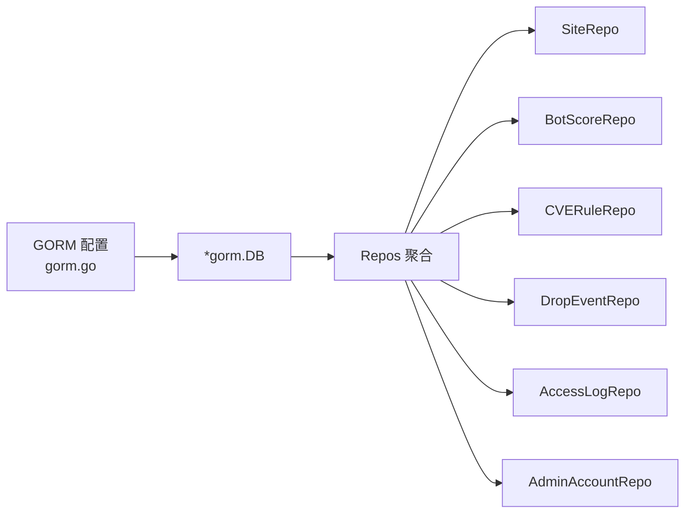

# 数据访问层设计

> [返回 数据存储层](数据存储层.md)

<cite>
**本文引用的文件**
- [repository.go](file://internal/store/repository/repository.go)
- [gorm.go](file://internal/core/database/gorm.go)
- [site.go](file://internal/store/repository/site.go)
- [bot_score.go](file://internal/store/repository/bot_score.go)
- [cve_rule.go](file://internal/store/repository/cve_rule.go)
- [drop_event.go](file://internal/store/repository/drop_event.go)
- [access_log.go](file://internal/store/repository/access_log.go)
- [admin_account.go](file://internal/store/repository/admin_account.go)
</cite>

## 目录
1. [引言](#引言)
2. [项目结构](#项目结构)
3. [核心组件](#核心组件)
4. [架构总览](#架构总览)
5. [详细组件分析](#详细组件分析)
6. [依赖分析](#依赖分析)
7. [性能考虑](#性能考虑)
8. [故障排查指南](#故障排查指南)
9. [结论](#结论)
10. [附录](#附录)

## 引言
本文件面向数据访问层设计，系统化阐述仓储模式（Repository Pattern）在本项目中的设计理念与实现架构。重点覆盖 Repos 聚合结构、依赖注入机制、接口抽象设计；明确各实体仓库的职责边界、查询方法设计与事务管理策略；总结 CRUD 最佳实践（分页、过滤、聚合统计）；并深入解析新增的安全相关仓储（BotScoreRepo、CVERuleRepo、DropEventRepo、FingerprintRepo）的功能特性与使用场景。

## 项目结构
数据访问层位于 internal/store/repository 目录，采用“按实体分文件”的组织方式，每个实体一个仓库文件，统一通过 Repos 聚合对外暴露。数据库连接由 internal/core/database/gorm.go 提供，支持 SQLite、MySQL、PostgreSQL 三种方言，并对连接池与性能参数进行针对性优化。

**图表来源**
- [repository.go:5-25](file://internal/store/repository/repository.go#L5-L25)
- [gorm.go:24-61](file://internal/core/database/gorm.go#L24-L61)

**章节来源**
- [repository.go:1-49](file://internal/store/repository/repository.go#L1-L49)
- [gorm.go:1-112](file://internal/core/database/gorm.go#L1-L112)

## 核心组件
- Repos 聚合：集中持有所有实体仓库实例，提供统一的依赖注入入口，避免上层模块直接感知具体数据库实现。
- 数据库配置：根据驱动类型选择对应方言，启用预编译语句、跳过默认事务包装以减少开销，并针对非 SQLite 设置连接池参数。
- 仓储接口抽象：每个实体仓库封装 CRUD 与领域查询方法，隐藏 GORM 使用细节，向上提供清晰的业务语义。

关键要点
- 依赖注入：New(db) 工厂函数接收 *gorm.DB，返回 *Repos，确保仓储与具体数据库实现解耦。
- 查询抽象：列表查询统一支持 offset/limit 分页、多字段过滤、排序与总数统计。
- 事务管理：对需要一致性的复合操作（如删除站点并级联删除监听器）使用显式事务包裹。

**章节来源**
- [repository.go:27-48](file://internal/store/repository/repository.go#L27-L48)
- [gorm.go:24-61](file://internal/core/database/gorm.go#L24-L61)

## 架构总览
下图展示从应用启动到仓储层的调用链路，以及仓储内部的查询与事务处理流程。

**图表来源**
- [gorm.go:24-61](file://internal/core/database/gorm.go#L24-L61)
- [repository.go:27-48](file://internal/store/repository/repository.go#L27-L48)

## 详细组件分析

### Repos 聚合与依赖注入
- 职责：聚合所有实体仓库，作为唯一入口向业务层提供数据访问能力。
- 依赖注入：New(db) 接收全局数据库连接，逐个初始化各实体仓库，保证一致性与可测试性。
- 扩展性：新增实体时只需在 Repos 字段中添加对应仓库指针并在 New 中初始化。

最佳实践
- 将 Repos 作为单例注入到服务层，避免重复创建连接。
- 在单元测试中可用内存数据库替换真实连接，便于隔离测试。

**章节来源**
- [repository.go:5-25](file://internal/store/repository/repository.go#L5-L25)
- [repository.go:27-48](file://internal/store/repository/repository.go#L27-L48)

### 数据库配置与方言支持
- 方言选择：根据 Driver 参数选择 SQLite、MySQL 或 PostgreSQL，分别构造 DSN 并传入 gorm.Open。
- 性能优化：
  - 预编译语句缓存（PrepareStmt）
  - 跳过默认事务包装（SkipDefaultTransaction）
  - SQLite 单连接策略避免锁竞争
  - 非 SQLite 设置最大连接数、空闲连接数、连接生命周期
- 日志级别：默认 Warn 级别，便于生产环境控制日志量。

**章节来源**
- [gorm.go:17-22](file://internal/core/database/gorm.go#L17-L22)
- [gorm.go:24-61](file://internal/core/database/gorm.go#L24-L61)
- [gorm.go:63-95](file://internal/core/database/gorm.go#L63-L95)
- [gorm.go:97-111](file://internal/core/database/gorm.go#L97-L111)

### 实体仓库通用设计
- 列表查询：统一支持 offset/limit、总数统计、排序；过滤条件通过结构体参数传递，便于扩展。
- 创建/更新/删除：提供单条与批量写入方法；批量写入通常使用 CreateInBatches 提升吞吐。
- 事务管理：对涉及多表或多步骤的变更使用显式事务，确保原子性。
- 过滤器模式：为复杂查询定义 Filter 结构体，按需拼装 WHERE 条件。

示例路径
- [site.go:13-23](file://internal/store/repository/site.go#L13-L23)
- [access_log.go:45-70](file://internal/store/repository/access_log.go#L45-L70)
- [bot_score.go:38-52](file://internal/store/repository/bot_score.go#L38-L52)

**章节来源**
- [site.go:13-54](file://internal/store/repository/site.go#L13-L54)
- [access_log.go:45-159](file://internal/store/repository/access_log.go#L45-L159)
- [bot_score.go:38-90](file://internal/store/repository/bot_score.go#L38-L90)

### 安全相关仓储详解

#### BotScoreRepo（机器人评分日志）
- 职责：持久化机器人评分日志、批量写入、条件分页查询、24 小时聚合统计。
- 查询能力：
  - 支持客户端 IP、分数区间、时间范围过滤
  - 列表按 ID 倒序，配合 offset/limit 实现分页
- 聚合统计：统计 24 小时内总次数、被阻断次数、高风险次数。
- 批量写入：BatchCreate 使用事务与批次插入，提升写入性能。

**图表来源**
- [bot_score.go:38-52](file://internal/store/repository/bot_score.go#L38-L52)
- [bot_score.go:72-89](file://internal/store/repository/bot_score.go#L72-L89)

**章节来源**
- [bot_score.go:17-24](file://internal/store/repository/bot_score.go#L17-L24)
- [bot_score.go:26-36](file://internal/store/repository/bot_score.go#L26-L36)
- [bot_score.go:38-70](file://internal/store/repository/bot_score.go#L38-L70)
- [bot_score.go:72-89](file://internal/store/repository/bot_score.go#L72-L89)

#### CVERuleRepo（CVE 规则）与 CVESyncLogRepo（CVE 同步日志）
- CVERuleRepo：
  - 列表查询支持分类、严重等级、启用状态、来源过滤
  - 支持启用/禁用切换、获取待审批数量等管理能力
- CVESyncLogRepo：
  - 记录 CVE 同步历史，提供最新 N 条记录查询

**图表来源**
- [cve_rule.go:16-22](file://internal/store/repository/cve_rule.go#L16-L22)
- [cve_rule.go:24-77](file://internal/store/repository/cve_rule.go#L24-L77)
- [cve_rule.go:81-96](file://internal/store/repository/cve_rule.go#L81-L96)

**章节来源**
- [cve_rule.go:16-77](file://internal/store/repository/cve_rule.go#L16-L77)
- [cve_rule.go:81-96](file://internal/store/repository/cve_rule.go#L81-L96)

#### DropEventRepo（丢弃事件）
- 职责：记录被拦截的请求事件，支持批量写入、条件过滤、24 小时聚合统计、按站点聚合。
- 查询能力：
  - 支持站点 ID、客户端 IP、来源（bot/cve/rule/ip_reputation）、时间范围过滤
- 聚合统计：统计 24 小时内总丢弃数及按来源拆分的数量。
- 清理策略：提供按时间阈值删除旧数据的能力。

**图表来源**
- [drop_event.go:38-66](file://internal/store/repository/drop_event.go#L38-L66)

**章节来源**
- [drop_event.go:17-24](file://internal/store/repository/drop_event.go#L17-L24)
- [drop_event.go:26-36](file://internal/store/repository/drop_event.go#L26-L36)
- [drop_event.go:38-102](file://internal/store/repository/drop_event.go#L38-L102)

#### AccessLogRepo（访问日志）
- 职责：持久化访问日志、批量写入、带缓存的总数统计、条件过滤、按请求 ID 查询。
- 性能优化：
  - 可选的 CountCache 接口用于缓存昂贵的 COUNT 查询
  - 批量写入在事务中执行，提升吞吐
- 过滤器：支持站点 ID、客户端 IP、主机、路径、方法、WAF 行动、缓存状态、状态组、时间范围等。

**图表来源**
- [access_log.go:45-70](file://internal/store/repository/access_log.go#L45-L70)
- [access_log.go:72-93](file://internal/store/repository/access_log.go#L72-L93)
- [access_log.go:119-158](file://internal/store/repository/access_log.go#L119-L158)

**章节来源**
- [access_log.go:17-31](file://internal/store/repository/access_log.go#L17-L31)
- [access_log.go:45-159](file://internal/store/repository/access_log.go#L45-L159)

#### AdminAccountRepo（管理员账户）
- 职责：基于用户名查询、密码校验（bcrypt）、修改密码（生成哈希并更新）。
- 安全要点：密码存储使用 bcrypt，校验时比较哈希值，避免明文存储。

**章节来源**
- [admin_account.go:14-37](file://internal/store/repository/admin_account.go#L14-L37)

### 其他实体仓库（示例：SiteRepo）
- 职责：站点的增删改查、启用状态查询、绑定地址查询、删除时级联删除监听器。
- 事务：删除站点并级联删除监听器使用显式事务，确保一致性。

**章节来源**
- [site.go:13-54](file://internal/store/repository/site.go#L13-L54)

## 依赖分析
仓储层与数据库层的耦合度低，通过 *gorm.DB 接口解耦具体实现。Repos 作为聚合根，向上提供统一入口；向下依赖 GORM 的查询与事务能力。

**图表来源**
- [gorm.go:24-61](file://internal/core/database/gorm.go#L24-L61)
- [repository.go:27-48](file://internal/store/repository/repository.go#L27-L48)

**章节来源**
- [repository.go:5-25](file://internal/store/repository/repository.go#L5-L25)
- [gorm.go:24-61](file://internal/core/database/gorm.go#L24-L61)

## 性能考虑
- 连接池与方言优化：非 SQLite 设置最大连接数、空闲连接数、连接生命周期；SQLite 使用单连接避免锁问题。
- 预编译语句：开启 PrepareStmt 提升重复查询性能。
- 跳过默认事务：SkipDefaultTransaction 减少单条写入的事务开销。
- 批量写入：对日志类高频写入使用 CreateInBatches，结合事务提升吞吐。
- COUNT 缓存：AccessLogRepo 支持可选的 CountCache，降低复杂过滤下的 COUNT 成本。
- 分页与排序：统一使用 offset/limit 与稳定排序键（如 ID），避免无序扫描。

**章节来源**
- [gorm.go:26-30](file://internal/core/database/gorm.go#L26-L30)
- [gorm.go:49-58](file://internal/core/database/gorm.go#L49-L58)
- [access_log.go:27-30](file://internal/store/repository/access_log.go#L27-L30)
- [access_log.go:99-106](file://internal/store/repository/access_log.go#L99-L106)
- [bot_score.go:31-36](file://internal/store/repository/bot_score.go#L31-L36)
- [drop_event.go:31-36](file://internal/store/repository/drop_event.go#L31-L36)

## 故障排查指南
- 连接失败
  - 检查 Driver 与 DSN 是否正确配置，MySQL/Postgres 需要完整 DSN。
  - SQLite 需确保数据目录存在且可写。
- 性能异常
  - 确认是否启用了 PrepareStmt 与 SkipDefaultTransaction。
  - 对高频 COUNT 查询启用 CountCache。
  - 批量写入时检查批次大小与事务边界。
- 事务一致性
  - 复合删除或跨表更新应使用显式事务包裹。
- 过滤无效
  - 确认过滤器字段与数据库列名一致，注意大小写与空值处理。

**章节来源**
- [gorm.go:42-44](file://internal/core/database/gorm.go#L42-L44)
- [gorm.go:63-95](file://internal/core/database/gorm.go#L63-L95)
- [gorm.go:97-111](file://internal/core/database/gorm.go#L97-L111)
- [access_log.go:45-70](file://internal/store/repository/access_log.go#L45-L70)
- [site.go:46-53](file://internal/store/repository/site.go#L46-L53)

## 结论
本数据访问层以 Repos 聚合为核心，结合 GORM 的多方言支持与性能优化策略，实现了高内聚、低耦合的仓储体系。通过统一的过滤器与分页接口，满足了复杂查询与统计需求；通过事务与批量写入保障了数据一致性与吞吐。新增的安全相关仓储进一步完善了日志、规则与事件的全链路数据支撑，为安全运营与审计提供了可靠基础。

## 附录
- 新增安全相关仓储使用建议
  - BotScoreRepo：建议定期清理旧日志，结合 24 小时统计进行告警阈值设定。
  - CVERuleRepo：启用状态与来源字段可用于灰度发布与合规审计。
  - DropEventRepo：按来源统计可用于评估不同防护模块的效果。
  - FingerprintRepo：指纹识别相关仓储建议与 BotScoreRepo 协同，形成完整的机器人画像。