# 数据访问层设计

<cite>
**本文档引用的文件**
- [repository.go](file://internal/store/repository/repository.go)
- [models.go](file://internal/store/models.go)
- [gorm.go](file://internal/core/database/gorm.go)
- [admin_account.go](file://internal/store/repository/admin_account.go)
- [admin_api_key.go](file://internal/store/repository/admin_api_key.go)
- [certificate.go](file://internal/store/repository/certificate.go)
- [ip_list.go](file://internal/store/repository/ip_list.go)
- [policy.go](file://internal/store/repository/policy.go)
- [rule.go](file://internal/store/repository/rule.go)
- [security_event.go](file://internal/store/repository/security_event.go)
- [site.go](file://internal/store/repository/site.go)
- [system_settings.go](file://internal/store/repository/system_settings.go)
- [v2_single_site.go](file://internal/store/migrations/v2_single_site.go)
</cite>

## 目录
1. [引言](#引言)
2. [项目结构](#项目结构)
3. [核心组件](#核心组件)
4. [架构总览](#架构总览)
5. [详细组件分析](#详细组件分析)
6. [依赖分析](#依赖分析)
7. [性能考虑](#性能考虑)
8. [故障排除指南](#故障排除指南)
9. [结论](#结论)
10. [附录](#附录)

## 引言
本文件系统化梳理数据访问层的设计与实现，重点围绕仓储模式（Repository Pattern）展开，涵盖接口定义、抽象层设计、依赖注入、CRUD 统一实现、事务边界管理、数据验证与业务规则、分页与搜索、错误处理与异常传播、性能优化策略，并为每个仓储接口提供使用示例与最佳实践建议。目标是帮助开发者快速理解并正确使用数据访问层，确保在复杂业务场景下保持一致性、可维护性和高性能。

## 项目结构
数据访问层位于 internal/store 目录，采用“按实体划分”的仓储实现方式，结合 GORM 进行数据库访问。核心目录与文件如下：
- internal/store/repository：各实体的仓储实现（AdminAccountRepo、AdminAPIKeyRepo、CertificateRepo、IPListRepo、PolicyRepo、RuleRepo、SecurityEventRepo、SiteRepo、SystemSettingsRepo 等）
- internal/store/models.go：所有实体模型定义（GORM 标签、索引、约束等）
- internal/core/database/gorm.go：数据库连接配置与驱动选择（SQLite/MySQL/Postgres），连接池与性能参数调优
- internal/store/migrations：数据库迁移逻辑（如站点模型合并）

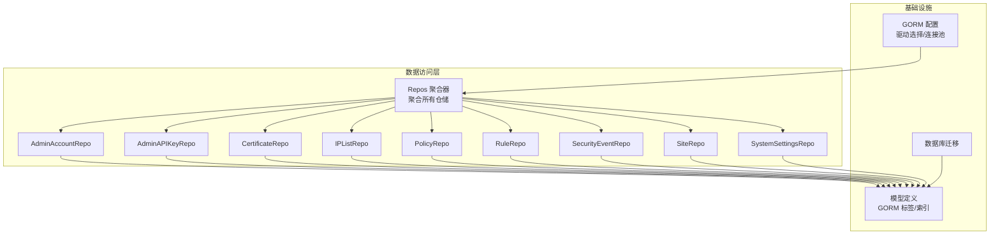

**图表来源**
- [repository.go:5-42](file://internal/store/repository/repository.go#L5-L42)
- [gorm.go:24-61](file://internal/core/database/gorm.go#L24-L61)
- [models.go:14-148](file://internal/store/models.go#L14-L148)

**章节来源**
- [repository.go:5-42](file://internal/store/repository/repository.go#L5-L42)
- [gorm.go:18-61](file://internal/core/database/gorm.go#L18-L61)
- [models.go:14-148](file://internal/store/models.go#L14-L148)

## 核心组件
- Repos 聚合器：集中持有所有仓储实例，便于依赖注入与生命周期管理
- GORM 配置：统一的数据库连接、驱动选择、连接池参数与性能优化开关
- 实体模型：通过 GORM 标签定义字段、索引、约束，支撑仓储查询与过滤
- 各实体仓储：提供 CRUD、分页、过滤、聚合统计等能力

关键要点
- 依赖注入：通过 New(db) 构造 Repos，再将 Repos 注入到上层服务
- 抽象层：仓储屏蔽底层 SQL 细节，面向领域模型进行操作
- 统一 CRUD：各仓储遵循一致的方法命名与返回约定（列表/总数/错误）

**章节来源**
- [repository.go:5-42](file://internal/store/repository/repository.go#L5-L42)
- [gorm.go:24-61](file://internal/core/database/gorm.go#L24-L61)
- [models.go:14-148](file://internal/store/models.go#L14-L148)

## 架构总览
数据访问层采用“仓储聚合器 + 单个 GORM DB 句柄”的轻量架构。上层服务仅依赖 Repos 接口，不直接接触数据库驱动；仓储内部通过 GORM 执行查询、更新与事务控制。

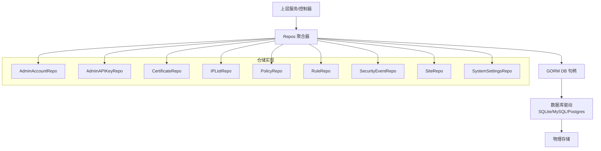

**图表来源**
- [repository.go:24-42](file://internal/store/repository/repository.go#L24-L42)
- [gorm.go:24-61](file://internal/core/database/gorm.go#L24-L61)

## 详细组件分析

### AdminAccountRepo（管理员账户）
职责
- 按用户名获取账户
- 验证密码（bcrypt 对比）
- 更新密码（bcrypt 哈希）

实现要点
- 查询使用 Where 条件
- 密码验证逐条对比哈希
- 更新密码生成新哈希并写入

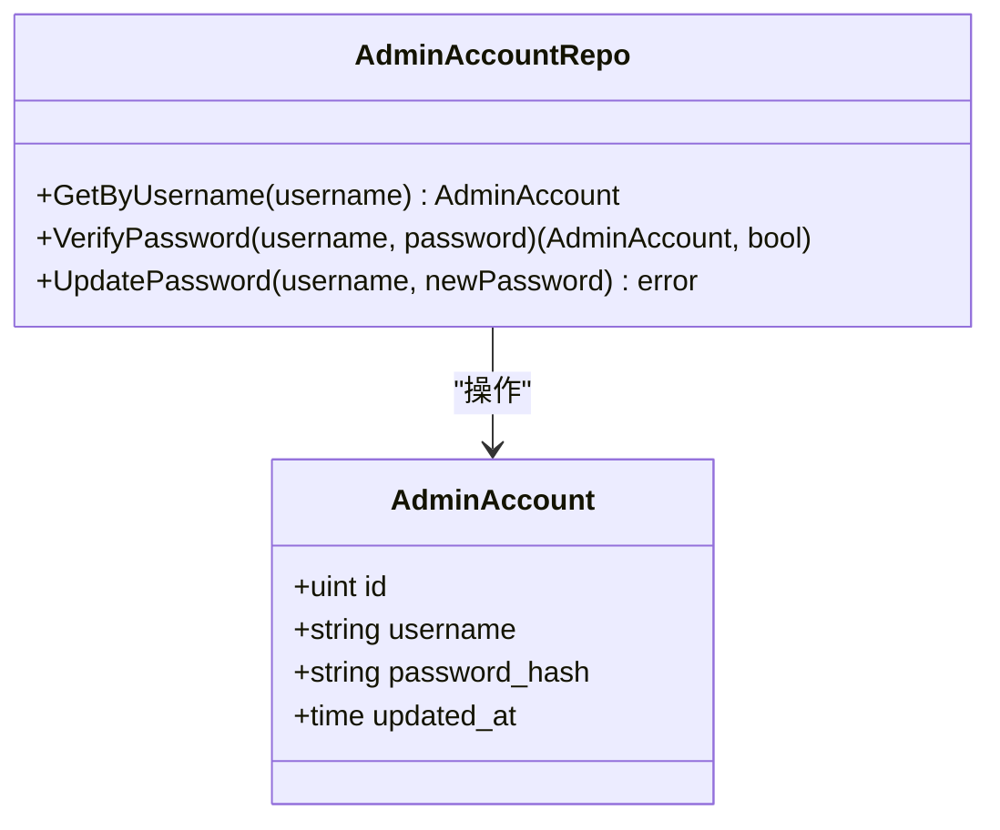

**图表来源**
- [admin_account.go:10-37](file://internal/store/repository/admin_account.go#L10-L37)
- [models.go:170-177](file://internal/store/models.go#L170-L177)

使用示例与最佳实践
- 登录流程：先 GetByUsername，再 VerifyPassword，成功后可执行会话建立
- 密码更新：使用 UpdatePassword，避免直接暴露明文
- 错误处理：用户名不存在或哈希不匹配时返回 false，调用方应提示认证失败

**章节来源**
- [admin_account.go:14-37](file://internal/store/repository/admin_account.go#L14-L37)
- [models.go:170-177](file://internal/store/models.go#L170-L177)

### AdminAPIKeyRepo（管理员 API Key）
职责
- 列表、详情、创建、删除
- 创建时生成随机令牌与 bcrypt 哈希
- 验证令牌：遍历所有密钥进行哈希对比，并记录最后使用时间

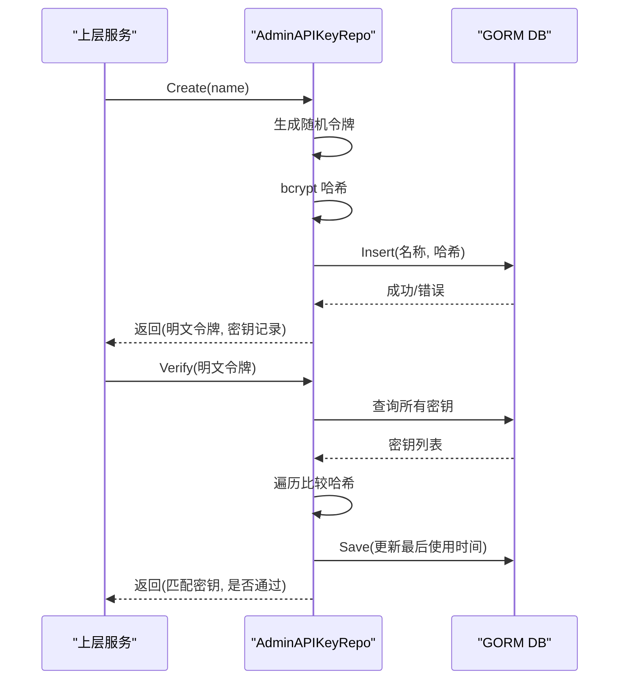

**图表来源**
- [admin_api_key.go:31-67](file://internal/store/repository/admin_api_key.go#L31-L67)
- [models.go:158-168](file://internal/store/models.go#L158-L168)

使用示例与最佳实践
- 创建后仅明文令牌展示一次，妥善保存
- 验证流程对所有密钥进行哈希对比，注意性能权衡
- 删除密钥前确认权限与审计日志

**章节来源**
- [admin_api_key.go:20-67](file://internal/store/repository/admin_api_key.go#L20-L67)
- [models.go:158-168](file://internal/store/models.go#L158-L168)

### CertificateRepo（证书）
职责
- 分页列出、详情、创建、更新、删除
- 统一使用 Offset/Limit/Order 进行分页与排序

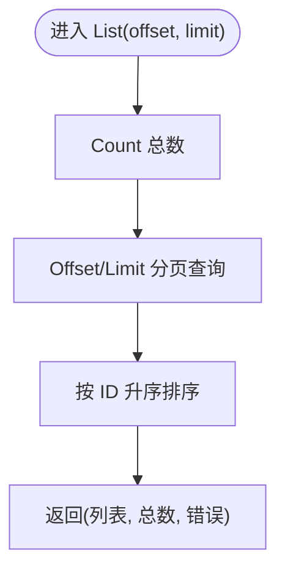

**图表来源**
- [certificate.go:13-23](file://internal/store/repository/certificate.go#L13-L23)
- [models.go:12-23](file://internal/store/models.go#L12-L23)

使用示例与最佳实践
- 分页参数校验：offset ≥ 0，limit ∈ (0, 1000]
- 排序稳定：以主键升序保证重复请求的一致性
- 删除前检查是否被站点引用（外键约束由数据库保障）

**章节来源**
- [certificate.go:13-36](file://internal/store/repository/certificate.go#L13-L36)
- [models.go:12-23](file://internal/store/models.go#L12-L23)

### IPListRepo（IP 黑白名单）
职责
- 支持 kind 过滤（黑名单/白名单）
- 列出启用项 AllEnabled
- 分页、详情、CRUD

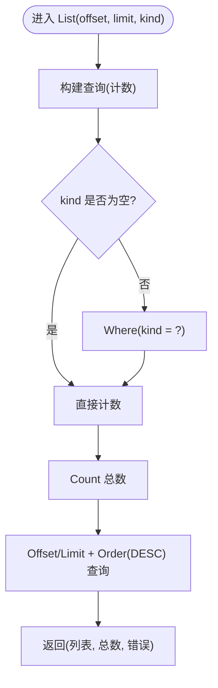

**图表来源**
- [ip_list.go:13-27](file://internal/store/repository/ip_list.go#L13-L27)
- [models.go:191-210](file://internal/store/models.go#L191-L210)

使用示例与最佳实践
- kind 使用常量值（黑名单/白名单），避免魔法字符串
- 启用状态默认开启，变更时注意缓存失效
- 大量条目时优先使用索引列（kind/value）进行过滤

**章节来源**
- [ip_list.go:13-41](file://internal/store/repository/ip_list.go#L13-L41)
- [models.go:191-210](file://internal/store/models.go#L191-L210)

### PolicyRepo（策略）
职责
- 分页列出、详情、CRUD
- 与 RuleRepo 通过 PolicyID 关联

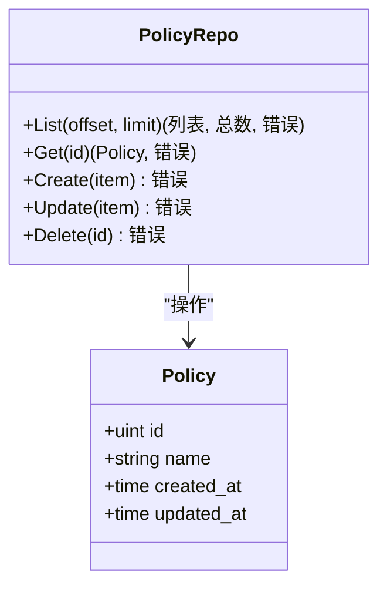

**图表来源**
- [policy.go:13-34](file://internal/store/repository/policy.go#L13-L34)
- [models.go:33-42](file://internal/store/models.go#L33-L42)

使用示例与最佳实践
- 删除策略前需清理关联规则（外键约束由数据库保障）
- 名称唯一性由模型唯一索引保障，冲突时返回错误

**章节来源**
- [policy.go:13-34](file://internal/store/repository/policy.go#L13-L34)
- [models.go:33-42](file://internal/store/models.go#L33-L42)

### RuleRepo（规则）
职责
- 分页列出、按策略筛选、详情、CRUD
- 默认排序：优先级升序，主键升序

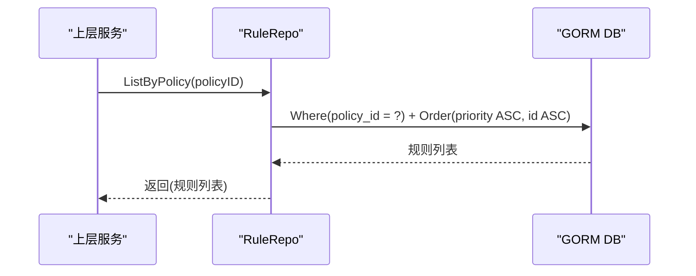

**图表来源**
- [rule.go:25-28](file://internal/store/repository/rule.go#L25-L28)
- [models.go:79-92](file://internal/store/models.go#L79-L92)

使用示例与最佳实践
- 优先级字段用于决定规则执行顺序，更新时谨慎修改
- 与策略解耦，支持跨策略复用规则模板

**章节来源**
- [rule.go:13-39](file://internal/store/repository/rule.go#L13-L39)
- [models.go:79-92](file://internal/store/models.go#L79-L92)

### SecurityEventRepo（安全事件）
职责
- 列表、详情、创建、批量创建、删除旧数据
- 复合过滤（动作、阶段、类别、客户端 IP、主机、路径、规则 ID、时间范围）
- 聚合统计：类别分布、Top IP、Top 路径、Top 规则、时间线

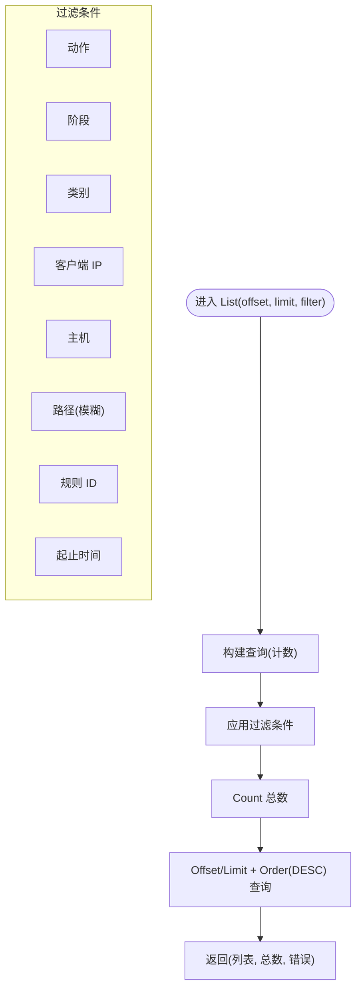

**图表来源**
- [security_event.go:30-44](file://internal/store/repository/security_event.go#L30-L44)
- [security_event.go:162-191](file://internal/store/repository/security_event.go#L162-L191)
- [models.go:212-236](file://internal/store/models.go#L212-L236)

使用示例与最佳实践
- 搜索路径使用模糊匹配（LIKE %path%），注意索引与性能
- 批量插入使用 CreateInBatches 提升吞吐
- 定期清理过期事件，避免表膨胀

**章节来源**
- [security_event.go:17-191](file://internal/store/repository/security_event.go#L17-L191)
- [models.go:212-236](file://internal/store/models.go#L212-L236)

### SiteRepo（站点）
职责
- 分页列出、查找启用站点、按绑定地址查找、详情、CRUD
- 与策略、证书存在外键关联

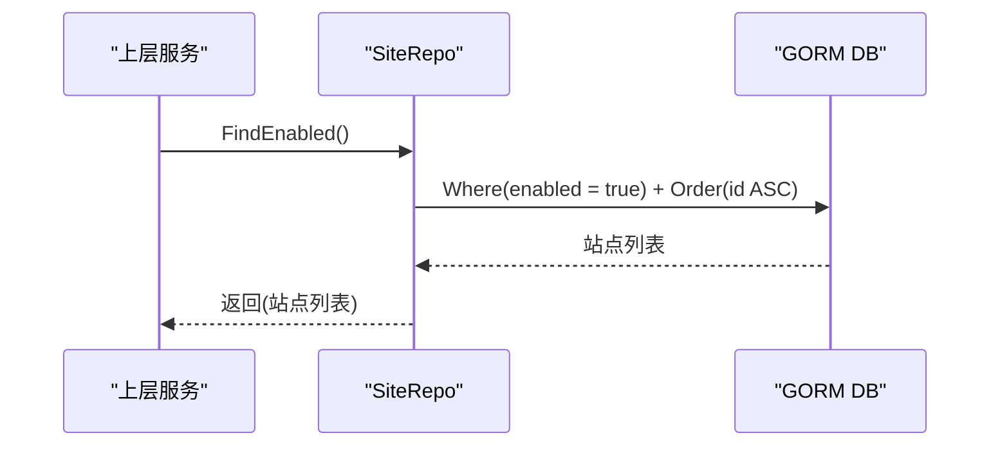

**图表来源**
- [site.go:25-28](file://internal/store/repository/site.go#L25-L28)
- [models.go:94-148](file://internal/store/models.go#L94-L148)

使用示例与最佳实践
- 启用状态用于快速筛选生效站点
- 绑定地址唯一性由模型索引保障，部署时避免冲突

**章节来源**
- [site.go:13-44](file://internal/store/repository/site.go#L13-L44)
- [models.go:94-148](file://internal/store/models.go#L94-L148)

### SystemSettingsRepo（系统设置）
职责
- 获取、设置、列出全部、删除
- 设置时若键不存在则创建，存在则更新

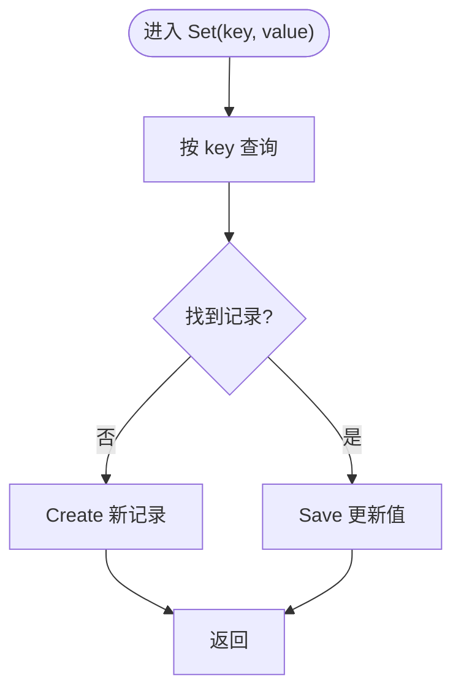

**图表来源**
- [system_settings.go:23-34](file://internal/store/repository/system_settings.go#L23-L34)
- [models.go:150-156](file://internal/store/models.go#L150-L156)

使用示例与最佳实践
- 键名唯一性由唯一索引保障
- 批量读取使用 All() 减少多次往返

**章节来源**
- [system_settings.go:15-43](file://internal/store/repository/system_settings.go#L15-L43)
- [models.go:150-156](file://internal/store/models.go#L150-L156)

## 依赖分析
- 仓储依赖关系
  - Repos 聚合器统一持有各仓储实例
  - 各仓储均依赖 GORM DB 句柄
  - 实体模型定义由 models.go 提供，仓储通过模型进行查询与映射
- 外部依赖
  - GORM 驱动：SQLite/MySQL/Postgres
  - 连接池参数：非 SQLite 场景设置最大连接数、空闲连接、生命周期
- 迁移依赖
  - 数据库迁移脚本确保模型演进与数据一致性

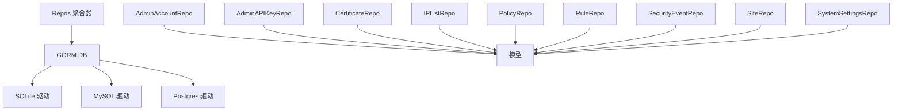

**图表来源**
- [repository.go:24-42](file://internal/store/repository/repository.go#L24-L42)
- [gorm.go:35-44](file://internal/core/database/gorm.go#L35-L44)
- [models.go:14-148](file://internal/store/models.go#L14-L148)

**章节来源**
- [repository.go:24-42](file://internal/store/repository/repository.go#L24-L42)
- [gorm.go:35-44](file://internal/core/database/gorm.go#L35-L44)
- [models.go:14-148](file://internal/store/models.go#L14-L148)

## 性能考虑
- 连接池与驱动选择
  - 非 SQLite：设置最大打开连接数、最大空闲连接数、连接最大生命周期与空闲时间
  - SQLite：单连接以避免锁竞争，启用 WAL、busy_timeout、foreign_keys 等 PRAGMA 提升并发与一致性
- 预编译语句与日志级别
  - 启用 PrepareStmt 缓存预编译语句，降低重复查询开销
  - 日志级别设为 Warn，减少调试日志对生产的影响
- 查询优化
  - 为高频过滤列（如索引列）添加 WHERE 条件
  - 分页使用 Offset/Limit，配合 ORDER 主键升序保证稳定性
  - 大批量写入使用 CreateInBatches
- 索引与约束
  - 模型中已定义索引与唯一约束，仓储查询应尽量命中索引
  - 外键约束由数据库保障，删除前需清理关联数据

**章节来源**
- [gorm.go:24-61](file://internal/core/database/gorm.go#L24-L61)
- [models.go:14-148](file://internal/store/models.go#L14-L148)
- [security_event.go:55-59](file://internal/store/repository/security_event.go#L55-L59)

## 故障排除指南
- 记录未找到
  - 使用 gorm.ErrRecordNotFound 判断，避免误判为系统错误
  - 在设置键值对时区分“不存在”与“存在但错误”
- 唯一性冲突
  - 用户名、API Key、系统设置键等唯一约束冲突时，返回错误
  - 建议在调用前做存在性检查或捕获错误并提示用户
- 外键约束失败
  - 删除策略/站点等实体时，若存在关联数据会失败
  - 建议先清理子数据或使用级联删除策略（需谨慎评估）
- 批量写入失败
  - CreateInBatches 会整体回滚，检查每批大小与数据合法性
- 过期数据清理
  - 使用 DeleteOlderThan 清理历史事件，注意备份与审计

**章节来源**
- [system_settings.go:23-34](file://internal/store/repository/system_settings.go#L23-L34)
- [security_event.go:62-66](file://internal/store/repository/security_event.go#L62-L66)

## 结论
本数据访问层以仓储聚合器为核心，结合 GORM 的强大能力，实现了统一、可扩展、高性能的数据访问方案。通过明确的接口定义、严格的事务边界管理、完善的错误处理与性能优化策略，能够满足从简单 CRUD 到复杂分页、过滤与聚合统计的多样化需求。建议在实际开发中遵循本文的最佳实践，确保系统的稳定性与可维护性。

## 附录

### 事务边界管理
- 单操作事务
  - GORM 默认行为：每个 CRUD 操作独立提交
  - 若需要强一致性，可在上层服务中显式使用 db.Transaction 包裹多个操作
- 批量操作事务
  - 批量插入使用 CreateInBatches，内部可能分批执行
  - 大批量数据清理或迁移建议使用 db.Transaction，确保原子性

**章节来源**
- [gorm.go:26-30](file://internal/core/database/gorm.go#L26-L30)
- [v2_single_site.go:23-49](file://internal/store/migrations/v2_single_site.go#L23-L49)

### 数据验证与业务规则
- 唯一性检查
  - 用户名、API Key、系统设置键等字段具备唯一索引
  - 仓储在创建/更新时依赖数据库约束，错误即刻反馈
- 关联完整性
  - 规则依赖策略、站点依赖证书/策略等
  - 删除前检查是否存在子记录，必要时先清理或拒绝删除

**章节来源**
- [models.go:170-177](file://internal/store/models.go#L170-L177)
- [models.go:158-168](file://internal/store/models.go#L158-L168)
- [models.go:150-156](file://internal/store/models.go#L150-L156)

### 分页查询与搜索
- 分页
  - 统一使用 Count + Offset/Limit + Order 稳定排序
  - offset ≥ 0，limit ∈ (0, 1000] 为常见合理范围
- 搜索
  - 路径使用模糊匹配（LIKE %path%）
  - 复合条件过滤通过 SecurityEventFilter 组合
- 聚合统计
  - 类别分布、Top IP/路径/规则、时间线等通过 Group/Scan 实现

**章节来源**
- [certificate.go:13-23](file://internal/store/repository/certificate.go#L13-L23)
- [security_event.go:30-44](file://internal/store/repository/security_event.go#L30-L44)
- [security_event.go:75-153](file://internal/store/repository/security_event.go#L75-L153)

### 依赖注入与初始化
- 初始化步骤
  - 通过 database.Open 获取 GORM DB
  - 使用 New(db) 构造 Repos 聚合器
  - 将 Repos 注入到上层服务
- 生命周期
  - Repos 作为应用级单例，仓储实例共享同一 DB 句柄

**章节来源**
- [gorm.go:24-61](file://internal/core/database/gorm.go#L24-L61)
- [repository.go:24-42](file://internal/store/repository/repository.go#L24-L42)