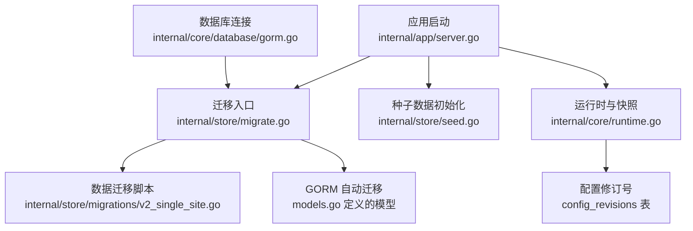
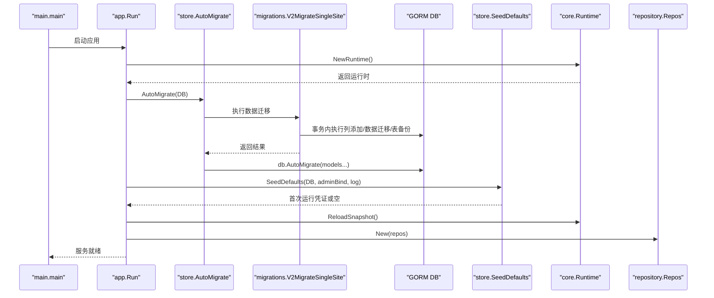
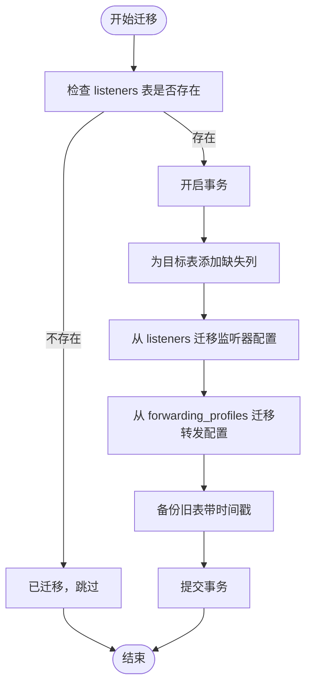
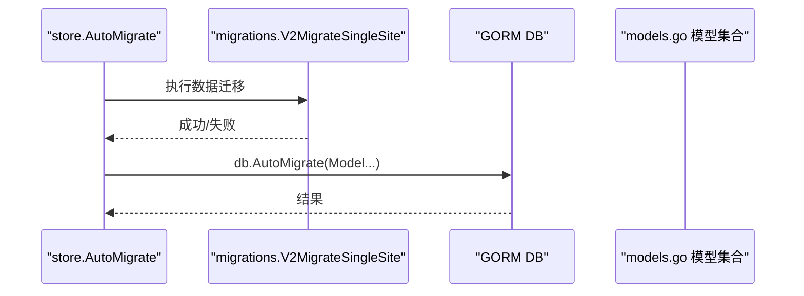
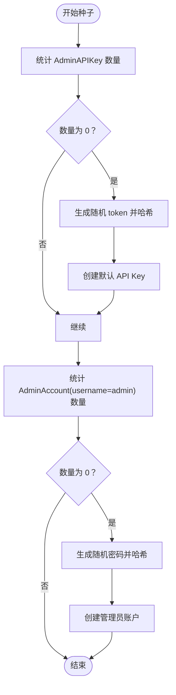
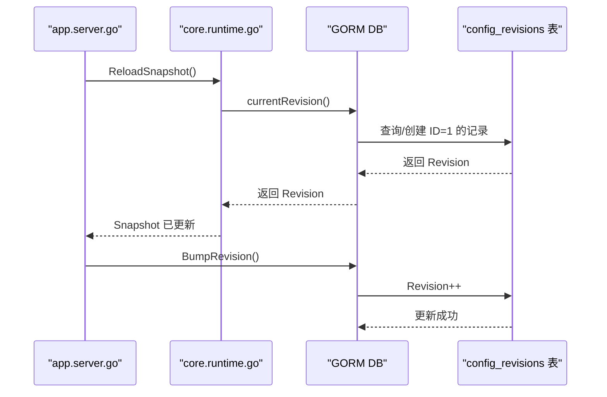
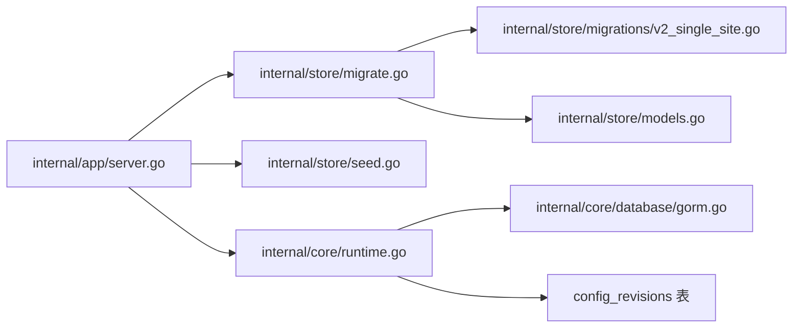

# 数据迁移管理

<cite>
**本文引用的文件列表**
- [migrate.go](file://internal/store/migrate.go)
- [seed.go](file://internal/store/seed.go)
- [v2_single_site.go](file://internal/store/migrations/v2_single_site.go)
- [models.go](file://internal/store/models.go)
- [gorm.go](file://internal/core/database/gorm.go)
- [server.go](file://internal/app/server.go)
- [runtime.go](file://internal/core/runtime.go)
- [config.go](file://internal/core/config.go)
- [logger.go](file://internal/pkg/logger/logger.go)
- [archiver.go](file://internal/observability/archiver.go)
</cite>

## 目录
1. [简介](#简介)
2. [项目结构与迁移相关模块](#项目结构与迁移相关模块)
3. [核心组件](#核心组件)
4. [架构总览](#架构总览)
5. [详细组件分析](#详细组件分析)
6. [依赖关系分析](#依赖关系分析)
7. [性能考量](#性能考量)
8. [故障排查指南](#故障排查指南)
9. [结论](#结论)
10. [附录：迁移最佳实践与操作步骤](#附录迁移最佳实践与操作步骤)

## 简介
本文件系统性梳理 My-OpenWaf 的数据迁移管理方案，覆盖版本控制、迁移脚本组织与执行顺序、数据库迁移（表结构变更、数据转换、索引重建）、种子数据管理（初始数据、测试数据、演示数据）、回滚机制（向前迁移与向后回滚）、迁移安全（备份策略、事务保证、数据完整性校验）、迁移监控与日志记录、常见问题诊断与解决方案，以及跨版本迁移的步骤说明与注意事项。目标是帮助开发者与运维人员在不破坏生产数据的前提下，安全、可重复地完成数据库演进。

## 项目结构与迁移相关模块
- 迁移入口与调度
  - 应用启动时调用迁移与种子流程，确保数据库 schema 与默认数据就绪。
- 迁移脚本组织
  - 数据迁移脚本集中于 migrations 包，按版本命名；GORM 模型定义位于 models.go。
- 数据库连接与方言
  - 支持 sqlite、mysql、postgres，连接池与性能参数在 core/database/gorm.go 中统一配置。
- 种子数据
  - 初始化默认 API Key 与管理员账户，首次运行时输出凭证提示。
- 运行时与快照
  - 运行时通过 revision 控制热重载与配置同步，配合 Redis 实现分布式通知。

图表来源
- [server.go:46-75](file://internal/app/server.go#L46-L75)
- [migrate.go:10-37](file://internal/store/migrate.go#L10-L37)
- [v2_single_site.go:16-50](file://internal/store/migrations/v2_single_site.go#L16-L50)
- [models.go:96-148](file://internal/store/models.go#L96-L148)
- [gorm.go:25-61](file://internal/core/database/gorm.go#L25-L61)
- [runtime.go:82-111](file://internal/core/runtime.go#L82-L111)

章节来源
- [server.go:35-75](file://internal/app/server.go#L35-L75)
- [migrate.go:1-56](file://internal/store/migrate.go#L1-L56)
- [seed.go:1-68](file://internal/store/seed.go#L1-L68)
- [v2_single_site.go:1-189](file://internal/store/migrations/v2_single_site.go#L1-L189)
- [models.go:1-456](file://internal/store/models.go#L1-L456)
- [gorm.go:1-111](file://internal/core/database/gorm.go#L1-L111)
- [runtime.go:17-127](file://internal/core/runtime.go#L17-L127)

## 核心组件
- 迁移入口与顺序
  - 先执行数据迁移脚本，再进行 GORM schema 自动迁移，确保数据层先就绪。
- 数据迁移脚本
  - v2_single_site.go 将 Listener 与 ForwardingProfile 合并到 Site，包含列添加、数据迁移、旧表备份与删除。
- GORM 模型与自动迁移
  - models.go 定义所有领域模型，migrate.go 调用 db.AutoMigrate 对齐 schema。
- 种子数据
  - seed.go 在首次运行时生成默认 API Key 与管理员账户，并输出一次性凭证。
- 运行时与配置修订
  - runtime.go 提供当前 revision 查询与 bump，server.go 在配置变更时触发热重载与 revision bump。
- 数据库连接与方言
  - gorm.go 统一处理 sqlite/mysql/postgres，设置连接池与性能参数。

章节来源
- [migrate.go:10-37](file://internal/store/migrate.go#L10-L37)
- [v2_single_site.go:10-50](file://internal/store/migrations/v2_single_site.go#L10-L50)
- [models.go:96-148](file://internal/store/models.go#L96-L148)
- [seed.go:15-61](file://internal/store/seed.go#L15-L61)
- [runtime.go:101-111](file://internal/core/runtime.go#L101-L111)
- [server.go:220-242](file://internal/app/server.go#L220-L242)
- [gorm.go:25-61](file://internal/core/database/gorm.go#L25-L61)

## 架构总览
下图展示迁移与种子在启动流程中的位置，以及与数据库、运行时的关系。

图表来源
- [server.go:35-75](file://internal/app/server.go#L35-L75)
- [migrate.go:10-37](file://internal/store/migrate.go#L10-L37)
- [v2_single_site.go:23-49](file://internal/store/migrations/v2_single_site.go#L23-L49)
- [seed.go:15-61](file://internal/store/seed.go#L15-L61)
- [runtime.go:82-99](file://internal/core/runtime.go#L82-L99)

## 详细组件分析

### 数据迁移脚本：v2_single_site.go
- 设计目标
  - 将 Listener 与 ForwardingProfile 合并到 Site，减少表数量，简化配置模型。
- 关键步骤
  - 检查是否已迁移（若 listeners 表不存在则跳过）。
  - 事务内执行：
    - 为目标表添加新列（如 bind、network、enabled、tls_*、cipher_suites、alpn、bot_protection_*、attack_protection_*、xff_mode、trusted_cidr、preserve_original_host）。
    - 从 listeners 迁移监听器配置到 sites。
    - 从 forwarding_profiles 迁移转发配置到 sites。
    - 备份旧表（以时间戳命名）。
- 数据完整性与安全
  - 使用事务包裹整个迁移过程，失败即回滚。
  - 通过 HasTable 判断避免重复执行。
  - 备份旧表，保留历史数据以便回退。

图表来源
- [v2_single_site.go:16-50](file://internal/store/migrations/v2_single_site.go#L16-L50)
- [v2_single_site.go:52-82](file://internal/store/migrations/v2_single_site.go#L52-L82)
- [v2_single_site.go:84-127](file://internal/store/migrations/v2_single_site.go#L84-L127)
- [v2_single_site.go:129-166](file://internal/store/migrations/v2_single_site.go#L129-L166)

章节来源
- [v2_single_site.go:10-189](file://internal/store/migrations/v2_single_site.go#L10-L189)

### 迁移入口与顺序：migrate.go
- AutoMigrate
  - 先调用数据迁移函数，再对所有模型执行 db.AutoMigrate，确保数据层先就绪。
- 配置修订
  - BumpRevision 增加修订号。
  - CurrentRevision 获取当前修订号。

图表来源
- [migrate.go:10-37](file://internal/store/migrate.go#L10-L37)
- [models.go:18-36](file://internal/store/models.go#L18-L36)

章节来源
- [migrate.go:9-56](file://internal/store/migrate.go#L9-L56)

### 种子数据：seed.go
- 功能
  - 首次运行时生成默认 API Key（名称 default，哈希存储）。
  - 首次运行时生成管理员账户（用户名 admin，密码随机生成并哈希存储）。
  - 返回首次运行的 token 与密码（仅显示一次）。
- 安全性
  - 使用 bcrypt 哈希存储敏感信息。
  - 通过统计计数判断是否首次运行，避免重复创建。

图表来源
- [seed.go:18-61](file://internal/store/seed.go#L18-L61)

章节来源
- [seed.go:13-68](file://internal/store/seed.go#L13-L68)

### 运行时与配置修订：runtime.go 与 server.go
- 运行时
  - 提供 ReloadSnapshot，基于当前 revision 构建快照。
  - currentRevision 读取 config_revisions 表的 Revision 字段。
- 配置热重载
  - server.go 的 reload 函数在配置变更时 bump revision 并重新加载快照，同时更新限流与 IP 黑白名单等。

图表来源
- [runtime.go:82-111](file://internal/core/runtime.go#L82-L111)
- [server.go:220-242](file://internal/app/server.go#L220-L242)

章节来源
- [runtime.go:82-111](file://internal/core/runtime.go#L82-L111)
- [server.go:220-242](file://internal/app/server.go#L220-L242)

### 数据库连接与方言：gorm.go
- 支持 sqlite/mysql/postgres 三种驱动。
- sqlite 默认启用 WAL、busy_timeout、foreign_keys 等参数，提升并发与一致性。
- 非 sqlite 设置连接池上限与生命周期，避免资源泄漏。
- 关闭默认事务包装，减少小批量写入的开销。

章节来源
- [gorm.go:25-111](file://internal/core/database/gorm.go#L25-L111)

### 日志与监控：logger.go 与 archiver.go
- 日志
  - 内置 prettyHandler，支持颜色、级别过滤与全局单例。
- 归档清理
  - 定期删除超过保留期的安全事件，降低存储压力。

章节来源
- [logger.go:42-114](file://internal/pkg/logger/logger.go#L42-L114)
- [archiver.go:21-71](file://internal/observability/archiver.go#L21-L71)

## 依赖关系分析
- 组件耦合
  - app/server.go 依赖 store/migrate 与 store/seed，负责启动阶段的迁移与种子。
  - store/migrate 依赖 migrations/v2_single_site 与 models.go。
  - runtime.go 依赖 gorm 连接与 config_revisions 表，支撑热重载。
- 外部依赖
  - GORM、各数据库驱动、Redis（可选）。
- 循环依赖
  - 未发现循环导入；数据库选项结构体独立于 core，避免循环。

图表来源
- [server.go:46-75](file://internal/app/server.go#L46-L75)
- [migrate.go:10-37](file://internal/store/migrate.go#L10-L37)
- [v2_single_site.go:16-50](file://internal/store/migrations/v2_single_site.go#L16-L50)
- [models.go:18-36](file://internal/store/models.go#L18-L36)
- [seed.go:15-61](file://internal/store/seed.go#L15-L61)
- [runtime.go:82-111](file://internal/core/runtime.go#L82-L111)
- [gorm.go:25-61](file://internal/core/database/gorm.go#L25-L61)

章节来源
- [server.go:35-75](file://internal/app/server.go#L35-L75)
- [migrate.go:1-56](file://internal/store/migrate.go#L1-L56)
- [seed.go:1-68](file://internal/store/seed.go#L1-L68)
- [runtime.go:17-127](file://internal/core/runtime.go#L17-L127)
- [gorm.go:1-111](file://internal/core/database/gorm.go#L1-L111)

## 性能考量
- 连接池与预编译语句
  - 非 sqlite 设置最大连接数、空闲连接数与生命周期；启用 PrepareStmt 缓存预编译语句。
- SQLite 特性
  - WAL 模式、busy_timeout、foreign_keys、缓存大小等参数优化并发与一致性。
- 迁移性能
  - 数据迁移在事务中执行，避免多次提交带来的开销；大表迁移建议分批或在低峰时段执行。
- 日志与归档
  - 归档任务周期性清理旧事件，降低查询与存储压力。

章节来源
- [gorm.go:49-94](file://internal/core/database/gorm.go#L49-L94)
- [archiver.go:21-71](file://internal/observability/archiver.go#L21-L71)

## 故障排查指南
- 迁移失败
  - 现象：AutoMigrate 或 V2MigrateSingleSite 报错。
  - 排查：
    - 检查数据库权限与连接字符串。
    - 查看日志中错误上下文（事务回滚、列添加失败、数据迁移异常）。
    - 确认 listeners 表存在且结构符合预期。
- 种子失败
  - 现象：首次运行未生成默认 API Key 或管理员账户。
  - 排查：
    - 确认 AdminAPIKey 与 AdminAccount 表存在。
    - 检查 bcrypt 哈希生成与数据库写入是否成功。
- 热重载无效
  - 现象：修改配置后未生效。
  - 排查：
    - 确认 BumpRevision 成功更新 config_revisions。
    - 检查 Redis 订阅是否正常，reload 回调是否被触发。
- 日志与监控
  - 使用内置日志器查看迁移与种子阶段的关键信息。
  - 归档任务定期清理旧事件，关注清理日志中的错误。

章节来源
- [server.go:46-75](file://internal/app/server.go#L46-L75)
- [migrate.go:10-37](file://internal/store/migrate.go#L10-L37)
- [seed.go:15-61](file://internal/store/seed.go#L15-L61)
- [runtime.go:82-111](file://internal/core/runtime.go#L82-L111)
- [logger.go:42-114](file://internal/pkg/logger/logger.go#L42-L114)
- [archiver.go:21-71](file://internal/observability/archiver.go#L21-L71)

## 结论
该迁移体系以“数据迁移优先、schema 自动对齐”为核心，结合事务保障、备份策略与运行时修订号，实现了可重复、可回退、可观测的数据库演进路径。配合种子数据与热重载机制，能够在不中断服务的情况下完成版本升级与配置变更。建议在生产环境中遵循本文最佳实践，确保迁移安全与稳定性。

## 附录：迁移最佳实践与操作步骤

### 版本控制与迁移脚本组织
- 命名规范
  - 数据迁移脚本按版本命名（如 v2_single_site.go），便于识别与排序。
- 执行顺序
  - 启动时先执行数据迁移，再执行 GORM schema 自动迁移。
- 事务与回滚
  - 将关键步骤放入单个事务中，失败即回滚，确保原子性。

章节来源
- [v2_single_site.go:23-49](file://internal/store/migrations/v2_single_site.go#L23-L49)
- [migrate.go:10-37](file://internal/store/migrate.go#L10-L37)

### 数据库迁移（表结构变更、数据转换、索引重建）
- 表结构变更
  - 使用 HasColumn/HasTable 检查，避免重复执行。
  - 列添加与类型调整需考虑兼容性与默认值。
- 数据转换
  - 使用 JOIN 查询与批量更新，必要时分批处理大表。
- 索引重建
  - 建议在迁移完成后重建或验证索引，确保查询性能。

章节来源
- [v2_single_site.go:52-82](file://internal/store/migrations/v2_single_site.go#L52-L82)
- [v2_single_site.go:84-166](file://internal/store/migrations/v2_single_site.go#L84-L166)

### 种子数据管理（初始数据、测试数据、演示数据）
- 初始数据
  - 首次运行生成默认 API Key 与管理员账户，返回一次性凭证。
- 测试与演示数据
  - 可在开发环境使用独立脚本或命令生成测试数据，避免污染生产。
- 安全性
  - 密码与令牌使用哈希存储，避免明文泄露。

章节来源
- [seed.go:15-61](file://internal/store/seed.go#L15-L61)

### 迁移回滚机制（向前迁移与向后回滚）
- 向前迁移
  - 通过事务包裹，失败自动回滚；成功后更新修订号。
- 向后回滚
  - 当前实现未提供通用回滚函数，建议通过备份表恢复（旧表已重命名为带时间戳的备份表）。
  - 回滚前务必备份当前状态，确认备份完整后再执行恢复。

章节来源
- [v2_single_site.go:40-46](file://internal/store/migrations/v2_single_site.go#L40-L46)
- [migrate.go:39-55](file://internal/store/migrate.go#L39-L55)

### 迁移安全性（备份策略、事务保证、数据完整性检查）
- 备份策略
  - 迁移前导出关键表或创建只读副本；迁移后保留备份一段时间。
- 事务保证
  - 数据迁移在事务中执行，失败回滚。
- 数据完整性检查
  - 迁移后执行一致性校验（如计数、关键字段比对）。

章节来源
- [v2_single_site.go:23-49](file://internal/store/migrations/v2_single_site.go#L23-L49)
- [v2_single_site.go:40-46](file://internal/store/migrations/v2_single_site.go#L40-L46)

### 测试策略、生产环境部署与回滚预案
- 测试策略
  - 在预生产环境复现迁移流程，验证数据与 schema 正确性。
- 生产部署
  - 选择低峰时段执行；开启监控与告警；准备回滚预案。
- 回滚预案
  - 明确回滚步骤与责任人；准备备份恢复脚本。

章节来源
- [server.go:46-75](file://internal/app/server.go#L46-L75)
- [v2_single_site.go:40-46](file://internal/store/migrations/v2_single_site.go#L40-L46)

### 迁移监控与日志记录
- 日志
  - 使用内置日志器输出迁移与种子阶段的关键信息。
- 归档
  - 定期清理旧事件，降低存储与查询压力。
- 健康检查
  - 通过健康端点与日志观察迁移与服务状态。

章节来源
- [logger.go:42-114](file://internal/pkg/logger/logger.go#L42-L114)
- [archiver.go:21-71](file://internal/observability/archiver.go#L21-L71)

### 不同版本间的迁移步骤与注意事项
- 步骤
  - 备份数据库 → 下载新版本 → 启动应用（自动执行迁移与种子） → 验证 schema 与数据 → 观察日志与指标 → 完成上线。
- 注意事项
  - 保持数据库连接稳定；确保有足够的磁盘空间；在事务外避免长时间持有锁；迁移期间限制写入或采用只读模式。

章节来源
- [server.go:35-75](file://internal/app/server.go#L35-L75)
- [migrate.go:10-37](file://internal/store/migrate.go#L10-L37)
- [seed.go:15-61](file://internal/store/seed.go#L15-L61)