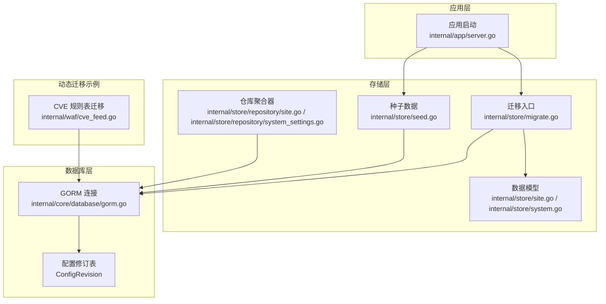
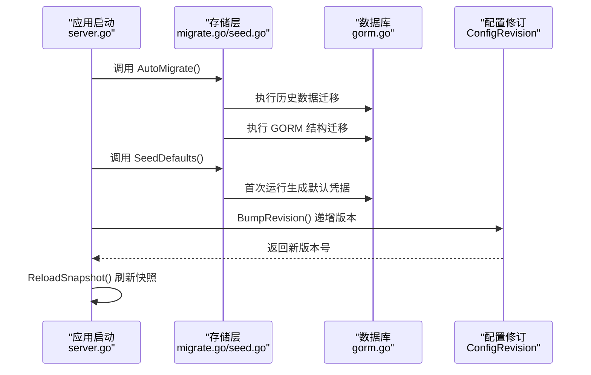
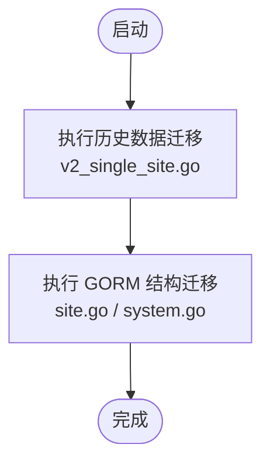
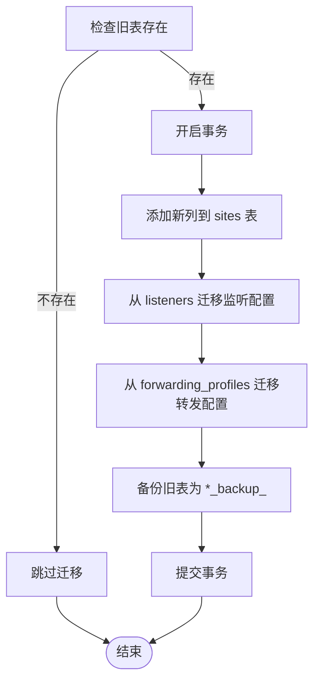
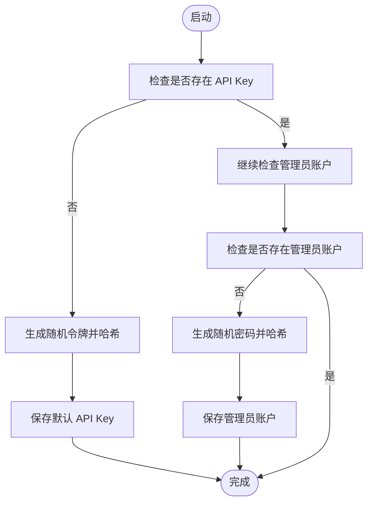
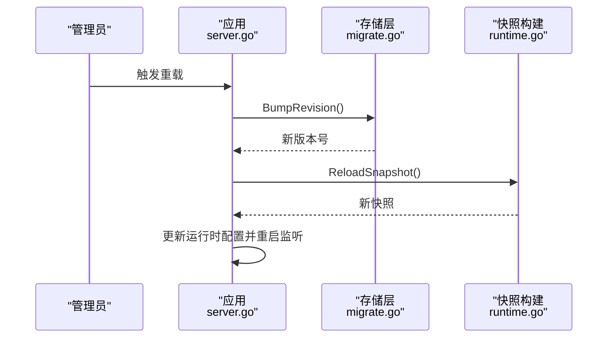
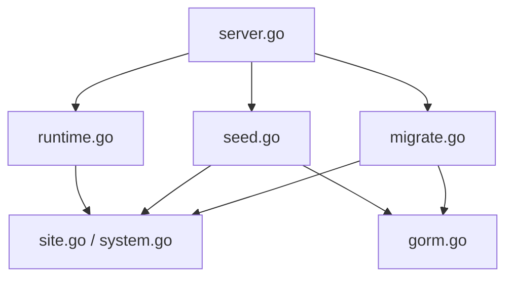

# 数据迁移管理

<cite>
**本文引用的文件**
- [migrate.go](file://internal/store/migrate.go)
- [seed.go](file://internal/store/seed.go)
- [v2_single_site.go](file://internal/store/migrations/v2_single_site.go)
- [site.go](file://internal/store/site.go)
- [system.go](file://internal/store/system.go)
- [gorm.go](file://internal/core/database/gorm.go)
- [server.go](file://internal/app/server.go)
- [site.go](file://internal/store/repository/site.go)
- [system_settings.go](file://internal/store/repository/system_settings.go)
- [runtime.go](file://internal/core/runtime.go)
- [cve_feed.go](file://internal/waf/cve_feed.go)
</cite>

## 目录
1. [简介](#简介)
2. [项目结构](#项目结构)
3. [核心组件](#核心组件)
4. [架构总览](#架构总览)
5. [详细组件分析](#详细组件分析)
6. [依赖分析](#依赖分析)
7. [性能考虑](#性能考虑)
8. [故障排查指南](#故障排查指南)
9. [结论](#结论)
10. [附录](#附录)

## 简介
本文件系统化阐述 My-OpenWaf 的数据库迁移管理机制，覆盖迁移文件组织、版本管理与执行顺序控制、配置升级策略（含向后兼容）、迁移回滚与备份策略、种子数据管理（首次运行凭据生成）、迁移脚本编写指南与最佳实践，以及迁移测试策略与生产环境注意事项。文档以代码为依据，结合架构图与流程图帮助读者快速理解并安全地实施数据库演进。

## 项目结构
迁移与种子数据相关的关键位置如下：
- 存储层与模型：internal/store
  - 迁移入口与版本管理：internal/store/migrate.go
  - 种子数据：internal/store/seed.go
  - 历史迁移脚本：internal/store/migrations/v2_single_site.go
  - 数据模型定义：internal/store/site.go、internal/store/system.go
  - 仓库聚合器：internal/store/repository/site.go、internal/store/repository/system_settings.go
- 数据库连接与驱动：internal/core/database/gorm.go
- 应用启动与迁移触发：internal/app/server.go
- 运行时与快照：internal/core/runtime.go
- 动态迁移示例：internal/waf/cve_feed.go

图表来源
- [server.go:52-92](file://internal/app/server.go#L52-L92)
- [migrate.go:9-41](file://internal/store/migrate.go#L9-L41)
- [seed.go:13-61](file://internal/store/seed.go#L13-L61)
- [site.go:16-81](file://internal/store/site.go#L16-L81)
- [system.go:3-15](file://internal/store/system.go#L3-L15)
- [gorm.go:24-61](file://internal/core/database/gorm.go#L24-L61)
- [cve_feed.go:77-90](file://internal/waf/cve_feed.go#L77-L90)

章节来源
- [server.go:52-92](file://internal/app/server.go#L52-L92)
- [migrate.go:9-41](file://internal/store/migrate.go#L9-L41)
- [seed.go:13-61](file://internal/store/seed.go#L13-L61)
- [site.go:16-81](file://internal/store/site.go#L16-L81)
- [system.go:3-15](file://internal/store/system.go#L3-L15)
- [gorm.go:24-61](file://internal/core/database/gorm.go#L24-L61)
- [cve_feed.go:77-90](file://internal/waf/cve_feed.go#L77-L90)

## 核心组件
- 迁移入口与顺序控制
  - 自动迁移：在应用启动时调用迁移入口，先执行历史数据迁移，再进行 GORM 模型的结构迁移。
  - 版本管理：通过配置修订表记录当前配置版本，支持热重载时递增版本号并刷新快照。
- 种子数据
  - 首次运行自动生成默认 API Key 与管理员账户，确保最小可用配置。
- 数据模型与仓库
  - 统一的数据模型定义，配合仓库聚合器实现领域操作。
- 数据库连接
  - 支持 SQLite、MySQL、PostgreSQL，针对不同驱动进行连接池与性能参数优化。
- 动态迁移示例
  - 某些模块在运行时按需迁移特定表，确保功能启用时具备正确结构。

章节来源
- [migrate.go:9-41](file://internal/store/migrate.go#L9-L41)
- [migrate.go:43-59](file://internal/store/migrate.go#L43-L59)
- [seed.go:13-61](file://internal/store/seed.go#L13-L61)
- [site.go:16-81](file://internal/store/site.go#L16-L81)
- [system_settings.go:9-44](file://internal/store/repository/system_settings.go#L9-L44)
- [gorm.go:24-61](file://internal/core/database/gorm.go#L24-L61)
- [cve_feed.go:77-90](file://internal/waf/cve_feed.go#L77-L90)

## 架构总览
下图展示从应用启动到迁移、种子数据注入、版本管理与快照构建的完整流程。

图表来源
- [server.go:63-92](file://internal/app/server.go#L63-L92)
- [migrate.go:9-41](file://internal/store/migrate.go#L9-L41)
- [seed.go:13-61](file://internal/store/seed.go#L13-L61)
- [runtime.go:82-99](file://internal/core/runtime.go#L82-L99)

## 详细组件分析

### 迁移入口与执行顺序控制
- 执行顺序
  - 先执行历史数据迁移（如 v2 合并 Listener 与 ForwardingProfile），再执行 GORM 模型结构迁移。
  - 结构迁移覆盖证书、策略、规则、站点、系统设置、管理员 API Key、配置修订、管理员账户、刷新令牌、安全事件、IP 黑白名单、令牌黑名单、登录尝试、活动会话、丢弃事件、机器人评分日志、CVE 同步日志、应用路由规则、录制资源等。
- 版本管理
  - 通过配置修订表记录当前版本；热重载时递增版本并刷新快照，确保运行时配置一致性。

图表来源
- [migrate.go:9-41](file://internal/store/migrate.go#L9-L41)
- [v2_single_site.go:16-50](file://internal/store/migrations/v2_single_site.go#L16-L50)

章节来源
- [migrate.go:9-41](file://internal/store/migrate.go#L9-L41)
- [migrate.go:43-59](file://internal/store/migrate.go#L43-L59)

### 历史迁移：v2 单站点合并
- 目标：将 Listener 与 ForwardingProfile 的配置迁移到 Site 表，并保留旧表为备份。
- 步骤
  - 检查是否已执行过迁移（若旧表不存在则跳过）。
  - 在事务中执行：添加新列、从 listeners 迁移监听配置、从 forwarding_profiles 迁移转发配置、备份旧表（带时间戳后缀）、删除旧表。
- 备份策略
  - 旧表重命名为带时间戳的备份名，便于回滚或审计。

图表来源
- [v2_single_site.go:16-50](file://internal/store/migrations/v2_single_site.go#L16-L50)
- [v2_single_site.go:52-82](file://internal/store/migrations/v2_single_site.go#L52-L82)
- [v2_single_site.go:84-127](file://internal/store/migrations/v2_single_site.go#L84-L127)
- [v2_single_site.go:129-166](file://internal/store/migrations/v2_single_site.go#L129-L166)

章节来源
- [v2_single_site.go:10-50](file://internal/store/migrations/v2_single_site.go#L10-L50)
- [v2_single_site.go:52-166](file://internal/store/migrations/v2_single_site.go#L52-L166)

### 配置升级策略与向后兼容
- 结构演进
  - 使用 GORM 的 AutoMigrate 对新增字段与索引进行平滑升级。
  - 通过历史迁移脚本处理跨版本的数据整合（如 v2 将 Listener/ForwardingProfile 合并至 Site）。
- 向后兼容
  - 模型中保留兼容字段与默认值，避免破坏既有数据。
  - 示例：规则动作枚举包含历史值映射到新值，确保旧数据可读且行为一致。
- 动态迁移
  - 某些模块在运行时检测并迁移所需表，降低启动时复杂度。

章节来源
- [site.go:16-81](file://internal/store/site.go#L16-L81)
- [cve_feed.go:77-90](file://internal/waf/cve_feed.go#L77-L90)

### 迁移回滚机制与备份策略
- 回滚路径
  - 历史迁移脚本对旧表进行备份（带时间戳），可在必要时通过数据库工具恢复旧表。
  - 对于 GORM 结构迁移，建议在生产环境使用受控变更窗口与备份策略，不建议直接逆向执行结构变更。
- 部分回滚
  - 可基于备份表恢复特定受影响的业务数据，但需谨慎评估影响范围。
- 完全回退
  - 通过备份表与快照版本控制，结合数据库层面的备份与恢复流程实现整体回退。

章节来源
- [v2_single_site.go:39-49](file://internal/store/migrations/v2_single_site.go#L39-L49)

### 种子数据管理
- 目标
  - 首次运行自动生成默认 API Key 与管理员账户，保障最小可用配置。
- 流程
  - 若未检测到现有 API Key，则生成随机令牌并存入哈希；若未检测到管理员账户，则生成随机密码并存入哈希。
  - 返回首次运行凭据（仅显示一次），便于运维保存。
- 安全性
  - 密码与令牌均采用哈希存储，避免明文泄露。

图表来源
- [seed.go:13-61](file://internal/store/seed.go#L13-L61)

章节来源
- [seed.go:13-61](file://internal/store/seed.go#L13-L61)

### 版本管理与热重载
- 版本表
  - 通过配置修订表记录当前版本，支持查询与递增。
- 热重载
  - 重载时递增版本并重新构建快照，同时更新速率限制、IP 黑白名单与自动封禁策略等运行时配置。
- 分布式通知
  - 通过 Redis 发布订阅通知其他节点同步配置。

图表来源
- [server.go:313-334](file://internal/app/server.go#L313-L334)
- [migrate.go:43-59](file://internal/store/migrate.go#L43-L59)
- [runtime.go:82-99](file://internal/core/runtime.go#L82-L99)

章节来源
- [migrate.go:43-59](file://internal/store/migrate.go#L43-L59)
- [server.go:313-334](file://internal/app/server.go#L313-L334)
- [runtime.go:82-99](file://internal/core/runtime.go#L82-L99)

### 数据库连接与驱动
- 支持 SQLite、MySQL、PostgreSQL
- 针对非 SQLite 设置连接池参数，提升并发与稳定性
- SQLite 使用 WAL 模式与单连接策略，避免锁争用

章节来源
- [gorm.go:24-61](file://internal/core/database/gorm.go#L24-L61)
- [gorm.go:63-94](file://internal/core/database/gorm.go#L63-L94)
- [gorm.go:96-110](file://internal/core/database/gorm.go#L96-L110)

### 仓库与模型
- 仓库聚合器集中管理各实体仓库，便于统一初始化与依赖注入
- 管理员账户仓库提供密码校验与更新能力

章节来源
- [site.go:9-54](file://internal/store/repository/site.go#L9-L54)
- [system_settings.go:9-44](file://internal/store/repository/system_settings.go#L9-L44)

## 依赖分析
- 组件耦合
  - 应用启动依赖存储层迁移与种子数据；存储层依赖数据库连接与模型定义。
  - 版本管理与快照构建相互依赖，共同支撑热重载。
- 外部依赖
  - GORM 提供 ORM 与迁移能力；bcrypt 用于密码哈希；SQLite/MySQL/Postgres 驱动提供多数据库支持。

图表来源
- [server.go:63-92](file://internal/app/server.go#L63-L92)
- [migrate.go:9-41](file://internal/store/migrate.go#L9-L41)
- [seed.go:13-61](file://internal/store/seed.go#L13-L61)
- [site.go:16-81](file://internal/store/site.go#L16-L81)
- [system.go:3-15](file://internal/store/system.go#L3-L15)
- [gorm.go:24-61](file://internal/core/database/gorm.go#L24-L61)
- [runtime.go:82-99](file://internal/core/runtime.go#L82-L99)

章节来源
- [server.go:63-92](file://internal/app/server.go#L63-L92)
- [migrate.go:9-41](file://internal/store/migrate.go#L9-L41)
- [seed.go:13-61](file://internal/store/seed.go#L13-L61)
- [site.go:16-81](file://internal/store/site.go#L16-L81)
- [system.go:3-15](file://internal/store/system.go#L3-L15)
- [gorm.go:24-61](file://internal/core/database/gorm.go#L24-L61)
- [runtime.go:82-99](file://internal/core/runtime.go#L82-L99)

## 性能考虑
- 连接池优化
  - 非 SQLite 场景设置最大连接数、空闲连接数与生命周期，减少连接开销。
- SQLite 专用优化
  - WAL 模式、忙等待超时、缓存大小与外键约束，平衡并发与一致性。
- 迁移执行
  - 历史迁移在事务中执行，避免中间状态；结构迁移批量应用，减少多次往返。

章节来源
- [gorm.go:49-58](file://internal/core/database/gorm.go#L49-L58)
- [gorm.go:72-91](file://internal/core/database/gorm.go#L72-L91)
- [v2_single_site.go:22-49](file://internal/store/migrations/v2_single_site.go#L22-L49)

## 故障排查指南
- 迁移失败
  - 检查数据库驱动与 DSN 配置；确认权限足够执行 ALTER/RENAME 操作。
  - 查看历史迁移脚本中的事务错误信息与备份表是否存在。
- 种子数据异常
  - 确认首次运行凭据生成逻辑是否被调用；检查哈希存储与返回值。
- 版本不一致
  - 核对配置修订表是否成功递增；确认快照构建是否使用最新版本。
- 运行时配置未生效
  - 检查热重载流程是否调用版本递增与快照重建；验证 Redis 分布式通知是否正常。

章节来源
- [migrate.go:9-41](file://internal/store/migrate.go#L9-L41)
- [seed.go:13-61](file://internal/store/seed.go#L13-L61)
- [server.go:313-334](file://internal/app/server.go#L313-L334)
- [runtime.go:82-99](file://internal/core/runtime.go#L82-L99)

## 结论
本项目的迁移管理机制以“历史数据迁移优先、GORM 结构迁移兜底、版本表与快照协同”的方式实现稳定演进。通过备份策略、种子数据与运行时热重载，既保证了向后兼容，也提升了生产环境的可控性与安全性。建议在生产中遵循受控变更窗口、充分备份与灰度发布策略，确保迁移零失误。

## 附录

### 迁移脚本编写指南与最佳实践
- 设计原则
  - 保持幂等：重复执行不应产生副作用。
  - 事务包裹：关键步骤在单个事务中执行，失败回滚。
  - 备份先行：对旧表进行备份，便于回滚。
  - 默认值与兼容：新增字段提供合理默认值，保留兼容字段。
- 编写步骤
  - 明确迁移目标与影响范围。
  - 先数据迁移，后结构迁移。
  - 记录版本与时间戳，便于审计。
  - 在测试环境充分验证后再推广到生产。

章节来源
- [v2_single_site.go:10-50](file://internal/store/migrations/v2_single_site.go#L10-L50)
- [v2_single_site.go:39-49](file://internal/store/migrations/v2_single_site.go#L39-L49)

### 迁移测试策略
- 单元测试
  - 针对迁移函数进行断言，验证列添加、数据迁移与备份命名。
- 集成测试
  - 在临时数据库实例上执行完整迁移流程，验证结构与数据一致性。
- 回滚演练
  - 基于备份表进行回滚验证，确保数据可恢复。
- 性能压测
  - 在大体量数据场景下验证迁移耗时与资源占用。

章节来源
- [v2_single_site.go:16-50](file://internal/store/migrations/v2_single_site.go#L16-L50)

### 生产环境迁移注意事项
- 变更窗口
  - 选择低峰时段执行迁移，缩短停机时间。
- 备份与监控
  - 迁移前全量备份；迁移过程中持续监控数据库健康与性能指标。
- 回滚预案
  - 准备回滚脚本与恢复流程，确保可快速回退。
- 渐进式发布
  - 先在小规模集群验证，再逐步扩大范围。

章节来源
- [migrate.go:9-41](file://internal/store/migrate.go#L9-L41)
- [v2_single_site.go:39-49](file://internal/store/migrations/v2_single_site.go#L39-L49)