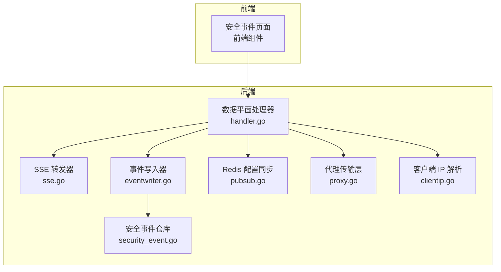
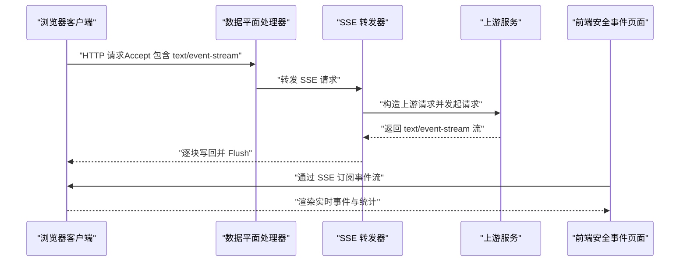
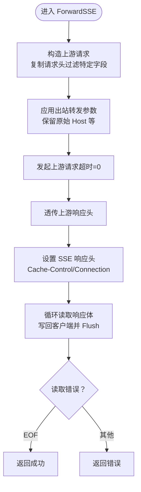
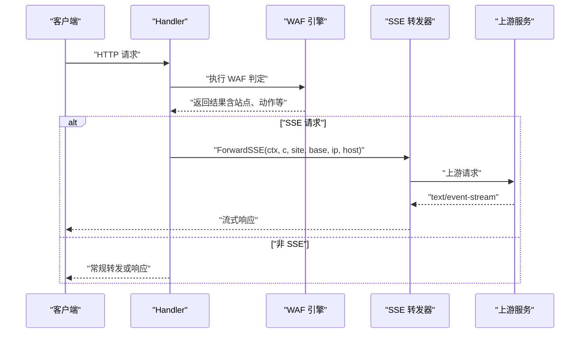
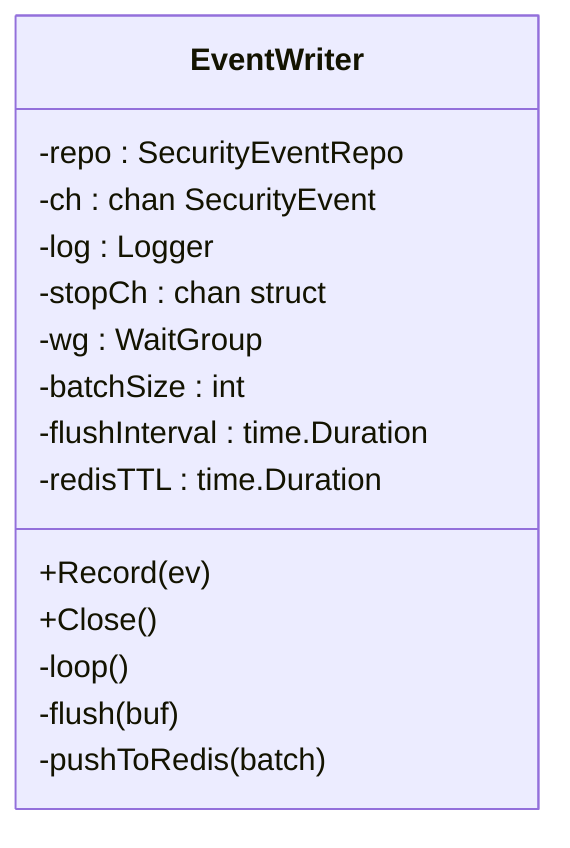
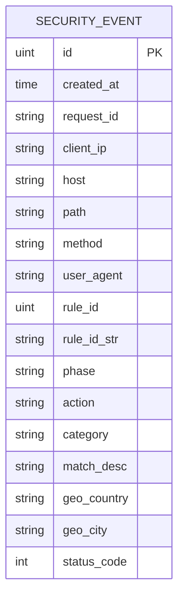
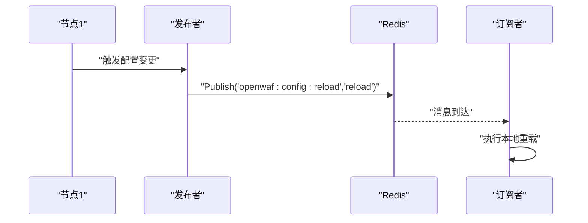
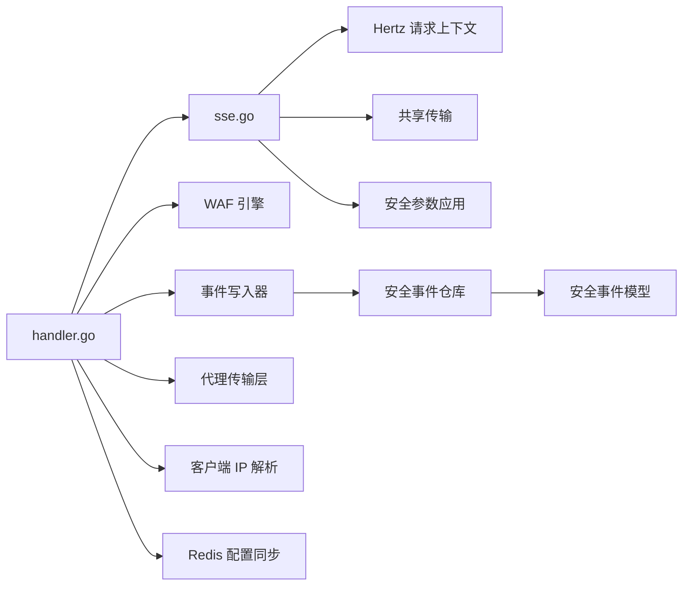

# SSE 事件推送

<cite>
**本文引用的文件**
- [internal/dataplane/sse.go](file://internal/dataplane/sse.go)
- [internal/dataplane/handler.go](file://internal/dataplane/handler.go)
- [internal/observability/eventwriter.go](file://internal/observability/eventwriter.go)
- [internal/store/repository/security_event.go](file://internal/store/repository/security_event.go)
- [internal/core/redis/pubsub.go](file://internal/core/redis/pubsub.go)
- [internal/proxy/proxy.go](file://internal/proxy/proxy.go)
- [internal/security/clientip.go](file://internal/security/clientip.go)
- [frontend/app/(dashboard)/security-events/page.tsx](file://frontend/app/(dashboard)/security-events/page.tsx)
</cite>

## 目录
1. [简介](#简介)
2. [项目结构](#项目结构)
3. [核心组件](#核心组件)
4. [架构总览](#架构总览)
5. [详细组件分析](#详细组件分析)
6. [依赖分析](#依赖分析)
7. [性能考虑](#性能考虑)
8. [故障排查指南](#故障排查指南)
9. [结论](#结论)
10. [附录](#附录)

## 简介
本文件系统性阐述 OpenWAF 中 Server-Sent Events（SSE）事件推送的实现与使用方式，覆盖以下主题：
- SSE 协议工作原理：长连接维持、事件流传输、事件格式与编码
- 事件推送机制：事件来源、数据写入与持久化、批量写入与缓冲
- 连接管理策略：连接建立、心跳保持、异常处理与资源释放
- 与 WAF 系统的集成：实时安全事件推送、状态更新与可视化
- 客户端连接处理：连接标识、权限验证、并发控制
- 性能优化与可靠性保障：缓冲区大小、刷新间隔、批处理、归档清理

## 项目结构
围绕 SSE 的实现主要分布在如下模块：
- 数据平面（Dataplane）：请求路由、SSE 转发、WebSocket 转发、静态资源服务
- 可观测性（Observability）：安全事件写入器（缓冲+批处理）、指标导出
- 存储层（Store）：安全事件模型与仓库（查询、聚合、批量写入）
- 核心 Redis：配置同步（发布/订阅），用于多节点一致性
- 前端仪表盘：安全事件页面，展示实时统计与事件列表

**图表来源**
- [internal/dataplane/handler.go:69-78](file://internal/dataplane/handler.go#L69-L78)
- [internal/dataplane/sse.go:18-92](file://internal/dataplane/sse.go#L18-L92)
- [internal/observability/eventwriter.go:19-36](file://internal/observability/eventwriter.go#L19-L36)
- [internal/store/repository/security_event.go:11-15](file://internal/store/repository/security_event.go#L11-L15)
- [internal/core/redis/pubsub.go:13-19](file://internal/core/redis/pubsub.go#L13-L19)
- [internal/proxy/proxy.go:35-83](file://internal/proxy/proxy.go#L35-L83)
- [internal/security/clientip.go:12-49](file://internal/security/clientip.go#L12-L49)

**章节来源**
- [internal/dataplane/handler.go:69-78](file://internal/dataplane/handler.go#L69-L78)
- [internal/dataplane/sse.go:18-92](file://internal/dataplane/sse.go#L18-L92)

## 核心组件
- SSE 转发器：负责识别 SSE 请求、构造上游请求、透传响应头、设置缓存与连接头、流式写回客户端并及时刷新
- 数据平面处理器：在请求进入时根据 Accept 头判断是否为 SSE，若是则调用 SSE 转发器；否则走常规 HTTP 或 WebSocket 转发
- 事件写入器：将安全事件异步写入数据库，采用缓冲队列与定时刷新，避免阻塞热路径
- 安全事件仓库与模型：提供事件查询、聚合统计、批量插入与归档删除
- Redis 配置同步：通过发布/订阅在多节点间同步配置变更，保障一致性
- 前端安全事件页面：展示事件列表、统计卡片、分页与筛选，支持手动刷新

**章节来源**
- [internal/dataplane/sse.go:18-92](file://internal/dataplane/sse.go#L18-L92)
- [internal/dataplane/handler.go:715-744](file://internal/dataplane/handler.go#L715-L744)
- [internal/observability/eventwriter.go:19-36](file://internal/observability/eventwriter.go#L19-L36)
- [internal/store/repository/security_event.go:11-15](file://internal/store/repository/security_event.go#L11-L15)
- [internal/core/redis/pubsub.go:13-19](file://internal/core/redis/pubsub.go#L13-L19)
- [frontend/app/(dashboard)/security-events/page.tsx:73-125](file://frontend/app/(dashboard)/security-events/page.tsx#L73-L125)

## 架构总览
SSE 在 OpenWAF 中作为"事件流"能力被复用到多个场景：
- 安全事件实时推送：WAF 引擎命中观察或拦截时，事件写入器异步落库，前端通过 SSE 订阅实时事件流
- 配置变更通知：Redis 发布/订阅用于多节点同步配置变更，前端可订阅以接收状态更新
- 统计与趋势：事件仓库提供聚合查询，前端定时拉取统计数据

**图表来源**
- [internal/dataplane/handler.go:715-720](file://internal/dataplane/handler.go#L715-L720)
- [internal/dataplane/sse.go:18-92](file://internal/dataplane/sse.go#L18-L92)
- [frontend/app/(dashboard)/security-events/page.tsx:73-125](file://frontend/app/(dashboard)/security-events/page.tsx#L73-L125)

## 详细组件分析

### SSE 转发器（ForwardSSE）
- 功能职责
  - 识别 SSE 请求（基于 Accept 头）
  - 构造上游请求，复制必要请求头（排除 Connection/Keep-Alive/Transfer-Encoding）
  - 设置缓存控制与连接头，确保客户端维持长连接
  - 流式读取上游响应体，写回客户端并及时刷新
  - 正确处理 EOF 与错误，保证连接稳定关闭
- 关键行为
  - 使用共享传输，超时设为 0 以支持长连接
  - 将上游响应头透传给客户端
  - 写回时检查 Flush 接口以触发底层网络发送
- 错误处理
  - 上游请求失败、读取失败、写入失败均向上返回，由上层统一处理

**图表来源**
- [internal/dataplane/sse.go:18-92](file://internal/dataplane/sse.go#L18-L92)

**章节来源**
- [internal/dataplane/sse.go:18-92](file://internal/dataplane/sse.go#L18-L92)

### 数据平面处理器（Handler）
- 功能职责
  - 解析站点、解析客户端 IP、构建请求上下文
  - 执行 WAF 引擎判定，记录观察与拦截事件
  - 根据请求类型选择转发路径：SSE、WebSocket、HTTP
  - 记录访问日志与指标
- SSE 分支
  - 通过 IsSSERequest 判断是否为 SSE
  - 若是，则调用 ForwardSSE 并传递站点运行时、上游地址、客户端 IP、原始 Host

**图表来源**
- [internal/dataplane/handler.go:69-78](file://internal/dataplane/handler.go#L69-L78)
- [internal/dataplane/sse.go:18-92](file://internal/dataplane/sse.go#L18-L92)

**章节来源**
- [internal/dataplane/handler.go:715-744](file://internal/dataplane/handler.go#L715-L744)

### 事件写入器（EventWriter）
- 功能职责
  - 接收安全事件，放入有界缓冲通道
  - 定时刷新与批量阈值触发写入
  - 批量写入数据库，降低写放大
  - 关闭时清空剩余事件并等待
- 缓冲与刷新策略
  - 缓冲容量：16384
  - 批量大小：256
  - 刷新间隔：5 秒
  - 非阻塞入队：缓冲满时丢弃并记录告警
- 错误处理
  - 写入失败记录错误日志，不影响主流程

**图表来源**
- [internal/observability/eventwriter.go:19-36](file://internal/observability/eventwriter.go#L19-L36)

**章节来源**
- [internal/observability/eventwriter.go:19-164](file://internal/observability/eventwriter.go#L19-L164)

### 安全事件仓库与模型
- 模型（SecurityEvent）
  - 字段覆盖请求标识、客户端 IP、Host、路径、方法、UA、规则信息、阶段、动作、类别、匹配描述、地理信息、状态码等
  - 建立多字段索引，便于查询与统计
- 仓库（SecurityEventRepo）
  - 提供分页列表、单条查询、批量写入、按时间范围删除旧事件
  - 提供分类统计、Top IP/Path/Rule、时间线聚合等
- 应用场景
  - SSE 事件源：WAF 命中后写入事件，前端通过 SSE 订阅
  - 前端 API：分页列表与统计接口，配合前端页面展示

**图表来源**
- [internal/store/repository/security_event.go:11-15](file://internal/store/repository/security_event.go#L11-L15)

**章节来源**
- [internal/store/repository/security_event.go:17-293](file://internal/store/repository/security_event.go#L17-L293)

### Redis 配置同步（发布/订阅）
- 功能职责
  - 发布配置重载事件（reload）
  - 订阅配置重载事件并在收到后触发本地重载
- 多节点一致性
  - 通过 Redis 通道实现跨节点通知，保障配置变更一致

**图表来源**
- [internal/core/redis/pubsub.go:13-19](file://internal/core/redis/pubsub.go#L13-L19)

**章节来源**
- [internal/core/redis/pubsub.go:13-77](file://internal/core/redis/pubsub.go#L13-L77)

### 前端安全事件页面
- 功能职责
  - 展示安全事件列表、统计卡片、分页与筛选
  - 定时轮询统计数据（每 30 秒）
  - 支持导出 CSV
- 与后端交互
  - 通过 API 获取事件列表与统计
  - SSE 订阅实时事件流（页面中存在订阅逻辑）

**章节来源**
- [frontend/app/(dashboard)/security-events/page.tsx:73-397](file://frontend/app/(dashboard)/security-events/page.tsx#L73-L397)

## 依赖分析
- SSE 转发器依赖
  - 数据平面工具：代理传输、安全参数应用
  - Hertz 请求上下文：读取请求头、写入响应头与状态码
- 数据平面处理器依赖
  - WAF 引擎：判定结果决定后续动作
  - SSE 转发器：SSE 请求分支
  - 事件写入器：记录安全事件
  - 代理传输层：共享传输实例
  - 客户端 IP 解析：可信代理链处理
- 事件写入器依赖
  - 安全事件仓库：批量写入
  - 日志：错误与告警
- 仓库与模型
  - GORM：查询、聚合、批量插入、删除旧数据
- Redis 同步
  - go-redis：发布/订阅

**图表来源**
- [internal/dataplane/sse.go:18-92](file://internal/dataplane/sse.go#L18-L92)
- [internal/dataplane/handler.go:69-78](file://internal/dataplane/handler.go#L69-L78)
- [internal/observability/eventwriter.go:19-36](file://internal/observability/eventwriter.go#L19-L36)
- [internal/store/repository/security_event.go:11-15](file://internal/store/repository/security_event.go#L11-L15)
- [internal/core/redis/pubsub.go:13-19](file://internal/core/redis/pubsub.go#L13-L19)
- [internal/proxy/proxy.go:35-83](file://internal/proxy/proxy.go#L35-L83)
- [internal/security/clientip.go:12-49](file://internal/security/clientip.go#L12-L49)

**章节来源**
- [internal/dataplane/sse.go:18-92](file://internal/dataplane/sse.go#L18-L92)
- [internal/dataplane/handler.go:69-78](file://internal/dataplane/handler.go#L69-L78)
- [internal/observability/eventwriter.go:19-36](file://internal/observability/eventwriter.go#L19-L36)
- [internal/store/repository/security_event.go:11-15](file://internal/store/repository/security_event.go#L11-L15)
- [internal/core/redis/pubsub.go:13-19](file://internal/core/redis/pubsub.go#L13-L19)
- [internal/proxy/proxy.go:35-83](file://internal/proxy/proxy.go#L35-L83)
- [internal/security/clientip.go:12-49](file://internal/security/clientip.go#L12-L49)

## 性能考虑
- 缓冲与批处理
  - 事件写入器使用 16384 容量缓冲与 256 批量阈值，结合 5 秒定时刷新，平衡延迟与吞吐
  - 批量写入数据库，减少事务开销
- 流式传输
  - SSE 转发器使用 4096 字节缓冲，边读边写并及时 Flush，降低首字节延迟
  - 超时设为 0 支持长连接，避免中间代理断开
- 查询与统计
  - 仓库提供聚合查询与索引字段，前端定时拉取统计数据，避免频繁全量扫描
- 归档清理
  - 定期删除过期事件，控制存储增长，提升查询性能

**章节来源**
- [internal/observability/eventwriter.go:38-51](file://internal/observability/eventwriter.go#L38-L51)
- [internal/observability/eventwriter.go:80-116](file://internal/observability/eventwriter.go#L80-L116)
- [internal/dataplane/sse.go:74-92](file://internal/dataplane/sse.go#L74-L92)
- [internal/store/repository/security_event.go:77-80](file://internal/store/repository/security_event.go#L77-L80)

## 故障排查指南
- SSE 连接中断
  - 检查上游服务是否返回 text/event-stream 类型
  - 确认响应头透传正确，客户端未被中间代理断开
  - 查看写回与 Flush 是否正常，关注读取错误处理
- 事件丢失
  - 检查事件写入器缓冲是否频繁满载（告警日志）
  - 调整批量大小与刷新间隔以适配高并发
- 数据库写入失败
  - 查看写入器错误日志，确认批量写入是否成功
  - 检查数据库连接与表结构
- 配置不同步
  - 确认 Redis 发布/订阅通道名称一致
  - 检查订阅者是否正常运行且未提前退出

**章节来源**
- [internal/dataplane/sse.go:65-92](file://internal/dataplane/sse.go#L65-L92)
- [internal/observability/eventwriter.go:65-72](file://internal/observability/eventwriter.go#L65-L72)
- [internal/observability/eventwriter.go:118-139](file://internal/observability/eventwriter.go#L118-L139)
- [internal/core/redis/pubsub.go:33-43](file://internal/core/redis/pubsub.go#L33-L43)
- [internal/core/redis/pubsub.go:45-68](file://internal/core/redis/pubsub.go#L45-L68)

## 结论
OpenWAF 的 SSE 实现以"轻量、可靠、可观测"为目标：
- 通过数据平面处理器与 SSE 转发器，实现对 text/event-stream 的透明透传
- 事件写入器采用缓冲+批处理策略，有效隔离热路径与持久化写入
- 仓库与模型提供完善的查询与统计能力，支撑前端实时展示
- Redis 配置同步保障多节点一致性，便于扩展与运维
- 前端安全事件页面提供直观的可视化界面，结合 SSE 实现实时更新

## 附录

### SSE 协议识别机制
SSE 协议识别通过 HTTP 请求头中的 Accept 字段进行判断，当请求头包含 "text/event-stream" 时，系统将其识别为 SSE 请求并交由 SSE 转发器处理。

### 长连接管理策略
- 超时设置：SSE 转发器使用 0 秒超时，确保长连接不被中间代理断开
- 连接头设置：显式设置 Cache-Control 和 Connection 头部，维持长连接
- 响应头透传：除 Hop-by-Hop 头部外，其他响应头完整透传给客户端

### 流式数据推送实现
- 缓冲策略：使用 4096 字节缓冲区，边读边写，提高传输效率
- 刷新机制：每次写入后检查 Flush 接口，确保数据及时发送
- 错误处理：正确处理 EOF 和其他错误，保证连接稳定关闭

### 事件格式处理
- 事件来源：WAF 引擎命中观察或拦截时产生的安全事件
- 数据持久化：事件写入器采用异步批量写入，避免阻塞热路径
- 数据格式：JSON 格式序列化，便于前端解析和展示

### 连接状态维护
- 心跳保持：通过设置适当的响应头和超时参数维持长连接
- 异常处理：捕获并处理各种网络异常，确保连接稳定
- 资源清理：正确关闭上游连接和本地资源，防止内存泄漏

### 客户端连接方法
前端通过标准的 EventSource API 订阅 SSE 事件流，支持自动重连和错误处理。

### 性能优化建议
- 调整缓冲区大小以适应不同的网络环境
- 优化批量写入参数以平衡延迟和吞吐
- 合理设置刷新间隔，避免过度刷新影响性能
- 实施合理的归档策略，控制存储空间增长