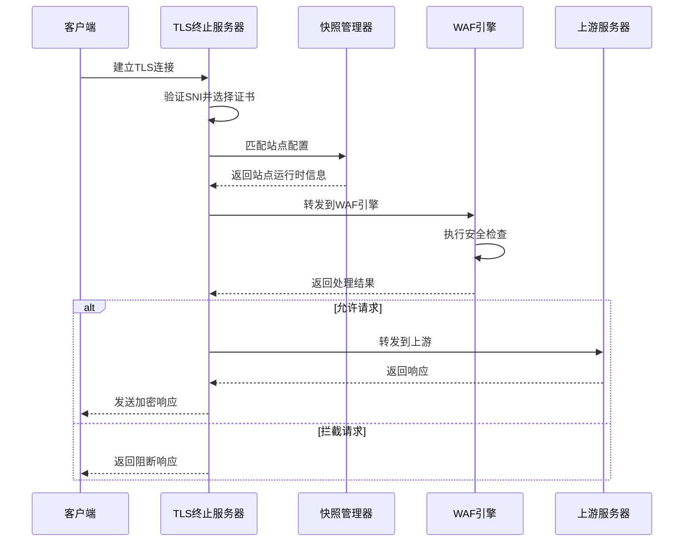
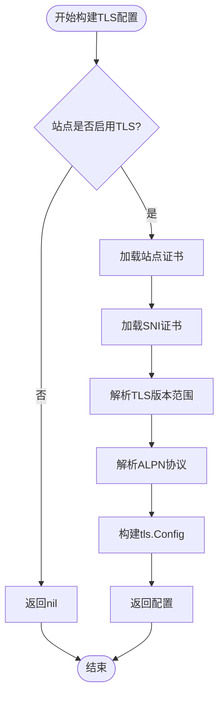
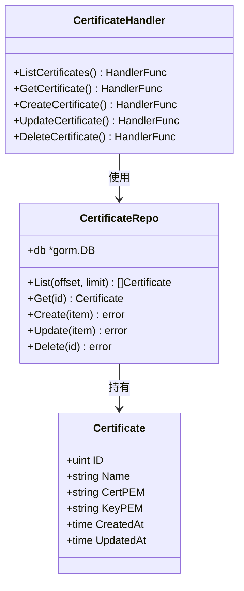
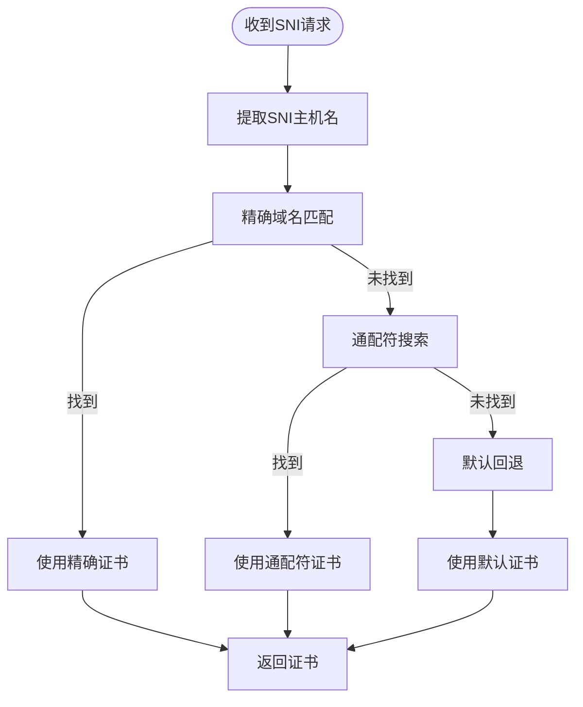
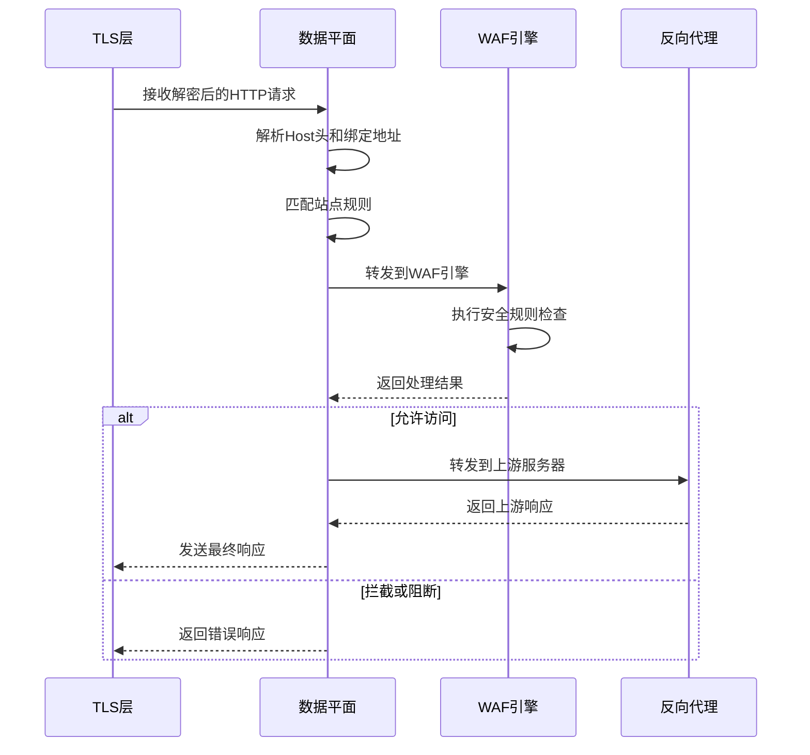
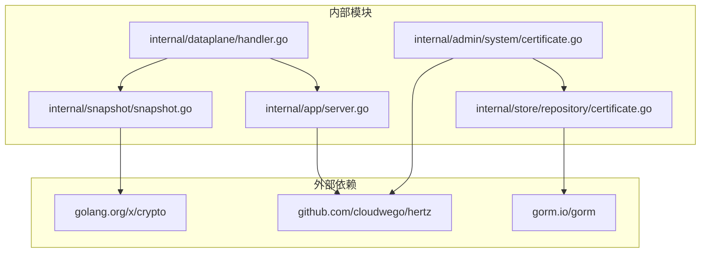
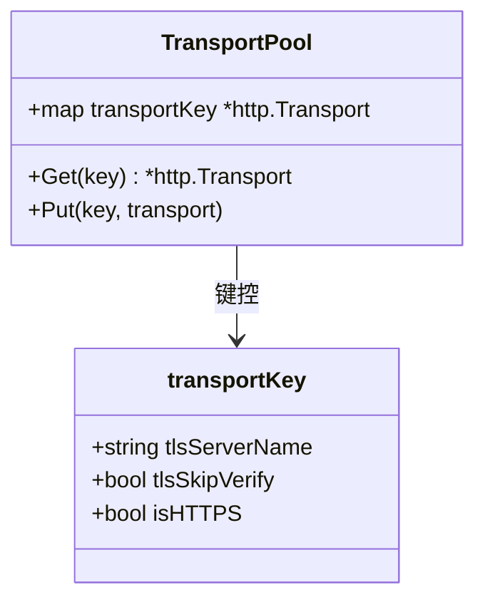

> [返回 数据平面处理](数据平面处理.md)

# TLS 终止与证书管理

<cite>
**本文档引用的文件**
- [main.go](file://cmd/main.go)
- [server.go](file://internal/app/server.go)
- [handler_certificate.go](file://internal/admin/system/certificate.go)
- [certificate.go](file://internal/store/repository/certificate.go)
- [models.go](file://internal/store/certificate.go)
- [snapshot.go](file://internal/snapshot/snapshot.go)
- [handler.go](file://internal/dataplane/handler.go)
- [page.tsx](file://frontend/app/(dashboard)/certificates/page.tsx)
- [errors.go](file://internal/core/errors/errors.go)
- [proxy.go](file://internal/proxy/proxy.go)
</cite>

## 目录
1. [简介](#简介)
2. [项目结构](#项目结构)
3. [核心组件](#核心组件)
4. [架构概览](#架构概览)
5. [详细组件分析](#详细组件分析)
6. [依赖关系分析](#依赖关系分析)
7. [性能考虑](#性能考虑)
8. [故障排除指南](#故障排除指南)
9. [结论](#结论)
10. [附录](#附录)

## 简介
My-OpenWaf 是一个基于 Go 语言开发的 Web 应用防火墙，提供了完整的 TLS 终止与证书管理功能。该系统采用云雀(Hertz)框架作为 HTTP 服务器，实现了高性能的 TLS 终止、多域名证书支持和智能证书管理。本文档深入解析了系统的 TLS 终止机制、证书管理流程、SNI 处理策略以及相关的安全配置选项，为开发者和运维人员提供全面的技术指导。

## 项目结构
My-OpenWaf 的 TLS 功能主要分布在以下模块中：

```mermaid
graph TB
subgraph "应用入口"
A[cmd/main.go]
end
subgraph "核心服务"
B[internal/app/server.go]
C[internal/snapshot/snapshot.go]
D[internal/dataplane/handler.go]
end
subgraph "证书管理"
E[internal/admin/system/certificate.go]
F[internal/store/repository/certificate.go]
G[internal/store/certificate.go]
end
subgraph "前端界面"
H[frontend/app/(dashboard)/certificates/page.tsx]
end
A --> B
B --> C
B --> D
E --> F
F --> G
H --> E
```

**图表来源**
- [main.go:1-10](file://cmd/main.go#L1-L10)
- [server.go:35-305](file://internal/app/server.go#L35-L305)
- [handler_certificate.go:15-110](file://internal/admin/system/certificate.go#L15-L110)

**章节来源**
- [main.go:1-10](file://cmd/main.go#L1-L10)
- [server.go:35-305](file://internal/app/server.go#L35-L305)

## 核心组件

### TLS 终止服务器
系统使用云雀(Hertz)框架构建高性能的 TLS 终止服务器。每个站点都可以独立配置 TLS 参数，包括证书、协议版本和 ALPN 支持。

### 证书管理系统
提供完整的证书生命周期管理，包括证书上传、验证、存储和删除功能。所有证书以 PEM 格式存储在数据库中。

### SNI 多域名支持
实现基于 SNI(Server Name Indication) 的多域名证书匹配，支持通配符证书和精确域名匹配。

**章节来源**
- [server.go:352-455](file://internal/app/server.go#L352-L455)
- [models.go:14-23](file://internal/store/certificate.go#L14-L23)
- [snapshot.go:21-50](file://internal/snapshot/snapshot.go#L21-L50)

## 架构概览
系统采用分层架构设计，TLS 终止位于数据平面的最前端，负责处理客户端连接和证书验证。



**图表来源**
- [server.go:352-455](file://internal/app/server.go#L352-L455)
- [handler.go:38-310](file://internal/dataplane/handler.go#L38-L310)

## 详细组件分析

### TLS 配置构建器
TLS 配置构建器负责根据站点配置生成相应的 TLS 参数：



**图表来源**
- [server.go:378-439](file://internal/app/server.go#L378-L439)

### 证书管理流程
证书管理采用 RESTful API 设计，提供完整的 CRUD 操作：



**图表来源**
- [models.go:14-23](file://internal/store/certificate.go#L14-L23)
- [certificate.go:9-37](file://internal/store/repository/certificate.go#L9-L37)
- [handler_certificate.go:15-110](file://internal/admin/system/certificate.go#L15-L110)

### SNI 证书匹配策略
系统支持多种证书匹配策略，确保正确的证书被用于特定的域名：



**图表来源**
- [server.go:401-407](file://internal/app/server.go#L401-L407)
- [snapshot.go:74-96](file://internal/snapshot/snapshot.go#L74-L96)

**章节来源**
- [handler_certificate.go:45-109](file://internal/admin/system/certificate.go#L45-L109)
- [certificate.go:13-36](file://internal/store/repository/certificate.go#L13-L36)

### 数据平面处理流程
TLS 终止后的请求进入数据平面进行进一步处理：



**图表来源**
- [handler.go:38-310](file://internal/dataplane/handler.go#L38-L310)

**章节来源**
- [handler.go:38-310](file://internal/dataplane/handler.go#L38-L310)

## 依赖关系分析
系统各组件之间的依赖关系如下：



**图表来源**
- [server.go:3-33](file://internal/app/server.go#L3-L33)
- [handler_certificate.go:3-13](file://internal/admin/system/certificate.go#L3-L13)

**章节来源**
- [server.go:3-33](file://internal/app/server.go#L3-L33)
- [handler_certificate.go:3-13](file://internal/admin/system/certificate.go#L3-L13)

## 性能考虑

### TLS 会话复用
系统通过以下方式优化 TLS 性能：
1. **证书缓存**: 已加载的证书在内存中缓存，避免重复解析
2. **SNI 匹配优化**: 使用前缀索引快速定位匹配的证书
3. **配置指纹**: 通过 SHA-256 指纹检测配置变更，减少不必要的重启

### 连接池管理


**图表来源**
- [proxy.go:20-57](file://internal/proxy/proxy.go#L20-L57)

### 硬件加速支持
系统支持利用底层硬件的加密加速能力，通过 Go 标准库的 TLS 实现自动启用硬件加速。

**章节来源**
- [server.go:457-489](file://internal/app/server.go#L457-L489)
- [proxy.go:20-57](file://internal/proxy/proxy.go#L20-L57)

## 故障排除指南

### 常见问题诊断
1. **证书验证失败**
   - 检查证书和私钥格式是否正确
   - 验证证书链完整性
   - 确认域名与证书匹配

2. **SNI 匹配问题**
   - 检查 SNI 字符串格式
   - 验证证书域名配置
   - 确认通配符证书使用正确

3. **TLS 版本兼容性**
   - 检查客户端支持的 TLS 版本
   - 验证服务器配置的版本范围
   - 确认 ALPN 协议设置

### 错误处理机制
系统定义了专门的错误类型来处理 TLS 相关问题：

| 错误类型 | 用途 | 常见场景 |
|---------|------|----------|
| ConfigError | 配置验证失败 | TLS 参数无效 |
| RuleCompileError | 规则编译错误 | WAF 规则问题 |
| PipelineError | 管道执行错误 | 请求处理异常 |
| Sentinel errors | 特定业务错误 | 证书无效、站点不匹配 |

**章节来源**
- [errors.go:5-45](file://internal/core/errors/errors.go#L5-L45)

### 监控和日志
系统提供了详细的日志记录和监控指标：
- TLS 握手成功率统计
- 证书过期提醒
- SNI 匹配率分析
- 连接性能指标

## 结论
My-OpenWaf 的 TLS 终止与证书管理功能提供了企业级的安全防护和灵活的配置选项。通过模块化的架构设计和完善的错误处理机制，系统能够满足各种复杂的部署需求。

关键优势包括：
- 高性能的 TLS 终止处理
- 灵活的多域名证书支持
- 完整的证书生命周期管理
- 优秀的可扩展性和维护性

建议在生产环境中结合实际需求调整 TLS 参数，并定期监控证书状态以确保服务的持续可用性。

## 附录

### 证书配置示例
系统支持通过前端界面和 API 进行证书管理：
- 前端界面提供直观的证书上传和管理功能
- 后端 API 支持完整的 CRUD 操作
- 证书以 PEM 格式存储，支持私钥分离

### 安全最佳实践
- 定期轮换证书，建议使用自动化证书管理
- 启用适当的 TLS 版本限制，禁用过时协议
- 配置合适的 ALPN 协议支持
- 实施证书监控和过期提醒机制
- 使用强密码学套件和安全的密钥长度

### 性能优化建议
- 启用 TLS 会话复用以减少握手开销
- 使用证书缓存减少解析时间
- 合理配置 SNI 匹配策略
- 监控 TLS 性能指标并及时调整参数