# WebSocket 连接处理

<cite>
**本文档引用的文件**
- [websocket.go](file://internal/dataplane/websocket.go)
- [handler.go](file://internal/dataplane/handler.go)
- [server.go](file://internal/app/server.go)
- [engine.go](file://internal/core/engine/engine.go)
- [metrics.go](file://internal/dataplane/metrics.go)
- [sse.go](file://internal/dataplane/sse.go)
- [proxy.go](file://internal/proxy/proxy.go)
- [drop.go](file://internal/waf/drop.go)
- [block.go](file://internal/waf/block.go)
- [lifecycle.go](file://internal/core/lifecycle/lifecycle.go)
</cite>

## 目录
1. [简介](#简介)
2. [项目结构](#项目结构)
3. [核心组件](#核心组件)
4. [架构概览](#架构概览)
5. [详细组件分析](#详细组件分析)
6. [依赖关系分析](#依赖关系分析)
7. [性能考虑](#性能考虑)
8. [故障排除指南](#故障排除指南)
9. [结论](#结论)

## 简介

本文档深入解析 My-OpenWaf 项目中的 WebSocket 连接处理实现。该系统基于 CloudWeGo Hertz 框架构建，提供了完整的 WebSocket 协议升级、连接隧道转发和实时威胁检测功能。文档涵盖了从协议升级到连接生命周期管理的完整流程，以及与 WAF 引擎的深度集成。

## 项目结构

My-OpenWaf 采用模块化架构设计，WebSocket 功能主要分布在以下关键模块中：

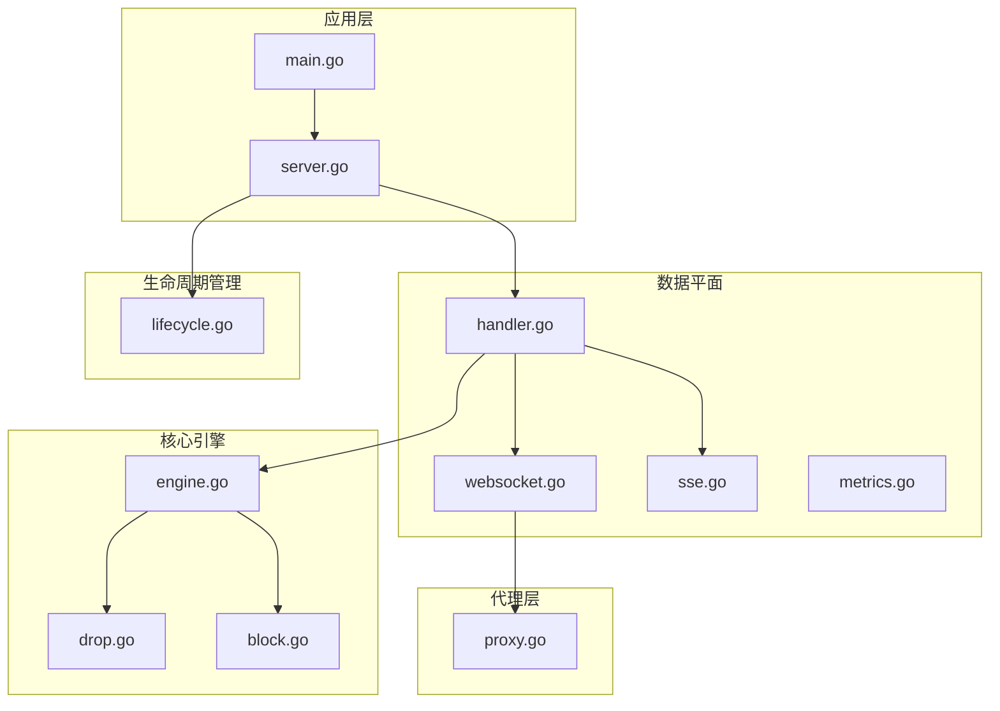

**图表来源**
- [main.go:1-10](file://cmd/main.go#L1-L10)
- [server.go:35-300](file://internal/app/server.go#L35-L300)
- [handler.go:37-310](file://internal/dataplane/handler.go#L37-L310)

**章节来源**
- [main.go:1-10](file://cmd/main.go#L1-L10)
- [server.go:35-300](file://internal/app/server.go#L35-L300)

## 核心组件

### WebSocket 协议升级检测器

WebSocket 协议升级检测器负责识别客户端发起的 WebSocket 连接请求：

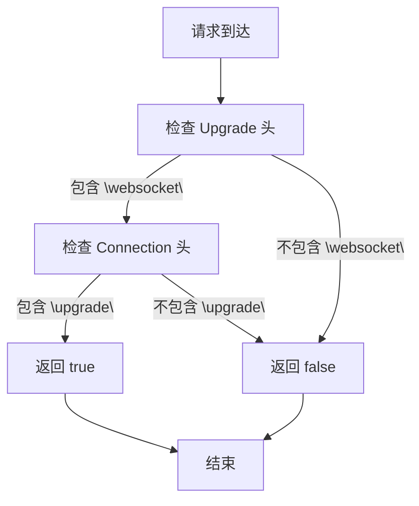

**图表来源**
- [websocket.go:16-20](file://internal/dataplane/websocket.go#L16-L20)

### WebSocket 连接隧道转发器

WebSocket 连接隧道转发器实现了完整的双向数据传输机制：

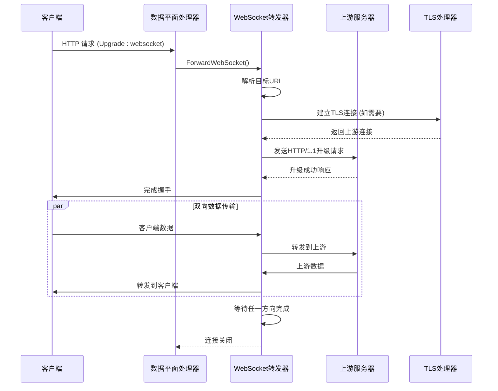

**图表来源**
- [websocket.go:22-69](file://internal/dataplane/websocket.go#L22-L69)

**章节来源**
- [websocket.go:16-101](file://internal/dataplane/websocket.go#L16-L101)

## 架构概览

My-OpenWaf 的 WebSocket 处理架构采用分层设计，确保了高性能和可扩展性：

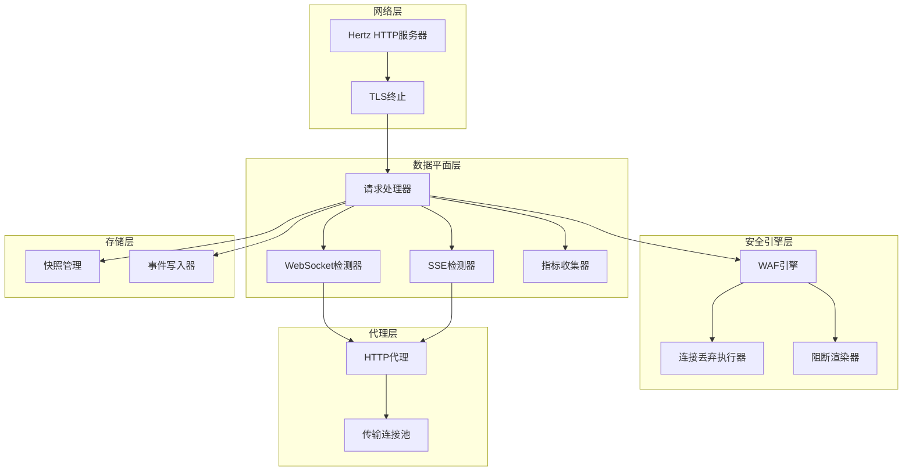

**图表来源**
- [server.go:347-376](file://internal/app/server.go#L347-L376)
- [handler.go:37-310](file://internal/dataplane/handler.go#L37-L310)

## 详细组件分析

### WebSocket 协议升级实现

WebSocket 协议升级是整个连接处理流程的关键起点。系统通过严格的头部验证确保只有合法的 WebSocket 请求才能被处理。

#### 升级头部验证机制

协议升级验证包含两个核心条件：
1. **Upgrade 头部验证**：必须包含 "websocket" 值（大小写不敏感）
2. **Connection 头部验证**：必须包含 "upgrade" 值（大小写不敏感）

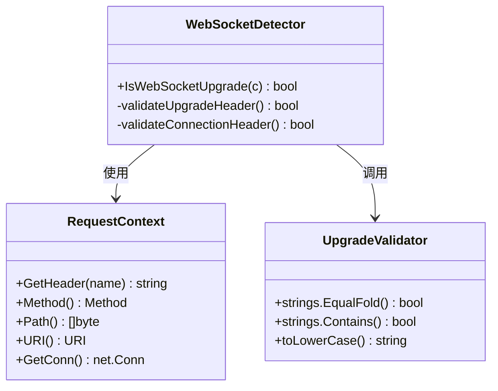

**图表来源**
- [websocket.go:16-20](file://internal/dataplane/websocket.go#L16-L20)

#### 目标URL解析和转换

WebSocket 目标URL的解析和转换是连接建立的重要步骤：

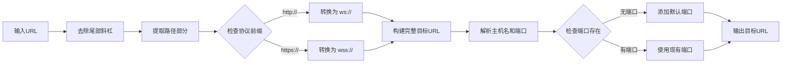

**图表来源**
- [websocket.go:23-30](file://internal/dataplane/websocket.go#L23-L30)

**章节来源**
- [websocket.go:16-95](file://internal/dataplane/websocket.go#L16-L95)

### 连接建立和握手验证

WebSocket 连接建立过程涉及多个验证步骤和安全检查：

#### TLS 连接建立

对于 wss:// 协议，系统会建立安全的 TLS 连接：

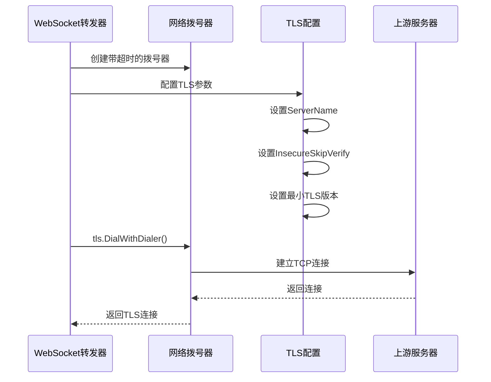

**图表来源**
- [websocket.go:37-45](file://internal/dataplane/websocket.go#L37-L45)

#### HTTP/1.1 升级请求发送

建立底层连接后，系统发送标准的 WebSocket 升级请求：

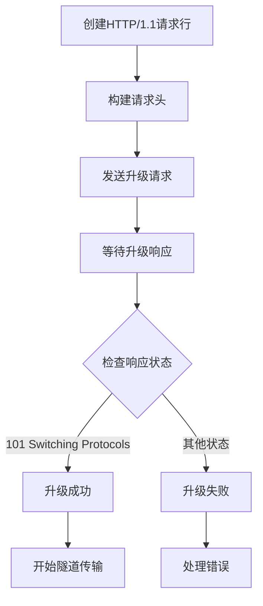

**图表来源**
- [websocket.go:51-60](file://internal/dataplane/websocket.go#L51-L60)

**章节来源**
- [websocket.go:22-69](file://internal/dataplane/websocket.go#L22-L69)

### 双向数据传输机制

WebSocket 连接的核心特性是双向实时通信，系统通过 goroutine 实现高效的数据传输：

#### 双向复制架构

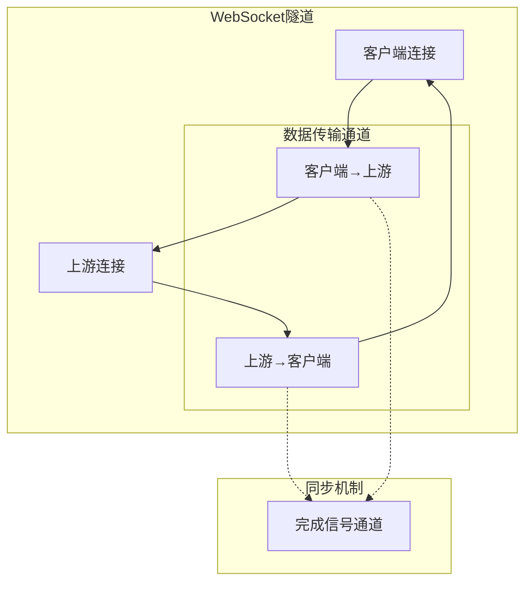

**图表来源**
- [websocket.go:64-68](file://internal/dataplane/websocket.go#L64-L68)

#### 数据传输优化

系统采用高效的 io.Copy 实现零拷贝数据传输，同时使用缓冲区优化内存使用：

- **缓冲区大小**：4KB 缓冲区进行批量读取
- **并发处理**：两个独立 goroutine 并行处理双向数据流
- **完成同步**：使用带缓冲的 channel 确保优雅关闭

**章节来源**
- [websocket.go:62-69](file://internal/dataplane/websocket.go#L62-L69)

### 连接生命周期管理

WebSocket 连接的生命周期管理包括连接建立、状态维护和异常处理：

#### 连接状态监控

系统通过原子计数器跟踪连接状态变化：

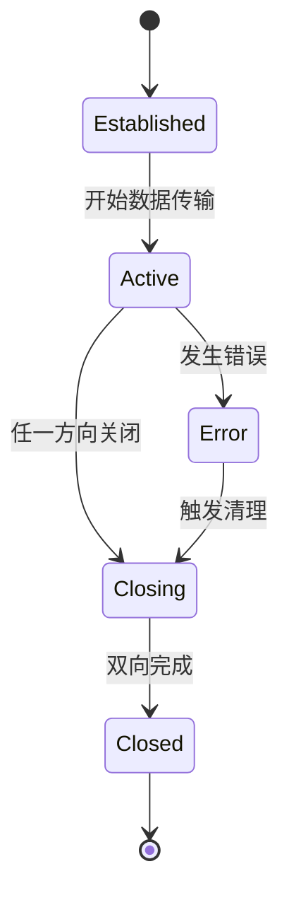

#### 异常断开恢复

当连接异常断开时，系统提供自动恢复机制：

- **错误检测**：通过 io.Copy 返回的错误判断连接状态
- **资源清理**：确保上游连接正确关闭
- **状态同步**：使用完成信号确保所有传输通道正确终止

**章节来源**
- [websocket.go:64-69](file://internal/dataplane/websocket.go#L64-L69)

### 与 WAF 引擎的集成

WebSocket 连接处理与 WAF 引擎深度集成，提供实时威胁检测和动态阻断能力：

#### WAF 规则链处理

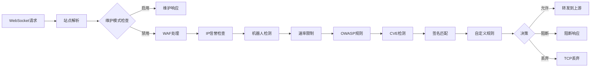

**图表来源**
- [engine.go:57-129](file://internal/core/engine/engine.go#L57-L129)

#### 实时威胁检测

WAF 引擎在 WebSocket 连接建立过程中执行多阶段安全检查：

1. **IP信誉检查**：快速识别已知恶意IP
2. **机器人检测**：基于行为特征识别自动化工具
3. **速率限制**：防止滥用和DDoS攻击
4. **OWASP规则**：应用标准安全规则集
5. **CVE检测**：识别已知漏洞利用尝试
6. **自定义规则**：执行站点特定的安全策略

**章节来源**
- [engine.go:57-129](file://internal/core/engine/engine.go#L57-L129)

### 性能优化策略

系统采用了多种性能优化技术来确保 WebSocket 连接的高效运行：

#### 连接池管理

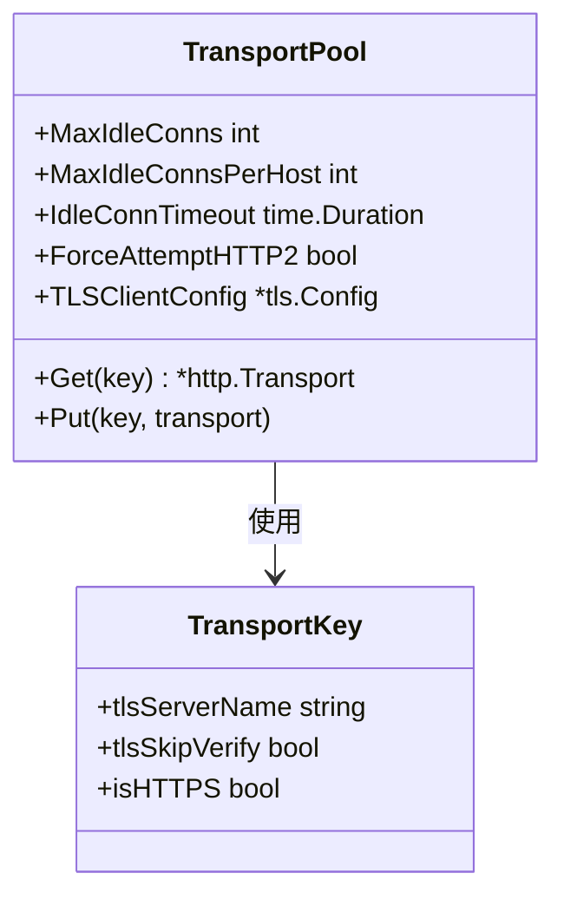

**图表来源**
- [proxy.go:20-54](file://internal/proxy/proxy.go#L20-L54)

#### 指标监控和统计

系统提供全面的性能指标收集：

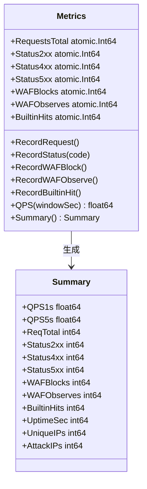

**图表来源**
- [metrics.go:9-135](file://internal/dataplane/metrics.go#L9-L135)

**章节来源**
- [proxy.go:32-54](file://internal/proxy/proxy.go#L32-L54)
- [metrics.go:37-135](file://internal/dataplane/metrics.go#L37-L135)

## 依赖关系分析

WebSocket 连接处理涉及多个模块间的复杂依赖关系：

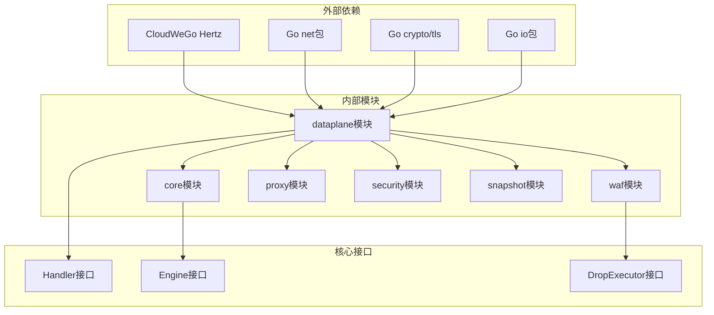

**图表来源**
- [handler.go:1-25](file://internal/dataplane/handler.go#L1-L25)
- [server.go:3-33](file://internal/app/server.go#L3-L33)

### 关键依赖关系

1. **Hertz 框架集成**：WebSocket 处理完全基于 Hertz 的中间件机制
2. **TLS 终止支持**：内置 TLS 证书管理和安全连接建立
3. **WAF 引擎集成**：实时威胁检测和动态阻断能力
4. **连接池优化**：HTTP 传输连接复用减少资源消耗
5. **指标监控**：完整的性能指标收集和统计

**章节来源**
- [handler.go:1-25](file://internal/dataplane/handler.go#L1-L25)
- [server.go:3-33](file://internal/app/server.go#L3-L33)

## 性能考虑

### 内存管理优化

系统采用多种技术优化内存使用：

- **对象池**：请求上下文使用对象池减少GC压力
- **缓冲区复用**：固定大小缓冲区避免频繁分配
- **连接复用**：HTTP 传输连接池避免重复建立连接

### 并发处理优化

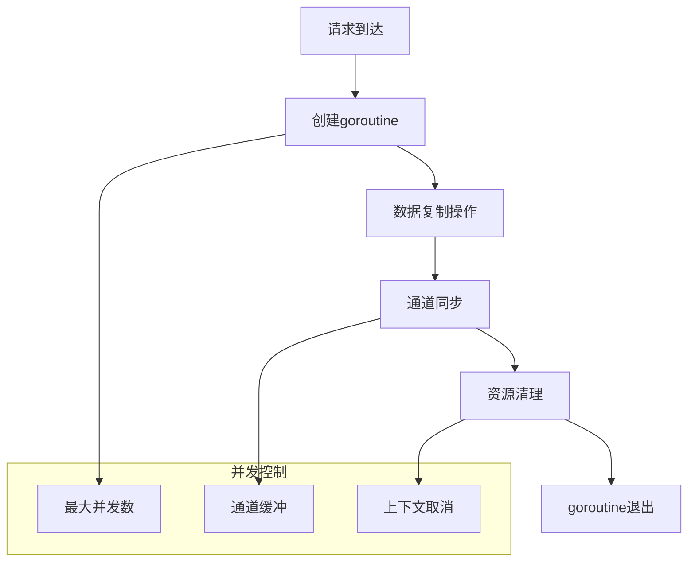

### 监控和告警

系统提供多层次的监控能力：

- **实时指标**：QPS、状态码分布、WAF拦截统计
- **连接状态**：活跃连接数、连接池使用情况
- **性能指标**：延迟、吞吐量、错误率
- **安全事件**：威胁检测、阻断统计

## 故障排除指南

### 常见问题诊断

#### WebSocket 握手失败

**症状**：客户端收到非 101 状态码响应

**可能原因**：
1. **协议不匹配**：目标URL协议与实际不符
2. **TLS配置错误**：上游服务器证书验证失败
3. **网络连接超时**：上游服务器不可达
4. **头部格式错误**：Upgrade 或 Connection 头部格式不正确

**解决方法**：
1. 检查目标URL协议前缀
2. 验证TLS配置参数
3. 确认网络连通性
4. 验证请求头部格式

#### 连接异常断开

**症状**：WebSocket 连接在建立后很快断开

**可能原因**：
1. **上游服务器拒绝**：上游服务器不支持WebSocket
2. **防火墙阻断**：中间设备阻止WebSocket升级
3. **超时设置过短**：连接建立超时时间不足
4. **资源限制**：系统资源不足导致连接被回收

**解决方法**：
1. 检查上游服务器WebSocket支持
2. 验证防火墙和代理配置
3. 调整超时参数
4. 监控系统资源使用

#### 性能问题

**症状**：WebSocket 连接延迟高或吞吐量低

**可能原因**：
1. **连接池耗尽**：上游连接池配置过小
2. **CPU瓶颈**：大量并发连接导致CPU负载过高
3. **内存泄漏**：长时间运行后内存使用持续增长
4. **网络拥塞**：上游网络带宽不足

**解决方法**：
1. 调整连接池参数
2. 优化并发处理逻辑
3. 检查内存使用情况
4. 扩展网络带宽

**章节来源**
- [websocket.go:46-48](file://internal/dataplane/websocket.go#L46-L48)
- [drop.go:61-83](file://internal/waf/drop.go#L61-L83)

## 结论

My-OpenWaf 的 WebSocket 连接处理系统展现了现代 Web 安全网关的设计理念。通过模块化架构、深度 WAF 集成和性能优化，系统能够提供安全、可靠且高性能的 WebSocket 服务。

### 主要优势

1. **安全性**：完整的 WAF 集成提供实时威胁检测
2. **性能**：连接池、对象池等优化技术确保高吞吐量
3. **可靠性**：优雅的错误处理和异常恢复机制
4. **可观测性**：全面的指标收集和监控能力
5. **可扩展性**：模块化设计支持功能扩展和定制

### 技术特色

- **协议透明**：完全支持标准 WebSocket 协议
- **TLS 终止**：内置 TLS 支持和证书管理
- **实时监控**：详细的性能和安全指标
- **动态配置**：支持热重载和运行时配置更新
- **多租户支持**：每个站点独立的配置和策略

该系统为构建企业级 WebSocket 应用提供了坚实的技术基础，既满足了安全需求，又保证了高性能和良好的用户体验。