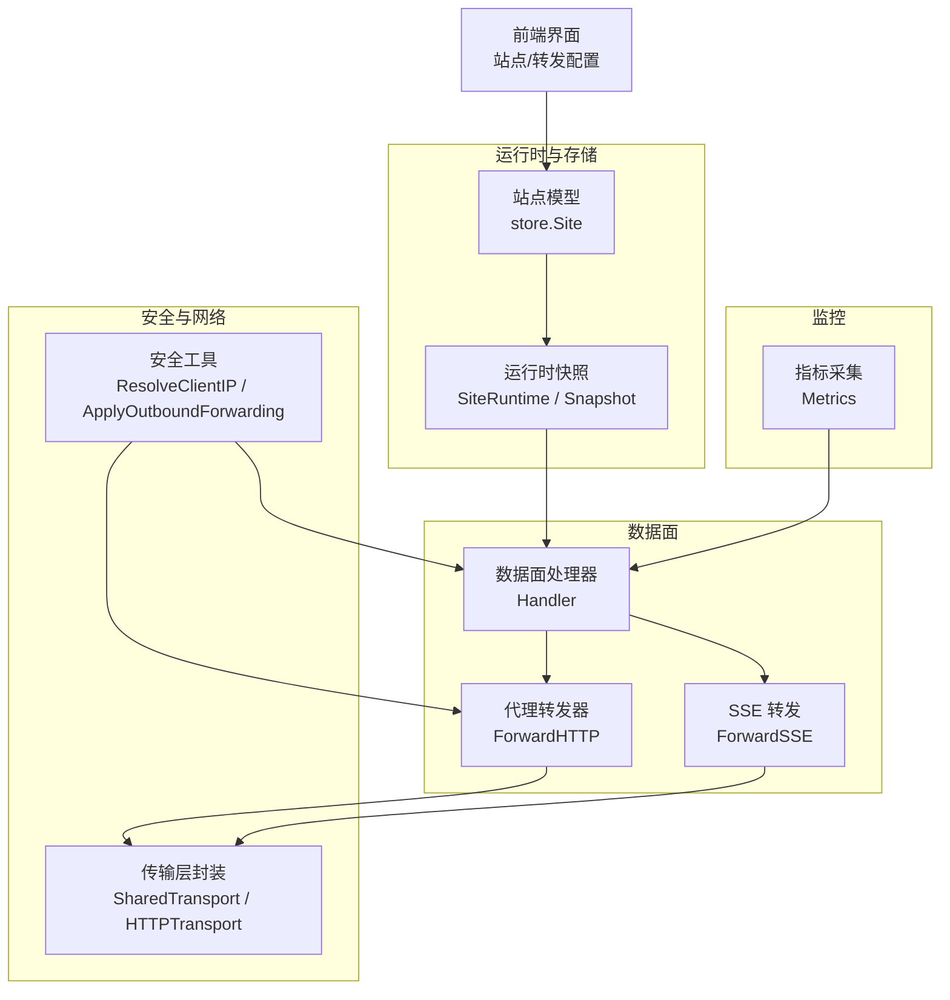
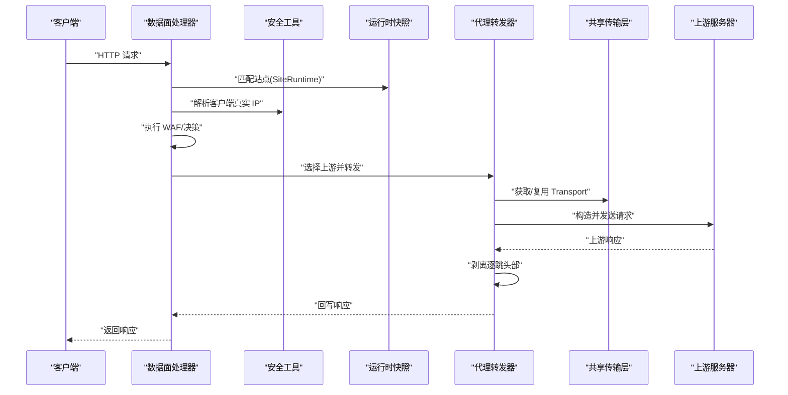
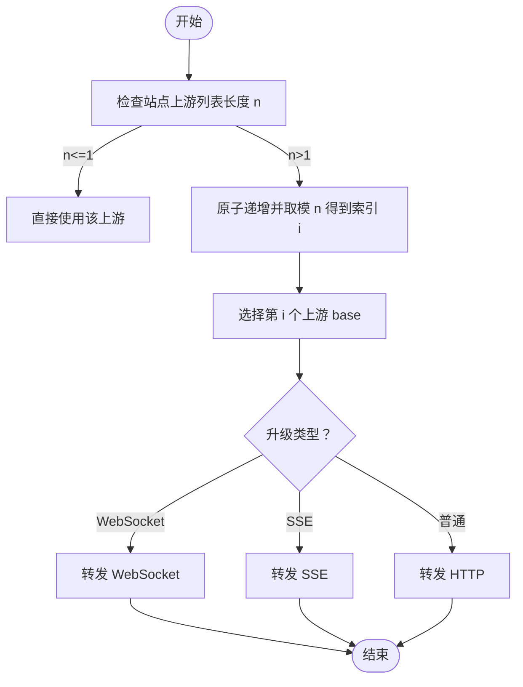
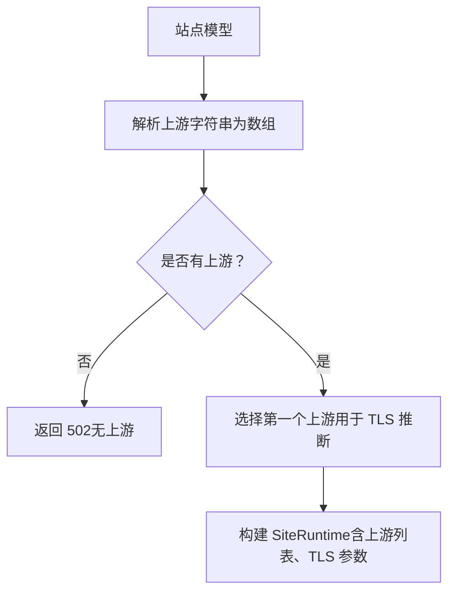
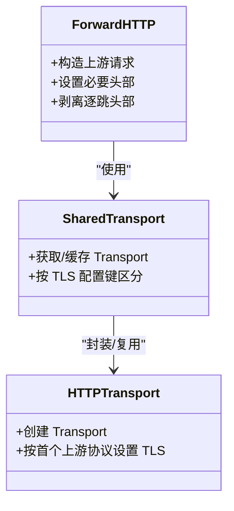
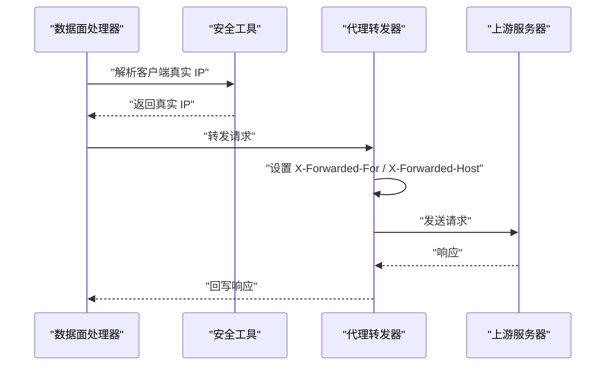
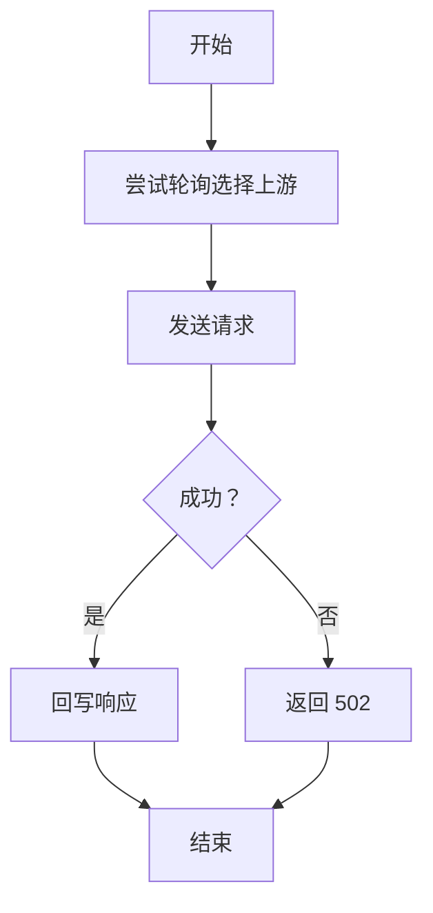
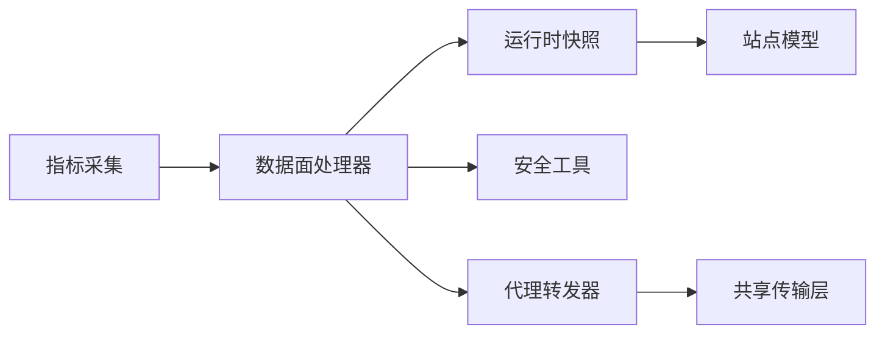

# 上游代理配置

<cite>
**本文引用的文件**
- [上游代理配置.md](file://docs/数据平面处理/上游代理配置.md)
- [proxy.go](file://internal/proxy/proxy.go)
- [transport.go](file://internal/upstream/transport.go)
- [handler.go](file://internal/dataplane/handler.go)
- [snapshot.go](file://internal/snapshot/snapshot.go)
- [clientip.go](file://internal/security/clientip.go)
- [outbound.go](file://internal/security/outbound.go)
- [metrics.go](file://internal/observability/metrics.go)
- [sse.go](file://internal/dataplane/sse.go)
- [site-upstreams.ts](file://frontend/lib/site-upstreams.ts)
- [add-site-dialog.tsx](file://frontend/components/add-site-dialog.tsx)
</cite>

## 目录
1. [简介](#简介)
2. [项目结构](#项目结构)
3. [核心组件](#核心组件)
4. [架构总览](#架构总览)
5. [详细组件分析](#详细组件分析)
6. [依赖关系分析](#依赖关系分析)
7. [性能考量](#性能考量)
8. [故障排查指南](#故障排查指南)
9. [结论](#结论)
10. [附录](#附录)

## 简介
本文件面向运维与开发人员，系统性阐述本项目的上游代理配置与实现机制，重点覆盖以下方面：
- HTTP 请求转发流程与负载均衡策略（轮询）
- 上游服务器配置（URL 列表管理、TLS 设置）
- 传输层优化（连接池、超时、HTTP/2）
- 代理头部处理（X-Forwarded-For、X-Forwarded-Host、客户端 IP 传递）
- 错误处理与故障转移（当前实现为轮询失败即返回 502）
- 性能调优与监控最佳实践

## 项目结构
上游代理相关能力由数据面处理器、代理转发器、安全头处理、运行时快照与存储模型共同构成，前端负责站点与转发配置的录入。

**图表来源**
- [handler.go:36-256](file://internal/dataplane/handler.go#L36-L256)
- [proxy.go:32-135](file://internal/proxy/proxy.go#L32-L135)
- [transport.go:12-28](file://internal/upstream/transport.go#L12-L28)
- [snapshot.go:21-50](file://internal/snapshot/snapshot.go#L21-L50)
- [clientip.go:12-49](file://internal/security/clientip.go#L12-L49)
- [outbound.go:8-16](file://internal/security/outbound.go#L8-L16)
- [metrics.go:13-125](file://internal/observability/metrics.go#L13-L125)

**章节来源**
- [handler.go:36-256](file://internal/dataplane/handler.go#L36-L256)
- [proxy.go:32-135](file://internal/proxy/proxy.go#L32-L135)
- [transport.go:12-28](file://internal/upstream/transport.go#L12-L28)
- [snapshot.go:21-50](file://internal/snapshot/snapshot.go#L21-L50)
- [clientip.go:12-49](file://internal/security/clientip.go#L12-L49)
- [outbound.go:8-16](file://internal/security/outbound.go#L8-L16)
- [metrics.go:13-125](file://internal/observability/metrics.go#L13-L125)

## 核心组件
- 数据面处理器：解析请求、匹配站点、执行 WAF、决定是否转发、进行轮询选择上游并调用转发器。
- 代理转发器：构造上游请求、设置必要头部、通过共享传输层发送请求、剥离“逐跳”头部并回写响应。
- 传输层封装：基于站点 TLS 配置缓存 http.Transport，支持 HTTP/2 与连接复用。
- 安全工具：解析客户端真实 IP（X-Forwarded-For 解析与可信网段判断）、设置出站 XFF/XFH。
- 运行时快照：聚合站点配置（含上游 URL 列表、TLS、转发参数）供数据面使用。
- 存储模型：站点实体包含上游 TLS 与转发相关字段。
- 指标采集：记录请求、拦截、上游错误等指标，便于监控与告警。

**章节来源**
- [handler.go:36-256](file://internal/dataplane/handler.go#L36-L256)
- [proxy.go:32-135](file://internal/proxy/proxy.go#L32-L135)
- [transport.go:12-28](file://internal/upstream/transport.go#L12-L28)
- [snapshot.go:21-50](file://internal/snapshot/snapshot.go#L21-L50)
- [clientip.go:12-49](file://internal/security/clientip.go#L12-L49)
- [outbound.go:8-16](file://internal/security/outbound.go#L8-L16)
- [metrics.go:13-125](file://internal/observability/metrics.go#L13-L125)

## 架构总览
下图展示一次典型请求从进入数据面到上游转发的关键路径与职责分工。

**图表来源**
- [handler.go:73-219](file://internal/dataplane/handler.go#L73-L219)
- [proxy.go:74-135](file://internal/proxy/proxy.go#L74-L135)
- [transport.go:12-28](file://internal/upstream/transport.go#L12-L28)
- [snapshot.go:74-96](file://internal/snapshot/snapshot.go#L74-L96)
- [clientip.go:12-49](file://internal/security/clientip.go#L12-L49)

## 详细组件分析

### 负载均衡策略与轮询算法
- 策略：在站点配置存在多个上游 URL 时，采用简单轮询（round-robin）策略。
- 实现要点：
  - 使用原子计数器维护下一个上游索引。
  - 对上游数量取模，确保均匀分布。
  - WebSocket 与 SSE 分支走专用转发函数，但未见额外的健康检查或故障转移逻辑；当前行为是轮询失败即返回 502。
- 适用场景：多实例上游部署，无需复杂健康探测时的均衡策略。

**图表来源**
- [handler.go:207-219](file://internal/dataplane/handler.go#L207-L219)

**章节来源**
- [handler.go:207-219](file://internal/dataplane/handler.go#L207-L219)

### 上游服务器配置与 URL 列表管理
- 配置来源：站点模型包含上游 URL 字符串与 TLS 相关字段。
- 解析规则：
  - 将逗号分隔的字符串拆分为 URL 列表，并去除空白。
  - 若为空则不进行转发，返回 502。
- TLS 配置：
  - 当首个上游以 https 开头时，启用 TLS 并按站点配置设置 SNI、跳过校验与最小版本。
- 前端录入：
  - 站点创建/编辑界面支持多行输入上游地址，支持删除与新增。
  - 转发配置页面支持 XFF 模式、可信网段、保留原始 Host 等参数。

**图表来源**
- [site-upstreams.ts:1-47](file://frontend/lib/site-upstreams.ts#L1-L47)
- [add-site-dialog.tsx:189-225](file://frontend/components/add-site-dialog.tsx#L189-L225)
- [add-site-dialog.tsx:302-345](file://frontend/components/add-site-dialog.tsx#L302-L345)

**章节来源**
- [site-upstreams.ts:1-47](file://frontend/lib/site-upstreams.ts#L1-L47)
- [add-site-dialog.tsx:189-225](file://frontend/components/add-site-dialog.tsx#L189-L225)
- [add-site-dialog.tsx:302-345](file://frontend/components/add-site-dialog.tsx#L302-L345)

### 传输层优化：连接池、超时与资源复用
- 连接池与复用：
  - 通过共享传输层缓存 http.Transport，按 TLS 配置键值区分，避免重复创建。
  - 默认最大空闲连接与每主机空闲连接上限，空闲超时较长，有利于复用。
- 协议与安全：
  - 强制尝试 HTTP/2；当上游为 https 时，按站点配置设置 SNI、跳过校验与最小版本。
- 超时策略：
  - 普通 HTTP 转发设置固定超时；SSE 转发设置无超时（流式长连接）。
- 适用建议：
  - 在高并发场景适当提高空闲连接上限与超时阈值。
  - 对于长连接/流式场景（如 SSE），保持无超时或合理放宽。

**图表来源**
- [proxy.go:32-71](file://internal/proxy/proxy.go#L32-L71)
- [transport.go:12-28](file://internal/upstream/transport.go#L12-L28)
- [proxy.go:73-135](file://internal/proxy/proxy.go#L73-L135)
- [sse.go:18-57](file://internal/dataplane/sse.go#L18-L57)

**章节来源**
- [proxy.go:32-71](file://internal/proxy/proxy.go#L32-L71)
- [transport.go:12-28](file://internal/upstream/transport.go#L12-L28)
- [proxy.go:73-135](file://internal/proxy/proxy.go#L73-L135)
- [sse.go:18-57](file://internal/dataplane/sse.go#L18-L57)

### 代理头部处理：X-Forwarded-For 与客户端 IP 传递
- 入站 IP 解析：
  - 支持多种 XFF 模式，结合可信网段判断，决定采用直接连接 IP 或 X-Forwarded-For 中的最左 IP。
- 出站头部设置：
  - 在上游请求中设置 X-Forwarded-For 为解析出的真实客户端 IP。
  - 若站点开启保留原始 Host，则设置 X-Forwarded-Host。
- 影响范围：
  - 适用于普通 HTTP、WebSocket、SSE 的上游请求。

**图表来源**
- [clientip.go:12-49](file://internal/security/clientip.go#L12-L49)
- [outbound.go:8-16](file://internal/security/outbound.go#L8-L16)
- [proxy.go:105-105](file://internal/proxy/proxy.go#L105-L105)
- [handler.go:73-73](file://internal/dataplane/handler.go#L73-L73)

**章节来源**
- [clientip.go:12-49](file://internal/security/clientip.go#L12-L49)
- [outbound.go:8-16](file://internal/security/outbound.go#L8-L16)
- [proxy.go:105-105](file://internal/proxy/proxy.go#L105-L105)
- [handler.go:73-73](file://internal/dataplane/handler.go#L73-L73)

### 错误处理与故障转移
- 当前实现：
  - 未内置健康检查与自动故障转移；若上游不可达或发生错误，直接返回 502。
  - SSE 分支同样返回 502。
- 建议改进方向（概念性）：
  - 引入上游健康检查（如定期探测），将不可用节点暂时移出轮询。
  - 在轮询失败时重试其他节点，或降级至备用上游。
  - 对上游错误进行分类统计，结合指标触发告警。

**图表来源**
- [handler.go:211-224](file://internal/dataplane/handler.go#L211-L224)
- [sse.go:51-57](file://internal/dataplane/sse.go#L51-L57)

**章节来源**
- [handler.go:211-224](file://internal/dataplane/handler.go#L211-L224)
- [sse.go:51-57](file://internal/dataplane/sse.go#L51-L57)

### 代理性能调优与监控最佳实践
- 连接与协议：
  - 启用 HTTP/2 可降低延迟与提升并发；根据上游支持情况调整。
  - 合理设置空闲连接上限与超时，避免连接过多导致资源耗尽。
- 负载均衡：
  - 在上游实例规模较大时，考虑引入更复杂的均衡策略（如加权轮询、最少连接）。
- 监控与告警：
  - 使用指标端点收集请求总量、状态码分布、上游错误计数、拦截次数等。
  - 结合错误率限流与告警策略，及时发现上游异常。
- 日志与追踪：
  - 为每个请求生成唯一 ID，贯穿数据面与上游转发链路，便于问题定位。

**章节来源**
- [metrics.go:13-125](file://internal/observability/metrics.go#L13-L125)
- [handler.go:48-52](file://internal/dataplane/handler.go#L48-L52)
- [handler.go:225-249](file://internal/dataplane/handler.go#L225-L249)

## 依赖关系分析
- 数据面处理器依赖运行时快照匹配站点，依赖安全工具解析客户端 IP，依赖代理转发器完成上游请求。
- 代理转发器依赖共享传输层以复用连接，依赖安全工具设置出站头部。
- 运行时快照从存储模型派生站点运行时配置，包含上游 URL 列表与 TLS/转发参数。
- 指标模块为数据面提供统一的指标采集入口。

**图表来源**
- [handler.go:36-256](file://internal/dataplane/handler.go#L36-L256)
- [proxy.go:32-135](file://internal/proxy/proxy.go#L32-L135)
- [snapshot.go:21-50](file://internal/snapshot/snapshot.go#L21-L50)
- [metrics.go:13-125](file://internal/observability/metrics.go#L13-L125)

**章节来源**
- [handler.go:36-256](file://internal/dataplane/handler.go#L36-L256)
- [proxy.go:32-135](file://internal/proxy/proxy.go#L32-L135)
- [snapshot.go:21-50](file://internal/snapshot/snapshot.go#L21-L50)
- [metrics.go:13-125](file://internal/observability/metrics.go#L13-L125)

## 性能考量
- 连接复用：通过共享传输层与合理的空闲连接策略，减少握手开销。
- 协议选择：优先使用 HTTP/2，提升多路复用与头部压缩收益。
- 负载均衡：在上游规模扩大后，评估更精细的均衡策略与健康检查。
- 超时与流式：区分短连接与长连接场景，避免不必要的超时限制影响体验。
- 监控：持续关注上游错误率、响应时间与连接池利用率，动态调整参数。

## 故障排查指南
- 无上游配置：站点未配置上游 URL 时，直接返回 502。请检查站点配置与前端录入。
- TLS 握手失败：确认上游 TLS 服务器名、证书与最小版本设置；必要时允许跳过校验进行临时验证。
- XFF 解析异常：检查 XFF 模式与可信网段配置，确保仅在可信代理之后设置 XFF。
- 上游不可达：当前实现会返回 502；建议结合监控与日志定位上游状态。
- 指标核对：通过指标端点查看请求量、状态码分布与上游错误计数，辅助定位问题。

**章节来源**
- [handler.go:202-205](file://internal/dataplane/handler.go#L202-L205)
- [proxy.go:55-61](file://internal/proxy/proxy.go#L55-L61)
- [clientip.go:23-49](file://internal/security/clientip.go#L23-L49)
- [metrics.go:13-125](file://internal/observability/metrics.go#L13-L125)

## 结论
本项目提供了简洁可靠的上游代理能力：基于站点配置的多上游轮询、共享传输层连接复用、标准代理头部处理与基础监控指标。对于高可用与高性能需求，可在现有基础上扩展健康检查、故障转移与更精细的均衡策略，并配合完善的监控与告警体系，持续优化上游转发的稳定性与吞吐。

## 附录
- 关键实现位置参考：
  - 负载均衡与转发入口：[handler.go:207-219](file://internal/dataplane/handler.go#L207-L219)
  - 代理转发与头部处理：[proxy.go:73-135](file://internal/proxy/proxy.go#L73-L135)
  - 传输层封装与 TLS：[proxy.go:32-71](file://internal/proxy/proxy.go#L32-L71)、[transport.go:12-28](file://internal/upstream/transport.go#L12-L28)
  - 运行时快照与站点模型：[snapshot.go:21-50](file://internal/snapshot/snapshot.go#L21-L50)
  - 客户端 IP 解析与出站头部：[clientip.go:12-49](file://internal/security/clientip.go#L12-L49)、[outbound.go:8-16](file://internal/security/outbound.go#L8-L16)
  - 指标采集与导出：[metrics.go:13-125](file://internal/observability/metrics.go#L13-L125)
  - SSE 转发：[sse.go:18-57](file://internal/dataplane/sse.go#L18-L57)
  - 前端配置入口：[add-site-dialog.tsx:189-225](file://frontend/components/add-site-dialog.tsx#L189-L225)、[site-upstreams.ts:1-47](file://frontend/lib/site-upstreams.ts#L1-L47)