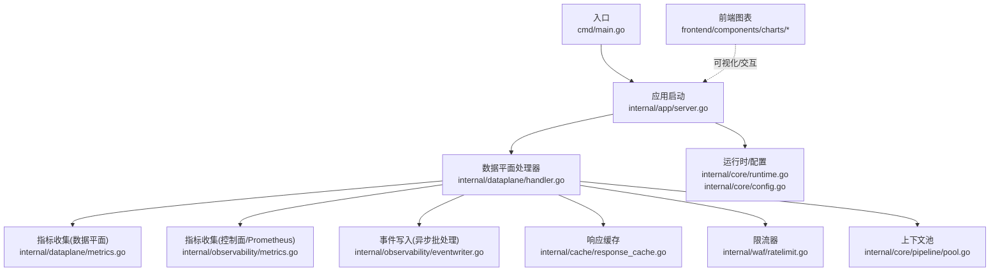
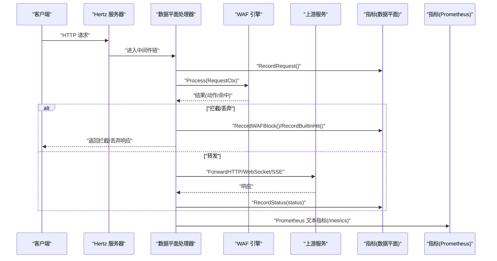
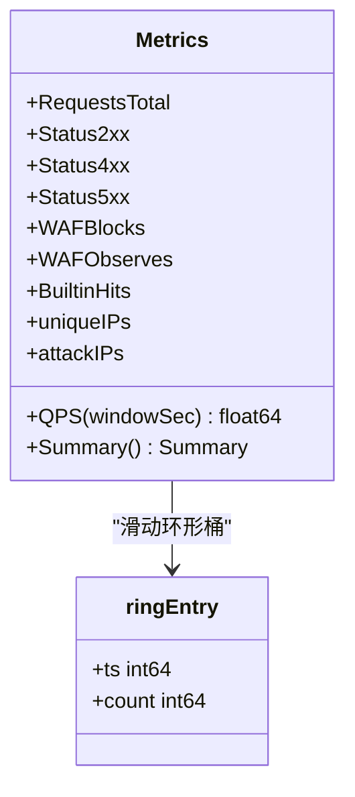
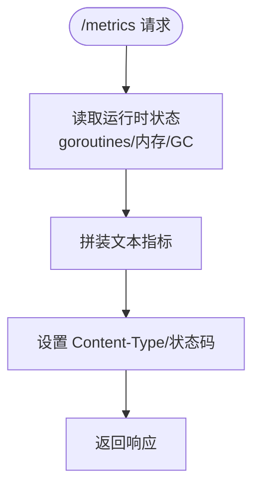
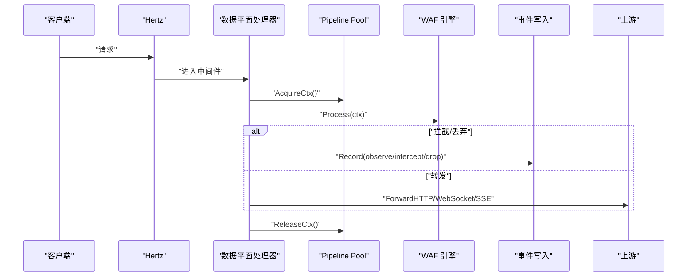
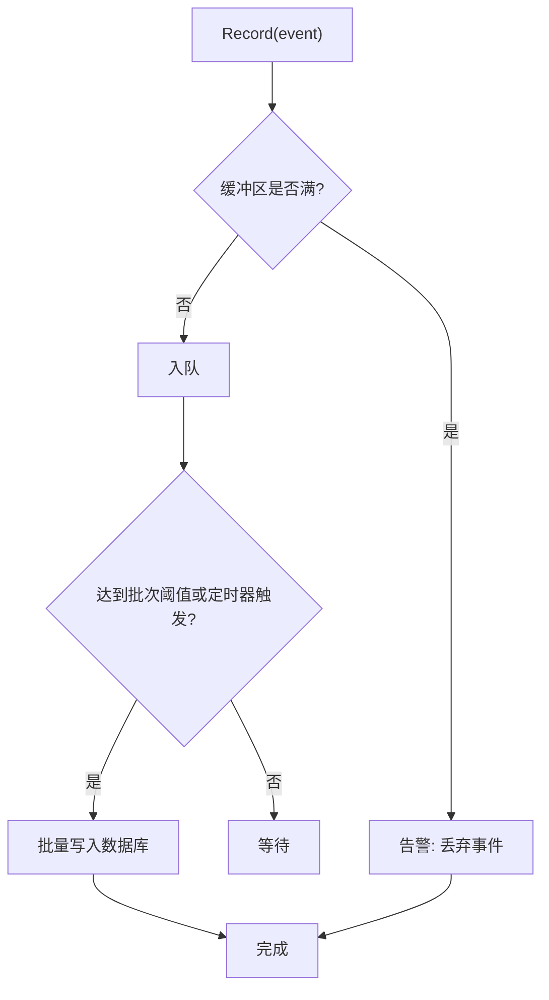
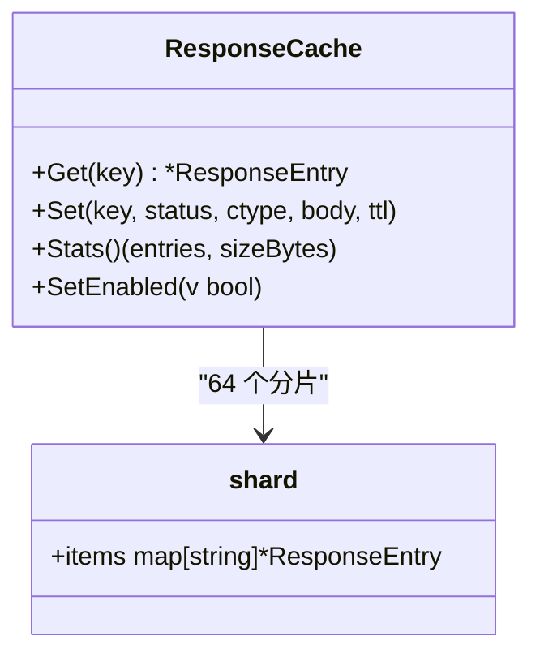
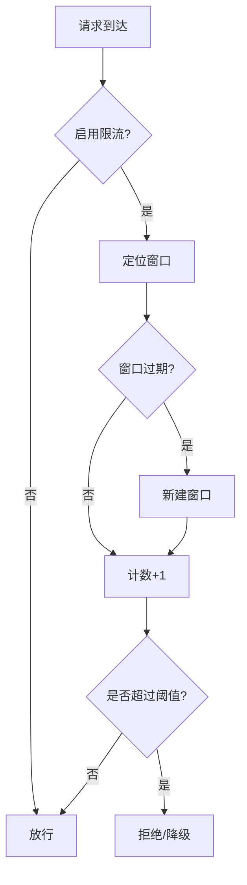
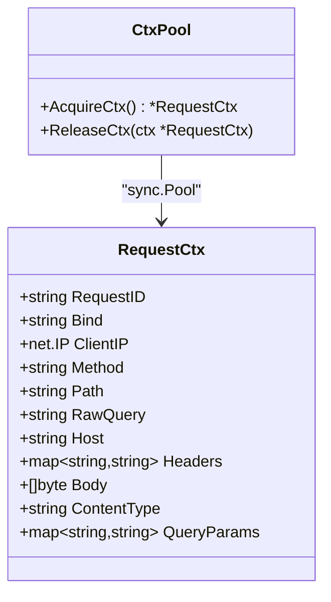
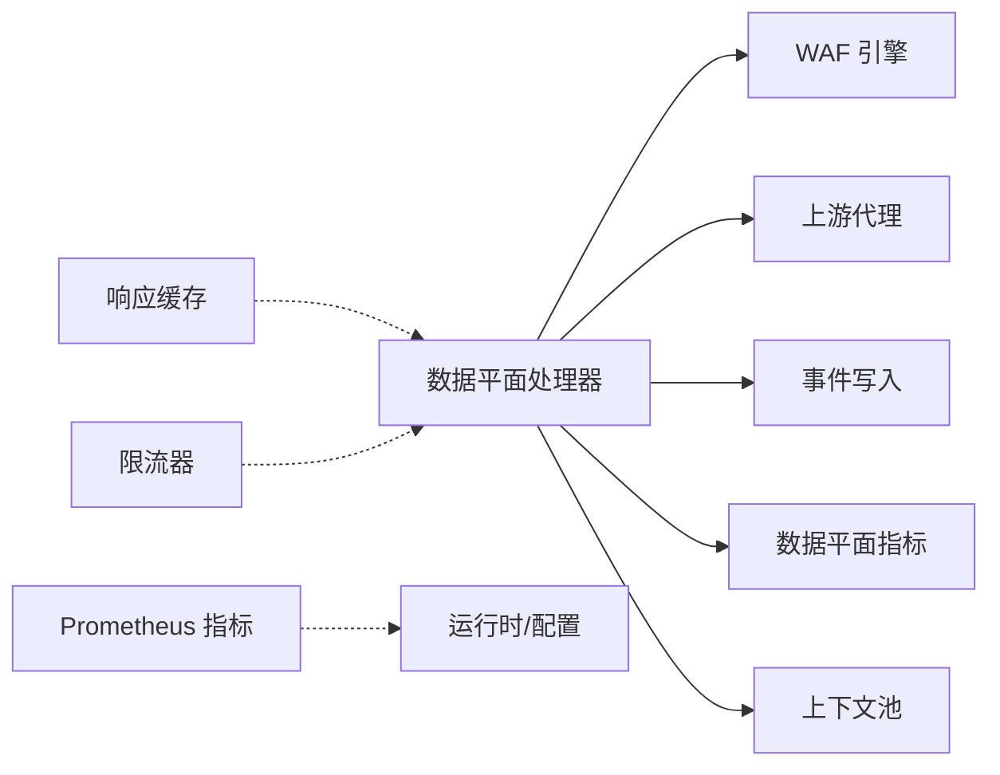

# 性能监控与调优

<cite>
**本文引用的文件**
- [cmd/main.go](file://cmd/main.go)
- [internal/app/server.go](file://internal/app/server.go)
- [internal/dataplane/metrics.go](file://internal/dataplane/metrics.go)
- [internal/observability/metrics.go](file://internal/observability/metrics.go)
- [internal/dataplane/handler.go](file://internal/dataplane/handler.go)
- [internal/observability/eventwriter.go](file://internal/observability/eventwriter.go)
- [internal/observability/archiver.go](file://internal/observability/archiver.go)
- [internal/cache/response_cache.go](file://internal/cache/response_cache.go)
- [internal/waf/ratelimit.go](file://internal/waf/ratelimit.go)
- [internal/core/pipeline/pool.go](file://internal/core/pipeline/pool.go)
- [internal/core/config.go](file://internal/core/config.go)
- [internal/core/runtime.go](file://internal/core/runtime.go)
- [frontend/components/charts/realtime-qps-chart.tsx](file://frontend/components/charts/realtime-qps-chart.tsx)
- [frontend/components/charts/top-list-card.tsx](file://frontend/components/charts/top-list-card.tsx)
</cite>

## 目录
1. [简介](#简介)
2. [项目结构](#项目结构)
3. [核心组件](#核心组件)
4. [架构总览](#架构总览)
5. [详细组件分析](#详细组件分析)
6. [依赖分析](#依赖分析)
7. [性能考虑](#性能考虑)
8. [故障排查指南](#故障排查指南)
9. [结论](#结论)
10. [附录](#附录)

## 简介
本文件面向数据平面（即面向终端用户的请求处理层）的性能监控与调优，系统性梳理以下内容：
- 关键性能指标采集与分析：请求延迟、吞吐量、错误率、资源使用等
- 指标体系设计：自定义指标、标签与聚合策略
- 瓶颈识别：热点分析、资源利用率监控、异常检测思路
- 调优策略：连接池与上下文复用、缓存优化、限流与负载均衡
- 监控与告警：阈值设定、通知与自动化响应建议
- 基准测试与容量规划：基于现有实现的可操作建议

## 项目结构
本项目采用分层与功能模块化组织：
- 入口与运行时：cmd/main.go 启动 internal/app/server.go，构建 Runtime 并初始化监听器
- 数据平面：内部通过 Hertz 中间件链路处理请求，包含 WAF 引擎、上游代理、事件写入与指标记录
- 观测性：独立的 Prometheus 文本指标端点、安全事件异步写入与归档
- 缓存与限流：内存响应缓存、固定窗口限流器
- 前端：可视化图表组件用于展示实时 QPS、Top 列表等

图示来源
- [cmd/main.go:1-10](file://cmd/main.go#L1-L10)
- [internal/app/server.go:35-305](file://internal/app/server.go#L35-L305)
- [internal/dataplane/handler.go:37-310](file://internal/dataplane/handler.go#L37-L310)
- [internal/dataplane/metrics.go:9-136](file://internal/dataplane/metrics.go#L9-L136)
- [internal/observability/metrics.go:13-126](file://internal/observability/metrics.go#L13-L126)
- [internal/observability/eventwriter.go:12-105](file://internal/observability/eventwriter.go#L12-L105)
- [internal/cache/response_cache.go:25-163](file://internal/cache/response_cache.go#L25-L163)
- [internal/waf/ratelimit.go:9-117](file://internal/waf/ratelimit.go#L9-L117)
- [internal/core/pipeline/pool.go:5-37](file://internal/core/pipeline/pool.go#L5-L37)
- [internal/core/runtime.go:17-127](file://internal/core/runtime.go#L17-L127)
- [internal/core/config.go:74-183](file://internal/core/config.go#L74-L183)

章节来源
- [cmd/main.go:1-10](file://cmd/main.go#L1-L10)
- [internal/app/server.go:35-305](file://internal/app/server.go#L35-L305)

## 核心组件
- 数据平面指标（数据平面维度）
  - 计数器：总请求数、2xx/4xx/5xx 状态计数、WAF 阻断/观察命中、内置规则命中
  - 实时 QPS：滑动环形桶统计最近 N 秒的请求速率
  - 去重统计：唯一客户端 IP、攻击来源 IP
  - 导出：Summary 结构体汇总输出
- 控制面指标（Prometheus 文本格式）
  - 请求总量、阻断总量、观察总量、内置命中、缓存命中/未命中、上游错误、进程运行时长、goroutine 数、内存分配、GC 暂停时间
- 处理器链路
  - 维护模式检查、WAF 引擎处理、拦截/丢弃、上游转发（HTTP/WebSocket/SSE）、错误率限流、访问日志
- 事件写入
  - 安全事件异步批写入数据库，避免阻塞热路径；支持周期清理过期事件
- 缓存
  - 内存响应缓存（LRU-like 分片），带默认 TTL 与大小上限
- 限流
  - 固定窗口限流，按 (clientIP + host) 维度计数，支持错误率统计
- 上下文池
  - 复用 RequestCtx，减少 GC 压力

章节来源
- [internal/dataplane/metrics.go:9-136](file://internal/dataplane/metrics.go#L9-L136)
- [internal/observability/metrics.go:13-126](file://internal/observability/metrics.go#L13-L126)
- [internal/dataplane/handler.go:37-310](file://internal/dataplane/handler.go#L37-L310)
- [internal/observability/eventwriter.go:12-105](file://internal/observability/eventwriter.go#L12-L105)
- [internal/cache/response_cache.go:25-163](file://internal/cache/response_cache.go#L25-L163)
- [internal/waf/ratelimit.go:9-117](file://internal/waf/ratelimit.go#L9-L117)
- [internal/core/pipeline/pool.go:5-37](file://internal/core/pipeline/pool.go#L5-L37)

## 架构总览
数据平面在每个站点绑定地址上创建独立 Hertz 服务器实例，统一挂载数据平面处理器中间件。处理器在热路径中完成：
- 请求入站解析与上下文复用
- WAF 引擎判定
- 拦截/丢弃或转发上游
- 指标与事件记录
- 错误率限流与访问日志

图示来源
- [internal/app/server.go:286-305](file://internal/app/server.go#L286-L305)
- [internal/dataplane/handler.go:37-310](file://internal/dataplane/handler.go#L37-L310)
- [internal/observability/metrics.go:51-126](file://internal/observability/metrics.go#L51-L126)

## 详细组件分析

### 数据平面指标组件
- 设计要点
  - 使用原子计数器保证并发安全
  - 滑动环形桶统计近 10 个 1 秒桶内的请求总数，计算最近 1/5 秒 QPS
  - 唯一 IP 与攻击 IP 使用并发映射去重计数
  - 提供 Summary 结构体用于快速导出
- 性能特性
  - O(1) 记录，O(N) 查询（N=10）
  - 低锁竞争：仅在更新当前桶时加锁
- 可扩展建议
  - 引入直方图/摘要以支持延迟分位数
  - 增加标签维度（站点、主机、路径前缀等）

图示来源
- [internal/dataplane/metrics.go:9-136](file://internal/dataplane/metrics.go#L9-L136)

章节来源
- [internal/dataplane/metrics.go:9-136](file://internal/dataplane/metrics.go#L9-L136)

### Prometheus 控制面指标组件
- 指标清单
  - openwaf_requests_total、openwaf_blocks_total、openwaf_observes_total、openwaf_builtin_hits_total
  - openwaf_cache_hits_total、openwaf_cache_misses_total、openwaf_upstream_errors_total
  - openwaf_uptime_seconds、openwaf_goroutines、openwaf_memory_alloc_bytes、openwaf_memory_sys_bytes、openwaf_gc_pause_total_ns
- 输出格式
  - 文本格式，符合 Prometheus 抓取规范
- 用途
  - 作为 Prometheus 拉取目标，结合 Grafana 进行可视化与告警

图示来源
- [internal/observability/metrics.go:51-126](file://internal/observability/metrics.go#L51-L126)

章节来源
- [internal/observability/metrics.go:13-126](file://internal/observability/metrics.go#L13-L126)

### 数据平面处理器与链路
- 关键流程
  - 静态资源短路
  - 请求 ID 设置、指标记录、站点匹配
  - 客户端 IP 解析、上下文从池中获取
  - WAF 引擎处理、拦截/丢弃分支、事件写入
  - 上游转发（HTTP/WebSocket/SSE）、错误率限流
  - 访问日志输出
- 并发与性能
  - 使用 sync.Pool 复用 RequestCtx，降低 GC 压力
  - 事件写入采用缓冲通道与批量写入，避免阻塞热路径
- 可观测性
  - 记录 observe 命中、拦截/丢弃事件，写入数据库
  - 支持错误率限流（按 4xx/5xx 开关）

图示来源
- [internal/dataplane/handler.go:37-310](file://internal/dataplane/handler.go#L37-L310)
- [internal/core/pipeline/pool.go:5-37](file://internal/core/pipeline/pool.go#L5-L37)
- [internal/observability/eventwriter.go:12-105](file://internal/observability/eventwriter.go#L12-L105)

章节来源
- [internal/dataplane/handler.go:37-310](file://internal/dataplane/handler.go#L37-L310)
- [internal/core/pipeline/pool.go:5-37](file://internal/core/pipeline/pool.go#L5-L37)

### 事件写入与归档
- 事件写入
  - 带缓冲通道（默认 4096），批量写入（默认每批 64，2 秒刷新）
  - 非阻塞：缓冲满时丢弃事件并告警
- 归档
  - 每小时清理超过保留期（默认 30 天）的安全事件
- 性能影响
  - 将数据库写入从热路径剥离，显著降低尾延迟

图示来源
- [internal/observability/eventwriter.go:12-105](file://internal/observability/eventwriter.go#L12-L105)
- [internal/observability/archiver.go:11-72](file://internal/observability/archiver.go#L11-L72)

章节来源
- [internal/observability/eventwriter.go:12-105](file://internal/observability/eventwriter.go#L12-L105)
- [internal/observability/archiver.go:11-72](file://internal/observability/archiver.go#L11-L72)

### 响应缓存组件
- 特性
  - 分片哈希锁降低竞争
  - 默认 TTL 与最大内存限制
  - 过期清理后台任务
- 适用场景
  - GET 类安全响应的热点缓存
- 调优建议
  - 根据站点流量特征调整 maxSizeMB 与 defaultTTLSec
  - 对高波动路径禁用缓存或缩短 TTL

图示来源
- [internal/cache/response_cache.go:25-163](file://internal/cache/response_cache.go#L25-L163)

章节来源
- [internal/cache/response_cache.go:25-163](file://internal/cache/response_cache.go#L25-L163)

### 限流组件
- 固定窗口限流
  - 维度：(clientIP + host)
  - 动作：Allow/Increment/IsOverLimit
  - 清理：后台定时清理过期窗口
- 错误率限流
  - 在响应后根据配置统计 4xx/5xx 错误并计数

图示来源
- [internal/waf/ratelimit.go:9-117](file://internal/waf/ratelimit.go#L9-L117)

章节来源
- [internal/waf/ratelimit.go:9-117](file://internal/waf/ratelimit.go#L9-L117)

### 上下文池
- 目的：复用 RequestCtx，减少频繁分配与 GC 压力
- 行为：获取时预分配头部映射，释放时清空字段并归还

图示来源
- [internal/core/pipeline/pool.go:5-37](file://internal/core/pipeline/pool.go#L5-L37)

章节来源
- [internal/core/pipeline/pool.go:5-37](file://internal/core/pipeline/pool.go#L5-L37)

## 依赖分析
- 组件耦合
  - 数据平面处理器依赖：WAF 引擎、上游代理、事件写入、指标、上下文池
  - Prometheus 指标与运行时状态解耦，通过只读接口暴露
  - 缓存与限流作为独立组件被引擎与处理器使用
- 外部依赖
  - Hertz 作为 HTTP 服务器框架
  - Redis（可选）用于分布式共享状态与配置同步
  - 数据库用于持久化配置与安全事件

图示来源
- [internal/app/server.go:90-148](file://internal/app/server.go#L90-L148)
- [internal/dataplane/handler.go:37-310](file://internal/dataplane/handler.go#L37-L310)

章节来源
- [internal/app/server.go:90-148](file://internal/app/server.go#L90-L148)

## 性能考虑
- 指标与采样
  - 数据平面 QPS 采用滑动桶，适合短期突发与平滑趋势观察
  - Prometheus 指标补充系统级资源指标，便于关联分析
- 缓存与限流
  - 响应缓存对静态/热点 GET 请求收益明显，需结合业务特征调参
  - 固定窗口限流简单高效，适合突发流量削峰与错误率保护
- 并发与内存
  - 上下文池与分片缓存降低锁竞争与 GC 压力
  - 事件写入采用异步批处理，避免阻塞热路径
- 端到端延迟
  - 建议引入延迟直方图与追踪（如 OpenTelemetry）以定位慢请求
  - 对上游超时与重试策略进行参数化与可观测化

[本节为通用指导，无需列出章节来源]

## 故障排查指南
- 指标异常
  - QPS 突增且 5xx 占比升高：检查上游健康、缓存命中率、限流触发情况
  - 观察命中增多：关注规则集变更与误报风险
- 资源问题
  - goroutine 数激增：检查事件写入背压与数据库写入性能
  - 内存增长：确认缓存大小上限与过期清理是否生效
- 事件丢失
  - 安全事件缓冲区告警：增大缓冲或提升写入频率
- 限流误伤
  - 核对限流窗口与阈值，必要时按 host 或用户细分维度

章节来源
- [internal/observability/metrics.go:51-126](file://internal/observability/metrics.go#L51-L126)
- [internal/observability/eventwriter.go:12-105](file://internal/observability/eventwriter.go#L12-L105)
- [internal/cache/response_cache.go:25-163](file://internal/cache/response_cache.go#L25-L163)
- [internal/waf/ratelimit.go:9-117](file://internal/waf/ratelimit.go#L9-L117)

## 结论
本项目在数据平面实现了轻量而高效的指标采集与可观测性基础，配合异步事件写入、响应缓存与限流，能够在高并发场景下保持稳定与低延迟。建议后续引入更丰富的延迟指标、分布式追踪与自动扩缩容联动，以进一步完善性能监控与调优闭环。

[本节为总结，无需列出章节来源]

## 附录

### 指标体系设计与标签管理
- 自定义指标
  - 数据平面：请求总量、状态分布、阻断/观察命中、内置命中、唯一 IP、攻击 IP、QPS（1s/5s）
  - 控制面：请求总量、阻断/观察/内置命中、缓存命中/未命中、上游错误、运行时指标
- 标签与聚合
  - 建议按站点、主机、路径前缀、规则阶段等维度进行聚合
  - 使用 Prometheus 的 histogram_quantile 与 rate() 函数进行分位数与速率分析

章节来源
- [internal/dataplane/metrics.go:105-136](file://internal/dataplane/metrics.go#L105-L136)
- [internal/observability/metrics.go:13-126](file://internal/observability/metrics.go#L13-L126)

### 瓶颈识别方法
- 热点分析
  - 基于 Top 列表卡片组件展示攻击来源、命中规则等，辅助定位热点
- 资源利用率
  - 通过 Prometheus 指标观察 CPU、内存、goroutine、GC 暂停
- 异常检测
  - 基于 QPS、错误率、延迟的阈值与滑动窗口检测异常

章节来源
- [frontend/components/charts/top-list-card.tsx:18-107](file://frontend/components/charts/top-list-card.tsx#L18-L107)
- [internal/observability/metrics.go:51-126](file://internal/observability/metrics.go#L51-L126)

### 调优策略
- 连接池与上下文复用
  - 已通过 sync.Pool 与分片缓存降低分配与锁竞争
- 缓存优化
  - 调整缓存大小上限与默认 TTL，针对热点路径启用缓存
- 负载均衡
  - 数据平面按站点拆分监听器，结合上游多实例部署与健康检查

章节来源
- [internal/core/pipeline/pool.go:5-37](file://internal/core/pipeline/pool.go#L5-L37)
- [internal/cache/response_cache.go:25-163](file://internal/cache/response_cache.go#L25-L163)
- [internal/app/server.go:286-305](file://internal/app/server.go#L286-L305)

### 监控告警机制
- 阈值设置
  - QPS：短期峰值与长期均值差阈值
  - 错误率：4xx/5xx 占比阈值
  - 资源：goroutine 数、内存、GC 暂停时间阈值
- 告警通知
  - Prometheus Alertmanager 集成
- 自动化响应
  - 基于限流与熔断的自动降级策略

[本节为通用指导，无需列出章节来源]

### 基准测试与容量规划
- 基准测试
  - 使用压测工具模拟不同并发与请求类型，记录 QPS、P95/P99 延迟、错误率与资源占用
- 容量规划
  - 依据缓存命中率与限流触发点，评估节点数量与上游实例规模
  - 结合前端图表组件持续监控线上表现

[本节为通用指导，无需列出章节 sources]