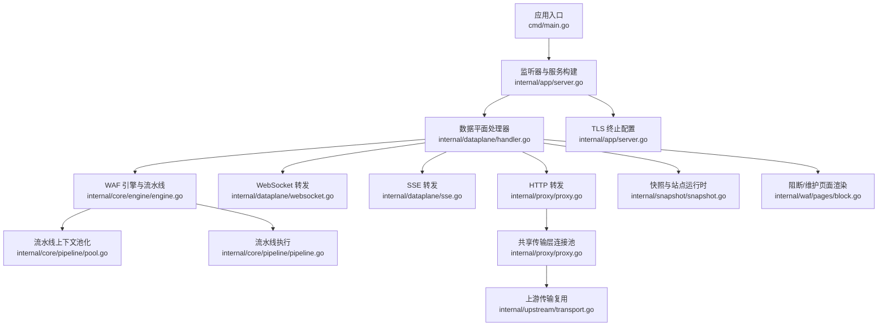
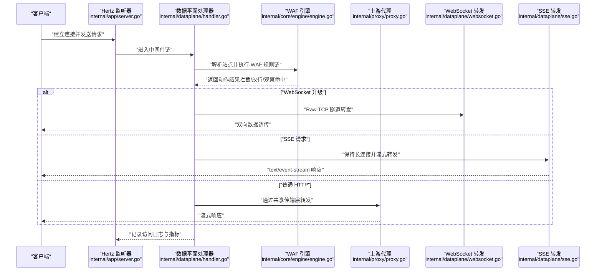
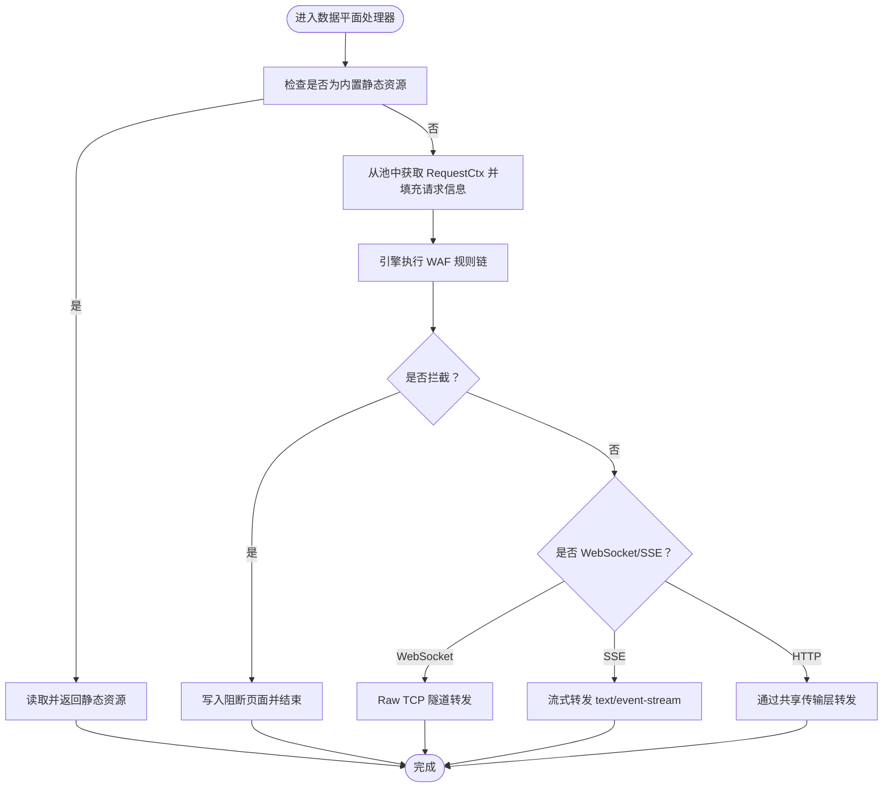
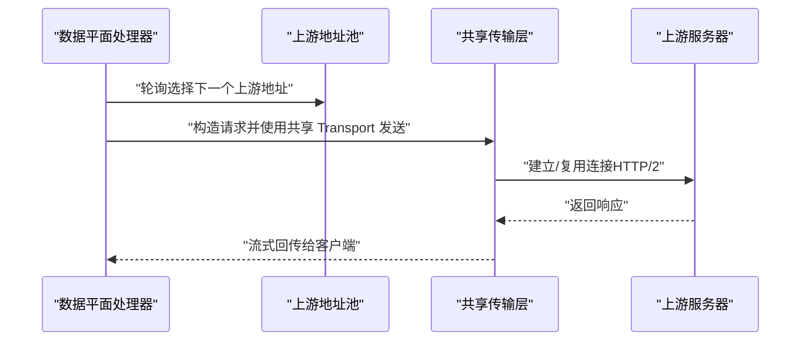
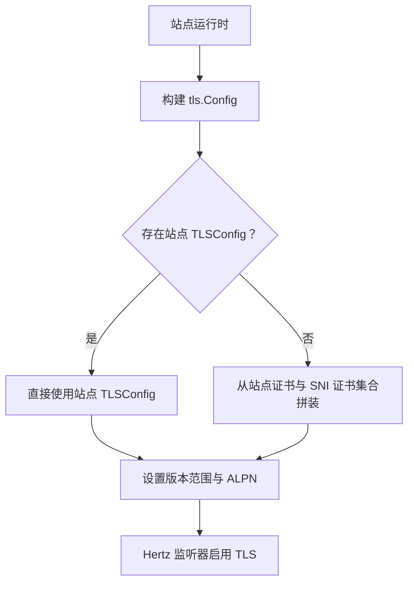
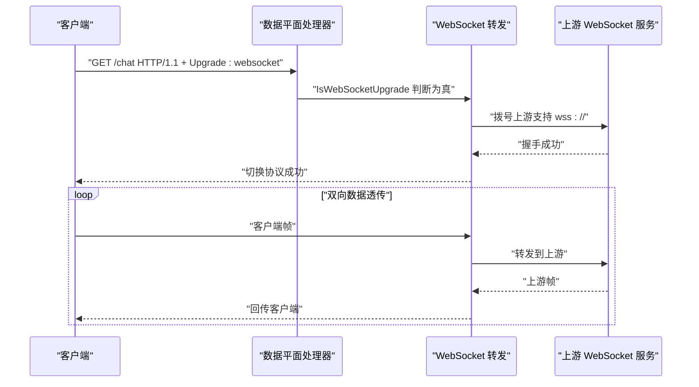
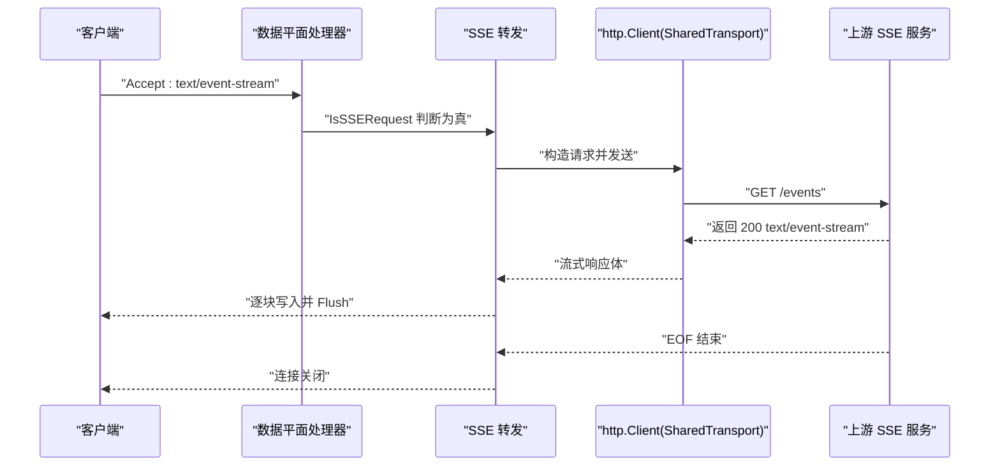
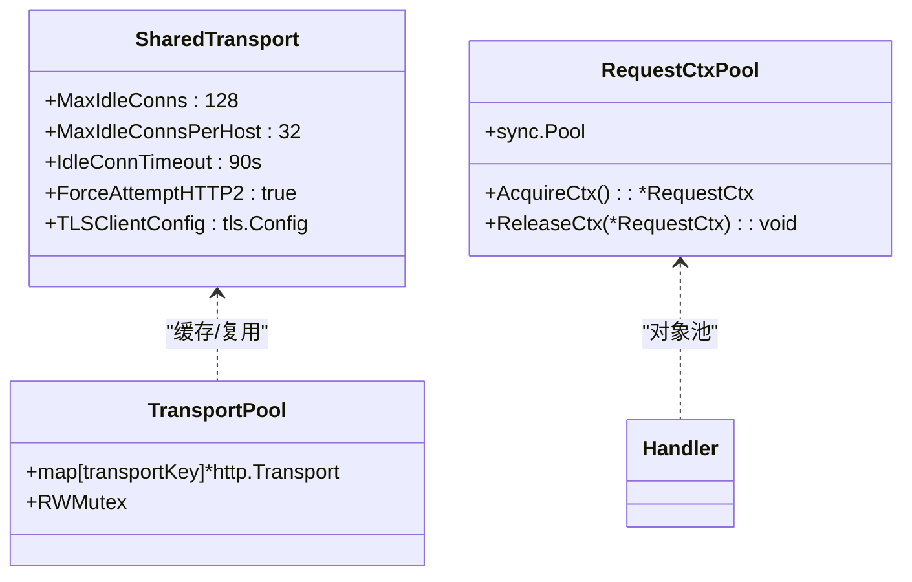
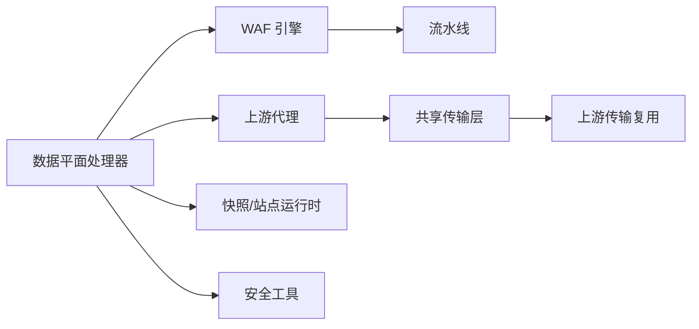

# 数据平面处理

<cite>
**本文引用的文件**
- [cmd/main.go](file://cmd/main.go)
- [internal/app/server.go](file://internal/app/server.go)
- [internal/dataplane/handler.go](file://internal/dataplane/handler.go)
- [internal/dataplane/websocket.go](file://internal/dataplane/websocket.go)
- [internal/dataplane/sse.go](file://internal/dataplane/sse.go)
- [internal/dataplane/metrics.go](file://internal/dataplane/metrics.go)
- [internal/dataplane/helpers.go](file://internal/dataplane/helpers.go)
- [internal/dataplane/reqid.go](file://internal/dataplane/reqid.go)
- [internal/admin/site/listener.go](file://internal/admin/site/listener.go)
- [internal/proxy/proxy.go](file://internal/proxy/proxy.go)
- [internal/upstream/transport.go](file://internal/upstream/transport.go)
- [internal/core/engine/engine.go](file://internal/core/engine/engine.go)
- [internal/core/pipeline/pipeline.go](file://internal/core/pipeline/pipeline.go)
- [internal/core/pipeline/pool.go](file://internal/core/pipeline/pool.go)
- [internal/snapshot/snapshot.go](file://internal/snapshot/snapshot.go)
- [internal/waf/pages/block.go](file://internal/waf/pages/block.go)
- [internal/observability/eventwriter.go](file://internal/observability/eventwriter.go)
- [internal/observability/metrics.go](file://internal/observability/metrics.go)
- [internal/observability/archiver.go](file://internal/observability/archiver.go)
- [internal/core/config.go](file://internal/core/config.go)
</cite>

> **子页面分类索引**
>
> 本模块文档按主题分为三类，涵盖数据平面从请求进入到响应输出的完整链路：
>
> **协议与连接处理**
> - [TLS 终止与证书管理](./TLS 终止与证书管理.md) — 站点级 TLS 配置构建、证书与 SNI 多域名管理及 ALPN 协商。
> - [WebSocket 连接处理](./WebSocket 连接处理.md) — WebSocket 升级检测、Raw TCP 隧道转发与双向数据透传。
> - [SSE 事件推送](./SSE 事件推送.md) — Server-Sent Events 长连接流式转发与事件写入器异步批处理。
>
> **请求处理与转发**
> - [请求处理流程](./请求处理流程.md) — 从请求进入到响应输出的完整链路，含站点匹配、WAF 规则阶段执行、拦截与放行决策。
> - [上游代理配置](./上游代理配置.md) — 上游轮询负载均衡、共享传输层连接复用、代理头部处理与转发参数配置。
>
> **性能与可观测性**
> - [性能监控与调优](./性能监控与调优.md) — 数据平面指标体系、Prometheus 监控、响应缓存、限流与连接池调优。

## 模块架构概述

数据平面以"每个站点一个独立 Hertz 监听器"的方式运行，请求进入后依次完成：
1. **协议层处理**：TLS 终止（证书选择、SNI 匹配、ALPN）→ HTTP/WebSocket/SSE 协议识别；
2. **请求处理**：站点匹配（绑定地址 + Host）→ WAF 引擎多阶段规则执行 → 拦截/维护/放行决策；
3. **上游转发**：轮询选择上游地址 → 通过共享传输层连接池复用连接 → 剥离 Hop-by-Hop 头部并回写响应；
4. **可观测性**：异步批量写入安全事件、实时 QPS 与状态码统计、Prometheus 文本指标导出。

整个链路以对象池（RequestCtx）、连接池（http.Transport）和 HTTP/2 复用为核心优化手段，兼顾高并发与低延迟。

## 目录
1. [简介](#简介)
2. [项目结构](#项目结构)
3. [核心组件](#核心组件)
4. [架构总览](#架构总览)
5. [详细组件分析](#详细组件分析)
6. [依赖分析](#依赖分析)
7. [性能考量](#性能考量)
8. [故障排查指南](#故障排查指南)
9. [结论](#结论)
10. [附录](#附录)

## 简介
本文件聚焦于数据平面（Data Plane）的处理流程与实现细节，涵盖请求从接收、WAF 处理、上游转发（含 HTTP、WebSocket、Server-Sent Events）、TLS 终止、连接池与传输层优化、以及可观测性与性能调优等主题。目标是帮助读者在不深入源码的前提下，理解系统如何高效、安全地处理流量。

## 项目结构
数据平面相关代码主要分布在以下模块：
- 应用入口与监听器管理：cmd/main.go、internal/app/server.go
- 数据平面处理器：internal/dataplane/handler.go 及其子功能（WebSocket、SSE）
- 上游代理与传输层：internal/proxy/proxy.go、internal/upstream/transport.go
- WAF 引擎与流水线：internal/core/engine/engine.go、internal/core/pipeline/pipeline.go、internal/core/pipeline/pool.go
- 快照与站点运行时：internal/snapshot/snapshot.go
- 阻断与维护页面渲染：internal/waf/pages/block.go
- 运行时配置加载：internal/core/config.go

**图表来源**
- [cmd/main.go:1-10](file://cmd/main.go#L1-L10)
- [internal/app/server.go:327-414](file://internal/app/server.go#L327-L414)
- [internal/dataplane/handler.go:36-256](file://internal/dataplane/handler.go#L36-L256)
- [internal/proxy/proxy.go:32-135](file://internal/proxy/proxy.go#L32-L135)
- [internal/upstream/transport.go:12-28](file://internal/upstream/transport.go#L12-L28)
- [internal/core/engine/engine.go:15-106](file://internal/core/engine/engine.go#L15-L106)
- [internal/core/pipeline/pool.go:5-37](file://internal/core/pipeline/pool.go#L5-L37)
- [internal/core/pipeline/pipeline.go:25-66](file://internal/core/pipeline/pipeline.go#L25-L66)
- [internal/snapshot/snapshot.go:21-96](file://internal/snapshot/snapshot.go#L21-L96)
- [internal/waf/pages/block.go:16-66](file://internal/waf/pages/block.go#L16-L66)

**章节来源**
- [cmd/main.go:1-10](file://cmd/main.go#L1-L10)
- [internal/app/server.go:327-414](file://internal/app/server.go#L327-L414)

## 核心组件
- 数据平面处理器：负责静态资源、访问日志、WAF 执行、上游转发（HTTP/WebSocket/SSE）、错误率限流与状态统计。
- WAF 引擎与流水线：按阶段顺序执行规则链，支持观察命中与拦截动作。
- 上游代理与传输层：基于 http.Transport 的连接池与复用，支持 HTTP/2、TLS 与 SNI。
- TLS 终止：按站点绑定地址与证书配置动态构建 tls.Config，并支持 ALPN。
- 快照与站点运行时：提供站点匹配、上游地址、转发参数与证书等运行时信息。
- 阻断/维护页面：根据策略渲染阻断或维护页面，支持模板与内嵌资源回退。

**章节来源**
- [internal/dataplane/handler.go:36-256](file://internal/dataplane/handler.go#L36-L256)
- [internal/core/engine/engine.go:15-106](file://internal/core/engine/engine.go#L15-L106)
- [internal/proxy/proxy.go:32-135](file://internal/proxy/proxy.go#L32-L135)
- [internal/app/server.go:353-414](file://internal/app/server.go#L353-L414)
- [internal/snapshot/snapshot.go:21-96](file://internal/snapshot/snapshot.go#L21-L96)
- [internal/waf/pages/block.go:16-66](file://internal/waf/pages/block.go#L16-L66)

## 架构总览
数据平面以"每个站点一个监听器"的方式热管理监听器生命周期，结合快照持有者实现配置变更的自动检测与重启。请求进入后，先进行静态资源判定、WAF 处理，再根据协议类型选择 HTTP、WebSocket 或 SSE 转发；上游采用共享传输层连接池，支持 HTTP/2 与 TLS。

**图表来源**
- [internal/app/server.go:133-201](file://internal/app/server.go#L133-L201)
- [internal/dataplane/handler.go:36-256](file://internal/dataplane/handler.go#L36-L256)
- [internal/core/engine/engine.go:44-106](file://internal/core/engine/engine.go#L44-L106)
- [internal/proxy/proxy.go:73-135](file://internal/proxy/proxy.go#L73-L135)
- [internal/dataplane/websocket.go:22-69](file://internal/dataplane/websocket.go#L22-L69)
- [internal/dataplane/sse.go:18-87](file://internal/dataplane/sse.go#L18-L87)

## 详细组件分析

### 请求处理主流程（从接收至响应）
- 静态资源优先：若路径命中内置前端资源前缀，则直接读取并返回。
- 请求上下文构建：使用对象池申请 RequestCtx，填充方法、路径、查询串、头部、Body 等，限制 WAF Body 截断以控制内存。
- WAF 执行：按站点匹配与保护策略执行多阶段规则链，收集观察命中并决定是否拦截。
- 上游转发决策：根据是否为 WebSocket 或 SSE 选择不同转发路径；否则走 HTTP 转发。
- 错误率限流：基于响应状态码对 4xx/5xx 进行计数，支持按客户端 IP 与 Host 维度聚合。
- 访问日志与指标：记录请求 ID、方法、路径、主机、状态码与 WAF 动作。

**图表来源**
- [internal/dataplane/handler.go:36-256](file://internal/dataplane/handler.go#L36-L256)
- [internal/core/pipeline/pool.go:14-37](file://internal/core/pipeline/pool.go#L14-L37)
- [internal/core/engine/engine.go:44-106](file://internal/core/engine/engine.go#L44-L106)
- [internal/waf/pages/block.go:16-66](file://internal/waf/pages/block.go#L16-L66)

**章节来源**
- [internal/dataplane/handler.go:36-256](file://internal/dataplane/handler.go#L36-L256)
- [internal/core/pipeline/pool.go:14-37](file://internal/core/pipeline/pool.go#L14-L37)
- [internal/core/engine/engine.go:44-106](file://internal/core/engine/engine.go#L44-L106)
- [internal/waf/pages/block.go:16-66](file://internal/waf/pages/block.go#L16-L66)

### 上游代理配置与负载均衡
- 负载均衡：轮询策略在多个上游地址间循环选择，简单可靠。
- 健康检查与故障转移：当前实现未见显式的健康检查逻辑；故障转移由上层错误处理触发（如上游错误返回 502）。
- 转发参数：支持 X-Forwarded-*、PreserveOriginalHost 等转发行为，避免头部污染。
- 传输层：共享 http.Transport 池，按 TLS 配置键值缓存，复用连接，启用 HTTP/2。

**图表来源**
- [internal/dataplane/handler.go:202-219](file://internal/dataplane/handler.go#L202-L219)
- [internal/proxy/proxy.go:32-135](file://internal/proxy/proxy.go#L32-L135)

**章节来源**
- [internal/dataplane/handler.go:202-219](file://internal/dataplane/handler.go#L202-L219)
- [internal/proxy/proxy.go:32-135](file://internal/proxy/proxy.go#L32-L135)

### TLS 终止与证书管理
- 监听器 TLS：按站点绑定地址与证书配置构建 tls.Config，支持最小/最大 TLS 版本与 ALPN。
- 证书来源：优先使用站点运行时提供的 TLSConfig；否则从站点证书与 SNI 证书集合构建。
- 性能优化：启用标准传输器与 HTTP/2，减少握手与连接开销。

**图表来源**
- [internal/app/server.go:353-414](file://internal/app/server.go#L353-L414)
- [internal/snapshot/snapshot.go:21-50](file://internal/snapshot/snapshot.go#L21-L50)

**章节来源**
- [internal/app/server.go:353-414](file://internal/app/server.go#L353-L414)
- [internal/snapshot/snapshot.go:21-50](file://internal/snapshot/snapshot.go#L21-L50)

### WebSocket 连接处理
- 协商识别：通过 Upgrade/Connection 头判断升级请求。
- 转发策略：将已升级的连接以 Raw TCP 方式隧道到上游（ws/wss），保留原始请求行与头部。
- 安全与超时：上游连接带超时；TLS 场景使用站点配置的 SNI 与校验策略。
- 维护：双向复制 goroutine，任一端关闭即结束。

**图表来源**
- [internal/dataplane/websocket.go:16-69](file://internal/dataplane/websocket.go#L16-L69)
- [internal/dataplane/handler.go:213-214](file://internal/dataplane/handler.go#L213-L214)

**章节来源**
- [internal/dataplane/websocket.go:16-69](file://internal/dataplane/websocket.go#L16-L69)
- [internal/dataplane/handler.go:213-214](file://internal/dataplane/handler.go#L213-L214)

### Server-Sent Events 实现
- 协商识别：通过 Accept 头包含 text/event-stream 判断。
- 转发策略：使用共享传输层发起上游请求，剥离敏感头部，设置必要的缓存与连接头，流式读取并刷新输出。
- 连接管理：保持长连接，遇到 EOF 正常结束，其他错误返回上游错误。

**图表来源**
- [internal/dataplane/sse.go:18-87](file://internal/dataplane/sse.go#L18-L87)
- [internal/proxy/proxy.go:32-71](file://internal/proxy/proxy.go#L32-L71)
- [internal/dataplane/handler.go:215-216](file://internal/dataplane/handler.go#L215-L216)

**章节来源**
- [internal/dataplane/sse.go:18-87](file://internal/dataplane/sse.go#L18-L87)
- [internal/proxy/proxy.go:32-71](file://internal/proxy/proxy.go#L32-L71)
- [internal/dataplane/handler.go:215-216](file://internal/dataplane/handler.go#L215-L216)

### 传输层优化（连接池、超时与资源管理）
- 连接池：共享 http.Transport，按 TLS 配置键缓存，避免重复握手与连接创建。
- 超时配置：HTTP 转发设置请求超时；WebSocket/SSE 使用拨号器超时与无固定超时的流式读取。
- 资源管理：对象池回收 RequestCtx，减少 GC 压力；WAF Body 截断避免内存滥用。
- HTTP/2：强制尝试启用，提升多路复用效率。

**图表来源**
- [internal/proxy/proxy.go:20-71](file://internal/proxy/proxy.go#L20-L71)
- [internal/core/pipeline/pool.go:5-37](file://internal/core/pipeline/pool.go#L5-L37)
- [internal/dataplane/handler.go:94-102](file://internal/dataplane/handler.go#L94-L102)

**章节来源**
- [internal/proxy/proxy.go:20-71](file://internal/proxy/proxy.go#L20-L71)
- [internal/core/pipeline/pool.go:5-37](file://internal/core/pipeline/pool.go#L5-L37)
- [internal/dataplane/handler.go:94-102](file://internal/dataplane/handler.go#L94-L102)

## 依赖分析
- 组件耦合：数据平面处理器依赖引擎、快照、上游代理与安全工具；引擎依赖规则编译与流水线；上游代理依赖共享传输层。
- 外部依赖：Hertz 作为 HTTP 框架；Go 标准库 net/http 与 crypto/tls；同步原语用于池化与缓存。

**图表来源**
- [internal/dataplane/handler.go:36-256](file://internal/dataplane/handler.go#L36-L256)
- [internal/core/engine/engine.go:15-106](file://internal/core/engine/engine.go#L15-L106)
- [internal/proxy/proxy.go:32-135](file://internal/proxy/proxy.go#L32-L135)
- [internal/upstream/transport.go:12-28](file://internal/upstream/transport.go#L12-L28)
- [internal/snapshot/snapshot.go:21-96](file://internal/snapshot/snapshot.go#L21-L96)

**章节来源**
- [internal/dataplane/handler.go:36-256](file://internal/dataplane/handler.go#L36-L256)
- [internal/core/engine/engine.go:15-106](file://internal/core/engine/engine.go#L15-L106)
- [internal/proxy/proxy.go:32-135](file://internal/proxy/proxy.go#L32-L135)
- [internal/upstream/transport.go:12-28](file://internal/upstream/transport.go#L12-L28)
- [internal/snapshot/snapshot.go:21-96](file://internal/snapshot/snapshot.go#L21-L96)

## 性能考量
- 对象池与内存：RequestCtx 池化与 WAF Body 截断降低 GC 压力。
- 连接复用：共享传输层与 HTTP/2 提升吞吐与降低延迟。
- 超时与背压：合理设置上游超时与客户端写入刷新，避免资源泄漏。
- 日志与指标：仅在必要级别记录，避免 I/O 抖动。
- 负载均衡：轮询策略简单有效，建议配合上游健康策略或外部负载均衡器实现更高级的容错。

## 故障排查指南
- 502 上游错误：检查上游地址配置、网络连通性与 TLS 配置；确认共享传输层可用。
- 404 未知虚拟主机：核对站点绑定与 Host 匹配规则，确认快照中站点映射正确。
- 503 配置快照未加载：确认初始化流程与快照构建成功。
- WebSocket/SSE 连接异常：检查 Upgrade/Accept 头、上游协议支持与 TLS SNI 设置。
- 阻断页面：确认站点 BlockHTML 与默认模板可用，检查渲染模板语法。
- TLS 握手失败：核对证书链、私钥匹配、SNI 与版本范围配置。

**章节来源**
- [internal/dataplane/handler.go:56-59](file://internal/dataplane/handler.go#L56-L59)
- [internal/dataplane/handler.go:202-205](file://internal/dataplane/handler.go#L202-L205)
- [internal/waf/pages/block.go:16-66](file://internal/waf/pages/block.go#L16-L66)
- [internal/app/server.go:353-414](file://internal/app/server.go#L353-L414)

## 结论
该数据平面以清晰的职责划分与高效的传输层设计实现了高吞吐、低延迟的请求处理。通过对象池、连接池与 HTTP/2 复用，结合 WAF 流水线与灵活的上游转发策略，满足了多种协议与场景需求。未来可在健康检查、故障转移与更细粒度的指标采集方面进一步增强。

## 附录
- 运行时配置：支持从环境变量加载数据库与 Redis 配置，便于容器化部署与运维。
- 监听器热管理：基于快照指纹检测配置漂移，自动增删改监听器实例，保障平滑变更。

**章节来源**
- [internal/core/config.go:31-66](file://internal/core/config.go#L31-L66)
- [internal/app/server.go:133-201](file://internal/app/server.go#L133-L201)