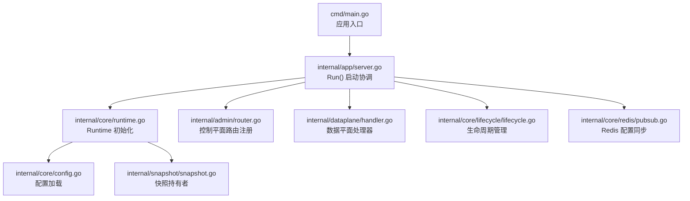
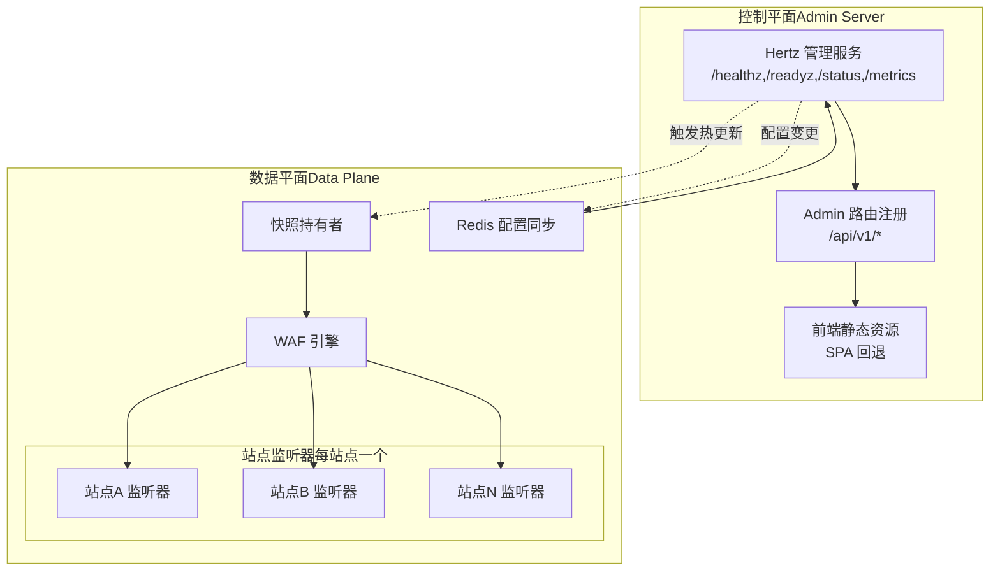
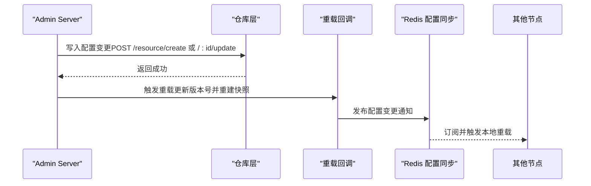
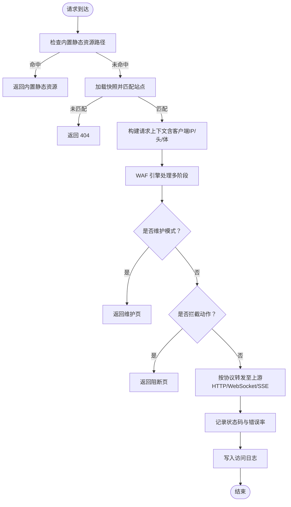
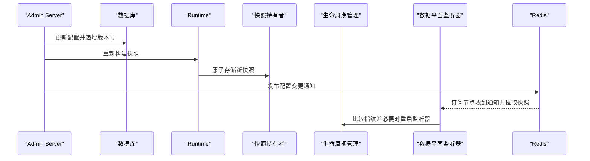
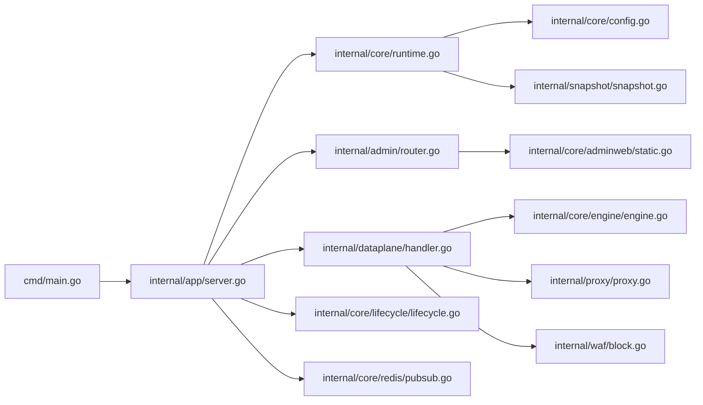

# 双服务器架构详解

<cite>
**本文档引用的文件**
- [main.go](file://cmd/main.go)
- [server.go](file://internal/app/server.go)
- [router.go](file://internal/admin/router.go)
- [handler.go](file://internal/dataplane/handler.go)
- [config.go](file://internal/core/config.go)
- [runtime.go](file://internal/core/runtime.go)
- [snapshot.go](file://internal/snapshot/snapshot.go)
- [lifecycle.go](file://internal/core/lifecycle/lifecycle.go)
- [pubsub.go](file://internal/core/redis/pubsub.go)
- [engine.go](file://internal/core/engine/engine.go)
- [block.go](file://internal/waf/block.go)
- [proxy.go](file://internal/proxy/proxy.go)
- [static.go](file://internal/core/adminweb/static.go)
- [package.json](file://frontend/package.json)
</cite>

## 目录
1. [简介](#简介)
2. [项目结构](#项目结构)
3. [核心组件](#核心组件)
4. [架构总览](#架构总览)
5. [详细组件分析](#详细组件分析)
6. [依赖关系分析](#依赖关系分析)
7. [性能考量](#性能考量)
8. [故障排查指南](#故障排查指南)
9. [结论](#结论)
10. [附录](#附录)

## 简介
本文件面向 My-OpenWaf 的双服务器架构，系统性阐述控制平面（Admin Server）与数据平面（Data Plane）的设计理念、职责分工与协作机制。控制平面负责管理请求处理、配置更新与系统管理；数据平面负责实时流量处理、请求转发与安全防护。两平面通过快照（Snapshot）与 Redis 分布式通知实现配置同步与一致性保障，并以每个站点独立监听器的方式实现热启停与按站点粒度的运维能力。

## 项目结构
应用入口通过命令行启动，随后在运行时初始化核心子系统：数据库、可选 Redis、缓存层、快照持有者等。随后构建控制平面与数据平面服务实例，分别挂载路由与监听器，并通过生命周期管理器统一启动与优雅关闭。

**图示来源**
- [main.go:1-10](file://cmd/main.go#L1-L10)
- [server.go:33-280](file://internal/app/server.go#L33-L280)
- [runtime.go:27-80](file://internal/core/runtime.go#L27-L80)
- [config.go:31-66](file://internal/core/config.go#L31-L66)
- [snapshot.go:98-105](file://internal/snapshot/snapshot.go#L98-L105)
- [router.go:36-137](file://internal/admin/router.go#L36-L137)
- [handler.go:37-257](file://internal/dataplane/handler.go#L37-L257)
- [lifecycle.go:47-178](file://internal/core/lifecycle/lifecycle.go#L47-L178)
- [pubsub.go:21-77](file://internal/core/redis/pubsub.go#L21-L77)

**章节来源**
- [main.go:1-10](file://cmd/main.go#L1-L10)
- [server.go:33-280](file://internal/app/server.go#L33-L280)

## 核心组件
- 运行时环境（Runtime）
  - 负责打开数据库与可选 Redis，初始化缓存层与快照持有者，提供全局配置访问。
- 快照（Snapshot）
  - 不可变的运行时视图，包含站点映射、保护配置、默认阻断页与 SNI 证书等，通过原子指针切换实现热更新。
- 引擎（Engine）
  - 组织 WAF 处理流水线，按阶段执行规则匹配与动作决策，支持观察命中记录与维护模式短路。
- 数据平面处理器（DataPlane Handler）
  - 每个监听器使用统一中间件，负责静态资源、维护模式、WAF 拦截、上游转发与错误率统计。
- 控制平面路由器（Admin Router）
  - 提供认证、站点/证书/策略/规则/设置/事件/仪表盘等管理接口，支持前端静态资源回退。
- 生命周期管理（Lifecycle Manager）
  - 统一管理多个 Hertz 服务器的启动、停止与信号处理，支持按站点指纹检测配置漂移并热重启。
- Redis 配置同步（ConfigSync）
  - 基于 Redis 发布/订阅的分布式配置变更通知，确保多节点一致。

**章节来源**
- [runtime.go:17-80](file://internal/core/runtime.go#L17-L80)
- [snapshot.go:52-105](file://internal/snapshot/snapshot.go#L52-L105)
- [engine.go:15-146](file://internal/core/engine/engine.go#L15-L146)
- [handler.go:26-257](file://internal/dataplane/handler.go#L26-L257)
- [router.go:19-137](file://internal/admin/router.go#L19-L137)
- [lifecycle.go:30-178](file://internal/core/lifecycle/lifecycle.go#L30-L178)
- [pubsub.go:13-77](file://internal/core/redis/pubsub.go#L13-L77)

## 架构总览
My-OpenWaf 将控制平面与数据平面解耦：
- 控制平面（Admin Server）
  - 监听管理端口，提供 REST API 与前端静态资源托管，负责配置变更与系统管理。
- 数据平面（Data Plane）
  - 每个站点绑定地址对应一个独立监听器，共享引擎与快照，实现按站点粒度的启停与热更新。

**图示来源**
- [server.go:245-280](file://internal/app/server.go#L245-L280)
- [router.go:36-137](file://internal/admin/router.go#L36-L137)
- [handler.go:37-257](file://internal/dataplane/handler.go#L37-L257)
- [pubsub.go:33-68](file://internal/core/redis/pubsub.go#L33-L68)

## 详细组件分析

### 控制平面（Admin Server）设计
- 职责
  - 健康检查与状态查询
  - 系统指标导出（Prometheus 兼容）
  - 管理 API：站点、证书、策略、规则、设置、事件、仪表盘、API Key 等
  - 前端静态资源托管与 SPA 回退
- 关键点
  - 使用 Hertz 注册健康与指标端点
  - 通过依赖注入将仓库、重载回调、静态资源目录、JWT 密钥与指标对象传入
  - 所有更新/删除操作采用 POST + 特定后缀语义，简化反向代理与 CORS 配置
  - 前端静态资源通过嵌入或磁盘覆盖两种方式解析，未命中 API 的路径回退到前端页面

**图示来源**
- [router.go:54-137](file://internal/admin/router.go#L54-L137)
- [server.go:203-243](file://internal/app/server.go#L203-L243)
- [pubsub.go:33-68](file://internal/core/redis/pubsub.go#L33-L68)

**章节来源**
- [router.go:19-137](file://internal/admin/router.go#L19-L137)
- [server.go:245-280](file://internal/app/server.go#L245-L280)
- [static.go:10-100](file://internal/core/adminweb/static.go#L10-L100)

### 数据平面（Data Plane）设计
- 职责
  - 静态资源与内部工具页分发
  - 维护模式短路
  - WAF 规则链评估与拦截
  - 上游 HTTP/WebSocket/SSE 转发
  - 错误率统计与访问日志
- 关键点
  - 每个站点绑定地址创建独立监听器，支持 TLS 终止与 SNI 证书
  - 请求进入后从快照中解析站点，提取客户端 IP、头信息、Body（限制大小）等
  - 引擎按阶段执行：IP 名单、ACL、机器人检测、请求速率限制、OWASP 规则、签名与自定义规则
  - 若命中拦截动作，直接返回阻断页；否则根据协议类型选择 HTTP/WebSocket/SSE 转发
  - 支持错误率统计（4xx/5xx），用于后续限流

**图示来源**
- [handler.go:37-257](file://internal/dataplane/handler.go#L37-L257)
- [engine.go:44-106](file://internal/core/engine/engine.go#L44-L106)
- [block.go:16-66](file://internal/waf/block.go#L16-L66)
- [proxy.go:73-135](file://internal/proxy/proxy.go#L73-L135)

**章节来源**
- [handler.go:26-257](file://internal/dataplane/handler.go#L26-L257)
- [engine.go:15-146](file://internal/core/engine/engine.go#L15-L146)
- [block.go:16-110](file://internal/waf/block.go#L16-L110)
- [proxy.go:1-136](file://internal/proxy/proxy.go#L1-L136)

### 配置同步与一致性保障
- 快照驱动
  - 配置变更通过版本号递增与快照重建实现原子切换，数据平面读取时仅需原子指针读取
- 分布式通知
  - 控制平面在重载完成后通过 Redis 发布“reload”消息；其他节点订阅后拉取最新快照并热更新监听器
- 配置漂移检测
  - 为每个站点监听器生成指纹（包含绑定地址、TLS 开关、最小/最大 TLS 版本、ALPN、证书内容等），当指纹变化时触发重启

**图示来源**
- [server.go:203-243](file://internal/app/server.go#L203-L243)
- [runtime.go:82-99](file://internal/core/runtime.go#L82-L99)
- [lifecycle.go:133-201](file://internal/app/server.go#L133-L201)
- [pubsub.go:33-68](file://internal/core/redis/pubsub.go#L33-L68)

**章节来源**
- [server.go:203-243](file://internal/app/server.go#L203-L243)
- [runtime.go:82-99](file://internal/core/runtime.go#L82-L99)
- [lifecycle.go:133-201](file://internal/app/server.go#L133-L201)
- [pubsub.go:13-77](file://internal/core/redis/pubsub.go#L13-L77)

### 站点级监听器与热启停
- 每个启用且配置有效的站点都会创建独立监听器实例，名称包含站点 ID 与绑定地址
- 通过指纹比较检测配置漂移（如绑定地址、TLS 开关、证书变更），自动移除旧监听器并启动新的
- 支持按站点启停，便于灰度与故障隔离

**章节来源**
- [server.go:133-201](file://internal/app/server.go#L133-L201)
- [server.go:282-308](file://internal/app/server.go#L282-L308)
- [server.go:434-457](file://internal/app/server.go#L434-L457)

## 依赖关系分析

**图示来源**
- [main.go:1-10](file://cmd/main.go#L1-L10)
- [server.go:33-280](file://internal/app/server.go#L33-L280)
- [runtime.go:17-80](file://internal/core/runtime.go#L17-L80)
- [config.go:10-66](file://internal/core/config.go#L10-L66)
- [snapshot.go:52-105](file://internal/snapshot/snapshot.go#L52-L105)
- [router.go:19-137](file://internal/admin/router.go#L19-L137)
- [handler.go:26-257](file://internal/dataplane/handler.go#L26-L257)
- [engine.go:15-146](file://internal/core/engine/engine.go#L15-L146)
- [proxy.go:1-136](file://internal/proxy/proxy.go#L1-L136)
- [block.go:16-110](file://internal/waf/block.go#L16-L110)
- [lifecycle.go:30-178](file://internal/core/lifecycle/lifecycle.go#L30-L178)
- [pubsub.go:13-77](file://internal/core/redis/pubsub.go#L13-L77)
- [static.go:10-100](file://internal/core/adminweb/static.go#L10-L100)

**章节来源**
- [main.go:1-10](file://cmd/main.go#L1-L10)
- [server.go:33-280](file://internal/app/server.go#L33-L280)

## 性能考量
- 快照不可变与原子切换
  - 降低数据平面读路径的锁竞争，提升并发性能
- 请求上下文池化
  - 减少 GC 压力，提高吞吐
- 上游连接复用
  - 基于 TLS 配置的传输池，减少连接建立开销
- 限流与错误率统计
  - 在响应后进行错误率统计，避免影响请求路径延迟
- 按站点监听器
  - 将负载隔离到不同监听器，便于水平扩展与资源配额控制

[本节为通用性能讨论，不直接分析具体文件]

## 故障排查指南
- 控制平面
  - 健康检查失败：确认数据库与 Redis 可达性，检查 AdminBind 配置
  - API 返回 404：确认路由前缀与静态资源回退逻辑
- 数据平面
  - 503：快照未加载或站点未匹配，检查配置与重载流程
  - 404：站点未匹配，检查 Host 与绑定地址
  - 502：上游未配置或上游错误，检查站点上游配置与网络连通性
- 配置同步
  - 多节点不一致：检查 Redis 是否可用，确认发布/订阅通道是否正常
- 日志与指标
  - 启用详细日志，结合 X-Request-ID 定位问题；通过 Prometheus 指标观察 QPS、错误率与拦截数

**章节来源**
- [router.go:41-41](file://internal/admin/router.go#L41-L41)
- [handler.go:56-59](file://internal/dataplane/handler.go#L56-L59)
- [handler.go:202-205](file://internal/dataplane/handler.go#L202-L205)
- [pubsub.go:33-68](file://internal/core/redis/pubsub.go#L33-L68)

## 结论
My-OpenWaf 的双服务器架构通过控制平面与数据平面的清晰分离，实现了管理与防护的高内聚低耦合。控制平面专注配置与可观测性，数据平面专注高性能实时处理。快照与 Redis 同步机制确保了配置变更的一致性与可追溯性；按站点监听器的设计提升了可扩展性与可维护性。整体架构在性能、可靠性与运维效率之间取得了良好平衡。

[本节为总结性内容，不直接分析具体文件]

## 附录

### 部署配置示例
- 环境变量（示例）
  - MY_OPENWAF_DB_DRIVER=sqlite
  - MY_OPENWAF_DB=数据库路径或完整 DSN
  - MY_OPENWAF_DATA=./data
  - MY_OPENWAF_REDIS_ADDR=redis 地址
  - MY_OPENWAF_REDIS_PASSWORD=密码
  - MY_OPENWAF_REDIS_DB=数据库编号
  - MY_OPENWAF_ADMIN_BIND=:9443
  - MY_OPENWAF_ADMIN_STATIC_DIR=前端静态目录（开发时）
- 管理端口
  - Admin Server 监听 AdminBind，提供 /healthz、/readyz、/status、/metrics
- 数据监听
  - 每个站点绑定地址创建独立监听器，支持 TLS 终止与 SNI 证书

**章节来源**
- [config.go:31-66](file://internal/core/config.go#L31-L66)
- [server.go:245-280](file://internal/app/server.go#L245-L280)

### 故障转移策略
- 多节点部署
  - 通过 Redis 配置同步实现多节点热备，任一节点故障不影响整体服务能力
- 监听器热重启
  - 配置漂移自动触发监听器重启，避免手动干预
- 优雅关闭
  - 生命周期管理器统一处理信号，确保在关闭期间完成正在处理的请求

**章节来源**
- [pubsub.go:33-68](file://internal/core/redis/pubsub.go#L33-L68)
- [lifecycle.go:102-178](file://internal/core/lifecycle/lifecycle.go#L102-L178)
- [server.go:133-201](file://internal/app/server.go#L133-L201)