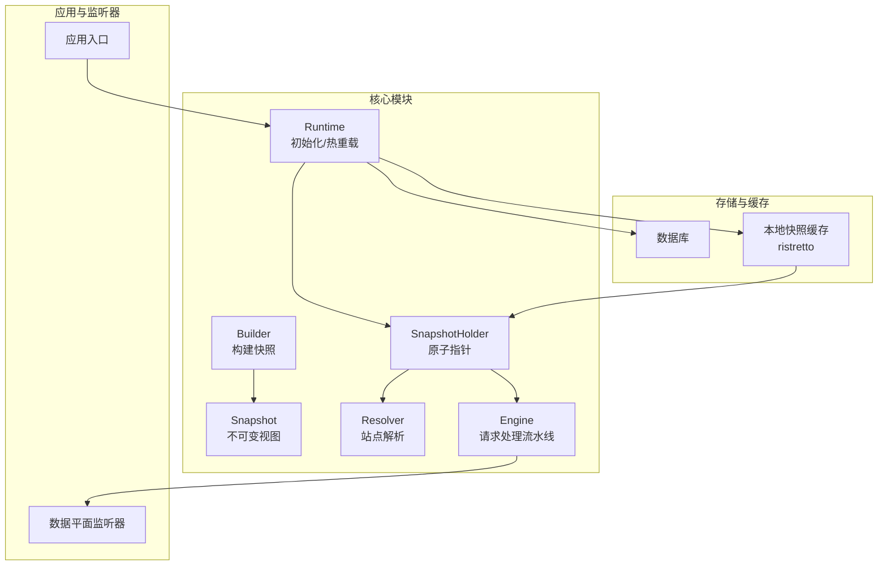
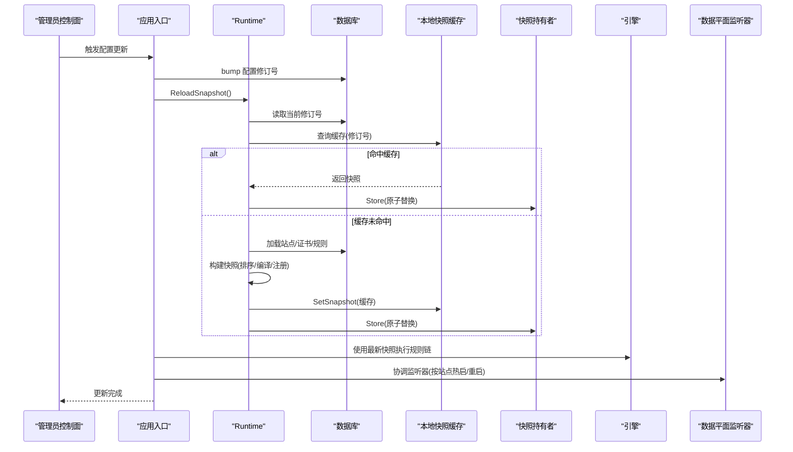
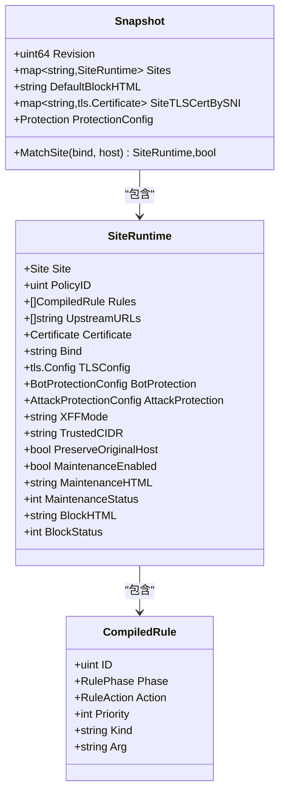
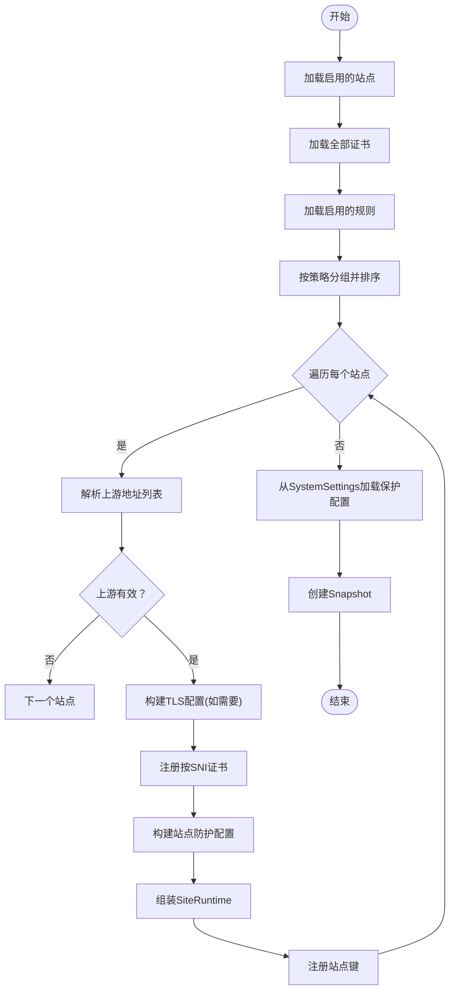
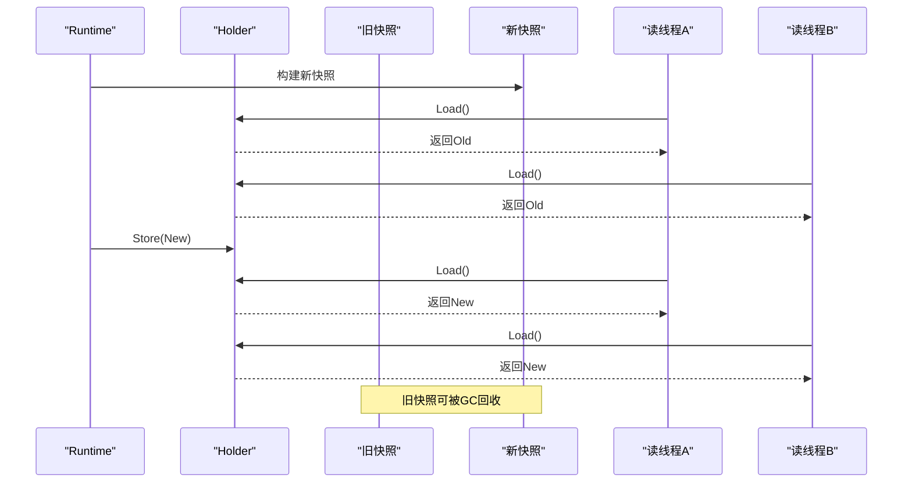
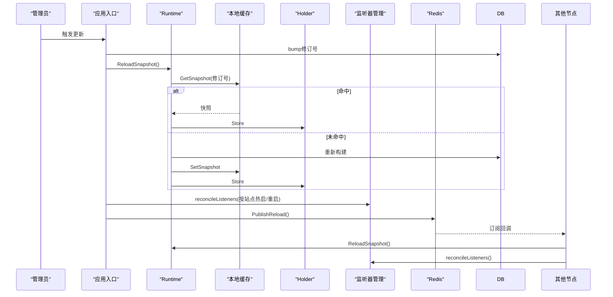
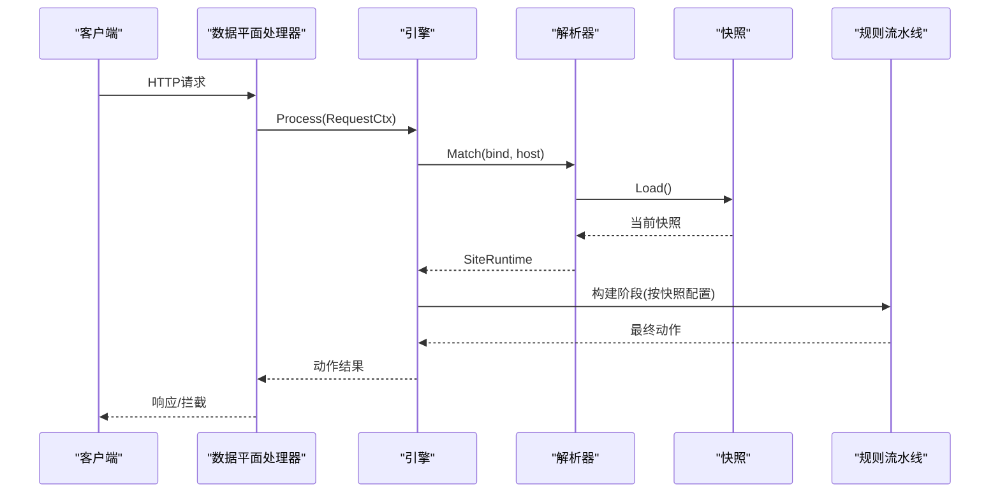
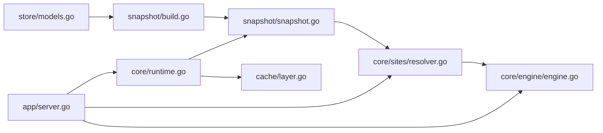

# 快照模式实现

<cite>
**本文引用的文件**
- [internal/snapshot/snapshot.go](file://internal/snapshot/snapshot.go)
- [internal/snapshot/build.go](file://internal/snapshot/build.go)
- [internal/core/runtime.go](file://internal/core/runtime.go)
- [internal/core/engine/engine.go](file://internal/core/engine/engine.go)
- [internal/core/sites/resolver.go](file://internal/core/sites/resolver.go)
- [internal/app/server.go](file://internal/app/server.go)
- [internal/store/models.go](file://internal/store/models.go)
- [internal/cache/layer.go](file://internal/cache/layer.go)
- [internal/core/config.go](file://internal/core/config.go)
- [internal/core/config_validate.go](file://internal/core/config_validate.go)
- [cmd/main.go](file://cmd/main.go)
</cite>

## 目录
1. [引言](#引言)
2. [项目结构](#项目结构)
3. [核心组件](#核心组件)
4. [架构总览](#架构总览)
5. [详细组件分析](#详细组件分析)
6. [依赖分析](#依赖分析)
7. [性能考量](#性能考量)
8. [故障排查指南](#故障排查指南)
9. [结论](#结论)
10. [附录](#附录)

## 引言
本文件面向 My-OpenWaf 的“快照模式”，系统性阐述其不可变配置快照的设计原理、实现机制与优势；重点解析基于原子指针切换（CAS）的线程安全与零停机更新；深入分析快照构建过程中的配置验证、规则编译、资源分配与一致性检查；说明热重载机制如何在不中断服务的前提下完成新旧配置切换；并给出快照生命周期管理、内存优化策略与性能考量，以及高并发场景下的表现与实践建议。

## 项目结构
My-OpenWaf 将“配置快照”作为数据平面（dataplane）的只读视图，通过不可变对象与原子指针实现零停机热重载。核心目录与职责如下：
- internal/snapshot：定义不可变快照类型、站点运行时视图与构建器
- internal/core：运行时初始化、快照热重载、引擎集成
- internal/store：数据库模型与保护配置结构
- internal/cache：进程内快照缓存层（基于 ristretto）
- internal/app：应用入口与监听器协调、分布式配置同步
- internal/core/engine：请求处理流水线，按快照执行规则链
- internal/core/sites：基于快照的站点解析器

图表来源
- [internal/core/runtime.go:82-99](file://internal/core/runtime.go#L82-L99)
- [internal/snapshot/build.go:14-143](file://internal/snapshot/build.go#L14-L143)
- [internal/snapshot/snapshot.go:98-105](file://internal/snapshot/snapshot.go#L98-L105)
- [internal/core/sites/resolver.go:18-31](file://internal/core/sites/resolver.go#L18-L31)
- [internal/core/engine/engine.go:26-36](file://internal/core/engine/engine.go#L26-L36)
- [internal/app/server.go:215-255](file://internal/app/server.go#L215-L255)

章节来源
- [cmd/main.go:7-9](file://cmd/main.go#L7-L9)
- [internal/app/server.go:35-300](file://internal/app/server.go#L35-L300)

## 核心组件
- 不可变快照 Snapshot：包含站点映射、默认拦截页、按 SNI 注册的证书映射、全局保护配置等，用于数据平面只读访问
- 站点运行时 SiteRuntime：将数据库模型转换为轻量运行时视图，包含规则、上游地址、TLS 配置、防护参数等
- 快照构建器 Builder：从数据库加载启用的站点、证书、规则，排序与编译规则，组装快照
- 快照持有者 Holder：使用原子指针保存当前快照，支持安全的 Store/Load 操作
- 运行时 Runtime：负责数据库连接、可选 Redis、缓存层初始化，并提供 ReloadSnapshot 接口
- 引擎 Engine：基于快照进行站点解析与规则链执行
- 解析器 Resolver：从 Holder 中读取快照，匹配站点
- 应用入口与监听器协调：触发热重载、重建监听器、跨节点通知

章节来源
- [internal/snapshot/snapshot.go:11-105](file://internal/snapshot/snapshot.go#L11-L105)
- [internal/snapshot/build.go:14-143](file://internal/snapshot/build.go#L14-L143)
- [internal/core/runtime.go:17-99](file://internal/core/runtime.go#L17-L99)
- [internal/core/engine/engine.go:15-36](file://internal/core/engine/engine.go#L15-L36)
- [internal/core/sites/resolver.go:7-31](file://internal/core/sites/resolver.go#L7-L31)
- [internal/app/server.go:145-255](file://internal/app/server.go#L145-L255)

## 架构总览
快照模式的核心思想是“构建新版本、原子替换旧版本”。应用启动后首次构建快照并存入 Holder；后续通过 bump 配置修订号、重新构建、缓存与原子替换，实现零停机热重载。同时，进程内快照缓存避免重复构建；跨节点通过 Redis 发布订阅触发统一的 DB 重载。

图表来源
- [internal/app/server.go:215-255](file://internal/app/server.go#L215-L255)
- [internal/core/runtime.go:82-99](file://internal/core/runtime.go#L82-L99)
- [internal/cache/layer.go:40-64](file://internal/cache/layer.go#L40-L64)
- [internal/snapshot/build.go:14-143](file://internal/snapshot/build.go#L14-L143)

## 详细组件分析

### 不可变快照与站点运行时
- Snapshot：包含站点映射、默认拦截页、按 SNI 的证书映射、全局保护配置
- SiteRuntime：将数据库模型转换为运行时视图，包含规则数组、上游地址、TLS 配置、防护参数、转发设置、维护与拦截页配置
- 匹配逻辑：先精确匹配，再通配符匹配，最后按绑定地址回退

图表来源
- [internal/snapshot/snapshot.go:52-96](file://internal/snapshot/snapshot.go#L52-L96)
- [internal/store/models.go:78-147](file://internal/store/models.go#L78-L147)

章节来源
- [internal/snapshot/snapshot.go:11-105](file://internal/snapshot/snapshot.go#L11-L105)
- [internal/store/models.go:78-147](file://internal/store/models.go#L78-L147)

### 快照构建器：验证、编译与一致性
- 数据加载：查询启用的站点、所有证书、启用的规则，并按策略分组
- 规则排序：优先按优先级升序，其次按 ID 升序
- 规则编译：解析 DSL 形式的 Pattern，生成轻量规则对象
- TLS 处理：根据站点证书生成 tls.Config，并注册按 SNI 的证书键
- 保护配置：从 SystemSettings 中加载全局保护配置
- 一致性检查：站点上游地址非空才纳入；证书存在才注册；规则按策略与优先级组织

图表来源
- [internal/snapshot/build.go:14-143](file://internal/snapshot/build.go#L14-L143)
- [internal/store/models.go:149-317](file://internal/store/models.go#L149-L317)

章节来源
- [internal/snapshot/build.go:14-143](file://internal/snapshot/build.go#L14-L143)
- [internal/store/models.go:149-317](file://internal/store/models.go#L149-L317)

### 原子指针切换与线程安全
- 快照持有者 Holder 使用原子指针保存 Snapshot 指针
- 读路径：Resolver/Engine 通过 Load 获取当前快照，无需锁
- 写路径：Runtime 在构建完成后 Store 新快照，旧快照由 GC 回收
- CAS 语义：保证切换期间读操作不会看到部分写入的中间状态
- 零停机：切换瞬间完成，无请求等待或阻塞

图表来源
- [internal/snapshot/snapshot.go:98-105](file://internal/snapshot/snapshot.go#L98-L105)
- [internal/core/sites/resolver.go:28-31](file://internal/core/sites/resolver.go#L28-L31)
- [internal/core/engine/engine.go:56-61](file://internal/core/engine/engine.go#L56-L61)

章节来源
- [internal/snapshot/snapshot.go:98-105](file://internal/snapshot/snapshot.go#L98-L105)
- [internal/core/sites/resolver.go:28-31](file://internal/core/sites/resolver.go#L28-L31)
- [internal/core/engine/engine.go:56-61](file://internal/core/engine/engine.go#L56-L61)

### 热重载机制：监听器协调与跨节点同步
- 修订号驱动：每次更新前 bump 配置修订号，触发重建
- 本地缓存命中：若同一修订号已构建过快照，直接复用
- 原子替换：构建完成后写入缓存并 Store 到 Holder
- 监听器协调：按站点维度重建监听器，检测配置漂移（绑定、TLS、证书变更）并热重启受影响实例
- 跨节点同步：通过 Redis 发布订阅通知其他节点，各自从 DB 重载并应用

图表来源
- [internal/app/server.go:215-255](file://internal/app/server.go#L215-L255)
- [internal/cache/layer.go:40-64](file://internal/cache/layer.go#L40-L64)
- [internal/core/runtime.go:82-99](file://internal/core/runtime.go#L82-L99)

章节来源
- [internal/app/server.go:145-255](file://internal/app/server.go#L145-L255)
- [internal/cache/layer.go:40-64](file://internal/cache/layer.go#L40-L64)
- [internal/core/runtime.go:82-99](file://internal/core/runtime.go#L82-L99)

### 请求处理流水线与站点解析
- 引擎在每次请求中获取当前快照，解析站点，执行多阶段规则链（IP信誉、ACL、机器人检测、速率限制、OWASP、CVE、签名、自定义）
- 维护模式与站点拦截页：若开启维护或站点拦截页，则直接返回拦截动作
- 规则编译：将快照中的规则转换为内部可执行形式

图表来源
- [internal/core/engine/engine.go:56-128](file://internal/core/engine/engine.go#L56-L128)
- [internal/core/sites/resolver.go:18-31](file://internal/core/sites/resolver.go#L18-L31)

章节来源
- [internal/core/engine/engine.go:56-128](file://internal/core/engine/engine.go#L56-L128)
- [internal/core/sites/resolver.go:18-31](file://internal/core/sites/resolver.go#L18-L31)

## 依赖分析
- 快照模块依赖存储模型（Site、Rule、SystemSettings 等），用于构建运行时视图与保护配置
- 运行时模块依赖数据库与可选 Redis，负责快照构建与缓存
- 引擎与解析器依赖快照持有者，实现无锁读取
- 应用入口协调监听器与跨节点同步，确保配置变更传播一致

图表来源
- [internal/store/models.go:78-317](file://internal/store/models.go#L78-L317)
- [internal/snapshot/build.go:14-143](file://internal/snapshot/build.go#L14-L143)
- [internal/snapshot/snapshot.go:52-96](file://internal/snapshot/snapshot.go#L52-L96)
- [internal/core/sites/resolver.go:18-31](file://internal/core/sites/resolver.go#L18-L31)
- [internal/core/engine/engine.go:26-36](file://internal/core/engine/engine.go#L26-L36)
- [internal/core/runtime.go:82-99](file://internal/core/runtime.go#L82-L99)
- [internal/cache/layer.go:40-64](file://internal/cache/layer.go#L40-L64)
- [internal/app/server.go:145-255](file://internal/app/server.go#L145-L255)

章节来源
- [internal/store/models.go:78-317](file://internal/store/models.go#L78-L317)
- [internal/snapshot/build.go:14-143](file://internal/snapshot/build.go#L14-L143)
- [internal/snapshot/snapshot.go:52-96](file://internal/snapshot/snapshot.go#L52-L96)
- [internal/core/sites/resolver.go:18-31](file://internal/core/sites/resolver.go#L18-L31)
- [internal/core/engine/engine.go:26-36](file://internal/core/engine/engine.go#L26-L36)
- [internal/core/runtime.go:82-99](file://internal/core/runtime.go#L82-L99)
- [internal/cache/layer.go:40-64](file://internal/cache/layer.go#L40-L64)
- [internal/app/server.go:145-255](file://internal/app/server.go#L145-L255)

## 性能考量
- 读路径无锁：Holder 使用原子指针，读取开销极低
- 规则编译一次：快照构建时完成规则解析与排序，运行时仅执行编译后的规则
- 本地缓存：进程内 ristretto 缓存快照，减少重复构建与数据库压力
- 监听器按站点热启：仅重启受影响实例，降低停机窗口
- 跨节点同步：通过发布订阅触发 DB 重载，避免共享序列化快照带来的网络与反序列化成本
- TLS 证书预注册：按 SNI 注册证书，加速握手匹配

章节来源
- [internal/cache/layer.go:22-38](file://internal/cache/layer.go#L22-L38)
- [internal/snapshot/build.go:49-76](file://internal/snapshot/build.go#L49-L76)
- [internal/app/server.go:145-213](file://internal/app/server.go#L145-L213)

## 故障排查指南
- 配置校验失败：检查数据库驱动、DSN、管理端口与 Redis 地址格式
- 快照构建错误：确认站点启用状态、证书存在性、规则有效性与策略关联
- 热重载未生效：确认修订号是否 bump、本地缓存是否命中、Holder 是否成功 Store
- 监听器未重启：检查站点指纹计算与配置漂移检测逻辑
- 跨节点不同步：确认 Redis 订阅是否正常、发布消息是否可达

章节来源
- [internal/core/config_validate.go:9-47](file://internal/core/config_validate.go#L9-L47)
- [internal/core/runtime.go:82-99](file://internal/core/runtime.go#L82-L99)
- [internal/app/server.go:215-255](file://internal/app/server.go#L215-L255)

## 结论
快照模式通过不可变对象与原子指针实现了配置更新的线程安全与零停机切换；结合本地缓存与按站点监听器热启，显著降低了更新对在线服务的影响。该设计在高并发场景下具备良好的可扩展性与稳定性，适合生产环境的持续演进与快速迭代。

## 附录
- 配置更新流程图已在前述章节中以序列图与流程图形式呈现
- 代码示例路径（不含具体代码内容）：
  - 快照构建：[internal/snapshot/build.go:14-143](file://internal/snapshot/build.go#L14-L143)
  - 快照持有者与原子切换：[internal/snapshot/snapshot.go:98-105](file://internal/snapshot/snapshot.go#L98-L105)
  - 运行时热重载：[internal/core/runtime.go:82-99](file://internal/core/runtime.go#L82-L99)
  - 引擎请求处理：[internal/core/engine/engine.go:56-128](file://internal/core/engine/engine.go#L56-L128)
  - 监听器协调与跨节点同步：[internal/app/server.go:145-255](file://internal/app/server.go#L145-L255)
  - 存储模型与保护配置：[internal/store/models.go:78-317](file://internal/store/models.go#L78-L317)
  - 本地快照缓存：[internal/cache/layer.go:40-64](file://internal/cache/layer.go#L40-L64)
  - 启动入口：[cmd/main.go:7-9](file://cmd/main.go#L7-L9)