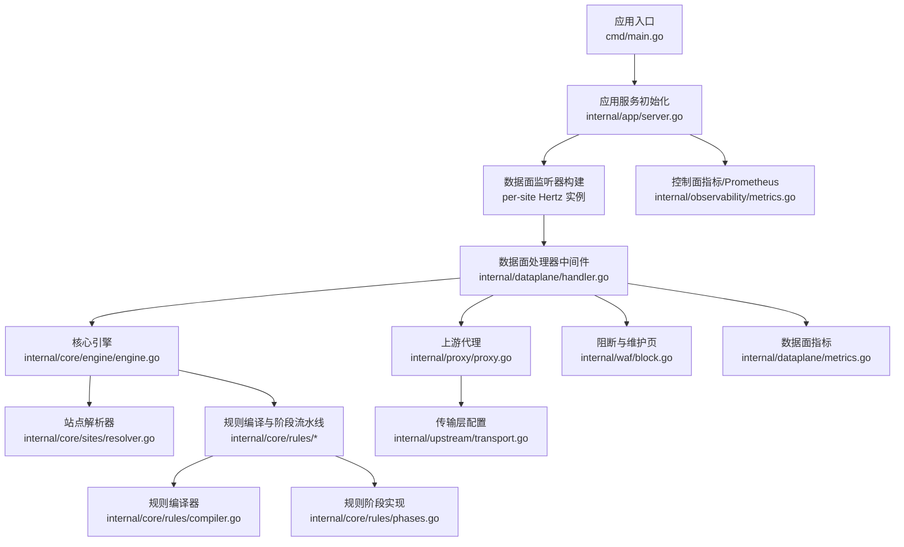
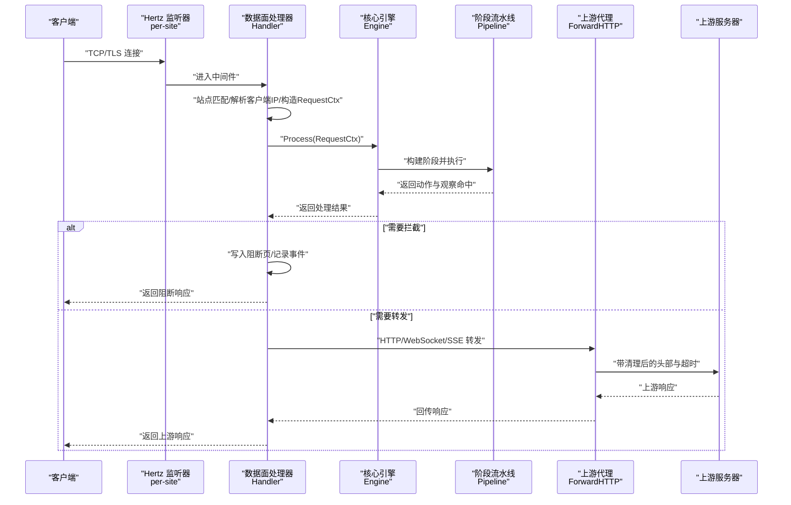
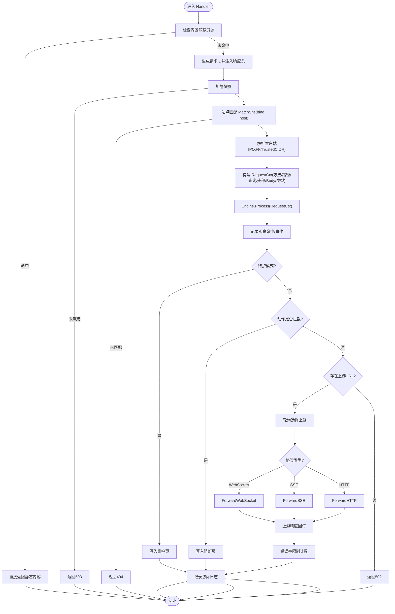
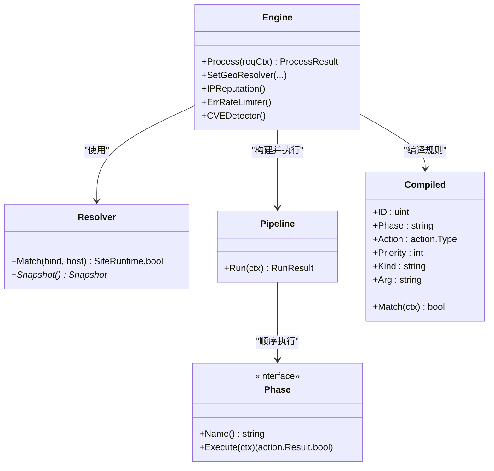
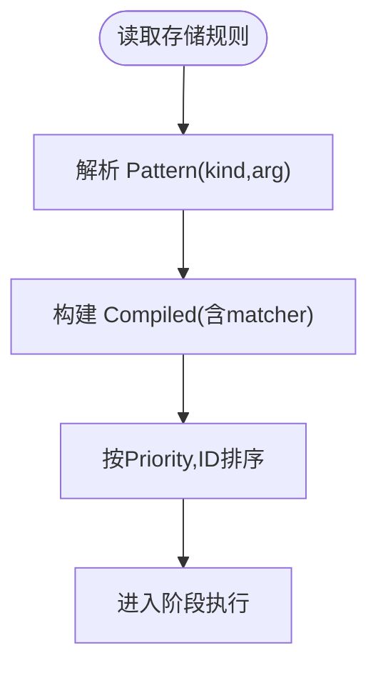
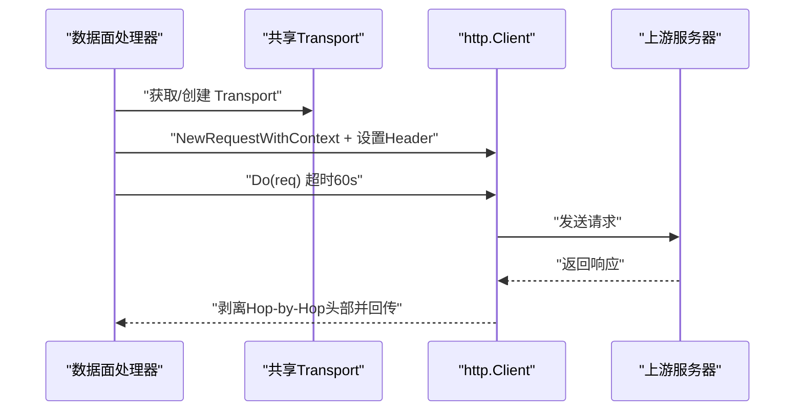
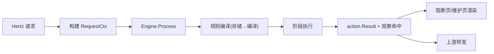
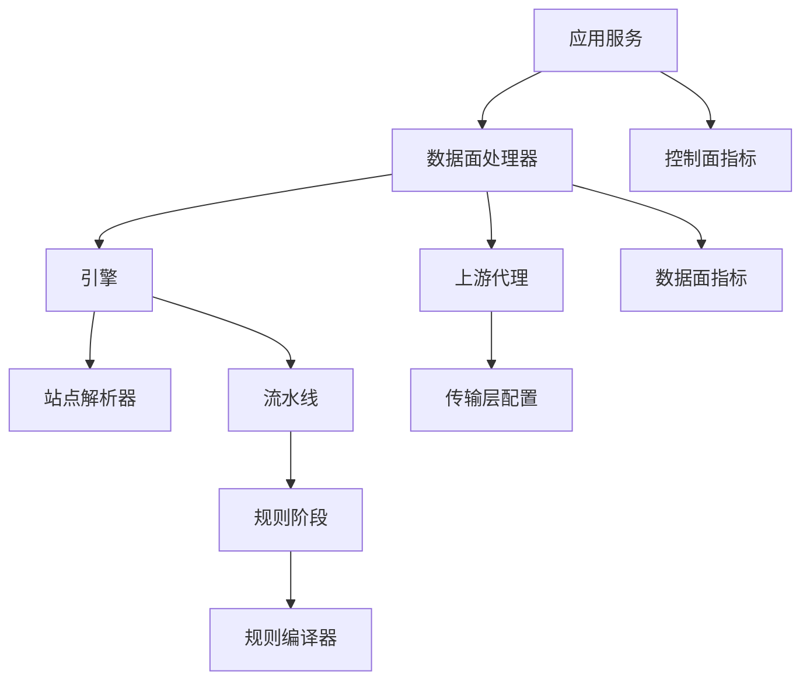

# 数据流分析

<cite>
**本文引用的文件**
- [cmd/main.go](file://cmd/main.go)
- [internal/app/server.go](file://internal/app/server.go)
- [internal/dataplane/handler.go](file://internal/dataplane/handler.go)
- [internal/core/engine/engine.go](file://internal/core/engine/engine.go)
- [internal/core/pipeline/pipeline.go](file://internal/core/pipeline/pipeline.go)
- [internal/core/sites/resolver.go](file://internal/core/sites/resolver.go)
- [internal/core/rule/phases.go](file://internal/core/rules/phases.go)
- [internal/core/rules/compiler.go](file://internal/core/rules/compiler.go)
- [internal/snapshot/snapshot.go](file://internal/snapshot/snapshot.go)
- [internal/proxy/proxy.go](file://internal/proxy/proxy.go)
- [internal/upstream/transport.go](file://internal/upstream/transport.go)
- [internal/waf/eval.go](file://internal/waf/eval.go)
- [internal/waf/block.go](file://internal/waf/block.go)
- [internal/dataplane/metrics.go](file://internal/dataplane/metrics.go)
- [internal/observability/metrics.go](file://internal/observability/metrics.go)
</cite>

## 目录
1. [引言](#引言)
2. [项目结构](#项目结构)
3. [核心组件](#核心组件)
4. [架构总览](#架构总览)
5. [详细组件分析](#详细组件分析)
6. [依赖分析](#依赖分析)
7. [性能考量](#性能考量)
8. [故障排查指南](#故障排查指南)
9. [结论](#结论)
10. [附录](#附录)

## 引言
本文件面向 My-OpenWaf 的数据流与处理链路，从客户端请求进入系统到最终响应返回的完整路径进行深入剖析。重点覆盖以下方面：
- 请求解析与上下文构建：从原始 Hertz 请求到内部 RequestCtx 的转换流程与限制。
- 站点匹配与路由：基于监听绑定地址与 Host 的站点解析策略。
- 规则执行与阶段流水线：各阶段（ACL、IP信誉、Bot检测、速率限制、OWASP、CVE、签名与自定义）的顺序与短路行为。
- 上游代理与响应回传：HTTP/WebSocket/SSE 的转发与头部处理。
- 关键数据结构转换：规则编译、匹配器构建、观察命中与拦截结果生成。
- 性能瓶颈与优化建议：连接池、内存压力、扫描范围控制等。
- 调试技巧与监控指标：访问日志、请求ID、指标采集与可视化。

## 项目结构
My-OpenWaf 采用分层与职责分离的设计：
- 应用入口与生命周期管理：应用启动、监听器热启停、配置同步与重载。
- 数据面处理器：Hertz 中间件，负责站点匹配、WAF 执行、拦截与转发。
- 核心引擎与规则系统：规则编译、阶段流水线、匹配执行。
- 上游代理：HTTP/WebSocket/SSE 转发与传输层配置。
- 安全与防护：Bot 检测、IP 信誉、速率限制、维护模式与阻断页渲染。
- 可观测性：数据面与控制面指标、事件写入与归档。

**图表来源**
- [cmd/main.go:1-10](file://cmd/main.go#L1-L10)
- [internal/app/server.go:35-300](file://internal/app/server.go#L35-L300)
- [internal/dataplane/handler.go:36-257](file://internal/dataplane/handler.go#L36-L257)
- [internal/core/engine/engine.go:15-128](file://internal/core/engine/engine.go#L15-L128)
- [internal/core/rules/compiler.go:27-55](file://internal/core/rules/compiler.go#L27-L55)
- [internal/core/rules/phases.go:32-298](file://internal/core/rules/phases.go#L32-L298)
- [internal/proxy/proxy.go:73-135](file://internal/proxy/proxy.go#L73-L135)
- [internal/upstream/transport.go:12-28](file://internal/upstream/transport.go#L12-L28)
- [internal/waf/block.go:16-66](file://internal/waf/block.go#L16-L66)
- [internal/dataplane/metrics.go:9-136](file://internal/dataplane/metrics.go#L9-L136)
- [internal/observability/metrics.go:13-126](file://internal/observability/metrics.go#L13-L126)

**章节来源**
- [cmd/main.go:1-10](file://cmd/main.go#L1-L10)
- [internal/app/server.go:35-300](file://internal/app/server.go#L35-L300)

## 核心组件
- 应用运行时与监听器管理：负责初始化运行时、数据库迁移、种子凭据、快照加载、安全事件写入与归档、指标收集、Redis 配置同步、以及 per-site Hertz 监听器的创建与热启停。
- 数据面处理器：接收 Hertz 请求，解析站点，构建 RequestCtx，调用引擎执行规则，根据结果决定拦截或转发，并记录访问日志与指标。
- 核心引擎：按保护配置组装阶段流水线，执行并汇总结果；支持 IP 信誉、Bot 检测、速率限制、OWASP、CVE、签名与自定义规则。
- 规则系统：将存储层规则转换为编译后的规则对象，构建匹配器，按优先级排序，逐阶段执行。
- 上游代理：HTTP/WebSocket/SSE 转发，复用传输层连接池，剥离 Hop-by-Hop 头部，设置超时。
- 安全与阻断：维护模式与阻断页模板渲染，支持站点级与全局级配置。
- 指标与可观测性：数据面 QPS、状态码分布、WAF 命中统计与唯一IP/攻击IP计数；控制面 Prometheus 文本导出。

**章节来源**
- [internal/app/server.go:35-300](file://internal/app/server.go#L35-L300)
- [internal/dataplane/handler.go:36-257](file://internal/dataplane/handler.go#L36-L257)
- [internal/core/engine/engine.go:15-128](file://internal/core/engine/engine.go#L15-L128)
- [internal/core/rules/compiler.go:27-55](file://internal/core/rules/compiler.go#L27-L55)
- [internal/proxy/proxy.go:73-135](file://internal/proxy/proxy.go#L73-L135)
- [internal/waf/block.go:16-66](file://internal/waf/block.go#L16-L66)
- [internal/dataplane/metrics.go:9-136](file://internal/dataplane/metrics.go#L9-L136)
- [internal/observability/metrics.go:13-126](file://internal/observability/metrics.go#L13-L126)

## 架构总览
下图展示从客户端请求到上游服务器的端到端数据流，以及关键组件之间的交互。

**图表来源**
- [internal/dataplane/handler.go:36-257](file://internal/dataplane/handler.go#L36-L257)
- [internal/core/engine/engine.go:56-128](file://internal/core/engine/engine.go#L56-L128)
- [internal/core/pipeline/pipeline.go:46-65](file://internal/core/pipeline/pipeline.go#L46-L65)
- [internal/proxy/proxy.go:73-135](file://internal/proxy/proxy.go#L73-L135)

## 详细组件分析

### 数据面处理器：请求解析与站点匹配
- 静态资源分流：优先检查是否命中内置静态路径，命中则直接返回。
- 请求ID注入：为每条请求生成 UUID 并写入响应头与日志。
- 站点匹配：使用 Snapshot 的 MatchSite 方法，按 bind+host 精确匹配，随后尝试通配符域名，最后回退到同 bind 的任意站点。
- 客户端IP解析：依据站点 XFF 模式与受信CIDR解析真实来源IP，并记录数据面指标。
- RequestCtx 构建：从 Hertz 请求抽取方法、路径、查询串、Host、所有头部；限制 Body 扫描大小以避免内存滥用；记录 Content-Type。
- 引擎执行：调用 Engine.Process，得到动作与观察命中列表。
- 维护模式与拦截：若处于维护模式或动作为终端（拦截），则写入维护页或阻断页并记录事件。
- 上游转发：若未拦截且存在上游URL，则轮询选择上游，分别处理 WebSocket、SSE 与普通 HTTP；转发前应用出站头部修正（可保留原始Host等）。
- 错误率限制：对响应状态码进行分类统计，结合客户端IP与Host维度进行错误率计数。
- 访问日志：记录方法、路径、Host、状态码与WAF动作。

**图表来源**
- [internal/dataplane/handler.go:36-257](file://internal/dataplane/handler.go#L36-L257)

**章节来源**
- [internal/dataplane/handler.go:36-257](file://internal/dataplane/handler.go#L36-L257)

### 核心引擎与阶段流水线
- 引擎职责：维护站点解析器、IP信誉、请求/错误速率限制器、GeoIP 解析器（用于Bot两阶段评分）、CVE 检测器；按保护配置动态组装阶段。
- 阶段顺序（典型）：IP信誉 → ACL → Bot检测 → 请求速率限制 → OWASP → CVE → 签名 → 自定义。
- 执行语义：阶段返回动作，拦截动作立即短路；观察命中仅用于记录，不终止后续阶段。
- 规则编译：将存储层规则转换为编译后规则，解析 DSL 形式的 Pattern，构建匹配器，按优先级与ID排序。

**图表来源**
- [internal/core/engine/engine.go:15-128](file://internal/core/engine/engine.go#L15-L128)
- [internal/core/sites/resolver.go:18-31](file://internal/core/sites/resolver.go#L18-L31)
- [internal/core/pipeline/pipeline.go:25-65](file://internal/core/pipeline/pipeline.go#L25-L65)
- [internal/core/rules/compiler.go:11-55](file://internal/core/rules/compiler.go#L11-L55)

**章节来源**
- [internal/core/engine/engine.go:15-128](file://internal/core/engine/engine.go#L15-L128)
- [internal/core/pipeline/pipeline.go:9-66](file://internal/core/pipeline/pipeline.go#L9-L66)
- [internal/core/sites/resolver.go:18-31](file://internal/core/sites/resolver.go#L18-L31)
- [internal/core/rules/compiler.go:27-55](file://internal/core/rules/compiler.go#L27-L55)

### 规则编译与匹配
- 编译流程：遍历存储规则，解析 Pattern（支持复合条件 JSON），构建 Compiled 对象，包含 Kind、Arg、Action、Priority 等；按 Priority 与 ID 排序。
- 匹配器：Compiled 内部持有预构建的 Matcher，执行时仅需传入上下文（客户端IP、方法、路径、查询、头部）。
- 典型匹配场景：ACL（CIDR/IP 白黑名单）、路径前缀/精确匹配、查询包含、头部匹配、方法/内容类型匹配、复合条件等。

**图表来源**
- [internal/core/rules/compiler.go:27-55](file://internal/core/rules/compiler.go#L27-L55)

**章节来源**
- [internal/core/rules/compiler.go:27-55](file://internal/core/rules/compiler.go#L27-L55)

### 上游代理与网络协议
- 传输层复用：按 TLS 配置（SNI、跳过校验、最小版本）缓存与复用 http.Transport，减少连接开销。
- HTTP 转发：构造标准 http.Request，过滤掉 Hop-by-Hop 头部，应用出站头部修正（如保留原始Host），设置超时，回传响应。
- WebSocket/SSE：分别通过专用转发函数处理，保持协议特性。
- 协议栈：底层基于 Go http.Client/Transport，支持 HTTP/2；TLS 配置由站点上游配置决定。

**图表来源**
- [internal/proxy/proxy.go:32-135](file://internal/proxy/proxy.go#L32-L135)
- [internal/upstream/transport.go:12-28](file://internal/upstream/transport.go#L12-L28)

**章节来源**
- [internal/proxy/proxy.go:32-135](file://internal/proxy/proxy.go#L32-L135)
- [internal/upstream/transport.go:12-28](file://internal/upstream/transport.go#L12-L28)

### 关键数据结构转换
- 原始请求到 RequestCtx：Hertz 请求字段映射到内部上下文，限制 Body 大小，提取 Content-Type 与头部集合。
- 规则编译：存储规则转为编译规则，解析 DSL，构建匹配器，排序。
- 执行结果：阶段返回 action.Result，包含动作类型、阶段、描述、类别、规则ID等；观察命中用于日志与指标。
- 维护/阻断页：根据站点或全局配置渲染 HTML 模板，或回退到内置页面。

**图表来源**
- [internal/dataplane/handler.go:80-104](file://internal/dataplane/handler.go#L80-L104)
- [internal/core/engine/engine.go:150-168](file://internal/core/engine/engine.go#L150-L168)
- [internal/waf/block.go:16-66](file://internal/waf/block.go#L16-L66)

**章节来源**
- [internal/dataplane/handler.go:80-104](file://internal/dataplane/handler.go#L80-L104)
- [internal/core/engine/engine.go:150-168](file://internal/core/engine/engine.go#L150-L168)
- [internal/waf/block.go:16-66](file://internal/waf/block.go#L16-L66)

## 依赖分析
- 组件耦合：数据面处理器依赖引擎与快照；引擎依赖解析器、规则系统与外部能力（IP信誉、Bot、CVE、速率限制）；上游代理依赖站点运行时配置。
- 外部依赖：Hertz（HTTP/TLS）、Go http.Client/Transport（上游转发）、Prometheus 文本格式（控制面指标）。
- 潜在循环：当前模块间为单向依赖，未见循环导入。

**图表来源**
- [internal/dataplane/handler.go:36-257](file://internal/dataplane/handler.go#L36-L257)
- [internal/core/engine/engine.go:15-128](file://internal/core/engine/engine.go#L15-L128)
- [internal/core/rules/compiler.go:27-55](file://internal/core/rules/compiler.go#L27-L55)
- [internal/proxy/proxy.go:73-135](file://internal/proxy/proxy.go#L73-L135)
- [internal/upstream/transport.go:12-28](file://internal/upstream/transport.go#L12-L28)
- [internal/dataplane/metrics.go:9-136](file://internal/dataplane/metrics.go#L9-L136)
- [internal/observability/metrics.go:13-126](file://internal/observability/metrics.go#L13-L126)
- [internal/app/server.go:35-300](file://internal/app/server.go#L35-L300)

**章节来源**
- [internal/app/server.go:35-300](file://internal/app/server.go#L35-L300)
- [internal/dataplane/handler.go:36-257](file://internal/dataplane/handler.go#L36-L257)
- [internal/core/engine/engine.go:15-128](file://internal/core/engine/engine.go#L15-L128)
- [internal/core/rules/compiler.go:27-55](file://internal/core/rules/compiler.go#L27-L55)
- [internal/proxy/proxy.go:73-135](file://internal/proxy/proxy.go#L73-L135)
- [internal/upstream/transport.go:12-28](file://internal/upstream/transport.go#L12-L28)
- [internal/dataplane/metrics.go:9-136](file://internal/dataplane/metrics.go#L9-L136)
- [internal/observability/metrics.go:13-126](file://internal/observability/metrics.go#L13-L126)

## 性能考量
- 连接池与复用：上游代理使用共享 Transport 并按 TLS 配置键缓存，显著降低连接建立与握手成本。
- 内存与GC：RequestCtx 来自对象池，Body 扫描限制在固定上限，避免大Body导致内存峰值过高。
- 规则匹配效率：规则编译后按优先级与ID排序，阶段内短路拦截，减少无效匹配。
- 扫描范围控制：Body 目标提取对不同 Content-Type 采用不同策略，文本类内容限制采样长度，二进制/不可打印内容按阈值判断是否扫描，降低误报与CPU消耗。
- 指标窗口：数据面QPS使用环形计数器，近似统计最近10个1秒桶内的QPS，兼顾实时性与内存占用。

**章节来源**
- [internal/proxy/proxy.go:32-135](file://internal/proxy/proxy.go#L32-L135)
- [internal/dataplane/handler.go:94-102](file://internal/dataplane/handler.go#L94-L102)
- [internal/core/rules/phases.go:346-391](file://internal/core/rules/phases.go#L346-L391)
- [internal/dataplane/metrics.go:30-99](file://internal/dataplane/metrics.go#L30-L99)

## 故障排查指南
- 请求未命中站点：检查站点绑定地址与Host是否匹配，确认快照已加载；查看站点匹配日志。
- 维护模式拦截：确认全局或站点维护开关；核对维护页模板与状态码配置。
- 阻断页与拦截原因：查看日志中的规则ID、阶段、匹配描述与类别；核对对应规则与动作。
- 上游转发失败：检查上游URL列表、TLS配置（SNI/跳过校验）、超时设置；关注错误率限制触发。
- 指标异常：通过数据面与控制面指标定位流量、错误、阻断与QPS变化趋势；结合访问日志与请求ID进行关联分析。
- 调试技巧：
  - 在数据面处理器中增加必要字段的日志输出（如客户端IP、Host、路径、状态码）。
  - 使用请求ID串联整条链路日志，便于跨组件定位问题。
  - 控制面 /metrics 输出可用于快速评估系统健康度与资源占用。

**章节来源**
- [internal/dataplane/handler.go:61-71](file://internal/dataplane/handler.go#L61-L71)
- [internal/waf/block.go:16-66](file://internal/waf/block.go#L16-L66)
- [internal/observability/metrics.go:51-126](file://internal/observability/metrics.go#L51-L126)

## 结论
My-OpenWaf 的数据流以“per-site Hertz 监听器 + 数据面中间件 + 核心引擎 + 规则流水线”的方式组织，实现了高并发下的灵活路由、细粒度规则控制与可观测性。通过对象池、连接复用、扫描范围控制与短路拦截等手段，在保证安全性的同时兼顾性能与稳定性。建议在生产环境中持续关注上游超时、TLS 配置一致性与规则优先级排序，配合指标与日志进行持续优化。

## 附录
- 监控指标说明（节选）
  - 数据面指标：请求总量、状态码分布、WAF拦截/观察、内置命中、QPS（1s/5s）、唯一IP/攻击IP计数。
  - 控制面指标（Prometheus）：请求总量、拦截总量、观察总量、内置命中、缓存命中/未命中、上游错误、运行时长、Goroutines、内存分配与GC暂停时间。

**章节来源**
- [internal/dataplane/metrics.go:105-136](file://internal/dataplane/metrics.go#L105-L136)
- [internal/observability/metrics.go:13-126](file://internal/observability/metrics.go#L13-L126)