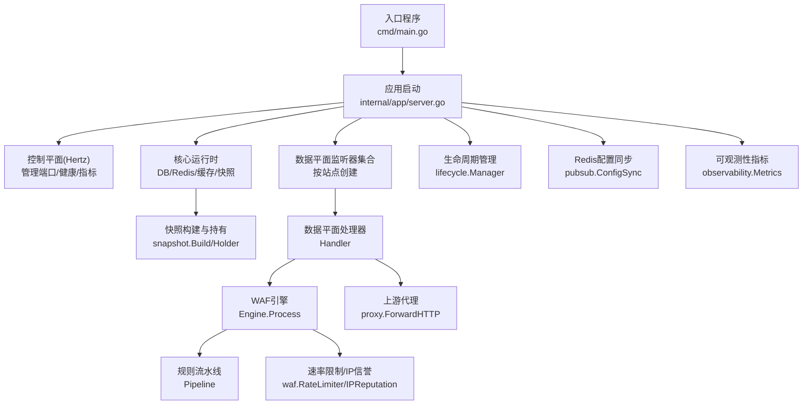
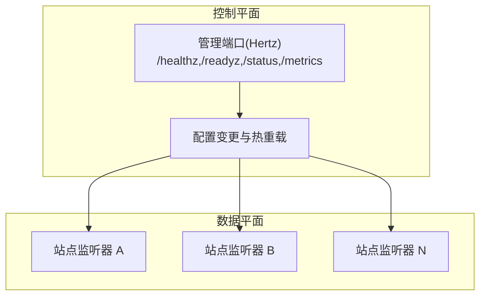
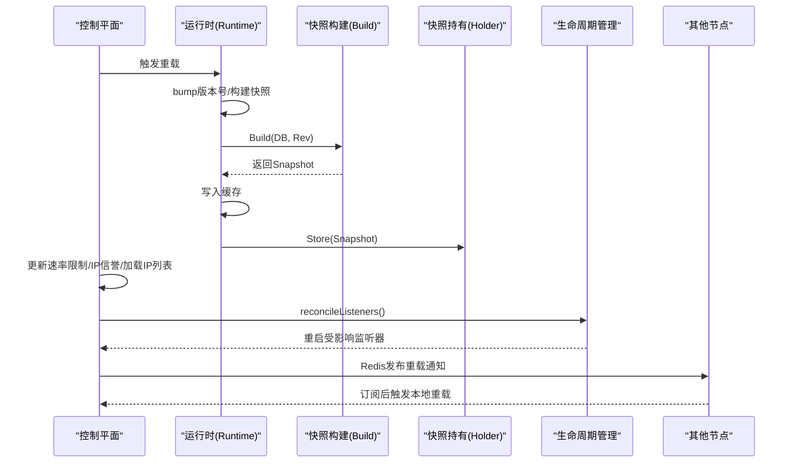
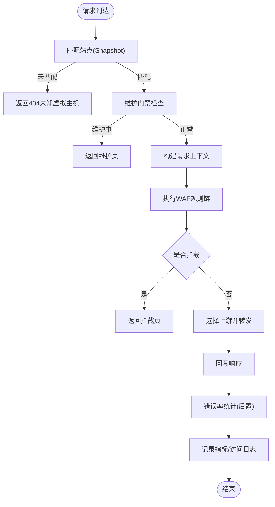
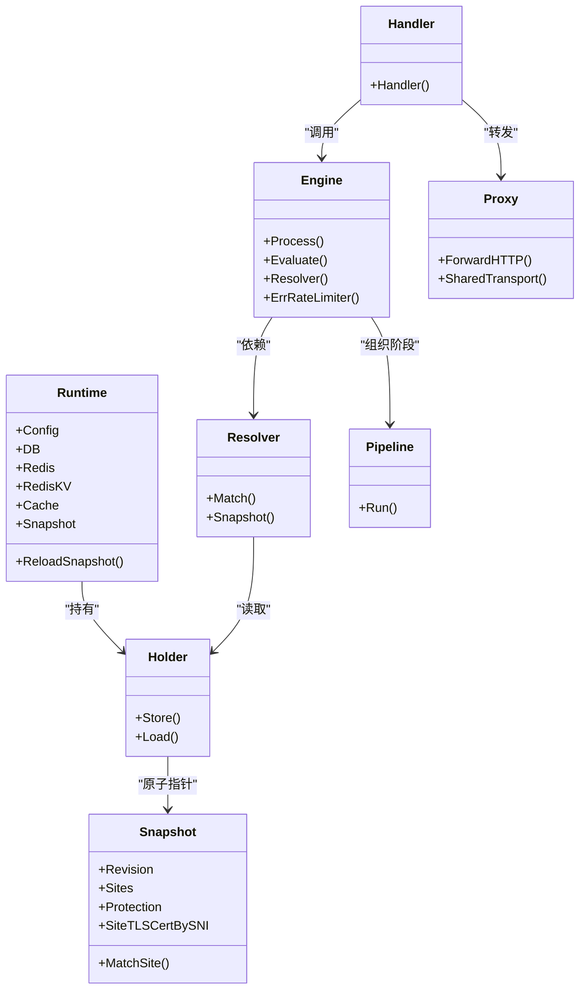
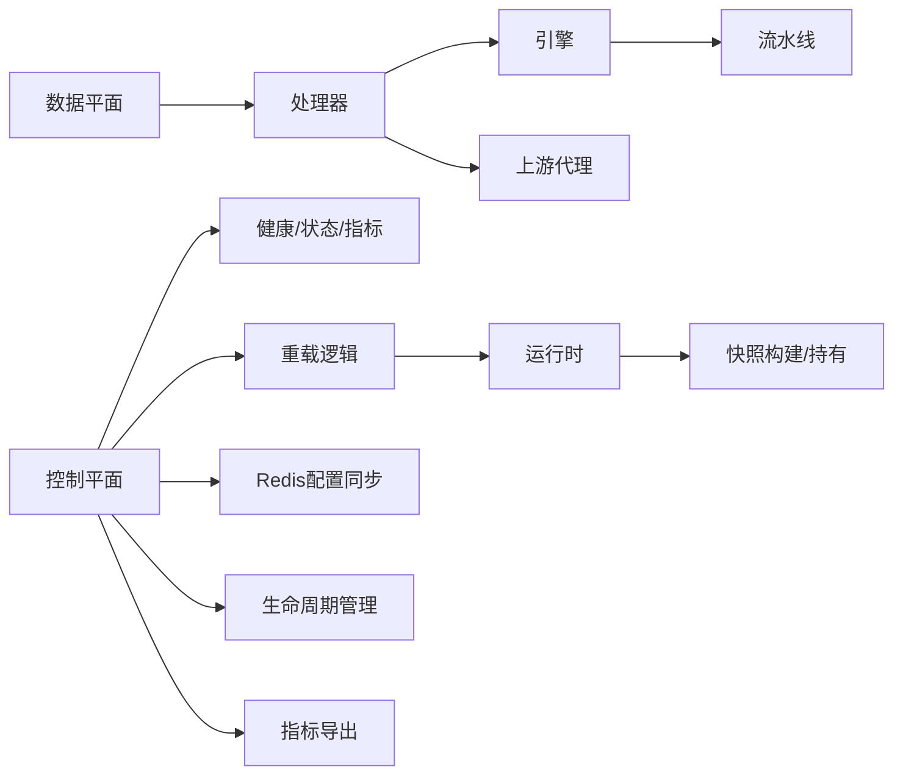

# 架构设计

<cite>
**本文引用的文件**
- [cmd/main.go](file://cmd/main.go)
- [internal/app/server.go](file://internal/app/server.go)
- [internal/core/runtime.go](file://internal/core/runtime.go)
- [internal/snapshot/snapshot.go](file://internal/snapshot/snapshot.go)
- [internal/snapshot/build.go](file://internal/snapshot/build.go)
- [internal/core/engine/engine.go](file://internal/core/engine/engine.go)
- [internal/core/sites/resolver.go](file://internal/core/sites/resolver.go)
- [internal/core/pipeline/pipeline.go](file://internal/core/pipeline/pipeline.go)
- [internal/dataplane/handler.go](file://internal/dataplane/handler.go)
- [internal/proxy/proxy.go](file://internal/proxy/proxy.go)
- [internal/waf/ratelimit.go](file://internal/waf/ratelimit.go)
- [internal/core/lifecycle/lifecycle.go](file://internal/core/lifecycle/lifecycle.go)
- [internal/core/redis/pubsub.go](file://internal/core/redis/pubsub.go)
- [internal/observability/metrics.go](file://internal/observability/metrics.go)
</cite>

## 目录
1. [引言](#引言)
2. [项目结构](#项目结构)
3. [核心组件](#核心组件)
4. [架构总览](#架构总览)
5. [详细组件分析](#详细组件分析)
6. [依赖关系分析](#依赖关系分析)
7. [性能与可扩展性](#性能与可扩展性)
8. [故障排查指南](#故障排查指南)
9. [结论](#结论)

## 引言
本文件面向 My-OpenWaf 的架构设计，系统性阐述其“控制平面 + 数据平面”的双服务器架构理念与实现方式；深入解析快照模式的不可变配置、原子指针切换与热重载机制；梳理从请求进入系统到最终响应的完整数据流；阐明核心组件之间的关系与交互模式，并给出架构图、组件关系图与数据流向图。同时，结合代码实现讨论技术决策的权衡与约束，并提供扩展性与性能考量建议。

## 项目结构
My-OpenWaf 采用分层与职责分离的组织方式：
- 入口程序：cmd/main.go 调用 internal/app/server.go 启动应用。
- 控制平面：负责管理配置、健康检查、指标导出与路由注册，使用 Hertz 提供的管理接口。
- 数据平面：按站点维度创建独立监听器，处理请求、执行 WAF 规则链、转发或阻断。
- 核心运行时：统一持有数据库、Redis、缓存与快照，支持快照构建与热重载。
- 快照模块：构建不可变配置视图，通过原子指针在数据平面安全切换。
- 引擎与流水线：将规则阶段化执行，支持观察命中与拦截动作。
- 上游代理：共享传输层连接池，支持 HTTP/2、TLS 与头部过滤。
- 生命周期管理：统一启动、优雅关闭与信号处理。
- Redis 配置同步：跨节点发布订阅，实现分布式热重载。
- 可观测性：事件写入、归档、指标收集与 Prometheus 导出。

**图表来源**
- [cmd/main.go:1-10](file://cmd/main.go#L1-L10)
- [internal/app/server.go:33-280](file://internal/app/server.go#L33-L280)

**章节来源**
- [cmd/main.go:1-10](file://cmd/main.go#L1-L10)
- [internal/app/server.go:33-280](file://internal/app/server.go#L33-L280)

## 核心组件
- 应用入口与启动
  - 入口函数调用应用层 Run，完成运行时初始化、快照构建、监听器与服务注册、生命周期管理与信号等待。
- 核心运行时 Runtime
  - 统一持有配置、数据库、Redis、分布式缓存与快照持有器；提供 ReloadSnapshot 原子存储能力。
- 快照 Snapshot 与 Holder
  - 不可变配置视图，包含站点映射、保护配置、SNI 证书等；通过原子指针进行安全切换。
- WAF 引擎 Engine
  - 解析站点、维护门禁、编译规则、组织流水线阶段并执行；返回拦截或放行结果及观察命中。
- 数据平面处理器 Handler
  - 将请求上下文注入流水线，处理拦截、维护模式、上游转发与错误率统计。
- 上游代理 Proxy
  - 复用传输层连接池，剥离“逐跳”头，应用出站转发策略。
- 速率限制与 IP 信誉
  - 固定窗口计数与清理协程；支持请求/错误两类限流。
- 生命周期管理 Lifecycle
  - 管理多监听器的启动、停止、优雅关闭与信号处理。
- Redis 配置同步
  - 发布/订阅跨节点通知，触发本地快照重载与监听器重建。
- 指标与可观测性
  - 收集请求、拦截、观察命中、内置命中、缓存命中/未命中、上游错误、进程运行时信息并通过 Prometheus 导出。

**章节来源**
- [internal/app/server.go:33-280](file://internal/app/server.go#L33-L280)
- [internal/core/runtime.go:17-127](file://internal/core/runtime.go#L17-L127)
- [internal/snapshot/snapshot.go:52-105](file://internal/snapshot/snapshot.go#L52-L105)
- [internal/core/engine/engine.go:15-146](file://internal/core/engine/engine.go#L15-L146)
- [internal/dataplane/handler.go:36-309](file://internal/dataplane/handler.go#L36-L309)
- [internal/proxy/proxy.go:73-136](file://internal/proxy/proxy.go#L73-L136)
- [internal/waf/ratelimit.go:9-117](file://internal/waf/ratelimit.go#L9-L117)
- [internal/core/lifecycle/lifecycle.go:30-178](file://internal/core/lifecycle/lifecycle.go#L30-L178)
- [internal/core/redis/pubsub.go:13-77](file://internal/core/redis/pubsub.go#L13-L77)
- [internal/observability/metrics.go:13-126](file://internal/observability/metrics.go#L13-L126)

## 架构总览
My-OpenWaf 采用“控制平面 + 数据平面”的双服务器架构：
- 控制平面：提供管理端口（健康检查、就绪检查、状态查询、指标导出），注册管理路由，协调配置变更与热重载。
- 数据平面：每个启用且配置有效的站点对应一个 Hertz 监听器实例，按站点维度启停；所有监听器共享同一快照与引擎实例，确保一致的规则与策略。

**图表来源**
- [internal/app/server.go:245-279](file://internal/app/server.go#L245-L279)
- [internal/app/server.go:133-201](file://internal/app/server.go#L133-L201)

## 详细组件分析

### 快照模式与热重载机制
- 不可变配置
  - 快照 Snapshot 是只读视图，包含站点映射、保护配置与 SNI 证书等，避免并发读写竞争。
- 原子指针切换
  - Holder 使用原子指针保存当前快照，加载新快照时以原子操作替换指针，保证读侧零锁争用。
- 热重载流程
  - 控制面触发重载：更新数据库版本号、重新构建快照、写入缓存、原子替换快照。
  - 更新速率限制与 IP 信誉参数、加载 IP 列表、重建/重启受影响的站点监听器。
  - 通过 Redis 发布订阅通知其他节点，实现分布式一致性。

**图表来源**
- [internal/core/runtime.go:82-99](file://internal/core/runtime.go#L82-L99)
- [internal/snapshot/build.go:14-143](file://internal/snapshot/build.go#L14-L143)
- [internal/snapshot/snapshot.go:98-105](file://internal/snapshot/snapshot.go#L98-L105)
- [internal/app/server.go:203-243](file://internal/app/server.go#L203-L243)
- [internal/core/lifecycle/lifecycle.go:102-136](file://internal/core/lifecycle/lifecycle.go#L102-L136)
- [internal/core/redis/pubsub.go:33-68](file://internal/core/redis/pubsub.go#L33-L68)

**章节来源**
- [internal/core/runtime.go:82-99](file://internal/core/runtime.go#L82-L99)
- [internal/snapshot/build.go:14-143](file://internal/snapshot/build.go#L14-L143)
- [internal/snapshot/snapshot.go:98-105](file://internal/snapshot/snapshot.go#L98-L105)
- [internal/app/server.go:203-243](file://internal/app/server.go#L203-L243)
- [internal/core/lifecycle/lifecycle.go:102-136](file://internal/core/lifecycle/lifecycle.go#L102-L136)
- [internal/core/redis/pubsub.go:33-68](file://internal/core/redis/pubsub.go#L33-L68)

### 数据流分析：请求从进入系统到响应
- 请求进入
  - 数据平面处理器根据绑定地址与 Host 匹配站点；解析客户端 IP、方法、路径、查询串、头部与主体。
- 维护门禁
  - 若全局或站点维护开启，直接返回维护页面。
- WAF 规则链
  - IP 信誉（白名单短路、黑名单拦截）、ACL、机器人检测、请求速率限制、OWASP 规则、签名/自定义规则。
- 动作与日志
  - 拦截时记录拦截事件与观察命中；观察命中仅记录不阻断。
- 上游转发
  - 未拦截时选择上游地址轮询转发；区分 WebSocket/SSE/常规 HTTP；剥离逐跳头并回写响应。
- 错误率统计
  - 基于响应码统计错误并增量计数，用于后续错误速率限制。
- 指标与访问日志
  - 记录请求总量、拦截次数、观察命中、内置命中、缓存命中/未命中、上游错误、进程运行时指标。

**图表来源**
- [internal/dataplane/handler.go:36-309](file://internal/dataplane/handler.go#L36-L309)
- [internal/core/engine/engine.go:43-106](file://internal/core/engine/engine.go#L43-L106)
- [internal/core/pipeline/pipeline.go:37-66](file://internal/core/pipeline/pipeline.go#L37-L66)
- [internal/proxy/proxy.go:73-136](file://internal/proxy/proxy.go#L73-L136)
- [internal/waf/block.go:16-66](file://internal/waf/block.go#L16-L66)

**章节来源**
- [internal/dataplane/handler.go:36-309](file://internal/dataplane/handler.go#L36-L309)
- [internal/core/engine/engine.go:43-106](file://internal/core/engine/engine.go#L43-L106)
- [internal/core/pipeline/pipeline.go:37-66](file://internal/core/pipeline/pipeline.go#L37-L66)
- [internal/proxy/proxy.go:73-136](file://internal/proxy/proxy.go#L73-L136)
- [internal/waf/block.go:16-66](file://internal/waf/block.go#L16-L66)

### 组件关系与交互模式
- 运行时与快照
  - Runtime 负责构建与缓存快照，并通过 Holder 提供原子读取；数据平面处理器与引擎均通过 Holder 获取当前快照。
- 引擎与流水线
  - Engine 聚合 Resolver、速率限制器、IP 信誉与规则阶段，形成有序流水线；Evaluate 提供测试辅助。
- 数据平面与上游
  - Handler 调用 Engine.Process 并根据结果决定拦截或转发；转发时使用共享传输层连接池，剥离逐跳头。
- 生命周期与监听器
  - reconcileListeners 根据快照与指纹标签动态增删改站点监听器，支持配置漂移检测与热重启。
- Redis 同步
  - 配置变更通过发布订阅广播，其他节点订阅后触发本地重载，保持全局一致。

**图表来源**
- [internal/core/runtime.go:17-80](file://internal/core/runtime.go#L17-L80)
- [internal/snapshot/snapshot.go:52-105](file://internal/snapshot/snapshot.go#L52-L105)
- [internal/core/engine/engine.go:15-31](file://internal/core/engine/engine.go#L15-L31)
- [internal/core/sites/resolver.go:7-31](file://internal/core/sites/resolver.go#L7-L31)
- [internal/core/pipeline/pipeline.go:37-66](file://internal/core/pipeline/pipeline.go#L37-L66)
- [internal/dataplane/handler.go:36-309](file://internal/dataplane/handler.go#L36-L309)
- [internal/proxy/proxy.go:32-71](file://internal/proxy/proxy.go#L32-L71)

**章节来源**
- [internal/core/runtime.go:17-80](file://internal/core/runtime.go#L17-L80)
- [internal/snapshot/snapshot.go:52-105](file://internal/snapshot/snapshot.go#L52-L105)
- [internal/core/engine/engine.go:15-31](file://internal/core/engine/engine.go#L15-L31)
- [internal/core/sites/resolver.go:7-31](file://internal/core/sites/resolver.go#L7-L31)
- [internal/core/pipeline/pipeline.go:37-66](file://internal/core/pipeline/pipeline.go#L37-L66)
- [internal/dataplane/handler.go:36-309](file://internal/dataplane/handler.go#L36-L309)
- [internal/proxy/proxy.go:32-71](file://internal/proxy/proxy.go#L32-L71)

## 依赖关系分析
- 控制平面依赖
  - 管理路由注册依赖 Hertz；健康检查与状态查询依赖运行时；指标导出依赖可观测性模块。
- 数据平面依赖
  - Handler 依赖快照持有器、引擎、指标、事件写入器与日志；引擎依赖 Resolver、规则编译与流水线；上游代理依赖共享传输层。
- 分布式一致性
  - Redis 配置同步依赖 Redis 客户端；生命周期管理统一调度多个 Hertz 实例。

**图表来源**
- [internal/app/server.go:245-279](file://internal/app/server.go#L245-L279)
- [internal/core/runtime.go:82-99](file://internal/core/runtime.go#L82-L99)
- [internal/snapshot/build.go:14-143](file://internal/snapshot/build.go#L14-L143)
- [internal/dataplane/handler.go:36-309](file://internal/dataplane/handler.go#L36-L309)
- [internal/core/engine/engine.go:43-106](file://internal/core/engine/engine.go#L43-L106)
- [internal/proxy/proxy.go:73-136](file://internal/proxy/proxy.go#L73-L136)
- [internal/core/redis/pubsub.go:33-68](file://internal/core/redis/pubsub.go#L33-L68)
- [internal/core/lifecycle/lifecycle.go:138-149](file://internal/core/lifecycle/lifecycle.go#L138-L149)
- [internal/observability/metrics.go:51-125](file://internal/observability/metrics.go#L51-L125)

**章节来源**
- [internal/app/server.go:245-279](file://internal/app/server.go#L245-L279)
- [internal/core/runtime.go:82-99](file://internal/core/runtime.go#L82-L99)
- [internal/snapshot/build.go:14-143](file://internal/snapshot/build.go#L14-L143)
- [internal/dataplane/handler.go:36-309](file://internal/dataplane/handler.go#L36-L309)
- [internal/core/engine/engine.go:43-106](file://internal/core/engine/engine.go#L43-L106)
- [internal/proxy/proxy.go:73-136](file://internal/proxy/proxy.go#L73-L136)
- [internal/core/redis/pubsub.go:33-68](file://internal/core/redis/pubsub.go#L33-L68)
- [internal/core/lifecycle/lifecycle.go:138-149](file://internal/core/lifecycle/lifecycle.go#L138-L149)
- [internal/observability/metrics.go:51-125](file://internal/observability/metrics.go#L51-L125)

## 性能与可扩展性
- 快照不可变与原子切换
  - 读路径零锁争用，降低热点竞争；适合高并发场景下的稳定读取。
- 流水线阶段化
  - 观察命中与拦截分离，便于日志与指标统计；阶段顺序合理安排，减少无效计算。
- 上游代理连接池
  - 复用传输层连接，降低握手开销；支持 HTTP/2 与 TLS；剥离逐跳头避免泄漏。
- 速率限制与错误率统计
  - 固定窗口计数与清理协程，避免内存无限增长；错误率统计在响应后进行，不影响请求处理主路径。
- 监听器按站点拆分
  - 支持站点级启停与独立 TLS 配置；配置漂移检测与热重启，提升运维灵活性。
- Redis 分布式同步
  - 跨节点一致性保障；发布/订阅异步解耦，避免阻塞主流程。
- 指标与可观测性
  - Prometheus 文本格式导出，便于集成监控体系；采集关键运行时指标。

**章节来源**
- [internal/snapshot/snapshot.go:52-105](file://internal/snapshot/snapshot.go#L52-L105)
- [internal/core/engine/engine.go:43-106](file://internal/core/engine/engine.go#L43-L106)
- [internal/proxy/proxy.go:32-71](file://internal/proxy/proxy.go#L32-L71)
- [internal/waf/ratelimit.go:94-117](file://internal/waf/ratelimit.go#L94-L117)
- [internal/app/server.go:133-201](file://internal/app/server.go#L133-L201)
- [internal/core/redis/pubsub.go:33-68](file://internal/core/redis/pubsub.go#L33-L68)
- [internal/observability/metrics.go:51-125](file://internal/observability/metrics.go#L51-L125)

## 故障排查指南
- 配置未生效或热重载失败
  - 检查运行时重载流程是否成功：版本号更新、快照构建、缓存写入与原子替换。
  - 查看 Redis 配置同步是否正常：发布/订阅通道是否存在、订阅协程是否存活。
  - 核对生命周期管理：reconcileListeners 是否正确识别配置漂移并重启监听器。
- 请求被拦截但日志缺失
  - 确认观察命中与拦截事件是否写入事件写入器；检查指标记录是否启用。
- 上游转发异常
  - 检查上游地址列表与 TLS 配置；确认传输层连接池键值是否正确；查看响应头是否被正确剥离。
- 指标不更新
  - 确认 Prometheus 处理器已注册；检查指标对象是否被正确引用与累加。

**章节来源**
- [internal/core/runtime.go:82-99](file://internal/core/runtime.go#L82-L99)
- [internal/core/redis/pubsub.go:33-68](file://internal/core/redis/pubsub.go#L33-L68)
- [internal/core/lifecycle/lifecycle.go:102-136](file://internal/core/lifecycle/lifecycle.go#L102-L136)
- [internal/dataplane/handler.go:108-142](file://internal/dataplane/handler.go#L108-L142)
- [internal/proxy/proxy.go:73-136](file://internal/proxy/proxy.go#L73-L136)
- [internal/observability/metrics.go:51-125](file://internal/observability/metrics.go#L51-L125)

## 结论
My-OpenWaf 的双服务器架构清晰地将“配置管理与控制”与“请求处理与转发”分离，快照模式通过不可变配置与原子指针切换实现了稳定的读路径与可靠的热重载；数据平面按站点拆分监听器，结合生命周期管理与 Redis 同步，提供了灵活的运维能力。整体设计在性能、可扩展性与可运维性之间取得良好平衡，适合生产环境的高可用部署与持续演进。