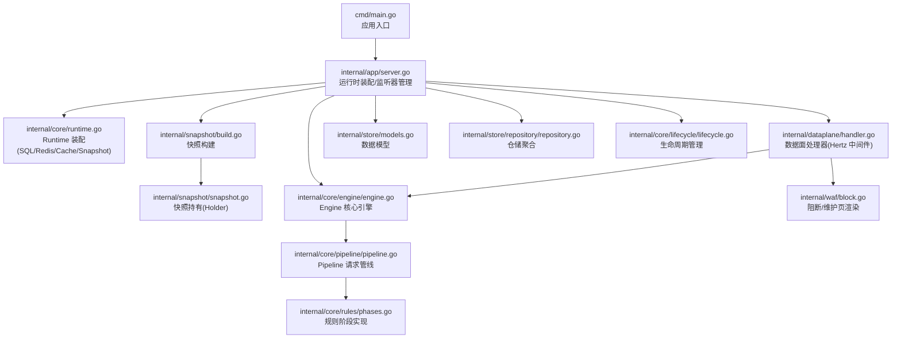
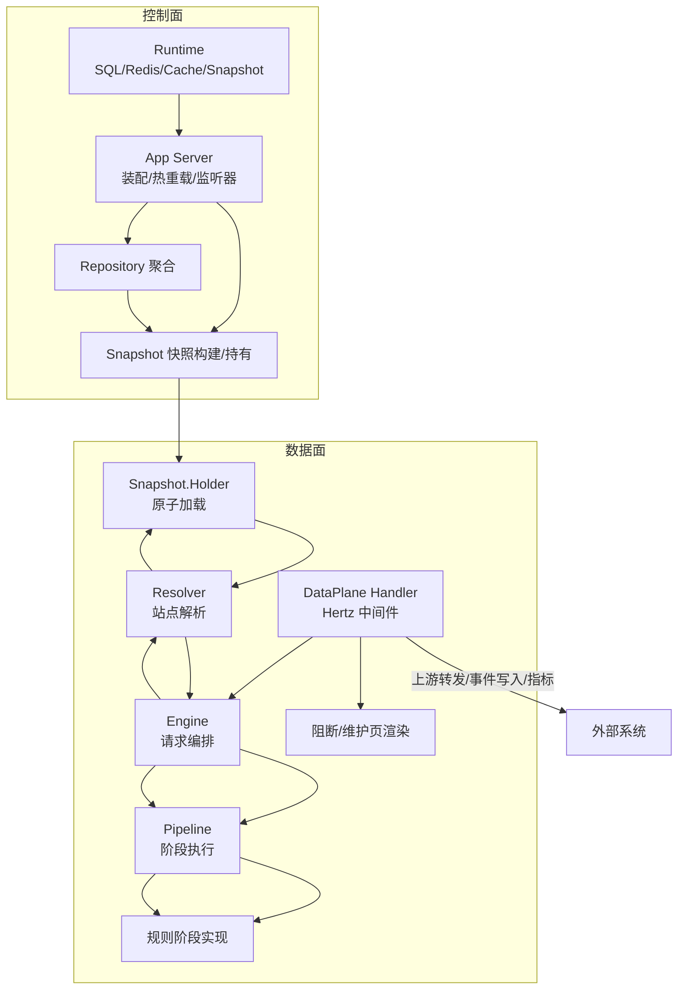
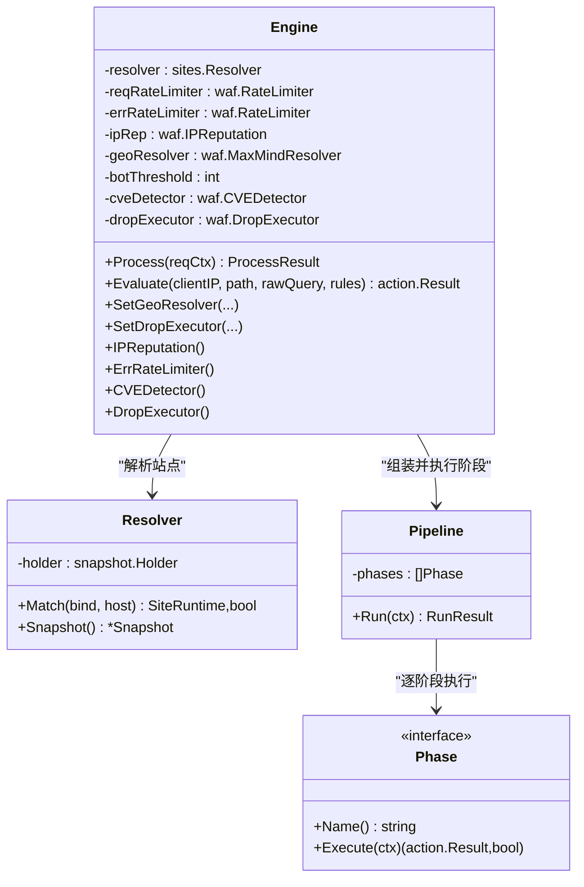
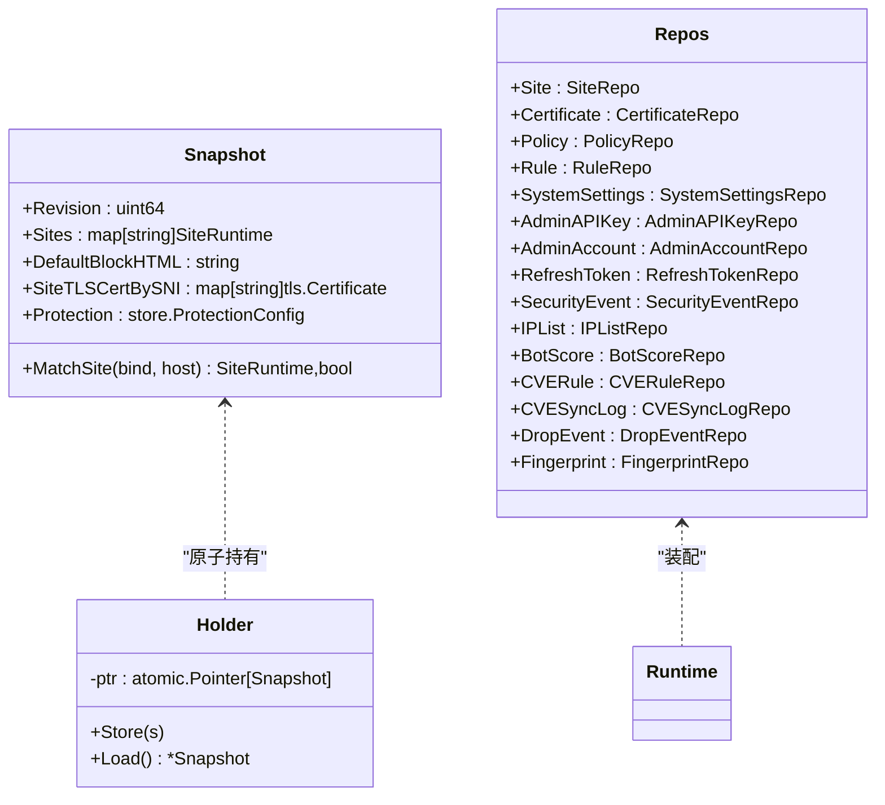
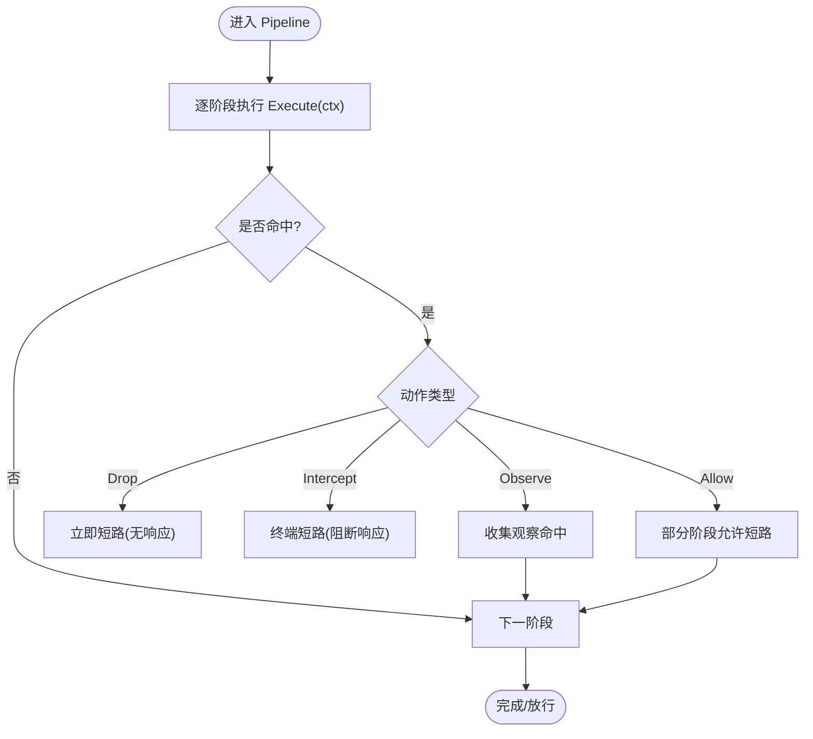
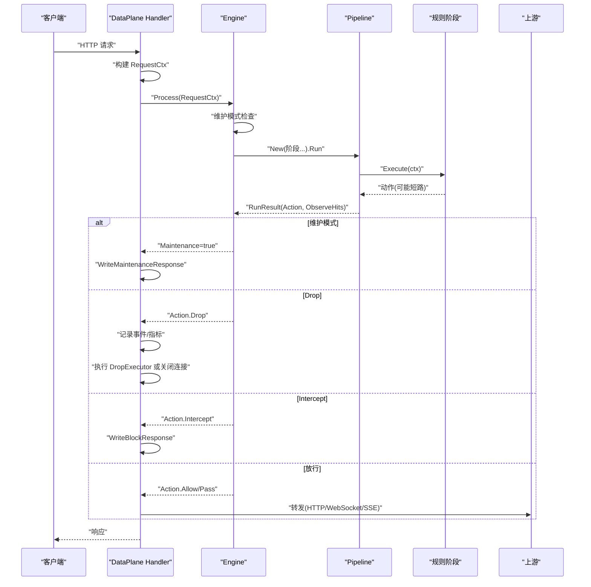
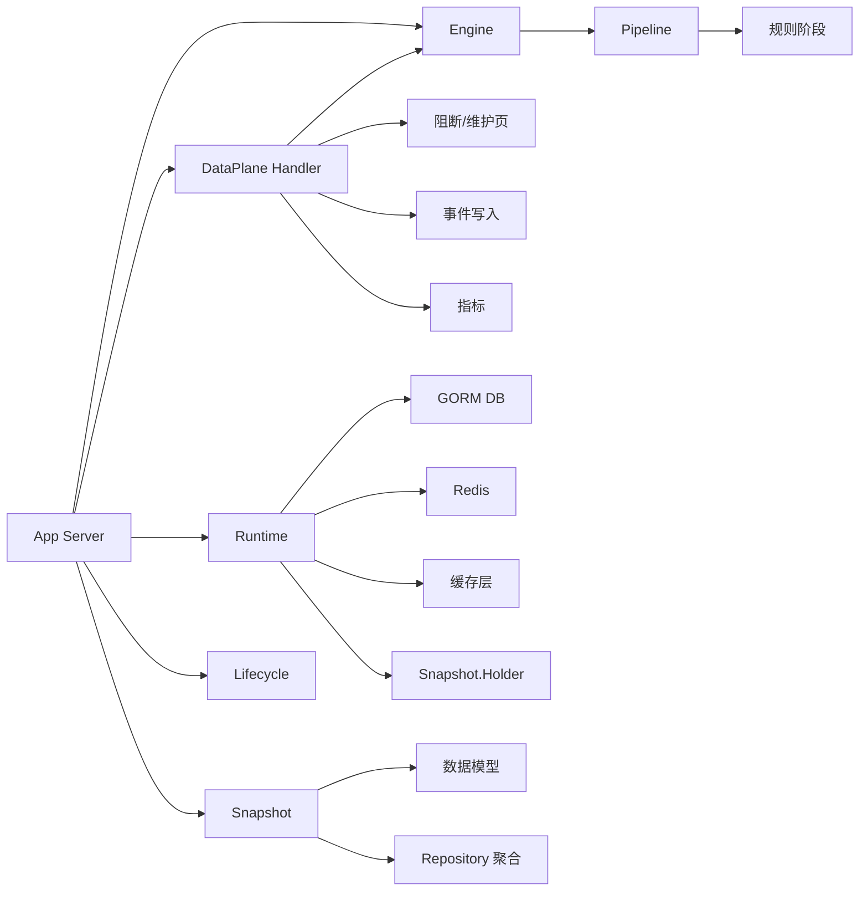

# 组件关系图

<cite>
**本文引用的文件**
- [cmd/main.go](file://cmd/main.go)
- [internal/app/server.go](file://internal/app/server.go)
- [internal/core/runtime.go](file://internal/core/runtime.go)
- [internal/core/engine/engine.go](file://internal/core/engine/engine.go)
- [internal/core/pipeline/pipeline.go](file://internal/core/pipeline/pipeline.go)
- [internal/core/rules/phases.go](file://internal/core/rules/phases.go)
- [internal/core/action/action.go](file://internal/core/action/action.go)
- [internal/core/sites/resolver.go](file://internal/core/sites/resolver.go)
- [internal/snapshot/snapshot.go](file://internal/snapshot/snapshot.go)
- [internal/snapshot/build.go](file://internal/snapshot/build.go)
- [internal/store/models.go](file://internal/store/models.go)
- [internal/store/repository/repository.go](file://internal/store/repository/repository.go)
- [internal/dataplane/handler.go](file://internal/dataplane/handler.go)
- [internal/core/lifecycle/lifecycle.go](file://internal/core/lifecycle/lifecycle.go)
- [internal/waf/block.go](file://internal/waf/block.go)
</cite>

## 目录
1. [简介](#简介)
2. [项目结构](#项目结构)
3. [核心组件](#核心组件)
4. [架构总览](#架构总览)
5. [详细组件分析](#详细组件分析)
6. [依赖分析](#依赖分析)
7. [性能考量](#性能考量)
8. [故障排查指南](#故障排查指南)
9. [结论](#结论)
10. [附录](#附录)

## 简介
本文件聚焦 My-OpenWaf 的核心组件关系与交互流程，围绕 Engine、Snapshot、Pipeline、Repository 等关键模块，绘制组件关系图、调用时序图与状态转换图，阐明职责边界、接口定义、数据交换协议、解耦机制、依赖注入模式、生命周期管理、协作最佳实践、错误传播与异常处理策略，并提供扩展指南与集成示例。

## 项目结构
My-OpenWaf 采用分层与功能域结合的组织方式：
- cmd：应用入口，仅负责启动
- internal/app：应用运行时装配、监听器热管理、配置热重载
- internal/core：核心引擎与规则管线、动作模型、站点解析、运行时环境
- internal/snapshot：快照构建与持有（原子切换）
- internal/store：数据模型与仓储聚合
- internal/dataplane：数据面处理器（Hertz 中间件）
- internal/waf：阻断页面渲染与阻断执行器等
- internal/observability、internal/proxy、internal/security 等支撑模块

图表来源
- [cmd/main.go:1-10](file://cmd/main.go#L1-L10)
- [internal/app/server.go:35-305](file://internal/app/server.go#L35-L305)
- [internal/core/runtime.go:17-127](file://internal/core/runtime.go#L17-L127)
- [internal/snapshot/build.go:14-143](file://internal/snapshot/build.go#L14-L143)
- [internal/snapshot/snapshot.go:52-105](file://internal/snapshot/snapshot.go#L52-L105)
- [internal/core/engine/engine.go:15-176](file://internal/core/engine/engine.go#L15-L176)
- [internal/core/pipeline/pipeline.go:9-71](file://internal/core/pipeline/pipeline.go#L9-L71)
- [internal/core/rules/phases.go:19-569](file://internal/core/rules/phases.go#L19-L569)
- [internal/dataplane/handler.go:27-362](file://internal/dataplane/handler.go#L27-L362)
- [internal/waf/block.go:16-110](file://internal/waf/block.go#L16-L110)
- [internal/store/models.go:94-148](file://internal/store/models.go#L94-L148)
- [internal/store/repository/repository.go:5-43](file://internal/store/repository/repository.go#L5-L43)
- [internal/core/lifecycle/lifecycle.go:30-178](file://internal/core/lifecycle/lifecycle.go#L30-L178)

章节来源
- [cmd/main.go:1-10](file://cmd/main.go#L1-L10)
- [internal/app/server.go:35-305](file://internal/app/server.go#L35-L305)

## 核心组件
- Engine：请求全链路编排者，负责站点解析、维护模式检查、规则阶段组装与执行、动作结果汇总与短路控制
- Snapshot：不可变快照，保存当前生效的站点、证书、保护配置；通过 Holder 原子切换
- Pipeline：有序阶段执行器，支持短路（Drop 最高优先级）、拦截（Intercept）、观察（Observe）与放行（Allow）
- Repository：仓储聚合，统一访问数据库实体
- Runtime：装配 SQL、Redis、缓存、快照持有者，提供 ReloadSnapshot 能力
- DataPlane Handler：Hertz 中间件，负责请求上下文构建、WAF 处理、阻断/维护响应、上游转发
- Lifecycle：多服务器生命周期管理（启动/优雅关闭/信号处理）

章节来源
- [internal/core/engine/engine.go:15-176](file://internal/core/engine/engine.go#L15-L176)
- [internal/snapshot/snapshot.go:52-105](file://internal/snapshot/snapshot.go#L52-L105)
- [internal/core/pipeline/pipeline.go:9-71](file://internal/core/pipeline/pipeline.go#L9-L71)
- [internal/store/repository/repository.go:5-43](file://internal/store/repository/repository.go#L5-L43)
- [internal/core/runtime.go:17-127](file://internal/core/runtime.go#L17-L127)
- [internal/dataplane/handler.go:27-362](file://internal/dataplane/handler.go#L27-L362)
- [internal/core/lifecycle/lifecycle.go:30-178](file://internal/core/lifecycle/lifecycle.go#L30-L178)

## 架构总览
下图展示 Engine、Snapshot、Pipeline、Repository 在运行时的交互关系与调用方向。

图表来源
- [internal/app/server.go:35-305](file://internal/app/server.go#L35-L305)
- [internal/core/runtime.go:17-127](file://internal/core/runtime.go#L17-L127)
- [internal/snapshot/build.go:14-143](file://internal/snapshot/build.go#L14-L143)
- [internal/snapshot/snapshot.go:52-105](file://internal/snapshot/snapshot.go#L52-L105)
- [internal/core/sites/resolver.go:7-32](file://internal/core/sites/resolver.go#L7-L32)
- [internal/core/engine/engine.go:15-176](file://internal/core/engine/engine.go#L15-L176)
- [internal/core/pipeline/pipeline.go:9-71](file://internal/core/pipeline/pipeline.go#L9-L71)
- [internal/core/rules/phases.go:19-569](file://internal/core/rules/phases.go#L19-L569)
- [internal/dataplane/handler.go:27-362](file://internal/dataplane/handler.go#L27-L362)
- [internal/waf/block.go:16-110](file://internal/waf/block.go#L16-L110)

## 详细组件分析

### Engine 组件分析
- 职责边界
  - 负责一次请求的完整处理：维护模式检查、站点解析、规则阶段组装与执行、动作结果汇总
  - 提供 Evaluate 测试辅助方法
- 接口定义
  - Process(RequestCtx) -> ProcessResult
  - Evaluate(IP, Path, Query, Rules) -> action.Result
  - SetGeoResolver、SetDropExecutor、IPReputation、ErrRateLimiter、CVEDetector、DropExecutor 访问器
- 数据交换协议
  - 输入：pipeline.RequestCtx（含请求标识、绑定地址、客户端IP、方法、路径、查询、头、体、内容类型等）
  - 输出：ProcessResult（动作、站点运行时、观察命中、维护标志）
- 解耦机制
  - 通过 snapshot.Holder 获取不可变快照，避免并发读写冲突
  - 通过 sites.Resolver 将 bind/host 映射到 SiteRuntime
  - 规则阶段通过 pipeline.Phase 接口解耦
- 生命周期
  - 由 App Server 在启动时创建并注入到数据面处理器
- 错误传播与异常处理
  - 快照为空或站点未匹配时返回空结果
  - 维护模式直接短路返回拦截动作
  - 规则阶段命中后按优先级短路（Drop > Intercept > Observe；Allow 通常短路但需视阶段而定）

图表来源
- [internal/core/engine/engine.go:15-176](file://internal/core/engine/engine.go#L15-L176)
- [internal/core/sites/resolver.go:7-32](file://internal/core/sites/resolver.go#L7-L32)
- [internal/core/pipeline/pipeline.go:9-71](file://internal/core/pipeline/pipeline.go#L9-L71)
- [internal/core/rules/phases.go:19-569](file://internal/core/rules/phases.go#L19-L569)

章节来源
- [internal/core/engine/engine.go:15-176](file://internal/core/engine/engine.go#L15-L176)
- [internal/core/sites/resolver.go:7-32](file://internal/core/sites/resolver.go#L7-L32)
- [internal/core/pipeline/pipeline.go:9-71](file://internal/core/pipeline/pipeline.go#L9-L71)
- [internal/core/rules/phases.go:19-569](file://internal/core/rules/phases.go#L19-L569)

### Snapshot 与 Repository 组件分析
- Snapshot
  - 不可变视图，包含站点映射、默认阻断页、SNI 证书映射、全局保护配置
  - Holder 通过原子指针存储/加载，实现零拷贝切换
- Repository
  - Repos 聚合所有实体仓储，集中初始化与使用
- 关系
  - App Server 通过 Runtime.ReloadSnapshot 从数据库构建快照，写入 Cache 并原子替换到 Holder
  - Engine 通过 Resolver 间接访问 Snapshot

图表来源
- [internal/snapshot/snapshot.go:52-105](file://internal/snapshot/snapshot.go#L52-L105)
- [internal/snapshot/build.go:14-143](file://internal/snapshot/build.go#L14-L143)
- [internal/store/repository/repository.go:5-43](file://internal/store/repository/repository.go#L5-L43)
- [internal/core/runtime.go:17-127](file://internal/core/runtime.go#L17-L127)

章节来源
- [internal/snapshot/snapshot.go:52-105](file://internal/snapshot/snapshot.go#L52-L105)
- [internal/snapshot/build.go:14-143](file://internal/snapshot/build.go#L14-L143)
- [internal/store/repository/repository.go:5-43](file://internal/store/repository/repository.go#L5-L43)
- [internal/core/runtime.go:17-127](file://internal/core/runtime.go#L17-L127)

### Pipeline 与规则阶段分析
- Pipeline
  - 有序阶段执行，支持短路：Drop > Intercept > Observe；Allow 可能短路（如 ACL 阶段）
  - 收集观察命中用于日志与事件写入
- 规则阶段
  - ACL、签名、自定义、请求速率限制、IP信誉、机器人检测（单阶段/双阶段）、OWASP 默认、CVE 检测
  - 每个阶段实现 pipeline.Phase 接口，返回动作与是否短路

图表来源
- [internal/core/pipeline/pipeline.go:46-71](file://internal/core/pipeline/pipeline.go#L46-L71)
- [internal/core/rules/phases.go:19-569](file://internal/core/rules/phases.go#L19-L569)

章节来源
- [internal/core/pipeline/pipeline.go:9-71](file://internal/core/pipeline/pipeline.go#L9-L71)
- [internal/core/rules/phases.go:19-569](file://internal/core/rules/phases.go#L19-L569)

### DataPlane Handler 时序分析
- 入口：Hertz 中间件 Handler 返回 app.HandlerFunc
- 步骤
  1) 静态资源分流
  2) 构建 RequestCtx（请求ID、绑定地址、客户端IP、方法、路径、查询、头、体、内容类型）
  3) Engine.Process 执行全链路
  4) 根据动作类型：
     - 维护模式：写入维护页
     - Drop：记录事件并执行 TCP Drop 或直接关闭连接
     - Intercept：写入阻断页
     - 其他：上游转发（HTTP/WebSocket/SSE）
  5) 记录访问日志与指标

图表来源
- [internal/dataplane/handler.go:37-362](file://internal/dataplane/handler.go#L37-L362)
- [internal/core/engine/engine.go:57-129](file://internal/core/engine/engine.go#L57-L129)
- [internal/core/pipeline/pipeline.go:46-71](file://internal/core/pipeline/pipeline.go#L46-L71)
- [internal/core/rules/phases.go:19-569](file://internal/core/rules/phases.go#L19-L569)
- [internal/waf/block.go:16-110](file://internal/waf/block.go#L16-L110)

章节来源
- [internal/dataplane/handler.go:37-362](file://internal/dataplane/handler.go#L37-L362)
- [internal/core/engine/engine.go:57-129](file://internal/core/engine/engine.go#L57-L129)

### 组件协作最佳实践
- 依赖注入
  - App Server 在 Run 中集中创建 Runtime、Snapshot、Engine、Pipeline、Handler，并注入到生命周期管理器
  - 通过 Options 结构体传递依赖，保证清晰的契约
- 解耦与扩展
  - 规则阶段以 Phase 接口抽象，新增阶段无需修改 Pipeline 实现
  - Snapshot 作为只读共享状态，避免重复构建
- 热重载
  - 通过 Redis Pub/Sub 订阅配置变更，触发 Runtime.ReloadSnapshot 与监听器重建
- 错误处理
  - 快照缺失、站点未匹配、上游错误均有明确的降级与错误码返回
  - Drop 动作确保无响应地关闭连接，保障安全与性能

章节来源
- [internal/app/server.go:35-305](file://internal/app/server.go#L35-L305)
- [internal/core/runtime.go:82-99](file://internal/core/runtime.go#L82-L99)
- [internal/core/lifecycle/lifecycle.go:30-178](file://internal/core/lifecycle/lifecycle.go#L30-L178)

## 依赖分析
- 组件耦合
  - Engine 依赖 Resolver、Pipeline、规则阶段、速率限制器、IP信誉、CVE检测器、Drop 执行器
  - DataPlane Handler 依赖 Engine、Snapshot、阻断渲染、事件写入、指标
  - Runtime 依赖数据库、Redis、缓存与 Snapshot 持有者
  - App Server 依赖 Runtime、Repository、Lifecycle、Snapshot、Engine、Handler
- 外部依赖
  - Hertz 作为 HTTP/TLS/WebSocket/SSE 服务器框架
  - GORM 作为 ORM
  - go-redis 作为分布式缓存与 Pub/Sub

图表来源
- [internal/app/server.go:35-305](file://internal/app/server.go#L35-L305)
- [internal/core/runtime.go:17-127](file://internal/core/runtime.go#L17-L127)
- [internal/snapshot/build.go:14-143](file://internal/snapshot/build.go#L14-L143)
- [internal/store/models.go:94-148](file://internal/store/models.go#L94-L148)
- [internal/store/repository/repository.go:5-43](file://internal/store/repository/repository.go#L5-L43)
- [internal/dataplane/handler.go:27-362](file://internal/dataplane/handler.go#L27-L362)
- [internal/core/lifecycle/lifecycle.go:30-178](file://internal/core/lifecycle/lifecycle.go#L30-L178)

章节来源
- [internal/app/server.go:35-305](file://internal/app/server.go#L35-L305)
- [internal/core/runtime.go:17-127](file://internal/core/runtime.go#L17-L127)
- [internal/snapshot/build.go:14-143](file://internal/snapshot/build.go#L14-L143)
- [internal/store/models.go:94-148](file://internal/store/models.go#L94-L148)
- [internal/store/repository/repository.go:5-43](file://internal/store/repository/repository.go#L5-L43)
- [internal/dataplane/handler.go:27-362](file://internal/dataplane/handler.go#L27-L362)
- [internal/core/lifecycle/lifecycle.go:30-178](file://internal/core/lifecycle/lifecycle.go#L30-L178)

## 性能考量
- 快照原子切换：避免锁竞争，提升读性能
- 请求上下文池化：减少 GC 压力
- 规则阶段短路：Drop/Intercept 立即终止，避免后续阶段开销
- 速率限制与错误率统计：在数据面后置统计，降低对主链路影响
- 上游轮询：简单轮询策略，配合健康检查与错误处理

## 故障排查指南
- 快照未加载
  - 现象：503 配置未加载
  - 排查：确认 Runtime.ReloadSnapshot 是否成功，数据库连接与迁移是否正常
- 站点未匹配
  - 现象：404 未知虚拟主机
  - 排查：检查 bind/host 映射、通配符匹配、Snapshot.Sites 内容
- 维护模式
  - 现象：维护页返回
  - 排查：检查全局或站点维护开关与模板
- 阻断/丢弃
  - 现象：阻断页或 TCP 立即关闭
  - 排查：查看事件写入与 Drop 执行器启用状态
- 上游错误
  - 现象：502 上游错误
  - 排查：检查上游地址、网络连通性、超时设置

章节来源
- [internal/dataplane/handler.go:55-309](file://internal/dataplane/handler.go#L55-L309)
- [internal/waf/block.go:16-110](file://internal/waf/block.go#L16-L110)

## 结论
本组件关系图明确了 Engine、Snapshot、Pipeline、Repository 在 My-OpenWaf 中的职责与交互：通过不可变快照与原子切换实现高性能读取，通过 Pipeline 的阶段化与短路机制实现高效决策，通过 DataPlane Handler 将决策转化为实际的阻断/维护响应与上游转发。App Server 与 Lifecycle 提供了可靠的装配与生命周期管理能力，Repository 与 Runtime 则提供了稳定的持久化与共享状态基础。

## 附录
- 扩展指南
  - 新增规则阶段：实现 pipeline.Phase 接口，注册到 Engine 的阶段列表中
  - 新增动作类型：在 action 包中扩展 Type 与 Normalize 规则
  - 新增监听器：基于 reconcileListeners 逻辑，添加 per-site Hertz 实例
- 集成示例
  - 在 App Server 中创建 Runtime、Snapshot、Engine、Handler，并通过 Lifecycle 管理启动与优雅关闭
  - 通过 Repository 聚合访问数据库实体，配合 Snapshot 构建与热重载