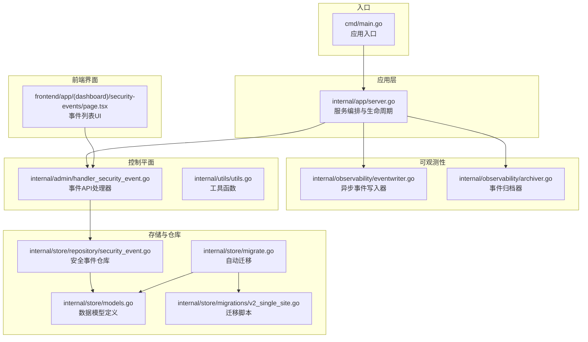
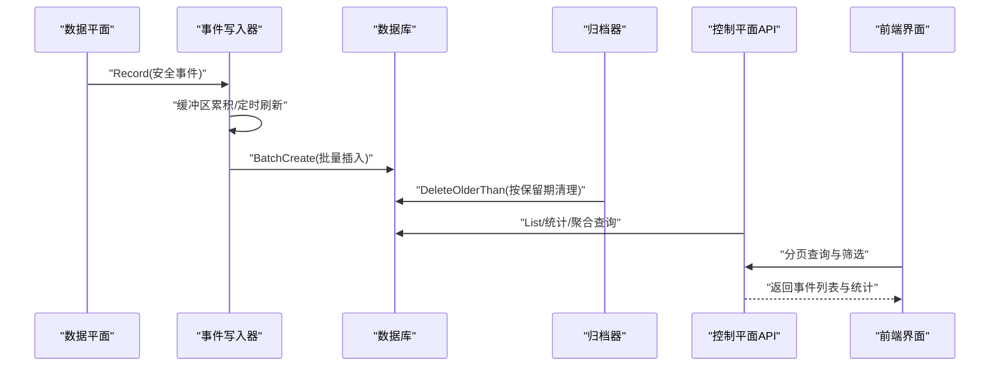
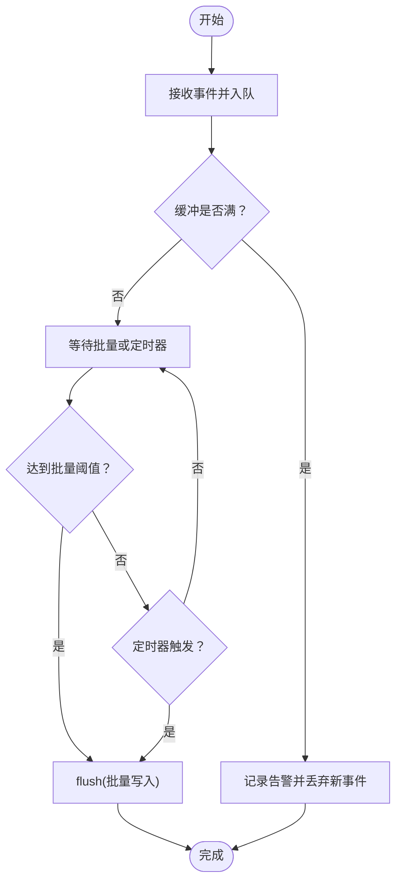
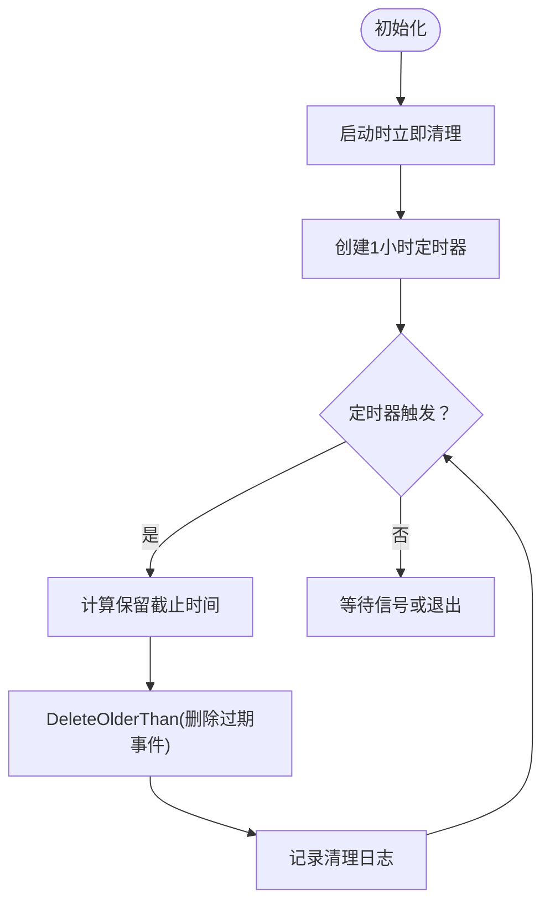
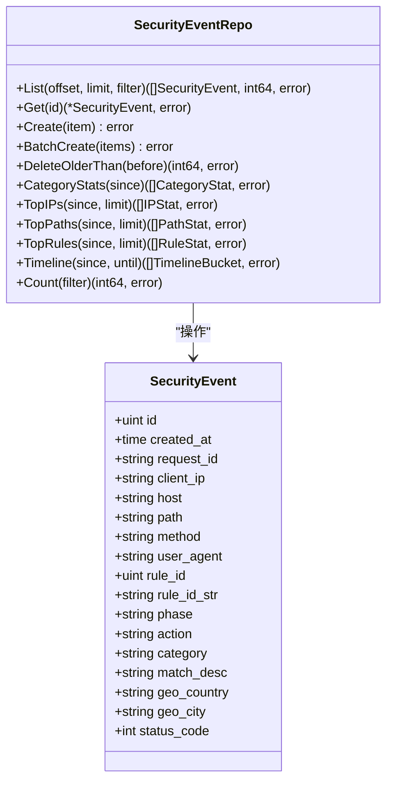
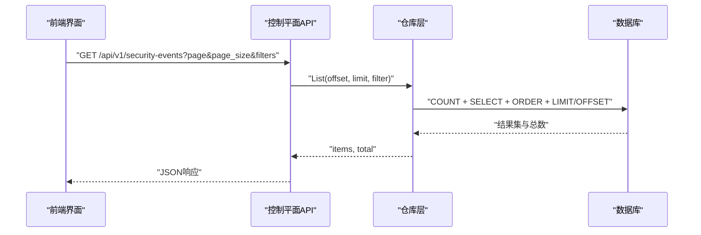
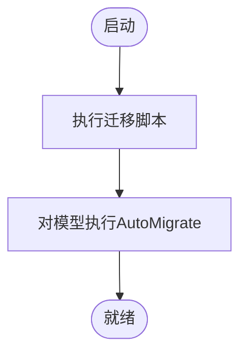
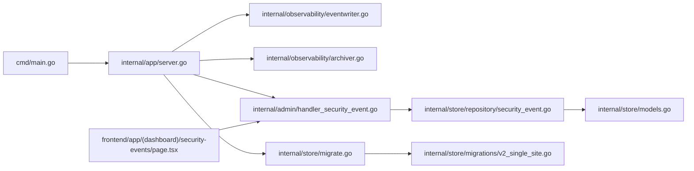

# 事件归档系统

<cite>
**本文档引用的文件**
- [main.go](file://cmd/main.go)
- [server.go](file://internal/app/server.go)
- [archiver.go](file://internal/observability/archiver.go)
- [eventwriter.go](file://internal/observability/eventwriter.go)
- [security_event.go](file://internal/store/repository/security_event.go)
- [models.go](file://internal/store/models.go)
- [migrate.go](file://internal/store/migrate.go)
- [v2_single_site.go](file://internal/store/migrations/v2_single_site.go)
- [handler_security_event.go](file://internal/admin/handler_security_event.go)
- [utils.go](file://internal/utils/utils.go)
- [page.tsx](file://frontend/app/(dashboard)/security-events/page.tsx)
- [config.go](file://internal/core/config.go)
</cite>

## 目录
1. [简介](#简介)
2. [项目结构](#项目结构)
3. [核心组件](#核心组件)
4. [架构总览](#架构总览)
5. [详细组件分析](#详细组件分析)
6. [依赖关系分析](#依赖关系分析)
7. [性能考虑](#性能考虑)
8. [故障排除指南](#故障排除指南)
9. [结论](#结论)
10. [附录](#附录)

## 简介
本文件为事件归档系统的综合技术文档，围绕安全事件的采集、存储、归档、检索与运维管理进行系统化说明。内容涵盖数据保留策略、存储层级设计、归档任务调度、数据迁移与版本兼容、检索优化、配置管理以及备份恢复流程等。

## 项目结构
系统采用分层架构：入口程序启动应用服务，控制平面负责路由与配置，数据平面负责业务处理，可观测性模块负责事件写入与归档，存储层通过 GORM 完成模型持久化与迁移。

**图表来源**
- [main.go:1-10](file://cmd/main.go#L1-L10)
- [server.go:35-100](file://internal/app/server.go#L35-L100)
- [eventwriter.go:12-39](file://internal/observability/eventwriter.go#L12-L39)
- [archiver.go:11-35](file://internal/observability/archiver.go#L11-L35)
- [security_event.go:11-15](file://internal/store/repository/security_event.go#L11-L15)
- [models.go:212-236](file://internal/store/models.go#L212-L236)
- [migrate.go:9-37](file://internal/store/migrate.go#L9-L37)
- [v2_single_site.go:10-20](file://internal/store/migrations/v2_single_site.go#L10-L20)
- [handler_security_event.go:16-57](file://internal/admin/handler_security_event.go#L16-L57)
- [utils.go:10-21](file://internal/utils/utils.go#L10-L21)
- [page.tsx](file://frontend/app/(dashboard)/security-events/page.tsx#L76-L98)

**章节来源**
- [main.go:1-10](file://cmd/main.go#L1-L10)
- [server.go:35-100](file://internal/app/server.go#L35-L100)

## 核心组件
- 事件写入器：非阻塞异步批量写入，避免数据平面被数据库写入阻塞。
- 归档器：周期性删除超过保留期的历史事件，保障存储空间。
- 仓库层：提供事件列表、统计、聚合与删除等操作。
- 控制平面API：支持分页查询、过滤、统计与时间线聚合。
- 前端界面：展示事件列表、统计卡片与分页导航。

**章节来源**
- [eventwriter.go:12-39](file://internal/observability/eventwriter.go#L12-L39)
- [archiver.go:11-35](file://internal/observability/archiver.go#L11-L35)
- [security_event.go:30-66](file://internal/store/repository/security_event.go#L30-L66)
- [handler_security_event.go:16-57](file://internal/admin/handler_security_event.go#L16-L57)
- [page.tsx:60-117](file://frontend/app/(dashboard)/security-events/page.tsx#L60-L117)

## 架构总览
系统在启动时初始化数据库迁移与默认数据，随后启动事件写入器与归档器，并注册控制平面路由。数据平面请求触发事件写入，后台归档器定期清理过期事件；管理员通过 API 查询事件并进行统计分析。

**图表来源**
- [server.go:82-88](file://internal/app/server.go#L82-L88)
- [eventwriter.go:42-93](file://internal/observability/eventwriter.go#L42-L93)
- [archiver.go:59-71](file://internal/observability/archiver.go#L59-L71)
- [handler_security_event.go:16-57](file://internal/admin/handler_security_event.go#L16-L57)
- [page.tsx](file://frontend/app/(dashboard)/security-events/page.tsx#L76-L98)

## 详细组件分析

### 事件写入器（EventWriter）
- 设计目标：非阻塞、高吞吐、低延迟，避免数据平面被数据库写入阻塞。
- 关键参数：缓冲通道容量、批量大小、刷新间隔。
- 写入策略：达到批量阈值或定时器触发时批量写入；关闭时清空剩余事件。

**图表来源**
- [eventwriter.go:42-93](file://internal/observability/eventwriter.go#L42-L93)

**章节来源**
- [eventwriter.go:12-39](file://internal/observability/eventwriter.go#L12-L39)
- [eventwriter.go:95-105](file://internal/observability/eventwriter.go#L95-L105)

### 归档器（Archiver）
- 保留策略：以天为单位配置，默认30天；到期即删除。
- 调度机制：启动即执行一次清理，随后每小时检查一次。
- 清理逻辑：计算截止时间并删除早于该时间的事件，记录清理数量与时间。

**图表来源**
- [archiver.go:42-71](file://internal/observability/archiver.go#L42-L71)

**章节来源**
- [archiver.go:11-35](file://internal/observability/archiver.go#L11-L35)
- [archiver.go:59-71](file://internal/observability/archiver.go#L59-L71)

### 仓库层与数据模型
- 仓库接口：提供分页列表、单条查询、批量创建、按时间删除、统计与聚合等方法。
- 过滤条件：支持动作、阶段、类别、客户端IP、Host、路径、规则ID及时间范围。
- 数据模型：安全事件包含请求标识、客户端IP、Host、路径、方法、UA、规则信息、地理信息、状态码等字段，并带有多种索引。

**图表来源**
- [security_event.go:11-15](file://internal/store/repository/security_event.go#L11-L15)
- [models.go:214-236](file://internal/store/models.go#L214-L236)

**章节来源**
- [security_event.go:17-28](file://internal/store/repository/security_event.go#L17-L28)
- [security_event.go:30-66](file://internal/store/repository/security_event.go#L30-L66)
- [security_event.go:162-191](file://internal/store/repository/security_event.go#L162-L191)
- [models.go:214-236](file://internal/store/models.go#L214-L236)

### 控制平面API与前端交互
- API功能：分页列表、过滤查询、统计与时间线聚合。
- 分页策略：页面与页面大小校验与上限控制，统一偏移与限制计算。
- 前端界面：提供筛选器、分页导航、实时统计与CSV导出。

**图表来源**
- [handler_security_event.go:16-57](file://internal/admin/handler_security_event.go#L16-L57)
- [utils.go:10-21](file://internal/utils/utils.go#L10-L21)
- [page.tsx](file://frontend/app/(dashboard)/security-events/page.tsx#L76-L98)

**章节来源**
- [handler_security_event.go:16-57](file://internal/admin/handler_security_event.go#L16-L57)
- [utils.go:10-21](file://internal/utils/utils.go#L10-L21)
- [page.tsx:60-117](file://frontend/app/(dashboard)/security-events/page.tsx#L60-L117)

### 数据迁移与版本兼容
- 自动迁移：先执行特定迁移脚本，再对所有模型执行自动迁移。
- 迁移脚本：将旧表数据迁移到新表结构，保留历史表为备份，确保平滑过渡。
- 版本兼容：通过系统设置与模型字段兼容策略，保证历史数据可读。

**图表来源**
- [migrate.go:9-37](file://internal/store/migrate.go#L9-L37)
- [v2_single_site.go:16-50](file://internal/store/migrations/v2_single_site.go#L16-L50)

**章节来源**
- [migrate.go:9-37](file://internal/store/migrate.go#L9-L37)
- [v2_single_site.go:10-50](file://internal/store/migrations/v2_single_site.go#L10-L50)

## 依赖关系分析

**图表来源**
- [main.go:1-10](file://cmd/main.go#L1-L10)
- [server.go:35-100](file://internal/app/server.go#L35-L100)
- [eventwriter.go:12-39](file://internal/observability/eventwriter.go#L12-L39)
- [archiver.go:11-35](file://internal/observability/archiver.go#L11-L35)
- [handler_security_event.go:16-57](file://internal/admin/handler_security_event.go#L16-L57)
- [security_event.go:11-15](file://internal/store/repository/security_event.go#L11-L15)
- [models.go:212-236](file://internal/store/models.go#L212-L236)
- [migrate.go:9-37](file://internal/store/migrate.go#L9-L37)
- [v2_single_site.go:10-20](file://internal/store/migrations/v2_single_site.go#L10-L20)
- [page.tsx](file://frontend/app/(dashboard)/security-events/page.tsx#L76-L98)

**章节来源**
- [server.go:35-100](file://internal/app/server.go#L35-L100)

## 性能考虑
- 异步写入：事件写入器使用缓冲通道与批量刷新，降低数据库写入压力，提升数据平面吞吐。
- 归档频率：每小时清理一次，兼顾及时释放空间与减少数据库扫描开销。
- 查询优化：仓库层提供多字段索引与分页查询，统计与聚合查询使用分组与限制，避免全表扫描。
- 前端分页：页面大小上限与偏移计算，防止超大查询导致内存与网络压力。

[本节为通用性能建议，无需具体文件分析]

## 故障排除指南
- 事件丢失：检查事件写入器缓冲是否溢出，关注告警日志；适当增大缓冲或调整批量大小与刷新间隔。
- 归档异常：查看归档器错误日志，确认数据库连接与权限；检查保留天数配置是否合理。
- 查询缓慢：确认过滤条件是否命中索引；避免使用通配符开头的LIKE查询；合理设置分页大小。
- 迁移失败：核对迁移脚本执行顺序与数据库权限；确保备份表命名唯一且无冲突。

**章节来源**
- [eventwriter.go:46-48](file://internal/observability/eventwriter.go#L46-L48)
- [archiver.go:62-64](file://internal/observability/archiver.go#L62-L64)
- [security_event.go:162-191](file://internal/store/repository/security_event.go#L162-L191)

## 结论
事件归档系统通过异步写入与周期性归档实现高吞吐与低成本存储；仓库层提供完善的查询与统计能力；迁移机制保障版本演进与数据兼容；前端界面支持高效检索与导出。建议结合业务量与存储成本动态调整保留期、批量大小与刷新间隔，确保系统稳定与性能平衡。

[本节为总结性内容，无需具体文件分析]

## 附录

### 配置管理要点
- 保留策略：通过归档器构造函数传入保留天数，默认30天；可在部署层面调整。
- 存储空间管理：归档器按保留期定期清理，建议监控磁盘使用率并设置告警。
- 清理规则：基于创建时间字段删除，支持定时任务与手动触发清理。

**章节来源**
- [server.go:86-88](file://internal/app/server.go#L86-L88)
- [archiver.go:21-35](file://internal/observability/archiver.go#L21-L35)

### 数据检索优化
- 索引策略：事件模型包含多个索引字段（如创建时间、请求ID、客户端IP、规则ID等），仓库层查询自动利用索引。
- 查询性能：分页查询使用OFFSET/LIMIT，统计与聚合使用GROUP BY与LIMIT，避免全表扫描。
- 分页机制：统一的分页计算函数，限制最大页面大小，确保查询稳定性。

**章节来源**
- [models.go:214-236](file://internal/store/models.go#L214-L236)
- [security_event.go:30-44](file://internal/store/repository/security_event.go#L30-L44)
- [utils.go:10-21](file://internal/utils/utils.go#L10-L21)

### 备份与恢复流程
- 备份：建议使用数据库原生命令或第三方工具定期备份；迁移脚本会自动为旧表添加备份后缀，便于回滚。
- 恢复：从备份文件恢复数据库后，重新启动应用；应用启动时会执行自动迁移，确保模型与数据一致。

**章节来源**
- [v2_single_site.go:39-49](file://internal/store/migrations/v2_single_site.go#L39-L49)
- [migrate.go:9-37](file://internal/store/migrate.go#L9-L37)