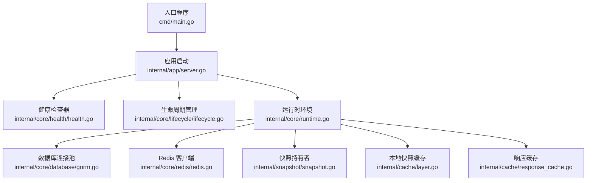
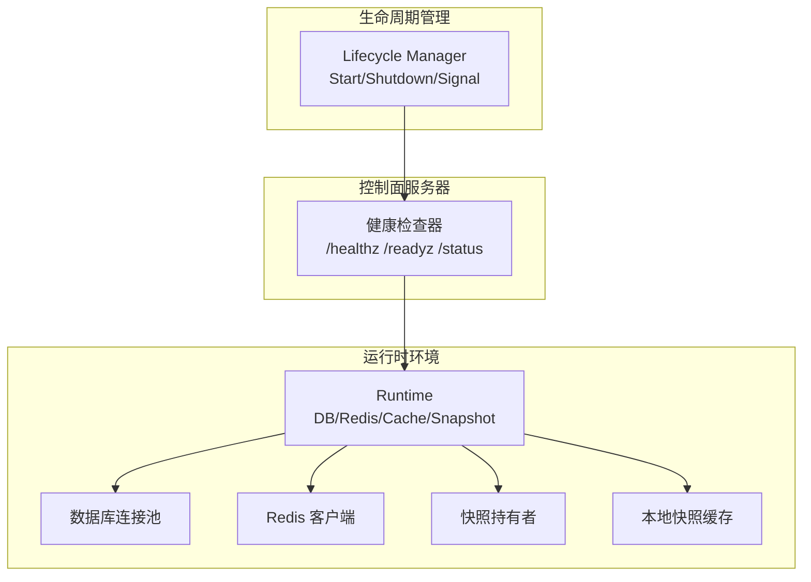
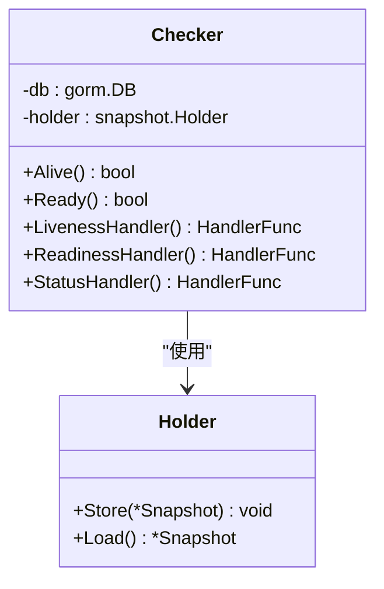
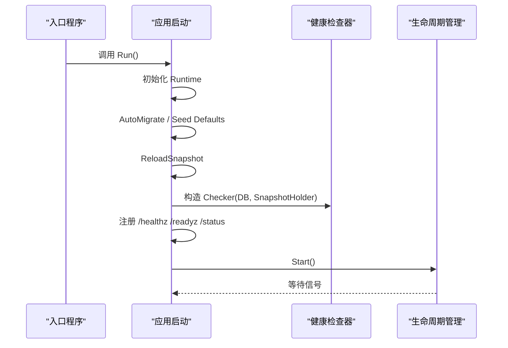
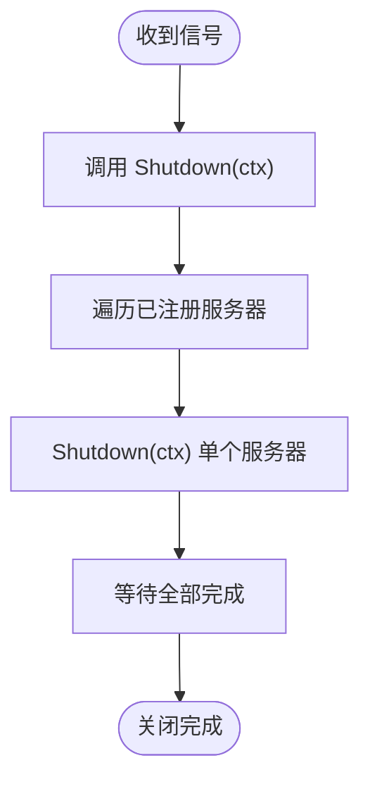
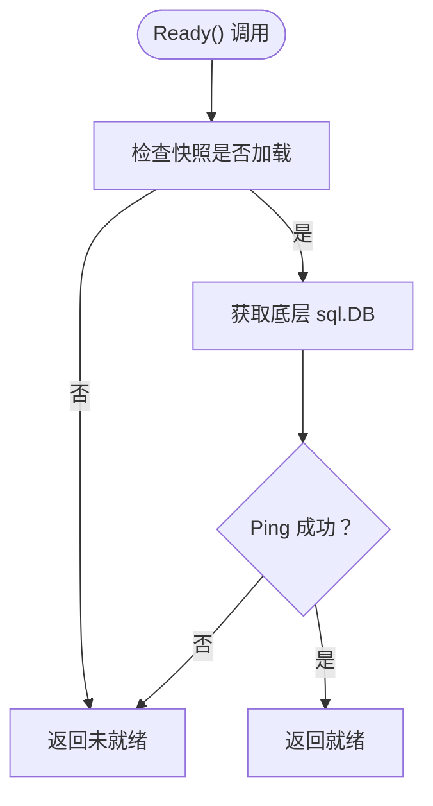
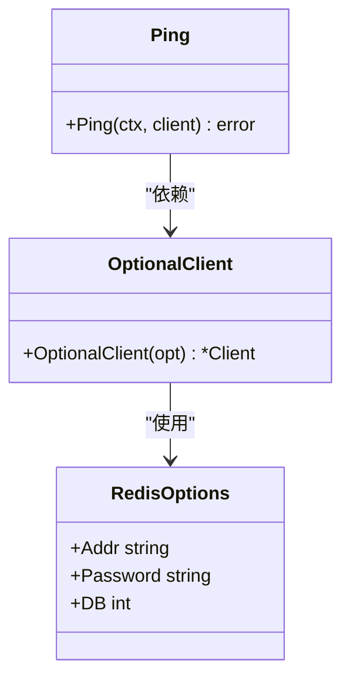
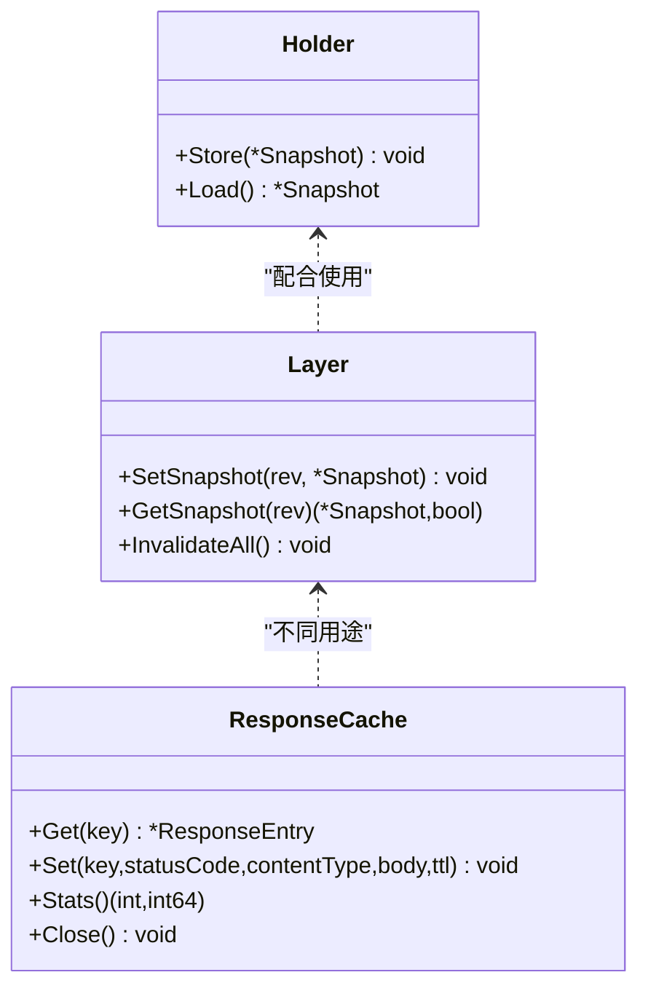
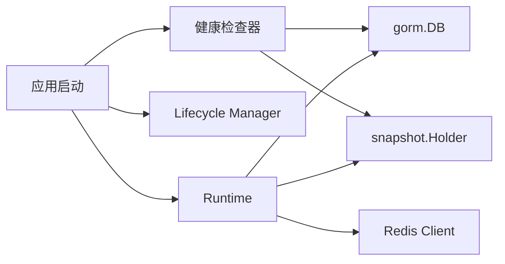

# 健康检查机制

<cite>
**本文档引用的文件**
- [internal/core/health/health.go](file://internal/core/health/health.go)
- [internal/app/server.go](file://internal/app/server.go)
- [internal/core/lifecycle/lifecycle.go](file://internal/core/lifecycle/lifecycle.go)
- [internal/core/runtime.go](file://internal/core/runtime.go)
- [internal/core/database/gorm.go](file://internal/core/database/gorm.go)
- [internal/core/redis/redis.go](file://internal/core/redis/redis.go)
- [internal/snapshot/snapshot.go](file://internal/snapshot/snapshot.go)
- [internal/cache/layer.go](file://internal/cache/layer.go)
- [internal/cache/response_cache.go](file://internal/cache/response_cache.go)
- [cmd/main.go](file://cmd/main.go)
- [docs/监控与可观测性/健康检查机制.md](file://docs/监控与可观测性/健康检查机制.md)
</cite>

## 目录
1. [简介](#简介)
2. [项目结构](#项目结构)
3. [核心组件](#核心组件)
4. [架构总览](#架构总览)
5. [详细组件分析](#详细组件分析)
6. [依赖分析](#依赖分析)
7. [性能考虑](#性能考虑)
8. [故障排查指南](#故障排查指南)
9. [结论](#结论)
10. [附录](#附录)

## 简介
本文件系统化阐述 My-OpenWaf 的健康检查机制，覆盖存活探针（/healthz）、就绪探针（/readyz）与状态查询（/status）的实现原理与行为边界；解释健康检查的触发条件与检查周期；说明数据库连接检查、分布式缓存可用性检测与外部依赖服务验证；并给出生命周期管理（启动顺序、优雅关闭与重启策略）、配置指南（检查间隔、超时与重试）、以及常见故障排查方法。

## 项目结构
健康检查相关代码主要分布在以下模块：
- 核心健康检查：internal/core/health/health.go
- 应用入口与路由注册：internal/app/server.go
- 生命周期管理：internal/core/lifecycle/lifecycle.go
- 运行时环境与依赖注入：internal/core/runtime.go
- 数据库连接池与驱动：internal/core/database/gorm.go
- Redis 客户端与可用性检测：internal/core/redis/redis.go
- 快照与配置快照缓存：internal/snapshot/snapshot.go、internal/cache/layer.go、internal/cache/response_cache.go
- 入口程序：cmd/main.go

**图表来源**
- [cmd/main.go:1-10](file://cmd/main.go#L1-L10)
- [internal/app/server.go:35-305](file://internal/app/server.go#L35-L305)
- [internal/core/health/health.go:14-94](file://internal/core/health/health.go#L14-L94)
- [internal/core/lifecycle/lifecycle.go:31-178](file://internal/core/lifecycle/lifecycle.go#L31-L178)
- [internal/core/runtime.go:27-127](file://internal/core/runtime.go#L27-L127)
- [internal/core/database/gorm.go:24-111](file://internal/core/database/gorm.go#L24-L111)
- [internal/core/redis/redis.go:17-39](file://internal/core/redis/redis.go#L17-L39)
- [internal/snapshot/snapshot.go:98-105](file://internal/snapshot/snapshot.go#L98-L105)
- [internal/cache/layer.go:19-65](file://internal/cache/layer.go#L19-L65)
- [internal/cache/response_cache.go:25-163](file://internal/cache/response_cache.go#L25-L163)

**章节来源**
- [cmd/main.go:1-10](file://cmd/main.go#L1-L10)
- [internal/app/server.go:35-305](file://internal/app/server.go#L35-L305)

## 核心组件
- 健康检查器（Checker）
  - 提供存活探针（Alive）、就绪探针（Ready）与状态查询（Status）能力
  - 存活探针始终返回"健康"，用于进程存活判定
  - 就绪探针要求：已加载配置快照且数据库可连通
  - 状态查询返回运行时指标（如 goroutine 数、堆内存、站点数、监听器数等）
- 应用层路由
  - 在控制面服务器上注册 /healthz、/readyz、/status 路由
- 生命周期管理（Lifecycle Manager）
  - 统一管理多个 Hertz 服务器的启动、优雅关闭与信号处理
- 运行时环境（Runtime）
  - 初始化数据库、可选 Redis、本地快照缓存，并在启动阶段构建初始快照
- 数据库与连接池
  - 支持 SQLite、MySQL、PostgreSQL；非 SQLite 使用连接池参数优化
- Redis 可用性检测
  - 可选启用，通过 Ping 检测连接可用性
- 快照与缓存
  - 快照持有者为原子指针，保证读写安全
  - 本地快照缓存与响应缓存分别服务于不同场景

**章节来源**
- [internal/core/health/health.go:14-94](file://internal/core/health/health.go#L14-L94)
- [internal/app/server.go:268-284](file://internal/app/server.go#L268-L284)
- [internal/core/lifecycle/lifecycle.go:31-178](file://internal/core/lifecycle/lifecycle.go#L31-L178)
- [internal/core/runtime.go:27-127](file://internal/core/runtime.go#L27-L127)
- [internal/core/database/gorm.go:24-111](file://internal/core/database/gorm.go#L24-L111)
- [internal/core/redis/redis.go:17-39](file://internal/core/redis/redis.go#L17-L39)
- [internal/snapshot/snapshot.go:98-105](file://internal/snapshot/snapshot.go#L98-L105)
- [internal/cache/layer.go:19-65](file://internal/cache/layer.go#L19-L65)
- [internal/cache/response_cache.go:25-163](file://internal/cache/response_cache.go#L25-L163)

## 架构总览
健康检查在控制面服务器中以 HTTP 探针形式暴露，结合运行时环境中的数据库与快照状态进行判断。生命周期管理负责统一启动与优雅关闭，确保探针在服务可用期间稳定提供。

**图表来源**
- [internal/app/server.go:268-284](file://internal/app/server.go#L268-L284)
- [internal/core/health/health.go:14-94](file://internal/core/health/health.go#L14-L94)
- [internal/core/runtime.go:27-127](file://internal/core/runtime.go#L27-L127)
- [internal/core/lifecycle/lifecycle.go:31-178](file://internal/core/lifecycle/lifecycle.go#L31-L178)

## 详细组件分析

### 健康检查器（Checker）
- 存活探针（/healthz）
  - 判定逻辑：进程可达即健康
  - 返回码：200 表示健康，503 表示不健康
- 就绪探针（/readyz）
  - 判定逻辑：必须满足两个条件
    - 配置快照已加载（快照持有者非空）
    - 数据库连接可 ping 通
  - 返回码：200 表示就绪，503 表示未就绪
- 状态查询（/status）
  - 返回字段：alive、ready、revision、sites、listeners、goroutines、heap_alloc、go_version、num_cpu
  - 用于运维观察与自动化监控集成

**图表来源**
- [internal/core/health/health.go:14-94](file://internal/core/health/health.go#L14-L94)
- [internal/snapshot/snapshot.go:98-105](file://internal/snapshot/snapshot.go#L98-L105)

**章节来源**
- [internal/core/health/health.go:25-94](file://internal/core/health/health.go#L25-L94)

### 应用启动与路由注册
- 启动流程要点
  - 创建运行时（初始化数据库、可选 Redis、本地缓存与快照持有者）
  - 自动迁移数据库
  - 种子数据与管理员凭据处理
  - 构建初始快照
  - 注册健康检查路由到控制面服务器
  - 启动生命周期管理器并等待信号
- 健康检查路由
  - /healthz -> 存活探针
  - /readyz -> 就绪探针
  - /status -> 状态查询

**图表来源**
- [cmd/main.go:7-9](file://cmd/main.go#L7-L9)
- [internal/app/server.go:35-305](file://internal/app/server.go#L35-L305)
- [internal/core/health/health.go:20-23](file://internal/core/health/health.go#L20-L23)

**章节来源**
- [internal/app/server.go:35-305](file://internal/app/server.go#L35-L305)

### 生命周期管理（优雅关闭与重启）
- 启动顺序
  - 控制面服务器先于数据面监听器启动
  - 每个站点根据快照生成独立监听器实例
- 优雅关闭
  - 默认超时：10 秒
  - 并发优雅关闭所有已注册服务器
- 信号处理
  - 监听 SIGINT/SIGTERM，触发统一优雅关闭流程

**图表来源**
- [internal/core/lifecycle/lifecycle.go:151-178](file://internal/core/lifecycle/lifecycle.go#L151-L178)

**章节来源**
- [internal/core/lifecycle/lifecycle.go:31-178](file://internal/core/lifecycle/lifecycle.go#L31-L178)

### 数据库连接检查与连接池
- 支持驱动：SQLite、MySQL、PostgreSQL
- 连接池优化（非 SQLite）
  - 最大打开连接数、最大空闲连接数、连接最大生命周期、连接最大空闲时间
- 连接可用性检测
  - 通过底层 sql.DB.Ping() 判断数据库可达性

**图表来源**
- [internal/core/health/health.go:28-38](file://internal/core/health/health.go#L28-L38)
- [internal/core/database/gorm.go:49-58](file://internal/core/database/gorm.go#L49-L58)

**章节来源**
- [internal/core/database/gorm.go:24-111](file://internal/core/database/gorm.go#L24-L111)
- [internal/core/health/health.go:28-38](file://internal/core/health/health.go#L28-L38)

### Redis 可用性检测与分布式能力
- 可选启用：当地址为空时不创建客户端
- 可用性检测：通过 Ping(ctx) 判断
- 分布式共享状态：RedisKV 用于跨节点共享（如限流计数、响应缓存等）

**图表来源**
- [internal/core/redis/redis.go:10-39](file://internal/core/redis/redis.go#L10-L39)

**章节来源**
- [internal/core/redis/redis.go:17-39](file://internal/core/redis/redis.go#L17-L39)

### 快照与缓存
- 快照持有者（Holder）
  - 原子指针存储当前快照，支持并发读取
- 本地快照缓存（Layer）
  - 基于 ristretto 的进程内缓存，按修订号键缓存快照
- 响应缓存（ResponseCache）
  - 内存 LRU-like 缓存，分片锁降低竞争，后台清理过期条目

**图表来源**
- [internal/snapshot/snapshot.go:98-105](file://internal/snapshot/snapshot.go#L98-L105)
- [internal/cache/layer.go:19-65](file://internal/cache/layer.go#L19-L65)
- [internal/cache/response_cache.go:25-163](file://internal/cache/response_cache.go#L25-L163)

**章节来源**
- [internal/snapshot/snapshot.go:98-105](file://internal/snapshot/snapshot.go#L98-L105)
- [internal/cache/layer.go:19-65](file://internal/cache/layer.go#L19-L65)
- [internal/cache/response_cache.go:25-163](file://internal/cache/response_cache.go#L25-L163)

## 依赖分析
- 健康检查器依赖
  - 数据库连接（gorm.DB）用于 Ping 检查
  - 快照持有者（snapshot.Holder）用于确认配置已加载
- 应用层依赖
  - 健康检查器由应用启动时构造并注册到控制面服务器
  - 生命周期管理器统一管理服务器启停
- 运行时依赖
  - 数据库与 Redis 在启动阶段初始化并通过 Ping 检测
  - 快照在启动阶段构建并放入 Holder

**图表来源**
- [internal/core/health/health.go:14-23](file://internal/core/health/health.go#L14-L23)
- [internal/app/server.go:136-137](file://internal/app/server.go#L136-L137)
- [internal/core/runtime.go:41-79](file://internal/core/runtime.go#L41-L79)

**章节来源**
- [internal/core/health/health.go:14-23](file://internal/core/health/health.go#L14-L23)
- [internal/app/server.go:136-137](file://internal/app/server.go#L136-L137)
- [internal/core/runtime.go:41-79](file://internal/core/runtime.go#L41-L79)

## 性能考虑
- 就绪探针仅做轻量检查（快照加载 + 数据库 Ping），避免阻塞
- 连接池参数针对非 SQLite 场景优化，减少连接争用
- 响应缓存采用分片锁与后台清理，降低热路径开销
- 生命周期管理并发优雅关闭，缩短停机时间

## 故障排查指南
- /healthz 始终 200
  - 现象：探针一直显示健康
  - 原因：存活探针逻辑恒为健康
  - 处理：关注 /readyz 与 /status
- /readyz 503
  - 现象：服务未就绪
  - 可能原因
    - 快照未加载：检查启动日志与 ReloadSnapshot 是否成功
    - 数据库不可达：检查数据库驱动、DSN、网络连通性
    - 数据库 Ping 失败：查看数据库连接池状态与后端可用性
  - 处理建议
    - 确认数据库配置正确（驱动、DSN、数据目录）
    - 查看数据库日志与网络状况
    - 重新触发一次快照构建与 ReloadSnapshot
- /status 返回异常或延迟
  - 现象：状态接口响应慢或失败
  - 可能原因
    - 快照过大导致序列化/反序列化开销
    - 运行时 goroutine 数过多或内存占用高
  - 处理建议
    - 观察 sites/listeners 数量变化
    - 检查 goroutine 与 heap_alloc 指标
- Redis 可用性问题
  - 现象：Redis Ping 失败
  - 可能原因：地址为空（未启用）、网络不通、认证失败
  - 处理建议：检查 Redis 地址、密码、DB 索引与网络连通性
- 优雅关闭失败
  - 现象：关闭超时或部分服务器未停止
  - 可能原因：单个服务器处理耗时请求
  - 处理建议：调整默认关闭超时（代码中固定为 10 秒），优化业务处理逻辑

**章节来源**
- [internal/core/health/health.go:25-94](file://internal/core/health/health.go#L25-L94)
- [internal/core/runtime.go:41-79](file://internal/core/runtime.go#L41-L79)
- [internal/core/database/gorm.go:49-58](file://internal/core/database/gorm.go#L49-L58)
- [internal/core/redis/redis.go:17-39](file://internal/core/redis/redis.go#L17-L39)
- [internal/core/lifecycle/lifecycle.go:151-178](file://internal/core/lifecycle/lifecycle.go#L151-L178)

## 结论
本项目的健康检查机制以轻量、明确的判定逻辑为核心：存活探针保障进程可达，就绪探针保障数据库与配置快照可用，状态查询提供运行时可观测信息。结合生命周期管理的优雅关闭与信号处理，形成完整的健康检查闭环。实际部署中应重点关注数据库可用性与快照加载，合理配置数据库连接池与 Redis 参数，以获得稳定的健康检查表现。

## 附录

### 健康检查触发条件与检查周期
- 触发条件
  - /healthz：进程可达即健康
  - /readyz：快照已加载且数据库 Ping 成功
  - /status：返回运行时指标
- 检查周期
  - 代码中未定义固定周期；通常由外部监控系统按需轮询

**章节来源**
- [internal/core/health/health.go:25-94](file://internal/core/health/health.go#L25-L94)

### 健康检查配置指南
- 数据库配置
  - 驱动：sqlite | mysql | postgres
  - DSN：SQLite 文件路径或完整 DSN
  - 数据目录：SQLite 无 DSN 时的默认位置
- Redis 配置（可选）
  - 地址、密码、DB 索引
- 控制面绑定
  - 管理端口绑定地址
- 连接池参数（非 SQLite）
  - 最大打开连接数、最大空闲连接数、连接最大生命周期、连接最大空闲时间
- 检查间隔、超时与重试
  - 代码未内置固定周期与超时；建议由外部监控系统自行配置

**章节来源**
- [internal/core/config.go:74-182](file://internal/core/config.go#L74-L182)
- [internal/core/database/gorm.go:49-58](file://internal/core/database/gorm.go#L49-L58)
- [internal/core/redis/redis.go:22-29](file://internal/core/redis/redis.go#L22-L29)