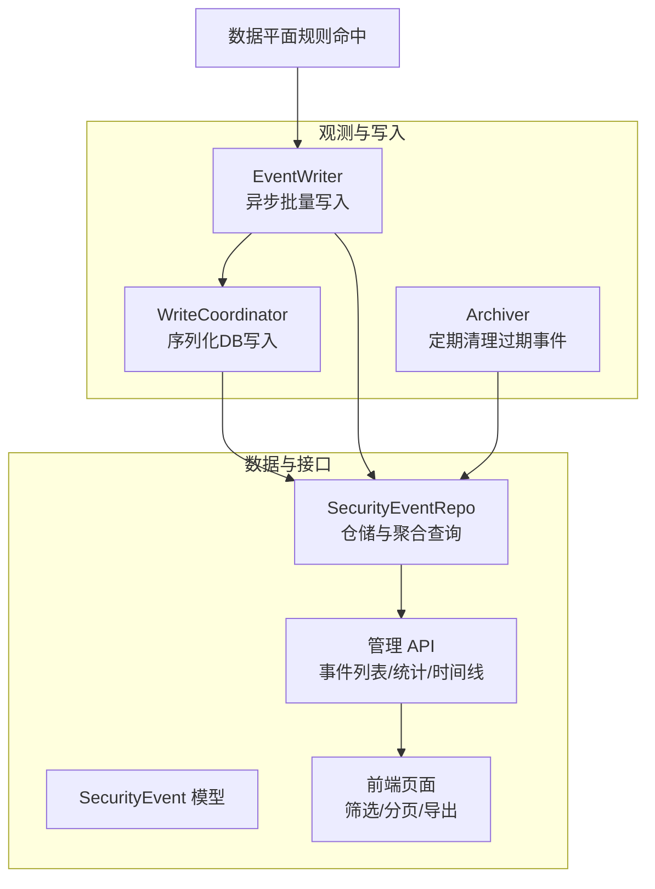
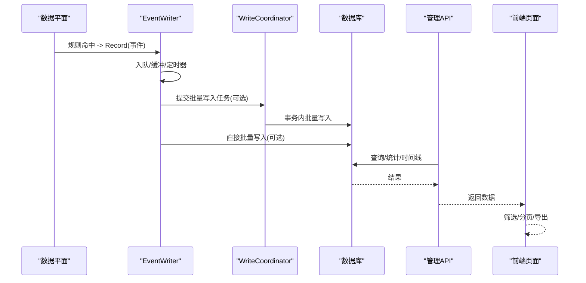
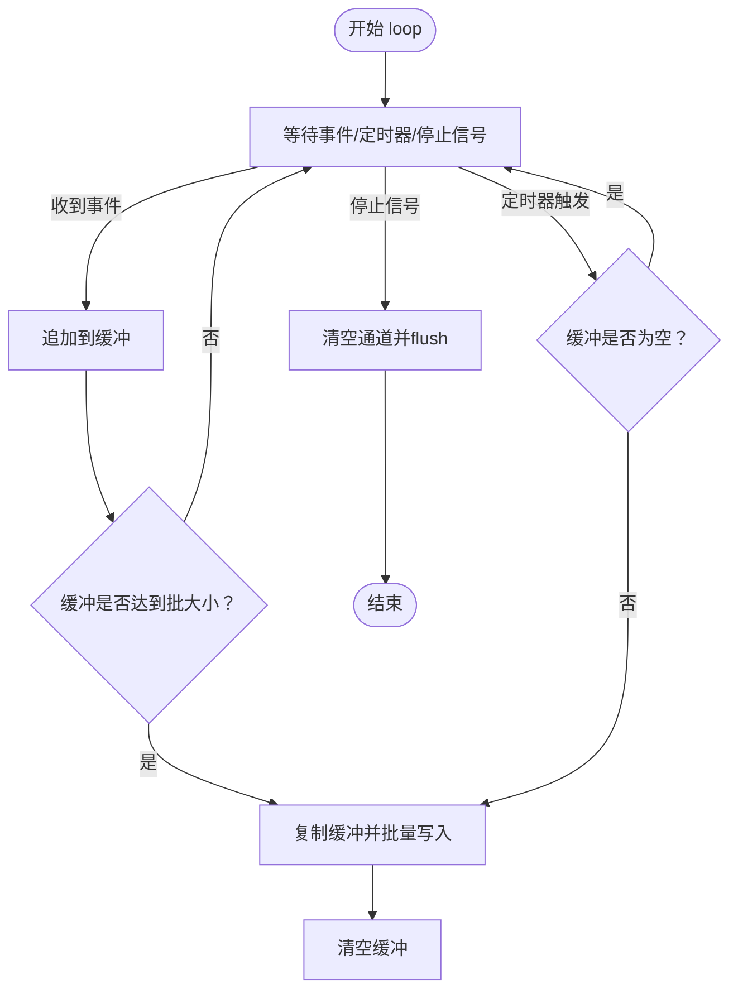
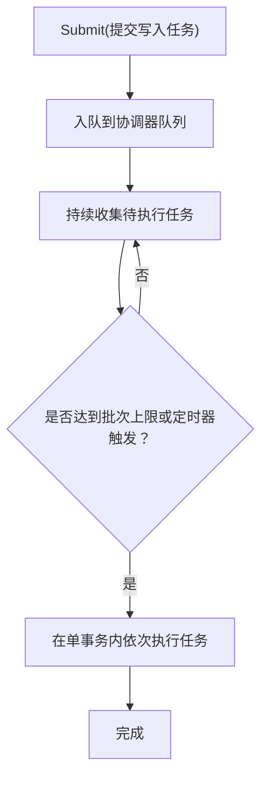
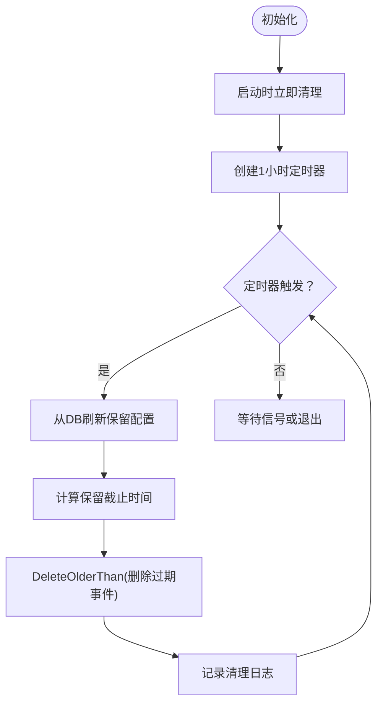
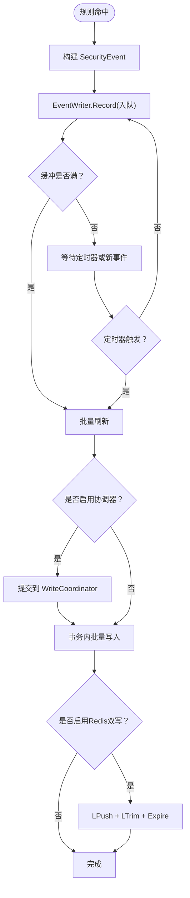
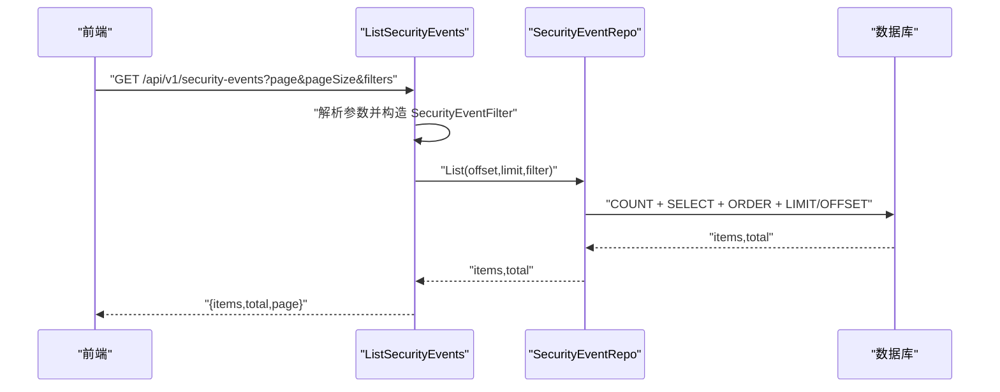
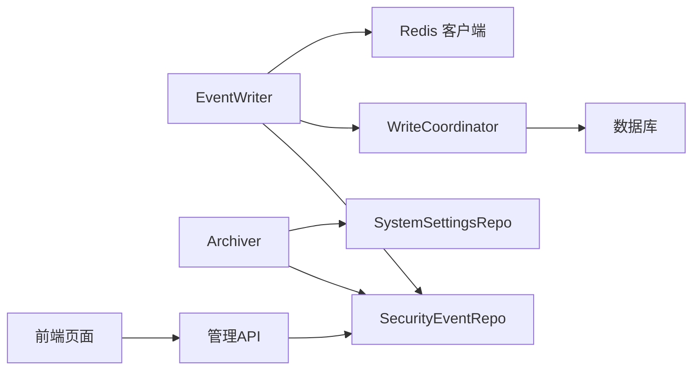
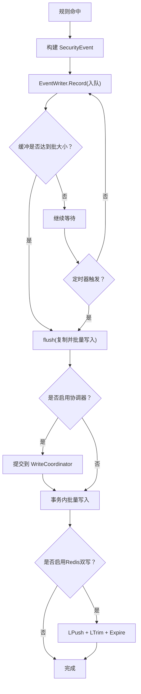

# 安全事件记录

<cite>
**本文引用的文件**
- [internal/observability/eventwriter.go](file://internal/observability/eventwriter.go)
- [internal/observability/archiver.go](file://internal/observability/archiver.go)
- [internal/observability/writecoordinator.go](file://internal/observability/writecoordinator.go)
- [internal/store/events.go](file://internal/store/events.go)
- [internal/store/repository/security_event.go](file://internal/store/repository/security_event.go)
- [internal/admin/event/security.go](file://internal/admin/event/security.go)
- [frontend/app/(dashboard)/security-events/page.tsx](file://frontend/app/(dashboard)/security-events/page.tsx)
- [docs/监控与可观测性/安全事件记录.md](file://docs/监控与可观测性/安全事件记录.md)
- [docs/管理 API 系统/安全事件 API.md](file://docs/管理 API 系统/安全事件 API.md)
- [docs/扩展与插件/第三方集成/监控系统集成.md](file://docs/扩展与插件/第三方集成/监控系统集成.md)
- [docs/数据平面处理/性能监控与调优.md](file://docs/数据平面处理/性能监控与调优.md)
- [internal/app/server.go](file://internal/app/server.go)
- [internal/core/config.go](file://internal/core/config.go)
</cite>

## 目录
1. [简介](#简介)
2. [项目结构](#项目结构)
3. [核心组件](#核心组件)
4. [架构总览](#架构总览)
5. [详细组件分析](#详细组件分析)
6. [依赖分析](#依赖分析)
7. [性能考量](#性能考量)
8. [故障排查指南](#故障排查指南)
9. [结论](#结论)
10. [附录](#附录)

## 简介
本文件面向安全事件记录系统，围绕事件写入器的异步批量写入机制、事件数据模型、查询接口与分页、配置参数与性能调优、以及故障排查进行全面技术说明。系统通过事件写入器将规则命中产生的安全事件异步写入数据库，避免阻塞数据平面热路径；同时提供归档器定期清理过期事件，以及管理 API 的查询、统计与时间线接口，支撑运营与安全部门的审计与可视化。

## 项目结构
安全事件记录相关的关键模块分布如下：
- 观测与写入：事件写入器、写入协调器、归档器
- 数据模型与仓储：事件模型、事件仓储与聚合查询
- 管理 API：事件列表、详情、站点事件、统计与时间线
- 前端页面：事件列表、筛选、分页与导出
- 文档与配置：安全事件记录文档、API 文档、监控集成文档、性能调优文档、服务端配置



**图表来源**
- [internal/observability/eventwriter.go:19-62](file://internal/observability/eventwriter.go#L19-L62)
- [internal/observability/writecoordinator.go:11-39](file://internal/observability/writecoordinator.go#L11-L39)
- [internal/observability/archiver.go:31-66](file://internal/observability/archiver.go#L31-L66)
- [internal/store/events.go:5-29](file://internal/store/events.go#L5-L29)
- [internal/store/repository/security_event.go:17-30](file://internal/store/repository/security_event.go#L17-L30)
- [internal/admin/event/security.go:17-59](file://internal/admin/event/security.go#L17-L59)
- [frontend/app/(dashboard)/security-events/page.tsx:73-125](file://frontend/app/(dashboard)/security-events/page.tsx#L73-L125)

**章节来源**
- [internal/observability/eventwriter.go:19-62](file://internal/observability/eventwriter.go#L19-L62)
- [internal/store/events.go:5-29](file://internal/store/events.go#L5-L29)
- [internal/store/repository/security_event.go:17-30](file://internal/store/repository/security_event.go#L17-L30)
- [internal/admin/event/security.go:17-59](file://internal/admin/event/security.go#L17-L59)
- [frontend/app/(dashboard)/security-events/page.tsx:73-125](file://frontend/app/(dashboard)/security-events/page.tsx#L73-L125)

## 核心组件
- 事件写入器（EventWriter）：基于有界通道的异步写入器，支持批量阈值与定时刷新，缓冲满时丢弃并记录警告，保证数据平面不被阻塞。
- 写入协调器（WriteCoordinator）：序列化所有数据库写入，避免并发写导致的锁争用，支持批量合并提交。
- 归档器（Archiver）：按保留期定期清理过期事件，支持动态从系统设置读取保留配置。
- 事件模型与仓储：定义事件字段、索引与常用查询过滤；提供批量写入、聚合统计与时间线查询。
- 管理 API：提供事件列表、站点事件、统计与时间线接口，支持分页与丰富过滤条件。
- 前端页面：提供筛选、分页、导出 CSV 等能力，与管理 API 协同使用。

**章节来源**
- [internal/observability/eventwriter.go:64-116](file://internal/observability/eventwriter.go#L64-L116)
- [internal/observability/writecoordinator.go:41-129](file://internal/observability/writecoordinator.go#L41-L129)
- [internal/observability/archiver.go:101-153](file://internal/observability/archiver.go#L101-L153)
- [internal/store/events.go:5-29](file://internal/store/events.go#L5-L29)
- [internal/store/repository/security_event.go:17-30](file://internal/store/repository/security_event.go#L17-L30)
- [internal/admin/event/security.go:17-59](file://internal/admin/event/security.go#L17-L59)
- [frontend/app/(dashboard)/security-events/page.tsx:73-125](file://frontend/app/(dashboard)/security-events/page.tsx#L73-L125)

## 架构总览
系统通过数据平面规则命中生成事件，交由事件写入器异步写入数据库；写入器可选地通过写入协调器串行化写入，避免 SQLite 并发写锁；同时归档器按保留期定期清理历史事件；管理 API 提供查询、统计与时间线接口，前端页面负责筛选与分页展示。



**图表来源**
- [internal/observability/eventwriter.go:80-116](file://internal/observability/eventwriter.go#L80-L116)
- [internal/observability/writecoordinator.go:58-129](file://internal/observability/writecoordinator.go#L58-L129)
- [internal/store/repository/security_event.go:32-46](file://internal/store/repository/security_event.go#L32-L46)
- [internal/admin/event/security.go:17-59](file://internal/admin/event/security.go#L17-L59)
- [frontend/app/(dashboard)/security-events/page.tsx:73-125](file://frontend/app/(dashboard)/security-events/page.tsx#L73-L125)

## 详细组件分析

### 事件写入器（EventWriter）
- 缓冲与背压：使用有界通道（容量默认 16384），满时非阻塞丢弃并记录警告日志，确保热路径不被阻塞。
- 批量与定时：内部缓冲达到阈值（默认 256）或定时器触发（默认 5 秒）时复制缓冲并批量写入。
- Redis 双写：可选地将事件推送到 Redis 列表，用于实时消费（如 SIEM、仪表盘），并设置 TTL 防止无限增长。
- 关闭流程：关闭时发送停止信号，清空剩余事件并等待工作协程退出。
- 写入协调：可选设置写入协调器，将批量写入提交给协调器统一执行，避免并发写冲突。



**图表来源**
- [internal/observability/eventwriter.go:80-116](file://internal/observability/eventwriter.go#L80-L116)

**章节来源**
- [internal/observability/eventwriter.go:38-51](file://internal/observability/eventwriter.go#L38-L51)
- [internal/observability/eventwriter.go:64-72](file://internal/observability/eventwriter.go#L64-L72)
- [internal/observability/eventwriter.go:80-116](file://internal/observability/eventwriter.go#L80-L116)
- [internal/observability/eventwriter.go:118-139](file://internal/observability/eventwriter.go#L118-L139)
- [internal/observability/eventwriter.go:141-163](file://internal/observability/eventwriter.go#L141-L163)

### 写入协调器（WriteCoordinator）
- 序列化写入：将多个写入任务排队，按顺序在单个事务内执行，降低并发写带来的锁争用。
- 批量合并：在定时器触发或队列积压时，将多个待执行任务合并为一批，减少事务开销。
- 背压保护：协调器队列满时丢弃新任务并记录警告，避免写入器侧压力过大。



**图表来源**
- [internal/observability/writecoordinator.go:41-129](file://internal/observability/writecoordinator.go#L41-L129)

**章节来源**
- [internal/observability/writecoordinator.go:11-39](file://internal/observability/writecoordinator.go#L11-L39)
- [internal/observability/writecoordinator.go:41-129](file://internal/observability/writecoordinator.go#L41-L129)

### 归档器（Archiver）
- 保留策略：按天配置保留期（默认 30 天），支持动态从系统设置读取最新配置。
- 调度机制：启动即执行一次清理，随后每小时检查一次并删除过期事件。
- 清理逻辑：计算截止时间并删除早于该时间的事件，记录清理数量与时间。



**图表来源**
- [internal/observability/archiver.go:83-153](file://internal/observability/archiver.go#L83-L153)

**章节来源**
- [internal/observability/archiver.go:31-66](file://internal/observability/archiver.go#L31-L66)
- [internal/observability/archiver.go:101-153](file://internal/observability/archiver.go#L101-L153)

### 事件数据模型与字段定义
事件模型包含以下关键字段与约束：
- 时间戳：自动记录创建时间，带索引，支持按时间范围过滤。
- 请求标识：请求ID，带索引，支持按请求ID查询。
- 源IP：客户端IP，带索引，支持按IP筛选。
- 目标站点：Host，带索引，支持按站点过滤。
- 路径与方法：Path（最大长度 2048）、Method，支持模糊匹配与精确过滤。
- 用户代理：User-Agent，支持审计与溯源。
- 规则信息：RuleID、RuleIDStr（规则ID字符串）、Phase（阶段）、Action（动作）、Category（类别）、MatchDesc（匹配描述）。
- 地理位置：GeoCountry、GeoCity。
- 状态码：StatusCode，默认 0。

```mermaid
erDiagram
SECURITY_EVENT {
uint id PK
time created_at IK
uint site_id IK
string request_id IK
string client_ip IK
string host IK
string path
string method
string user_agent
uint rule_id
string rule_id_str IK
string phase IK
string action IK
string category IK
string match_desc
string geo_country
string geo_city
int status_code
}
```

**图表来源**
- [internal/store/events.go:5-29](file://internal/store/events.go#L5-L29)

**章节来源**
- [internal/store/events.go:5-29](file://internal/store/events.go#L5-L29)

### 事件写入流程与性能优化
- 异步缓冲：事件写入器使用有界通道，满载时丢弃并记录警告，避免阻塞数据平面。
- 批量写入：仓储使用批量插入接口，减少数据库往返次数。
- 定时刷新：定时器触发未达批大小时也可批量写入，平衡延迟与吞吐。
- 写入协调：在 SQLite 环境下通过协调器串行化写入，避免锁争用。
- Redis 双写：实时推送事件至 Redis，支持外部系统消费，同时设置 TTL 防止无限增长。
- 连接池优化：非 SQLite 驱动设置最大连接数、空闲连接数与生命周期，提升并发性能。
- 索引策略：事件模型在常用查询字段上建立索引，提高过滤与统计效率。



**图表来源**
- [internal/observability/eventwriter.go:64-116](file://internal/observability/eventwriter.go#L64-L116)
- [internal/observability/writecoordinator.go:41-129](file://internal/observability/writecoordinator.go#L41-L129)
- [internal/observability/eventwriter.go:141-163](file://internal/observability/eventwriter.go#L141-L163)

**章节来源**
- [internal/observability/eventwriter.go:64-116](file://internal/observability/eventwriter.go#L64-L116)
- [internal/observability/writecoordinator.go:41-129](file://internal/observability/writecoordinator.go#L41-L129)
- [internal/observability/eventwriter.go:141-163](file://internal/observability/eventwriter.go#L141-L163)

### 事件查询接口与分页机制
- 接口路径：GET /api/v1/security-events
- 查询参数：
  - 分页：page（页码）、page_size（每页条数）
  - 过滤：action（动作）、phase（阶段）、category（类别）、client_ip（客户端 IP）、host（主机）、path（路径）、rule_id（规则 ID）、rule_id_str（规则ID字符串）、since（起始时间 RFC3339）、until（结束时间 RFC3339）
- 返回：
  - items：事件数组
  - total：满足条件的总条数
  - page：当前页码
- 分页算法：offset = (page - 1) × page_size，limit = page_size
- 时间线接口：按小时聚合返回 buckets 与 count，用于绘制事件趋势图。



**图表来源**
- [internal/admin/event/security.go:17-59](file://internal/admin/event/security.go#L17-L59)
- [internal/store/repository/security_event.go:32-46](file://internal/store/repository/security_event.go#L32-L46)

**章节来源**
- [internal/admin/event/security.go:17-59](file://internal/admin/event/security.go#L17-L59)
- [internal/store/repository/security_event.go:17-30](file://internal/store/repository/security_event.go#L17-L30)
- [internal/store/repository/security_event.go:257-292](file://internal/store/repository/security_event.go#L257-L292)

### 前端使用与筛选
- 前端页面提供动作、类别、IP、Host、路径、规则ID、时间范围等筛选项，支持重置筛选与分页。
- 页面加载时并行请求事件列表与统计，支持导出 CSV。
- 分页逻辑与管理 API 一致，确保前后端一致。

**章节来源**
- [frontend/app/(dashboard)/security-events/page.tsx:73-125](file://frontend/app/(dashboard)/security-events/page.tsx#L73-L125)
- [frontend/app/(dashboard)/security-events/page.tsx:236-254](file://frontend/app/(dashboard)/security-events/page.tsx#L236-L254)

## 依赖分析
- 事件写入器依赖仓储与可选的写入协调器与 Redis 客户端。
- 写入协调器依赖数据库连接，负责批量事务执行。
- 归档器依赖事件仓储与系统设置仓储，动态读取保留配置。
- 管理 API 依赖事件仓储与工具函数，提供分页与过滤。
- 前端页面依赖管理 API 与 UI 组件，负责筛选与展示。



**图表来源**
- [internal/observability/eventwriter.go:19-62](file://internal/observability/eventwriter.go#L19-L62)
- [internal/observability/writecoordinator.go:16-39](file://internal/observability/writecoordinator.go#L16-L39)
- [internal/observability/archiver.go:32-71](file://internal/observability/archiver.go#L32-L71)
- [internal/admin/event/security.go:17-59](file://internal/admin/event/security.go#L17-L59)
- [frontend/app/(dashboard)/security-events/page.tsx:73-125](file://frontend/app/(dashboard)/security-events/page.tsx#L73-L125)

**章节来源**
- [internal/observability/eventwriter.go:19-62](file://internal/observability/eventwriter.go#L19-L62)
- [internal/observability/writecoordinator.go:16-39](file://internal/observability/writecoordinator.go#L16-L39)
- [internal/observability/archiver.go:32-71](file://internal/observability/archiver.go#L32-L71)
- [internal/admin/event/security.go:17-59](file://internal/admin/event/security.go#L17-L59)
- [frontend/app/(dashboard)/security-events/page.tsx:73-125](file://frontend/app/(dashboard)/security-events/page.tsx#L73-L125)

## 性能考量
- 异步写入：事件写入器使用缓冲与定时器，显著降低写入对热路径的影响。
- 批量插入：仓储使用批量插入接口，减少数据库往返次数。
- 写入协调：在 SQLite 环境下通过协调器串行化写入，避免锁争用。
- 连接池优化：非 SQLite 驱动设置最大连接数、空闲连接数与生命周期，提升并发性能。
- 索引策略：事件模型在常用查询字段上建立索引，提高过滤与统计效率。
- 清理策略：归档器定期清理过期事件，避免表膨胀影响查询性能。
- Redis 双写：实时推送事件至 Redis，支持外部系统消费，同时设置 TTL 防止无限增长。

**章节来源**
- [docs/监控与可观测性/安全事件记录.md:369-381](file://docs/监控与可观测性/安全事件记录.md#L369-L381)
- [docs/扩展与插件/第三方集成/监控系统集成.md:408-417](file://docs/扩展与插件/第三方集成/监控系统集成.md#L408-L417)
- [docs/数据平面处理/性能监控与调优.md:280-445](file://docs/数据平面处理/性能监控与调优.md#L280-L445)

## 故障排查指南
- 事件丢失：检查事件写入器缓冲是否频繁满载，关注日志中的“缓冲已满”警告；适当增大缓冲或降低写入速率。
- 写入失败：查看事件写入器错误日志，确认数据库连接与权限；检查写入协调器队列是否满载。
- 查询缓慢：确认过滤条件是否命中索引，必要时调整查询范围或增加索引；检查分页参数是否合理。
- 存储增长：检查归档器运行状态与保留期配置，确保定期清理；确认 Redis 列表是否因 TTL 正常修剪。
- 前端无数据：确认管理接口返回状态与数据结构，检查前端筛选参数与分页逻辑；核对时间范围与站点过滤。

**章节来源**
- [docs/监控与可观测性/安全事件记录.md:383-396](file://docs/监控与可观测性/安全事件记录.md#L383-L396)
- [docs/管理 API 系统/安全事件 API.md:375-394](file://docs/管理 API 系统/安全事件 API.md#L375-L394)
- [internal/observability/eventwriter.go:69-71](file://internal/observability/eventwriter.go#L69-L71)
- [internal/observability/writecoordinator.go:47-49](file://internal/observability/writecoordinator.go#L47-L49)
- [internal/observability/archiver.go:120-128](file://internal/observability/archiver.go#L120-L128)

## 结论
该安全事件记录系统通过事件写入器实现非阻塞的异步批量写入，配合归档器与统计聚合接口，形成完整的事件采集、存储与可视化的闭环。模型设计覆盖关键审计字段，接口支持灵活过滤与导出，满足合规与运营需求。建议结合实际业务场景优化索引与轮询频率，并在生产环境完善告警与审计策略。

## 附录

### 事件写入配置参数
- 事件写入器
  - 批大小：默认 256
  - 刷新间隔：默认 5 秒
  - 缓冲容量：默认 16384
  - Redis TTL：默认 7 天
- 写入协调器
  - 队列容量：默认 64
  - 合并批次上限：默认 16
  - 合并间隔：默认 100ms
- 归档器
  - 清理间隔：默认 1 小时
  - 保留期（事件）：默认 30 天
  - 保留期（访问日志/丢弃事件/统计）：事件保留期一致

**章节来源**
- [internal/observability/eventwriter.go:38-51](file://internal/observability/eventwriter.go#L38-L51)
- [internal/observability/writecoordinator.go:28-39](file://internal/observability/writecoordinator.go#L28-L39)
- [internal/observability/archiver.go:44-66](file://internal/observability/archiver.go#L44-L66)

### 事件写入与持久化流程


**图表来源**
- [internal/observability/eventwriter.go:80-116](file://internal/observability/eventwriter.go#L80-L116)
- [internal/observability/writecoordinator.go:58-129](file://internal/observability/writecoordinator.go#L58-L129)
- [internal/observability/eventwriter.go:141-163](file://internal/observability/eventwriter.go#L141-L163)