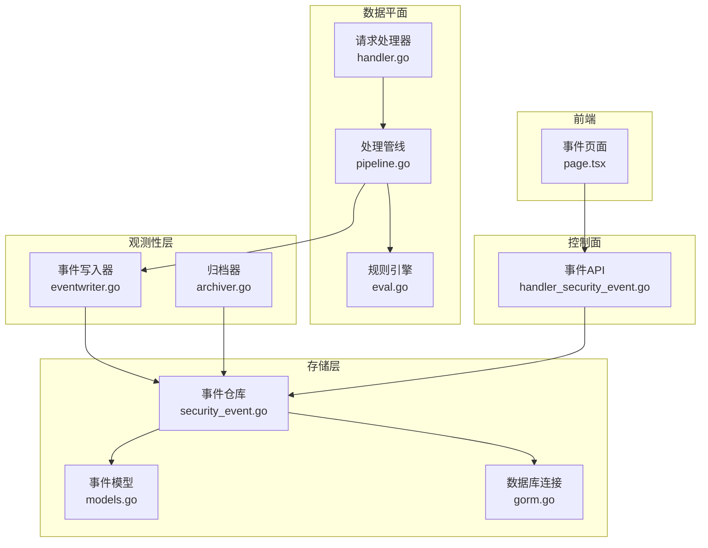
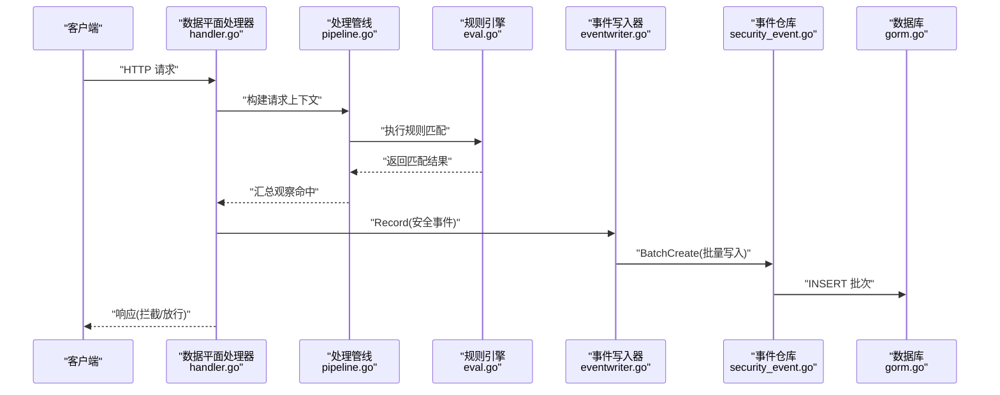
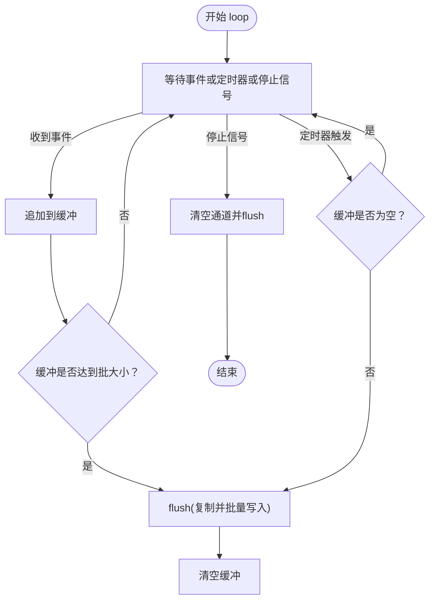
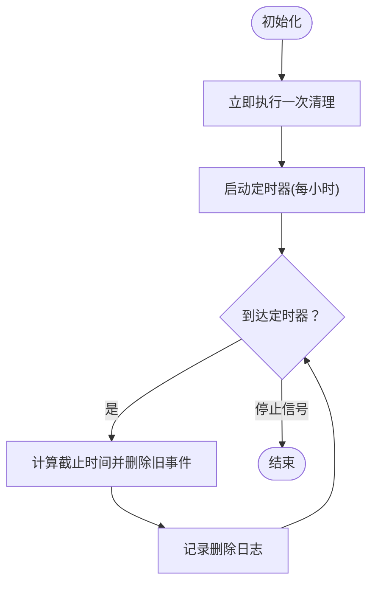
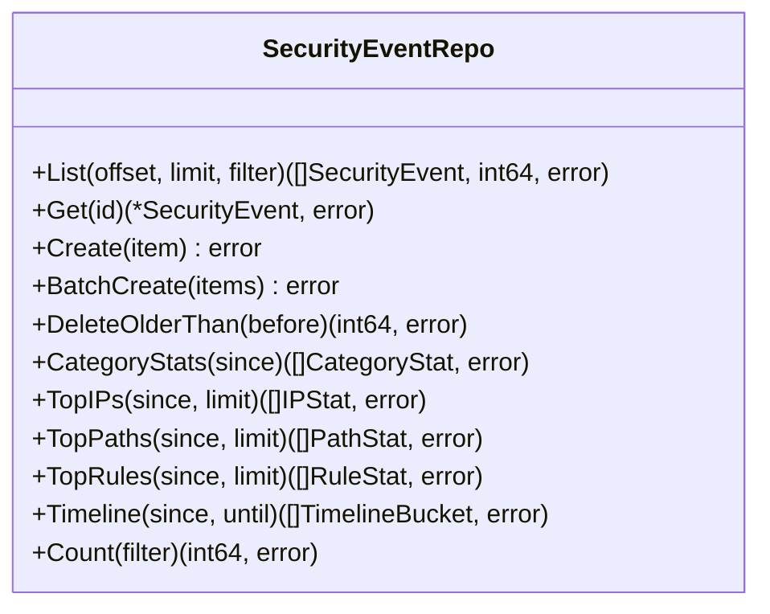
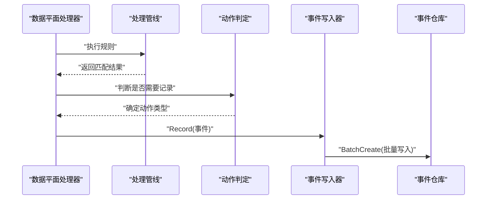
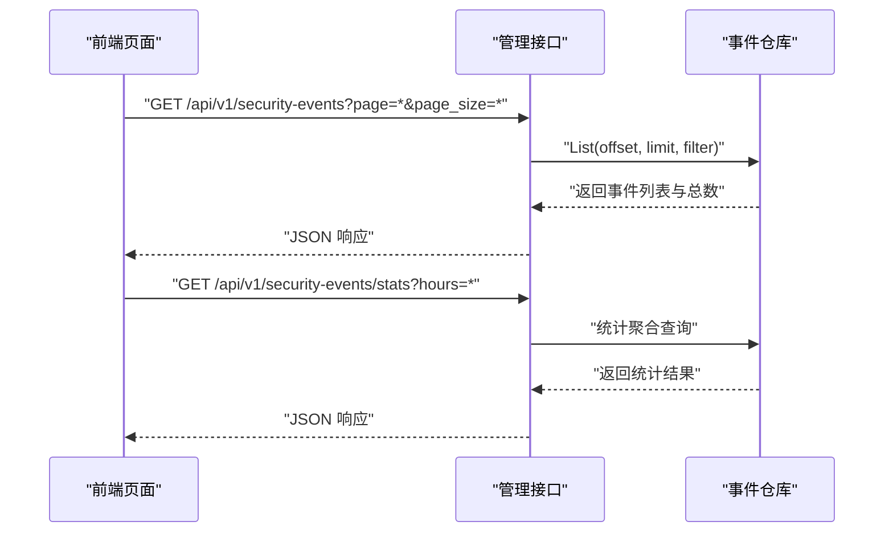
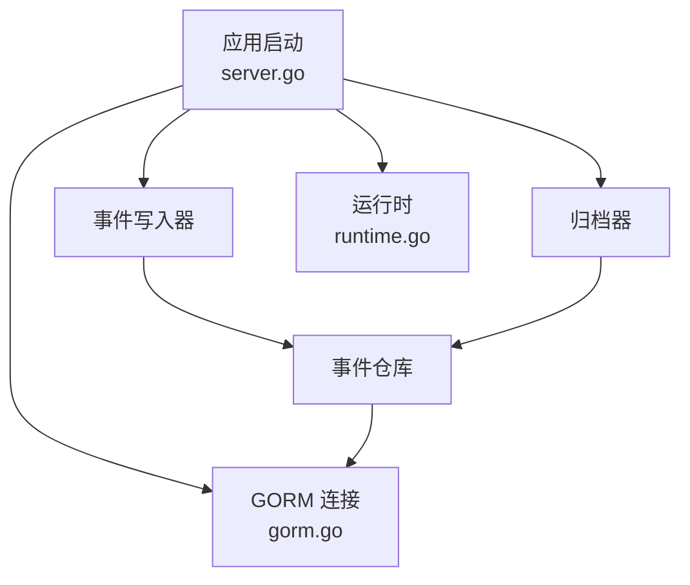

# 安全事件记录

<cite>
**本文引用的文件**
- [eventwriter.go](file://internal/observability/eventwriter.go)
- [archiver.go](file://internal/observability/archiver.go)
- [security_event.go](file://internal/store/repository/security_event.go)
- [models.go](file://internal/store/models.go)
- [handler_security_event.go](file://internal/admin/handler_security_event.go)
- [page.tsx](file://frontend/app/(dashboard)/security-events/page.tsx)
- [handler.go](file://internal/dataplane/handler.go)
- [server.go](file://internal/app/server.go)
- [gorm.go](file://internal/core/database/gorm.go)
- [runtime.go](file://internal/core/runtime.go)
- [action.go](file://internal/core/action/action.go)
- [pipeline.go](file://internal/core/pipeline/pipeline.go)
- [eval.go](file://internal/waf/eval.go)
</cite>

## 目录
1. [简介](#简介)
2. [项目结构](#项目结构)
3. [核心组件](#核心组件)
4. [架构总览](#架构总览)
5. [详细组件分析](#详细组件分析)
6. [依赖分析](#依赖分析)
7. [性能考量](#性能考量)
8. [故障排查指南](#故障排查指南)
9. [结论](#结论)
10. [附录](#附录)

## 简介
本文件面向安全事件记录系统，围绕事件写入器的实现机制展开，涵盖事件类型分类、数据格式标准化、存储策略、过滤与聚合、存储后端选择与配置、导出与备份策略以及事件触发时机与处理流程。文档以代码为依据，结合可视化图示帮助读者快速理解系统设计与运行方式。

## 项目结构
安全事件记录系统由以下关键模块组成：
- 数据平面：在请求处理过程中根据规则匹配结果生成安全事件，并通过事件写入器异步落库。
- 观测性层：事件写入器负责缓冲与批量写入；归档器负责定期清理过期事件。
- 存储层：基于 GORM 的仓库模式，提供列表、统计、删除等操作。
- 控制面：管理接口提供事件查询、统计与时间线聚合。
- 前端：提供事件列表、筛选、统计卡片与导出功能。



**图表来源**
- [handler.go:104-198](file://internal/dataplane/handler.go#L104-L198)
- [eval.go:1-123](file://internal/waf/eval.go#L1-L123)
- [pipeline.go:1-66](file://internal/core/pipeline/pipeline.go#L1-L66)
- [eventwriter.go:1-105](file://internal/observability/eventwriter.go#L1-L105)
- [security_event.go:1-192](file://internal/store/repository/security_event.go#L1-L192)
- [models.go:211-235](file://internal/store/models.go#L211-L235)
- [gorm.go:1-89](file://internal/core/database/gorm.go#L1-L89)
- [handler_security_event.go:1-127](file://internal/admin/handler_security_event.go#L1-L127)
- [page.tsx](file://frontend/app/(dashboard)/security-events/page.tsx#L1-L442)

**章节来源**
- [server.go:82-88](file://internal/app/server.go#L82-L88)
- [handler.go:104-198](file://internal/dataplane/handler.go#L104-L198)
- [eventwriter.go:1-105](file://internal/observability/eventwriter.go#L1-L105)
- [security_event.go:1-192](file://internal/store/repository/security_event.go#L1-L192)
- [models.go:211-235](file://internal/store/models.go#L211-L235)
- [handler_security_event.go:1-127](file://internal/admin/handler_security_event.go#L1-L127)
- [page.tsx](file://frontend/app/(dashboard)/security-events/page.tsx#L1-L442)

## 核心组件
- 事件写入器（EventWriter）：在数据平面非阻塞地接收事件，使用环形缓冲与定时器进行批量写入，避免阻塞热路径。
- 归档器（Archiver）：周期性删除超过保留期的事件，降低存储压力。
- 事件仓库（SecurityEventRepo）：提供事件列表、统计、删除、批量插入等能力。
- 事件模型（SecurityEvent）：标准化事件字段，包含时间戳、攻击类型、源IP、目标站点、规则信息等。
- 管理接口（handler_security_event.go）：提供事件列表、详情、统计与时间线查询。
- 前端页面（page.tsx）：展示事件列表、筛选、统计卡片与导出功能。

**章节来源**
- [eventwriter.go:12-55](file://internal/observability/eventwriter.go#L12-L55)
- [archiver.go:11-40](file://internal/observability/archiver.go#L11-L40)
- [security_event.go:11-60](file://internal/store/repository/security_event.go#L11-L60)
- [models.go:213-235](file://internal/store/models.go#L213-L235)
- [handler_security_event.go:16-127](file://internal/admin/handler_security_event.go#L16-L127)
- [page.tsx](file://frontend/app/(dashboard)/security-events/page.tsx#L60-L120)

## 架构总览
事件从数据平面产生，经由事件写入器异步批量写入数据库，同时归档器定期清理历史数据。控制面提供查询与统计接口，前端页面实时展示事件并支持导出。



**图表来源**
- [handler.go:104-198](file://internal/dataplane/handler.go#L104-L198)
- [pipeline.go:46-65](file://internal/core/pipeline/pipeline.go#L46-L65)
- [eval.go:1-123](file://internal/waf/eval.go#L1-L123)
- [eventwriter.go:95-104](file://internal/observability/eventwriter.go#L95-L104)
- [security_event.go:55-60](file://internal/store/repository/security_event.go#L55-L60)
- [gorm.go:24-61](file://internal/core/database/gorm.go#L24-L61)

## 详细组件分析

### 事件写入器（EventWriter）
- 缓冲与背压：使用有界通道（容量4096），满时丢弃新事件并记录警告日志，确保热路径不被阻塞。
- 批量写入：内部缓冲达到阈值或定时器触发时，复制缓冲并调用仓库的批量插入接口。
- 配置参数：批大小（默认64）、刷新间隔（默认2秒）。
- 关闭流程：关闭停止信号后，清空剩余事件并等待工作协程退出。



**图表来源**
- [eventwriter.go:57-93](file://internal/observability/eventwriter.go#L57-L93)

**章节来源**
- [eventwriter.go:12-55](file://internal/observability/eventwriter.go#L12-L55)
- [eventwriter.go:57-93](file://internal/observability/eventwriter.go#L57-L93)
- [eventwriter.go:95-104](file://internal/observability/eventwriter.go#L95-L104)

### 归档器（Archiver）
- 定期清理：启动即执行一次清理，随后按固定间隔扫描并删除超过保留期的事件。
- 保留期：默认30天，可通过构造函数配置。
- 日志记录：清理成功时输出删除数量与截止时间。



**图表来源**
- [archiver.go:42-71](file://internal/observability/archiver.go#L42-L71)

**章节来源**
- [archiver.go:11-40](file://internal/observability/archiver.go#L11-L40)
- [archiver.go:42-71](file://internal/observability/archiver.go#L42-L71)

### 事件仓库与过滤聚合
- 过滤条件：支持按动作、阶段、类别、源IP、Host、Path、规则ID、时间范围过滤。
- 列表查询：分页返回事件列表与总数，按主键倒序。
- 统计聚合：
  - 类别分布：按类别统计数量。
  - Top 源IP：统计来源IP数量并排序取前N。
  - Top 路径：统计路径数量并排序取前N。
  - Top 规则：统计规则ID字符串数量并排序取前N。
  - 时间线：按小时分桶统计事件数。
- 删除旧数据：按时间删除早于指定时间的事件。



**图表来源**
- [security_event.go:11-192](file://internal/store/repository/security_event.go#L11-L192)

**章节来源**
- [security_event.go:17-28](file://internal/store/repository/security_event.go#L17-L28)
- [security_event.go:30-44](file://internal/store/repository/security_event.go#L30-L44)
- [security_event.go:75-153](file://internal/store/repository/security_event.go#L75-L153)
- [security_event.go:155-191](file://internal/store/repository/security_event.go#L155-L191)

### 事件数据模型
事件模型包含以下关键字段：
- 时间戳：自动记录创建时间，带索引。
- 请求标识：请求ID，带索引。
- 源IP：客户端IP，带索引。
- 目标站点：Host，带索引。
- 路径与方法：Path（最大长度2048）、Method。
- 用户代理：User-Agent。
- 规则信息：RuleID、RuleIDStr（规则ID字符串）、Phase（阶段）、Action（动作）、Category（类别）、MatchDesc（匹配描述）。
- 地理位置：GeoCountry、GeoCity。
- 状态码：StatusCode，默认0。

```mermaid
erDiagram
SECURITY_EVENT {
uint id PK
time created_at IK
string request_id IK
string client_ip IK
string host IK
string path
string method
string user_agent
uint rule_id IK
string rule_id_str IK
string phase IK
string action IK
string category IK
string match_desc
string geo_country
string geo_city
int status_code
}
```

**图表来源**
- [models.go:213-235](file://internal/store/models.go#L213-L235)

**章节来源**
- [models.go:213-235](file://internal/store/models.go#L213-L235)

### 事件触发与处理流程
- 规则匹配：处理管线依次执行各阶段规则，若匹配且动作需要记录，则收集为“观察命中”。
- 拦截事件：当动作为终止（拦截）时，记录拦截事件并写入状态码403。
- 观察事件：当动作为观察或拦截（非终止）时，记录观察事件。
- 写入事件：通过事件写入器异步批量写入数据库。



**图表来源**
- [handler.go:104-198](file://internal/dataplane/handler.go#L104-L198)
- [pipeline.go:46-65](file://internal/core/pipeline/pipeline.go#L46-L65)
- [action.go:28-49](file://internal/core/action/action.go#L28-L49)
- [eventwriter.go:95-104](file://internal/observability/eventwriter.go#L95-L104)

**章节来源**
- [handler.go:104-198](file://internal/dataplane/handler.go#L104-L198)
- [pipeline.go:46-65](file://internal/core/pipeline/pipeline.go#L46-L65)
- [action.go:28-49](file://internal/core/action/action.go#L28-L49)

### 管理接口与前端展示
- 管理接口：
  - 列表：支持分页与多维过滤。
  - 统计：24小时事件总数、类别分布、Top 源IP、Top 路径、Top 规则。
  - 时间线：按小时分桶统计。
- 前端页面：
  - 支持按动作、类别、源IP筛选。
  - 展示事件列表、分页与统计卡片。
  - 提供CSV导出功能。



**图表来源**
- [handler_security_event.go:16-127](file://internal/admin/handler_security_event.go#L16-L127)
- [security_event.go:75-153](file://internal/store/repository/security_event.go#L75-L153)
- [page.tsx](file://frontend/app/(dashboard)/security-events/page.tsx#L76-L117)

**章节来源**
- [handler_security_event.go:16-127](file://internal/admin/handler_security_event.go#L16-L127)
- [page.tsx](file://frontend/app/(dashboard)/security-events/page.tsx#L60-L120)

## 依赖分析
- 应用启动时创建事件写入器与归档器，并注入到数据平面处理器选项中。
- 数据库连接通过 GORM 打开，支持 SQLite、MySQL、PostgreSQL，针对不同驱动设置连接池与性能参数。
- 运行时负责数据库与缓存的生命周期管理。



**图表来源**
- [server.go:82-88](file://internal/app/server.go#L82-L88)
- [server.go:136-143](file://internal/app/server.go#L136-L143)
- [gorm.go:24-61](file://internal/core/database/gorm.go#L24-L61)
- [runtime.go:52-80](file://internal/core/runtime.go#L52-L80)

**章节来源**
- [server.go:82-88](file://internal/app/server.go#L82-L88)
- [server.go:136-143](file://internal/app/server.go#L136-L143)
- [gorm.go:24-61](file://internal/core/database/gorm.go#L24-L61)
- [runtime.go:52-80](file://internal/core/runtime.go#L52-L80)

## 性能考量
- 异步写入：事件写入器使用缓冲与定时器，显著降低写入对热路径的影响。
- 批量插入：仓库使用批量插入接口，减少数据库往返次数。
- 连接池优化：非SQLite驱动设置最大连接数、空闲连接数与生命周期，提升并发性能。
- 索引策略：事件模型在常用查询字段上建立索引，提高过滤与统计效率。
- 清理策略：归档器定期清理过期事件，避免表膨胀影响查询性能。

**章节来源**
- [eventwriter.go:22-24](file://internal/observability/eventwriter.go#L22-L24)
- [security_event.go:55-60](file://internal/store/repository/security_event.go#L55-L60)
- [gorm.go:49-58](file://internal/core/database/gorm.go#L49-L58)
- [models.go:215-229](file://internal/store/models.go#L215-L229)
- [archiver.go:21-34](file://internal/observability/archiver.go#L21-L34)

## 故障排查指南
- 事件丢失：检查事件写入器缓冲是否频繁满载，关注日志中的“缓冲已满”警告。
- 写入失败：查看事件写入器错误日志，确认数据库连接与权限。
- 查询缓慢：确认过滤条件是否命中索引，必要时调整查询范围或增加索引。
- 存储增长：检查归档器运行状态与保留期配置，确保定期清理。
- 前端无数据：确认管理接口返回状态与数据结构，检查前端筛选参数与分页逻辑。

**章节来源**
- [eventwriter.go:42-48](file://internal/observability/eventwriter.go#L42-L48)
- [eventwriter.go:101-103](file://internal/observability/eventwriter.go#L101-L103)
- [archiver.go:60-70](file://internal/observability/archiver.go#L60-L70)
- [handler_security_event.go:46-56](file://internal/admin/handler_security_event.go#L46-L56)
- [page.tsx](file://frontend/app/(dashboard)/security-events/page.tsx#L76-L98)

## 结论
该安全事件记录系统通过事件写入器实现非阻塞的异步批量写入，配合归档器与统计聚合接口，形成完整的事件采集、存储与可视化的闭环。模型设计覆盖关键审计字段，接口支持灵活过滤与导出，满足合规与运营需求。

## 附录

### 事件类型分类与字段定义
- 动作（Action）：拦截、观察、允许（兼容旧值 block、log_only 已规范化）。
- 阶段（Phase）：如 acl、rate_limit、owasp_default、signature、custom 等。
- 类别（Category）：如 sqli、xss、path_traversal、webshell、revshell、ssrf、cmd_injection、xxe、ldap_injection、nosql_injection、template_injection、file_upload、protocol_violation、bot_malicious、bot_suspicious、rate_limit 等。
- 字段定义：参见事件模型字段与索引设计。

**章节来源**
- [action.go:6-26](file://internal/core/action/action.go#L6-L26)
- [models.go:213-235](file://internal/store/models.go#L213-L235)

### 事件过滤与聚合机制
- 过滤：动作、阶段、类别、源IP、Host、Path、规则ID、时间范围。
- 聚合：类别分布、Top 源IP、Top 路径、Top 规则、时间线（按小时分桶）。

**章节来源**
- [security_event.go:17-28](file://internal/store/repository/security_event.go#L17-L28)
- [security_event.go:162-191](file://internal/store/repository/security_event.go#L162-L191)
- [security_event.go:75-153](file://internal/store/repository/security_event.go#L75-L153)

### 事件存储后端与配置
- 后端支持：SQLite、MySQL、PostgreSQL。
- 连接池：非SQLite驱动设置最大连接数、空闲连接数与生命周期。
- SQLite 特性：启用 WAL、忙等待超时、缓存大小与外键约束优化。

**章节来源**
- [gorm.go:24-61](file://internal/core/database/gorm.go#L24-L61)
- [gorm.go:63-89](file://internal/core/database/gorm.go#L63-L89)

### 事件导出与备份策略
- 导出：前端提供CSV导出功能，便于离线分析与合规审计。
- 备份：建议结合数据库备份方案与归档器保留期策略，确保历史数据可恢复。
- 合规：事件模型包含时间戳、请求ID、源IP、Host、路径、动作、类别、规则ID等关键字段，满足常见合规要求。

**章节来源**
- [page.tsx](file://frontend/app/(dashboard)/security-events/page.tsx#L393-L422)
- [models.go:213-235](file://internal/store/models.go#L213-L235)
- [archiver.go:21-34](file://internal/observability/archiver.go#L21-L34)

### 实际代码示例（触发时机与处理流程）
- 规则匹配与事件记录：在数据平面处理器中，当动作需要记录时，构造事件并通过事件写入器异步写入。
- 批量写入：事件写入器在缓冲满或定时器触发时，复制缓冲并调用仓库批量插入。
- 管理接口：提供事件列表、详情、统计与时间线查询，前端页面支持筛选与导出。

**章节来源**
- [handler.go:104-198](file://internal/dataplane/handler.go#L104-L198)
- [eventwriter.go:95-104](file://internal/observability/eventwriter.go#L95-L104)
- [handler_security_event.go:16-127](file://internal/admin/handler_security_event.go#L16-L127)
- [page.tsx](file://frontend/app/(dashboard)/security-events/page.tsx#L76-L117)