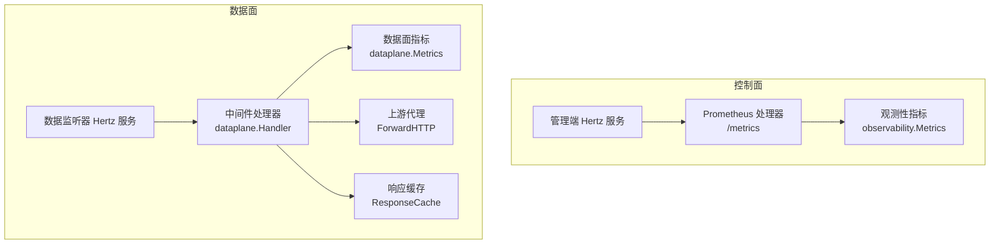
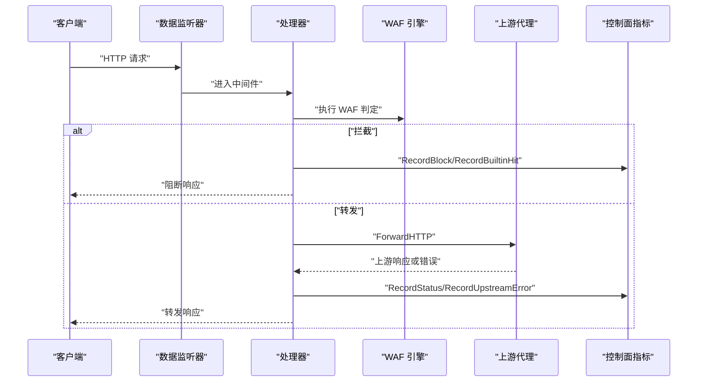
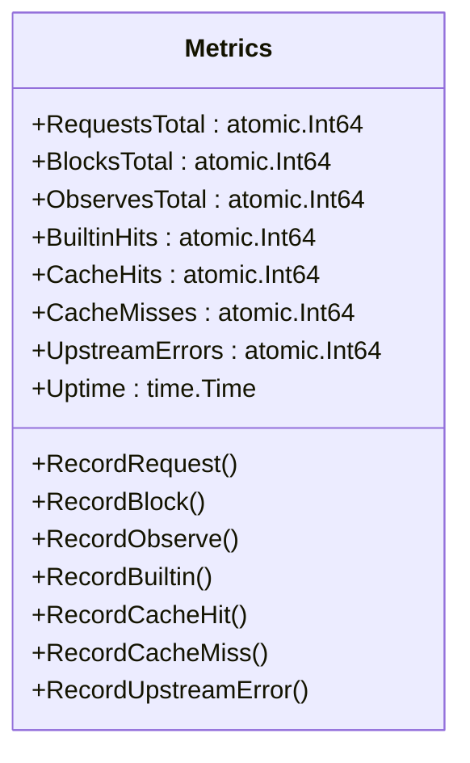
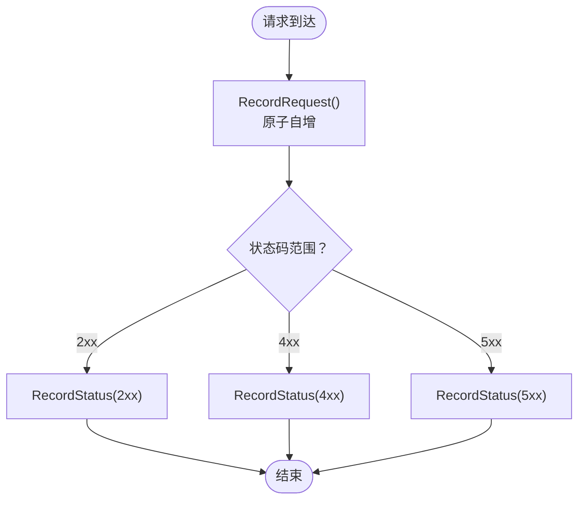
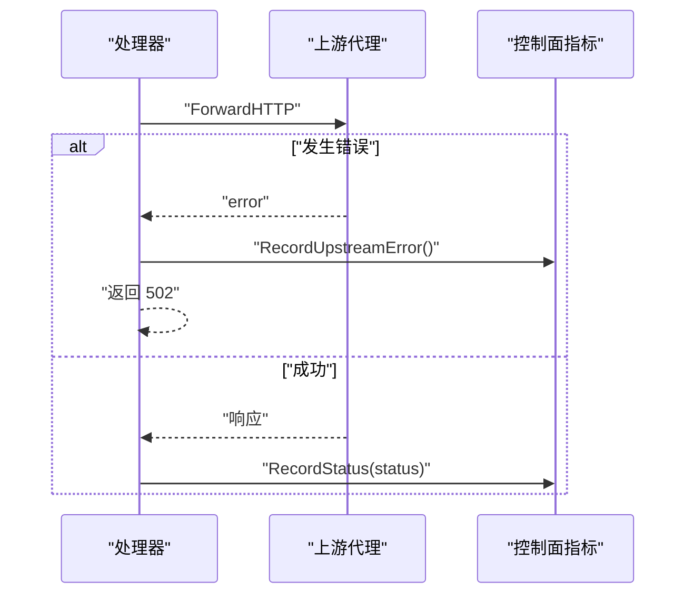
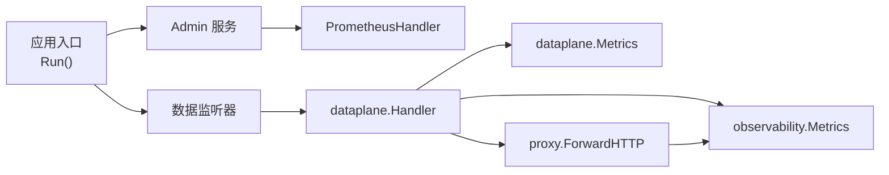

# 性能指标收集

<cite>
**本文档引用的文件**
- [cmd/main.go](file://cmd/main.go)
- [internal/app/server.go](file://internal/app/server.go)
- [internal/observability/metrics.go](file://internal/observability/metrics.go)
- [internal/observability/eventwriter.go](file://internal/observability/eventwriter.go)
- [internal/observability/archiver.go](file://internal/observability/archiver.go)
- [internal/dataplane/metrics.go](file://internal/dataplane/metrics.go)
- [internal/dataplane/handler.go](file://internal/dataplane/handler.go)
- [internal/proxy/proxy.go](file://internal/proxy/proxy.go)
- [internal/upstream/transport.go](file://internal/upstream/transport.go)
- [internal/cache/response_cache.go](file://internal/cache/response_cache.go)
- [internal/waf/ratelimit.go](file://internal/waf/ratelimit.go)
- [frontend/app/(dashboard)/dashboard/page.tsx](file://frontend/app/(dashboard)/dashboard/page.tsx)
</cite>

## 目录
1. [简介](#简介)
2. [项目结构](#项目结构)
3. [核心组件](#核心组件)
4. [架构总览](#架构总览)
5. [详细组件分析](#详细组件分析)
6. [依赖关系分析](#依赖关系分析)
7. [性能考量](#性能考量)
8. [故障排查指南](#故障排查指南)
9. [结论](#结论)
10. [附录](#附录)

## 简介
本文件面向性能指标收集系统，系统性梳理了 OpenWAF 的指标体系与实现，涵盖：
- 内置指标定义与用途：请求数量、阻断数量、观察检测、缓存命中率、上游错误等
- Prometheus 指标暴露机制：指标注册、数据格式与采集协议
- 运行时监控：goroutine 数量、堆内存分配、GC 暂停时间等
- 上游代理错误统计：连接失败、超时、响应异常的分类统计
- 指标查询与分析：常用查询语句、趋势分析与性能基线设定
- 可视化与告警：Grafana 仪表板设计与告警规则配置建议

## 项目结构
OpenWAF 将指标分为两类：
- 控制面（Admin）指标：通过 Prometheus 兼容的 `/metrics` 暴露，包含进程级运行时指标与 WAF 行为计数
- 数据面（Data Plane）指标：在请求处理链路中实时统计，提供 QPS、状态码分布、WAF 命中等

**图表来源**
- [internal/app/server.go:267](file://internal/app/server.go#L267)
- [internal/observability/metrics.go:52](file://internal/observability/metrics.go#L52)
- [internal/dataplane/handler.go:37](file://internal/dataplane/handler.go#L37)
- [internal/proxy/proxy.go:74](file://internal/proxy/proxy.go#L74)
- [internal/cache/response_cache.go:27](file://internal/cache/response_cache.go#L27)

**章节来源**
- [cmd/main.go:7-9](file://cmd/main.go#L7-L9)
- [internal/app/server.go:35-300](file://internal/app/server.go#L35-L300)

## 核心组件
- 控制面指标（Prometheus）
  - 指标类型：计数器（counter）与仪表（gauge）
  - 关键指标：总请求数、阻断总数、观察检测总数、内置规则命中、缓存命中/未命中、上游错误、进程运行时（goroutines、heap alloc、sys、GC pause）、进程启动至今秒数
  - 暴露方式：Hertz 路由 `/metrics`，返回 Prometheus 文本格式
- 数据面指标
  - 指标类型：计数器与滑动窗口（环形缓冲）
  - 关键指标：总请求数、2xx/4xx/5xx 状态码分布、WAF 阻断/观察、内置规则命中、唯一客户端 IP、攻击源 IP、近 1/5 秒 QPS
- 观测性基础设施
  - 安全事件异步写入与归档，避免阻塞数据面热路径
- 缓存与上游代理
  - 响应缓存命中/未命中统计接入控制面指标
  - 上游代理错误统一计入控制面指标

**章节来源**
- [internal/observability/metrics.go:14-23](file://internal/observability/metrics.go#L14-L23)
- [internal/observability/metrics.go:52-125](file://internal/observability/metrics.go#L52-L125)
- [internal/dataplane/metrics.go:10-28](file://internal/dataplane/metrics.go#L10-L28)
- [internal/dataplane/metrics.go:83-99](file://internal/dataplane/metrics.go#L83-L99)
- [internal/observability/eventwriter.go:15-25](file://internal/observability/eventwriter.go#L15-L25)
- [internal/observability/archiver.go:12-19](file://internal/observability/archiver.go#L12-L19)

## 架构总览
控制面与数据面指标协同工作：
- 控制面负责进程级运行时指标与 WAF 行为统计
- 数据面负责请求级统计与实时 QPS 计算
- 上游代理错误与缓存命中统计在数据面处理后回传到控制面

**图表来源**
- [internal/dataplane/handler.go:106](file://internal/dataplane/handler.go#L106)
- [internal/proxy/proxy.go:107](file://internal/proxy/proxy.go#L107)
- [internal/observability/metrics.go:30-49](file://internal/observability/metrics.go#L30-L49)

## 详细组件分析

### 控制面指标（Prometheus）
- 指标定义与用途
  - openwaf_requests_total：累计处理的 HTTP 请求数
  - openwaf_blocks_total：累计阻断请求数
  - openwaf_observes_total：累计观察检测次数
  - openwaf_builtin_hits_total：累计内置 OWASP 规则命中
  - openwaf_cache_hits_total/openwaf_cache_misses_total：响应缓存命中/未命中
  - openwaf_upstream_errors_total：上游代理错误计数
  - openwaf_uptime_seconds：进程启动至今秒数（gauge）
  - openwaf_goroutines：当前 goroutine 数量（gauge）
  - openwaf_memory_alloc_bytes/openwaf_memory_sys_bytes：堆内存分配/从 OS 获取的总内存（gauge）
  - openwaf_gc_pause_total_ns：GC 暂停总时间（counter）
- 暴露机制
  - 注册路由：Admin 服务挂载 `/metrics`，调用 PrometheusHandler
  - 数据格式：Prometheus 文本格式，包含 HELP/TYPE 注释与指标值
  - 采集协议：标准 HTTP GET /metrics，无需认证
- 运行时指标来源
  - 通过 Go runtime 包读取 goroutine 数、内存分配、GC 暂停等

**图表来源**
- [internal/observability/metrics.go:14-49](file://internal/observability/metrics.go#L14-L49)

**章节来源**
- [internal/observability/metrics.go:52-125](file://internal/observability/metrics.go#L52-L125)
- [internal/app/server.go:267](file://internal/app/server.go#L267)

### 数据面指标（实时统计）
- 指标定义与用途
  - RequestsTotal：累计请求数
  - Status2xx/Status4xx/Status5xx：上游响应状态码分布
  - WAFBlocks/WAFObserves/BuiltinHits：WAF 阻断/观察/内置规则命中
  - UniqueIPs/AttackIPs：唯一访问 IP 与攻击源 IP 数
  - QPS1s/QPS5s：近 1/5 秒平均 QPS（基于 10×1s 环形桶）
- 统计逻辑
  - QPS：遍历最近 N 秒桶内计数求和并除以窗口长度
  - 唯一 IP/攻击 IP：使用并发安全 map，首次出现时计数加一
- 暴露方式
  - 提供 Summary 结构体用于 API 返回，前端可直接消费

**图表来源**
- [internal/dataplane/metrics.go:41-65](file://internal/dataplane/metrics.go#L41-L65)

**章节来源**
- [internal/dataplane/metrics.go:10-28](file://internal/dataplane/metrics.go#L10-L28)
- [internal/dataplane/metrics.go:83-135](file://internal/dataplane/metrics.go#L83-L135)

### 上游代理错误统计
- 错误来源
  - 上游连接失败、超时、响应异常等
- 统计位置
  - 数据面处理器在转发失败时设置 502 并记录上游错误
  - 控制面指标中的 UpstreamErrors 用于汇总
- 传输层优化
  - 共享 http.Transport，按 TLS 配置复用连接，降低连接开销

**图表来源**
- [internal/dataplane/handler.go:211-224](file://internal/dataplane/handler.go#L211-L224)
- [internal/proxy/proxy.go:107](file://internal/proxy/proxy.go#L107)
- [internal/observability/metrics.go:48](file://internal/observability/metrics.go#L48)

**章节来源**
- [internal/proxy/proxy.go:34-71](file://internal/proxy/proxy.go#L34-L71)
- [internal/upstream/transport.go:13-27](file://internal/upstream/transport.go#L13-L27)

### 缓存命中率与运行时指标
- 缓存命中率
  - 响应缓存命中/未命中分别记录到控制面指标
  - 命中率 = cache_hits / (cache_hits + cache_misses)
- 运行时指标
  - goroutines：当前 goroutine 数
  - memory_alloc_bytes：堆内存分配字节
  - memory_sys_bytes：从操作系统获取的总内存字节
  - gc_pause_total_ns：GC 暂停总纳秒数（counter）

**章节来源**
- [internal/cache/response_cache.go:27-34](file://internal/cache/response_cache.go#L27-L34)
- [internal/observability/metrics.go:91-105](file://internal/observability/metrics.go#L91-L105)

### 安全事件与错误率限制
- 安全事件
  - 异步事件写入器批量写入数据库，避免阻塞热路径
  - 归档器定期清理过期事件，默认保留 30 天
- 错误率限制
  - 基于窗口的限流器，支持对 4xx/5xx 错误进行聚合计数
  - 可配置是否启用、窗口大小与阈值

**章节来源**
- [internal/observability/eventwriter.go:27-104](file://internal/observability/eventwriter.go#L27-L104)
- [internal/observability/archiver.go:21-71](file://internal/observability/archiver.go#L21-L71)
- [internal/waf/ratelimit.go:56-116](file://internal/waf/ratelimit.go#L56-L116)

## 依赖关系分析
- 控制面与数据面解耦：控制面指标独立于数据面处理链，仅在必要处记录
- 指标注册点集中：Admin 服务统一注册 `/metrics` 路由
- 指标来源分散但聚合：数据面统计请求级指标，控制面统计进程级与行为指标

**图表来源**
- [internal/app/server.go:35-300](file://internal/app/server.go#L35-L300)
- [internal/dataplane/handler.go:37-256](file://internal/dataplane/handler.go#L37-L256)
- [internal/observability/metrics.go:52-125](file://internal/observability/metrics.go#L52-L125)

**章节来源**
- [internal/app/server.go:267](file://internal/app/server.go#L267)
- [internal/dataplane/handler.go:37-256](file://internal/dataplane/handler.go#L37-L256)

## 性能考量
- 指标更新的原子性与低开销：使用原子计数器与并发安全容器，避免锁竞争
- 环形缓冲计算 QPS：固定大小桶数组，O(N) 扫描窗口，时间复杂度稳定
- 缓存命中与清理：分片哈希减少锁争用；后台定时清理过期条目
- 上游传输复用：按 TLS 配置缓存 http.Transport，显著降低连接建立成本
- 异步事件写入：缓冲队列与批量写入，避免阻塞请求处理

## 故障排查指南
- 指标不更新
  - 检查 Admin 服务是否正确注册 `/metrics` 路由
  - 确认 Prometheus 抓取目标可达且未被防火墙阻断
- 上游错误频繁
  - 查看 UpstreamErrors 是否持续增长
  - 检查上游地址配置、TLS 设置与网络连通性
- QPS 异常波动
  - 对比数据面 Summary 中的 QPS1s/QPS5s 与外部抓取结果
  - 关注 UniqueIPs/AttackIPs 是否异常升高
- 缓存命中率低
  - 检查缓存 TTL、最大容量与请求方法是否为 GET
  - 对热点资源确认缓存键生成一致性

**章节来源**
- [internal/app/server.go:267](file://internal/app/server.go#L267)
- [internal/observability/metrics.go:52-125](file://internal/observability/metrics.go#L52-L125)
- [internal/dataplane/metrics.go:83-135](file://internal/dataplane/metrics.go#L83-L135)

## 结论
OpenWAF 的指标体系覆盖控制面与数据面，既满足 Prometheus 采集需求，又能在高并发场景下保持低开销与高可用。通过清晰的指标定义与合理的统计口径，用户可以快速定位性能瓶颈、评估 WAF 效果并建立稳定的监控与告警体系。

## 附录

### 指标查询与分析指南
- 常用查询语句
  - QPS 近 1 分钟：rate(openwaf_requests_total[1m])
  - 阻断率：sum(rate(openwaf_blocks_total[5m])) / sum(rate(openwaf_requests_total[5m]))
  - 缓存命中率：rate(openwaf_cache_hits_total[5m]) / (rate(openwaf_cache_hits_total[5m])+rate(openwaf_cache_misses_total[5m]))
  - 上游错误率：sum(rate(openwaf_upstream_errors_total[5m])) / sum(rate(openwaf_requests_total[5m]))
  - 运行时资源：go_goroutines、go_memstats_alloc_bytes、go_gc_duration_seconds
- 趋势分析
  - 对比近 7 天/30 天的 QPS、阻断数与错误率变化
  - 关注特定时间段的峰值与异常波动
- 性能基线设定
  - 基于历史均值与分位数设定告警阈值
  - 结合业务高峰时段调整窗口与阈值

### 指标可视化配置（Grafana）
- 仪表板建议
  - 实时 QPS 曲线（数据面 Summary）
  - 阻断与观察趋势（控制面指标）
  - 缓存命中率与上游错误率
  - 运行时资源（goroutines、内存、GC）
- 告警规则示例
  - QPS 突增/突降
  - 阻断率超过阈值
  - 上游错误率异常
  - 缓存命中率骤降
  - goroutine 数过高或内存增长过快

**章节来源**
- [frontend/app/(dashboard)/dashboard/page.tsx:112-121](file://frontend/app/(dashboard)/dashboard/page.tsx#L112-L121)