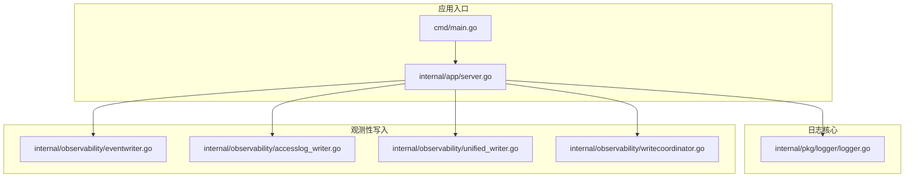
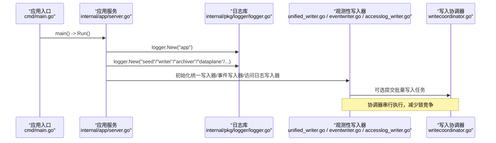
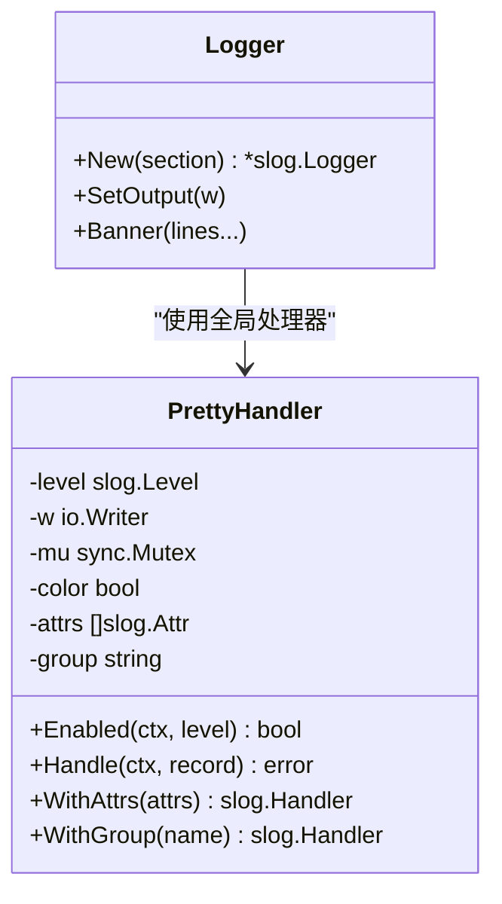
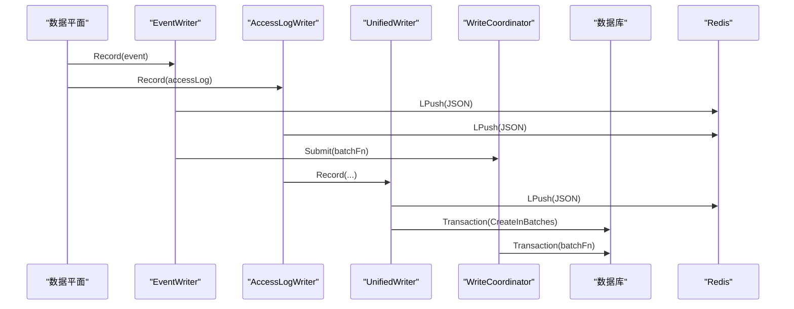
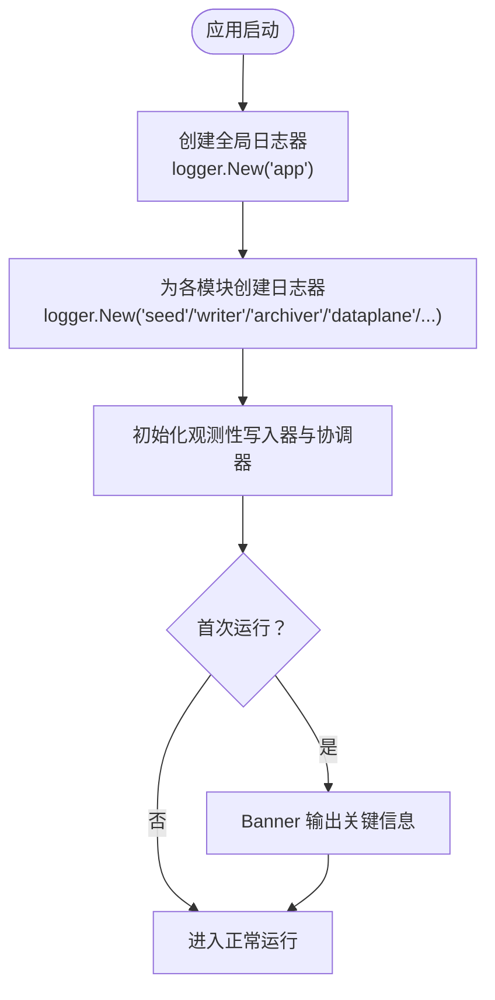
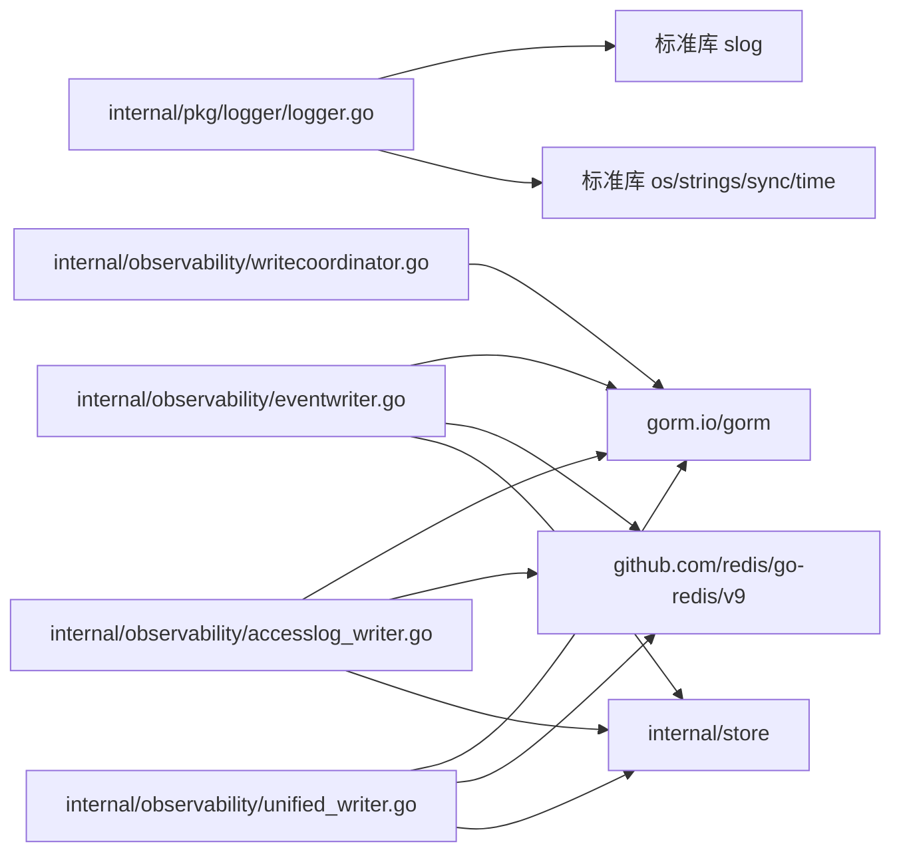

# 日志管理系统

<cite>
**本文引用的文件列表**
- [internal/pkg/logger/logger.go](file://internal/pkg/logger/logger.go)
- [internal/observability/accesslog_writer.go](file://internal/observability/accesslog_writer.go)
- [internal/observability/eventwriter.go](file://internal/observability/eventwriter.go)
- [internal/observability/unified_writer.go](file://internal/observability/unified_writer.go)
- [internal/observability/writecoordinator.go](file://internal/observability/writecoordinator.go)
- [internal/app/server.go](file://internal/app/server.go)
- [cmd/main.go](file://cmd/main.go)
- [docs/监控与可观测性/监控与可观测性.md](file://docs/监控与可观测性/监控与可观测性.md)
- [docs/故障排除.md](file://docs/故障排除.md)
</cite>

## 目录
1. [简介](#简介)
2. [项目结构](#项目结构)
3. [核心组件](#核心组件)
4. [架构总览](#架构总览)
5. [详细组件分析](#详细组件分析)
6. [依赖关系分析](#依赖关系分析)
7. [性能考量](#性能考量)
8. [故障排除指南](#故障排除指南)
9. [结论](#结论)
10. [附录](#附录)

## 简介
本文件面向日志管理系统，围绕基于 Go 标准库 slog 的结构化日志实现展开，覆盖日志级别配置、格式标准化、彩色输出、处理器初始化、全局日志器创建与模块集成方式，并详细说明日志存储策略（标准输出、文件重定向、集中式日志系统对接）。同时提供配置参数说明、性能优化建议、调试技巧、日志级别选择指南、生产环境配置建议以及日志分析方法。

## 项目结构
日志系统在本仓库中的组织方式如下：
- 核心日志库位于 internal/pkg/logger，提供基于 slog 的全局单例处理器与统一格式化输出。
- 观测性子系统（internal/observability）负责将各类可观测数据（安全事件、访问日志、丢弃事件、机器人评分）写入数据库与 Redis，并通过统一协调器降低 SQLite 锁竞争。
- 应用入口在 cmd/main.go，实际运行逻辑在 internal/app/server.go，其中初始化并使用日志模块。

**图表来源**
- [internal/pkg/logger/logger.go:1-286](file://internal/pkg/logger/logger.go#L1-L286)
- [internal/observability/eventwriter.go:1-164](file://internal/observability/eventwriter.go#L1-L164)
- [internal/observability/accesslog_writer.go:1-137](file://internal/observability/accesslog_writer.go#L1-L137)
- [internal/observability/unified_writer.go:1-232](file://internal/observability/unified_writer.go#L1-L232)
- [internal/observability/writecoordinator.go:1-130](file://internal/observability/writecoordinator.go#L1-L130)
- [cmd/main.go:1-10](file://cmd/main.go#L1-L10)
- [internal/app/server.go:1-200](file://internal/app/server.go#L1-L200)

**章节来源**
- [cmd/main.go:1-10](file://cmd/main.go#L1-L10)
- [internal/app/server.go:52-120](file://internal/app/server.go#L52-L120)

## 核心组件
- 全局日志器与处理器
  - 通过 init() 创建全局处理器，使用标准输出、解析环境变量决定日志级别与是否启用彩色输出。
  - 提供 New(section) 返回带“section”标签的 slog.Logger 实例，所有模块共享同一全局处理器，确保输出一致性。
  - 提供 SetOutput(w) 用于测试替换输出目标。
- PrettyHandler
  - 实现 slog.Handler 接口，负责格式化输出：时间戳、级别徽章、section 标签、消息正文与键值对属性。
  - 支持可选的 ANSI 彩色输出，按级别着色。
- Banner
  - 用于首次运行的关键信息提示，不受日志级别影响，始终打印。

**章节来源**
- [internal/pkg/logger/logger.go:31-76](file://internal/pkg/logger/logger.go#L31-L76)
- [internal/pkg/logger/logger.go:80-203](file://internal/pkg/logger/logger.go#L80-L203)
- [internal/pkg/logger/logger.go:251-285](file://internal/pkg/logger/logger.go#L251-L285)

## 架构总览
日志系统采用“全局处理器 + 模块化日志器”的设计，配合观测性写入组件实现高性能、低阻塞的日志持久化路径。

**图表来源**
- [cmd/main.go:7-9](file://cmd/main.go#L7-L9)
- [internal/app/server.go:52-120](file://internal/app/server.go#L52-L120)
- [internal/pkg/logger/logger.go:42-46](file://internal/pkg/logger/logger.go#L42-L46)
- [internal/observability/unified_writer.go:37-52](file://internal/observability/unified_writer.go#L37-L52)
- [internal/observability/eventwriter.go:38-51](file://internal/observability/eventwriter.go#L38-L51)
- [internal/observability/accesslog_writer.go:31-43](file://internal/observability/accesslog_writer.go#L31-L43)
- [internal/observability/writecoordinator.go:28-39](file://internal/observability/writecoordinator.go#L28-L39)

## 详细组件分析

### 组件一：全局日志器与处理器（internal/pkg/logger）
- 初始化流程
  - 在 init() 中仅一次创建全局处理器，使用 os.Stdout、解析日志级别与颜色开关。
  - New(section) 返回的每个日志器都共享同一全局处理器，内部通过 slog.With 添加“section”标签。
- PrettyHandler 输出格式
  - 时间戳：固定格式，毫秒级。
  - 级别徽章：按 ERROR/WARN/INFO/DEBUG 着色显示。
  - section 标签：从预附着属性中提取，若存在则以方括号形式展示。
  - 消息正文与键值对属性：逐项渲染，字符串值若含空格/引号等特殊字符会加引号。
  - 彩色输出：根据 useColor() 判断是否启用 ANSI 颜色。
- Banner
  - 用于首次运行的关键信息提示，不受日志级别影响，始终打印。

**图表来源**
- [internal/pkg/logger/logger.go:31-76](file://internal/pkg/logger/logger.go#L31-L76)
- [internal/pkg/logger/logger.go:80-203](file://internal/pkg/logger/logger.go#L80-L203)
- [internal/pkg/logger/logger.go:251-285](file://internal/pkg/logger/logger.go#L251-L285)

**章节来源**
- [internal/pkg/logger/logger.go:36-46](file://internal/pkg/logger/logger.go#L36-L46)
- [internal/pkg/logger/logger.go:97-180](file://internal/pkg/logger/logger.go#L97-L180)
- [internal/pkg/logger/logger.go:205-249](file://internal/pkg/logger/logger.go#L205-L249)

### 组件二：观测性写入器（internal/observability）
- EventWriter
  - 将安全事件写入数据库，同时可选写入 Redis，保证热路径不被阻塞。
  - 支持通过 WriteCoordinator 串行化 DB 写入，避免 SQLite 锁竞争。
- AccessLogWriter
  - 将访问日志写入数据库，同时可选写入 Redis，具备缓冲与定时刷新能力。
- UnifiedWriter
  - 统一接收多种可观测数据类型，定时批量写入数据库，且可选写入 Redis。
  - 使用单个 goroutine 汇聚多通道，减少锁竞争。
- WriteCoordinator
  - 将多个写入任务聚合为批，在单事务内顺序执行，提升吞吐并降低失败风险。

**图表来源**
- [internal/observability/eventwriter.go:64-139](file://internal/observability/eventwriter.go#L64-L139)
- [internal/observability/accesslog_writer.go:54-117](file://internal/observability/accesslog_writer.go#L54-L117)
- [internal/observability/unified_writer.go:60-155](file://internal/observability/unified_writer.go#L60-L155)
- [internal/observability/writecoordinator.go:44-129](file://internal/observability/writecoordinator.go#L44-L129)

**章节来源**
- [internal/observability/eventwriter.go:19-79](file://internal/observability/eventwriter.go#L19-L79)
- [internal/observability/accesslog_writer.go:19-60](file://internal/observability/accesslog_writer.go#L19-L60)
- [internal/observability/unified_writer.go:16-52](file://internal/observability/unified_writer.go#L16-L52)
- [internal/observability/writecoordinator.go:11-50](file://internal/observability/writecoordinator.go#L11-L50)

### 组件三：应用集成与模块化使用（internal/app/server.go）
- 应用启动时创建全局日志器，并为不同模块分配“section”，便于日志检索与审计。
- 初始化观测性写入器与协调器，统一处理安全事件、访问日志、丢弃事件与机器人评分。
- 首次运行时使用 Banner 输出关键信息（不受日志级别影响）。

**图表来源**
- [internal/app/server.go:52-120](file://internal/app/server.go#L52-L120)
- [internal/pkg/logger/logger.go:42-46](file://internal/pkg/logger/logger.go#L42-L46)
- [internal/pkg/logger/logger.go:251-285](file://internal/pkg/logger/logger.go#L251-L285)

**章节来源**
- [internal/app/server.go:52-120](file://internal/app/server.go#L52-L120)

## 依赖关系分析
- 日志库依赖
  - 仅依赖标准库 log/slog、os、strings、sync、time，保持轻量与可移植性。
- 观测性写入器依赖
  - 依赖 gorm.io/gorm、github.com/redis/go-redis/v9，以及内部 store 与 repository。
- 应用集成
  - 应用入口仅通过 internal/app/server.go 引入日志库与观测性组件，模块化清晰。

**图表来源**
- [internal/pkg/logger/logger.go:3-12](file://internal/pkg/logger/logger.go#L3-L12)
- [internal/observability/eventwriter.go:3-15](file://internal/observability/eventwriter.go#L3-L15)
- [internal/observability/accesslog_writer.go:3-15](file://internal/observability/accesslog_writer.go#L3-L15)
- [internal/observability/unified_writer.go:3-14](file://internal/observability/unified_writer.go#L3-L14)
- [internal/observability/writecoordinator.go:3-9](file://internal/observability/writecoordinator.go#L3-L9)

**章节来源**
- [internal/pkg/logger/logger.go:3-12](file://internal/pkg/logger/logger.go#L3-L12)
- [internal/observability/eventwriter.go:3-15](file://internal/observability/eventwriter.go#L3-L15)
- [internal/observability/accesslog_writer.go:3-15](file://internal/observability/accesslog_writer.go#L3-L15)
- [internal/observability/unified_writer.go:3-14](file://internal/observability/unified_writer.go#L3-L14)
- [internal/observability/writecoordinator.go:3-9](file://internal/observability/writecoordinator.go#L3-L9)

## 性能考量
- 日志级别与输出
  - 通过环境变量 MY_OPENWAF_LOG_LEVEL 设置 DEBUG/INFO/WARN/ERROR，未设置默认 INFO。
  - 通过 MY_OPENWAF_LOG_COLOR 控制是否启用彩色输出；未设置时自动检测 stdout 是否为终端设备。
- PrettyHandler
  - 使用 strings.Builder 拼接输出，减少字符串分配；输出前加互斥锁，保证并发安全。
- 观测性写入器
  - 使用带缓冲的通道与定时器，批量写入数据库，降低 IO 压力。
  - EventWriter 与 AccessLogWriter 支持 Redis 双写，满足实时消费场景。
  - UnifiedWriter 将多类可观测数据统一写入，减少事务次数与锁竞争。
  - WriteCoordinator 将多个写入任务聚合为批，在单事务内顺序执行，提升吞吐并降低失败风险。

**章节来源**
- [internal/pkg/logger/logger.go:53-76](file://internal/pkg/logger/logger.go#L53-L76)
- [internal/pkg/logger/logger.go:97-180](file://internal/pkg/logger/logger.go#L97-L180)
- [internal/observability/eventwriter.go:38-79](file://internal/observability/eventwriter.go#L38-L79)
- [internal/observability/accesslog_writer.go:31-60](file://internal/observability/accesslog_writer.go#L31-L60)
- [internal/observability/unified_writer.go:37-52](file://internal/observability/unified_writer.go#L37-L52)
- [internal/observability/writecoordinator.go:28-50](file://internal/observability/writecoordinator.go#L28-L50)

## 故障排除指南
- 日志级别与输出
  - 支持 DEBUG/INFO/WARN/ERROR，可通过环境变量设置级别与颜色开关。
  - Banner 用于首次运行的关键信息提示，不受日志级别影响。
- 关键信息提取
  - section 标签：区分 app、seed、events、archiver、dataplane 等模块。
  - 错误上下文：err 字段、站点 ID、绑定地址、TLS 开关、指纹等。
- 问题定位方法
  - 以“section=app”为起点，逐步定位到具体模块（如 dataplane、events）。
  - 结合 /status 中的 revision、sites、listeners 字段判断配置是否已生效。
  - 结合 /metrics 中的错误与拦截趋势，缩小问题范围。

**章节来源**
- [docs/故障排除.md:298-328](file://docs/故障排除.md#L298-L328)
- [internal/pkg/logger/logger.go:53-76](file://internal/pkg/logger/logger.go#L53-L76)
- [internal/pkg/logger/logger.go:251-285](file://internal/pkg/logger/logger.go#L251-L285)

## 结论
本日志管理系统以标准库 slog 为基础，通过全局处理器与模块化日志器实现统一、可配置、可扩展的日志输出；结合观测性写入器与协调器，实现了高吞吐、低阻塞的数据持久化路径。生产环境中建议通过环境变量控制日志级别与颜色，结合文件重定向或集中式日志系统进行采集与分析，并利用 section 标签与 Banner 提升可观测性与可维护性。

## 附录

### 日志配置参数说明
- MY_OPENWAF_LOG_LEVEL
  - 作用：设置日志级别（DEBUG/INFO/WARN/ERROR），未设置默认 INFO。
  - 来源：解析环境变量并转换为 slog.Level。
- MY_OPENWAF_LOG_COLOR
  - 作用：控制是否启用彩色输出（1 或 true 启用；未设置时自动检测 stdout 是否为终端设备）。
  - 来源：useColor() 根据环境变量或终端设备类型判断。

**章节来源**
- [internal/pkg/logger/logger.go:53-76](file://internal/pkg/logger/logger.go#L53-L76)
- [internal/pkg/logger/logger.go:66-76](file://internal/pkg/logger/logger.go#L66-L76)

### 日志级别选择指南
- 开发/调试：DEBUG，获取最详细的信息。
- 生产：INFO，记录关键运行状态与异常。
- 仅关注异常：WARN/ERROR，聚焦告警与错误。

**章节来源**
- [docs/监控与可观测性/监控与可观测性.md:426-432](file://docs/监控与可观测性/监控与可观测性.md#L426-L432)

### 生产环境配置建议
- 输出重定向
  - 将标准输出重定向到文件，或通过容器/系统日志服务采集。
- 集中式日志系统对接
  - 通过日志代理（如 Fluent Bit/Filebeat）采集文件或标准输出，发送至集中式日志平台（如 ELK、Loki、Splunk）。
- 日志轮转
  - 使用系统自带的日志轮转工具（如 logrotate）或第三方方案，避免单文件过大。
- 级别与颜色
  - 生产环境建议关闭彩色输出，避免非终端设备无法正确显示。

**章节来源**
- [docs/监控与可观测性/监控与可观测性.md:425-432](file://docs/监控与可观测性/监控与可观测性.md#L425-L432)

### 日志分析方法
- 结构化字段
  - 利用 section 标签快速过滤模块；结合 err、站点 ID、请求 ID 等字段定位问题。
- 时间序列
  - 结合 /metrics 与 /status 的运行时信息，分析错误趋势与拦截情况。
- 实时消费
  - 通过 Redis 列表（如 openwaf:security_events、openwaf:access_logs）实现实时消费与可视化。

**章节来源**
- [docs/故障排除.md:298-328](file://docs/故障排除.md#L298-L328)
- [internal/observability/unified_writer.go:157-213](file://internal/observability/unified_writer.go#L157-L213)
- [internal/observability/accesslog_writer.go:119-137](file://internal/observability/accesslog_writer.go#L119-L137)