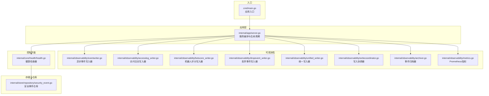
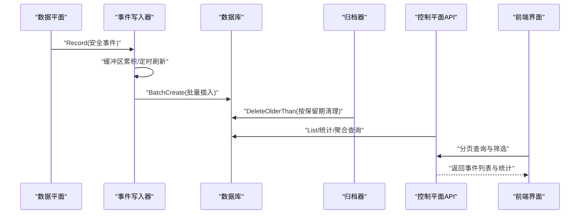
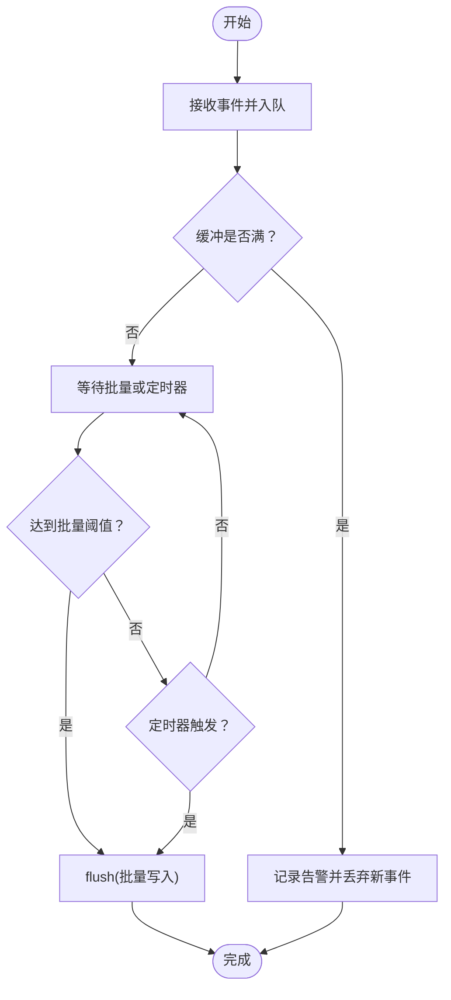
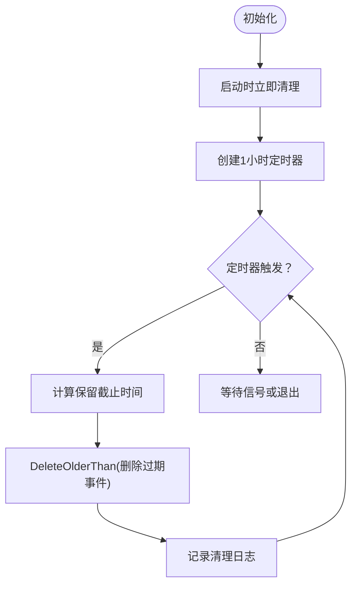
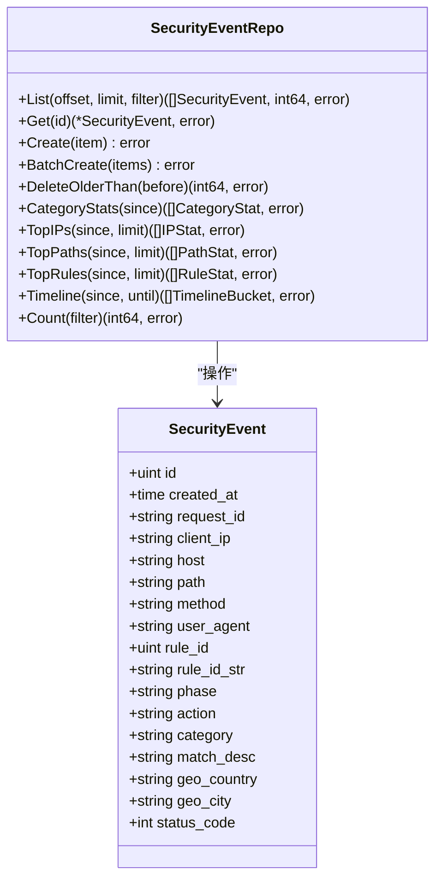
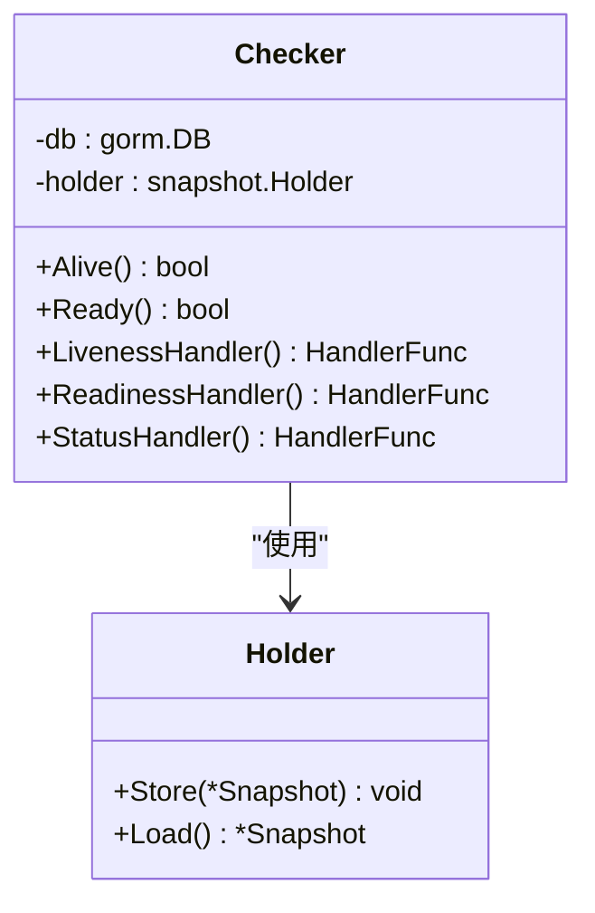
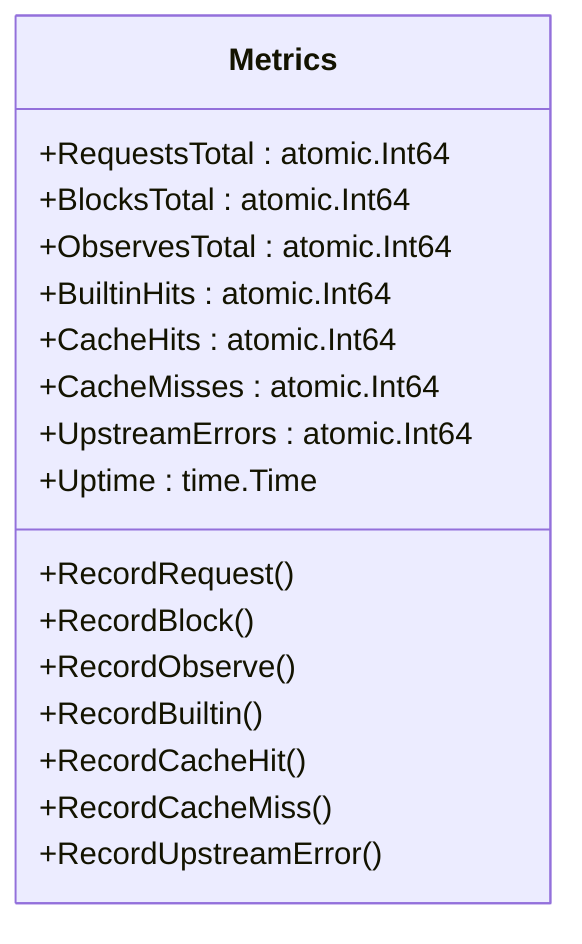
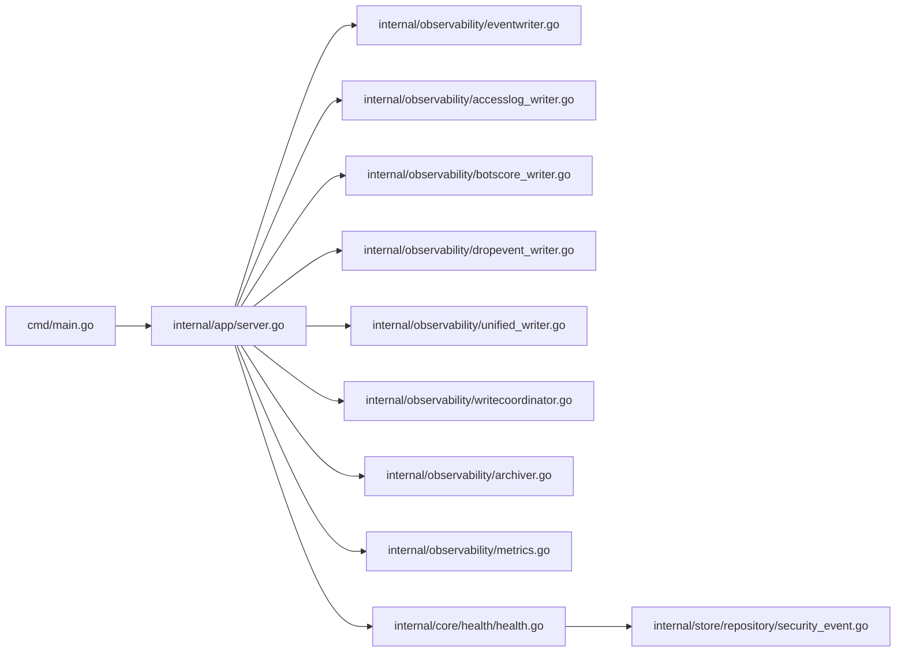

# 监控与可观测性

<cite>
**本文档引用的文件**
- [internal/observability/archiver.go](file://internal/observability/archiver.go)
- [internal/observability/metrics.go](file://internal/observability/metrics.go)
- [internal/observability/eventwriter.go](file://internal/observability/eventwriter.go)
- [internal/observability/accesslog_writer.go](file://internal/observability/accesslog_writer.go)
- [internal/observability/botscore_writer.go](file://internal/observability/botscore_writer.go)
- [internal/observability/dropevent_writer.go](file://internal/observability/dropevent_writer.go)
- [internal/observability/unified_writer.go](file://internal/observability/unified_writer.go)
- [internal/observability/writecoordinator.go](file://internal/observability/writecoordinator.go)
- [internal/core/health/health.go](file://internal/core/health/health.go)
- [internal/app/server.go](file://internal/app/server.go)
- [internal/store/repository/security_event.go](file://internal/store/repository/security_event.go)
- [docs/监控与可观测性/事件归档系统.md](file://docs/监控与可观测性/事件归档系统.md)
- [docs/监控与可观测性/健康检查机制.md](file://docs/监控与可观测性/健康检查机制.md)
- [docs/监控与可观测性/安全事件记录.md](file://docs/监控与可观测性/安全事件记录.md)
- [docs/监控与可观测性/性能指标收集.md](file://docs/监控与可观测性/性能指标收集.md)
</cite>

> [返回 docs 首页](../index.md)

## 模块概述

`监控与可观测性` 模块为 My-OpenWaf 提供全栈可观测能力，覆盖**系统健康探针、结构化日志、安全事件生命周期管理、Prometheus 性能指标**四大子系统。整体采用"异步写入 + 周期归档 + 实时指标"的分层架构：数据平面产生的事件经缓冲批量写入数据库，归档器按保留策略定期清理，同时控制面暴露 `/metrics`、`/healthz`、`/readyz`、`/status` 等探针供外部监控系统采集。

## 子页面分类索引

### 系统健康与诊断
| 子页面 | 一句话摘要 |
|--------|-----------|
| [健康检查机制](./健康检查机制.md) | 提供存活探针 `/healthz`、就绪探针 `/readyz` 与状态查询 `/status`，结合生命周期管理与优雅关闭策略，确保服务运行状态可感知、可控制。 |
| [日志管理系统](./日志管理系统.md) | 基于 Go 标准库 `slog` 构建结构化日志体系，支持模块化日志器、彩色输出、观测性写入器与写入协调器，实现高吞吐低阻塞的日志持久化。 |

### 事件生命周期管理
| 子页面 | 一句话摘要 |
|--------|-----------|
| [安全事件记录](./安全事件记录.md) | 描述安全事件的异步批量写入机制（EventWriter）、写入协调器（WriteCoordinator）、数据模型与索引设计，以及管理 API 的分页查询与前端展示。 |
| [事件归档系统](./事件归档系统.md) | 围绕安全事件的存储、归档、检索与运维管理，涵盖保留策略、归档调度、数据迁移、版本兼容、存储容量规划与备份恢复流程。 |

### 性能监控与指标
| 子页面 | 一句话摘要 |
|--------|-----------|
| [性能指标收集](./性能指标收集.md) | 梳理控制面 Prometheus 指标暴露、数据面实时 QPS 与状态码统计、阻断事件与机器人检测指标，以及 Grafana 可视化与告警规则配置。 |

## 目录
1. [简介](#简介)
2. [项目结构](#项目结构)
3. [核心组件](#核心组件)
4. [架构总览](#架构总览)
5. [详细组件分析](#详细组件分析)
6. [依赖关系分析](#依赖关系分析)
7. [性能考虑](#性能考虑)
8. [故障排除指南](#故障排除指南)
9. [结论](#结论)
10. [附录](#附录)

## 简介
本文件为监控与可观测性系统的综合技术文档，围绕事件归档系统、健康检查机制、安全事件记录、性能指标收集与告警配置进行系统化说明。内容涵盖数据保留策略、存储层级设计、归档任务调度、数据迁移与版本兼容、检索优化、配置管理以及备份恢复流程等。

## 项目结构
系统采用分层架构：入口程序启动应用服务，控制平面负责路由与配置，数据平面负责业务处理，可观测性模块负责事件写入与归档，存储层通过 GORM 完成模型持久化与迁移。

**图表来源**
- [internal/app/server.go:52-396](file://internal/app/server.go#L52-L396)
- [internal/observability/eventwriter.go:38-164](file://internal/observability/eventwriter.go#L38-L164)
- [internal/observability/archiver.go:44-154](file://internal/observability/archiver.go#L44-L154)
- [internal/core/health/health.go:20-96](file://internal/core/health/health.go#L20-L96)

**章节来源**
- [internal/app/server.go:52-396](file://internal/app/server.go#L52-L396)

## 核心组件
- 事件写入器：非阻塞异步批量写入，避免数据平面被数据库写入阻塞。
- 归档器：周期性删除超过保留期的历史事件，保障存储空间。
- 仓库层：提供事件列表、统计、聚合与删除等操作。
- 控制平面API：支持分页查询、过滤、统计与时间线聚合。
- 前端界面：展示事件列表、统计卡片与分页导航。
- 健康检查：提供存活探针、就绪探针与状态查询。
- 性能指标：暴露 Prometheus 兼容指标，支持运行时监控。

**章节来源**
- [internal/observability/eventwriter.go:38-164](file://internal/observability/eventwriter.go#L38-L164)
- [internal/observability/archiver.go:44-154](file://internal/observability/archiver.go#L44-L154)
- [internal/store/repository/security_event.go:11-293](file://internal/store/repository/security_event.go#L11-L293)
- [internal/core/health/health.go:20-96](file://internal/core/health/health.go#L20-L96)
- [internal/observability/metrics.go:14-126](file://internal/observability/metrics.go#L14-L126)

## 架构总览
系统在启动时初始化数据库迁移与默认数据，随后启动事件写入器与归档器，并注册控制平面路由。数据平面请求触发事件写入，后台归档器定期清理过期事件；管理员通过 API 查询事件并进行统计分析。

**图表来源**
- [internal/app/server.go:107-118](file://internal/app/server.go#L107-L118)
- [internal/observability/eventwriter.go:80-139](file://internal/observability/eventwriter.go#L80-L139)
- [internal/observability/archiver.go:115-153](file://internal/observability/archiver.go#L115-L153)
- [internal/store/repository/security_event.go:32-46](file://internal/store/repository/security_event.go#L32-L46)

## 详细组件分析

### 事件写入器（EventWriter）
- 设计目标：非阻塞、高吞吐、低延迟，避免数据平面被数据库写入阻塞。
- 关键参数：缓冲通道容量、批量大小、刷新间隔。
- 写入策略：达到批量阈值或定时器触发时批量写入；关闭时清空剩余事件。

**图表来源**
- [internal/observability/eventwriter.go:80-116](file://internal/observability/eventwriter.go#L80-L116)

**章节来源**
- [internal/observability/eventwriter.go:38-164](file://internal/observability/eventwriter.go#L38-L164)

### 归档器（Archiver）
- 保留策略：以天为单位配置，默认30天；到期即删除。
- 调度机制：启动即执行一次清理，随后每小时检查一次。
- 清理逻辑：计算截止时间并删除早于该时间的事件，记录清理数量与时间。

**图表来源**
- [internal/observability/archiver.go:83-99](file://internal/observability/archiver.go#L83-L99)

**章节来源**
- [internal/observability/archiver.go:44-154](file://internal/observability/archiver.go#L44-L154)

### 仓库层与数据模型
- 仓库接口：提供分页列表、单条查询、批量创建、按时间删除、统计与聚合等方法。
- 过滤条件：支持动作、阶段、类别、客户端IP、Host、路径、规则ID及时间范围。
- 数据模型：安全事件包含请求标识、客户端IP、Host、路径、方法、UA、规则信息、地理信息、状态码等字段，并带有多种索引。

**图表来源**
- [internal/store/repository/security_event.go:11-293](file://internal/store/repository/security_event.go#L11-L293)

**章节来源**
- [internal/store/repository/security_event.go:11-293](file://internal/store/repository/security_event.go#L11-L293)

### 健康检查机制
- 存活探针（/healthz）：进程可达即健康
- 就绪探针（/readyz）：必须满足配置快照已加载且数据库连接可ping通
- 状态查询（/status）：返回运行时指标（goroutine数、堆内存、站点数、监听器数等）

**图表来源**
- [internal/core/health/health.go:14-96](file://internal/core/health/health.go#L14-L96)

**章节来源**
- [internal/core/health/health.go:20-96](file://internal/core/health/health.go#L20-L96)

### 性能指标收集
- 控制面指标：通过 Prometheus 兼容的 `/metrics` 暴露，包含进程级运行时指标与 WAF 行为计数
- 数据面指标：在请求处理链路中实时统计，提供 QPS、状态码分布、WAF 命中等
- 指标类型：计数器（counter）与仪表（gauge）

**图表来源**
- [internal/observability/metrics.go:14-49](file://internal/observability/metrics.go#L14-L49)

**章节来源**
- [internal/observability/metrics.go:14-126](file://internal/observability/metrics.go#L14-L126)

## 依赖关系分析

**图表来源**
- [internal/app/server.go:52-396](file://internal/app/server.go#L52-L396)
- [internal/observability/eventwriter.go:38-164](file://internal/observability/eventwriter.go#L38-L164)
- [internal/observability/archiver.go:44-154](file://internal/observability/archiver.go#L44-L154)
- [internal/core/health/health.go:20-96](file://internal/core/health/health.go#L20-L96)
- [internal/store/repository/security_event.go:11-293](file://internal/store/repository/security_event.go#L11-L293)

**章节来源**
- [internal/app/server.go:52-396](file://internal/app/server.go#L52-L396)

## 性能考虑
- 异步写入：事件写入器使用缓冲通道与批量刷新，降低数据库写入压力，提升数据平面吞吐。
- 归档频率：每小时清理一次，兼顾及时释放空间与减少数据库扫描开销。
- 查询优化：仓库层提供多字段索引与分页查询，统计与聚合查询使用分组与限制，避免全表扫描。
- 前端分页：页面大小上限与偏移计算，防止超大查询导致内存与网络压力。
- 写入协调：WriteCoordinator 串行化 DB 写入，避免 SQLite 锁争用。
- 统一写入：UnifiedWriter 单 goroutine 批量写入，消除 SQLite 锁竞争。

## 故障排除指南
- 事件丢失：检查事件写入器缓冲是否溢出，关注告警日志；适当增大缓冲或调整批量大小与刷新间隔。
- 归档异常：查看归档器错误日志，确认数据库连接与权限；检查保留天数配置是否合理。
- 查询缓慢：确认过滤条件是否命中索引；避免使用通配符开头的LIKE查询；合理设置分页大小。
- 健康检查失败：检查快照加载状态与数据库 Ping 结果；确认 Redis 连接可用性。
- 指标异常：检查 Admin 服务是否正确注册 `/metrics` 路由；确认 Prometheus 抓取目标可达。
- 写入性能问题：检查 WriteCoordinator 队列是否溢出；优化批量大小与刷新间隔。

**章节来源**
- [internal/observability/eventwriter.go:65-72](file://internal/observability/eventwriter.go#L65-L72)
- [internal/observability/archiver.go:115-153](file://internal/observability/archiver.go#L115-L153)
- [internal/core/health/health.go:28-38](file://internal/core/health/health.go#L28-L38)
- [internal/observability/metrics.go:52-125](file://internal/observability/metrics.go#L52-L125)

## 结论
监控与可观测性系统通过异步写入与周期性归档实现高吞吐与低成本存储；健康检查机制提供可靠的运行状态监控；性能指标收集支持 Prometheus 兼容的监控体系；事件归档系统提供完善的查询与统计能力。建议结合业务量与存储成本动态调整保留期、批量大小与刷新间隔，确保系统稳定与性能平衡。

## 附录

### 配置管理要点
- 保留策略：通过归档器构造函数传入保留天数，默认30天；可在部署层面调整。
- 存储空间管理：归档器按保留期定期清理，建议监控磁盘使用率并设置告警。
- 清理规则：基于创建时间字段删除，支持定时任务与手动触发清理。
- 健康检查配置：数据库驱动、DSN、Redis 地址、检查间隔等。

**章节来源**
- [internal/observability/archiver.go:44-66](file://internal/observability/archiver.go#L44-L66)
- [internal/core/health/health.go:20-96](file://internal/core/health/health.go#L20-L96)

### 数据检索优化
- 索引策略：事件模型包含多个索引字段（如创建时间、请求ID、客户端IP、规则ID等），仓库层查询自动利用索引。
- 查询性能：分页查询使用OFFSET/LIMIT，统计与聚合使用GROUP BY与LIMIT，避免全表扫描。
- 分页机制：统一的分页计算函数，限制最大页面大小，确保查询稳定性。

**章节来源**
- [internal/store/repository/security_event.go:257-293](file://internal/store/repository/security_event.go#L257-L293)

### 备份与恢复流程
- 备份：建议使用数据库原生命令或第三方工具定期备份；迁移脚本会自动为旧表添加备份后缀，便于回滚。
- 恢复：从备份文件恢复数据库后，重新启动应用；应用启动时会执行自动迁移，确保模型与数据一致。

**章节来源**
- [internal/app/server.go:63-66](file://internal/app/server.go#L63-L66)

### 监控告警配置示例
- 健康检查告警：/readyz 503 持续超过阈值触发告警
- 性能告警：QPS 突增/突降、阻断率超过阈值、上游错误率异常
- 资源告警：goroutine 数过高、内存增长过快、磁盘空间不足
- 事件告警：安全事件数量异常波动、特定规则命中激增

**章节来源**
- [internal/core/health/health.go:25-94](file://internal/core/health/health.go#L25-L94)
- [internal/observability/metrics.go:52-125](file://internal/observability/metrics.go#L52-L125)